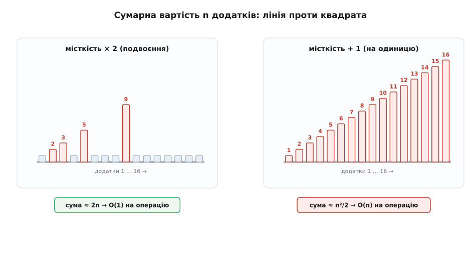
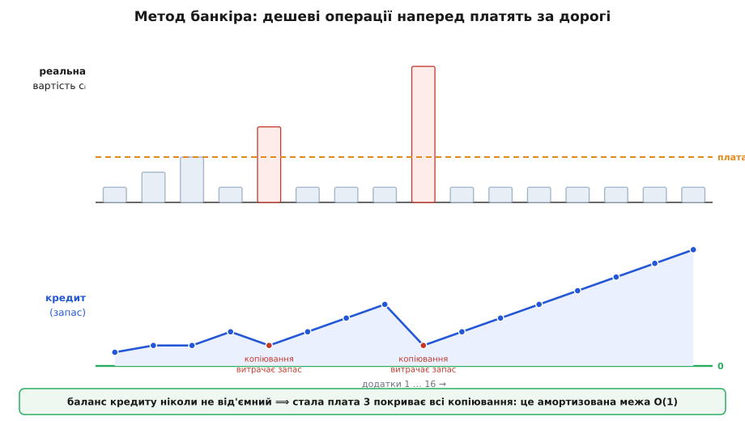

# Амортизований аналіз

<preknowlist>
- [Асимптотична складність](book:algorithms/asymptotic-complexity) — що означають O(1), O(n), O(n²) і як міряють вартість однієї операції в найгіршому разі.
</preknowlist>

Уяви структуру даних, яку ти смикаєш тисячі разів поспіль: додаєш елемент, ще один, ще один. Майже завжди це коштує копійки — записав у вільну комірку й пішов далі. Але зрідка операція раптом дорожчає в рази: структура переросла себе й мусить перебудуватися. Скільки ж коштує вся тисяча операцій разом?

Найпростіша відповідь бере найдорожчу поодиноку операцію й множить на їхню кількість. Якщо один додаток у найгіршому разі коштує O(n), то n додатків — O(n²). Межа чесна, та здебільшого вона бреше пересадом: дороге **не може** ставатися щоразу. Перебудова щойно сталася — отже, наступні сотні додатків знову дешеві, аж поки структура не доросте до наступної межі. Множити рідкісний спалах на кожну операцію — це рахувати так, ніби найгірше трапляється безперервно, а воно фізично не трапляється.

Амортизований аналіз (від латин. *ad* — «до» і *mors, mortis* — «смерть»; через старофранцузьке *amortir* — «погасити, умертвити борг», у бухгалтерії — поступово списувати велику вартість малими частками) саме про це. Він міряє **середню вартість операції в довгій послідовності**, розмазуючи рідкісні дорогі сплески по багатьох дешевих сусідах. І, що найважливіше, робить це **без жодної ймовірності** — не «зазвичай дешево, якщо пощастить», а тверда межа на суму, хоч який лихий порядок операцій ти вигадаєш.

## Найгірша операція проти найгіршої послідовності

Уся річ у тім, **над чим** брати найгірший випадок. Класичний аналіз бере його над однією операцією: яка найдорожча дія можлива? Амортизований бере найгірший випадок над **цілою послідовністю**: яка найдорожча буває тисяча дій підряд? — а тоді ділить на тисячу. Різниця — не косметична. Дорога операція мусить спершу «накопичити умови» для себе, і саме на це накопичення пішли дешеві сусіди, яких класичний аналіз при множенні порахував так, ніби вони теж дорогі.

Найкраще це видно на структурі, яку ти вживаєш щодня, часто не думаючи, як вона влаштована, — на масиві, що росте.

## Масив, що росте: агрегатний метод

Динамічний масив (у C++ — `vector`, у Python — `list`, у Go — зріз) тримає елементи в одному суцільному блоці пам'яті. Блок має фіксований розмір, тож рано чи пізно він заповнюється. Що тоді? Не можна просто «дописати за кінцем» — там уже чужа пам'ять. Доводиться взяти **більший** блок, **скопіювати туди все** старе й лише потім додати новий елемент.

```c
typedef struct {
    int *data;      // блок пам'яті під елементи
    int  len;       // скільки зайнято
    int  cap;       // скільки вміщає
} Vec;

void push(Vec *v, int x) {
    if (v->len == v->cap) {                 // місця немає — треба рости
        int newcap = v->cap ? v->cap * 2 : 1;
        int *bigger = malloc(newcap * sizeof(int));
        for (int i = 0; i < v->len; i++)    // ← копіюємо ВСЕ: це O(len)
            bigger[i] = v->data[i];
        free(v->data);
        v->data = bigger;
        v->cap  = newcap;
    }
    v->data[v->len++] = x;                   // дешевий запис: O(1)
}
```

Найдорожчий поодинокий `push` — той, що влучив у переповнення й копіює всі `len` елементів: O(n). Наївно множимо на n додатків — маємо O(n²). Але порахуймо чесно, **скільки всього копіювань** роблять n додатків.

Копіювання стається лише коли масив повний, а місткість щоразу **подвоюється**: 1, 2, 4, 8, …, аж до n. При кожному подвоєнні копіюємо стільки елементів, скільки їх було, тобто попередню місткість. Складімо всі копіювання за n додатків:

```
копіювання при зростанні:  1 + 2 + 4 + 8 + … + n
                        =  2n − 1                (сума геометричної прогресії)
дешеві записи:             n
разом:                     n + (2n − 1)  <  3n   =  O(n)
на одну операцію:          3n / n        =  3     =  O(1)
```

Ось і весь фокус. Сумарна робота n додатків — не O(n²), а O(n), лінійна. Розділивши на n операцій, дістаємо **сталу** середню вартість: амортизований `push` коштує O(1). Цей спосіб — просто скласти всю роботу й поділити на кількість операцій — називають **агрегатним методом** (від латин. *aggregare* — «збирати докупи»). Він найпростіший і часто найшвидший, коли суму легко порахувати наперед.

Секрет — у геометричному ряді. Копіювання дорожчають (кожне вдвічі більше за попереднє), зате стаються вдвічі рідше. Дві тенденції точно врівноважуються, і сума лишається лінійною, бо геометричний ряд, що подвоюється, у сумі дає лише вдвічі більше за свій останній член.

Щоб відчути, наскільки все тримається саме на подвоєнні, замінімо його на зростання «на одиницю»: коли масив повний, беремо блок рівно на один більший. Тепер **кожен** додаток після першого влучає в переповнення й копіює все:

```
копіювання:   1 + 2 + 3 + … + (n−1)  =  n(n−1)/2   =  O(n²)
на операцію:  O(n)   —  жодного виграшу
```

Арифметичний ряд замість геометричного — і замість лінії маємо квадрат. Амортизована вартість підскочила з O(1) до O(n): та сама структура, той самий код, лиш коефіцієнт зростання інший — а поведінка гірша в n разів.

> 🔧 **Навіщо це.** Саме тому кожна реальна реалізація динамічного масиву росте **геометрично**, а не на фіксовану кількість: `std::vector`, `ArrayList`, `list` у Python, зрізи в Go — усі домножують місткість (на 2 або на 1.5). Це не примха, а прямий наслідок амортизованого підрахунку: тільки множник дає O(1) на додаток. Вибереш зростання «на 100 щоразу» — і на великих масивах додавання почне гальмувати квадратично, хоч у коді ніби нічого не зламано. [Робочий динамічний масив із виміром вартості](book:algorithms/amortized-analysis/proj-dynamic-array.md) показує обидва режими на живих числах і чому 1.5 інколи кращий за 2.



*Вартість кожного додатка як стовпчик. При подвоєнні (ліворуч) дорогі копіювання — рідкі сплески на межах місткості 1, 2, 4, 8…, і вся площа (сумарна робота) вкладається в ≈2n. При зростанні на одиницю (праворуч) копіює кожен додаток, стовпчики ростуть сходами, і площа стає трикутником ≈n²/2. Той самий масив, різний коефіцієнт росту — лінія проти квадрата.*

## Метод банкіра: платити наперед

Агрегатний метод дає правильну відповідь, та не завжди інтуїтивно ясно, **звідки** береться стала вартість. Другий погляд робить її відчутною. Замість складати все наприкінці, **бери з кожної операції наперед трохи більше, ніж вона коштує насправді**, а надлишок відкладай у запас — щоб було чим оплатити майбутній дорогий сплеск.

Домовмося брати за кожен `push` **три монети** амортизованої ціни. Дешевий додаток витрачає одну (на власний запис), а дві відкладає в запас. Коли настане переповнення й доведеться копіювати, платимо за копіювання з накопиченого запасу. Питання одне: чи завжди в запасі досить?

Порахуймо на пальцях. Кожен елемент, лягаючи в масив, відкладає дві монети «при собі». До моменту, коли масив із місткістю k заповниться й доведеться копіювати всі k елементів, скільки монет накопичено? Половина елементів (ті, що прийшли після попереднього подвоєння) ще не витрачали свій запас — а їх якраз k/2, і кожен приніс дві монети. Разом k монет — рівно стільки, скільки коштує скопіювати k елементів. Запас точно покриває копіювання й обнуляється, готовий наповнюватися знову.

Оскільки запас **ніколи не йде в мінус**, три монети на операцію — чесна верхня межа реальної середньої вартості. Це **метод банкіра** (його ще звуть обліковим): ти призначаєш кожній операції сталу «ціну з націнкою», доводиш, що накопичений кредит завжди невід'ємний, — і стала ціна автоматично стає амортизованою межею. Не треба сумувати ряди; досить показати, що каса не порожніє.



*Реальна вартість кожного додатка (стовпчики) стрибає: рідкі сплески на переповненнях, решта — по одиниці. Стала амортизована плата (три монети) на дешевих операціях більша за реальну, і різниця осідає в кредиті (лінія балансу). На переповненні кредит різко витрачається, але **ніколи не стає від'ємним** — тож стала плата справді покриває все.*

## Метод потенціалу: запас як функція стану

Метод банкіра ховає одну незручність: монети треба подумки «прикріпляти» до конкретних елементів і стежити, де саме лежить запас. Третій, найпотужніший спосіб прибирає цей облік. Оголосимо весь накопичений запас **єдиним числом**, обчисленим просто зі стану структури, — її **потенціалом** Φ (грец. літера «фі»; від латин. *potentia* — «спроможність», прихована здатність оплатити майбутнє).

Амортизовану вартість операції означують як реальну вартість плюс приріст потенціалу:

```
амортизована вартість:   aᵢ = cᵢ + Φ(Dᵢ) − Φ(Dᵢ₋₁)
сума по n операціях:     Σ aᵢ = Σ cᵢ + Φ(Dₙ) − Φ(D₀)      (проміжні Φ скорочуються)
якщо Φ(Dₙ) ≥ Φ(D₀):      Σ aᵢ ≥ Σ cᵢ
```

Уся середина суми **телескопує** — сусідні Φ гасять одне одного, лишаються тільки крайні. Тож якщо потенціал наприкінці не менший, ніж на старті (а зазвичай беруть Φ ≥ 0 і Φ(D₀) = 0), то сума амортизованих вартостей — чесна верхня межа суми реальних. Далі підбираєш Φ так, щоб дешеві операції трохи його **піднімали** (це й є «відкладання в запас»), а дорогі — різко **опускали** (запас витрачається рівно на дорогу роботу). Для масиву, що росте, годиться Φ = 2·len − cap: після кожного подвоєння він нульовий, а до наступного встигає дорости рівно до вартості копіювання.

Метод потенціалу — той самий банкір, лиш кредит записаний однією формулою від стану, а не розкиданий по елементах. Це робить його головним інструментом для складніших структур, де «прикріпляти монети» вручну надто марудно. [Виведення методу потенціалу з телескопічної суми](book:algorithms/amortized-analysis/math-potential-method.md) розписує, чому вибір Φ довільний, але вдалий вибір дає тісну межу, і як ця сама схема доводить амортизовані оцінки для куп і дерев.

## Головна пастка: це не «середній випадок»

Слово «середня вартість» збиває з пантелику, тож варто прибити цвях одразу. Амортизований аналіз **не має нічого спільного** з аналізом середнього випадку, хоч обидва кажуть «в середньому».

Аналіз середнього випадку усереднює **по розподілу входів**: припускає, що дані випадкові чи типові, і рахує математичне сподівання. Його слабина — вхід не зобов'язаний бути типовим. Зловмисник, що навмисне годує найгіршими даними, розвалює середню оцінку: швидке сортування «в середньому» O(n·log n), але на вже впорядкованому вході легко з'їжджає до O(n²). Середня оцінка — це ставка на ймовірність, і її можна програти.

Амортизована оцінка усереднює зовсім інакше — **по операціях однієї послідовності**, беручи при цьому найгіршу можливу послідовність. Тут **немає випадковості й немає розподілу**: межа тримається для **будь-якого** порядку операцій, який лишень можна вигадати. «Середнє» тут — арифметичне (сума поділена на кількість), а не статистичне (сподівання). Зловмисник безсилий: хоч як він переставляє додатки, тисяча їх коштуватиме O(n), і крапка. Амортизована межа — це гарантія, а не ставка.


*Три способи міряти вартість. Найгірший на операцію — чесний, але надто песимістичний (множить рідкісний сплеск на всі операції). Середній випадок дає тісне число, та спирається на ймовірність входу — зловмисник, що добирає найгірші дані, його ламає. Амортизований бере найгіршу послідовність і ділить на кількість: без ймовірності, тримається для кожного входу. Це детермінована гарантія, а не ставка.*

Ці два «в середньому» трапляється й поєднати. Хеш-таблиця вставляє елемент за амортизований O(1) (рідкісне [перехешування](book:algorithms/hash-table) при рості таблиці розмазується так само, як копіювання масиву) — і водночас спирається на **середній** випадок, бо конкретне число зіткнень залежить від того, наскільки «випадково» хеш розкидав ключі. Тут амортизація ховає вартість росту, а середній випадок — вартість колізій; це різні осі, і плутати їх не можна.

## Коли амортизованого мало

Амортизована межа O(1) чесна — і все ж одну обіцянку вона не дає: що **кожна поодинока** операція буде швидка. Рідкісне копіювання масиву досі коштує O(n); просто, розмазане по багатьох дешевих, воно дешеве **в середньому по пробігу**. Для більшості задач цього досить: важлива сумарна пропускність, а поодинокий сплеск нікого не турбує.

Але не завжди. Уяви звуковий зворотний виклик, що мусить укластися в 5 мілісекунд щоразу, або контур керування дроном, який опитує давачі рівно кожні 2 мс. Тут важлива не середня, а **найгірша поодинока** затримка. Амортизований O(1) таку систему не рятує: на тому єдиному додатку, що влучив у переповнення й копіює мільйон елементів, callback пропустить дедлайн — і буде чутний тріск або смикнеться апарат, дарма що «в середньому все чудово».

> 🔧 **Навіщо це.** У [системах реального часу](book:algorithms/real-time-systems) амортизовані структури треба вживати з осторогою: тебе цікавить стеля кожної операції, а не її середнє. Рятують два прийоми. Перший — **резервувати пам'ять наперед** (`reserve` місткості), щоб зростання взагалі не трапилося в гарячому циклі. Другий — **деамортизація**: розмазати дороге копіювання на багато дрібних кроків уручну (при кожному додатку переносити не весь масив, а кілька старих елементів), перетворивши амортизований O(1) на справжній O(1) на **кожну** операцію ціною трохи більшої сталої. Амортизація чудова для пропускності й підступна для затримки — і знати цю межу так само важливо, як і саму оцінку.

## Звідки це взялося

Розмазувати рідкісні дорогі кроки навчилися задовго до того, як прийом дістав ім'я: агрегатний підрахунок трапляється ще в підручнику Ахо, Гопкрофта й Ульмана 1974 року, а «платити наперед» застосовували у 1980-х для B-дерев і злиття списків. Але систематичним, з методом потенціалу як головним інструментом, аналіз зробив [Роберт Тар'ян у статті 1985 року](book:algorithms/amortized-analysis/hist-amortized.md) «Amortized Computational Complexity» — там же він і закріпив назву, позичену з бухгалтерії. Ідею потенціалу Тар'ян приписує Денієлові Слейтору, з яким вони застосували її до самоврівноважних дерев (splay trees). Відтоді амортизований аналіз — стандартний спосіб чесно оцінити структури, чия сила саме в тому, що зрідка вони працюють важко, зате майже завжди — легко.

Той самий прийом розкриває справжню вартість багатьох робочих коней алгоритміки, чия поодинока операція лякає, а пробіг — ні: [об'єднання множин зі стисненням шляхів](book:algorithms/union-find) дає майже сталу вартість на операцію попри страшні поодинокі випадки; купа Фібоначчі й самоврівноважні дерева стоять на амортизованих оцінках. Наступного разу, коли структура «інколи гальмує», не поспішай множити той сплеск на все. Спитай інакше: скільки коштує **вся** послідовність — і чи не оплатили вже дешеві сусіди той рідкісний дорогий крок наперед?
