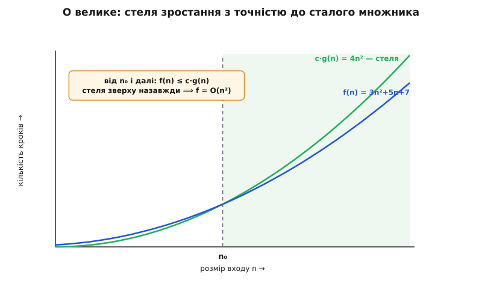
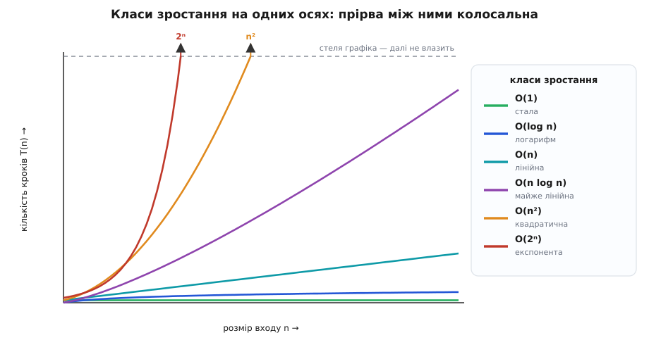
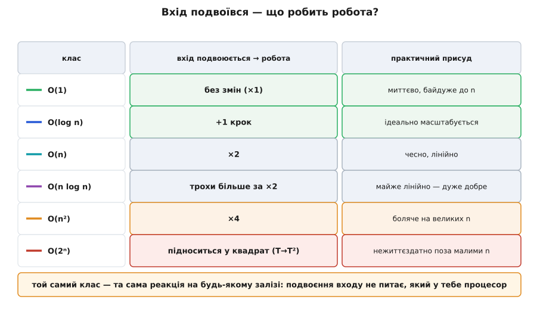

# Асимптотична складність (нотація O великого)

<preknowlist>
- [Двійковий логарифм](book:math/binary-logarithm) — що таке log₂ n і чому багаторазове ділення входу навпіл дає саме логарифм кроків.
</preknowlist>

Ти написав дві програми, що роблять те саме, — скажімо, перевіряють, чи є у списку два однакові елементи. Одна на твоєму ноутбуку відпрацьовує за мілісекунду, друга за дві. Котра краща? Чесно кажучи, із цього виміру ти не знаєш нічого. Заміряй ту саму пару на іншій машині, іншою мовою, на іншому вході — і порядок легко перевернеться. Секунди залежать від заліза, компілятора й настрою операційної системи; про сам алгоритм вони мовчать.

А проте одне питання про алгоритм має відповідь, яка не залежить ні від машини, ні від мови: коли вхід росте, як росте робота? Подвой список — програма стане повільнішою вдвічі? Вчетверо? Чи майже не відчує різниці? Оця залежність «скільки роботи від розміру входу» переживає зміну заліза, бо описує не конкретний прогін, а сам спосіб рахувати. Її й називають асимптотичною складністю (асимптота — від гр. *asýmptōtos*, «незбіжний», той, що наближається, не торкаючись: нас цікавить поведінка на дедалі більших n, у нескінченному хвості значень), а записують нотацією, яку ти напевно вже бачив, — **O велике**.

## Рахуємо кроки, а не секунди

Щоб говорити про алгоритм окремо від заліза, перестаємо міряти час і починаємо рахувати **кроки** — елементарні дії (порівняння, додавання, звертання до комірки пам'яті), кожна з яких коштує приблизно однаково. Скільки таких кроків алгоритм зробить, залежить від розміру входу; його позначають **n** — довжина списку, кількість вузлів графа, число цифр.

Цикл, що проходить список один раз, робить по кроку на елемент:

```python
def total(items):
    s = 0
    for x in items:      # n проходів
        s += x
    return s
```

n елементів — n додавань: робота росте прямо пропорційно до n. А цикл усередині циклу множить проходи:

```python
for i in items:          # n разів...
    for j in items:      # ...по n разів
        touch(i, j)      # разом n·n дій
```

Тут дій уже n·n. Саме кількість проходів циклу ми й рахуємо — і це не випадковість, що вона збігається з [обмежувальною функцією](book:algorithms/loop-variant) того самого циклу: величина, яка доводить, що цикл спиниться, одразу каже і скільки він крутитиметься.

## Чому відкидаємо сталі й молодші доданки

Порахуймо чесніше. Нехай алгоритм робить `3n² + 5n + 7` кроків: три вкладені обходи по стільки-то, ще п'ять лінійних проходів і сім дій на підготовку. Записувати весь цей многочлен щоразу немає сенсу — з двох причин.

Перша: сталий множник (та трійка, а ще й вартість одного кроку в секундах) залежить від машини й мови — рівно від того, від чого ми домовилися втекти. На швидшому процесорі трійка стане двійкою, суті це не міняє.

Друга: молодші доданки тонуть. Підстав велике n — і `n²` затьмарює `5n + 7` так, що ті стають шумом. При n = 1000 головний доданок дає мільйон, а решта разом — п'ять тисяч із хвостиком: пів відсотка. Що більше n, то менше вони важать.

Лишається сама **форма зростання** — `n²`. Її й записують `O(n²)`. Нотація O (від нім. *Ordnung*, «порядок», тобто порядок зростання; знак увів німецький математик Пауль Бахман 1894 року) означає стелю:

```
f(n) = O(g(n))   читають «f росте не швидше за g»:
знайдеться стала c і поріг n₀, такі що
f(n) ≤ c·g(n)   для всіх n ≥ n₀.
```

Тобто `g` — це стеля форми зростання `f`, з точністю до сталого множника й починаючи з якогось порогу. Дрібниці на малих n і множник перед функцією нотацію не обходять — вона ловить лише те, як крива поводиться, коли n велике.



*Що означає `O(n²)`. Реальне число кроків `3n²+5n+7` (синя) на малих n навіть перевищує обрану стелю, але від порога n₀ крива `c·g(n)=4n²` (зелена) лягає зверху й лишається там назавжди. Саме тому нижчі доданки й сталий множник відкидають: на великих n вони не міняють, під якою стелею живе функція.*

> 🔧 **Навіщо це.** Асимптотична оцінка — це передбачення майбутнього коду. Поки даних мало, будь-що працює; питання в тому, що буде, коли їх стане в тисячу разів більше. `O(n)` каже «виросте вхід удесятеро — виросте й час удесятеро»; `O(n²)` каже «виросте вхід удесятеро — час у сто разів». Ще нічого не запустивши, з однієї оцінки ти вже знаєш, чи витримає рішення бойове навантаження, чи захлинеться на першому серйозному вході.

## Звіринець класів зростання

На практиці майже все зводиться до жменьки класів. Варто навчитися впізнавати кожен просто з погляду на код:

- **`O(1)` — стала.** Робота не залежить від n узагалі: звертання до масиву за індексом, пошук у [хеш-таблиці](book:algorithms/hash-table). Мільйон елементів чи один — однаково.
- **`O(log n)` — логарифм.** Кожен крок відкидає сталу частку даних, тож до відповіді їх треба напрочуд мало: [двійковий пошук](book:algorithms/binary-search) щоразу ділить діапазон навпіл, і кроків стільки, скільки разів n ділиться до одиниці, — тобто [log₂ n](book:math/binary-logarithm). Мільярд елементів — близько тридцяти кроків.
- **`O(n)` — лінійна.** Один прохід по входу: підсумувати, знайти максимум, скопіювати.
- **`O(n log n)` — «майже лінійна».** Стеля доброго сортування. Типово виникає, коли задачу ділять навпіл, а на кожному з log n рівнів роблять `O(n)` роботи ([розділяй і володарюй](book:algorithms/divide-and-conquer)).
- **`O(n²)` — квадратична.** Вкладений цикл: кожен елемент проти кожного. Наївне сортування, попарне порівняння.
- **`O(2ⁿ)`, `O(n!)` — експонента й факторіал.** Перебір усіх підмножин чи всіх перестановок. За цим порогом задачі стають практично нерозв'язними навіть на скромних n — про це окрема наука [класів P і NP](book:algorithms/np-completeness).

Різниця між сусідніми класами не косметична — вона колосальна, і видно це, лише поставивши криві поруч.



*Класи зростання розходяться разюче. `O(log n)` майже стелеться внизу, `O(n)` — рівна пряма, а `O(n²)` і особливо `O(2ⁿ)` злітають так круто, що пробивають стелю графіка вже на зовсім малому n. Саме ця прірва між класами робить асимптотику вирішальною: на великих n клас важить незрівнянно більше, ніж будь-який сталий множник усередині нього.*

## Чому зростання б'є будь-які сталі

Здається, ніби сталі мали б вирішувати долю змагання: алгоритм `O(n²)` із крихітним множником начебто випередить `O(n log n)` з величезним. І на малих n — випередить. Але класи розходяться так стрімко, що після певного n швидший клас виграє **завжди**, хоч би який великий у нього множник і хоч би який малий у суперника. Той поріг перетину можна відсунути, здешевивши кроки, — але не скасувати. Тому й порівнюють насамперед класи, а не множники.

Найнаочніше це у відповіді на одне питання: **вхід подвоївся — що робить робота?**

- `O(1)` — не змінюється.
- `O(log n)` — додає лише один крок.
- `O(n)` — подвоюється.
- `O(n log n)` — трохи більше, ніж подвоюється.
- `O(n²)` — учетверо.
- `O(2ⁿ)` — підноситься у квадрат: було T, стало T·T.



*Реакція кожного класу на подвоєння входу — і практичний присуд. Для сталої й логарифма подвоєння майже непомітне; лінійна й «майже лінійна» масштабуються чесно; квадратична щоразу дорожчає вчетверо й починає боліти на великих n; експонента підноситься у квадрат — і стає нежиттєздатною вже за кількох десятків елементів.*

Числа за цим стоять безжальні. Алгоритм `O(n²)` при n = 1000 робить мільйон операцій — мить. При n = 1 000 000 — це вже трильйон, і мить перетворюється на хвилини. А `O(2ⁿ)` за n = 60 — це понад 10¹⁸ операцій: одному комп'ютерові молотити їх десятки років, і кожен доданий елемент подвоює навіть цей строк. Клас зростання — не академічна деталь, а межа між «працює на реальних даних» і «не працює ніколи». Переконатися в класі конкретного коду можна й на досліді, вимірявши час на входах, що ростуть, — [експеримент із подвоєнням](book:algorithms/asymptotic-complexity/proj-doubling-experiment.md) показує, як прочитати клас просто з того, у скільки разів дорожчає прогін.

## Прочитати O з коду

Візьмімо ту саму задачу з початку — чи є у списку два однакові елементи — і прочитаймо її складність. Найпряміший спосіб: порівняти кожен елемент із кожним наступним.

:::tabs
```python
def has_duplicate(items):
    for i in range(len(items)):
        for j in range(i + 1, len(items)):
            if items[i] == items[j]:
                return True
    return False
```
```js
function hasDuplicate(items) {
  for (let i = 0; i < items.length; i++) {
    for (let j = i + 1; j < items.length; j++) {
      if (items[i] === items[j]) return true;
    }
  }
  return false;
}
```
:::

Рахуємо: зовнішній цикл — n проходів, внутрішній у середньому близько n/2. Разом приблизно `n²/2` порівнянь. Ділимо на два — це сталий множник, він тоне, — і лишається `O(n²)`. Подвоїш список — учетверо більше роботи.

Але це властивість не задачі, а обраного алгоритму. Інша ідея — запам'ятовувати побачене — обвалює клас:

```python
def has_duplicate(items):
    seen = set()
    for x in items:
        if x in seen:      # у середньому O(1): хеш-таблиця
            return True
        seen.add(x)
    return False
```

Тепер один прохід, а перевірка «чи бачив уже» коштує в середньому `O(1)` завдяки [хеш-таблиці](book:algorithms/hash-table). Разом — `O(n)`. Та сама задача, той самий результат, але клас упав із квадрата до лінії: на мільйонному вході це різниця між хвилинами й миттю. Ось чому асимптотику приліплюють до алгоритму, а не до охайності коду: переписати цикл гарніше клас не змінить — змінить його інша **ідея**.

## Що O велике не каже

Нотація потужна саме тим, що відкидає зайве, — але через це легко приписати їй те, чого вона не стверджує.

**O — це стеля, а не точний профіль.** `f(n) = O(n²)` означає «росте не швидше за n²», а не «росте саме як n²». Формально правда й те, що двійковий пошук — `O(n²)`: він росте не швидше, він росте навіть значно повільніше. Плутати верхню межу з точним порядком — класична помилка (саме її колись висміяв Кнут прикладом «відкинули метод сортування, бо його час O(n²)» — ніби O забороняє бути й швидшим). Для «росте точно як» є окремий знак — **Θ** (тета, двобічна межа), а для нижньої межі — **Ω** (омега). Уся ця родина зі строгими означеннями й способом їх довести — у [математичному апараті нотації](book:algorithms/asymptotic-complexity/math-formal-bigo.md).

**O зазвичай описує найгірший випадок.** Одна й та сама структура може мати різні класи для різних входів. Хеш-таблиця — `O(1)` у середньому, але `O(n)` у рідкісному найгіршому, коли всі ключі стикаються. Швидке сортування — `O(n log n)` типово, `O(n²)` на зловмисному вході. Коли просто пишуть `O(…)` без застережень, майже завжди мають на увазі найгірший випадок; середній і [амортизований](book:algorithms/amortized-analysis) — окремі, чесно названі кути зору.

**На малих n сталі таки важать.** Асимптотика — про великі n; на коротких входах вона свідомо мовчить. Тому справжні бібліотечні сортування на маленьких ділянках перемикаються на простий `O(n²)`-метод: там менший множник виграє в теоретично кращого класу. Оцінка каже, хто переможе врешті, — але «врешті» іноді настає далі, ніж сягають твої дані.

## Звідки взялася нотація

Знак O прийшов не з програмування, а з теорії чисел: Пауль Бахман увів його 1894 року, щоб коротко записувати порядок похибки наближення. Услід за ним німецький математик Едмунд Ландау так широко вживав цей і споріднені символи (додавши, зокрема, «мале o»), що всю родину й досі звуть **символами Ландау**. Десятиліттями це був інструмент математичного аналізу.

У програмування нотація по-справжньому увійшла, коли аналіз алгоритмів став окремою наукою, — і тут виявилося, що вживають її вкрай неохайно, плутаючи верхні межі з точними. Лад навів Дональд Кнут статтею 1976 року: він упорядкував змісти O, Ω, Θ саме для інформатики й дав кожному чітку роль. Відтоді трійка знаків — стандартна мова, якою описують складність. Повна історія з іменами й суперечками — [у нарисі про народження нотації](book:algorithms/asymptotic-complexity/hist-bachmann-landau.md).

Тож коли наступного разу дивишся на незнайомий алгоритм, спитай не «скільки мілісекунд це триває» — це скаже залізо, — а «як росте робота, коли росте вхід». Відповідь у формі O не назве секунд; вона скаже головне: чи переживе цей код той день, коли даних стане в тисячу разів більше.
