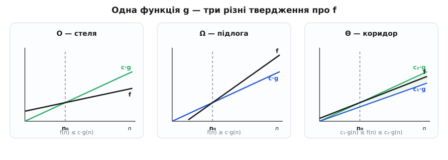
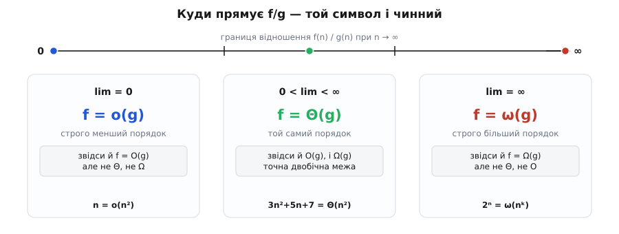

# 🧮 Математичний апарат нотації: родина Бахмана–Ландау

Сказати «росте не швидше за n²» — це вже щось, але як математичне твердження воно рихле. Не швидше починаючи звідки? З якою сталою? І що робити, коли треба сказати не «не швидше», а «не повільніше» або «точно так само»? Розмовна інтуїція «стеля зростання» — лише один палець однієї руки. Ціла рука — це **п'ять символів**: O, Ω, Θ, o, ω. Разом вони звуться родиною Бахмана–Ландау (за іменами двох німецьких математиків, які їх виплекали), і кожен ловить свій відтінок відношення «як одна функція росте проти іншої». Апарат, який тут будуємо, — це точні означення цих п'яти, два еквівалентні способи їх записати, правила поводження з ними й доведення, що перетворюють інтуїцію на теореми.

Домовимося з самого початку про одне спрощення, яке нічого не коштує в аналізі алгоритмів: функції `f(n)` і `g(n)` беремо додатні для великих n. Кількість кроків і розмір входу від'ємними не бувають, тож на нуль ми не ділитимемо й знаки модуля скрізь опустимо. Це прибирає технічні застереження, які потрібні в теорії чисел, звідки нотація прийшла, але зайві тут.

## Дві лінзи на одне «росте як»

Кожен символ цієї родини можна означити двома цілком різними на вигляд способами, які виявляються тим самим твердженням.

Перша лінза — **стала й поріг**. Вона питає: чи знайдеться множник `c` і рубіж `n₀`, від якого одна функція назавжди лягає під (або над) іншу, помножену на `c`? Це погляд «руками»: пред'яви конкретне `c`, конкретне `n₀` — і нерівність перевіряється підстановкою.

Друга лінза — **границя відношення**. Вона питає: куди прямує дріб `f(n)/g(n)`, коли n росте без меж? До нуля, до скінченного числа, до нескінченності? Це погляд «згори»: одне число — границя — одразу каже, який символ чинний.

Обидві лінзи дивляться на ту саму річ, і корисно тримати їх поряд: сталу-й-поріг легше довести (досить одного прикладу `c, n₀`), а границю легше порахувати (звична межа з аналізу). Почнімо зі сталої-й-порога, бо вона не потребує апарату границь.

## П'ять символів через ∃c, n₀

Ось уся родина в першій лінзі. `O` (це, до речі, грецький омікрон, а не латинська «о» — так наполягав Кнут) означає стелю:

```
f = O(g)   ⟺   ∃ c > 0, ∃ n₀ :  для всіх n ≥ n₀   f(n) ≤ c·g(n)
```

Читається «f росте не швидше за g»: знайдеться хоч один множник `c`, з яким `c·g` тримається зверху від якогось порога. Дзеркальне твердження — **підлога**, знак Ω (велика грецька «омега»):

```
f = Ω(g)   ⟺   ∃ c > 0, ∃ n₀ :  для всіх n ≥ n₀   f(n) ≥ c·g(n)
```

«f росте не повільніше за g»: знайдеться `c`, з яким `c·g` тримається знизу. Стеля й підлога — точні дзеркала: `f = Ω(g)` тоді й лише тоді, коли `g = O(f)`. Те, що для f є підлогою `g`, для g є стелею `f`; просто дивишся з іншого боку.

Коли обидві межі затискають функцію водночас — це **точний порядок**, знак Θ (грецька «тета»):

```
f = Θ(g)   ⟺   ∃ c₁, c₂ > 0, ∃ n₀ :  для всіх n ≥ n₀   c₁·g(n) ≤ f(n) ≤ c₂·g(n)
```

Тобто `f = Θ(g)` рівносильне тому, що одночасно `f = O(g)` і `f = Ω(g)`: та сама функція правитиме і за стелю, і за підлогу, лише з різними множниками. Це найсильніше з можливих тверджень про форму зростання — «росте точно як g, з точністю до сталого множника».

Лишаються два строгі родичі. `o` («мале о») — це строга стеля, зростання **суттєво повільніше**:

```
f = o(g)   ⟺   для КОЖНОГО c > 0   ∃ n₀ :  для всіх n ≥ n₀   f(n) < c·g(n)
```

І `ω` (мала «омега») — строга підлога, зростання суттєво швидше:

```
f = ω(g)   ⟺   для КОЖНОГО c > 0   ∃ n₀ :  для всіх n ≥ n₀   f(n) > c·g(n)
```

> 🔧 **Навіщо аж п'ять.** Одним символом не скажеш усього, що треба сказати про алгоритм. `O(n²)` — це обіцянка «гірше не буде»: годиться, щоб гарантувати верхню межу часу. `Ω(n²)` — це вирок «краще не буде»: саме ним доводять, що задача важка в принципі, а не що конкретний код невдалий. `Θ(n²)` — чесна повна правда «росте рівно так»: годиться, коли верхня й нижня межі зійшлися. А `o` і `ω` потрібні, коли важлива не просто перевага, а **прірва**: сказати, що один алгоритм не просто кращий, а лишає інший у пилюці на великих n. П'ять питань — п'ять відповідей.

## Одна відмінність, що робить o і ω строгими: ∃c проти ∀c

Придивись до квантора перед `c`. У `O` і `Ω` стоїть **∃c** — «знайдеться хоч одна стала». У `o` і `ω` стоїть **∀c** — «для кожної, хоч би якою малою (чи великою) вона була». Уся різниця між «не швидше» і «суттєво повільніше» захована в цьому одному перемиканні квантора.

Розкриймо, що воно означає. `f = o(g)` вимагає, щоб `f(n) < c·g(n)` тримало для **будь-якого** `c` — навіть для `c = 0.001`, навіть для `c = 10⁻⁹`. Хоч би яку мализну ти назвав, від якогось порога `f` мусить пролізти під `c·g`. Це можливо лише тоді, коли `f` не просто відстає, а стає **щезно малою часткою** від `g`: відношення `f/g` тисне до нуля. Натомість `f = O(g)` задовольняє одне-єдине `c`, яке досить велике: `n` цілком собі `O(n)` (візьми `c = 1`), але `n` не є `o(n)` — не існує такого малого `c < 1`, щоб `n < c·n` для великих n.

Звідси випливає вкладеність, яку варто тримати в голові: `o` строго сидить усередині `O`, а `ω` — усередині `Ω`. Усе, що `o(g)`, автоматично й `O(g)` (з `∀c` випливає `∃c`), але не навпаки. І `Θ` — це рівно перетин `O` та `Ω`: те, що затиснуте з обох боків.



*Одна еталонна функція `g` — три різні твердження про `f`. `O` вимагає лише стелі: `f` під `c·g` від порога `n₀`. `Ω` — лише підлоги: `f` над `c·g`. `Θ` затискає з обох боків одразу: `f` живе в коридорі між `c₁·g` і `c₂·g`. У кожному разі йдеться не про всі n, а про поведінку від якогось `n₀` і далі — те, що діється на малих n, нотацію не обходить.*

## Друга лінза: границя відношення

Тепер той самий звіринець — очима границі. Якщо існує границя відношення

```
L = lim (n→∞) f(n)/g(n)
```

то вона майже повністю визначає символ, і то напрочуд прозоро:

```
L = 0            ⟺   f = o(g)     (і, звісно, f = O(g))
0 < L < ∞        ⟺   f = Θ(g)     (і O, і Ω водночас)
L = ∞            ⟺   f = ω(g)     (і, звісно, f = Ω(g))
```

Логіка кожного рядка пряма. Якщо `f/g → 0`, то `f` стає щезною часткою `g` — це в точності `o`. Якщо `f/g` осідає на скінченному додатному числі `L`, то `f` і `g` розростаються в ногу, відрізняючись лиш майже сталим множником десь коло `L`, — це `Θ`. Якщо `f/g → ∞`, то `f` затьмарює `g` необмежено — це `ω`. Границя відношення (щоб говорити про неї строго, треба [границя послідовності](book:math/sequence-limit) — куди прямує `aₙ` при `n → ∞`) стягує все означення в одне число.



*Куди прямує `f(n)/g(n)` — той символ і чинний. Нуль ліворуч — строго менший порядок (`o`, а разом і слабша стеля `O`). Скінченне додатне посередині — той самий порядок (`Θ`, а отже й `O`, і `Ω`). Нескінченність праворуч — строго більший порядок (`ω`, а разом і підлога `Ω`). Три можливі долі одного дробу — три різні символи.*

Одна чесна осторога. Границя `f/g` існує не завжди: відношення може вічно коливатися, ніколи не осідаючи. Тоді замість самої границі беруть її верхню й нижню грані — **limsup** і **liminf** (найбільше й найменше значення, до яких дріб підбирається нескінченно часто). Повні означення через них такі: `f = O(g)` рівносильне `limsup f/g < ∞` (відношення врешті обмежене згори), а `f = Ω(g)` — `liminf f/g > 0` (врешті обмежене знизу додатним числом). Для функцій, з якими маєш справу в аналізі алгоритмів, границя майже завжди існує, тож проста форма з `lim` працює; limsup/liminf — це запобіжник для патологічних випадків, а не щоденний інструмент.

## Властивості, якими користуєшся не думаючи

Щойно означення в руках, з ними можна рахувати за кількома правилами. Вони й роблять нотацію практичною: без них довелося б щоразу лізти до `c` і `n₀`.

**Рефлексивність і транзитивність.** Очевидно, `f = O(f)` і `f = Θ(f)`. Важливіша **транзитивність**: якщо `f = O(g)` і `g = O(h)`, то `f = O(h)`. Доведення — просто множення сталих: з `f ≤ c₁·g` (від n₁) і `g ≤ c₂·h` (від n₂) маємо `f ≤ c₁·c₂·h` для всіх `n ≥ max(n₁, n₂)`, тож нова стала `c = c₁·c₂`, новий поріг `max(n₁, n₂)`. Те саме тримає для Ω, Θ, o, ω. Транзитивність — це те, чому ланцюжок оцінок «`f` не гірше за `g`, `g` не гірше за `h`» можна складати, як складаєш нерівності.

**Θ — це відношення еквівалентності.** На відміну від `O` (яке однобічне: `n = O(n²)`, але `n² ≠ O(n)`), `Θ` симетричне: `f = Θ(g)` тоді й лише тоді, коли `g = Θ(f)` — коридор працює в обидва боки. Разом із рефлексивністю й транзитивністю це робить `Θ` повноцінним [відношенням еквівалентності](book:math/equivalence-relation): воно розбиває всі функції на **класи зростання**, і всередині одного класу всі функції «однакові» з погляду асимптотики. Саме тому маєш право писати `Θ(n²)` як назву цілого класу, не уточнюючи, яка саме функція мається на увазі.

**Правило суми — молодший доданок тоне.** Це формальне серце того, чому в оцінці лишають один доданок:

```
якщо f₁ = O(g) і f₂ = O(g),  то f₁ + f₂ = O(g)
```

Доведення на долоні: `f₁ ≤ c₁·g` і `f₂ ≤ c₂·g` (від спільного порога), тож `f₁ + f₂ ≤ (c₁ + c₂)·g`. Нова стала — сума старих. Індукцією по кількості доданків (див. [математичну індукцію](book:math/mathematical-induction)) це поширюється на будь-яке **стале** число складників: сума k функцій, кожна `O(g)`, сама `O(g)`, якщо k не залежить від n. Звідси й ширше правило: `O(f) + O(g) = O(max(f, g))` — сума двох оцінок дорівнює більшій із них, бо менша тоне під більшою.

**Правило добутку.** Множники перемножуються природно:

```
якщо f₁ = O(g₁) і f₂ = O(g₂),  то f₁·f₂ = O(g₁·g₂)
```

Бо `f₁·f₂ ≤ (c₁·g₁)·(c₂·g₂) = (c₁·c₂)·(g₁·g₂)`. Це те правило, яким рахуєш вкладені цикли: зовнішній `O(n)` разів внутрішній `O(n)` дає `O(n²)`.

**Сталий множник щезає.** Для будь-якої додатної сталої `k` маємо `O(k·f) = O(f)`: стала просто вливається в `c`. Це причина, чому `3n²` і `n²` — той самий `O(n²)`: трійку поглинає вибір `c`.

## Доведення на прикладах

Правила правилами, а справжнє розуміння дає лічені доведення руками. Візьмімо той самий многочлен `3n² + 5n + 7`, на якому будується вся інтуїція відкидання доданків.

**Твердження: 3n² + 5n + 7 = O(n²).** Треба пред'явити `c` і `n₀`.

```
Для всіх n ≥ 1:
   5n ≤ 5n²        (бо n ≤ n² при n ≥ 1)
   7  ≤ 7n²        (бо 1 ≤ n² при n ≥ 1)
Складаємо:
   3n² + 5n + 7 ≤ 3n² + 5n² + 7n² = 15n²
Отже c = 15, n₀ = 1 задовольняють означення.
```

Висновок: `3n² + 5n + 7 ≤ 15·n²` від `n = 1` — стеля знайдена, тож `= O(n²)`. Зверни увагу: `c` і `n₀` **не єдині**. Груба оцінка `c = 15` бере поріг `n₀ = 1`; тісніша `c = 4` теж працює, але з пізнішого порога. Перевіримо це чисельно — бо означення `∃c, n₀` перевіряється прямим обрахунком:

```python
def n0_for(c):
    """Найменший поріг, від якого 3n²+5n+7 ≤ c·n² тримається назавжди."""
    last_fail = 0
    for n in range(1, 100_000):
        if 3*n*n + 5*n + 7 > c * n*n:   # нерівність ще НЕ виконана
            last_fail = n
    return last_fail + 1

print(n0_for(15))   # → 1   (тримає з першого n)
print(n0_for(4))    # → 7   (спершу треба дорости)
```

Стала `c = 4` вимагає `n₀ = 7`, бо `3n² + 5n + 7 ≤ 4n²` рівносильне `n² − 5n − 7 ≥ 0`, а корінь цього — `(5 + √53)/2 ≈ 6.14`, тож від `n = 7` (уже цілого) нерівність тримає. Обидві пари `(15, 1)` і `(4, 7)` — законні свідки того самого факту `= O(n²)`. Означення не просить найкращої сталої, лише **хоч якоїсь**.

Той самий многочлен дає й нижню межу: `3n² + 5n + 7 ≥ 3n²` для всіх `n ≥ 0` (бо `5n + 7 ≥ 0`), тобто `= Ω(n²)` з `c = 3`. Стеля `4n²` і підлога `3n²` затискають функцію з двох боків, отже

```
3n² ≤ 3n² + 5n + 7 ≤ 4n²   для всіх n ≥ 7
```

— це готовий `Θ(n²)` з `c₁ = 3, c₂ = 4, n₀ = 7`. Многочлен росте **точно** як його старший доданок; молодші лиш підправляють коридор, не форму.

**Чому ж не O(n)?** Спокуса сказати «та воно й лінійне зверху» розбивається строго. Доведімо [від супротивного](book:math/proof-by-contradiction):

```
Припустимо, 3n² + 5n + 7 = O(n): ∃ c, n₀ таке, що
   3n² + 5n + 7 ≤ c·n   для всіх n ≥ n₀.
Ділимо на n > 0:
   3n + 5 + 7/n ≤ c.
Ліва частина при n → ∞ прямує до +∞ (доданок 3n необмежений),
а права c — стала. Необмежене не може лишатися ≤ сталій.
Суперечність.
```

Отже `3n² + 5n + 7 ≠ O(n)`: жодна лінійна стеля квадрат не накриє. Через границю це видно миттєво: `(3n² + 5n + 7)/n = 3n + 5 + 7/n → ∞`, а `→ ∞` означає навіть сильніше — `3n² + 5n + 7 = ω(n)`.

**Чому 2ⁿ ≠ O(nᵏ) за жодного сталого k.** Це серцевина того, чому «експонента» — якісно інша ліга, ніж будь-який многочлен. Візьмімо границю відношення й перевіримо її логарифмом:

```
Розглянемо  2ⁿ / nᵏ.
Логарифм за основою 2:
   log₂(2ⁿ / nᵏ) = n − k·log₂ n.
При n → ∞ лінійний n переганяє k·log₂ n (логарифм росте повільніше за
будь-яку лінію), тож  n − k·log₂ n → +∞.
Якщо логарифм виразу → +∞, то й сам вираз 2ⁿ / nᵏ → +∞.
```

Границя `= ∞` дає навіть `2ⁿ = ω(nᵏ)` — строго швидше, а не просто не повільніше. І ключове: доведення **не залежить від значення k**. Хоч `k = 2`, хоч `k = 1000`, лінійний `n` усе одно з часом перекриє `k·log₂ n`. Тому не існує многочлена — жодного степеня, — який накрив би `2ⁿ` зверху. Прірва між поліноміальним і експоненційним зростанням абсолютна, і саме вона стоїть за межею «розв'язне на практиці / нерозв'язне».

**Чому логарифми всіх основ рівнозначні під O.** У класах зростання пишуть `O(log n)` без основи — і це не недбалість, а теорема. Причина — формула переходу до іншої основи:

```
logₐ n = log_b n / log_b a = (1 / log_b a) · log_b n.
```

Множник `1 / log_b a` — це стала (для основ `a, b > 1` вона додатна й скінченна), а сталий множник під O і Θ щезає. Отже

```
logₐ n = Θ(log_b n)   для будь-яких основ a, b > 1.
```

Логарифми за різними основами відрізняються лише сталим множником — тим самим, який нотація домовилася не помічати ([детальніше про самі логарифми](book:math/logarithms)). Тому основу в `O(log n)` не пишуть: вона нічого не міняє.

## Знак «=» тут — не рівність

Останнє, що плутає найчастіше. Запис `f = O(g)` виглядає як рівність, але нею **не є**. `O(g)` — це насправді ціла **множина** функцій: усі, що ростуть не швидше за `g`. Чесний запис був би `f ∈ O(g)` — «f належить до множини функцій, обмежених зверху через g». Історично прижився знак «=», який тут читають однобічно, зліва направо, як «є»: «f є O від g».

З цієї однобічності випливають застороги. По-перше, **не можна перевертати**: `O(n²) = f` — беззмістовно. По-друге, з `f = O(n²)` і `h = O(n²)` **не випливає** `f = h`: обидві належать до тієї самої множини, але між собою можуть різнитися як завгодно (`n` і `n²` обидві `O(n²)`, а рівними їх не назвеш). «=» тут — стрілка приналежності, а не місток тотожності. Тримай це в голові — і напівпарадокси на кшталт «`n = O(n²)` і `n² = O(n²)`, то `n = n²`?» розсипаються самі.

## Де цей апарат працює в аналізі алгоритмів

Тепер видно, що саме стоїть за звичними записами складності. Коли кажуть «алгоритм працює за `O(n²)`», за цим — точне твердження: число кроків у найгіршому разі не перевищує `c·n²` від якогось `n₀`; квантор `∃c, n₀` ховає і машинно-залежний множник, і шум на малих входах — рівно те, від чого хотілося втекти. Коли межі зійшлися й можна сказати `Θ(n²)` — це вже повна правда про форму зростання, а не лиш стеля: наприклад, сортування порівняннями в найгіршому разі саме `Θ(n log n)`.

Найглибше працює `Ω`. Ним формулюють нижню межу не окремого коду, а **самої задачі**: твердження «будь-яке сортування порівняннями потребує `Ω(n log n)` порівнянь» — це вирок, який не обійде жодна кмітливість, бо доводиться він із будови задачі, а не з конкретного алгоритму. `Ω` перетворює «ми не знайшли швидшого» на «швидшого не існує». А `o` і `ω` загострюють порівняння до прірви: `n log n = o(n²)` каже, що добре сортування не просто випереджає квадратичне, а стає його щезною часткою на великих n.

Історія цих знаків коротка й певна. Стелю `O` (від нім. *Ordnung* — «порядок») увів теоретик чисел Пауль Бахман 1894 року, у другому томі «Analytische Zahlentheorie», щоб стисло записувати порядок похибки наближення. Едмунд Ландау 1909 року формалізував це означення й додав «мале o» — відтоді всю родину звуть символами Ландау. А до інформатики строгий лад навів Дональд Кнут статтею «Big Omicron and big Omega and big Theta» 1976 року: він закріпив змісти `Ω` і `Θ` саме для аналізу алгоритмів. Варто знати, що його `Ω` (нижня межа «для всіх великих n») відрізняється від старішого аналітичного `Ω` Гарді й Літлвуда 1914 року, який означав лише «не є `o`» — тобто нерівність нескінченно часто, а не завжди. У програмуванні вживають означення Кнута, і саме воно робить пару `O`/`Ω` симетричними дзеркалами, а їхній перетин `Θ` — точною двобічною межею.
