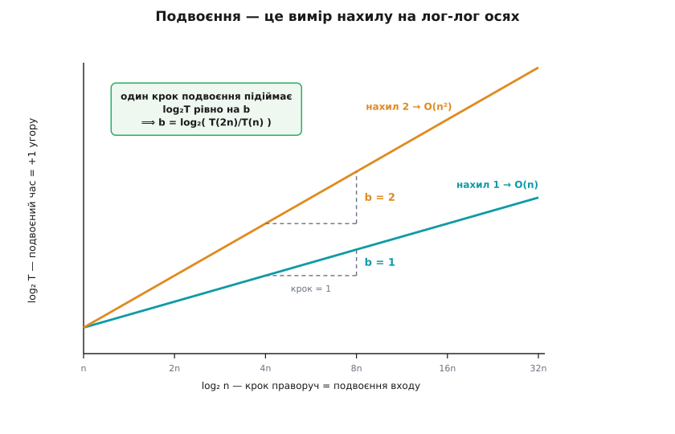

# ⚙️ Клас складності на дотик: метод подвоєння

Ти дописав функцію, яка нібито працює за лінійний час, — але певності немає: десь усередині сидить виклик, чия ціна тобі невідома, і чи не ховається там квадрат, з коду відразу й не скажеш. Або перед тобою чужа бібліотечна функція взагалі без сирців. Або ти вивів на папері `O(n log n)` і хочеш переконатися, що не помилився. Питання в усіх трьох випадках те саме: як назвати клас складності **ззовні** — не читаючи жодного рядка й не доводячи нічого, а просто запустивши й подивившись?

Найпряміший хід — заміряти час — нічого не дає. Одне число, скажімо 40 мілісекунд, про клас мовчить: воно залежить від машини, мови, входу й настрою планувальника. Заміряй те саме деінде — і 40 стане 12 або 300, а клас же не змінився. Одна точка не містить відповіді в принципі, скільки на неї не дивись.

А от **як час відгукується на ріст входу** — уже не залежить ні від машини, ні від мови, бо описує не конкретний прогін, а спосіб рахувати. І найзручніший спосіб виростити вхід — подвоїти його. Звідси й уся техніка: замір на `n`, `2n`, `4n`, `8n`… і один погляд на те, у скільки разів щоразу дорожчає прогін. Її під назвою «гіпотеза подвоєння» (*doubling hypothesis*) виклали Роберт Седжвік і Кевін Вейн у підручнику «Algorithms» (4-те видання, розділ 1.4) — і там же чесно назвали її межу, до якої ми ще дійдемо.

## Ідея: відношення прямо називає показник

Майже кожен алгоритм на «звичайному» вході підкоряється степеневому закону: час росте як `nᵇ` з точністю до сталого множника. Запишімо це й подивімось, що робить подвоєння:

```
T(n)  = a·nᵇ
T(2n) = a·(2n)ᵇ = a·2ᵇ·nᵇ

           T(2n)     a·2ᵇ·nᵇ
відношення ────  =  ─────────  =  2ᵇ
           T(n)       a·nᵇ
```

Сталий множник `a` **скоротився** — і разом із ним зникло все машинне: швидкість процесора, вартість одного кроку в наносекундах, накладні витрати мови. Лишилося чисте `2ᵇ`. Ось чому відношення переживає зміну заліза, а сирий час — ні: те, що робить твій ноутбук швидшим за мій, сидить рівно в `a`, а `a` в відношенні гине. Двоє на різних машинах дістануть різні секунди — але однакове відношення.

Далі — просто читати. Показник виймається з відношення оберненням:

```
b = log₂( T(2n) / T(n) )

відношення ≈ 1  →  b = 0  →  O(1)      подвоєння входу нічого не міняє
відношення ≈ 2  →  b = 1  →  O(n)      подвоюється разом із входом
відношення ≈ 4  →  b = 2  →  O(n²)     дорожчає вчетверо
відношення ≈ 8  →  b = 3  →  O(n³)     увосьмеро
відношення вибухає            →  не степінь — це експонента
```


*Декодер методу. Ліворуч — виміряне відношення сусідніх часів, праворуч — клас, який воно називає. Проміжні значення теж читаються: відношення ≈ 3 дає `b = log₂3 ≈ 1.58` — це, наприклад, множення Карацуби, що живе між лінією і квадратом. Уся таблиця — це один рядок `b = log₂(відношення)`, розписаний по клітинках.*

## Чому це працює: подвоєння міряє нахил

Щоб побачити метод наскрізь, прологарифмуймо степеневий закон:

```
T = a·nᵇ
log T = log a + b·log n
```

На осях `(log n, log T)` це рівняння прямої з нахилом `b`. Тобто будь-який степеневий закон на лог-лог папері — **пряма**, і весь клас сидить у її нахилі. Подвоїти вхід — це зробити один крок праворуч по осі `log₂ n` (бо `log₂ 2n = log₂ n + 1`); висота, на яку за цей крок піднялася крива, і дорівнює `b`. Виходить, відношення `T(2n)/T(n)` — це буквально **двоточковий вимір нахилу** тієї прямої.



*Чому подвоєння працює. На лог-лог осях степеневий закон випрямляється в пряму, а клас стає її нахилом. Один крок подвоєння входу — це `+1` по горизонталі; наскільки за цей крок піднялася крива, таке й `b`. Метод подвоєння нічого не «вгадує» — він міряє нахил прямої двома точками, віддаленими вдвічі.*

Це відразу підказує, як зробити оцінку точнішою: дві точки — крихка опора, бо досить одній схибити, і нахил попливе. Але точок можна взяти багато й провести пряму через усі одразу — до цього ще повернемось наприкінці.

> 🔧 **Навіщо це.** Метод перетворює **доведення на дослід**. Сирці не завжди під рукою — бібліотека, чужий модуль, чорна скринька за мережею; а коли й під рукою, доведення теж буває хибним — недогледів вкладений виклик, проґавив найгірший вхід. Замір — це незалежна перевірка: запустив, прочитав показник, звірив із тим, що думав. Якщо ти «довів» `O(n log n)`, а відношення вперто показує 4, то або в доведенні діра, або твій вхід влучає в квадратичний найгірший випадок. Ця сторожа не знає твоїх сподівань і тому не бреше з ввічливості.

## Робочий код: заміряти й прочитати

Замірювальна обв'язка — природна робота для Python: годинник високої роздільності в стандартній бібліотеці, медіана поруч, а сам замір — кілька рядків. Те, що ми **міряємо**, може бути будь-чим — хоч С-розширенням, хоч підпроцесом, — але код, який женеться за часом і читає з нього клас, це аналітичний скрипт, і тут Python вдома.

Годинник беремо `time.perf_counter` — монотонний лічильник найвищої роздільності, який з версії Python 3.3 є стандартним таймером і в модулі `timeit`. Саме монотонний, а не «настінний»: тривалість не можна міряти годинником, який системний час може підкрутити назад під час заміру — про цю пастку окремо є [монотонний проти настінного часу](book:programming/monotonic-vs-wall-time).

```python
import time, statistics, math

def measure(func, make_input, n, trials=5, warmups=2):
    """Медіанний час одного виклику func(make_input(n))."""
    warm = make_input(n)
    for _ in range(warmups):          # прогрів: сторінки, кеш, у JIT-мовах — компіляція
        func(warm)
    samples = []
    for _ in range(trials):
        data = make_input(n)          # свіжий вхід щоразу — не міряємо вже прогрітий кеш
        t0 = time.perf_counter()      # монотонний годинник, роздільність — краще за мкс
        func(data)
        samples.append(time.perf_counter() - t0)
    return statistics.median(samples) # медіана глушить поодинокі сплески ОС/GC

def doubling(func, make_input, n0, steps, **kw):
    """Друкує n, час, відношення T(2n)/T(n) і показник b = log₂(відношення)."""
    print(f"{'n':>9}  {'T (с)':>10}  {'T(2n)/T(n)':>10}  {'b=log₂':>7}")
    prev = None
    n = n0
    for _ in range(steps):
        t = measure(func, make_input, n, **kw)
        if prev is None:
            print(f"{n:>9}  {t:>10.6f}  {'—':>10}  {'—':>7}")
        else:
            r = t / prev
            print(f"{n:>9}  {t:>10.6f}  {r:>10.2f}  {math.log2(r):>7.2f}")
        prev = t
        n *= 2
```

Три рішення в цих рядках варті слова, бо кожне закриває конкретну пастку. **Прогрів** (`warmups`) відкидає перші прогони, де платиться одноразова ціна — сторінки підкачуються, кеш холодний. **Свіжий вхід** щоразу не дає нам випадково заміряти вже прогрітий попереднім прогоном кеш замість самого алгоритму. **Медіана** з кількох замірів відкидає поодинокі викиди: якщо посеред одного заміру втрутився планувальник чи збирач сміття, зіпсується один зразок, а не підсумкове число.

Тепер напустімо це на дві функції з відомим наперед класом — щоб перевірити, що метод каже правду. Лінійна сума й квадратичний підрахунок збігів (без дострокового виходу, щоб гарантувати повний `n²`-прохід):

```python
import random

def total(a):                         # O(n): один прохід
    s = 0
    for x in a:
        s += x
    return s

def count_pairs(a):                   # O(n²): кожен проти кожного, повний скан
    n = len(a); c = 0
    for i in range(n):
        ai = a[i]
        for j in range(i + 1, n):
            if ai == a[j]:
                c += 1
    return c

rand     = lambda n: [random.random() for _ in range(n)]
distinct = lambda n: list(range(n))   # детермінований вхід; повний n²-скан і так гарантований

doubling(total,       rand,     100_000, 6)
doubling(count_pairs, distinct,     500, 6)
```

Ось що надрукував цей код на одній звичайній машині (числа секунд — саме її; важливі не вони, а стовпчик відношень):

```
O(n) — total
        n       T (с)   T(2n)/T(n)   b=log₂
   100000    0.001729           —        —
   200000    0.003254        1.88     0.91
   400000    0.006682        2.05     1.04
   800000    0.014003        2.10     1.07
  1600000    0.027570        1.97     0.98
  3200000    0.058319        2.12     1.08
```

Відношення тупцює навколо **2**, показник — навколо **1**. Присуд: `O(n)`, і жодного рядка коду ми не читали. Розкид (1.88 … 2.12) — це не хиба методу, а чесний шум живої машини; він нікуди не дінеться, і саме тому ми беремо медіану й дивимось на тенденцію, а не на окреме число. А тепер квадрат:

```
O(n²) — count_pairs
        n       T (с)   T(2n)/T(n)   b=log₂
      500    0.004697           —        —
     1000    0.012448        2.65     1.41
     2000    0.052839        4.24     2.09
     4000    0.228087        4.32     2.11
     8000    1.027570        4.51     2.17
    16000    4.727619        4.60     2.20
```

Дивись, як відношення **виходить на 4 знизу**. Перший крок дає лише 2.65 (показник 1.41) — на `n = 500` вкладений цикл ще не встиг задавити сталу складову й накладні витрати кожної Python-ітерації, тож код прикидається майже лінійним. Далі `n²` бере гору, і відношення сідає біля 4 (`b ≈ 2.1`). Це і є головний практичний урок наперед: **на малих `n` метод занижує клас**, бо там ще правлять сталі; вірити відношенню можна лише коли воно **встоялося** через два-три кроки поспіль.


*Виміряні відношення — не ідеальні числа, і обидва відхилення тут показові. Квадратичний код (помаранчева) підходить до своєї межі 4 **знизу**: на малих `n` сталі занижують показник. Шумний прогін (бірюзова) стрибає навколо 2 через випадкові втручання ОС і збирача сміття — один-єдиний замір тут збрехав би, і рятує лише медіана з кількох.*

## Три пастки самого відношення

**Відношення ≈ 1 двозначне.** І `O(1)`, і `O(log n)` дають відношення, що прямує до одиниці, — розрізнити їх за самим відношенням не вийде. Розрізняє **різниця**. Стала: `T(2n) − T(n) ≈ 0`, час не росте зовсім. Логарифм: `T(2n) − T(n) ≈ стала > 0`, бо `log₂(2n) − log₂ n = 1` — кожне подвоєння **додає** однаковий шматок часу, а не множить. Тож коли відношення близьке до 1, дивись на різницю сусідніх часів: рівно нуль — стала; однаковий додатний приросток щокроку — логарифм.

**Логарифмічний множник невидимий — і це принципова межа.** Розрізнити `O(n)` і `O(n log n)` методом подвоєння практично **неможливо**. Порахуймо, чому:

```
n log n:   T(2n)/T(n) = 2·(log 2n)/(log n) = 2·(1 + 1/log₂n) = 2 + 2/log₂n
при n = 10⁶:  log₂n ≈ 20  →  відношення ≈ 2 + 0.1 = 2.1
```

Лог-множник підіймає відношення з 2.0 лише до 2.1 — на п'ять відсотків, які тонуть у шумі. Ось реальний прогін вбудованого сортування (`sorted`, теоретично `O(n log n)`):

```
O(n log n) — sorted
        n       T (с)   T(2n)/T(n)   b=log₂
   100000    0.019322           —        —
   200000    0.045280        2.34     1.23
   400000    0.095727        2.11     1.08
   800000    0.224573        2.35     1.23
  1600000    0.456449        2.03     1.02
  3200000    0.972232        2.13     1.09
```

Читається як **чиста лінія**: відношення 2.0 … 2.3, показник біля 1. Логарифмічний множник просто не проступає крізь шум. Це не хиба нашого коду — це задокументована межа гіпотези подвоєння: вона бачить **степеневий показник** `b`, а `log n` росте повільніше за будь-який степінь і тому в показник не потрапляє. Якщо тобі треба відрізнити `n` від `n log n`, подвоєння не помічник — тут потрібен або підрахунок самих операцій, або доведення.

**Експонента ламає саму рамку методу.** Для `T = c·2ⁿ` відношення `T(2n)/T(n) = 2²ⁿ/2ⁿ = 2ⁿ` — не стала, а величина, що сама вибухає й росте з `n`. Ознака експоненти саме така: **відношення ніколи не встоюється**. Побачив таке — зміни зонд: замість подвоювати `n`, збільшуй його **на одиницю**. Для експоненти константним стає вже приростковий відгук `T(n+1)/T(n)` — він прямує до основи (2 для `2ⁿ`, золотий перетин `φ ≈ 1.618` для наївного рекурсивного числа Фібоначчі). Ось наївний `fib`, заміряний по одиниці `n`:

```
fib(26) = 0.078 с   →   fib(34) = 1.248 с
16-кратний ріст за +8 до n  ≈  ×1.4 на кожну одиницю n (і повзе до φ)
```

Різниця в самій природі зонда: **степеневий закон дає сталу на кожне подвоєння `n`; експонента дає сталу на кожну `+1`**. Хто плутає ці два зонди, той або пропускає експоненту (бо відношення на подвоєнні «зашкалює» безглуздо), або марно шукає степінь там, де його нема.

## Пастки заміру

Досі відношення нас обманювало «зверху» — через математику класів. Тепер про пастки нижчого поверху: у самому вимірі.

**Замір упирається в роздільність — операція швидша за лінійку.** Один [двійковий пошук](book:algorithms/binary-search) — це мікросекунди, а частіше й менше. Роздільність годинника й, гірше, накладні витрати самого інтерпретатора (десятки-сотні наносекунд на виклик) таку операцію просто затоплюють: ти міряєш обв'язку, а не алгоритм. Те саме з пошуком у [хеш-таблиці](book:algorithms/hash-table) — окремий доступ надто дешевий, щоб його побачив таймер. Два виходи. Перший — міряти **пачку**: проганяти операцію мільйон разів і ділити. Другий, коли навіть накладні витрати циклу-господаря псують картину, — спуститися в ту саму мову, що й операція, і взяти годинник високої роздільності. Ось де С доречний — точний замір гарячого циклу:

```c
#include <stdio.h>
#include <stdlib.h>
#include <time.h>

static double now(void)                 /* монотонний годинник у секундах (POSIX; */
{                                        /* на Windows — QueryPerformanceCounter)  */
    struct timespec ts;
    clock_gettime(CLOCK_MONOTONIC, &ts);
    return ts.tv_sec + ts.tv_nsec * 1e-9;
}

static volatile long sink;              /* сток проти видалення циклу оптимізатором */

/* Найкоротший (найменш зашумлений) час проходу масивом — O(n). */
static double time_pass(const int *a, size_t n, int reps)
{
    double best = 1e300;
    for (int r = 0; r < reps; r++) {
        double t0 = now();
        long s = 0;
        for (size_t i = 0; i < n; i++)
            s += a[i];
        double dt = now() - t0;
        sink = s;                       /* «використали» суму — інакше цикл викинуть */
        if (dt < best) best = dt;       /* мінімум: шум лише додає час, не віднімає */
    }
    return best;
}

int main(void)
{
    double prev = 0.0;
    for (size_t n = 1u << 12; n <= 1u << 22; n <<= 1) {   /* 4К … 4М, подвоєння */
        int *a = malloc(n * sizeof *a);
        for (size_t i = 0; i < n; i++) a[i] = (int)(i & 0x3f);
        double t = time_pass(a, n, 21);
        if (prev > 0.0)
            printf("n=%9zu  t=%.3e с  T(2n)/T(n)=%.2f\n", n, t, t / prev);
        else
            printf("n=%9zu  t=%.3e с  T(2n)/T(n)=  —\n", n, t);
        prev = t;
        free(a);
    }
    return 0;
}
```

Два тонкі місця цей код закодовує навмисно. Перше — **`volatile`-сток**: оптимізатор бачить, що сума `s` нікуди не йде, і має повне право викинути весь цикл — ти заміряв би нуль. Пропуск результату крізь `volatile`-запис тримає роботу живою. Це пастка номер один усіх мікрозамірів: викинутий мертвий код показує неможливо швидкі числа. Друге — **мінімум, а не медіана**: для чистого детермінованого гарячого циклу шум **однобічний**, операційна система вміє лише **вкрасти** час, а не подарувати, тож найшвидший прогін і є найменш спотворений, найближчий до правди. (Для коду вищого рівня, де сам обсяг роботи гуляє — виділення пам'яті, збір сміття, — надійніша медіана; тому Python-обв'язка вище бере медіану, а С-цикл тут — мінімум.)

**Прогрів: холодний кеш і JIT.** Перший прогін будь-чого платить одноразові ціни, яких решта не платить: сторінки підкачуються, [кеш](book:programming/cache) холодний, а в мовах із JIT-компіляцією (JVM, V8, PyPy) гарячий шлях ще тільки перекладається з байткоду в машинний код — перші виклики біжать повільним інтерпретатором, потім раптово прискорюються. Зашита в замір, ця одноразова ціна роздуває ранні `n` і згинає відношення. Ліки — кілька перших ітерацій відкинути на прогрів (обв'язка вище робить це в `warmups`). У чистому CPython JIT нема, але ефекти холодного кешу й підкачки сторінок лишаються.

**Шум: збирач сміття й ОС.** Між двома викликами `perf_counter` планувальник може віддати процесор іншому процесу, а [збирач сміття](book:programming/garbage-collection) — спрацювати посеред заміру й спинити тебе на мілісекунди. І те, і те підкине один зразок угору. У реальному прогоні багатьох двійкових пошуків відношення стрибнуло 1.98, 2.02, **1.56**, **2.84**, 2.16 — обидва викиди чистий шум, і будь-який із них поодинці дав би безглуздий показник. Дві оборони: міряти кожне `n` кілька разів і брати медіану (чи мінімум), що відкидає однобічні сплески; і знати, що Python-модуль `timeit` **вимикає збирач сміття** на час заміру саме з цієї причини (типово; `gc.enable()` у рядку налаштування вмикає його назад, якщо GC — частина того, що ти свідомо міряєш).

**Велика стала складова маскує клас.** Хай `T(n) = a·n² + K`, де `K` — важка одноразова підготовка (читання файлу, побудова таблиці). На малих і середніх `n` панує `K`, відношення сидить біля 1 — код скидається на сталий. І лише коли `a·n²` нарешті переросте `K`, відношення полізе до 4. Якщо твої `n` доти не дотягуються, ти прочитаєш квадрат як сталу. Ліки ті самі: гнати `n` угору, доки відношення не встоїться; поки воно повзе — ти ще не в асимптотичному режимі, і читати з нього клас зарано.

**Дві точки крихкі — проведи пряму через усі.** Одне відношення — це оцінка нахилу за двома точками, і досить одній зашуміти, як показник попливе. Надійніше: заміряти `T` на цілій низці `n` і провести пряму крізь `(log n, log T)` методом [найменших квадратів](book:math/least-squares) — нахил і є `b`, але порахований по **всіх** точках одразу, тож жоден окремий сплеск не вирішує. На тому самому квадратичному прогоні, де сусідні відношення гуляли від 2.65 до 4.6, підгін прямої по всій низці замірів повернув `b = 2.005` — практично точно двійку. Око по відношеннях ловить клас; пряма по всіх точках прибиває показник.

І остання чесність про той квадрат. Його відношення встоялися трохи **вище** 4 (4.5 … 4.6, `b ≈ 2.15`), а не рівно на 4. Це не п'ятий степінь проліз — це пам'ять: коли масив переростає черговий рівень кешу, середня ціна доступу до елемента підповзає вгору й додає легкий надлінійний нахил поверх справжнього `n²`. Клас лишається квадратичним; повзучка — артефакт заліза, і саме її наскрізний підгін прямої (що дав 2.005) бачить крізь шум. Реальні промахи кешу, до речі, міряють уже не таймером, а лічильниками процесора — це território [профілювання](book:programming/profiling), яке відповідає на інше питання: не «який клас», а «що саме сталося на цьому залізі».

---

Одне число мовчить; відгук числа на подвоєння входу промовляє клас уголос. Сталий множник, що несе на собі всю машину, у відношенні гине — лишається `2ᵇ`, і показник читається просто оберненням, `b = log₂(відношення)`, або точніше — нахилом лог-лог прямої по всіх точках. Цінність методу — у його чесності: він ловить хибне доведення, зондує чорну скриньку й підтверджує, що переписаний `O(n)`-варіант і справді `O(n)`. Такі ж чесні й межі: він сліпий до логарифмічних множників, він занижує на малих `n`, і він міряє рівно те, що дозволять роздільність лінійки й шум довкола. Поважай ці межі — і кілька хвилин подвоєння скажуть тобі ззовні те єдине про твій код, що переживає будь-яку зміну машини: як він росте.
