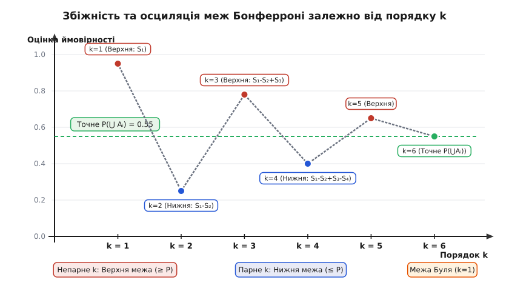
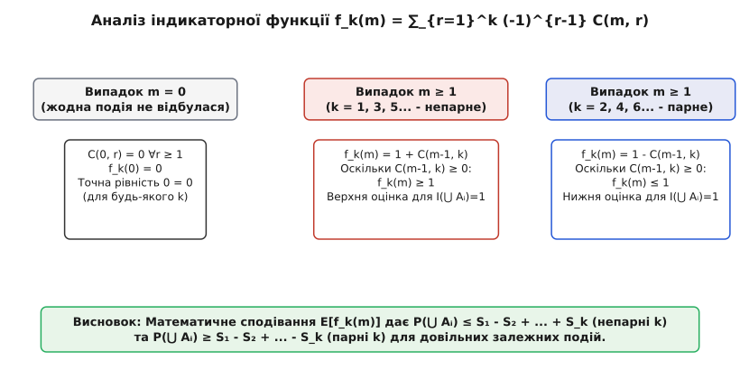
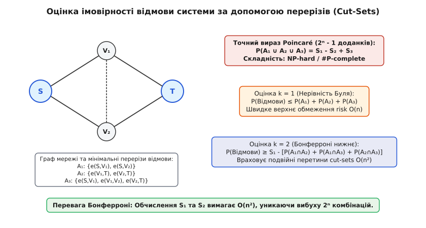

# Нерівності Бонферроні

<preknowlist>
- [Принцип включень-виключень](topic:math/inclusion-exclusion) — точна формула Пуанкаре для ймовірності об'єднання скінченної кількості подій.
- [Складність підрахунку та #P-повнота](topic:algorithms/sharp-p-counting) — чому точне обчислення комбінаторних об'єктів є важким.
- [Нерівність Чернова](topic:algorithms/chernoff-bound) — імовірнісні оцінки відхилення суми випадкових величин.
</preknowlist>

Оцінка надійності серверної мережі з п'ятдесятьма паралельними каналами зв'язку або обчислення ймовірності задоволення булевої формули у диз'юнктивній нормальній формі з сотнею диз'юнктів зіштовхується з однаковою обчислювальною перешкодою. Для обчислення точної ймовірності того, що станеться бодай одна з `n` небажаних подій (відмова каналу, конфлікт ресурсів, виконання умови), класична формула принципу включень-виключень вимагає підсумувати `2ⁿ - 1` доданків. При `n = 50` це означає обробку понад `10¹⁵` комбінацій перетинів. Навіть суперкомп'ютер, що обробляє мільярд комбінацій на секунду, буде виконувати цей розрахунок понад 11 діб.

Ця обчислювальна складність є не просто практичним обмеженням, а проявом теоретичної #P-повноти задачі точного підрахунку. Оскільки точний розрахунок є експоненційно важким, у реальних інженерних та алгоритмічних системах виникає потреба в детермінованих інструментах, які дозволяють за поліноміальний час `O(nᵏ)` отримати гарантовані верхні та нижні межі підсумкової ймовірності. Саме таким інструментом є нерівності Бонферроні (Bonferroni inequalities).

---

## Експоненційне прокляття принципу включень-виключень

Щоб зрозуміти походження нерівностей Бонферроні, необхідно розглянути структуру класичного вираз Пуанкаре для ймовірності об'єднання випадкових подій `A₁, A₂, ..., A♮`. 

Якщо події є взаємно виключними (не сумісними), ймовірність їхнього об'єднання дорівнює простій сумі їхніх індивідуальних ймовірностей. Проте у реальних системах події майже завжди мають часткову залежність та спільні наслідки. Просте додавання індивідуальних ймовірностей призводить до того, що спільні елементи перетинів враховуються двічі, тричі або `m` разів.

Щоб компенсувати це подвійне врахування, формула принципу включень-виключень почергово додає та віднімає суми перетинів усіх можливих порядків:

```
S₁ = ∑_{i=1}ⁿ P(Aᵢ)
S₂ = ∑_{1 ≤ i < j ≤ n} P(Aᵢ ∩ Aⱼ)
S₃ = ∑_{1 ≤ i < j < m ≤ n} P(Aᵢ ∩ Aⱼ ∩ Aₘ)
...
Sᵣ = ∑_{1 ≤ i₁ < ... < iᵣ ≤ n} P(A_{i₁} ∩ ... ∩ A_{iᵣ})
```

Точна ймовірність об'єднання подій обчислюється як знакозмінна сума:

```
P(⋃_{i=1}ⁿ Aᵢ) = S₁ - S₂ + S₃ - S₄ + ... + (-1)ⁿ⁻¹ Sₙ
```

Кількість доданків у сумі `Sᵣ` дорівнює біноміальному коефіцієнту `C(n, r)`. Загальна кількість обчислюваних перетинів по всіх `r` від 1 до `n` дорівнює:

```
∑_{r=1}ⁿ C(n, r) = 2ⁿ - 1
```

При зростанні кількості подій `n` обчислення значень `Sᵣ` для великих `r` стає неможливим. Наприклад, обчислення суми `S₂₅` для 50 подій вимагає аналізу `C(50, 25) ≈ 1.26 × 10¹⁴` комбінацій. Більш того, у багатьох практичних задачах кореляційні дані вищих порядків (наприклад, ймовірність одночасної відмови 20 конкретних вузлів) взагалі відсутні у статистичних спостереженнях.

Виникає природне запитання: що станеться, якщо зупинити обчислення знакозмінної суми на деякому невеликому фіксованому порядку `k` (наприклад, `k = 1`, `k = 2` або `k = 3`), ігноруючи всі доданки вищих порядків?

---

## Граничні суми та осциляція меж

Урізана сума `k`-го порядку виглядає як часткова сума принципу включень-виключень:

```
Bₖ = ∑_{r=1}ᵏ (-1)ʳ⁻¹ Sᵣ
```

Розглянемо послідовні значення цієї урізаної суми для різних `k`:

1. **Перший порядок (`k = 1`):**
   ```
   B₁ = S₁ = ∑_{i=1}ⁿ P(Aᵢ)
   ```
   Ця оцінка відома як **нерівність Буля** (Boole's inequality) або **Union Bound**. Вона припускає, що події взаємно не перетинаються. Якщо події мають перетини, `S₁` повторно враховує їх, що робить `B₁` гарантованою **верхньою межею** для істинної ймовірності:
   ```
   P(⋃_{i=1}ⁿ Aᵢ) ≤ S₁
   ```

2. **Другий порядок (`k = 2`):**
   ```
   B₂ = S₁ - S₂ = ∑_{i=1}ⁿ P(Aᵢ) - ∑_{1 ≤ i < j ≤ n} P(Aᵢ ∩ Aⱼ)
   ```
   Шляхом віднімання сум усіх парних перетинів `S₂`, оцінка `B₂` компенсує подвійне врахування перетинів. Проте для елементів, які належать трьом і більше подіям, віднімання `S₂` виявляється надмірним (перекомпенсація). У результаті `B₂` стає гарантованою **нижньою межею** для істинної ймовірності:
   ```
   P(⋃_{i=1}ⁿ Aᵢ) ≥ S₁ - S₂
   ```

3. **Третій порядок (`k = 3`):**
   ```
   B₃ = S₁ - S₂ + S₃
   ```
   Додавання сум потрійних перетинів `S₃` компенсує надмірне віднімання на другому кроці. Оцінка `B₃` знову стає **верхньою межею**, але ця верхня межа є суворішою (ближчою до точного значення), ніж нерівність Буля `S₁`.


*Збіжність верхніх (непарне k) та нижніх (парне k) оцінок до точного значення ймовірності.*

Карло Еміліо Бонферроні у 1936 році довів, що ця поведінка не є випадковим збігом для перших кількох доданків, а виражає фундаментальний комбінаторний закон для довільних випадкових подій будь-якої природи. Детальніше про актуарні мотиви та історичний контекст відкриття Бонферроні можна прочитати у вставці [Історія виникнення нерівностей Бонферроні](topic:algorithms/bonferroni-inequalities/hist-bonferroni-origin.md).

---

## Математичний механізм: Індикаторні змінні та біноміальні тотожності

Формальне доведення того, чому урізані суми завжди утворюють строгий вилковий інтервал навколо істинного значення ймовірності, спирається на алгебру індикаторних випадкових величин.

Нехай `Iᵢ` — індикаторна випадкова величина події `Aᵢ`, тобто `Iᵢ = 1`, якщо подія `Aᵢ` відбулася, і `Iᵢ = 0` у протилежному випадку.

Позначимо через `m = ∑_{i=1}ⁿ Iᵢ` випадкову величину, яка дорівнює точній кількості подій, що справдилися для конкретного наслідку досліду. Подія об'єднання `⋃ Aᵢ` відбувається тоді й лише тоді, коли `m ≥ 1`. Індикатор об'єднання дорівнює `I(⋃ Aᵢ) = 1` при `m ≥ 1`, та `I(⋃ Aᵢ) = 0` при `m = 0`.

Розглянемо суму `r`-кратних добутків індикаторів `∑_{i₁ < ... < iᵣ} I_{i₁} ... I_{iᵣ}`. Якщо у досліді справдилося рівно `m` подій, то кількість різних `r`-елементних підмножин серед цих `m` подій дорівнює біноміальному коефіцієнту `C(m, r)`. За лінійністю математичного сподівання маємо:

```
Sᵣ = E[ C(m, r) ]
```

Отже, урізана сума Бонферроні порядку `k` є математичним сподіванням від комбінаторної функції `fₖ(m)`:

```
Bₖ = ∑_{r=1}ᵏ (-1)ʳ⁻¹ Sᵣ = E[ fₖ(m) ]
```

де алгебраїчна функція `fₖ(m)` визначена як:

```
fₖ(m) = ∑_{r=1}ᵏ (-1)ʳ⁻¹ C(m, r)
```


*Многочлен f_k(m) для парних та непарних значеннях k ілюструє строгість нерівностей для довільної кількості подій.*

За допомогою алгебраїчного тотожності Паскаля `C(m, r) = C(m-1, r) + C(m-1, r-1)` та телескопічного розгортання суми отримуємо закритий вираз для `fₖ(m)` при `m ≥ 1`:

```
fₖ(m) = 1 - (-1)ᵏ C(m-1, k)
```

Аналіз цього виразу розкриває внутрішню математичну причину нерівностей Бонферроні:

1. **Якщо `m = 0` (жодна подія не відбулася):**
   `C(0, r) = 0` для всіх `r ≥ 1`, тому `fₖ(0) = 0 = I(⋃ Aᵢ)`. Рівність виконується тотожно для будь-яких `k`.

2. **Якщо `m ≥ 1` (відбулася принаймні одна подія):**
   - **Непарне `k` (`k = 1, 3, 5, ...`):**
     Оскільки `(-1)ᵏ = -1`, маємо `fₖ(m) = 1 + C(m-1, k)`.
     Оскільки біноміальний коефіцієнт `C(m-1, k) ≥ 0`, то `fₖ(m) ≥ 1 = I(⋃ Aᵢ)`.
     Взявши математичне сподівання, отримуємо: `Bₖ ≥ P(⋃ Aᵢ)` (Верхня межа).

   - **Парне `k` (`k = 2, 4, 6, ...`):**
     Оскільки `(-1)ᵏ = 1`, маємо `fₖ(m) = 1 - C(m-1, k)`.
     Оскільки `C(m-1, k) ≥ 0`, то `fₖ(m) ≤ 1 = I(⋃ Aᵢ)`.
     Взявши математичне сподівання, отримуємо: `Bₖ ≤ P(⋃ Aᵢ)` (Нижня межа).

Повне строге алгебраїчне виведення теореми, а також аналіз монотонності звуження інтервалів наведено у вставці [Математичне виведення та індикаторні змінні](topic:algorithms/bonferroni-inequalities/math-bonferroni-proof.md).

---

## Детальний аналіз крайових випадків та непідхідних сценаріїв

Незважаючи на математичну строгість теореми Бонферроні, інформативність отриманих меж суттєво залежить від кореляційної структури вибірки та вибору порядку урізання `k`.

### Випадок 1: Сильно корельовані події та виродження нижньої межі
Розглянемо систему з `n = 10` подій, де кожна подія має ймовірність `P(Aᵢ) = 0.2`, але всі події є сильно позитивно корельованими між собою. Нехай для будь-якої пари `P(Aᵢ ∩ Aⱼ) = 0.15`.

Обчислимо перші дві суми Бонферроні:
```
S₁ = ∑_{i=1}¹⁰ P(Aᵢ) = 10 · 0.2 = 2.0
S₂ = ∑_{1 ≤ i < j ≤ 10} P(Aᵢ ∩ Aⱼ) = C(10, 2) · 0.15 = 45 · 0.15 = 6.75
```

Застосуємо нерівності першого та другого порядків:
- Верхня межа (`k = 1`): `B₁ = S₁ = 2.0`. Оскільки ймовірність не може перевищувати `1.0`, тривіальне обрізання дає `P(⋃ Aᵢ) ≤ 1.0`. Оцінка не надає жодної корисної інформації.
- Нижня межа (`k = 2`): `B₂ = S₁ - S₂ = 2.0 - 6.75 = -4.75`. Тривіальне обрізання за порогом `0` дає `P(⋃ Aᵢ) ≥ 0.0`.

У даному випадку інтервал невизначеності, наданий нерівностями Бонферроні 2-го порядку, дорівнює `[0.0, 1.0]`. Оцінка є математично правильною, але абсолютно безнадійною з практичної точки зору. Це виродження виникає через те, що при сильній парній кореляції сума `S₂` росте як `O(n²)` і швидко перевищує `S₁`. Для таких систем необхідно або збільшувати порядок `k ≥ 4`, або застосовувати альтернативні межі (наприклад, межі Хантера-Вике).

### Випадок 2: Незалежні події однакової ймовірності
Розглянемо протилежний випадок, коли всі `n` події є взаємно незалежними й мають однакову ймовірність `P(Aᵢ) = p`.

Точне значення ймовірності об'єднання обчислюється через ймовірність протилежної події:
```
P(⋃_{i=1}ⁿ Aᵢ) = 1 - (1 - p)ⁿ
```

Суми `Sᵣ` виражаються біноміальними коефіцієнтами:
```
Sᵣ = C(n, r) · pʳ
```

Урізані оцінки Бонферроні дорівнюють частковим сумам біноміального розкладу:
```
B₁ = n · p
B₂ = n · p - C(n, 2) · p²
B₃ = n · p - C(n, 2) · p² + C(n, 3) · p³
```

За формулою Тейлора для функції `f(p) = 1 - (1 - p)ⁿ`, якщо ймовірність окремої події є малою (`p ≪ 1/n`), урізані суми Бонферроні надзвичайно швидко збігаються до точного значення вже при `k = 2` або `k = 3`, надаючи дуже вузький коридор невизначеності.

---

## Геометрична інтерпретація та теорія міри

З точки зору абстрактної теорії міри, імовірнісний простір `(Ω, F, P)` можна розглядати як геометричну область одиничного об'єму `P(Ω) = 1`, а кожну подію `Aᵢ` — як вимірну підмножину `Aᵢ ⊆ Ω` об'єму `μ(Aᵢ) = P(Aᵢ)`.

Об'єднання подій `⋃ Aᵢ` відповідає геометричному об'єднанню цих областей у просторі. Принцип включень-виключень виражає загальний об'єм об'єднання через суму об'ємів окремих фігур `S₁`, мінус об'єми подвійних перетинів `S₂`, плюс об'єми потрійних перетинів `S₃` і так далі.

Нерівності Бонферроні в геометричному контексті означають, що:
- Додавання об'ємів усіх фігур `S₁` дає геометричне заповнення, яке точно покриває об'єднання та перекриває ділянки перетинів кілька разів. Отримана площа завжди більше або дорівнює фактичній площі об'єднання.
- Віднімання парних перетинів `S₁ - S₂` прибирає подвійні накладення, але вирізає занадто багато на ділянках, де перетинаються три або більше фігур. Отримана площа завжди менше або дорівнює фактичній площі об'єднання.

Ця геометрична інтерпретація має пряме застосування в комп'ютерній графіці та геометричних алгоритмах — зокрема, при оцінці площі покриття сенсорних мереж на площині або в обчисленні об'єму об'єднання багатьох тривимірних куль чи сфер (наприклад, у молекулярному моделюванні білків).

---

## Застосування у випадкових графах та метод второго моменту

У теорії випадкових графів Ердеша-Реньї `G(n, p)` нерівності Бонферроні другого порядку відіграють вирішальну роль у встановленні фазових переходів (порогових функцій `p(n)`) для появі комбінаторних підструктур (трикутників, гамільтонових циклів, гігантського компонента).

Нехай `X` — випадкова величина, що дорівнює кількості трикутників у випадковому графі `G(n, p)`. Оскільки `X = ∑ Iᵢ`, де `Iᵢ` — індикатор наявності `i`-го можливого трикутника (із загальної кількості `N = C(n, 3)` підмножин по 3 вершини), то ймовірність того, що у графі існує бодай один трикутник, дорівнює `P(X > 0) = P(⋃ Aᵢ)`.

За другою нерівністю Бонферроні:
```
P(X > 0) ≥ S₁ - S₂
```

Значення `S₁` дорівнює `E[X] = C(n, 3) · p³`. Значення `S₂ = ∑_{i < j} P(Aᵢ ∩ Aⱼ)` розбивається на два випадки:
1. Трикутники `i` та `j` не мають спільних ребер: вони залежні незалежно, `P(Aᵢ ∩ Aⱼ) = p⁶`.
2. Трикутники `i` та `j` мають 1 спільне ребро (4 вершини): перетин дорівнює 5 ребрам, `P(Aᵢ ∩ Aⱼ) = p⁵`.

Шляхом прямого підрахунку кількості таких пар трикутників доводиться класична нерівність методів другого моменту (Second Moment Method):
```
P(X > 0) ≥ (E[X])² / E[X²]
```

Ця нерівність є безпосереднім наслідком нерівності Бонферроні другого порядку і є головним детермінованим інструментом для виведення порогових функцій у теорії випадкових графів та аналізі рандомізованих алгоритмів.

---

## Практичне застосування у реальному часі для моніторингу SLA у хмарних системах

У сучасній розробці розподілених хмарних систем (наприклад, у мікросервісних архітектурах Amazon AWS чи Google Cloud) вимоги надійності задаються через угоди про рівень обслуговування (Service Level Agreement, SLA). Наприклад, вимога «п'яти дев'яток» (99.999% аптайму) означає, що сумарний час простою сервісу не повинен перевищувати 5.26 хвилини на рік.

Якщо складна система складається з `n = 100` мікросервісів, відмова кожного з яких створює аварійний інцидент (подія `Aᵢ`), інженери моніторингу повинні безперервно обчислювати ймовірність виникнення бодай однієї відмови протягом наступної години.

За допомогою нерівностей Бонферроні другого порядку система моніторингу виконує наступну процедуру:
1. **Збір телеметрії `S₁`:** Сервіси моніторингу збирають індивідуальні ймовірності відмови кожного мікросервісу `P(Aᵢ)` на основі історичних логів та середнього часу між збоями (MTBF).
2. **Збір парних кореляцій `S₂`:** Збираються ймовірності спільних відмов пар сервісів `P(Aᵢ ∩ Aⱼ)`, зумовлених спільними базами даних, спільними мережевими маршрутизаторами або спільними стойками центрів обробки даних (ЦОД).
3. **Обчислення коридору ризику за 1 мікросекунду:**
   ```
   S₁ - S₂  ≤  P(Загального збою)  ≤  S₁
   ```

Якщо обчислена верхня межа `S₁` задовольняє поріг SLA, система знаходиться в безпечній зоні. Якщо `S₁` перевищує поріг, але нижня межа `S₁ - S₂` залишається в межах норми, алгоритм автоматично ініціалізує поглиблений аналіз триплетних залежностей (`k = 3`) лише для тих пар сервісів, які мають найбільші значення парного перетину `P(Aᵢ ∩ Aⱼ)`. Це дозволяє будувати адаптивні системи моніторингу з мінімальним навантаженням на процесори серверів управління.

---

## Застосування у машинному навчанні та багатомітковій класифікації

У сучасній теорії машинного навчання (Machine Learning) та обробці природної мови (NLP) виникає задача багатоміткової класифікації (Multi-Label Classification). У цій задачі кожен об'єкт `x` може одночасно належати кільком класам з множини міток `{L₁, L₂, ..., L♮}`.

Нехай `Aᵢ` означає подію призначення мітки `Lᵢ` випадковому об'єкту. Для оцінки загального охоплення класифікатора (coverage), тобто ймовірності того, що об'єкту буде призначено бодай одну мітку `P(⋃ Aᵢ)`, обчислення повної сумісної ймовірності для `2ⁿ` комбінацій є практично неможливим через недостатність навчальної вибірки.

Моделі машинного навчання використовують межі Бонферроні другого порядку для швидкої оцінки зазору покриття:
1. Оцінюються лише маргінальні ймовірності `P(Aᵢ)` для кожного класу та парні кореляційні матриці `P(Aᵢ ∩ Aⱼ)` через косинусну відстань векторів ембеддінгів.
2. Нижня межа `S₁ - S₂` надає гарантований рівень точного виділення специфічних класів без ризику дублювання передбачень.

---

## Порівняльний аналіз із суміжними ймовірнісними нерівностями

У теорії ймовірностей та комп'ютерній комплексності існує кілька фундаментальних нерівностей для оцінки ймовірностей рідкісних або складних подій. Порівняння нерівностей Бонферроні з іншими популярними оцінками дозволяє чітко обрати правильний аналітичний інструмент під конкретну інженерну задачу.

| Нерівність | Вхідні вимоги до подій | Обчислювальна складність | Гарантоване обмеження | Гарантія точності |
| :--- | :--- | :--- | :--- | :--- |
| **Нерівність Буля (Бонферроні `k=1`)** | Довільні події `Aᵢ` | `O(n)` | Верхнє (`P ≤ S₁`) | Груба при великих `S₁` |
| **Нерівність Бонферроні (`k=2`)** | Знання парних перетинів `P(Aᵢ ∩ Aⱼ)` | `O(n²)` | Нижнє (`P ≥ S₁ - S₂`) | Точна при `p ≪ 1/n` |
| **Межа Хантера-Вике** | Знання парних перетинів + MST графа | `O(n² log n)` | Верхнє (суворіше за `S₁`) | Висока при корельованих подія |
| **Нерівність Маркова** | Невід'ємна випадкова величина `X ≥ 0` | `O(1)` | Верхнє (`P(X ≥ a) ≤ E[X]/a`) | Груба оцінка хвоста |
| **Нерівність Чернова-Хефдінга** | Сума незалежних випадкових величин | `O(1)` | Верхнє (експоненційне згасання) | Надзвичайно точна для незалежних |
| **Лема Ловаса про локальність (LLL)** | Граф залежностей з максимальним степенем `d` | `O(d · n)` | Нижнє (`P(⋂ Āᵢ) > 0`) | Якісна оцінка існування |

Як видно з порівняльної таблиці, нерівності Бонферроні є унікальними тим, що вони не вимагають жодних припущень про незалежність подій, не вимагають знання вищих моментів випадкових величин і працюють з довільною кореляційною структурою, спираючись виключно на часткові суми перетинів низького порядку.

---

## Розширені межі: Дерева Хантера-Вике та зв'язок з графами

Коли класична межа Бонферроні другого порядку `S₁ - S₂` виявляється занадто слабкою (як у випадку сильної кореляції), у дискретній математиці застосовуються модифіковані графічні оцінки, найвідомішими з яких є **межі Хантера-Вике (Hunter-Worsley bounds)**.

Розглянемо повний граф `G = (V, E)`, де кожна вершина `vᵢ ∈ V` відповідає події `Aᵢ`, а кожне ребро `e = (i, j) ∈ E` має вагу, яка дорівнює ймовірності парного перетину `w(i, j) = P(Aᵢ ∩ Aⱼ)`.

Джеймс Хантер (1976) та Кріттон Вике (1982) довели, що для довільного кістякового дерева `T = (V, E_T)` даного графа виконується наступна суворіша верхня межа:

```
P(⋃_{i=1}ⁿ Aᵢ) ≤ ∑_{i=1}ⁿ P(Aᵢ) - ∑_{(i, j) ∈ E_T} P(Aᵢ ∩ Aⱼ)
```

Зверніть увагу: замість віднімання ймовірностей усіх `C(n, 2)` парних перетинів (як у `S₂`), межа Хантера-Вике віднімає лише `n - 1` перетинів, які відповідають ребрам кістякового дерева `T`.

Щоб отримати найістотнішу (найменшу) верхню оцінку, необхідно максимально збільшити віднімаєму суму `∑_{(i,j) ∈ E_T} P(Aᵢ ∩ Aⱼ)`. Пошук такого оптимального дерева зводиться до відомої алгоритмічної задачі — **пошуку максимального кістякового дерева (Maximum Spanning Tree)** у зваженому графі за допомогою алгоритму Краскала або Прима за час `O(n² log n)`.

Це створює елегантний міст між теорією ймовірностей та теорією графів: оптимізація імовірнісної оцінки виконується через класичні алгоритми на графах.

---

## Застосування в інформатиці та аналізі алгоритмів

Нерівності Бонферроні виходять далеко за межі чистої теорії ймовірностей, утворюючи фундаментальний аналітичний апарат у кількох ключових розділах комп'ютерних наук.

### 1. Аналіз надійності складних мереж та систем (Network Reliability)

У теорії надійності відмова складної системи (наприклад, розподіленого обчислювального кластера або електронної схеми) описується за допомогою **мінімальних перерізів** (minimal cut-sets). Переріз — це така множина компонентів системи, одночасна відмова яких призводить до виходу з ладу всієї системи.

Якщо `Aᵢ` — подія відмови `i`-го мінімального перерізу, то загальна ймовірність відмови системи дорівнює ймовірності об'єднання `P(⋃ Aᵢ)`. Обчислення точної ймовірності відмови для довільного графа мережі є класичною #P-повною задачею.


*Використання перерізів графа мережі для обчислення меж Бонферроні другого порядку замість повного перебору.*

Застосування нерівності Бонферроні другого порядку (`k = 2`) дозволяє інженерам отримати гарантовану нижню оцінку надійності системи, обчисливши лише ймовірності відмови окремих перерізів `S₁` та ймовірності їхніх парних перетинів `S₂`:

```
P(Відмови системи) ≥ ∑ P(Aᵢ) - ∑_{i < j} P(Aᵢ ∩ Aⱼ)
```

Це обчислення вимагає лише `O(n²)` операцій замість перебору `2ⁿ` комбінацій, що робить його практично реалізованим у реальному часі для моніторингу надійності телекомунікаційних мереж.

### 2. Приблизний підрахунок у SAT-соловерах (#SAT)

Задача підрахунку кількості виконаних інтерпретацій для булевих формул у диз'юнктивній нормальній формі (#DNF-SAT) є фундаментальною у формальній верифікації та штучному інтелекті. Нехай формула містить `n` диз'юнктів `C₁, C₂, ..., C♮`. Подія `Aᵢ` означає, що випадково обраний набір змінних задовольняє диз'юнкт `Cᵢ`.

Точна кількість наборів, що задовольняють формулу, виражається через об'єднання `P(⋃ Aᵢ)`. Використання урізаних сум Бонферроні дозволяє SAT-солеверам обчислити верхні та нижні довірчі межі кількості рішень за поліноміальний час. Якщо на кроці `k = 2` зазор між межами стає достатньо малим, солевер приймає рішення про виконання формули без проведення дорогого повного перебору.

### 3. Порівняння з рандомізованими алгоритмами Монте-Карло (Karp-Luby FPRAS)

Альтернативним підходом до оцінки ймовірностей об'єднання є використання рандомізованих алгоритмів генерації вибірок за методом Монте-Карло. Зокрема, для підрахунку ДНФ-формул існує знаменитий алгоритм Карпа-Лубі (Karp-Luby algorithm), який є повністю поліноміальним рандомізованим наближеним схемою (FPRAS).

Порівняння детермінованого підходу Бонферроні та рандомізованого підходу Карпа-Лубі висвітлює принципові інженерні компроміси:

1. **Гарантії результату:** Нерівності Бонферроні дають **абсолютно детерміновані суворі межі** `[B_{нижня}, B_{верхня}]`, які виконуються з ймовірністю 1.0. Натомість алгоритм Монте-Карло надає **ймовірнісну оцінку** з надійністю `1 - δ`, яка з малою ймовірністю `δ` може виходити за межі довірчого інтервалу.
2. **Обчислювальна складність:** Для обчислення меж Бонферроні другого порядку необхідно виконати `O(n²)` детермінованих перевірок перетинів. Для досягнення відносної точності `ε` алгоритм Карпа-Лубі вимагає генерації `O(n / ε²)` випадкових вибірок.
3. **Область ефективності:** Якщо ймовірності окремих подій є малими та слабко залежними, оцінка Бонферроні `k = 2` обчислюється миттєво і дає високу точність. Якщо ж події мають складну високорівневу залежність, детермінована межа Бонферроні второго порядку може виродитися, і тоді рандомізований алгоритм Монте-Карло стає єдиним ефективним вибором.

### 4. Множинна перевірка статистичних гіпотез (Коррекція Бонферроні)

У біоінформатиці (наприклад, аналізі експресії тисяч генів GWAS) та машинобудуванні при обробці багатьох метрик одночасно проводиться `m` статистичних тестів. Якщо кожний тест проводиться з порогом помилки I роду `α = 0.05`, підсумкова ймовірність зробити бодай одну хибнопозитивну помилку (Family-Wise Error Rate, FWER) для `m = 1000` тестів наближається до 1.0.

За нерівністю Буля (`k = 1`):

```
FWER = P(⋃_{i=1}ᵐ Eᵢ) ≤ ∑_{i=1}ᵐ P(Eᵢ) = m · α_{per-test}
```

Щоб гарантувати, що загальна ймовірність помилки `FWER` не перевищить заданий рівень `α`, встановлюють індивідуальний поріг для кожного з `m` тестів:

```
α_{per-test} = α / m
```

Цей метод, відомий як **коррекція Бонферроні**, запобігає «помилковим відкриттям» у великомасштабних датасетах.

---

## Алгоритмічна складність та прагматика реалізації

Практичне застосування нерівностей Бонферроні вимагає розуміння компромісу між обчислювальною складністю та точністю наближення.

Обчислення суми `Sᵣ` вимагає перебору `C(n, r)` комбінацій. При урізанні на порядку `k` загальна кількість обчислюваних перетинів дорівнює:

```
Складність = ∑_{r=1}ᵏ C(n, r) = O(nᵏ)
```

Для малого значення `k` (наприклад, `k = 2` або `k = 3`) складність є низькополіноміальною (`O(n²)` або `O(n³)`), що дозволяє легко обробляти системи з тисячами подій.

Проте інженери повинні враховувати дві основні практичні пастки:

1. **Необхідність оракула перетинів:** Обчислення `Sᵣ` вимагає наявності швидкого алгоритму або оракула для визначення ймовірності спільного настання `r` подій `P(A_{i₁} ∩ ... ∩ A_{iᵣ})`. Якщо події мають складну нелінійну залежність, сам оракул може бути обчислювально дорогим.
2. **Втрата числової точності (Catastrophic Cancellation):** При великих `n` та `k` суми `Sᵣ` стають дуже великими числами. Віднімання близьких за величиною плаваючих чисел `S₁ - S₂` у стандарті IEEE 754 може призвести до втрати значущих розрядів. Алгоритмічна реалізація повинна використовувати акумулятори подвійної точності та обрізання від'ємних нижніх меж до 0.0.

Детальний аналіз алгоритмічної реалізації мовами C та C++, а також вихідний код модуля наведено у вставках [Алгоритмічна реалізація та зрізане обчислення](topic:algorithms/bonferroni-inequalities/proj-bonferroni-solver.md) та [Інтерфейс модуля оцінки ймовірносної надійності](topic:algorithms/bonferroni-inequalities/api-bonferroni-bounds.md).

Завдяки фундаментальному балансу між математичною строгістю, низькою обчислювальною складністю `O(nᵏ)` та універсальністю щодо кореляційної структури, нерівності Бонферроні залишаються незамінним інструментом сучасного теорії складності, аналізу алгоритмів та надійної інженерії обчислювальних систем.

> 🔧 **Навіщо це.**
> У розробці високонавантажених розподілених систем (наприклад, сервісів з вимогами надійності 99.999%) нерівності Бонферроні дозволяють будувати реаловий моніторинг ризиків. Замість симуляції мільйонів випадкових збоїв за методом Монте-Карло, система обчислює межу Бонферроні другого порядку `S₁ - S₂` за мікросекунди, аналізуючи лише парні кореляції відмов серверів та мережевих комутаторів. Це надає суворе гарантоване нижнє обмеження доступності системи у режимі реального часу.
