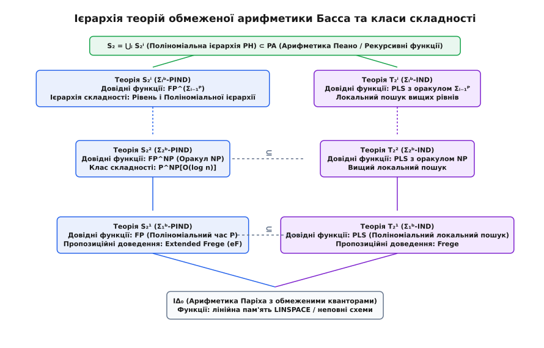
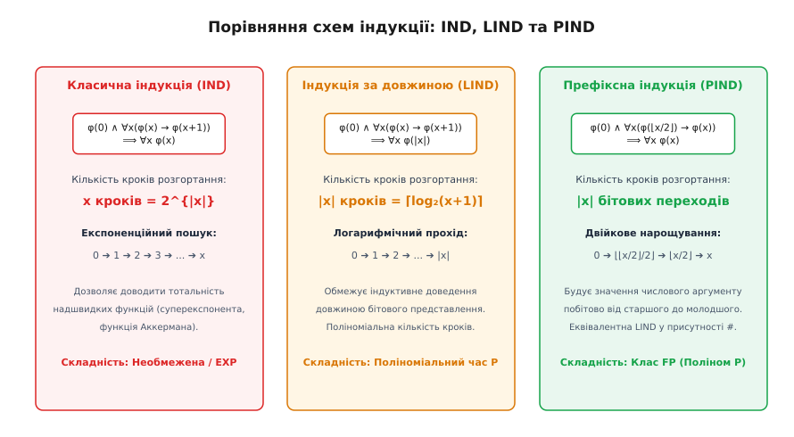
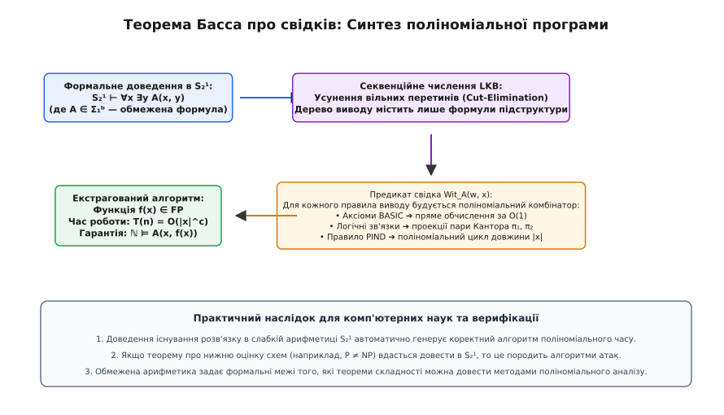

# Обмежена арифметика

<preknowlist>
- [Арифметика Пеано](book:algorithms/peano-arithmetic) — формальна аксіоматика натуральних чисел, мова першого порядку та схема повної індукції.
- [Поліноміальна ієрархія](book:algorithms/polynomial-hierarchy) — чергування кванторів, класи складності `Σᵢᴾ`, `Πᵢᴾ` та редукції з оракулами.
- [Арифметична ієрархія](book:algorithms/arithmetic-hierarchy) — класи `Σ♁⁰`, `Π♁⁰`, формула з необмеженими кванторами та нерозв'язність.
- [Складність схем AC⁰](book:algorithms/ac0-circuits) — паралельні булеві схеми константної глибини та нижні оцінки складності.
</preknowlist>

Коли система автоматичної верифікації програмного забезпечення або інтерактивний довідник теорем отримує формальне доведення твердження `∀x ∃y A(x, y)` у класичній арифметиці Пеано `PA`, фундаментальна теорема Ґеделя про діалектику та метод усунення перетинів Ґентцена гарантують, що існує обчислюваний алгоритм `f`, який для кожного вхідного числа `x` знаходить шуканий результат `y = f(x)`. Проте час роботи такого алгоритму може зростати з катастрофічною швидкістю. Оскільки класична схема арифметичної індукції дозволяє перевіряти властивості послідовним перебором від `0` до `x`, для 256-бітного числового входу кількість кроків виведення сягає `2^{256}`, що перевищує кількість елементарних частинок у доступному спостереженню Всесвіті. У такій системі можна формально довести тотальність функції Аккермана або велетенських функцій швидкої ієрархії, але синтезована з доведення програма є принципово нездійсненною на реальних обчислювальних машинах.

Для теоретичної інформатики, криптографії та верифікації критичних алгоритмів потрібна принципово інша логіка: формальна математична теорія, у якій доведення існування розв'язку гарантує не просто абстрактну рекурсивність, а практичну обчислюваність за поліноміальний час `P` (клас `FP`) або на фіксованому рівні поліноміальної ієрархії `PH`. Цю фундаментальну задачу розв'язує **обмежена арифметика** (англ. *bounded arithmetic*, від лат. *limitatus* — обмежений та грец. *arithmētikē* — мистецтво обчислення чисел) — сімейство формальних арифметичних систем, де квантори та схеми індукції обмежені розміром двійкового запису чисел.

## Синтаксичний бар'єр: чому мови Пеано замало для поліноміального часу

Щоб обмежити силу дедуктивного виведення класом поліноміального часу, першим природним кроком здається звуження кванторів у формулах. У 1971 році Рохіт Паріх (Rohit Parikh) запропонував арифметичну систему `IΔ₀`, у якій заборонено необмежені квантори `∀x` та `∃x`, а дозволено лише обмежені квантори виду:

```
(∀x ≤ t) φ ≡ ∀x (x ≤ t → φ)
(∃x ≤ t) φ ≡ ∃x (x ≤ t ∧ φ)
```

де `t` — довільний алгебраїчний терм класичної мови арифметики, складений із константи `0`, операції взяття наступника `S(x) = x + 1`, додавання `+` та множення `·`.

Проте система `IΔ₀` натрапляє на непереборну виразну перешкоду. Будь-який числовий терм `t(x)`, побудований із додавання та множення, є звичайним многочленом від значення `x`: `t(x) = cₖ · xᵏ + ... + c₁ · x + c₀`. Якщо вимірювати розмір вхідних даних у двійкових бітах, тобто розглядати бітову довжину `n = |x| ≈ log₂ x`, то числове значення терма `t(x)` сягає `2^{k · n}`. Його бітова довжина дорівнює:

```
|t(x)| ≈ log₂(xᵏ) = k · |x| = k · n
```

Це означає, що термами мови `IΔ₀` можна описати лише такі об'єкти, чия бітова довжина зростає *лінійно* від довжини входу `n`. У цій мові принципово неможливо записати число, бітова довжина якого дорівнює поліному вищого степеня, наприклад `n² = |x|²` або `n³ = |x|³`. Проте будь-який стандартний алгоритм поліноміального часу (наприклад, алгоритм множення матриць або динамічне програмування) будує проміжні структури даних, масиви або таблиці, бітовий розмір яких є поліномом від довжини входу `|x|^k`. У мові `IΔ₀` неможливо навіть сформулювати твердження про існування сертифіката чи таблиці квадратичного розміру, оскільки верхня межа для квантора `∃y ≤ t` не здатна досягти потрібного значення.

У 1985 році американський математик і логік Семюел Басс (Samuel Buss) здійснив прорив, ввівши спеціалізовану мову першого порядку `L₂`, яка містить операції над двійковими представленнями чисел:

```
L₂ = { 0, S, +, ·, ≤, ⌊x/2⌋, |x|, # }
```

Ці символи мають строгу семантику над множиною натуральних чисел `ℕ`:
1. `⌊x/2⌋` — операція цілочисельного ділення на 2. У двійковому поданні це операція побітового зсуву праворуч на один розряд, яка відкидає наймолодший біт числа.
2. `|x|` — функція бітової довжини числа `x`. Вона визначається як кількість двійкових цифр у записі `x`:

```
|x| = ⌈log₂(x + 1)⌉,   причому |0| = 0
```

3. `#` — бінарна операція «smash» (роздавлювання, супермноження, англ. *smash function*), яка визначається через довжини своїх операндів:

```
x # y = 2^{|x| · |y|}
```

Функція `#` є тим архітектурним ключем, який перетворює формальну арифметику на дзеркало теорії складності. Обчислимо бітову довжину результату операції `x # y`:

```
|x # y| = |2^{|x| · |y|}| = |x| · |y| + 1
```

Операція smash перемножує не самі числові величини, а їхні *бітові довжини*. Завдяки цьому з'являється можливість за допомогою скінченної суперпозиції термів виражати довільні поліноміальні межі на довжину двійкового запису:

```
|x # x| = |x|² + 1                  [квадратична бітова довжина]
|(x # x) # x| = (|x|² + 1) · |x| + 1 ≈ |x|³   [кубічна бітова довжина]
```

## Алгебраїчний фундамент: аксіоматична система BASIC

Щоб задати правила перетворення символьних виразів без залучення кванторів, Басс визначив систему `BASIC`. Вона складається з 32 відкритих (безкванторних) аксіом, які замінюють класичні рекурсивні аксіоми додавання й множення Пеано чисто алгебраїчними та бітовими законами:

```
(1)  y ≤ x → y ≤ S(x)
(2)  x ≠ S(x)
(3)  0 ≤ x
(4)  x ≤ y ∧ y ≤ x → x = y
(5)  x ≤ y ∧ y ≤ z → x ≤ z
(6)  x ≤ y ∨ y ≤ x
(7)  x ≤ y ↔ x < S(y)
(8)  x ≠ 0 ↔ 0 < x
(9)  y ≤ x → y + z ≤ x + z
(10) x ≤ y ∧ 0 ≤ z → x · z ≤ y · z
(11) x + y = y + x
(12) x + (y + z) = (x + y) + z
(13) x + 0 = x
(14) x + S(y) = S(x + y)
(15) x · y = y · x
(16) x · (y + z) = (x · y) + (x · z)
(17) x · 0 = 0
(18) x · S(y) = (x · y) + x
(19) 0 = |0|
(20) x ≠ 0 → |S(x)| ≤ S(|x|) ∧ |x| ≤ |S(x)|
(21) |x + y| ≤ |x| + |y|
(22) |x| ≤ y ↔ x < 2ʸ
(23) x ≤ 2|ˣ|
(24) ⌊0/2⌋ = 0
(25) ⌊S(x)/2⌋ ≤ S(⌊x/2⌋)
(26) x = 2 · ⌊x/2⌋ ∨ x = S(2 · ⌊x/2⌋)
(27) x # 0 = 1
(28) x ≠ 0 → 1 # x = 2 · (1 # ⌊x/2⌋) ∨ 1 # x = S(2 · (1 # ⌊x/2⌋))
(29) x # y = y # x
(30) |x| = |y| → x # z = y # z
(31) |x| = |y| + |z| → x # w = (y # w) · (z # w)
(32) x ≤ y → x # z ≤ y # z
```

Ці 32 аксіоми повністю керують взаємодією числових величин, бітових довжин та оператора роздавлювання. Зокрема, аксіома (26) гарантує, що будь-яке число можна однозначно розкласти на старший префікс `⌊x/2⌋` та молодший біт парності `x rem 2`, що є фундаментом для побітової двійкової індукції.

## Кванторна анатомія: класифікація формул Басса

У мові `L₂` квантори поділяються на два принципово різні типи залежно від простору пошуку, який вони охоплюють:

1. **Звичайні обмежені квантори:**
   Вирази вида `(∀x ≤ t)` та `(∃x ≤ t)`. Оскільки величина терма `t` може сягати експоненти від довжини вхідних змінних `2^{p(n)}`, прямий перебір значень `x` від `0` до `t` вимагає експоненційної кількості кроків `2^{|t|}` відносно довжини входу.
2. **Строго обмежені квантори (англ. *sharply bounded quantifiers*):**
   Вирази вида `(∀x ≤ |t|)` та `(∃x ≤ |t|)`. Тут верхня межа квантора стоїть під знаком довжини `|t|`. Простір перебору містить лише `|t|` елементів. Оскільки `|t|` є поліномом від довжини вхідних бітів, такий перебір вимагає лише поліноміальної кількості кроків.

На основі чергування звичайних обмежених кванторів над строго обмеженим ядром будується кванторна ієрархія Басса для формул мови `L₂`:

- **Клас `Δ₀ᵇ = Σ₀ᵇ = Π₀ᵇ`:**
  Формули, побудовані з термів мови `L₂`, рівностей, нерівностей та логічних зв'язок `¬, ∧, ∨`, у яких дозволено використовувати *виключно строго обмежені квантори* вида `(∀x ≤ |t|)` та `(∃x ≤ |t|)`. Будь-який предикат із класу `Σ₀ᵇ` можна перевірити детермінованим алгоритмом за логарифмічний простір пам'яті (клас `L`) або поліноміальною схемою константної глибини `AC⁰`.

- **Клас `Σ₁ᵇ`:**
  Формули, що починаються з блоку обмежених кванторів існування `(∃x ≤ t)` над `Π₀ᵇ`-формулою, причому всередині дозволено довільну кількість строго обмежених кванторів загальності `(∀y ≤ |s|)`.
- **Клас `Π₁ᵇ`:**
  Формули, що починаються з блоку обмежених кванторів загальності `(∀x ≤ t)` над `Σ₀ᵇ`-формулою, із довільною кількістю строго обмежених кванторів існування `(∃y ≤ |s|)`.

- **Класи `Σᵢᵇ` та `Πᵢᵇ` для `i ≥ 1`:**
  Формули, що містять `i` блоків чергування звичайних обмежених кванторів, де строго обмежені квантори розглядаються як безкоштовні компоненти ядра:
  - `Σᵢᵇ` починається з обмеженого квантора існування `(∃x ≤ t)` над `Πᵢ₋₁ᵇ`-ядром;
  - `Πᵢᵇ` починається з обмеженого квантора загальності `(∀x ≤ t)` над `Σᵢ₋₁ᵇ`-ядром.

- **Клас `Δᵢᵇ`:**
  Формули, які всередині даної формальної теорії еквівалентні як деякій формулі з класу `Σᵢᵇ`, так і деякій формулі з класу `Πᵢᵇ`.

Ця синтаксична класифікація формул точно відображає структуру класів складності.

> **Теорема про відповідність Басса (1986).** Предикат `R(x₁, x₂, ..., xₖ)` над натуральними числами належить до класу `Σᵢᴾ` поліноміальної ієрархії тоді й лише тоді, коли `R` виражається формулою класу `Σᵢᵇ` у стандартній моделі натуральних чисел `ℕ`.

Зокрема:
- Клас `Σ₁ᵇ` точно відповідає класу складності `NP`. Формула `∃y ≤ t(x) φ(x, y)` стверджує існування поліноміального за довжиною сертифіката `y`, перевірка якого здійснюється за детермінований поліноміальний час предикатом `φ ∈ Σ₀ᵇ`.
- Клас `Π₁ᵇ` точно відповідає класу складності `coNP`.
- Клас `Σ₂ᵇ` точно відповідає класу `Σ₂ᴾ = NP^{NP}` (NP з оракулом для задач NP).
- Клас `Δ₁ᵇ` на множині натуральних чисел відповідає класу детермінованого поліноміального часу `P`.


*Ієрархія теорій обмеженої арифметики Басса S₂ⁱ та T₂ⁱ: відповідність між логічними схемами індукції, рівнями поліноміальної ієрархії та класами складності обчислюваних функцій.*

## Кодування послідовностей та бітових масивів

У класичній арифметиці Пеано для кодування скінченних послідовностей чисел довільної довжини використовують β-функцію Ґеделя, яка спирається на китайську теорему про залишки. Проте обчислення великих простих чисел та операцій залишків за модулем у мові арифметики вимагає складних кванторних конструкцій, які важко утримати всередині базового класу `Σ₀ᵇ`.

В обмеженій арифметиці Басса кодування послідовностей реалізується набагато простіше та ефективніше — через пряме представлення чисел як бітових рядків (англ. *bit-strings*).

Нехай `w` — число, що розглядається як послідовність бітів. Мова `L₂` дозволяє за допомогою безкванторних виразів визначати такі операції над бітами:

1. **Виділення `i`-го біта числа `x` (Bit predicate):**
   ```
   Bit(i, x) ≡ ⌊x / 2ⁱ⌋ rem 2 = 1
   ```
   У мові `L₂` цей предикат виражається через ділення та строго обмежені квантори:
   ```
   Bit(i, x) ≡ (∃y ≤ x)(∃z ≤ 1) (x = y · (1 # 2ⁱ) + z · (1 # 2ⁱ⁻¹) + ...)
   ```
   Оскільки `i ≤ |x|`, предикат `Bit(i, x)` належить до класу `Δ₀ᵇ`.

2. **Кодування кортежів та списків (Sequence encoding):**
   Послідовність чисел `⟨a₀, a₁, ..., a_{k-1}⟩` фіксованого розміру елементів кодується числом `w`, розбитим на рівні блоки довжини `L = max |aᵢ|`. Довжина загального коду `|w| = k · L` не перевищує полінома від довжин компонентів. Завдяки оператору `#` ми можемо оцінити розмір результуючого коду як `w ≤ a_max # k`.
3. **Операція проекції `(w)ᵢ`:**
   Функція вилучення `i`-го елемента послідовності `(w)ᵢ` реалізується зсувом та маскуванням:
   ```
   (w)ᵢ = ⌊w / 2^{i · L}⌋ rem 2ᴸ
   ```
   Усі ці функції є строго визначеними в `BASIC` та довідно тотальними у слабкій системі `S₂¹`. Це дозволяє формулювати та доводити твердження про виконання кроків машин Тюринга, таблиць синтаксичного розбору та графів переходів без виходу за межі класу `Δ₁ᵇ`.

## Спектр індукції: IND, LIND та префіксна індукція PIND

Арифметична теорія визначається не лише своєю мовою, але й тим, для яких саме формул та в якій формі постулюється принцип математичної індукції. У класичній арифметиці Пеано використовується стандартна індукція за наступником `IND` (англ. *successor induction*):

```
φ(0) ∧ ∀x (φ(x) → φ(x + 1)) ⟹ ∀x φ(x)
```

Якщо формула `φ(x)` належить до класу `Σ₁ᵇ`, чи дозволяє теорія `BASIC + Σ₁ᵇ-IND` отримати поліноміальні алгоритми? Відповідь негативна. Розгортання індукційного кроку від числа `0` до числа `x` вимагає послідовного виконання `x` кроків:

```
0 ➔ 1 ➔ 2 ➔ 3 ➔ ... ➔ x
```

Оскільки `x = 2^{|x|}`, навіть якщо кожний окремий перехід `φ(k) → φ(k+1)` обчислюється за 1 мікросекунду, для 100-бітного аргументу послідовність містить `2^{100}` кроків. Якщо функція будується як композиція `x` кроків, її сумарна часова складність стає експоненційною.

Щоб утримати обчислювальну силу системи всередині класу `P`, Семюел Басс ввів два альтернативні індуктивні принципи:

### 1. Індукція за довжиною (LIND — Length Induction)

Схема `LIND` стверджує, що якщо властивість виконується для нуля і зберігається при переході до наступника, то вона виконується для *довжини* довільного числа:

```
φ(0) ∧ ∀x (φ(x) → φ(x + 1)) ⟹ ∀x φ(|x|)
```

Кількість кроків розгортання індукції для аргументу `x` становить не `x`, а `|x| = ⌈log₂(x + 1)⌉`. Для 100-бітного числа це лише 100 кроків. Поліноміальна композиція поліноміальної кількості елементарних операцій гарантовано залишається поліноміальною.

### 2. Префіксна або поліноміальна індукція (PIND — Polynomial / Prefix Induction)

Схема `PIND` спирається на двійкову структуру натуральних чисел. Замість переходу від `x` до `x + 1`, індуктивний крок робиться від числа `⌊x/2⌋` (числа `x` без молодшого біта) до самого числа `x`:

```
φ(0) ∧ ∀x (φ(⌊x/2⌋) → φ(x)) ⟹ ∀x φ(x)
```

Інтуїція префіксної індукції полягає в нарощуванні двійкового запису числа від старших розрядів до молодших. Будь-яке натуральне число `x` можна отримати з `0` за `|x|` кроків, на кожному кроці зсуваючи наявне число ліворуч та додаючи черговий біт (`0` або `1`):

```
0 ➔ ⌊⌊x/4⌋⌋ ➔ ⌊x/2⌋ ➔ x
```

Шлях від кореня двійкового дерева до значення `x` має довжину рівно `|x|`.


*Схеми індукції в арифметиці: необмежена індукція за наступником IND розгортається за 2^{|x|} кроків, індукція за довжиною LIND — за |x| кроків, а префіксна індукція PIND нарощує аргумент побітово за |x| кроків.*

### Ієрархія теорій S₂ⁱ та T₂ⁱ

На основі вибору схеми індукції та обмеження на складність індуктивної формули Басс побудував дві паралельні родини формальних теорій першого порядку:

1. **Теорії `S₂ⁱ`:**
   Визначаються як `S₂ⁱ = BASIC + Σᵢᵇ-PIND`. Індукція дозволена лише для формул класу `Σᵢᵇ` і застосовується у префіксній формі `PIND`.
2. **Теорії `T₂ⁱ`:**
   Визначаються як `T₂ⁱ = BASIC + Σᵢᵇ-IND`. Індукція дозволена для формул класу `Σᵢᵇ`, але у формі класичного наступника `IND`.

Між цими теоріями існують фундаментальні структурні зв'язки:
- У присутності мови `L₂` та аксіом `BASIC` схема префіксної індукції `Σᵢᵇ-PIND` є дедуктивно еквівалентною схемі індукції за довжиною `Σᵢᵇ-LIND`:
  `BASIC + Σᵢᵇ-PIND ≡ BASIC + Σᵢᵇ-LIND`
- Схема `IND` є сильнішою за `LIND`, тому теорія `S₂ⁱ` завжди є підтеорією `T₂ⁱ`:
  `S₂ⁱ ⊆ T₂ⁱ`
- Басс довів, що теорія `T₂ⁱ` вкладається у теорію `S₂ⁱ⁺¹` вищого рівня:
  `T₂ⁱ ⊆ S₂ⁱ⁺¹`

Це утворює нескінченну драбину чергування теорій:

```
S₂¹ ⊆ T₂¹ ⊆ S₂² ⊆ T₂² ⊆ ... ⊆ S₂ⁱ ⊆ T₂ⁱ ⊆ S₂ⁱ⁺¹
```

Якщо об'єднати всі рівні за всіма `i ≥ 1`, обидві ієрархії збігаються у єдину грандіозну теорію обмеженої арифметики:

```
S₂ = ⋃_{i=1}^∞ S₂ⁱ = ⋃_{i=1}^∞ T₂ⁱ = T₂
```

Теорія `S₂` повністю формалізує поліноміальну ієрархію `PH` у тому самому сенсі, у якому повна арифметика Пеано `PA` формалізує всю арифметичну ієрархію та клас усіх рекурсивних функцій.

## Головна теорема Басса про свідків: компіляція доведень у програми

Центральним результатом усієї теорії обмеженої арифметики є конструктивний зв'язок між дедуктивним виведенням у слабкій теорії `S₂¹` та обчисленнями за поліноміальний час.

> **Теорема Басса про свідків (Buss Witnessing Theorem, 1986).** Нехай у теорії `S₂¹` доведено твердження:
> ```
> S₂¹ ⊢ ∀x ∃y A(x, y)
> ```
> де `A(x, y) ∈ Σ₁ᵇ` — довільна обмежена формула. Тоді існує алгоритм поліноміального часу `f ∈ FP` (функція з класу поліноміального часу `P`) та поліном `p(n)` такі, що:
> 1. Для кожного `x ∈ ℕ` значення функції задовольняє обмеження за розміром: `|f(x)| ≤ p(|x|)`.
> 2. У стандартній моделі виконується: `ℕ ⊨ ∀x A(x, f(x))`.
> 3. Саму програму для `f` можна алгоритмічно видобути (екстрагувати) з тексту формального доведення в `S₂¹`.

Ця теорема перетворює логічну систему `S₂¹` на функціональну мову програмування з гарантією поліноміального часу виконання. Якщо інженер зміг формально довести у системі `S₂¹`, що для будь-якого вхідного графа існує мінімальне кістякове дерево, система гарантовано породить програму поліноміального часу, яка це дерево знаходить.


*Екстракція поліноміального алгоритму з конструктивного доведення в теорії S₂¹ за допомогою теореми про свідків та усунення перетинів у численні ґенценівського типу.*

### Механізм екстракції: числення LKB та предикат свідка

Як саме із символьного формального виведення синтезується поліноміальний код? Доведення теореми Басса складається з трьох послідовних математичних кроків:

#### 1. Числення секвенцій LKB та усунення перетинів

Теорія `S₂¹` формулюється у вигляді секвенційного числення ґенценівського типу `LKB`, де правила виведення оперують секвенціями виду `Γ → Δ` (де `Γ, Δ` — скінченні мультиподачі формул). Правила числення включають:
- Логічні аксіоми виду `A → A`.
- Структурні правила (ослаблення, перестановка, скорочення формул).
- Правила введення логічних зв'язок (зліва та справа від стрілки).
- Правила для обмежених кванторів `(∃x ≤ t)` та `(∀x ≤ t)`.
- Правило префіксної індукції `Σ₁ᵇ-PIND`:
  ```
  Γ, A(⌊b/2⌋) → A(b), Δ
  ───────────────────────────────────
  Γ, A(0) → A(t), Δ
  ```
  де `b` — змінна власного параметра (eigenvariable), яка не входить вільно у нижню секвенцію.

Застосовується фундаментальна теорема про усунення вільних перетинів (Free Cut Elimination): будь-яке доведення в `LKB` можна алгоритмічно перебудувати у доведення без вільних перетинів, де кожна проміжна формула є підформулою цільової секвенції або аксіомою `BASIC`.

#### 2. Індуктивне визначення предикату свідка (Witnessing Predicate)

Для кожної формули `A` мови `L₂` визначається новий предикат `Wit_A(w, a)`, де `w` — число, що кодує «свідка» (структуру даних із сертифікатами істинності):
- Якщо `A` є безкванторною формулою з `BASIC`, свідок не потрібен:
  `Wit_A(w, a) ≡ A(a)`
- Для кон'юнкції `A ∧ B`: свідок є парою Кантора `w = ⟨w₁, w₂⟩`:
  `Wit_{A ∧ B}(w, a) ≡ Wit_A(π₁(w), a) ∧ Wit_B(π₂(w), a)`
- Для диз'юнкції `A ∨ B`: свідок кодує вибір лівої чи правої гілки та свідка для неї:
  `Wit_{A ∨ B}(w, a) ≡ (π₁(w) = 0 ∧ Wit_A(π₂(w), a)) ∨ (π₁(w) ≠ 0 ∧ Wit_B(π₂(w), a))`
- Для строго обмеженого квантора `(∀x ≤ |t|) A(x)`: свідок `w` є списком довжини `|t|`, де `i`-й елемент є свідком для `A(i)`.
- Для обмеженого квантора існування `(∃x ≤ t) A(x)`:
  `Wit_{(∃x ≤ t) A}(w, a) ≡ π₁(w) ≤ t ∧ Wit_A(π₂(w), a, π₁(w))`

Свідок для квантора існування безпосередньо містить значення шуканого розв'язку `y = π₁(w)`.

#### 3. Трансляція правил виведення у поліноміальні комбінатори

За індукцією за висотою дерева виведення в `LKB` для кожної секвенції будується поліноміальна функція, яка перетворює свідків засновків у свідка висновку:
- Аксіоми `BASIC` обчислюються за `O(1)`.
- Логічні правила відповідають формуванню пар та проєкціям `π₁, π₂`.
- Головний крок — правило `Σ₁ᵇ-PIND`:
  `Γ, A(⌊x/2⌋) → A(x), Δ`
  Перетворюється на поліноміальний цикл довжини `|x|`. На початку ітерації маємо свідка для `A(0)`. На кожному з `|x|` кроків викликається поліноміальна функція кроку, яка зі свідка для префікса `⌊k/2⌋` обчислює свідка для `k`. Оскільки кількість ітерацій дорівнює `|x|`, а кожен крок працює за поліноміальний час від розміру входу, увесь цикл гарантовано завершується за поліноміальний час `O(|x|^c)`.

### Довідні функції вищих рівнів ієрархії

Теорема Басса масштабується на всю ієрархію теорій `S₂ⁱ` та `T₂ⁱ`:

1. **Для теорій `S₂ⁱ` (`i ≥ 1`):**
   Функція `f` є довідно тотальною в `S₂ⁱ` (тобто `S₂ⁱ ⊢ ∀x ∃y A(x, y)` для `A ∈ Σᵢᵇ`) тоді й лише тоді, коли `f` належить до класу `FP^{Σ_{i-1}^P}` — функцій, що обчислюються за поліноміальний час на машині Тюринга з оракулом для задач рівня `Σ_{i-1}^P` поліноміальної ієрархії:
   - Для `S₂¹`: `FP^{Σ₀^P} = FP` (звичайний поліноміальний час `P`).
   - Для `S₂²`: `FP^{NP}` (поліноміальний час із доступом до оракула `SAT`).
   - Для `S₂³`: `FP^{\Sigma_2^P}`.

2. **Для теорії `T₂¹`:**
   Якщо `T₂¹ ⊢ ∀x ∃y A(x, y)` для `A ∈ Σ₁ᵇ`, то клас обчислюваних функцій не збігається з `P`. Він точно характеризує клас **PLS (Polynomial Local Search)** — задачі локальної оптимізації (пошук локального мінімуму у дискретному просторі станів за поліноміальну кількість кроків локального покращення), введений Джонсоном, Пападімітріу та Яннакакісом.

## Принцип Діріхле та релятивізоване розділення теорій

Одним із центральних питань математичної логіки є питання про те, чи є вкладення в ієрархії Басса суворими: чи справді `S₂¹ ⊊ T₂¹ ⊊ S₂² ⊊ ...`?

У чистому вигляді (без оракулів) це питання є надзвичайно глибоким і тісно переплітається з нерозв'язаною проблемою розділення класів складності `P \stackrel{?}{=} NP \stackrel{?}{=} PH`. Проте в релятивізованому світі (за наявності невизначеного функціонального або предикатного символу-оракула `α`) суворість ієрархії вдалося повністю довести.

Ключовим полігоном для перевірки дедуктивної сили теорій обмеженої арифметики став комбінаторний **принцип Діріхле** (англ. *Pigeonhole Principle*, `PHP`). Твердження `PHP_n^{n+1}` проголошує:
> Неможливо розмістити `n + 1` голубів у `n` клітках так, щоб у кожній клітці опинилося не більше одного голуба.

У мові обмеженої арифметики з оракульним предикатом відображення `R(x, y)` принцип Діріхле формулюється формулою:

```
(∀x ≤ n)(∃y < n) R(x, y) ∧ (∀x ≤ n)(∀y < n)(∀z < n) (R(x, y) ∧ R(x, z) → y = z)
⟹ (∃x₁ ≤ n)(∃x₂ ≤ n)(∃y < n) (x₁ ≠ x₂ ∧ R(x₁, y) ∧ R(x₂, y))
```

Дослідження Яна Країчека, Павла Пудлака, Ґабора Такеуті та Йогана Хастада встановили такі точні результати:
1. **Недовідність у слабких системах:** Теорія `IΔ₀(α)` не здатна довести принцип Діріхле `PHP_n^{n+1}` за допомогою коротких виведень. Будь-яке доведення вимагає експоненційного розміру.
2. **Довідність через вищу індукцію:** Теорія `T₂²(α)` здатна довести `PHP_n^{n+1}` поліноміальним виведенням, використовуючи підрахунок розміру множин через предикати вищого рівня.
3. **Релятивізоване розділення:** Існує такий предикатний оракул `α`, відносно якого теорія `S₂¹(α)` є строго слабшою за `T₂¹(α)`, а теорія `T₂ⁱ(α)` є строго слабшою за `S₂ⁱ⁺¹(α)`. Для оракульних систем ієрархія теорій Басса є нескінченною і ніколи не колапсує.

## Пропозиційні доведення та трансляція Паріса–Вілкі

Між теоріями обмеженої арифметики та теорією складності пропозиційних доведень (англ. *propositional proof complexity*) існує глибокий ізоморфізм, відкритий Джеффом Парісом, Алексом Вілкі, Яном Країчеком та Павлом Пудлаком.

Нехай `φ(x)` — деяка формула обмеженої арифметики. Якщо ми зафіксуємо бітову довжину числового аргументу `|x| = n`, то всі числові змінні перетворюються на скінченні набори з `n` булевих змінних `x₀, x₁, ..., x_{n-1}`. Усі обмежені квантори `(∀y ≤ x)` та `(∃y ≤ x)` перетворюються на скінченні булеві кон'юнкції `⋀` та диз'юнкції `⋁` довжини `2^n`, а строго обмежені квантори `(∀y ≤ |x|)` перетворюються на кон'юнкції поліноміальної довжини `n`.

У результаті кожна формула `φ` породжує сімейство пропозиційних формул `[[φ]]_n` поліноміального розміру `n^{O(1)}`. Формальне доведення твердження `∀x φ(x)` у системі обмеженої арифметики автоматично транслюється у поліноміальне за розміром доведення сімейства тавтологій `[[φ]]_n` у відповідній системі пропозиційного числення:

| Теорія обмеженої арифметики | Система пропозиційних доведень | Клас складності схем |
|---|---|---|
| `IΔ₀` (Паріх) | Системи Фреге обмеженої глибини (`AC⁰`-Frege) | Схеми константної глибини `AC⁰` |
| `T₂¹` (Басс) | Класичні системи Фреге (`Frege`) | Схеми поліноміального розміру |
| `S₂¹` (Басс) | Розширені системи Фреге (`Extended Frege`, `eF`) | Схеми з новими змінними-абревіатурами |

У системі Extended Frege дозволено вводити нові пропозиційні змінні `p ≡ ψ` як скорочення для великих булевих підформул. Це точно відповідає здатності теорії `S₂¹` вводити нові імена для поліноміальних функцій через предикат свідка.

Це дає фундаментальний міст між логікою та складністю:
> Питання про те, чи розпадається ієрархія теорій Басса `S₂¹ ⊊ S₂² ⊊ ... ⊊ S₂`, є еквівалентним питанню про те, чи існують тавтології, які мають поліноміальні доведення в Extended Frege, але вимагають експоненційних доведень у звичайній системі Frege.

## Межі формальної довідності та бар'єр природних доведень

Одне з найглибших застосувань обмеженої арифметики полягає у з'ясуванні меж того, які теореми складності сучасна математика взагалі здатна довести.

Центральна проблема теоретичної інформатики про рівність класів `P` та `NP` формулюється як питання про те, чи існує детермінований поліноміальний алгоритм для перевірки виконуваності булевих формул SAT. Якщо класи не збігаються, чи можна це твердження формально довести всередині слабких систем арифметики на зразок `S₂¹` або `S₂²`?

У 1995 році Олександр Разборов опублікував фундаментальну працю, яка пов'язала обмежену арифметику з теорією природних доведень Разборова–Рудіча (англ. *Natural Proofs*). Більшість відомих методів доведення нижніх оцінок для схем (наприклад, теорема Фурста–Сакса–Сіпсера та лема про перемикання Смоленського про те, що парність не належить до `AC⁰`) спираються на так звані «природні властивості» булевих функцій:
1. **Конструктивність (ефективність):** Властивість можна перевірити за поліноміальний час від розміру таблиці істинності функції.
2. **Масивність (розповсюдженість):** Властивість виконується для значної частки всіх можливих булевих функцій.

Разборов показав, що будь-яке комбінаторне доведення нижніх оцінок, яке використовує природну властивість, можна повністю формалізувати всередині теорії `S₂²` (а за додаткових умов — навіть у `S₂¹`).

З іншого боку, якщо в комп'ютерних науках існують криптографічно стійкі псевдовипадкові генератори (англ. *pseudorandom generators*, наприклад, на основі складності факторизації чисел RSA або дискретного логарифму), то жодна природна властивість не здатна розрізнити псевдовипадкові функції від випадкових.

Звідси випливає фундаментальний висновок:
> Якщо існує стійка асиметрична криптографія, то теорія `S₂²` не здатна довести суперполіноміальні нижні оцінки для загальних булевих схем. Зокрема, твердження про те, що NP не міститься у класі поліноміальних схем P/poly (і як наслідок нерівність P та NP), є недовідним у теорії `S₂²` природними методами.

Обмежена арифметика пояснює, чому класичні методи теорії складності зіткнулися з глухим кутом: самі логічні системи, що моделюють поліноміальні міркування, є принципово сліпими до розділення класів складності, доки в них не будуть введені неприродні, некорисні для криптографії інструменти.

## Практична реалізація: обчислення smash-оператора та префіксна індукція

Щоб побачити, як абстрактні операції обмеженої арифметики виглядають у реальному програмному коді, реалізуємо алгоритм обчислення функції smash `x # y`, визначення бітової довжини та демонстрацію циклу префіксної індукції `PIND`, що екстрагує розв'язок за логарифмічну кількість кроків від величини аргументу.

:::tabs
```c
/* Обчислення базових функцій обмеженої арифметики мовою C */
#include <stdio.h>
#include <stdint.h>
#include <stdbool.h>

/* Обчислення бітової довжини |x| = ceil(log2(x + 1)), |0| = 0 */
uint32_t bit_length(uint64_t x) {
    if (x == 0) return 0;
    uint32_t len = 0;
    while (x > 0) {
        len++;
        x >>= 1; /* x = floor(x / 2) */
    }
    return len;
}

/* Обчислення функції smash: x # y = 2^{|x| * |y|} */
bool smash_function(uint64_t x, uint64_t y, uint64_t *result) {
    uint32_t len_x = bit_length(x);
    uint32_t len_y = bit_length(y);
    uint64_t power = (uint64_t)len_x * (uint64_t)len_y;

    if (power >= 64) {
        return false; /* Переповнення 64-бітного беззнакового типу */
    }

    *result = ((uint64_t)1) << power;
    return true;
}

/* Емуляція кроку префіксної індукції PIND для обчислення кількості одиничних бітів */
uint32_t pind_popcount(uint64_t x) {
    if (x == 0) return 0;
    
    /* Рекурсивний або стековий перехід: обчислюємо для floor(x / 2), потім для x */
    uint64_t prefixes[64];
    int depth = 0;
    
    uint64_t curr = x;
    while (curr > 0) {
        prefixes[depth++] = curr;
        curr >>= 1; /* curr = floor(curr / 2) */
    }

    /* Індуктивне розгортання: рівно |x| кроків замість x кроків */
    uint32_t witness = 0; /* База індукції: phi(0) = 0 */
    for (int i = depth - 1; i >= 0; i--) {
        uint64_t val = prefixes[i];
        witness = witness + (uint32_t)(val & 1); /* Індуктивний перехід */
    }

    return witness;
}
```
```cpp
// Ідіоматична реалізація операторів обмеженої арифметики мовою C++
#include <iostream>
#include <cstdint>
#include <optional>
#include <vector>
#include <bit>
#include <span>

namespace bounded_arithmetic {

// Обчислення бітової довжини |x| через бітові операції
[[nodiscard]] constexpr std::uint32_t bit_length(std::uint64_t x) noexcept {
    if (x == 0) return 0;
    return static_cast<std::uint32_t>(std::bit_width(x));
}

// Обчислення функції smash: x # y = 2^{|x| * |y|}
[[nodiscard]] constexpr std::optional<std::uint64_t> smash(std::uint64_t x, std::uint64_t y) noexcept {
    const std::uint32_t len_x = bit_length(x);
    const std::uint32_t len_y = bit_length(y);
    const std::uint64_t exponent = static_cast<std::uint64_t>(len_x) * len_y;

    if (exponent >= 64) {
        return std::nullopt; // Безпечна обробка арифметичного переповнення
    }

    return std::uint64_t{1} << exponent;
}

// Префіксний ітератор PIND: виконує індуктивний синтез за |x| кроків
template <typename State, typename StepCombinator>
[[nodiscard]] State execute_pind(std::uint64_t x, State initial_state, StepCombinator step) {
    if (x == 0) return initial_state;

    std::vector<std::uint64_t> prefix_stack;
    prefix_stack.reserve(64);

    for (std::uint64_t curr = x; curr > 0; curr >>= 1) {
        prefix_stack.push_back(curr);
    }

    State current_state = initial_state;
    // Розгортання префіксного шляху довжини |x|
    for (auto it = prefix_stack.rbegin(); it != prefix_stack.rend(); ++it) {
        current_state = step(current_state, *it);
    }

    return current_state;
}

} // namespace bounded_arithmetic
```
:::

> 🔧 **Навіщо це.**
>
> 1. **Автоматична екстракція коректних програм у системах верифікації (Coq, Lean, Isabelle/HOL):**
>    Коли розробник доводить коректність алгоритму в інтерактивному довіднику, система генерує двійковий або функціональний код. Розуміння обмеженої арифметики дозволяє будувати системи типів і тактики, які гарантують, що доведення завершуваності не використовує неконтрольовану індукцію `IND`, захищаючи екстрагований код від надполіноміального розростання часу роботи.
>
> 2. **Аналіз меж потужності SAT/SMT-солверів:**
>    Сучасні промислові солвери виводять сертифікати нездійсненності (DRAT / LRAT), які є доведеннями у розширених системах резолюції та Extended Frege. Зв'язок між `S₂¹` та Extended Frege дозволяє аналітикам теоретично оцінювати, які класи інваріантів солвер зможе знайти автоматично за поліноміальний час, а на яких формулах він неминуче зависне.
>
> 3. **Формальна верифікація криптографічних протоколів:**
>    Доведення безпеки криптосистем (наприклад, стійкості шифрування до атак на основі відкритого тексту) вимагають формулювання супротивника як алгоритму з класу `FP` або `P/poly`. Моделювання супротивника у мові `S₂¹` або `S₂²` гарантує, що у формальному доведенні безпеки супротивнику ненавмисно не надано надприродної обчислювальної сили, яка зробила б верифікацію хибною.
