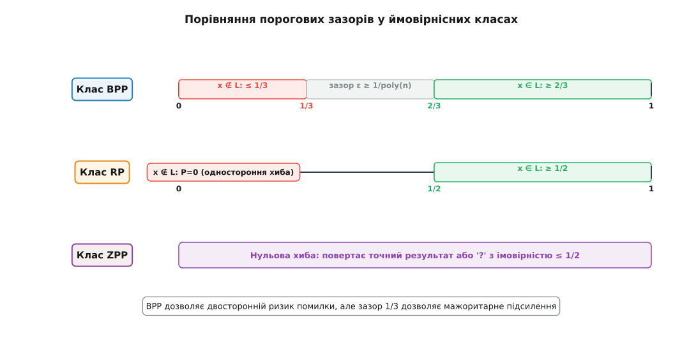
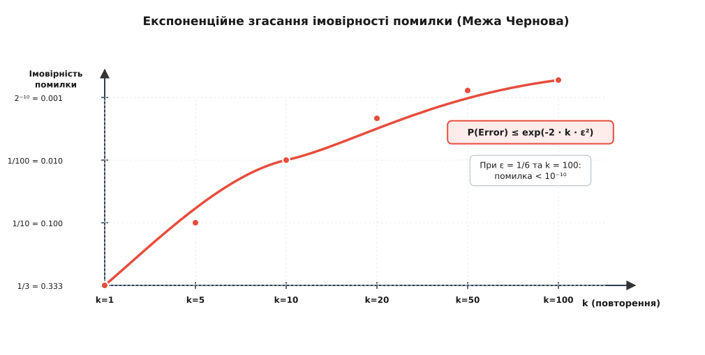
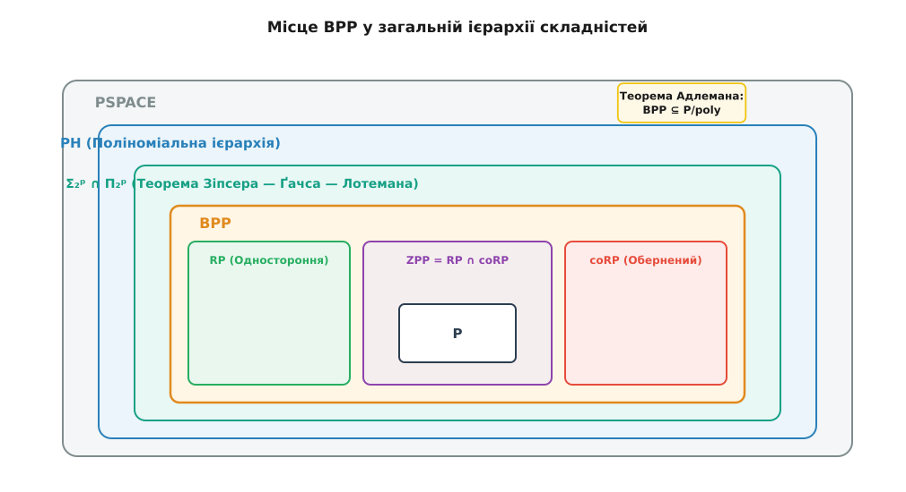

# Клас BPP: ймовірнісні поліноміальні обчислення

<preknowlist>
- [Класи P і NP та NP-повнота](topic:algorithms/np-completeness) — поняття поліноміального часу, детерміністичних та недетерміністичних машин Тюрінга.
- [Асимптотична складність](topic:algorithms/asymptotic-complexity) — нотація O великого та поліноміальні межі обчислювальних ресурсів.
- [Клас PP: ймовірнісний поліноміальний час](topic:algorithms/pp-probabilistic-polynomial) — порогова модель ймовірнісних обчислень без гарантованого зазору відокремлення.
</preknowlist>

Якщо комп'ютерна програма має довести, що 1024-бітне число є простим, або перевірити, чи дорівнює нулю складний багатовимірний поліном з мільйоном доданків, класичні детерміновані алгоритми можуть вимагати годин, днів або навіть століть обчислень. Проте якщо надати процесору можливість підкидати під час роботи фізичну монету й приймати рішення на основі її результатів, задача розв'язується за лічені мілісекунди. Ціною такого прискорення є ризик помилки: алгоритм може повернути хибну відповідь. 

Якщо імовірність помилки алгоритму строго відокремлена від випадкового вгадування гарантованим зазором (наприклад, алгоритм дає правильну відповідь у принаймні 2/3 випадків), ця помилка перестає бути перешкодою. Повторивши обчислення кілька десятків разів на незалежних випадкових бітах і прийнявши рішення більшістю голосів, ймовірність помилки можна зменшити до величини, меншої за шанс одночасного виходу з ладу всіх серверів дата-центру через удар блискавки.

Клас складності **BPP** (від англійського *Bounded-error Probabilistic Polynomial-time*, де *probabilis* — латинське слово для позначення ймовірності чи вірогідності) формалізує саме цю категорію обчислень: задачі, які розв'язуються за поліноміальний час за допомогою випадковості з гарантовано обмеженою двосторонньою хибою. BPP вважається справжньою теоретичною межею того, що сучасні обчислювальні системи здатні ефективно розв'язувати на практиці.

## 1. Імовірнісні машини Тюрінга та формальне означення класу BPP

У детермінованій машині Тюрінга кожен стан стрічки та поточна інструкція повністю визначають єдиний наступний крок обчислення. Конфігураційний простір являє собою лінійну послідовність станів. У недетермінованій машині (модель класу NP) машина може розгалужуватися на кілька альтернативних шляхів, а вхід вважається прийнятим, якщо існує *хоча б один* приймальний шлях у деревоподібній структурі обчислень.

Імовірнісна машина Тюрінга (Probabilistic Turing Machine, PTM) змінює концептуальну суть розгалуження. Замість абстрактного існування свідка, машина Тюрінга отримує доступ до додаткової стрічки, заповненої послідовністю випадкових бітів `r ∈ {0, 1}*`, де кожен біт набуває значення 0 або 1 з однаковою ймовірністю `1/2`. Стан машини описується кортежем `(q, w, head_pos, r_tape)`, де `q` — стан контролера, `w` — вміст робочої стрічки, `head_pos` — позиція голівки, а `r_tape` — поточний біт випадкової стрічки.

На кожному кроці обчислення функція переходу PTM бере поточний стан та черговий біт із випадкової стрічки й детерміновано виконує крок. Таким чином, для фіксованого випадкового вектора `r` виконання машини є повністю детермінованим. Випадковість полягає виключно у рівномірному розподілі ймовірностей над множиною усіх можливих випадкових векторів `r`.

Для вхідного слова `x` завдовжки `n = |x|` ймовірнісна машина `M` працює за поліноміальний час `p(n)` і здійснює `p(n)` монетних кидків. Це утворює скінченне бінарне дерево обчислень, яке має рівно `2ᵖ⁽ⁿ⁾` можливих шляхів. Кожен окремий шлях `r ∈ {0, 1}ᵖ⁽ⁿ⁾` обирається з імовірною мірою `μ(r) = 2⁻ᵖ⁽ⁿ⁾`.

Формальне означення класу складності BPP спирається на наявність двостороннього обмеження ймовірності помилки:

Мова `L ⊆ {0, 1}*` належить до класу **BPP**, якщо існує ймовірнісна машина Тюрінга `M` поліноміального часу та стала `e ∈ [0, 1/2)`, такі що для кожного вхідного слова `x`:
- Якщо `x ∈ L`, то сумарна імовірність прийняття `P_r(M(x, r) = 1) = ∑_{r: M(x,r)=1} 2⁻ᵖ⁽ⁿ⁾ ≥ 1 - e`.
- Якщо `x ∉ L`, то сумарна імовірність прийняття `P_r(M(x, r) = 1) = ∑_{r: M(x,r)=1} 2⁻ᵖ⁽ⁿ⁾ ≤ e`.

За канонічний стандарт у теорії складності приймають значення `e = 1/3`. Тобто:
- Для правильних тверджень (`x ∈ L`) машина повертає 1 з імовірністю принаймні `2/3`.
- Для хибних тверджень (`x ∉ L`) машина повертає 1 з імовірністю не більше `1/3` (і відповідно повертає 0 з імовірністю принаймні `2/3`).

Важливо підкреслити **двосторонній** характер хиби (bounded-error): машина може помилитися як у випадку, коли слово належить мові (помилка першого роду, або фальшиво-від'ємне рішення), так і у випадку, коли слово не належить мові (помилка второго роду, або фальшиво-позитивне рішення).

Фізичний зміст цього означення полягає у тому, що ймовірнісна машина Тюрінга відображає роботу реального комп'ютера, підключеного до апаратного генератора шуму (наприклад, теплового шуму p-n переходу транзистора або квантового генератора фотонів). Якщо генератор дає незміщені незалежні біти, програма отримує можливість робити випадкові кроки в алгоритмічному графі.

## 2. Інваріантність констант та пороговий зазор відокремлення

На перший погляд константи `2/3` та `1/3` здаються довільним вибором. Виникає природне питання: чи зміниться клас BPP, якщо замість `2/3` вимагати імовірність правильної відповіді `3/4`, `0.99` або навіть `1/2 + 1/n²`?

Математична краса класу BPP полягає у його повній інваріантності відносно вибору конкретних порогових констант, якщо вони віддалені від `1/2` бодай на зворотний поліном.

Припустимо, що мова `L` розпізнається алгоритмом із зазором `ε(n) = 1 / q(n)`, де `q(n)` — деякий поліном від довжини входу. Тобто:
- Якщо `x ∈ L`, то `P(accept) ≥ 1/2 + 1/q(n)`.
- Якщо `x ∉ L`, то `P(accept) ≤ 1/2 - 1/q(n)`.

Будь-який такий алгоритм із поліноміально малим зазором можна ефективно перетворити на еквівалентний BPP-алгоритм зі стандартним зазором `2/3` та `1/3` (і далі до довільно малого експоненційно згасаючого рівня `2⁻ᵖ⁽ⁿ⁾`) просто за допомогою багаторазового запуску алгоритму та вибору відповіді більшості.


*Порівняння порогових зазорів у ймовірнісних класах.*

Графічне порівняння демонструє кардинальну відмінність між основними ймовірнісними моделями обчислень:
1. **Клас BPP:** Дозволяє помилку в обидва боки, але гарантує наявність незаповненої «нейтральної смуги» (порогового зазору) `2ε` між імовірністю прийняття для `x ∈ L` та `x ∉ L`.
2. **Клас RP (Randomized Polynomial-time):** Одностороння хиба (Monte Carlo з одностороннім ризиком). Якщо `x ∉ L`, машина *ніколи* не помиляється і повертає 0 з імовірністю 1. Якщо `x ∈ L`, машина повертає 1 з імовірністю принаймні `1/2`.
3. **Клас coRP:** Дзеркальний клас до RP. Якщо `x ∈ L`, машина ніколи не помиляється і повертає 1 з імовірністю 1. Якщо `x ∉ L`, імовірність повернення 0 становить принаймні `1/2`.
4. **Клас ZPP (Zero-error Probabilistic Polynomial-time):** Лас-Вегас алгоритми з нульовою хибою. Машина завжди повертає строго правильну відповідь або спеціальний символ відмови від відповіді (`?`), причому середня часова складність є поліноміальною.

Для протиставлення згадаємо [клас PP (Probabilistic Polynomial-time)](topic:algorithms/pp-probabilistic-polynomial). У PP умова прийняття вимагає лише `P(accept) > 1/2` для `x ∈ L` та `P(accept) ≤ 1/2` для `x ∉ L`. Зазор `ε` у класі PP не обмежений знизу ніяким поліномом і може становити експоненційно малу величину `2⁻ᵖ⁽ⁿ⁾` (наприклад, `1/2 + 2⁻¹⁰⁰` проти `1/2`). У результаті для статистичного розрізнення двох станів у PP знадобилося б `O(2²ⁿ)` запусків, що робить фізичну ампліфікацію неможливою. У BPP зазор `ε` завжди поліноміально обмежений знизу, що дає змогу швидко знижувати помилку.

Ця фундаментальна аналітична різниця пояснює, чому BPP описує практичні обчислення, а PP є важким теоретичним класом, який містить Поліноміальну ієрархію. Без гарантованого поліноміального зазору `ε ≥ 1/poly(n)` мажоритарний підрахунок перестає працювати за поліноміальний час.

## 3. Механізм ампліфікації помилки та межа Чернова

Щоб перетворити алгоритм із базовою ймовірністю успіху `2/3` на практично безпомилковий інструмент, застосовують метод **мажоритарної ампліфікації** (majority voting amplification).

Нехай `M` — алгоритм, який помиляється з імовірністю `e = 1/3`. Створимо новий алгоритм `M'`, який запускає `M` незалежно `k` разів на нових випадкових бітах і повертає відповідь, яка зустрілася у більшості запусків (понад `k / 2` разів).

Кожен окремий запуск можна розглядати як випробування Бернуллі з імовірністю помилки `p ≤ 1/3`. Кількість помилок `S` у `k` незалежних випробуваннях підпорядковується біноміальному розподілу `Bin(k, p)` з математичним сподіванням `E[S] = k · p ≤ k / 3` та дисперсією `Var(S) = k · p · (1 - p)`.

Застосуємо мультиплікативну нерівність Чернова (Chernoff bound) для оцінки імовірності того, що кількість помилок `S` перевищить половину запусків `k / 2`:

```
P(S ≥ k / 2) ≤ exp(-2 · k · ε²)
```

де `ε = 1/2 - p` — зазор відокремлення від половини. Для базового випадку `p = 1/3` маємо `ε = 1/6`. Заставивши алгоритм виконати `k` випробувань, імовірність підсумкової помилки обмежується виразом:

```
P(Error) ≤ exp(- k / 18)
```


*Експоненційне згасання імовірності помилки за межею Чернова.*

Графік показує швидкість зменшення помилки зі зростанням `k`:
- При `k = 1` імовірність помилки становить `1/3 ≈ 0.333`.
- При `k = 10` імовірність помилки падає нижче `0.01` (1%).
- При `k = 50` імовірність помилки стає меншою за `10⁻⁶`.
- При `k = 100` імовірність помилки становить менше `10⁻¹⁰`.

Детальний алгебраїчний вивід межі Чернова, порівняння з нерівністю Чебишова та суворе розписання кроків наведено у математичній вставці [🧮 Ампліфікація помилки, межі Чернова та теорема Зіпсера — Ґачса — Лотемана](topic:algorithms/bpp/math-error-amplification.md).

Ця властивість демонструє ключовий висновок теорії BPP: **будь-яку сталу помилку, меншу за 1/2, можна придушити до експоненційно малого рівня за поліноміальний час.**

Важливо відзначити, що при ампліфікації випробування мають бути строго **незалежними**. Якщо повторні запуски алгоритму використовуватимуть корельовані або псевдовипадкові біти з недостатньою ентропією, дисперсія суми `S` зросте, а ефект Чернова згасання помилки зруйнується.

## 4. BPP у зоопарку складністей: від P до P/poly та PH

З'ясування точних меж класу BPP у загальній ієрархії обчислювальних складностей було одним із найважливіших завдань теоретичної інформатики протягом останніх 40 років.


*Місце класу BPP у складнісній ієрархії.*

### Внутрішня структура ймовірнісних класів

З означень випливає природне вкладення детермінованих та ймовірнісних класів:

```
P ⊆ ZPP = (RP ∩ coRP) ⊆ RP ⊆ BPP ⊆ PP ⊆ PSPACE
```

1. **`P ⊆ BPP`:** Будь-який детермінований алгоритм є окремим випадком BPP-алгоритму, який взагалі не використовує монетну стрічку та має імовірність помилки `e = 0`.
2. **`RP ⊆ BPP`:** Якщо алгоритм помиляється лише в один бік (наприклад, для `x ∉ L` імовірність прийняття дорівнює 0, а для `x ∈ L` — принаймні 1/2), він автоматично задовольняє симетричні умови BPP.
3. **`ZPP = RP ∩ coRP`:** Клас задач з нульовою хибою за середній поліноміальний час відповідає перетину класів із односторонньою хибою.

### Теорема Адлемана: BPP та булеві схеми (P/poly)

У 1978 році Леонард Адлеман довів фундаментальний результат, який пов'язав ймовірнісні обчислення з детермінованими булевими схемами поліноміального розміру:

```
BPP ⊆ P/poly
```

Доведення теореми Адлемана спирається на імовірнісний метод Ердеша. За допомогою ампліфікації імовірність помилки BPP-алгоритму на вході довжини `n` можна зробити меншою за `2⁻ⁿ⁻¹`. Оскільки існує всього `2ⁿ` різних входів довжини `n`, за межею об'єднання (Union Bound) сумарна імовірність того, що випадкова послідовність бітів `r` виявиться помилковою *хоча б для одного* входу, становить:

```
P(∃ x ∈ {0, 1}ⁿ : Error(x, r)) ≤ 2ⁿ · 2⁻ⁿ⁻¹ = 1/2 < 1
```

Оскільки імовірність невдачі строго менша за 1, існує принаймні один «ідеальний» випадковий вектор `r*`, який дає правильну відповідь для **усіх** `2ⁿ` входів довжини `n` одночасно. Якщо передати цей вектор `r*` як нерівномірну пораду (advice) довжиною `poly(n)`, детермінована схема розв'яже задачу без жодних монетних кидків.

Ця теорема має важливий філософський наслідок: будь-який ймовірнісний алгоритм BPP можна реалізувати у вигляді зафіксованого апаратного кристала (Hardware Circuit) поліноміального розміру, у якому випадковість замінена впаяними значеннями «золотого» вектора `r*`.

### Теорема Зіпсера — Ґачса — Лотемана: BPP у Поліноміальній ієрархії

Хоча теорема Адлемана показує, що BPP-задачі розв'язуються короткими схемами, вона не гарантує ефективного знаходження ідеального вектора `r*`. У 1983 році Майкл Зіпсер, Петер Ґачс та Клеменс Лотеман довели, що BPP знаходиться на другому рівні [Поліноміальної ієрархії (PH)](topic:algorithms/polynomial-hierarchy):

```
BPP ⊆ Σ₂ᵖ ∩ Π₂ᵖ
```

Ідея доведення Лотемана полягає в тому, що множина «приймальних» випадкових векторів `A_x` для `x ∈ L` займає майже весь простір `{0, 1}ᵐ`, і її можна повністю покрити невеличкою кількістю `k = poly(n)` побітових зсувів (операцій XOR). Для `x ∉ L` множина `A_x` настільки мала, що жодна кількість зсувів не здатна покрити весь простір.

Це дозволяє переписати умову `x ∈ L` за допомогою двох предикатних кванторів: «існує набір зсувів `U`, такий що для всіх векторів `r` існує зсув із `U`, який потрапляє в `A_x`». Наявність конструкції видавництва `∃ U ∀ r` визначає належність до класу `Σ₂ᵖ`.

З теореми Зіпсера — Ґачса — Лотемана випливає важливий наслідок: **клас BPP не може бути NP-повним**, якщо тільки Поліноміальна ієрархія не колапсує на другий рівень (`PH = Σ₂ᵖ`).

### BPP та квантові обчислення (BQP)

Поява квантових обчислень розширила класичну класифікацію. Квантовим аналогом BPP є клас **BQP** (Bounded-error Quantum Polynomial-time) — задачі, які розв'язуються за поліноміальний час на квантовому комп'ютері з імовірністю помилки `≤ 1/3`.

Відомо вкладення `BPP ⊆ BQP ⊆ PSPACE`. Співвідношення між BQP та NP залишається відкритим, проте славетний алгоритм Шора для факторизації цілих чисел належить до BQP, тоді як для BPP факторизація вважається недосяжною за поліноміальний час без квантового кубітного кубіта.

### BPP та інтерактивні системи доведення (IP та AM)

У теорії складності BPP є базовим елементом для побудови інтерактивних протоколів доведення (Interactive Proof Systems). Протокол Артура — Мерліна (Arthur — Merlin games, AM) розглядає взаємодію між ймовірнісним верифікатором Артуром (який належить до BPP) та всемогутнім доводжувачем Мерліном.

Якщо Артур надсилає Мерліну випадкові біти наосліп (приватні монети), клас розпізнаваних мов збігається з BPP. Якщо ж монетні кидки Артур відкриває публічно (публічні монети), це утворює клас AM. Класична теорема Шаміра доводить, що IP = PSPACE, демонструючи, як ймовірнісний верифікатор BPP у поєднанні з інтерактивністю здатний перевіряти складні обчислення просторового класу PSPACE.

Таке розширення показує універсальну роль BPP у теорії обчислень: ймовірнісний верифікатор виступає фундаментом для побудови криптографічних протоколів із нульовим розголошенням (Zero-Knowledge Proofs), де перевіряючий переконується у правильності обчислень без отримання самого секретного доведення.

## 5. Гіпотеза дерандомізації: чи правда, що P = BPP?

Протягом десятиліть фундаментальним питанням теорії складності залишалося: **чи надає випадковість справжню обчислювальну перевагу над детермінізмом?**

У 1970-1980 роках більшість науковців припускали, що `P ≠ BPP`. Проте у 1990-х роках завдяки працям Ноама Нісана, Аві Вігдерсона та Рассела Імпальяццо виникла сучасна парадигма **дерандомізації** (derandomization), яка стверджує протилежне:

```
Гіпотеза: P = BPP
```

Концепція дерандомізації спирається на побудову **Генераторів псевдовипадкових чисел (PRG)**. Генератор псевдовипадкових чисел — це детермінований алгоритм, який приймає коротку справді випадкову послідовність бітів (зерно, або seed) довжиною `O(log n)` і розгортає її у довгий псевдовипадковий вектор довжиною `poly(n)`, який жодна поліноміальна булева схема не здатна відрізнити від справжнього рівномірного розподілу.

### Компроміс складності та випадковості (Hardness vs Randomness)

Імпальяццо та Вігдерсон (1997) довели фундаментальну теорему:

Якщо у класі `E = DTIME(2ᵒ⁽ⁿ⁾)` (функції, що обчислюються за експоненційний час) існує хоча б одна проблема, яка вимагає булевих схем експоненційного розміру `2Ω⁽ⁿ⁾` для майже всіх входів, то існують ідеальні генератори псевдовипадкових чисел.

Якщо такий PRG існує, ми можемо дерандомізувати будь-який BPP-алгоритм за наступною схемою:
1. Замість вибору випадкового вектора довжиною `poly(n)`, ми перебираємо всі можливі короткі зерна довжиною `c · log(n)`.
2. Загальна кількість таких зерен становить `2ᶜ ˡᵒᵍ⁽ⁿ⁾ = nᶜ` — тобто поліноміальну кількість!
3. Для кожного зерна генератор створює псевдовипадкову послідовність, на якій ми проганяємо BPP-машину, після чого обчислюємо точну більшість запусків.

Оскільки кількість запусків поліноміальна (`nᶜ`), а кожен запуск триває поліноміальний час, підсумковий детермінований алгоритм працює за поліноміальний час. Це доводить, що за наявності складних функцій:

```
P = BPP
```

Сьогодні більшість спеціалістів із теорії складності схиляються до думки, що `P = BPP`, тобто будь-який ймовірнісний поліноміальний алгоритм можна принципово переписати у вигляді детермінованого поліноміального алгоритму без використання монети.

Цей теоретичний висновок змінює уявлення про роль випадковості. Випадковість постає не як невід'ємне джерело нової обчислювальної сили, а як алгоритмічний каталізатор, що дозволяє знаходити прості розв'язки там, де детермінований пошук усе ще залишається занадто складним.

## 6. Практичне застосування та класичні ймовірнісні алгоритми

Навіть якщо теорема `P = BPP` виявиться вірною, ймовірнісні алгоритми залишаються незамінним практичним інструментом. Побудова детермінованих аналогів часто вимагає громіздких конструкцій з величезними константами в нотації O великого, тоді як ймовірнісні алгоритми реалізуються в кількох рядках коду.

### 1. Тестування чисел на простоту (Міллер — Рабін)

До відкриття детермінованого тесту Агравала — Каяла — Саксени (AKS) у 2002 році, який довів належність задачі PRIMES до класу P (`O(n⁶)`), тестування великих чисел на простоту виконувалося виключно ймовірнісними BPP-алгоритмами Соловея — Штрассена та Міллера — Рабіна.

Тест Міллера — Рабіна перевіряє непарне число `n` за допомогою випадкових основ `a ∈ [2, n - 2]`. Якщо `n` складене, принаймні 3/4 усіх можливих основ `a` викривають його складеність (є свідками). Повторивши тест `k = 40` разів, імовірність того, що складене число буде помилково прийняте за просте, обмежується значенням:

```
P(Error) ≤ (1/4)⁴⁰ ≈ 8.27 · 10⁻²⁵
```

Практична реалізація тесту Міллера — Рабіна мовами C та C++ з детальною обробкою 64-бітних цілих чисел та аналізом витоків випадковості наведена у практичній вставці [⚙️ Практична реалізація тесту Міллера — Рабіна](topic:algorithms/bpp/proj-miller-rabin.md).

### 2. Перевірка поліноміальних тотожностей (Schwartz — Zippel Lemma)

У задачі Polynomial Identity Testing (PIT) дано багатовимірний поліном `P(x₁, x₂, ..., xₙ)` високого степеня, заданий у вигляді арифметичної схеми. Потрібно перевірити, чи є цей поліном тотожним нулю.

Пряме розкриття дужок вимагає експоненційної кількості доданків. Проте лема Шварца — Зіпсела дає простий BPP-алгоритм: ми вибираємо випадкові значення змінних `r₁, ..., rₙ` з великої скінченної множини `S`. Якщо поліном `P` не є тотожним нулю, імовірність того, що `P(r₁, ..., rₙ) = 0`, не перевищує `d / |S|`, де `d` — степінь полінома.

Цей підхід використовується при перевірці рівносильності символьних формул у системах комп'ютерної алгебри та при пошуку максимального паросполучення у графах через визначник матриці Тутте.

### 3. Перевірка множення матриць (Алгоритм Фрейвальдса)

Нехай дано три матриці `A, B, C` розміром `n × n`. Потрібно перевірити, чи `A · B = C`.

Пряме множення матриць вимагає `O(n².³⁷)` кроків. Алгоритм Фрейвальдса генерує випадковий бінарний вектор `r ∈ {0, 1}ⁿ` і обчислює:

```
X = A · (B · r) - C · r
```

Множення матриці на вектор вимагає лише `O(n²)` операцій. Якщо `A · B ≠ C`, імовірність того, що `X = 0`, становить не більше `1/2`. Повторивши тест `k` разів з новими векторами `r`, ми перевіряємо тотожність за `O(k · n²)` з імовірністю помилки `2⁻ᵏ`.

### 4. Алгоритми на графах: мінімальний розріз Каргера

Задача пошуку мінімального розрізу в неорієнтованому графі (Min-Cut) класично розв'язується через алгоритми максимального потоку (Форда — Фалкерсона або Дінніца) за `O(V · E)`. Алгоритм Каргера пропонує ймовірнісний підхід: ми випадково вибираємо ребро й стягуємо його дві вершини в одну, повторюючи цей процес, доки не лишиться 2 супервершини.

Імовірність того, що випадкова послідовність стягувань збереже конкретний мінімальний розріз, становить принаймні `2 / (V · (V - 1))`. Повторивши стягування `O(V² log V)` разів, ми отримуємо мінімальний розріз із ймовірністю помилки `≤ 1/V`, що дає BPP-алгоритм для графових задач.

### 5. Ймовірнісні округлення в лінійному програмуванні

Для багатьох NP-важких задач комбінаторної оптимізації (наприклад, MAX-SAT або покриття множинами) застосовують ймовірнісне округлення (Randomized Rounding). Ослаблену лінійну програму розв'язують за поліноміальний час, а отримані дробові змінні `xᵢ ∈ [0, 1]` інтерпретують як ймовірності встановлення бітів `1`. За допомогою меж Чернова доводять, що таке ймовірнісне округлення дає BPP-алгоритм з гарантованим коефіцієнтом наближення.

## 7. Офіційна історія відкриття та класифікації

Розвиток ймовірнісних обчислень пройшов шлях від початкових сумнівів щодо надійності випадкових результатів до створення суворої математичної класифікації.

Детальний хронологічний опис праць Майкла Рабіна, Роберта Соловея, Фолькера Штрассена, Джека Ґілла, Леонарда Адлемана, Майкла Зіпсера, Петера Ґачса та Клеменса Лотемана наведено в історичному нарисі [📜 Історія ймовірнісних обчислень та виникнення класу BPP](topic:algorithms/bpp/hist-bpp.md).

## 8. Специфікація інтерфейсу та практичний розвиток

Для використання BPP-алгоритмів у реальних програмних комплексах та криптографічних бібліотеках розроблені стандартні контракти керування параметрами ампліфікації та джерелами випадкової ентропії.

Повний системний довідник структур даних, статусів виконання та вимог до генераторів випадкових чисел наведено у специфікації [📋 Інтерфейс та специфікація ймовірнісних алгоритмів](topic:algorithms/bpp/api-probabilistic-interface.md).

## 9. Межі обчислювальної спроможності та ціна випадковості

> 🔧 **Навіщо це.** У реальній розробці програмного забезпечення класи BPP та RP — це не абстрактні категорії з підручника складності, а повсякденний інструмент оптимізації. Коли перед інженером постає вибір між детермінованим алгоритмом `O(n³)` та ймовірнісним BPP-алгоритмом `O(n log n)` з імовірністю помилки `10⁻¹⁸`, прагматичним рішенням завжди є ймовірнісний підхід. Наприклад, у сучасній криптографії (генерація ключів RSA/ECC), у мережевих протоколах (Bloom-фільтри, зауваження колізій) та у базах даних (HyperLogLog для підрахунку унікальних відвідувачів) використовуються саме BPP-моделі. Розуміння механізму Чернова дозволяє точно розрахувати необхідную кількість повторень `k`, щоб ризик помилки програмного забезпечення був нижчим за шанс фізичного пошкодження оперативної пам'яті (bit flip).

Головна ціна, яку розробник сплачує за використання BPP-алгоритмів — це залежність від якості джерела випадкових чисел. Якщо генератор псевдовипадкових чисел (PRG) має періодичні закономірності або передбачуване зерно (seed), імовірнісні гарантії BPP миттєво руйнуються. У такому разі зловмисник може спеціально зконструювати найгірший вхідний набір даних, на якому алгоритм систематично видаватиме помилкові рішення.

Крім того, BPP-алгоритми висувають спеціальні вимоги до архітектури обчислювальних систем:
- **Багатопотокова паралелізація:** Оскільки `k` запусків BPP-алгоритму є повністю незалежними, вони ідеально масштабуються на багатоядерних процесорах та GPU без використання блокувань і синхронізацій.
- **Незмінність пам'яті (Immutability):** Кожен запуск машини Тюрінга на власному вектор `r` виконується в чистому ізольованому контексті, що гарантує відсутність гонок за даними (race conditions).
- **Обробка апаратних збоїв:** Імовірність алгоритмічної помилки BPP-алгоритму `2⁻⁴⁰` стає значно меншою за ймовірність спотворення даних у коді з корекцією помилок (ECC RAM) через спонтанні збурення.
- **Мережева затримка проти обчислювальної:** У розподілених BPP-системах передача випадкових векторів мережею може створювати більшу затримку, ніж самі обчислення, тому використання псевдовипадкових розширень є вимушеною інженерною вимогою.
- **Апаратні ентропійні пули:** Операційні системи (наприклад, Linux `random.c`) збирають ентропію з часу між перериваннями диска, клавіатури та мережі. При високому навантаженні у віртуалізованих середовищах (Cloud VMs) пул ентропії може виснажуватися, тому сучасною нормою для BPP-обчислень є застосування підтримуваних процесором інструкцій `RDRAND` та `RDSEED`.

Таким чином, розробка високонавантажених ймовірнісних систем вимагає комплексного підходу: від математичного розрахунку необхідної кількості раундів `k` за допомогою меж Чернова до низькорівневого контролю якості апаратної ентропії та незмінності контекстів виконання.

Клас BPP підтверджує фундаментальний принцип обчислювальної науки: відмова від абсолютної детермінованої визначеності на користь суворо контрольованої ймовірності надає колосальний виграш у швидкості, роблячи розв'язними задачі, які інакше вимагали б експоненційних ресурсів.
