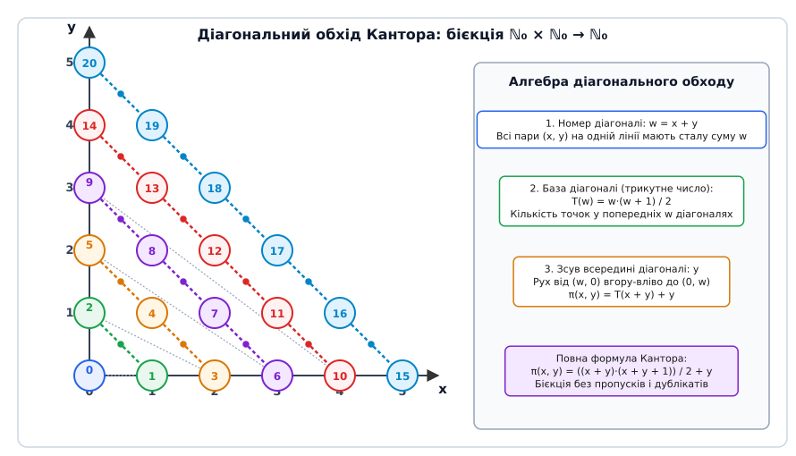
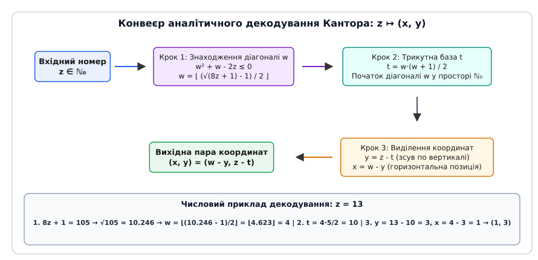
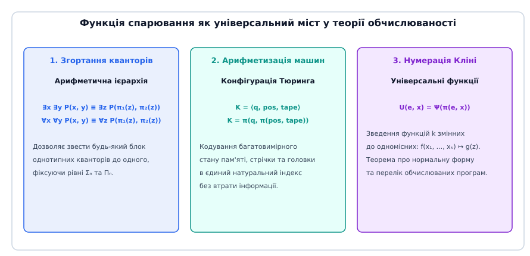
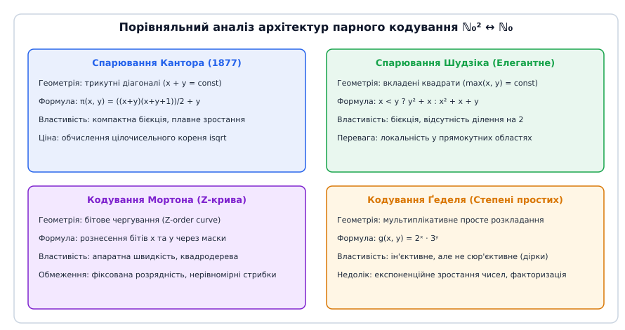

# Парна функція Кантора

<preknowlist>
- [Логіка першого порядку](book:algorithms/descriptive-complexity) — синтаксис та семантика вираження предикатів і кванторів.
- [Арифметика Пеано](book:algorithms/peano-arithmetic) — формальна аксіоматика натуральних чисел та індукція.
- [Проблема зупинки Тюринга](book:algorithms/halting-problem) — нерозв'язність аналізу алгоритмів та метод діагоналізації.
- [Арифметична ієрархія](book:algorithms/arithmetic-hierarchy) — класифікація формул за кількістю чергувань кванторів.
- [Асимптотична складність](book:algorithms/asymptotic-complexity) — просторова та часова оцінка обчислень.
</preknowlist>

Коли формальна обчислювальна машина — від абстрактної машини Тюринга з одновимірною стрічкою до сучасного 64-бітного мікропроцесора з лінійним адресним простором оперативної пам'яті — стикається з обробкою багатовимірних дискретних структур, виникає фундаментальний конфлікт між топологічною природою даних та архітектурою обчислювача. Графи описуються парами індексів вершин `(u, v)`, просторові таблиці оперують двовимірними чи тривимірними сітками координат `(x, y, z)`, а логічні висловлювання в теорії обчислюваності вимагають одночасної квантифікації кількох незалежних змінних.

Якщо обчислювальна система не має прямого математичного мосту між двовимірною площиною дискретних координат `ℕ₀ × ℕ₀` та одновимірною віссю натуральних чисел `ℕ₀`, будь-яка спроба серіалізації або збереження структур даних вимушено спирається на складні інженерні компроміси. Програміст або виділяє в пам'яті динамічні структури з покажчиками (зв'язні списки, дерева суміжності, таблиці покажчиків), або формує текстові потоки зі спеціальними символами-розділювачами, або використовує розріджене мультиплікативне кодування на основі степенів простих чисел. Кожен із цих підходів спричиняє суттєві накладні витрати: розрив просторової локальності в кеш-пам'яті, деградацію швидкодії через непряму адресацію або експоненційне зростання розрядності чисел.

Розв'язанням цього конфлікту є парна функція Кантора (англ. *Cantor pairing function*) — аналітична квадратична бієкція `π: ℕ₀ × ℕ₀ → ℕ₀`, яка кожному вузлу двовимірної нескінченної сітки зіставляє єдине натуральне число без жодних пропусків і без виникнення колізій. Вона забезпечує оборотне стиснення векторних координат у скаляр за сталий час `O(1)` базових арифметичних операцій ALU, усуваючи необхідність динамічного виділення пам'яті та уможливлюючи строгу арифметизацію багатовимірних обчислювальних моделей.

---

### 1. Проблема багатовимірності в дискретних обчисленнях

У класичній теорії алгоритмів більшість фундаментальних моделей обчислень спочатку формулюються як одновимірні системи. Машина Тюринга оперує лінійною послідовністю комірок на нескінченній стрічці; регістрова машина (машина Мінського) маніпулює лінійним набором цілочисельних регістрів; лямбда-числення Черча та комбінаторна логіка редукують одновимірні рядки термів.

Проте реальні задачі обробки інформації за своєю суттю є багатовимірними. Розглянемо збереження орієнтованого графа `G = (V, E)` з множиною вершин `|V| = N`. Кожне ребро є парою `(u, v) ∈ V × V`. Якщо для збереження графа створюється двовимірна матриця суміжності розміром `N × N`, то для розрідженого графа з `|E| ≪ N²` більшість комірок залишаються порожніми, витрачаючи квадратичний обсяг пам'яті `O(N²)`. Якщо ж ребра зберігаються як структури `struct Edge { uint32_t u; uint32_t v; }` у динамічному масиві, процесор змушений виконувати читання двох окремих 32-бітних полів, що вимагає вирівнювання пам'яті (padding) та ускладнює атомарну синхронізацію в багатопотокових середовищах.

У теоретичній площині ситуація є ще більш критичною. У теорії складності обчислень теорема Гартманіса — Стернза про моделювання стверджує, що однострічкова машина Тюринга потребує часу `O(T²)` для емуляції `k`-стрічкової машини, яка працює за час `T`. Головною причиною цього уповільнення є необхідність постійного переміщення голівки між розділеними зонами стрічки для зчитування координат з різних стрічок. Якби машина могла стискати стан усіх `k` стрічок у єдиний компактний числовий код за допомогою арифметичної бієкції без втрати інформації, модельний перехід між розмірностями став би алгебраїчно бездоганним.

Особливий інтерес становить зіставлення неперервного та дискретного світів. У неперервному аналізі простір-заповнювальні криві Пеано та Гільберта неперервно відображають відрізок `[0, 1]` на квадрат `[0, 1]²`, проте вони принципово не можуть бути бієктивними: за теоремою Брауера про інваріантність області неперервної бієкції між просторами різної топологічної розмірності не існує, і крива Пеано обов'язково містить точки самоперетину. На противагу цьому, у дискретному світі множини `ℕ₀` та `ℕ₀²` мають однакову зліченну потужність `ℵ₀`. Це уможливлює існування строгої аналітичної бієкції без жодних точок склеювання.

Парна функція Кантора усуває розрив між одновимірною природою обчислювачів та багатовимірною природою задач. Вона формує математичний ізоморфізм між декартовим квадратом `ℕ₀²` та множиною `ℕ₀`, дозволяючи трактувати будь-яку пару чисел як єдиний неподільний скалярний індекс.

---

### 2. Геометрія діагонального обходу та трикутні числа

Побудова взаємно однозначного відображення між нескінченною двовимірною сіткою `ℕ₀²` та одновимірним числовим рядом спирається на регулярне розбиття дискретної площини на діагональні шари однакової суми координат:
```
D_w = { (x, y) ∈ ℕ₀² | x + y = w },    де w ∈ {0, 1, 2, 3, ...}
```

Кожен шар `D_w` являє собою відрізок прямої з від'ємним нахилом, що перетинає осі координат у точках `(w, 0)` та `(0, w)`. Кількість цілочисельних точок на діагоналі `D_w` строго дорівнює `w + 1`:
- Для `w = 0` існує лише одна точка: `(0, 0)`.
- Для `w = 1` існують дві точки: `(1, 0)` та `(0, 1)`.
- Для `w = 2` існують три точки: `(2, 0)`, `(1, 1)` та `(0, 2)`.
- Для довільного `w` кількість точок становить `w + 1`.

Загальна кількість точок, розташованих на всіх діагоналях, що строго передують діагоналі `w`, визначається класичним трикутним числом Гаусса:
```
T(w) = ∑_{i=0}^{w-1} (i + 1) = ∑_{k=1}^w k = (w · (w + 1)) / 2
```


*Діагональний обхід точок дискретної площини: нумерація смугами x + y = w від верхнього лівого кута.*

Обхід точок усередині поточної діагоналі `D_w` здійснюється впорядковано: рух починається від нижньої точки на осі абсцис `(w, 0)` і прямує вгору ліворуч до точки на осі ординат `(0, w)`. При цьому вертикальна координата `y ∈ [0, w]` відіграє роль внутрішнього лічильника зміщення вздовж поточної діагоналі:
- Перша точка діагоналі: `(w, 0) ↦ T(w) + 0`
- Друга точка діагоналі: `(w - 1, 1) ↦ T(w) + 1`
- Довільна точка: `(x, y) ↦ T(w) + y = ((x + y)(x + y + 1)) / 2 + y`
- Остання точка діагоналі: `(0, w) ↦ T(w) + w = T(w + 1) - 1`

Такий порядок гарантує, що кожне натуральне число `z ∈ ℕ₀` буде використано рівно один раз. Детальний історичний контекст виникнення цього діагонального методу під час аналізу потужності континууму, відкриття зліченності раціональних чисел та наукових суперечок із Леопольдом Кронекером висвітлено у вставці [📜 Історія відкриття Кантора: від тригонометричних рядів до потужності множин](book:algorithms/complexity-computability/cantor-pairing-function/hist-cantor-set-theory.md).

Чому для бієкції на `ℕ₀²` необхідний саме многочлен другого степеня? Лінійний поліном `P(x, y) = ax + by + c` не може бути бієкцією між `ℕ₀²` та `ℕ₀`. Якщо `a = 0` або `b = 0`, функція вироджується і склеює нескінченні лінії точок. Якщо ж `a > 0` та `b > 0`, кількість точок з `ax + by ≤ K` зростає асимптотично як `K² / (2ab)`, тоді як на відрізку `[0, K]` є лише `K + 1` ціле число. За принципом Діріхле виникають неминучі колізії. Мінімальний степінь алгебраїчного полінома для бієкції на площині дорівнює точно 2.

Обчислимо прямий код Кантора для кількох характерних вузлів сітки:
- Для точки `(0, 0)`: `w = 0`, `T(0) = 0`, результат `z = 0 + 0 = 0`.
- Для точки `(1, 0)`: `w = 1`, `T(1) = 1`, результат `z = 1 + 0 = 1`.
- Для точки `(0, 1)`: `w = 1`, `T(1) = 1`, результат `z = 1 + 1 = 2`.
- Для точки `(2, 0)`: `w = 2`, `T(2) = 3`, результат `z = 3 + 0 = 3`.
- Для точки `(1, 1)`: `w = 2`, `T(2) = 3`, результат `z = 3 + 1 = 4`.
- Для точки `(0, 2)`: `w = 2`, `T(2) = 3`, результат `z = 3 + 2 = 5`.
- Для точки `(2, 1)`: `w = 2 + 1 = 3`, `T(3) = (3 · 4) / 2 = 6`, результат `z = 6 + 1 = 7`.
- Для точки `(1, 3)`: `w = 1 + 3 = 4`, `T(4) = (4 · 5) / 2 = 10`, результат `z = 10 + 3 = 13`.

Нижче наведено зведену матрицю індексів Кантора для початкового фрагмента площини:

| y \ x | 0 | 1 | 2 | 3 | 4 | 5 |
| :---: | :---: | :---: | :---: | :---: | :---: | :---: |
| **0** | 0 | 1 | 3 | 6 | 10 | 15 |
| **1** | 2 | 4 | 7 | 11 | 16 | 22 |
| **2** | 5 | 8 | 12 | 17 | 23 | 30 |
| **3** | 9 | 13 | 18 | 24 | 31 | 39 |
| **4** | 14 | 19 | 25 | 32 | 40 | 49 |
| **5** | 20 | 26 | 33 | 41 | 50 | 60 |

Кожна діагональ, що йде від осі абсцис до осі ординат, містить неперервний послідовний числовий діапазон натуральних чисел.

---

### 3. Аналітичне декодування та дискримінантний конвеєр

Головна перевага формули Кантора над будь-якими табличними структурами полягає в тому, що операція відновлення вихідних координат `(x, y) = π⁻¹(z)` не вимагає ітеративного пошуку, бінарного сканування або звернення до оперативної пам'яті. Вона обчислюється суто аналітично за сталий час `O(1)`.

Нехай задано ціле невід'ємне число `z`. Нам необхідно знайти невідомий номер діагоналі `w` та внутрішній зсув `y`.


*Аналітичний конвеєр інверсії: знаходження дискримінанта, номера діагоналі та координат без ітеративного перебору.*

Оскільки координата `y` задовольняє подвійну нерівність `0 ≤ y ≤ w`, значення коду `z` обов'язково затиснуте між двома послідовними трикутними числами:
```
T(w) ≤ z < T(w + 1)
(w · (w + 1)) / 2 ≤ z < ((w + 1)(w + 2)) / 2
```

Помножимо всі частини лівої нерівності на 8 та виділимо повний квадрат відносно змінної `w`:
```
4 · w² + 4 · w ≤ 8 · z
(2 · w + 1)² - 1 ≤ 8 · z
(2 · w + 1)² ≤ 8 · z + 1
2 · w + 1 ≤ √(8 · z + 1)
w ≤ (√(8 · z + 1) - 1) / 2
```

Аналогічно розглянемо праву строгу нерівність `z < ((w + 1)(w + 2)) / 2`:
```
8 · z < 4 · (w + 1)² + 4 · (w + 1)
8 · z < (2 · w + 3)² - 1
8 · z + 1 < (2 · w + 3)²
√(8 · z + 1) < 2 · w + 3
(√(8 · z + 1) - 3) / 2 < w
```

Поєднуючи обидві отримані оцінки, маємо строгий числовий інтервал для величини `w`:
```
(√(8 · z + 1) - 3) / 2 < w ≤ (√(8 · z + 1) - 1) / 2
```
Довжина цього інтервалу дорівнює точно одиниці: `((√(8z+1) - 1) / 2) - ((√(8z+1) - 3) / 2) = 2 / 2 = 1`. Оскільки напіввідкритий інтервал довжини 1 містить рівно одне ціле число, номер діагоналі `w` визначається однозначно операцією взяття цілої частини (округлення вниз / floor) від верхньої межі:
```
w = ⌊ (√(8 · z + 1) - 1) / 2 ⌋
```

Після знаходження цілого значення `w` решта параметрів відновлюється елементарною арифметикою:
```
T(w) = (w · (w + 1)) / 2
y = z - T(w)
x = w - y
```

Повний строгий доказ ін'єктивності, сюр'єктивності, неможливості лінійної бієкції та єдиності квадратичних поліноміальних бієкцій (класична теорема Фуетера — Поліа) детально виведено у вставці [🧮 Доведення бієктивності, єдиності та аналітичної оборотності парної функції Кантора](book:algorithms/complexity-computability/cantor-pairing-function/math-cantor-bijection-proof.md).

Простежимо покрокове розпакування для послідовності крайових випадків:
- Для `z = 0`: дискримінант `8(0) + 1 = 1`, `√1 = 1`, `w = ⌊(1 - 1)/2⌋ = 0`, `T(0) = 0`, `y = 0 - 0 = 0`, `x = 0 - 0 = 0`. Отримано точку `(0, 0)`.
- Для `z = 1`: дискримінант `8(1) + 1 = 9`, `√9 = 3`, `w = ⌊(3 - 1)/2⌋ = 1`, `T(1) = 1`, `y = 1 - 1 = 0`, `x = 1 - 0 = 1`. Отримано точку `(1, 0)`.
- Для `z = 2`: дискримінант `8(2) + 1 = 17`, `√17 ≈ 4.123`, `w = ⌊(4.123 - 1)/2⌋ = ⌊1.561⌋ = 1`, `T(1) = 1`, `y = 2 - 1 = 1`, `x = 1 - 1 = 0`. Отримано точку `(0, 1)`.
- Для `z = 5`: дискримінант `8(5) + 1 = 41`, `√41 ≈ 6.403`, `w = ⌊(6.403 - 1)/2⌋ = ⌊2.701⌋ = 2`, `T(2) = 3`, `y = 5 - 3 = 2`, `x = 2 - 2 = 0`. Отримано точку `(0, 2)`.
- Для `z = 47`: дискримінант `8(47) + 1 = 377`, `√377 ≈ 19.416`, `w = ⌊(19.416 - 1)/2⌋ = 9`, `T(9) = 45`, `y = 47 - 45 = 2`, `x = 9 - 2 = 7`. Отримано точку `(7, 2)`.

У кожному випадку аналітичний конвеєр повертає точні цілі координати без необхідності перевірки сусідніх діагоналей.

---

### 4. Узагальнення на k-вимірні кортежі та аналіз бітового зростання

Для обчислювальних систем, що працюють з векторами довільної розмірності `k ≥ 2`, парна функція Кантора узагальнюється через індуктивну композицію. Існує два принципово різних підходи до згортання кортежів `(x₁, x₂, ..., x_k) ∈ ℕ₀ᵏ`: лінійне згортання та збалансоване деревоподібне згортання.

#### 4.1. Лінійне послідовне згортання (Linear Fold)
У лінійній схемі кортеж згортається зліва направо за ланцюжком:
```
π⁽²⁾(x₁, x₂) = π(x₁, x₂)
π⁽³⁾(x₁, x₂, x₃) = π(π⁽²⁾(x₁, x₂), x₃)
...
π⁽ᵏ⁾(x₁, ..., x_k) = π(π⁽ᵏ⁻¹⁾(x₁, ..., x_{k-1}), x_k)
```

Декодування лінійного згортання вимагає `k - 1` послідовних кроків розпакування справа наліво:
1. Застосовуємо `π⁻¹(z)` і отримуємо пару `(z_{k-1}, x_k)`. Координата `x_k` негайно фіксується.
2. Проміжний код `z_{k-1}` подається на вхід наступного розпакування, генеруючи `(z_{k-2}, x_{k-1})`.
3. Процедура повторюється до отримання початкової пари `(x₁, x₂)`.

Головний недолік лінійної схеми полягає в асиметричному експоненційному зростанні бітової розрядності проміжних значень. На кожному кроці застосування функції Кантора значення підноситься до другого степеня:
```
π(a, b) ≈ (a + b)² / 2
```
Якщо всі координати кортежу мають однаковий порядок `M`, то після `k - 1` лінійних композицій результуючий код досягає величини порядку `M^{2^{k-1}}`. Бітова довжина числа (кількість бітів, необхідних для його представлення в пам'яті) зростає як `O(2^k · log M)`. Наприклад, для 5-вимірного кортежу з 32-бітних чисел лінійний код досягає довжини понад 512 бітів, що вимагає бібліотек довгої арифметики.

#### 4.2. Збалансоване деревоподібне згортання (Balanced Tree Fold)
Для мінімізації бітового роздування застосовується збалансоване бінарне дерево спарювання:
```
π_tree(x₁, x₂, x₃, x₄) = π(π(x₁, x₂), π(x₃, x₄))
```
Глибина дерева згортання для `k`-вимірного кортежу дорівнює `⌈log₂ k⌉`. У результаті піднесення до квадрата відбувається не `k - 1` разів послідовно, а лише `⌈log₂ k⌉` разів. Фінальний код має порядок величини `M^k`, а його бітова довжина масштабується строго лінійно від розмірності:
```
BitLength(π_tree) = O(k · log M)
```
Це асимптотично оптимальний результат, оскільки теоретико-інформаційна ентропія `k` незалежних чисел величини `M` становить саме `k · log₂ M` бітів.

Нижче наведено порівняння бітової довжини коду для 32-бітних вхідних координат (`M = 2³²`):

| Розмірність кортежу k | Лінійне згортання (біт) | Деревоподібне згортання (біт) | Теоретичний мінімум (біт) |
| :---: | :---: | :---: | :---: |
| **2** | 64 біти | 64 біти | 64 біти |
| **3** | 128 бітів | 96 бітів | 96 бітів |
| **4** | 256 бітів | 128 бітів | 128 бітів |
| **8** | 4096 бітів | 256 бітів | 256 бітів |
| **16** | 1 048 576 бітів | 512 бітів | 512 бітів |

З таблиці видно, що для розмірностей `k ≥ 4` збалансоване дерево є єдино прийнятною інженерною схемою.

#### 4.3. Симпліційне k-вимірне спарювання (Direct Simplicial Pairing)
Альтернативою рекурсивному згортанню є пряме геометричне узагальнення на `k`-вимірні гіперплощини `x₁ + x₂ + ... + x_k = w`.

Кількість невід'ємних цілих розв'язків цього рівняння задається комбінаторною формулою «кульок та перегородок» (stars and bars):
```
N(w, k) = C_{w + k - 1}^{k - 1} = ((w + k - 1)!) / ((k - 1)! · w!)
```
Кумулятивна кількість точок у всіх симплексах до шару `w` визначається `k`-вимірним симпліційним числом:
```
T_k(w) = ∑_{i=0}^{w-1} C_{i + k - 1}^{k - 1} = C_{w + k - 1}^k
```
Пряма `k`-вимірна функція Кантора задається многочленом степеня `k`:
```
π_k(x₁, x₂, ..., x_k) = T_k(x₁ + ... + x_k) + π_{k-1}(x₁, ..., x_{k-1})
```
Ця конструкція формує гладку поліноміальну бієкцію `ℕ₀ᵏ ↔ ℕ₀` безпосередньо, проте її декодування вимагає знаходження коренів многочлена `k`-го степеня, що для `k ≥ 5` за теоремою Абеля — Руффіні не виражається в радикалах і вимагає чисельних методів. Тому в комп'ютерній інженерії домінує деревоподібна композиція квадратичних функцій.

---

### 5. Спарювання у просторі знакових цілих чисел (ℤ × ℤ)

У прикладних задачах координати об'єктів часто набувають від'ємних значень: відносні вектори зсуву в сітках `(Δx, Δy)`, орієнтовані зміщення в алгоритмах пошуку шляху (A*, Дейкстра) або вузли нескінченних решіток у фізичному моделюванні.

Для поширення функції Кантора на простір `ℤ × ℤ` застосовується попередня бієкція чергування знаків `σ: ℤ → ℕ₀` (зигзаг-кодування / zigzag encoding):
```
σ(n) = 2 · n,        якщо n ≥ 0
σ(n) = 2 · |n| - 1,  якщо n < 0
```
Ця функція впорядковує множину цілих чисел у додатну послідовність:
- `0 ↦ 0`
- `-1 ↦ 1`
- `1 ↦ 2`
- `-2 ↦ 3`
- `2 ↦ 4`
- `-3 ↦ 5`

Зворотна функція декодування `σ⁻¹: ℕ₀ → ℤ` відновлює знак за парністю числа:
```
σ⁻¹(k) = k / 2,         якщо k є парним (k % 2 == 0)
σ⁻¹(k) = -((k + 1) / 2), якщо k є непарним (k % 2 == 1)
```

Повне знакове спарювання Кантора `π_ℤ: ℤ × ℤ → ℕ₀` визначається як композиція:
```
π_ℤ(x, y) = π(σ(x), σ(y))
```
Розглянемо приклади кодування знакових точок:
- Для точки `(0, 0)`: `σ(0) = 0`, `σ(0) = 0`, результат `π(0, 0) = 0`.
- Для точки `(-1, 0)`: `σ(-1) = 1`, `σ(0) = 0`, результат `π(1, 0) = 1`.
- Для точки `(0, -1)`: `σ(0) = 0`, `σ(-1) = 1`, результат `π(0, 1) = 2`.
- Для точки `(1, 1)`: `σ(1) = 2`, `σ(1) = 2`, результат `π(2, 2) = 12`.
- Для точки `(-1, -1)`: `σ(-1) = 1`, `σ(-1) = 1`, результат `π(1, 1) = 4`.

Така схема є строгою бієкцією `ℤ × ℤ ↔ ℕ₀`, обчислюється виключно за допомогою швидких бітових маніпуляцій ALU та не створює проміжків у діапазоні вихідних індексів.

---

### 6. Функційні дерева, S-вирази та віртуалізація незмінної купи

У функційному програмуванні та теорії мов програмування фундаментальним конструктором складених типів даних є пара спискових комірок `cons(car, cdr)`. Будь-яке бінарне дерево, абстрактне синтаксичне дерево (AST) або S-вираз мов сімейства Lisp / Scheme формально визначається як рекурсивна композиція пар.

Парна функція Кантора дозволяє здійснювати повну арифметизацію незмінних деревоподібних структур даних без використання покажчиків у фізичній пам'яті. Нехай базові атоми (цілі числа та символи) кодуються парними числами `2 · atom_id`, а складені пари `cons(A, B)` кодуються непарними числами за формулою:
```
code(cons(A, B)) = 2 · π(code(A), code(B)) + 1
```

Ця схема має важливі властивості:
- Будь-яке довільно складне деревоподібне вираження транслюється в єдине натуральне число.
- Дерева є структурно незмінними (immutable) та канонічно ідентифікованими: два ізоморфні піддерева автоматично отримують тотожні числові коди, що еквівалентно абсолютному хеш-консінгу (hash-consing) з нульовими витратами пам'яті.
- Операції вилучення `car` та `cdr` зводяться до аналітичного декодування `π⁻¹((code - 1) / 2)`.

Завдяки цьому функція Кантора дозволяє моделювати стан усієї віртуальної купи функційної програми як єдине ціле число, що є незамінним при створенні знімків стану (snapshots), детермінованому відтворенні помилок (time-travel debugging) та формальній верифікації компіляторів.

---

### 7. Роль парного кодування в теорії обчислюваності та складності

Парна функція Кантора є не просто утилітарним числовим алгоритмом, а базовим теоретичним інструментом mathematical computer science, рекурсивного аналізу та класифікації складності.


*Застосування парного кодування в теорії обчислюваності: згортання кванторів, кодування конфігурацій та нумерація Кліні.*

#### 7.1. Згортання однакових кванторів в арифметичній ієрархії
В арифметичній ієрархії Мостовського — Кліні класи формул `Σₙ` та `Πₙ` класифікуються за кількістю чергувань блоків кванторів існування `∃` та загальності `∀` над розв'язними предикатами `R`.

Нехай формула першого порядку містить два послідовних квантори існування:
```
Φ ≡ ∃x ∃y R(x, y, a)
```
За допомогою парної функції Кантора два квантори замінюються єдиним квантором над змінною спарювання `z`:
```
Φ ≡ ∃z R(π₁(z), π₂(z), a)
```
Оскільки проєкції `π₁(z)` та `π₂(z)` належать до класу примітивно-рекурсивних функцій (`PR`), перетворений предикат `R'(z, a) ≡ R(π₁(z), π₂(z), a)` залишається розв'язним у тому самому класі складності. Це доводить фундаментальну лему теорії моделей: блок довільної скінченної кількості однакових кванторів `∃x₁ ∃x₂ ... ∃x_k` еквівалентний одному квантору `∃z`. Саме функція Кантора уможливлює строгу канонізацію рівнів арифметичної ієрархії `Σ₁`, `Σ₂`, ..., `Σₙ`.

Аналогічно здійснюється згортання блоків кванторів загальності:
```
Ψ ≡ ∀x ∀y Q(x, y, b)  ⟺  Ψ ≡ ∀z Q(π₁(z), π₂(z), b)
```

#### 7.2. Арифметизація конфігурацій машин Тюринга та теорема Кліні
Довільна конфігурація машини Тюринга в дискретний момент часу повністю задається трійкою параметрів:
```
C = ⟨ q, u, v ⟩
```
де `q ∈ Q` — номер поточного внутрішнього стану скінченного автомата, `u ∈ ℕ₀` — числове кодування символів на стрічці ліворуч від голівки, `v ∈ ℕ₀` — числове кодування символів праворуч від голівки.

За допомогою тривимірного розширення Кантора `π⁽³⁾(q, u, v)` увесь миттєвий стан обчислювальної системи згортається в єдине натуральне число `c ∈ ℕ₀`. Відношення переходу між конфігураціями `C ⊢ C'` набуває форми елементарного арифметичного предиката `Step(c, c')`. Це лежить в основі класичної теореми Кліні про нормальну форму: будь-яка частково рекурсивна функція `f(x)` виражається у вигляді:
```
f(x) = U(μy T(e, x, y))
```
де `e` — індекс програми (код алгоритму), `T(e, x, y)` — примітивно-рекурсивний предикат Кліні, який перевіряє, чи є число `y` закодованим за Кантором протоколом обчислення (послідовністю пар `(стан, час)`), а `U(y)` — функція вилучення фінального результату.

#### 7.3. Примітивна рекурсивність проєкцій Кантора
Проєкції `π₁(z) = x` та `π₂(z) = y` строго належать до класу примітивно-рекурсивних функцій (`PR`). Вони виражаються через обмежений оператор мінімізації (Bounded μ-operator):
```
w(z) = μ(k ≤ z) [ ((k + 1)(k + 2)) / 2 > z ]
π₂(z) = z - (w(z) · (w(z) + 1)) / 2
π₁(z) = w(z) - π₂(z)
```
Оскільки верхня межа пошуку `k ≤ z` є явною та скінченною, обчислення проєкцій гарантовано завершується і не вимагає необмеженого оператора вайлівського пошуку.

#### 7.4. Дескриптивна складність та Діофантові рівняння (Теорема Юрія Матіясевича)
У розв'язанні Десятої проблеми Гільберта (теорема MRDP: Матіясевич — Робінсон — Девіс — Патнем) парні функції відіграють ключову роль у редукції систем алгебраїчних рівнянь. Нехай маємо систему з двох діофантових рівнянь:
```
P₁(x₁, ..., x_n) = 0   ТА   P₂(x₁, ..., x_n) = 0
```
Завдяки бієктивності функції Кантора та властивості `π(a, b) = 0 ⟺ a = 0 ∧ b = 0` система двох рівнянь замінюється єдиним еквівалентним поліноміальним рівнянням:
```
(P₁ + P₂)² + 3 · P₁ + P₂ = 0
```
Це дозволило довести, що будь-яка перелічна множина є діофантовою, а отже, універсального алгоритму розв'язання діофантових рівнянь не існує.

---

### 8. Просторова локальність, дилатація та розсіювання в хеш-таблицях

При проектуванні просторових індексів та хеш-структур даних виникає питання збереження просторової близькості (spatial locality): наскільки близькими залишаються коди точок, які були сусідніми у двовимірному просторі?

#### 8.1. Коефіцієнт просторової дилатації (Dilation Factor)
Коефіцієнтом дилатації відображення `f: ℕ₀² → ℕ₀` називається відношення відстані між індексами до евклідової відстані між точками:
```
Dilation(p, q) = |f(p) - f(q)| / ||p - q||₂
```
Для парної функції Кантора коефіцієнт дилатації є необмеженим. Розглянемо дві сусідні точки `p = (x, y)` та `q = (x + 1, y)`. Різниця їхніх кодів становить:
```
π(x + 1, y) - π(x, y) = (((x + y + 1)(x + y + 2)) / 2 + y) - (((x + y)(x + y + 1)) / 2 + y)
= (x + y + 1) = w + 1
```
Із віддаленням від початку координат (зі зростанням суми `w`) різниця кодів двох сусідніх точок зростає лінійно як `w + 1`. Це означає, що функція Кантора не зберігає кластеризацію: точки, розташовані поруч у просторі, розкидаються по різних числових діапазонах. Якщо для задачі критичний пошук найближчих сусідів у радіусі (Range Queries), кращими є криві Мортона (Z-order) або криві Гільберта.

#### 8.2. Лавинне розсіювання для хеш-таблиць
Через регулярне квадратичне зростання формули Кантора `π(x, y)` не можна використовувати як безпосередній індекс у хеш-таблицях із простим діленням за модулем `h(z) = z % B`. Послідовні координати з однаковою сумою породжують послідовні індекси, що призводить до вторинної кластеризації та масових колізій кошиків.

Для усунення цього ефекту індекс Кантора пропускають крізь швидкий бітовий лавинний фіналізатор (Avalanche Finalizer), наприклад, фіналізатор MurmurHash3 `fmix64`:
```
k = π(x, y)
k = k ⊕ (k >> 33)
k = k · 0xff51afd7ed558ccd
k = k ⊕ (k >> 33)
k = k · 0xc4ceb9fe1a85ec53
k = k ⊕ (k >> 33)
```
Ця операція повністю руйнує регулярні арифметичні закономірності, забезпечуючи рівномірне псевдовипадкове розсіювання бітів по кошиках хеш-таблиці з нульовим ризиком колізій на рівні початкового простору `ℕ₀²`.

---

### 9. Архітектурне порівняння схем дискретного спарювання

У теоретичній інформатиці та прикладному інжинірингу склалося чотири класичних підходи до спарювання дискретних даних. Кожен з них має власний баланс між обчислювальною швидкістю, щільністю упаковки та структурними властивостями.


*Порівняння топологій спарювання: діагональний Кантор, концентричний Шудзік, квадродерево Мортона та мультиплікативний Ґедель.*

| Схема спарювання | Формула кодування | Властивості інверсії | Переваги | Обмеження |
| :--- | :--- | :--- | :--- | :--- |
| **Кантор (Cantor)** | `((x+y)(x+y+1))/2 + y` | `w = ⌊(√(8z+1)-1)/2⌋` | Повна аналітична бієкція `ℕ₀² ↔ ℕ₀`, гладкий поліном 2-го степеня | Потребує `isqrt(8z+1)` при декодуванні |
| **Шудзік (Szudzik)** | `x < y ? y² + x : x² + x + y` | `s = ⌊√z⌋` | Бієкція, відсутнє множення на 8, швидше декодування | Кусково-гладка функція, містить розгалуження |
| **Мортон (Z-order)** | Бітове чергування розрядів | Маскування бітів `PDEP/PEXT` | Апаратне прискорення BMI2, збереження локальності 2D | Фіксована розрядність (32/64 біти), не бієкція на `ℕ₀` |
| **Ґедель (Gödel)** | `2ˣ · 3ʸ` | Факторизація на прості | Легко узагальнюється на списки будь-якої довжини | Експоненційне зростання чисел, розрідженість |

- **Кантор:** найкраще підходить для формально-логічних доведень, рекурсивних предикатів та задач, де необхідна щільна нерозривна нумерація `0, 1, 2, 3...` без проміжків.
- **Шудзік (Elegant Pairing):** оптимальний для прикладних програмних рушіїв, де критична латентність декодування, оскільки цілочисельний корінь обчислюється безпосередньо з `z`, а не з `8z + 1`.
- **Мортон (Z-крива):** стандарт просторових геоінформаційних систем (GIS) та квадродерев, оскільки сусідні в просторі точки частіше мають близькі коди Мортона.
- **Ґедель:** історичний фундаментальний інструмент метаматематики, практично непридатний для реальних обчислень через колосальне зростання значень (наприклад, для пари `(50, 50)` число `2⁵⁰ · 3⁵⁰ ≈ 8.1 × 10³⁸` виходить за межі 128-бітних цілих чисел).

---

### 10. Програмна інженерія, апаратна ціна та числові пастки

При перенесенні теоретичної формули Кантора у виробничий програмний код мовами C та C++ інженери регулярно припускаються типових помилок, пов'язаних з апаратними обмеженнями обчислювальної техніки.

#### 10.1. Пастка 53-бітової точності чисел з рухомою комою (FPU IEEE 754)
Найпоширеніша помилка — прямий виклик математичної функції `sqrt()` з бібліотеки `<math.h>`:
:::tabs
```c
/* Небезпечний код (C99): прихована втрата молодших бітів у мантисі double */
uint64_t w = (uint64_t)((sqrt(8.0 * (double)z + 1.0) - 1.0) / 2.0);
```
```cpp
/* Небезпечний код (C++20): прихована втрата молодших бітів у мантисі double */
uint64_t w = static_cast<uint64_t>((std::sqrt(8.0 * static_cast<double>(z) + 1.0) - 1.0) / 2.0);
```
:::
Тип `double` стандарту IEEE 754 має лише 53 біти мантиси. Як тільки вираз `8z + 1` перевищує значення `2⁵³ - 1 = 9 007 199 254 740 991` (що відповідає коду `z > 1.125 × 10¹⁵`), молодші біти втрачаються внаслідок заокруглення FPU. Корінь повертає хибне значення `w ± 1`, унаслідок чого відновлені координати перетворюються на спотворений псевдовипадковий шум.

Надійний інженерний код зобов'язаний використовувати цілочисельний алгоритм відновлення квадратного кореня (`isqrt`) на базі бітових зсувів у регістрах цілочисельного ALU процесора.

#### 10.2. Межі 64-бітової розрядної сітки
Для пари 32-бітних чисел `x, y ∈ [0, 2³² - 1]` їхня сума може досягати `w ≈ 8.58 × 10⁹`.
Обчислення трикутного числа `(w · (w + 1)) / 2` переповнює беззнаковий 64-бітний регістр `UINT64_MAX ≈ 1.844 × 10¹⁹`, якщо `w > 6 074 000 999`.

Виробнича бібліотека повинна містити обов'язкову попередню перевірку `w ≤ 6074000999ULL` при прямому кодуванні, а при декодуванні використовувати 128-бітний проміжний тип `unsigned __int128` для безпечного розрахунку дискримінанта `8 · z + 1`.

#### 10.3. Конвеєризація інструкцій, суперскалярне виконання та кеш-когерентність
На сучасних мікропроцесорах із позачерговим виконанням команд (Out-of-Order Execution) операція прямого кодування `cantor_encode` транслюється в ланцюжок з трьох інструкцій: одне додавання `ADD`, одне множення `MUL` та один логічний зсув праворуч `SHR`. Завдяки відсутності розгалужень (branch-free) блок кодування демонструє нульовий рівень помилок передбачення переходів (0% branch misprediction rate) та латентність у 3–4 такти процесора.

У багатоядерних системах з архітектурою NUMA упакування двох координат у 64-бітне скалярне число запобігає ефекту хибного розділення кеш-ліній (false sharing). Оскільки стандартна лінія кешу L1/L2 має розмір 64 байти, в одній лінії щільно розміщується рівно 8 закодованих пар, що вдвічі знижує навантаження на шину між'ядерної когерентності (протоколи MESI/MOESI) під час інтенсивного паралельного оновлення графів.

Нижче наведено виробничу реалізацію алгоритму спарювання та цілочисельного декодування мовами C99 та C++20:

:::tabs
```c
#include <stdint.h>
#include <stdbool.h>

/* Точний цілочисельний квадратний корінь на регістрах ALU */
static inline uint64_t isqrt64(uint64_t n) {
    if (n == 0) return 0;
    uint64_t root = 0;
    uint64_t bit = (uint64_t)1 << 62;

    while (bit > n) {
        bit >>= 2;
    }
    while (bit != 0) {
        if (n >= root + bit) {
            n -= root + bit;
            root = (root >> 1) + bit;
        } else {
            root >>= 1;
        }
        bit >>= 2;
    }
    return root;
}

/* Безпечне пряме кодування пари 32-бітних координат */
bool cantor_encode(uint32_t x, uint32_t y, uint64_t *out_code) {
    if (!out_code) return false;
    uint64_t ux = (uint64_t)x;
    uint64_t uy = (uint64_t)y;
    uint64_t w = ux + uy;

    if (w > 6074000999ULL) return false; /* Захист від переповнення uint64 */

    *out_code = (w * (w + 1)) / 2 + uy;
    return true;
}

/* Точне аналітичне розпакування 64-бітного коду Кантора */
bool cantor_decode(uint64_t code, uint32_t *out_x, uint32_t *out_y) {
    if (!out_x || !out_y) return false;

    #if defined(__SIZEOF_INT128__)
        unsigned __int128 disc = ((unsigned __int128)code * 8) + 1;
        uint64_t s;
        if (disc <= UINT64_MAX) {
            s = isqrt64((uint64_t)disc);
        } else {
            unsigned __int128 r = 0, b = (unsigned __int128)1 << 126;
            while (b > disc) b >>= 2;
            while (b != 0) {
                if (disc >= r + b) { disc -= r + b; r = (r >> 1) + b; }
                else { r >>= 1; }
                b >>= 2;
            }
            s = (uint64_t)r;
        }
    #else
        if (code >= (UINT64_MAX / 8)) return false;
        uint64_t s = isqrt64(8 * code + 1);
    #endif

    uint64_t w = (s - 1) / 2;
    uint64_t base = (w * (w + 1)) / 2;
    uint64_t y = code - base;
    uint64_t x = w - y;

    if (x > UINT32_MAX || y > UINT32_MAX) return false;

    *out_x = (uint32_t)x;
    *out_y = (uint32_t)y;
    return true;
}
```
```cpp
#include <cstdint>
#include <optional>
#include <bit>

namespace pairing {

struct Point2D {
    uint32_t x{0};
    uint32_t y{0};
    constexpr bool operator==(const Point2D&) const noexcept = default;
};

/* C++20 constexpr цілочисельний квадратний корінь */
[[nodiscard]] constexpr uint64_t isqrt64(uint64_t n) noexcept {
    if (n == 0) return 0;
    uint64_t root = 0;
    const int lz = std::countl_zero(n);
    const int shift = (63 - lz) & ~1;
    uint64_t bit = static_cast<uint64_t>(1) << shift;

    while (bit != 0) {
        if (n >= root + bit) {
            n -= root + bit;
            root = (root >> 1) + bit;
        } else {
            root >>= 1;
        }
        bit >>= 2;
    }
    return root;
}

/* Безпечне кодування C++20 з поверненням std::optional */
[[nodiscard]] constexpr std::optional<uint64_t> cantor_encode(uint32_t x, uint32_t y) noexcept {
    const uint64_t ux = x;
    const uint64_t uy = y;
    const uint64_t w = ux + uy;

    constexpr uint64_t MAX_W = 6074000999ULL;
    if (w > MAX_W) return std::nullopt;

    return (w * (w + 1)) / 2 + uy;
}

/* Аналітичне розпакування у строго типізовану структуру Point2D */
[[nodiscard]] constexpr std::optional<Point2D> cantor_decode(uint64_t code) noexcept {
    if (code >= (UINT64_MAX / 8)) return std::nullopt;

    const uint64_t s = isqrt64(8 * code + 1);
    const uint64_t w = (s - 1) / 2;
    const uint64_t base = (w * (w + 1)) / 2;
    const uint64_t y = code - base;
    const uint64_t x = w - y;

    if (x > UINT32_MAX || y > UINT32_MAX) return std::nullopt;

    return Point2D{static_cast<uint32_t>(x), static_cast<uint32_t>(y)};
}

} // namespace pairing
```
:::

Повний набір інженерних оптимізацій, векторизацію SIMD AVX2/AVX-512 та аналіз кеш-локальності представлено у проєкті [⚙️ Високопродуктивний рушій спарювання та просторового індексування](book:algorithms/complexity-computability/cantor-pairing-function/proj-pairing-engine.md). Повну специфікацію функціонального контракту бібліотеки з гарантіями безпеки наведено в документі [📋 Специфікація інтерфейсу бібліотеки парного кодування (Cantor Pairing API)](book:algorithms/complexity-computability/cantor-pairing-function/api-cantor-pairing.md).

---

### 11. Практичний інженерний контекст

> 🔧 **Навіщо це.**
>
> 1. **Компактна адресація ребер графа в пам'яті:** Замість збереження важких об'єктів `Edge { int u; int v; }` або незв'язних динамічних списків орієнтоване ребро `(u, v)` кодується в єдиний скалярний 64-бітний цілочисельний ключ `uint64_t key = cantor_encode(u, v)`. Це усуває накладні витрати на вирівнювання структур (padding), подвоює щільність кеш-ліній L1/L2 та дозволяє використовувати швидкі плоскі хеш-таблиці з відкритою адресацією.
> 2. **Мемоізація функцій багатьох змінних у трансляторах:** У динамічному програмуванні та оптимізувальних компіляторах кешування результатів аналізу пар символів або станів `f(state_a, state_b)` через індекс Кантора перетворює двовимірну матрицю покажчиків на лінійний одновимірний масив із прямим доступом `O(1)` за адресою комірки.
> 3. **Атомарні неблокувальні операції над парами станів:** Зведення пари 32-бітних координат до єдиного 64-бітного значення дозволяє оновлювати стан пари одночасно як єдиний неподільний квант за допомогою стандартної апаратної інструкції процесора `Compare-And-Swap` (`std::atomic<uint64_t>`), що повністю виключає блокування потоків м'ютексами.
> 4. **Канонізація предикатів у формальній верифікації:** При автоматичному доведенні теорем у солверах Z3 та CVC5 парне кодування усуває надлишкові квантори, транслюючи багатовимірні простори станів у єдину цілочисельну змінну над аксіоматикою арифметики Пеано.

---

### 12. Фундаментальний синтез

Парна функція Кантора демонструє фундаментальну єдність дискретної математики та комп'ютерних наук: топологічна розмірність дискретного простору не є непереборним бар'єром. Якщо для неперервних просторів розмірність континууму є топологічним інваріантом (теорема Брауера про інваріантність області стверджує, що неперервної бієкції між `ℝ` та `ℝ²` не існує), то в дискретному світі множини `ℕ₀` та `ℕ₀²` мають однакову зліченну потужність `ℵ₀`.

Ця рівнопотужність є не просто абстрактною математичною екзотикою, а практичним фундаментом усієї сучасної архітектури комп'ютерних обчислень. Завдяки поліному Кантора будь-яка багатовимірна дискретна система — від багатострічкових машин Тюринга до реляційних баз даних та багатовимірних тензорних мереж — може бути строго та ізоморфно спроєктована на одновимірний простір пам'яті за сталий час, зберігаючи повну математичну строгість та абсолютну детермінованість зворотного перетворення.
