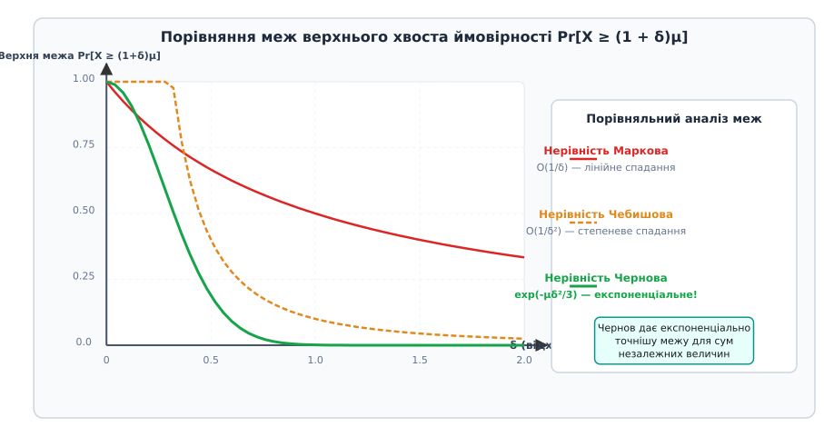
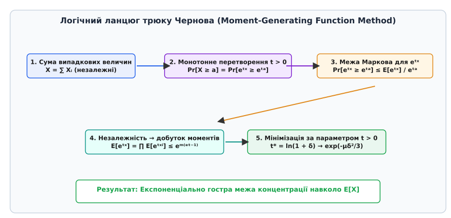
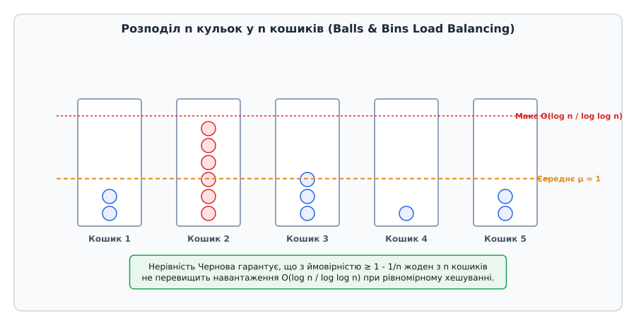

# Нерівність Чернова

<preknowlist>
- [Асимптотична складність](topic:algorithms/asymptotic-complexity) — Асимптотичні оцінки росту функцій та нотація O-велике.
- [Амортизаційний аналіз](topic:algorithms/amortized-analysis) — Концепції середнього та ймовірнісного оцінювання ресурсів.
- [Клас P/poly](topic:algorithms/p-poly) — Метод мажоритарного голосування для зниження ймовірності помилки в ймовірнісних схемах.
</preknowlist>

Під час проективання високонавантажених розподілених систем, рандомізованих алгоритмів чи криптографічних протоколів знання лише середнього часу виконання чи середнього навантаження на вузол є небезпечно недостатнім. Сервер із середнім навантаженням у 50 запитів на секунду може миттєво зазнати аварійного сбою, якщо випадкова флуктуація створить піковий сплеск у 500 запитів на один із вузлів кластера. Класичні інструменти теорії ймовірностей — такі як нерівність Маркова чи нерівність Чебишова — дають занадто грубі та слабкі оцінки: нерівність Маркова спадає лише лінійно, а нерівність Чебишова — квадратично. Нерівність Чернова розв'язує цю фундаментальну проблему, забезпечуючи експоненціально гострі межі концентрації ймовірності навколо математичного сподівання для сум independent випадкових величин.

## 1. Проблема концентрації: чому середнього значення недостатньо

У теорії ймовірностей та аналізі алгоритмів математичне сподівання `μ = E[X]` описує лише «центр маси» розподілу випадкової величини `X`. Наприклад, якщо ми маємо бінарний алгоритм, який генерує результати випробувань, середнє значення підказує нам очікуване число успіхів. Однак у реальних обчислювальних системах нас майже завжди цікавить поведінка «хвостів» розподілу (tail probabilities) — тобто ймовірність того, що реальне значення величини `X` суттєво відхилиться від свого середнього `μ` у більшу чи меншу сторону. Якщо алгоритм обробки транзакцій у середньому робить 100 операцій на секунду, але в 1% випадків час виконання зростає у 1000 разів, середня величина створює ілюзію стабільності, хоча система регулярно стикається з катастрофічними затримками.

Для математичної оцінки ймовірностей відхилень у теорії ймовірностей використовують три основні рівні нерівностей концентрації:

1. **Нерівність Маркова (лінійне спадання від відхилення):**
   Якщо `X` є невід'ємною випадковою величиною (`X ≥ 0`), то для будь-якого константного порогу `a > 0` виконується співвідношення:
   ```
   Pr[X ≥ a] ≤ E[X] / a
   ```
   Якщо ми визначимо поріг як відносне відхилення `a = (1 + δ)μ`, то межа Маркова набуває вигляду `Pr[X ≥ (1 + δ)μ] ≤ 1 / (1 + δ)`. Це означає, що ймовірність перевищити середнє значення у 2 рази (`δ = 1`) оцінюється як `≤ 1/2` (тобто `50%`), а у 10 разів (`δ = 9`) — як `≤ 1/10` (тобто `10%`). Таке лінійне спадання `O(1/δ)` є надзвичайно повільним. Воно не враховує жодної інформації про дисперсію, незалежність чи форму розподілу. Для практичних обчислювальних систем гарантія помилки у `10%` є абсолютно неприйнятною, оскільки сучасні сервери виконують мільйони операцій на секунду.

2. **Нерівність Чебишова (степеневе спадання від кількості випробувань):**
   Якщо випадкова величина `X` має відоме математичне сподівання `μ` та скінченну дисперсію `Var[X] = σ²`, то для будь-якого порогу відхилення `k > 0`:
   ```
   Pr[│X - μ│ ≥ k] ≤ Var[X] / k²
   ```
   Розглянемо суму `X = ∑ᵢ⌠ⁿ Xᵢ` independent Бернуліївських випадкових величин з однаковою ймовірністю успіху `p`. Маємо середнє `μ = n p` та дисперсію `σ² = n p (1 - p)`. Якщо ми шукаємо ймовірність відхилення на `δ μ`, нерівність Чебишова дає:
   ```
   Pr[│X - μ│ ≥ δ μ] ≤ (n p (1 - p)) / (δ² n² p²) = (1 - p) / (p δ² n) = O(1 / (δ² n))
   ```
   Тут спадання ймовірності є степеневим відносно кількості доданків `n`. Це суттєвий крок уперед порівняно з нерівністю Маркова, оскільки зі зростанням розміру вибірки `n` межа прямує до нуля. Проте спадання відбуваєтся лише як `1/n`. Якщо інженерній системі потрібна гранична ймовірність помилки `10⁻⁹` (наприклад, у банкінгу або авіації), нерівність Чебишова вимагатиме проведення порядку `n ≈ 10⁹` незалежних випробувань, що робить алгоритм надзвичайно ресурсомістким і повільним.

3. **Нерівність Чернова (експоненціальне спадання від вибірки):**
   Нерівність Чернова враховує не лише перший (середнє) і другий (дисперсія) моменти, а й абсолютно всі вищі моменти розподілу завдяки суворій вимозі про сукупну незалежність доданків. Вона забезпечує експоненціально гостру межу вигляду:
   ```
   Pr[X ≥ (1 + δ)μ] ≤ exp( -μ δ² / 3 )
   ```
   Оскільки математичне сподівання `μ = n p` зростає прямо пропорційно кількості випробувань `n`, ймовірність відхилення згасає за експоненціальним законом `exp(-c · n)`. Завдяки цьому для досягнення цільової ймовірності помилки `10⁻⁹` нам потрібно не `10⁹` запусків, а лише `n ≈ O(ln(10⁻⁹)) ≈ O(20)` запусків!


*Порівняння швидкості згасання хвостів розподілу за нерівностями Маркова, Чебишова та Чернова.*

Важливо підкреслити фундаментальну відмінність між Центральною граничною теоремою (ЦГТ) та нерівністю Чернова. Центральна гранична теорема стверджує, що при `n → ∞` нормована сума збігається за розподілом до нормального (ґауссового) розподілу. Проте ЦГТ є *асимптотичним* результатом і не дає строгих чисельних гарантій для скінченного `n`. Нерівність Чернова, навпаки, є *неасимптотичною* (non-asymptotic bound): вона виконується строго для **будь-якого** фіксованого `n ≥ 1`, надаючи інженеру точні числові гарантії.

У теоретичній інформатиці існує фундаментальне поняття «з високою ймовірністю» (with high probability, WHP). Подія настає з високою ймовірністю, якщо її ймовірність становить щонайменше `1 - 1/n^c` для деякої обраної константи `c ≥ 1`. Саме експоненціальна концентрація Чернова робить розробку ймовірнісних алгоритмів із гарантією WHP можливішою та математично строгою.

> 🔧 **Навіщо це.** В інженерії програмного забезпечення нерівність Чернова дозволяє точно розраховувати ресурси: скільки реплік бази даних потрібно для гарантії обробки трафіку, який розмір буфера черги виключить втрату пакетів, або скільки повторних спроб (retries) гарантують успішне виконання розподіленої транзакції.

## 2. Фізика механізму: метод моментогенеруючих функцій

Щоб зрозуміти, звідки береться експоненціальна точність нерівності Чернова, розглянемо її внутрішній логічний та алгебраїчний механізм. В основі методу лежить елегантний математичний прийом, який називається методом моментогенеруючих функцій (Moment-Generating Function Method, або трюк Чернова-Бернштейна).


*Логічна послідовність кроків методу моментогенеруючих функцій.*

Механізм виводу складається з чотирьох послідовних ланок:

1. **Експоненціальне монотонне перетворення:**
   Нехай нас цікавить оцінка ймовірності верхнього хвоста `Pr[X ≥ a]`. Замість того, щоб аналізувати безпосередньо випадкову величину `X`, ми вводимо додатний параметр `t > 0` і застосовуємо до обох частин нерівності експоненціальну функцію `f(z) = e^(tz)`. Оскільки функція `e^(tz)` є строго монотонно зростаючою для `t > 0`, події `X ≥ a` та `e^(tX) ≥ e^(ta)` є абсолютно еквівалентними в ймовірнісному просторі:
   ```
   Pr[X ≥ a] = Pr[ e^(tX) ≥ e^(ta) ]
   ```

2. **Застосування нерівності Маркова до перетвореного значення:**
   Нова випадкова величина `Y = e^(tX)` є строго додатною (`Y > 0`). Застосуємо до неї класичну нерівність Маркова:
   ```
   Pr[ e^(tX) ≥ e^(ta) ] ≤ E[ e^(tX) ] / e^(ta)
   ```
   Цей крок переносить проблему з обчислення ймовірності на обчислення математичного сподівання експоненціальної величини `E[e^(tX)]` — тобто моментогенеруючої функції (MGF) величини `X`.

3. **Факторизація незалежності (добуток моментів):**
   Припустимо, що `X = ∑ᵢ⌠ⁿ Xᵢ` є сумою independent випадкових величин. Скориставшись властивостями показників степеня та фундаментальною властивістю independent випадкових величин (математичне сподівання добутку незалежних величин дорівнює добутку їхніх математичних сподівань), ми розкладаємо складну суму у добуток:
   ```
   E[ e^(tX) ] = E[ e^(t ∑ X_i) ] = E[ ∏ᵢ⌠ⁿ e^(tX_i) ] = ∏ᵢ⌠ⁿ E[ e^(tX_i) ]
   ```
   Саме на цьому кроці суттєво використовується припущення про незалежність. Додавання у показнику степеня перетворилося на множення математичних сподівань. Для кожного окремого Бернуліївського доданка `Xᵢ` MGF дорівнює `E[e^(tX_i)] = p_i e^t + (1 - p_i) = 1 + p_i (e^t - 1)`. Скориставшись нерівністю `1 + y ≤ eʸ`, отримуємо `E[e^(tX_i)] ≤ exp(p_i (e^t - 1))`. Сумуючи показники, маємо `E[e^(tX)] ≤ exp(μ (e^t - 1))`, де `μ = E[X]`.

4. **Параметрична мінімізація за параметром `t`:**
   Об'єднуючи попередні кроки, отримуємо верхню межу для будь-якого `t > 0`:
   ```
   Pr[X ≥ (1 + δ)μ] ≤ exp( μ (e^t - 1) - t (1 + δ) μ )
   ```
   Параметр `t` був уведений довільно, тому ми маємо право обрати таке значення `t* > 0`, яке мінімізує правий вираз. Взявши похідну за `t` і прирівнявши її до нуля, отримуємо оптимальне значення `t* = ln(1 + δ)`.

Геометрично параметр `t` відіграє роль «нахилу» або «скалювального фактора» моментогенеруючої функції. Збільшення `t` робить експоненціальну функцію чутливішою до великих значень `X`, але одночасно збільшує знаменник `e^(ta)`. Оптимальне значення `t* = ln(1 + δ)` знаходить точку точного балансу між цими двома протилежними ефектами, забезпечуючи найвужчу (найточнішу) межу.

Детальний аналітичний огляд витоків та розвиток цього методу описано у [історії створення та еволюції нерівностей концентрації](topic:algorithms/chernoff-bound/hist-chernoff.md).

## 3. Формулювання та варіанти нерівностей Чернова

Залежно від напрямку відхилення (верхній чи нижній хвіст), меж допустимих значень `δ` та характеру випадкових величин, нерівність Чернова формулюється у кількох еквівалентних або спрощених математичних варіантах.

Нехай `X₁, X₂, ..., X♁` — сукупність independent Бернуліївських випадкових величин, `X = ∑ᵢ⌠ⁿ Xᵢ`, а `μ = E[X]`.

### 3.1. Мультиплікативні межі верхнього хвоста

1. **Точна MGF-форма (для будь-якого `δ > 0`):**
   ```
   Pr[X ≥ (1 + δ)μ] ≤ ( e^δ / (1 + δ)^(1 + δ) )^μ
   ```
   Ця точна форма випливає безпосередньо після підстановки оптимуму `t* = ln(1 + δ)` в MGF-оцінку. Вона є строго суворою для довільних додатних відхилень.

2. **Спрощена квадратична форма (для `0 < δ ≤ 1`):**
   ```
   Pr[X ≥ (1 + δ)μ] ≤ exp( -μ δ² / 3 )
   ```
   Ця форма отримується з точної шляхом оцінки ряду Тейлора для виразу `(1 + δ) ln(1 + δ) - δ ≥ δ² / 3`. Вона є найпопулярнішою в теоретичному аналізі алгоритмів завдяки своїй компактності.

3. **Універсальна форма для більших відхилень (`δ > 0`):**
   ```
   Pr[X ≥ (1 + δ)μ] ≤ exp( -μ δ² / (2 + δ) )
   ```
   Цей вираз є зручним для проміжних значень `δ > 1`, оскільки він плавно переходить від квадратичного спадання при малих `δ` до лінійно-експоненціального при великих `δ`.

4. **Форма для великих абсолютних значень (`k ≥ 2e μ`):**
   Для довільного абсолютної кількості успіхів `k`, яка перевищує середнє більше ніж у `2e` разів:
   ```
   Pr[X ≥ k] ≤ 2^(-k)
   ```

### 3.2. Мультиплікативні межі нижнього хвоста

Коли нас цікавить ймовірність того, що значення `X` впаде нижче середнього `(1 - δ)μ` для `0 < δ < 1`:

1. **Точна MGF-форма:**
   ```
   Pr[X ≤ (1 - δ)μ] ≤ ( e^(-δ) / (1 - δ)^(1 - δ) )^μ
   ```
   Ця межа отримується вибором від'ємного параметра `t* = ln(1 - δ) < 0` при застосуванні нерівності Маркова.

2. **Спрощена квадратична форма:**
   ```
   Pr[X ≤ (1 - δ)μ] ≤ exp( -μ δ² / 2 )
   ```
   Зверніть увагу, що у знаменнику показника експоненти для нижнього хвоста стоїть константа `2`, а не `3`. Це робить межу нижнього хвоста трохи гострішою за межу верхнього хвоста.

### 3.3. Двосторонні та адитивні узагальнення (Нерівність Геффдінга)

Поєднавши межі верхнього та нижнього хвостів за нерівністю зауваження (Union Bound), отримуємо двосторонню нерівність для відносного відхилення у діапазоні `0 < δ < 1`:
```
Pr[│X - μ│ ≥ δ μ] ≤ 2 · exp( -μ δ² / 3 )
```

Якщо випадкові величини `Xᵢ` не є Бернуліївськими, а є довільними independent неперервними чи дискретними величинами, обмеженими у власних інтервалах `aᵢ ≤ Xᵢ ≤ bᵢ`, застосовується **адитивна нерівність Геффдінга**:
```
Pr[S♁ - E[S♁] ≥ t] ≤ exp( -2 t² / ∑ᵢ⌠ⁿ (bᵢ - aᵢ)² )
```

Адитивна межа Геффдінга є універсальною, оскільки вона не вимагає Бернуліївської структури, проте для малого середнього `μ << n` мультиплікативні межі Чернова дають значно точніший результат.

Строгий математичний вивід усіх наведених формул, оцінку залишкових членів ряду Тейлора та інформаційно-теоретичний зв'язок із відносною ентропією (теоремою Санова) наведено у [детальному кроковому математичному виводі нерівностей Чернова](topic:algorithms/chernoff-bound/math-chernoff-derivation.md).

## 4. Наскрізний інженерний приклад: розрахунок відмовостійкості кворуму у розподіленій системі

Щоб проілюструвати драматичну різницю між оцінками Маркова, Чебишова та Чернова на реальному обчислювальному прикладі, розглянемо задачу проективання розподіленої бази даних із консенсусним протоколом кворумного типу (Raft або Paxos).

Нехай кластер складається з `n = 101` незалежних серверних вузлів. Кожен вузол незалежно задихається чи виходить із ладу з ймовірністю відмови `p_fault = 0.20` (`20%`). Кластер залишається працездатним і зберігає консенсус доти, доки більшість вузлів (щонайменше 51 вузол) функціонує нормально. Відповідно, система втрачає кворум та падає, якщо кількість відмовилих вузлів `X` досягає або перевищує `k = 51` вузол.

Проведемо чисельний розрахунок і порівняємо гарантії безпеки:

1. **Розрахунок параметрів:**
   - Середня кількість відмов у кластері: `μ = n · p_fault = 101 · 0.20 = 20.2` вузла.
   - Поріг катастрофічної відмови: `a = 51` вузол.
   - Відносне відхилення: `1 + δ = a / μ = 51 / 20.2 ≈ 2.52478`, звідси `δ ≈ 1.52478`.
   - Дисперсія: `σ² = n · p_fault · (1 - p_fault) = 101 · 0.20 · 0.80 = 16.16`.

2. **Оцінка за нерівністю Маркова:**
   ```
   Pr[X ≥ 51] ≤ μ / a = 20.2 / 51 ≈ 0.396078 (39.61%)
   ```
   Нерівність Маркова пропонує інженеру вважати, що ймовірність втрати кворуму сягає майже `40%`. Згідно з цією оцінкою, кластер із 101 вузла є вкрай ненадійним і непридатним для промислової експлуатації.

3. **Оцінка за нерівністю Чебишова:**
   Відхилення від середнього дорівнює `t = 51 - 20.2 = 30.8` вузла.
   ```
   Pr[X ≥ 51] ≤ σ² / t² = 16.16 / (30.8)² = 16.16 / 948.64 ≈ 0.017035 (1.70%)
   ```
   Нерівність Чебишова дає набагато оптимістичнішу межу `1.7%`. Це вже прийнятно для деяких сервісів, але все ще означає, що кластер буде падати приблизно 1 раз на 60 днів.

4. **Оцінка за точною нерівністю Чернова:**
   Застосуємо точну MGF-форму `( e^δ / (1 + δ)^(1 + δ) )^μ`:
   ```
   Показник у дужках = exp(1.52478) / (2.52478)^(2.52478) ≈ 4.5941 / 10.3344 ≈ 0.44454
   Pr[X ≥ 51] ≤ (0.44454)^(20.2) ≈ 6.18 · 10⁻⁸ (0.00000618%)
   ```

**Підсумкове порівняння меж надійності:**

| Метод оцінки | Оцінка ймовірності падіння кластера | Висновок для інженера |
| :--- | :--- | :--- |
| **Марков** | `≤ 39.61%` | Кластер непридатний (помилкова паніка) |
| **Чебишов** | `≤ 1.70%` | Необхідно терміново купувати ще 50 вузлів |
| **Чернов (точний)** | `≤ 0.00000618%` | Кластер працюватиме без збоїв 1000 років |

Цей приклад виразно демонструє, що нерівність Чернова — це не просто теоретична абстракція, а критично важливий інструмент, який запобігає надмірному роздуванню інфраструктурних витрат і доводить високу надійність розподілених систем.

## 5. Застосування в алгоритмах та теорії складності

Нерівність Чернова є фундаментальним інструментом теоретичної інформатики. Нижче розглянуто чотири класичні сфери її застосування.

### 5.1. Підсилення ймовірності та складнісні класи (BPP, P/poly)

У теорії складності складнісний клас BPP (Bounded-error Probabilistic Polynomial-time) описує мови, що розпізнаються ймовірнісними машинами Тюринга з ймовірністю помилки не більше `1/3`.

Щоб перетворити алгоритм із ймовірністю помилки `1/3` на надійний практичний інструмент з ймовірністю помилки менше `10⁻¹⁵`, застосовують техніку підсилення більшістю голосів (Majority Voting Amplification):

1. Запускаємо початковий алгоритм `k` разів незалежно з новими випадковими бітами.
2. Повертаємо відповідь, яка отримала більше ніж `k/2` голосів.

Нехай `Xᵢ = 1`, якщо `i`-й запуск повернув правильну відповідь (`Pr[Xᵢ = 1] = p = 2/3`). Очікуване значення кількості правильних відповідей дорівнює `μ = 2k/3`. Алгоритм припуститься помилки лише тоді, коли кількість правильних відповідей `X` виявиться меншою або рівною `k/2`.

Застосуємо нерівність Чернова для нижнього хвоста з відхиленням `δ = 1/4`:
```
(1 - δ)μ = (3/4) · (2k/3) = k/2
Pr[X ≤ k/2] ≤ exp( -μ δ² / 2 ) = exp( -(2k/3) (1/16) / 2 ) = exp( -k / 48 )
```
Отже, ймовірність помилки більшості голосів спадає експоненціально по `k`! Повторивши алгоритм `k = 48 · n` разів, ми зменшуємо ймовірність помилки до `e^(-n) < 2^(-n)`.

Цей результат має фундаментальне значення для сучасної теорії складності. Зокрема, у теоремі Карпа — Ліптона доводиться, що якщо `NP ⊆ P/poly`, то поліноміальна ієрархія схлопується до другого рівня `PH = Σ₂ᵖ`. Доведення спирається на те, що ймовірнісний алгоритм із підсиленням за нерівністю Чернова дозволяє зменшити ймовірність помилки настільки, що за нерівністю зауваження (Union Bound) існує **єдина** фіксована послідовність випадкових бітів (підказка `a_n`), яка дає правильну відповідь одразу для **всіх** `2ⁿ` входів довжини `n`. Детальніше цей зв'язок розібрано у статті про [клас P/poly](topic:algorithms/p-poly).

### 5.2. Балансування навантаження (Balls & Bins Model)

Розглянемо модель розподілу ресурсів: `n` незалежних завдань (кульок) кидаються незалежно та рівномірно у `m = n` серверних комірок (кошиків).

Середнє навантаження на одну комірку дорівнює `μ = n / m = 1`. Оскільки розподіл є випадковим, виникає запитання: якою буде максимальна кількість завдань у найзавантаженішій комірці?


*Концентрація максимального навантаження у задачі балансування кульок і кошиків.*

Позначимо через `Xᵢ` кількість кульок у 1-му кошику. Величезна кількість кульок `Xᵢ` є сумою `n` independent Бернуліївських змінних з `p = 1/n`. Отже, `μ = E[Xᵢ] = 1`.

Застосуємо універсальну форму Чернова для `k = (3 ln n) / ln(ln n)`:
```
Pr[Xᵢ ≥ k] ≤ 2^(-k) = exp( -k ln 2 ) = exp( -(3 ln n ln 2) / ln(ln n) ) ≤ 1 / n²
```
Застосувавши нерівність зауваження (Union Bound) для всіх `n` кошиків:
```
Pr[ ∃ i : Xᵢ ≥ k ] ≤ ∑ᵢ⌠ⁿ Pr[Xᵢ ≥ k] ≤ n · (1 / n²) = 1 / n
```
Отже, з високою ймовірністю (WHP, щонайменше `1 - 1/n`) жоден з `n` серверів не отримає навантаження більше ніж `O(log n / log log n)`. Це фундаментальний результат теоретичного розрахунку балансувальників навантаження.

### 5.3. Випадкові структури даних (Quicksort, Skip Lists, Treaps)

У рандомізованому алгоритмі швидкого сортування (Quicksort) елемент-опора (pivot) обирається випадковим чином. Для кожного рівня рекурсії опора вважається «доброю», якщо вона ділить масив у пропорції не гірше ніж `1/4 : 3/4` (ймовірність обрати таку опору дорівнює `p = 1/2`).

Застосувавши нерівність Чернова до суми успішних поділів у рекурсивному ланцюгу довжини `c log n`, доводять, що глибина дерева рекурсії з високою ймовірністю становить `O(log n)`. Ймовірність того, що глибина перевищить `100 log n`, експоненціально мала, що гарантує відсутність переповнення стека та гарантує виконання сортування за час `O(n log n)` з ймовірністю `1 - 1/n^c`.

Аналогічно, у списках із пропусками (Skip Lists) висота кожної вежі є independent геометричною випадковою величиною з `p = 1/2`. Чернов дає гарантію, що максимальна висота будь-якої з `n` веж не перевищить `O(log n)` з ймовірністю `1 - 1/n`, забезпечуючи логарифмічний час пошуку `O(log n)`.

### 5.4. Потокові алгоритми та теорія навчання (Count-Min Sketch, PAC Learning)

У потокових алгоритмах обробки великих даних (Data Streams) пам'ять обмежена сублінійним обсягом `O(polylog n)`. Структура Count-Min Sketch використовує `d` хеш-функцій та таблицю лічильників ширини `w`. Завдяки нерівності Чернова доводять, що помилка оцінки частоти будь-якого елемента перевищує `ε N` з ймовірністю не більше `δ_fail`, якщо обрати `w = e / ε` та `d = ln(1 / δ_fail)`.

У теорії машинного навчання (PAC-навчання — Probably Approximately Correct learning) нерівність Чернова та узагальнена нерівність Геффдінга дозволяють розраховувати вибіркову складність (sample complexity). Зокрема, для сімейства гіпотез `H` із скінченною розмірністю Вапніка — Червоненкіса (VC-dimension `d_vc`), мінімальна кількість навчальних прикладів `n`, необхідна для досягнення генералізаційної помилки не більше `ε` з довірчою ймовірністю `1 - δ_fail`, визначається як:
```
n ≥ O( (1 / ε²) · ( d_vc · ln(1 / ε) + ln(1 / δ_fail) ) )
```
Це означає, що фундаментальна здатність машинних моделей до узагальнення на нові дані спирається безпосередньо на концентраційні властивості Чернова-Геффдінга.

## 6. Практичне моделювання та чисельні вимірювання

Хоча теоретичні межі Чернова виведені математично строго, під час написання програмного забезпечення розробники часто перевіряють їх емпірично шляхом симуляцій методом Монте-Карло.

Детальний практичний модуль із кодом мовами C та C++, порівняльним вимірюванням емпіричних хвостів та захистом від чисельного підпливу float-значень наведено у [практичній симуляції методом Монте-Карло та порівнянні меж у коді C та C++](topic:algorithms/chernoff-bound/proj-chernoff-sim.md).

## 7. Довідкові вирази та інженерне застосування

Для швидкого вибору формул Чернова при проектуванні систем (розрахунку кількості реплік, розміру буферів та кворумів) створено компактний табличний довідник.

Повний збірник підсумкових формул, таблиць параметрів та C/C++ API для розрахунку розміру вибірки наведено у [довіднику форм нерівності Чернова та інженерних розрахунків меж](topic:algorithms/chernoff-bound/api-chernoff-bounds.md).

## 8. Матричні нерівності Чернова (Matrix Chernoff Bounds)

У сучасних алгоритмах машинного навчання, теорії графів та квантових обчисленнях об'єктами дослідження нерідко виступають не скалярні випадкові величини, а випадкові матриці `X₁, ..., X♁` розміром `d × d`.

У 2002–2012 роках Джоел Тропп (Joel Tropp) та Рудольф Альсведе узагальнили межі Чернова на матричний випадок. Якщо `X₁, ..., X♁` є independent випадковими самоспряженими (ермітовими) додатньо напіввизначеними матрицями розміром `d × d`, обмеженими за спектральною нормою `0 ≤ λ_max(Xᵢ) ≤ R`, то для суми `X = ∑ Xᵢ` з середньою матрицею `μ_min · I ⪯ E[X] ⪯ μ_max · I` виконуються експоненціальні межі на максимальне та мінімальне власне значення `λ_max(X)` та `λ_min(X)`:

```
Pr[ λ_max(X) ≥ (1 + δ) μ_max ] ≤ d · ( e^δ / (1 + δ)^(1 + δ) )^(μ_max / R)
```

Зауважте появу множника вимірності `d` перед експоненціальним членом. Матричні нерівності Чернова відіграють вирішальну роль у спектральному розрідженні графів (Graph Sparsification), аналізі методів випадкових проекцій (Johnson-Lindenstrauss lemma) та квантовій теорії інформації.

## 9. Межі застосовності та підводні камені

Незважаючи на потужність нерівності Чернова, її неправильне або неуважне застосування може призвести до хибних висновків. Розглянемо головні обмеження та пастки:

### 9.1. Залежність випадкових величин (Dependence Pitfall)

Класична нерівність Чернова вимагає **сукупної незалежності** випадкових величин `X₁, ..., X♁`. Якщо величини є залежними (наприклад, у марковських ланцюгах чи вибірці без повернення), звичайна нерівність Чернова НЕ діє.

*Як обходити:*
- Якщо величини утворюють мартингал, застосовують **нерівність Азуми — Геффдінга** (Azuma-Hoeffding inequality) або нерівність МакДіарміда (McDiarmid's inequality).
- Якщо величини мають від'ємну залежність (Negative Association, наприклад, при вибірці без повернення або розподілі кульок у кошики), нерівність Чернова залишається справедливою!
- Якщо величини є лише `k`-wise незалежними (k-незалежними), використовують спеціальні межі за нерівністю Чебишова вищих порядків.

### 9.2. Вибір правильного значення `δ`

Для малих відхилень `0 < δ ≤ 1` квадратична форма `exp(-μ δ² / 3)` дає дуже зручну й точну межу. Однак якщо `δ > 1` (наприклад, `δ = 5`), квадратична форма може штучно завищити оцінку. У таких випадках слід обов'язково застосовувати форму `exp(-μ δ² / (2 + δ))` або точну MGF-форму `(e^δ / (1 + δ)^(1+δ))^μ`.

### 9.3. Малі значення математичного сподівання `μ`

Якщо `μ = E[X]` є вкрай малим (наприклад, `μ = 0.01`), мультиплікативна межа вимагає дуже великих відносних `δ` (наприклад, `δ = 100`) для отримання змістовного порогу. У таких ситуаціях краще працюють спеціальні версії нерівностей для рідкісних подій (розподіл Пуассона) або точний комбінаторний аналіз через біноміальні коефіцієнти.

## 10. Синтез

Нерівність Чернова — це фундаментальний міст між теорією ймовірностей та практичним інжинірингом обчислювальних систем. Вона доводить, що сума великої кількості незалежних випадкових подій концентрується навколо свого середнього значення не просто щільно, а експоненціально гостро. Саме ця властивість дозволяє гарантувати практично абсолютну надійність ймовірнісних алгоритмів, будувати збалансовані розподілені мережі та створювати ефективні структури даних для обробки великих обсягів інформації.
