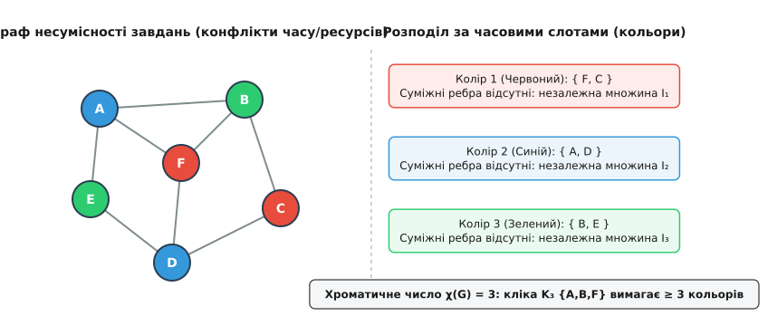
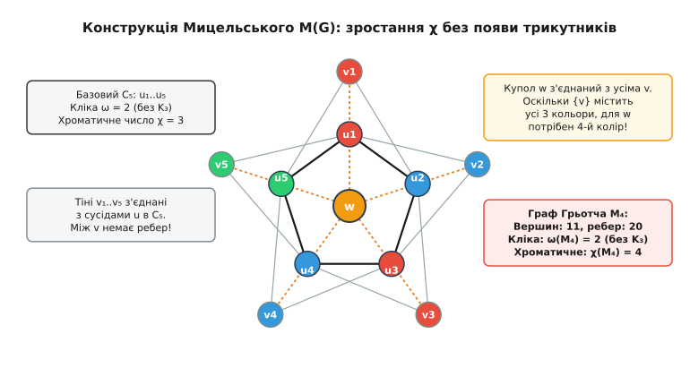
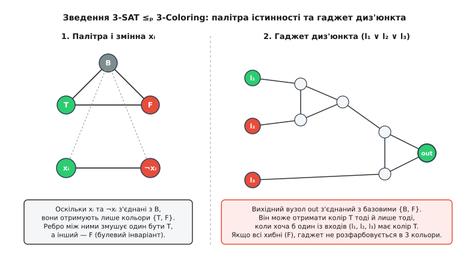
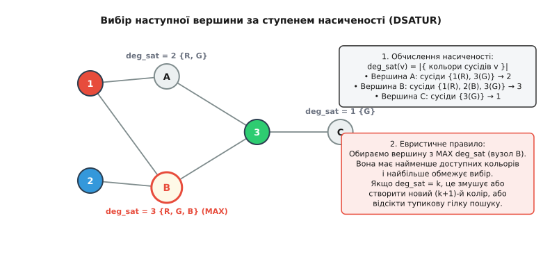

# Хроматичне число графа

<preknowlist>
- [Асимптотична складність](topic:algorithms/asymptotic-complexity) — класи P і NP, експоненціальний ріст та поняття стіни повного перебору.
- [Матриця суміжності](topic:algorithms/adjacency-matrix) — представлення графів, вершини, ребра та суміжність.
- [Двочастковий граф](topic:algorithms/bipartite-graph) — розбиття вершин на дві незалежні частки та 2-розфарбовуваність за лінійний час.
- [NP-повнота](topic:algorithms/np-completeness) — поліномні зведення Карпа, сертифікати верифікації та клас NP-повних задач.
</preknowlist>

Оптимізувальний компілятор тримає в пам'яті десятки проміжних змінних, але цільовий процесор має лише шістнадцять фізичних регістрів загального призначення. Якщо дві змінні потрібні програмі одночасно — їхні інтервали життя перетинаються, — вони не можуть ділити один і той самий регістр, інакше одне значення затре інше. Якщо ж одна змінна відпрацювала до того, як народилася інша, той самий фізичний регістр можна безбоязно віддати обом. Завдання компілятора — призначити кожній змінній один із шістнадцяти регістрів так, щоб жодна пара одночасно живих змінних не отримала однаковий регістр, або з'ясувати, що шістнадцяти комірок замало і частину значень доведеться скидати в повільну оперативну пам'ять.

Та сама закономірність виникає під час проектування стільникових мереж. Сусідні вишки стільникового зв'язку не можуть транслювати сигнал на однаковій радіочастоті, бо їхні хвилі створять інтерференцію і заглушать одна одну. Але вишки, розділені пагорбом або відстанню у двадцять кілометрів, спокійно використовують той самий частотний канал. Оператор прагне обійтися якомога меншим діапазоном куплених частот, розподіливши їх без взаємних завад.

В обох випадках перед інженером постає одна й та сама сутність: множина об'єктів і парні заборони на спільне використання ресурсів. Якщо зобразити кожен об'єкт вершиною, а кожну несумісність — ребром, ми отримуємо граф несумісності. Розподіл ресурсів перетворюється на призначення кожній вершині певної мітки (кольору) так, щоб кінці жодного ребра не мали однакової мітки. Мінімальна кількість міток, якої вистачить для такого безконфліктного розподілу, називається **хроматичним числом графа** (від грецького *chroma* — колір).


*Зліва: граф конфліктів між шістьма завданнями, де ребра позначають несумісність у часі. Справа: розбиття вершин на три незалежні множини (кольорові класи), які отримують три часові слоти. Наявність трикутника {A, B, F} унеможливлює розфарбування двома кольорами, тому хроматичне число дорівнює трьом.*

## Розфарбування як розбиття на незалежні множини

Формально правильним k-розфарбуванням неорієнтованого графа `G = (V, E)` називають відображення `c: V → {1, 2, ..., k}`, для якого виконується умова:

```
(u, v) ∈ E   ⟹   c(u) ≠ c(v)
```

Якщо таке відображення існує для заданого цілого `k`, граф називають **k-розфарбовуваним** (англ. *k-colorable*). Найменше ціле число `k`, для якого граф є k-розфарбовуваним, позначають грецькою літерою `χ(G)` (читається «хі від G»).

Кожен колір `i ∈ {1, ..., k}` виділяє в графі множину вершин `V[i] = {v ∈ V : c(v) = i}`. З означення правильного розфарбування випливає, що між жодною парою вершин всередині `V[i]` не може бути ребра:

```
∀ u, v ∈ V[i]   ⟹   (u, v) ∉ E
```

Множина вершин без жодного внутрішнього ребра називається **незалежною множиною** (англ. *independent set*). Таким чином, знайти k-розфарбування графа — це те саме, що розбити множину його вершин `V` на `k` неперетинних незалежних множин:

```
V = V₁ ∪ V₂ ∪ ... ∪ Vₖ,   де Vᵢ ∩ Vⱼ = ∅ при i ≠ j
```

Хроматичне число — це мінімальна кількість незалежних підмножин, якими можна повністю покрити всі вершини графа. Якщо граф узагалі не має ребер (порожній граф з ізольованих вершин), достатньо одного кольору: `χ(G) = 1`. Щойно з'являється хоча б одне ребро, кінці цього ребра вимагають різних кольорів, тому `χ(G) ≥ 2`.

Якщо графу вистачає двох кольорів (`χ(G) = 2`), усі його вершини розпадаються на два класи `V₁` та `V₂`, а всі наявні ребра пролягають винятково між цими двома класами. Такий граф називається [двочастковим графом](topic:algorithms/bipartite-graph). Критерій двочастковості добре відомий: граф є 2-розфарбовуваним тоді й лише тоді, коли він не містить циклів непарної довжини.

> 🔧 **Навіщо це.** У розробці розподілених баз даних та транзакційних рушіїв розфарбування графа несумісності транзакцій визначає порядок паралельного виконання. Транзакції одного кольору утворюють незалежну множину — вони гарантовано не читають і не модифікують однакові рядки або блокування. Рушій може безпечно запускати всі операції одного кольору паралельно в окремих потоках без міжпотокових блокувань, переходячи до наступного кольору як до наступного бар'єра синхронізації.

## Фундаментальні межі хроматичного числа

Обчислити `χ(G)` прямим перебором складно. Тому в теорії графів виведено низку структурних меж, які затискають хроматичне число між локальними та глобальними властивостями графа.

### Нижні оцінки: кліки та число незалежності

Найпростіша нижня оцінка спирається на повні підграфи. Якщо підмножина з `k` вершин попарно з'єднана між собою ребрами (утворює повний граф `Kₖ`, або **кліку**), кожна вершина цієї підмножини зобов'язана отримати унікальний колір. Розмір найбільшої кліки в графі позначають `ω(G)` (число кліки, англ. *clique number*). Оскільки для розфарбування самої лише найбільшої кліки потрібно `ω(G)` кольорів, маємо базову нерівність:

```
χ(G) ≥ ω(G)
```

Друга нижня оцінка пов'язана з розміром найбільшої незалежної множини графа, який позначають `α(G)` (число незалежності, англ. *independence number*). Оскільки кожен кольоровий клас `V[i]` є незалежною множиною, його розмір не перевищує `α(G)`:

```
|V[i]| ≤ α(G)   для кожного i ∈ {1, ..., k}
```

Підсумувавши розміри всіх `k = χ(G)` кольорових класів, отримуємо загальну кількість вершин `n = |V|`:

```
n = |V₁| + |V₂| + ... + |Vₖ|
≤ χ(G) · α(G)
```

Поділивши обидві частини на `α(G)`, одержуємо обов'язкову нижню межу:

```
χ(G) ≥ n / α(G)
```

Ця оцінка демонструє фундаментальний зв'язок: якщо в графі немає великих незалежних множин (тобто `α(G)` мале), то для покриття всіх вершин неминуче знадобиться багато кольорів, навіть якщо в графі немає великих клік.

### Верхні оцінки: жадібне розфарбування та теорема Брукса

Найпростіший спосіб пофарбувати граф — впорядкувати вершини у довільний список `v₁, v₂, ..., vₙ` і послідовно призначати кожній вершині найменший доступний номер кольору, який ще не зайнятий її вже пофарбованими сусідами. Такий алгоритм називається **жадібним розфарбуванням** (англ. *greedy coloring*).

Позначимо через `deg(v)` степінь вершини `v` (кількість суміжних ребер), а через `Δ(G)` — максимальний степінь серед усіх вершин графа `Δ(G) = max_{v ∈ V} deg(v)`. Коли жадібний алгоритм доходить до вершини `v`, вона має щонайбільше `deg(v) ≤ Δ(G)` сусідів. Навіть якщо всі ці сусіди вже розфарбовані і всі вони мають різні кольори, вони можуть заблокувати щонайбільше `Δ(G)` різних номерів. Отже, серед перших `Δ(G) + 1` кольорів завжди знайдеться хоча б один вільний.

Звідси випливає універсальна верхня межа:

```
χ(G) ≤ Δ(G) + 1
```

Чи можна покращити цю межу і скинути одиницю? 1941 року британський математик Роуленд Брукс довів фундаментальну теорему: для будь-якого зв'язного графа `χ(G) ≤ Δ(G)`, за винятком рівно двох особливих випадків — повних графів `Kₙ` (де `Δ = n - 1`, а потрібно `n` кольорів) та простих циклів непарної довжини `C₂ₖ₊₁` (де `Δ = 2`, а потрібно 3 кольори). В усіх інших графах максимальний степінь слугує гарантованою верхньою межею хроматичного числа.

### Дегенеративність графа та межа Секейреша — Вілфа

Максимальний степінь `Δ(G)` може бути оманливим: якщо граф має одну-єдину вершину степеня `n - 1` (наприклад, центр графа-зірки), `Δ(G) = n - 1`, хоча сам граф є двочастковим і фарбується всього у 2 кольори.

Щоб усунути цей перекіс, математики Джордж Секейреш та Герберт Вілф 1968 року ввели поняття фарбувального числа (англ. *coloring number*) на основі **дегенеративності графа**.

Граф називають **d-дегенерованим**, якщо кожен його непустий підграф `H ⊆ G` містить хоча б одну вершину степеня `δ(H) ≤ d`. Дегенеративність `d(G)` визначають як:

```
d(G) = max_{H ⊆ G} δ(H)
```

Якщо на кожному кроці видаляти з графа вершину мінімального степеня і складати такі вершини у стек, ми отримуємо впорядкування видалення `vₙ, vₙ₋₁, ..., v₁`. Якщо тепер розфарбовувати вершини жадібно у зворотному порядку (від `v₁` до `vₙ`), кожна вершина матиме щонайбільше `d(G)` сусідів серед уже пофарбованих. Звідси випливає значно точніша межа Секейреша — Вілфа:

```
χ(G) ≤ 1 + d(G) = 1 + max_{H ⊆ G} δ(H) ≤ Δ(G) + 1
```

Для будь-якого дерева `d(G) = 1`, що дає `χ ≤ 2`. Для будь-якого планарного графа за формулою Ейлера кожен підграф має вершину степеня щонайбільше 5 (`d(G) ≤ 5`), звідки без жодних складних доведень миттєво випливає, що кожен планарний граф 6-розфарбовуваний (`χ ≤ 6`).

Повні математичні виведення цих меж та тонкощі доведення теореми Брукса викладено в окремому матеріалі: [Конструкція Мицельського та межі Брукса](topic:algorithms/chromatic-number/math-mycielski-brooks.md).

## Ілюзія кліки: конструкція Мицельського

Тривалий час у комбінаториці існувала інтуїтивна гіпотеза: якщо графу для розфарбування потрібна велика кількість кольорів, то всередині нього обов'язково має ховатися щільне ядро — велика кліка. Здавалося б, саме наявність попарно сполучених вершин є єдиною причиною зростання хроматичного числа.

1955 року польський математик Ян Мицельський спростував цю інтуїцію, запропонувавши конструктивний алгоритм побудови графів. Його метод дозволяє для будь-якого бажаного числа `k` побудувати граф, який має хроматичне число `χ(G) = k`, але при цьому не містить жодного трикутника (тобто `ω(G) = 2`).


*Перетворення 5-циклу C₅ (хроматичне число 3, без трикутників) на граф Грьотча M₄ з 11 вершинами. Додавання п'яти тіньових вершин vᵢ та верхівки w збільшує хроматичне число до 4, не створюючи жодного трикутника.*

Конструкція працює крок за кроком:

1. Беремо початковий граф `G` з множиною вершин `U = {u₁, u₂, ..., uₙ}`.
2. Для кожної вершини `uᵢ` створюємо її «тіньову копію» `vᵢ`. Множина тіней `V = {v₁, ..., vₙ}` є незалежною множиною — між самими тінями немає жодного ребра.
3. Кожну тіньову вершину `vᵢ` з'єднуємо ребрами з усіма сусідами оригінальної вершини `uᵢ` у початковому графі `G`.
4. Додаємо одну нову вершину-верхівку `w` (англ. *apex*) і з'єднуємо її ребрами з усіма тіньовими вершинами `v₁..vₙ`.

Утворений граф `M(G)` має `2n + 1` вершин і володіє двома строгими властивостями:

```
1. Якщо G не містив трикутників (ω(G) = 2), то M(G) також не містить трикутників: ω(M(G)) = 2
2. Хроматичне число строго зростає на одиницю: χ(M(G)) = χ(G) + 1
```

Почавши з відрізка `K₂` (`χ = 2`), один крок конструкції дає простий 5-цикл `C₅` (`χ = 3`). Другий крок над `C₅` дає одинадцятивершинний **граф Грьотча** (`M₄`), який має `χ = 4` і не містить жодного `K₃`. Повторюючи конструкцію, можна отримати граф із хроматичним числом мільйон, у якому жодні три вершини не утворюють трикутник.

Це відкриття має вирішальне значення для алгоритмічної теорії: воно доводить, що **хроматичне число є глобальною топологічною характеристикою**, а не локальною. Його неможливо визначити чи оцінити, досліджуючи лише невеликі околиці вершин або шукаючи щільні підграфи.

[Історію розвитку задач розфарбування від проблеми чотирьох фарб до сучасних теорем](topic:algorithms/chromatic-number/hist-chromatic-origins.md) можна простежити в історичному нарисі, де показано, як картографічні головоломки перетворилися на фундамент сучасної дискретної математики.

## Обчислювальний бар'єр: чому k-Coloring стає NP-повним

З погляду обчислювальної складності задача розфарбування вершин демонструє разючий стрибок складності (фазовий перехід) при зміні параметра `k`:

```
k = 1:  Перевірити, чи немає в графі ребер.
        Складність: O(|V| + |E|) — тривіально.

k = 2:  Перевірити, чи є граф двочастковим (відсутність непарних циклів).
        Алгоритм: обхід у ширину (BFS) або глибину (DFS).
        Складність: O(|V| + |E|) — лінійний час.

k = 3:  3-Coloring — визначити, чи можна пофарбувати граф у 3 кольори.
        Складність: NP-повна задача (Karp, 1972). Поліноміального алгоритму не існує, якщо P ≠ NP.

k ≥ 3:  k-Coloring для будь-якого фіксованого k ≥ 3 є NP-повною задачею.
```

Прірва між `k = 2` та `k = 3` пояснюється структурою простору вибору. При `k = 2`, щойно ми зафіксували колір однієї вершини, кольори всіх її сусідів визначаються однозначно: у них немає жодного іншого варіанта, крім протилежного кольору. Хвиля вимушених призначень розходиться графом через BFS, і будь-яка суперечність виявляється миттєво.

При `k = 3` фіксація кольору вершини (наприклад, червоного) залишає для її сусіда вибір із двох інших кольорів (синього або зеленого). Виникає розгалужене дерево альтернатив: вибір кольору для однієї вершини не визначає стан сусіда однозначно, а лише накладає слабке диз'юнктивне обмеження.

Ця диз'юнктивність дозволяє точно закодувати булеву логіку мовою графів. 1972 року Річард Карп довів NP-повноту задачі 3-Coloring, побудувавши поліноміальне зведення від задачі [3-SAT](topic:algorithms/np-completeness).


*Гаджети зведення 3-SAT до 3-Coloring. Зліва: базовий трикутник істинності {B, T, F} та пара літералів {xᵢ, ¬xᵢ}, які через зв'язок із Base змушені набувати протилежних значень True або False. Справа: каскадний гаджет диз'юнкта, чий вихідний вузол out може отримати колір True тоді й лише тоді, коли хоча б один вхідний літерал є істинним.*

Зведення використовує дві графічні конструкції (гаджети):

1. **Палітра істинності та гаджет змінних:** створюється базовий трикутник з трьох вершин — `Base (B)`, `True (T)` та `False (F)`. Оскільки вони попарно з'єднані, вони отримують три різні кольори. Для кожної булевої змінної `xᵢ` створюється пара вершин `xᵢ` та `¬xᵢ`, з'єднаних між собою та сполучених ребрами з вершиною `B`. Через з'єднання з `B` вони не можуть отримати колір бази і ділять між собою кольори `T` та `F`. Взаємне ребро змушує одну з них бути істинною, а іншу — хибною.
2. **Гаджет диз'юнкта (OR-gadget):** для кожного диз'юнкта `(l₁ ∨ l₂ ∨ l₃)` будується мережа з п'яти допоміжних вершин, яка з'єднує три вершини-літерали з вихідним вузлом `out`. Вузол `out` додатково з'єднується з вершинами `B` та `F`.

Поведінка гаджета диз'юнкта визначається строгим табличним інваріантом:

```
l₁      l₂      l₃      out колір    Чи допустиме 3-розфарбування?
------------------------------------------------------------------
F       F       F       F (або B)    НІ (колізія з ребрами out-F та out-B)
T       F       F       T            ТАК (вихід out отримує колір T)
F       T       F       T            ТАК (вихід out отримує колір T)
F       F       T       T            ТАК (вихід out отримує колір T)
T       T       T       T            ТАК (вихід out отримує колір T)
```

Якщо всі три літерали мають колір `False`, гаджет неможливо правильно розфарбувати в три кольори без колізії на виході. Якщо хоча б один літерал має колір `True`, вихідний вузол `out` успішно набуває кольору `True` і не конфліктує з сусідніми вершинами `B` та `F`.

Таким чином, булева формула є здійсненною тоді й лише тоді, коли зібраний граф має `χ(G) ≤ 3`.

### Планарні графи та теорема про чотири фарби

Особливе місце в теорії складності посідають **планарні графи** — графи, які можна накреслити на площині так, щоб їхні ребра перетиналися лише у вершинах.

Для планарних графів діє знаменита **теорема про чотири фарби** (доведена Кеннетом Аппелем і Вольфгангом Гакеном 1976 року): будь-який планарний граф можна правильно пофарбувати щонайбільше 4 кольорами:

```
G — планарний   ⟹   χ(G) ≤ 4
```

Алгоритми Аппеля–Гакена та пізніший метод Робертсона, Сандерса, Сеймура і Томаса (1997) дозволяють знайти правильне 4-розфарбування будь-якого планарного графа за поліноміальний час `O(n²)`.

Проте питання про 3-розфарбовуваність планарних графів залишається важким. 1976 року Ґері, Джонсон і Стокмаєр довели, що **Planar 3-Coloring є NP-повною задачею**, навіть якщо максимальний степінь вершин обмежений четвіркою (`Δ ≤ 4`). Тобто для планарних графів з'ясувати, чи вистачить трьох кольорів — експоненційно важко, хоча ми наперед знаємо, що чотирьох кольорів вистачить завжди.

### Ненаближуваність хроматичного числа

Якщо точне знаходження `χ(G)` є NP-важким, чи можна розраховувати на ефективні наближені алгоритми, які гарантували б відповідь, близьку до оптимальної (наприклад, з точністю до коефіцієнта 2)?

Результати сучасної теорії складності дають жорстку негативну відповідь. 2007 року Девід Цукерман, розвиваючи техніки PCP-теореми (імовірнісно перевірюваних доказів), довів: якщо `P ≠ NP`, хроматичне число **неможливо поліноміально наблизити з коефіцієнтом `n^{1 - ε}`** для будь-якого `ε > 0`, де `n` — кількість вершин графа.

Це означає, що задача розфарбування належить до найважчих для апроксимації комбінаторних проблем: поліноміальні евристики в найгіршому випадку дають результат, який відрізняється від справжнього оптимуму майже в `n` разів.

## Точні алгоритми знаходження хроматичного числа

Попри NP-важкість у загальному випадку, інженерна практика (наприклад, компілятори та планувальники завдань) вимагає точного знаходження `χ(G)` для графів помірного розміру. Для цього розроблено низку точних алгоритмів.

### Пошук з поверненням та евристика насиченості (DSATUR)

Класичний точний метод базується на пошуку з поверненням (англ. *backtracking*). Щоб мінімізувати розмір дерева перебору, 1979 року Даніель Брелаз запропонував алгоритм **DSATUR** (від англ. *Degree of Saturation* — ступінь насиченості).

Ступенем насиченості нерозфарбованої вершини `deg_sat(v)` називають **кількість різних кольорів**, які вже призначені її сусідам:

```
deg_sat(v) = |{ c(u) : u ∈ N(v) і u розфарбована }|
```


*Принцип вибору вершини в алгоритмі DSATUR. Вершина B має найвищий ступінь насиченості deg_sat = 3 (її сусіди займають три кольори), тому вона має найжорсткіші обмеження і розглядається першою.*

Правило Брелаза полягає в наступному:

1. На кожному кроці обчислюємо `deg_sat(v)` для всіх ще не пофарбованих вершин.
2. Обираємо вершину `v` з **максимальним** значенням `deg_sat(v)`. Якщо таких вершин кілька, обираємо серед них ту, яка має найбільший степінь у нерозфарбованому підграфі.
3. Призначаємо обраній вершині найменший можливий колір, не зайнятий її сусідами.
4. Якщо виникає потреба відкрити новий колір, який перевищує поточну відому верхню межу, робимо крок назад (backtrack) і переглядаємо попередні вибори.

Чому DSATUR настільки ефективний? Вершина з високим ступенем насиченості має найменшу кількість доступних кольорів. Обираючи її першою, алгоритм керується принципом «раннього виявлення глухих кутів» (англ. *fail-first principle*): якщо вибір веде до суперечності, перебір виявить це на верхніх рівнях дерева пошуку, відсікаючи гігантські піддерева безплідних варіантів.

Робочу реалізацію алгоритму DSATUR та порівняння точного і жадібного підходів наведено у практичній вставці: [Реалізація алгоритму DSATUR та точного пошуку](topic:algorithms/chromatic-number/proj-dsatur-coloring.md).

### Ланцюги Кемпе та локальний пошук

Для покращення знайденого розфарбування застосовують техніку **ланцюгів Кемпе** (англ. *Kempe chains*). Розглянемо підграф `G_{a, b}`, індукований вершинами лише двох кольорів `a` та `b`. Кожна зв'язна компонента цього підграфа є двоколірною.

Якщо ми виберемо одну таку зв'язну компоненту і поміняємо в ній місцями кольори `a ↔ b`, отримане глобальне розфарбування залишиться строго правильним. Жодного конфлікту на межі компоненти виникнути не може, оскільки всі сусіди вершин компоненти з-поза її меж мають кольори, відмінні від `a` та `b`.

Перемикання ланцюгів Кемпе є потужним інструментом локального пошуку (симуляції відпалу, генетичних алгоритмів): воно дозволяє вивільнити певний колір для заблокованої вершини, змінюючи забарвлення цілих кластерів без порушення інваріантів.

### Динамічне програмування та принцип включень-виключень

Для теоретичного аналізу та роботи з графами до 30–40 вершин застосовують алгоритми точного експоненціального часу, що працюють швидше за наївний перебір `O(kⁿ)`.

1976 року Юджин Лоулер запропонував алгоритм на основі динамічного програмування за підмножинами вершин. Нехай `χ(S)` — хроматичне число підграфа, індукованого підмножиною вершин `S ⊆ V`. Тоді базове рекурентне співвідношення має вигляд:

```
χ(S) = 1 + min_{I ⊆ S} χ(S \ I)
```

де мінімум береться по всіх непорожніх **максимальних незалежних підмножинах** `I` підграфа `S`. Лоулер показав, що обчислення цього значення для всіх підмножин `S` займає час `O*(2.442ⁿ)` (де нотація `O*` ігнорує поліноміальні множники від `n`).

2009 року Андреас Бйорклунд, Тхіс Гусфельдт та Мікко Койвісто здійснили прорив, звівши задачу розфарбування до обчислення **принципу включень-виключень** над сімейством незалежних множин. Кількість способів розфарбувати граф `G` рівно в `k` кольорів (допускаючи порожні класи) виражається формулою:

```
C_k(G) = ∑_{S ⊆ V} (-1)^{|V \ S|} · (i(S))^k
```

де `i(S)` — кількість незалежних множин у підграфі, індукованому підмножиною `S`.

Використовуючи швидке перетворення Мебіуса (швидке перетворення підмножин, англ. *Fast Subset Convolution*), обчислення `i(S)` для всіх підмножин та згортка виконуються за час:

```
T(n) = O*(2ⁿ)   час,   та   O*(2ⁿ)   пам'ять
```

Алгоритм Бйорклунда–Гусфельдта–Койвісто є найшвидшим відомим точним алгоритмом для довільних графів: він розв'язує задачу розфарбування рівно за `2ⁿ` операцій, незалежно від величини хроматичного числа.

## Практичні евристики та розподіл регістрів

У промислових системах, де графи містять тисячі вершин, точні експоненціальні методи непридатні через часові обмеження. Тут застосовують спеціалізовані поліноміальні евристики.

### Алгоритм Велша — Пауелла

1967 року Велш і Пауелл запропонували просту модифікацію жадібного алгоритму, яка значно покращує якість розфарбування:

1. Впорядкувати всі вершини графа за **спаданням їхніх степенів**:
   ```
   deg(v₁) ≥ deg(v₂) ≥ ... ≥ deg(vₙ)
   ```
2. Взяти перший колір `c = 1`. Пройти за списком і призначити колір `c` першій нерозфарбованій вершині.
3. Продовжувати рух за списком: призначати колір `c` кожній наступній нерозфарбованій вершині, яка **не з'єднана ребром** із жодною з уже пофарбованих кольором `c` вершин на поточному проході.
4. Коли список вичерпано, збільшити номер кольору `c = c + 1` і повторювати прохід для решти нерозфарбованих вершин, доки всі вершини не отримають колір.

Впорядкування за степенем гарантує, що найскладніші вершини з великою кількістю зв'язків розфарбовуються першими, коли доступний увесь спектр кольорів, а прості вершини з низьким степенем фарбуються наприкінці без створення додаткових конфліктів.

### Розподіл регістрів Чайтіна — Бріґґса

У розробці компіляторів (LLVM, GCC) класичний підхід до розподілу регістрів, запропонований Грегорі Чайтіном 1981 року та вдосконалений Престоном Бріґґсом 1989 року, зводить задачу до k-розфарбування графа інтерференції (де `k` — кількість фізичних регістрів процесора):

```
Компіляція:   Змінні програми   ⟶   Вершини графа інтерференції
              Спільне життя     ⟶   Ребра конфлікту
              k регістрів       ⟶   k кольорів
```

Алгоритм використовує фундаментальне спостереження Кемпе: якщо в графі є вершина `v`, степінь якої строго менший за кількість доступних регістрів:

```
deg(v) < k
```

то цю вершину можна **тимчасово вилучити з графа** разом з усіма її ребрами і відкласти у стек. Логіка проста: скільки б кольорів не отримали сусіди `v` у залишковому графі, вони займуть щонайбільше `k - 1` кольорів. Тому, коли ми повернемо `v` на місце, для неї гарантовано залишиться хоча б один вільний колір з `k`.

Процедура Чайтіна–Бріґґса складається з чотирьох фаз:

1. **Спрощення (Simplify):** шукаємо вершину зі степенем `deg(v) < k`, видаляємо її з графа і кладемо в стек. Зменшення степенів сусідів може створити нові вершини зі степенем `< k`. Процес повторюється, доки граф не спорожніє.
2. **Скидання в пам'ять (Spill):** якщо всі вершини, що залишилися в графі, мають степінь `deg(v) ≥ k`, видалити безпечно нічого не можна. Алгоритм обирає одну «найменш цінну» змінну (яка рідко використовується в циклах) і позначає її як кандидата на скидання в оперативну пам'ять (spill). Вершину видаляють з графа, сподіваючись, що це дозволить спростити решту.
3. **Вибір кольору (Select):** вершини витягуються зі стека у зворотному порядку і повертаються в граф. Для кожної вершини обирається вільний регістр серед тих, які ще не зайняті її вже відновленими сусідами.
4. **Генерація коду скидання:** якщо для оптимістично відкладеної вершини-кандидата на spill кольору таки не знайшлося, компілятор вставляє в машинний код інструкції запису значення в стек перед звільненням і зчитування перед кожним використанням. Після цього граф інтерференції перебудовується, і процес повторюється.

### Реберне розфарбування та теорема Візінга

Поруч із вершинним розфарбуванням у комбінаториці існує споріднене поняття **реберного розфарбування** (англ. *edge coloring*): призначення кольорів ребрам графа так, щоб жодні два ребра зі спільним кінцем не мали однакового кольору. Мінімальну кількість кольорів для ребер називають **хроматичним індексом** і позначають `χ'(G)`.

Реберне розфарбування графа `G` еквівалентне вершинному розфарбуванню його **реберного графа** (англ. *line graph* `L(G)`). Оскільки кожна вершина інцидентна `deg(v)` ребрам, які мають бути пофарбовані в різні кольори, очевидно, що:

```
χ'(G) ≥ Δ(G)
```

1964 року український математик Вадим Візінг довів дивовижну теорему: для будь-якого простого графа хроматичний індекс набуває лише одного з двох можливих значень:

```
Δ(G) ≤ χ'(G) ≤ Δ(G) + 1
```

Це разючий контраст із вершинним хроматичним числом `χ(G)`, яке (як довів Мицельський) може бути як завгодно великим при малому степені або малій кліці. Проте класифікація графів на клас 1 (`χ' = Δ`) та клас 2 (`χ' = Δ + 1`) за Хольєром (1981) також є NP-повною задачею.

Для взаємодії з програмними рушіями та уніфікації структур даних створено строгий інтерфейс: [Інтерфейс бібліотеки розфарбування графів](topic:algorithms/chromatic-number/api-coloring-solver.md), який визначає формати представлення графів, сертифікати правильності розфарбування та структури звітів про конфлікти.

## Синтез

Хроматичне число графа стоїть на стику трьох фундаментальних напрямів комп'ютерних наук:

- **Комбінаторного:** розбиття множини вершин на мінімальну кількість незалежних класів еквівалентності.
- **Обчислювального:** демонстрація фазового переходу між поліноміальною задачею 2-Coloring та NP-повною задачею 3-Coloring, де відсутність локальних клік (конструкція Мицельського) не рятує від глобальної необхідності залучення великої кількості кольорів.
- **Прикладного:** математичний апарат розв'язання конфліктів у ресурсно-обмежених системах — від оптимізації регістрів у трансляторах мов програмування до планування паралельних транзакцій і частотного менеджменту.

Хроматичне число вчить інженера важливого уроку: складність системи часто криється не у великих локальних вузлах (кліках), а в заплутаному сплетінні далеких циклічних залежностей, які неможливо розв'язати локальними перевірками.
