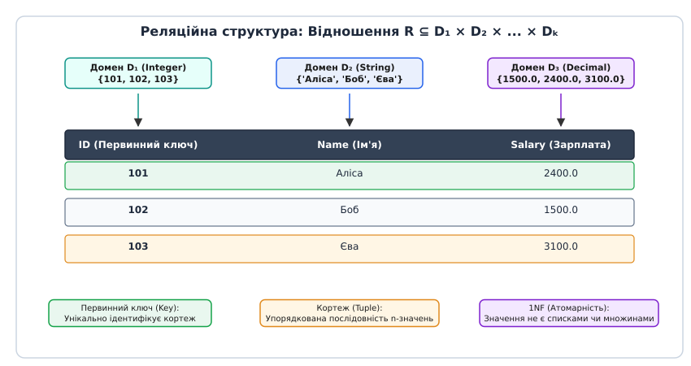
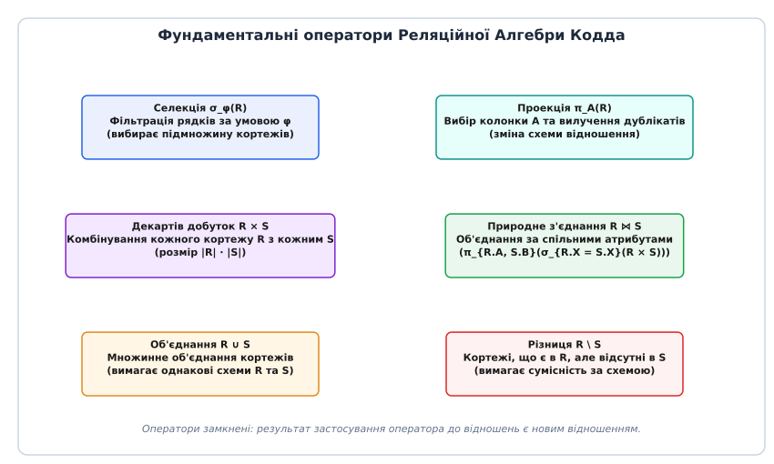
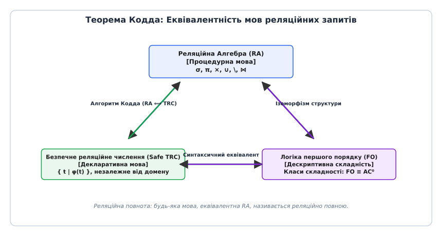
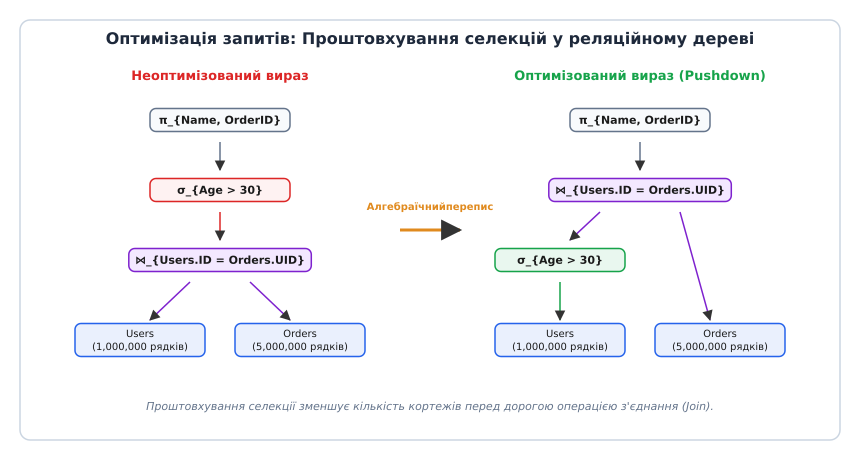

# Реляційна модель даних та теорема Кодда

<preknowlist>
- [Логіка першого порядку та дескриптивна складність](topic:algorithms/descriptive-complexity) — синтаксис і семантика предикатів, квантори та скінченні моделі.
- [Диз'юнктивні та кон'юнктивні нормальні форми](topic:algorithms/dnf-cnf) — еквівалентні перетворення логічних виразів, кон'юнкції та диз'юнкції.
</preknowlist>

У 1968 році головний інформаційний центр авіакомпанії Pan American опрацьовував мільйони бронювань авіаквитків за допомогою ієрархічної бази даних IBM IMS. Структура збереження пасажирських даних була намертво прив'язана до дискових адрес та фізичних зсувів у блоках магнітних барабанів. Коли інженери вирішили додати до запису пасажира нове текстове поле «програма лояльності», це призвело до катастрофічної зміни фізичного розміщення даних на дисках. У результаті понад п'ятдесят тисяч рядків прикладної програми мовою COBOL повністю втратили працездатність, бо їхні внутрішні алгоритми крокували по жорстко зафіксованих байтових зсувах. На виправлення коду та відновлення систем знадобилося три тижні простою, що коштувало компанії мільйонних збитків і поставило під сумнів саму життєздатність великих комп'ютерних систем обробки інформації.

Ця криза була не поодиноким випадком, а системним дефектом усіх ранніх інформаційних систем. У 1960-х роках обробка даних будувалася за двома основними підходами: ієрархічним (де дані подавалися у вигляді дерев зі жорсткими зв'язками «батько — дитина») та мережевим (стандартизованим комісією CODASYL DBTG, де дані поєднувалися у довільні графи за допомогою фізичних дискових вказівників). У мережевій моделі зв'язки між записами регулювалися так званими наборами (Set Types), що складалися з одного запису-власника (`OWNER`) та довільної кількості записів-членів (`MEMBER`). Для навігації по цих наборах прикладний програміст мусив оперувати низкорівневими системними вказівниками поточного стану (`CURRENT OF SET`, `CURRENT OF RECORD`, `CURRENT OF AREA`).

Фізичні дискові носії того часу (такі як дискові пакети IBM 2314 або 3330) вимагали від програміста знання фізичного розбиття диска на доріжки, циліндри та сектори. Доступ до даних здійснювався через виклики команд введення-виведення операційної системи. Якщо прикладній програмі потрібно було обновити поле адреси клієнта, вона мусила фізично вичитати увесь сектор диска, модифікувати байтовий масив у оперативній пам'яті та перезаписати сектор назад. Будь-яка помилка програміста або аварія живлення під час цього процесу призводила до того, що дискові вказівники на сусідні записи перетворювалися на сміття («висячі вказівники»), руйнуючи цілісність всієї бази даних.

Щоб отримати відповідь на будь-яке аналітичне питання — наприклад, перелічити всіх пасажирів, які придбали квиток на конкретний рейс у певному часовому інтервалі — прикладний програміст мусив виступати низкорівневим «навігатором». Він писав складні циклічні процедури, які вручну зчитували дискові блоки, перевіряли покажчики на наступний запис у ланцюжку та зсували дискові головки накопичувача. Будь-яка зміна у фізичній структурі дискового файлу, додавання нового індексу чи реорганізація секторів магнітного носія вимагала повного переписування прикладної логіки підприємства.

Рішення цієї фундаментальної проблеми запропонував у 1970 році британський математик Едгар Френк Кодд (Edgar F. Codd), який працював у дослідницькій лабораторії IBM у Сан-Хосе. Кодд усвідомив, що фундаментальна помилка попередників полягала у змішуванні логічного рівня опису даних із фізичним способом їх запису на магнітні носії. Він запропонував відкинути процедурну навігацію по дискових вказівниках і перевести обробку інформації на строгий математичний апарат теорії множин та логіки першого порядку. Так народилася реляційна модель даних (від латинського *relatio* — відношення), яка на п'ять десятиліть наперед визначила розвиток систем управління базами даних. Детальний аналіз драматичного історичного протистояння між прибічниками мережевої моделі CODASYL та математичним підходом Кодда описано у вставці [📜 Історія винайдення реляційної моделі та боротьба з CODASYL](topic:algorithms/codd-relational-model/hist-codd-ibm.md).

## Математичний фундамент: Відношення, кортежі та домени

Реляційна модель даних відмовляється від поняття «дискових файлів», «записів» чи «навігаційних вказівників». Замість цього єдиним універсальним інформаційним контейнером стає **відношення** (relation), яке з математичної точки зору є підмножиною Декартового добутку скінченної кількості доменів.

Для побудови реляційної системи спочатку визначаються **домени** (domains) — множини допустимих скалярних значень одинакового типу. Домен є суто теоретико-множинною абстракцією. Наприклад, домен `D₁ = Integer` представляє множину всіх цілих чисел, `D₂ = String` — множину текстових рядків в певному алфавіті, а `D₃ = Decimal` — множину дробових чисел фіксованої точності. Домени задають семантичні межі значень: навіть якщо два атрибути «Вік» та «Номер паспорта» мають однаковий базовий тип цілих чисел, вони можуть належати до різних доменів, що унеможливлює їхнє безглузде порівняння.

**Схема відношення** `R(A₁: D₁, A₂: D₂, ..., Aₖ: Dₖ)` задається скінченною множиною імен атрибутів `Schema(R) = {A₁, A₂, ..., Aₖ}` та відповідних їм доменів. Число `k` (кількість атрибутів) називається **арністю** (arity) або ступенем відношення.

**Кортеж** (tuple) `t` над схемою `Schema(R)` є впорядкованою послідовністю `k` значень `<v₁, v₂, ..., vₖ>`, де кожен елемент `vᵢ` належить відповідному домену `Dᵢ`. Окреме значення атрибута `Aᵢ` у кортежі `t` позначається як `t.Aᵢ` або `t[Aᵢ]`.

**Відношення** `R` над схемою `Schema(R)` являє собою **скінченну множину кортежів**:

```
R ⊆ D₁ × D₂ × ... × Dₖ
```

Кількість кортежів `|R|` у відношенні називається його **кардинальністю** (cardinality).


*Анатомія відношення Кодда: зв'язок між фундаментальними математичними доменами, заголовком схеми відношення та множиною кортежів (1NF).*

З математичного означення відношення як множини безпосередньо випливають чотири фундаментальні властивості реляційних таблиць Кодда:

1. **Унікальність кортежів (Відсутність дублікатів):** Оскільки відношення є математичною множиною, воно за визначенням не може містити два однакові елементи. Якщо `t₁ ∈ R` та `t₂ ∈ R`, то існує хоча б один атрибут `Aᵢ`, для якого `t₁.Aᵢ ≠ t₂.Aᵢ`.
2. **Невпорядкованість кортежів:** У множині елементи не мають внутрішнього порядкового номера. Відношення `{t₁, t₂}` та `{t₂, t₁}` є тотожними. Фізичний порядок розташування рядків у блоках на диску не має жодного логічного значення для запитів.
3. **Невпорядкованість атрибутів:** Атрибути ідентифікуються виключно за своїми унікальними іменами `Aᵢ` у схемі, а не за порядковими номерами колонок.
4. **Перша нормальна форма (1NF, First Normal Form):** Усі значення `vᵢ` в усіх кортежах мають бути строго атомарними (скалярними). Атрибут не може містити масив, список, вкладену таблицю чи складений структурований об'єкт.

### Обмеження цілісності, ключі та нормалізація схем

Зв'язки між різними відношеннями у модель Кодда встановлюються не за допомогою адресної навігації чи вказівників, а виключно через порівняння значень атрибутів. Для цього використовуються ключові концепції цілісності даних:

- **Суперключ (Superkey):** Підмножина атрибутів `S ⊆ Schema(R)`, значення яких однозначно ідентифікують кожен кортеж у відношенні `R`.
- **Кандидатний ключ (Candidate Key):** Мінімальний суперключ — підмножина атрибутів `K ⊆ Schema(R)`, яка має властивість унікальності (жодні два кортежі не збігаються за значеннями `K`) та нескоротності (жодна власна підмножина `K'` не має властивості унікальності).
- **Первинний ключ (Primary Key):** Один із кандидатних ключів, обраний розробником для однозначної ідентифікації кортежів у відношенні. Усі інші кандидатні ключі називаються альтернативними ключами (Alternate Keys).
- **Зовнішній ключ (Foreign Key):** Підмножина атрибутів `FK` у схемі відношення `R₁`, значення яких повинні або збігатися зі значеннями первинного ключа `PK` у відношенні `R₂`, або бути відсутніми. Це забезпечує **посиланняльну цілісність** (Referential Integrity), унеможливлюючи появу «висячих посилань».

Фундамент класичного нормалізування реляційних схем будується на концепції **функціональних залежностей** (Functional Dependencies, FD). Функціональна залежність `X → Y` (де `X, Y ⊆ Schema(R)`) означає, що для будь-якої пари кортежів `t₁, t₂ ∈ R` зі збігом значень за атрибутами `X` (`t₁[X] = t₂[X]`) обов'язково збігаються значення за атрибутами `Y` (`t₁[Y] = t₂[Y]`). Логічний вивід нових функціональних залежностей здійснюється за допомогою аксіом Армстронга (аксіоми рефлексивності, доповнення та транзитивності), що дозволяє обчислювати замикання множини залежностей `F⁺`.

На основі функціональних залежностей Кодд розробив математичну теорію нормалізації, яка усуває аномалії вставки, видалення та оновлення даних:
- **1NF (Перша нормальна форма):** Атомарність усіх значень атрибутів.
- **2NF (Друга нормальна форма):** Схема перебуває в 1NF, і кожен неключовий атрибут функціонально повно залежить від усього первинного ключа (відсутність часткових залежностей від ключа).
- **3NF (Третя нормальна форма):** Схема перебуває в 2NF, і жоден неключовий атрибут не залежить транзитивно від первинного ключа.
- **BCNF (Нормальна форма Бойса — Кодда):** Для кожної нетривіальної функціональної залежності `X → Y` ліва частина `X` є суперключем відношення.

У початковій праці 1970 року Кодд свідомо виключив поняття відсутніх даних (`NULL`), вважаючи, що кожен атрибут повинен мати чітке значення з домену. Лише згодом, у 1979 році, для моделювання неповноти інформації було введено спеціальний маркер `NULL`, що призвело до розширення класичної двозначної логіки до тризначної логіки Клини (3VL) зі значеннями `{true, false, unknown}`. У тризначній логіці будь-яке порівняння з `NULL` (наприклад, `t.Age = NULL` або `NULL = NULL`) повертає значення `unknown`, що істотно змінює семантику селекції та з'єднань.

## Реляційна алгебра: Процедурна мова операторів

Щоб маніпулювати відношеннями без використання процедурних циклів, Едгар Кодд розробив **Реляційну алгебру** (Relational Algebra, RA) — алгебраїчну систему, операндами та результатами якої є відношення.

Ключовою властивістю реляційної алгебри є **замкненість** (closure property): результат застосування будь-якого оператора алгебри до одного або кількох відношень є новим відношенням. Це дозволяє будувати зважені ієрархічні вирази довільної глибини, де вихід одного оператора стає входом для іншого.

Кодд виділив 5 фундаментальних (базових) операторів, з яких можна сконструювати будь-яку іншу алгебраїчну операцію над даними.


*Шість ключових операцій реляційної алгебри: селекція, проекція, декартів добуток, об'єднання, різниця та похідне природне з'єднання.*

### 1. Селекція (`σ`)
Селекція (горизонтальна фільтрація) приймає відношення `R` та логічний предикат `φ` і повертає нове відношення з тією самою схемою, що містить лише ті кортежі `t ∈ R`, для яких предикат `φ(t)` оцінюється як `true`:

```
σ_φ(R) = { t ∈ R | φ(t) = true }
```

Предикат `φ` будується з порівнянь атрибутів із константами або іншими атрибутами (`Aᵢ op c` або `Aᵢ op Aⱼ`) за допомогою логічних зв'язок `∧, ∨, ¬`.

### 2. Проекція (`π`)
Проекція (вертикальна фільтрація) приймає відношення `R` та підмножину атрибутів `A = {A₁, ..., A☵} ⊆ Schema(R)` і повертає відношення зі схемою `A`, яке містить кортежі, зрізані до вказаних атрибутів:

```
π_{A₁, ..., A☵}(R) = { <t.A₁, ..., t.A platform> | t ∈ R }
```

Оскільки проекція відкидає частину атрибутів, у результаті можуть утворитися однакові рядки. Оператор проекції за визначенням **автоматично вилучає дублікати**, зберігаючи множинну семантику відношення.

### 3. Декартів добуток (`×`)
Декартів добуток комбінує кожен кортеж відношення `R` (арності `k₁`) з кожним кортежем відношення `S` (арності `k₂`). Схема результату містить `k₁ + k₂` атрибутів, а кардинальність дорівнює `|R × S| = |R| · |S|`:

```
R × S = { t_r ∘ t_s | t_r ∈ R, t_s ∈ S }
```

де `t_r ∘ t_s` позначує конкатенацію кортежів. Операція вимагає, щоб схеми `R` та `S` не мали спільних імен атрибутів (у разі наявності спільних імен застосовується оператор перейменування `ρ`).

### 4. Об'єднання (`∪`)
Об'єднання двох відношень `R` та `S` повертає відношення, що містить усі кортежі, які присутні в `R`, в `S` або в обох відношеннях одночасно. Операція вимагає **сумісності за схемою** (Union Compatibility): відношення `R` та `S` повинні мати однакову арність, а відповідні атрибути мають бути визначені на однакових доменах:

```
R ∪ S = { t | t ∈ R ∨ t ∈ S }
```

### 5. Різниця (`\`)
Різниця двох сумісних за схемою відношень `R \ S` повертає кортежі, які належать відношенню `R`, але відсутні у відношенні `S`:

```
R \ S = { t | t ∈ R ∧ t ∉ S }
```

### Похідні та розширені оператори

На основі 5 фундаментальних операторів будуються зручні похідні операції:

- **Перетин (`R ∩ S`):** Множинний перетин кортежів, який виражається через різницю:
  ```
  R ∩ S = R \ (R \ S)
  ```
- **Тета-з'єднання (Theta-Join, `R ⋈_θ S`):** З'єднання двох відношень за довільним логічним предикатом `θ`:
  ```
  R ⋈_θ S = σ_θ(R × S)
  ```
- **Природне з'єднання (Natural Join, `R ⋈ S`):** Поєднує кортежі `R` та `S` за збігом значень усіх спільних атрибутів `X = Schema(R) ∩ Schema(S)` і вилучає дубльовані колонки:
  ```
  R ⋈ S = π_{Schema(R) ∪ Schema(S)}(σ_{R.X₁ = S.X₁ ∧ ... ∧ R.Xₖ = S.Xₖ}(R × S))
  ```
- **Семі-з'єднання (Semi-join `R ⋉ S`):** Повертає лише ті кортежі з `R`, для яких існує хоча б один відповідний кортеж у `S` за спільними атрибутами:
  ```
  R ⋉ S = π_{Schema(R)}(R ⋈ S)
  ```
  Семі-з'єднання відіграє фундаментальну роль у розподілених базах даних (Distributed Databases), оскільки дозволяє передавати по мережі лише ключові атрибути замість повних таблиць.
- **Анти-з'єднання (Anti-join `R ⋫ S`):** Повертає ті кортежі з `R`, для яких не існує жодного відповідного кортежу в `S`:
  ```
  R ⋫ S = R \ (R ⋉ S)
  ```
- **Ділення (`R ÷ S`):** Дозволяє відповідати на запити з загальним квантором (типу «знайти клієнтів, які придбали *усі* товари з категорії X»).
- **Зовнішні з'єднання (Outer Joins: Left `R ⟕ S`, Right `R ⟖ S`, Full `R ⟗ S`):** Розширення алгебри для збереження кортежів, які не знайшли відповідності при з'єднанні, шляхом доповнення відсутніх атрибутів значеннями `NULL`.

Повний формальний довідник операторів, їхніх точних алгебраїчних сигнатур та правил перетворення наведено у вставці [📋 Специфікація та алгебраїчні правила Реляційної Алгебри](topic:algorithms/codd-relational-model/api-relational-algebra-spec.md).

## Реляційне числення: Декларативна мова логіки першого порядку

Реляційна алгебра є **процедурною** мовою: вираз алгебри явним чином визначає послідовність кроків (порядок застосування операторів), які мусить виконати комп'ютер для отримання результату.

Паралельно з алгеброю Кодд запропонував **Реляційне числення** (Relational Calculus, RC) — **декларативну** мову виразів на основі логіки першого порядку (First-Order Logic, FO). У численні програміст описує *властивості* даних, які він бажає отримати, не вказуючи жодних алгоритмічних кроків для їх обчислення.

Існують дві еквівалентні форми реляційного числення:
1. **Числення кортежів (Tuple Relational Calculus, TRC):** Змінні у формулах представляють цілі кортежі відношень.
2. **Числення доменів (Domain Relational Calculus, DRC):** Змінні у формулах представляють окремі скалярні значення з доменів.

Вираз у численні кортежів має вигляд:

```
{ t | φ(t) }
```

де `t` — вільна змінна кортежу заданої схеми, а `φ(t)` — формула логіки першого порядку, побудована з:
- Атомарних предикатів належності відношенню: `R(t)`.
- Предикатів порівняння: `t.A op s.B` або `t.A op c`.
- Логічних зв'язок: `∧, ∨, ¬`.
- Кванторів існування `∃` та загальності `∀`: `∃ u (ψ(u))`, `∀ u (ψ(u))`.

Вираз у численні доменів (DRC) має дзеркальний виразний вигляд над окремими скалярними змінними:

```
{ <x₁, x₂, ..., x☵> | φ(x₁, x₂, ..., x☵) }
```

Прикладом запиту в численні кортежів для знаходження імен клієнтів, які здійснили покупки на суму понад 1000, є вираз:

```
{ t(Name) | ∃ u ∃ o (Users(u) ∧ Orders(o) ∧ u.ID = o.UserID ∧ o.Amount > 1000 ∧ t.Name = u.Name) }
```

### Проблема небезпечних запитів та Незалежність від домену

Якщо дозволити використовувати довільні формули логіки першого порядку, виникає серйозна проблема **небезпечних виразів** (unsafe queries). Наприклад, вираз із запереченням:

```
{ t | ¬Users(t) }
```

вимагає повернути всі кортежі світу, які *не* знаходяться у відношенні `Users`. Якщо домен атрибутів є нескінченним (наприклад, множина всіх можливих рядків `String`), результат цього запиту є нескінченною множиною, яку неможливо обчислити чи зберегти у пам'яті комп'ютера.

Аналогічно, вираз з диз'юнкцією:

```
{ t | Users(t) ∨ t.Age = 25 }
```

повертає нескінченну кількість кортежів, у яких атрибут `Age` дорівнює `25`, але всі інші атрибути містять довільні елементи з нескінченного домену.

Щоб усунути цей феномен, Кодд увів поняття **незалежності від домену** (Domain Independence). Запит називається незалежним від домену, якщо його результат залежить виключно від даних, які фізично присутні у базі даних (від так званого **активного домену** `Dom(DB)`), і не змінюється при розширенні фонового універсуму доменів.

Оскільки задача перевірки незалежності від домену для довільної формули є алгоритмічно нерозв'язною (згідно з теоремою Трахтенброта про нерозв'язність логіки першого порядку на скінченних моделях), Кодд визначив синтаксично обмежений клас **безпечних формул** (Safe TRC / Safe DRC). У безпечних формулах будь-яке заперечення або квантор обмежені обов'язковою належністю змінних до активного домену баз даних.

## Теорема Кодда про реляційну повноту

Створивши дві радикально різні мови — процедурну алгебру та декларативне числення — Едгар Кодд довів свою головну теорему, яка досі залишається фундаментальним наріжним каменем теорії баз даних.

> **Теорема Кодда (Codd's Theorem, 1972).** Виразна сила реляційної алгебри (RA) та безпечного реляційного числення кортежів (Safe TRC) є строго тотожною.


*Трикутник еквівалентності Теореми Кодда: зв'язок між процедурною реляційною алгеброю, декларативним безпечним численням та дескриптивною складністю логіки першого порядку.*

Зміст теореми полягає у доведенні двостороннього еквівалентного перетворення:

1. **Прямий напрямок (RA → Safe TRC):** Для кожного виразу реляційної алгебри `E` існує еквівалентна безпечна формула реляційного числення `φ_E` така, що `Result(E) = { t | φ_E(t) }`. Доведення здійснюється індукцією за структурою алгебраїчного виразу (селекція перетворюється на кон'юнкцію з предикатом, проекція — на квантор існування `∃`, декартів добуток — на кон'юнкцію атомів, об'єднання — на диз'юнкцію, різниця — на кон'юнкцію з запереченням).
2. **Зворотний напрямок (Safe TRC → RA):** Для кожної безпечної формули реляційного числення `φ(t)` існує еквівалентний вираз реляційної алгебри `E_φ` такий, що `Result(E_φ) = { t | φ(t) }`. Для побудови такого виразу Кодд розробив спеціальний алгоритм (Codd's Reduction Algorithm), який знижує логічні квантори та заперечення до комбінацій алгебраїчних операторів `σ, π, ×, ∪, \` над активним доменом. Квантори загальності `∀ u (ψ(u))` за законами Де Моргана попередньо перетворюються на квантори існування з запереченнями `¬∃ u (¬ψ(u))`.

Строге математичне доведення теореми Кодда та індуктивні алгоритми трансляції виразів наведено у вставці [🧮 Доведення теореми Кодда та реляційна повнота](topic:algorithms/codd-relational-model/math-codd-theorem-proof.md).

### Поняття реляційної повноти

Теорема Кодда дала комп'ютерній науці точний математичний критерій для оцінки виразної сили будь-якої мови запитів:

**Означення:** Мова запитів до баз даних називається **реляційно повною** (Relational Complete), якщо вона може виразити будь-який запит, який виражається у реляційній алгебрі або безпечному реляційному числінні.

Мова SQL, створена в IBM на основі числення та алгебри Кодда, є реляційно повною. Будь-який декларативний запит `SELECT ... FROM ... WHERE` мови SQL усередині СУБД транслюється за алгоритмом Кодда у дерево реляційної алгебри, яке потім оптимізується і виконується рушієм бази даних.

## Дескриптивна складність та обмеження логіки першого порядку

З точки зору **дескриптивної складності** (Descriptive Complexity), реляційна база даних є скінченною реляційною структурою (Finite Structure) у логіці першого порядку.

Запити у реляційній алгебрі строго відповідають формулам логіки першого порядку `FO`. Це дає змогу точно тотожнити реляційні запити з фундаментальними класами складності обчислень:

- **Складність за даними (Data Complexity):** Обчислення значення фіксованого реляційного запиту `Q` над базою даних розміру `N = |DB|` належить до класу складності `LOGSPACE` за пам'яттю.
- **Схемна складність (Circuit Complexity):** Будь-який запит реляційної алгебри можна обчислити за допомогою послідовності логічних схем константної глибини з необмеженим коефіцієнтом об'єднання входів (fan-in), що відповідає класу складності `AC⁰`.

### Виразна межа Кодда: Неможливість обчислення транзитивного замикання

Парадоксально, але саме математична строгість логіки першого порядку зумовлює фундаментальне виразне обмеження реляційної моделі Кодда.

> **Теорема про виразне обмеження FO.** Логіка першого порядку (і відповідно реляційна алгебра та класичний SQL без рекурсії) **не здатна** виразити операцію транзитивного замикання (Transitive Closure) над скінченними структурами.

Для ілюстрації цього обмеження розглянемо орієнтований граф, збережений у реляційному відношенні `Graph(From, To)`. Запит типу «чи існує шлях між вершиною A та вершиною B довільної довжини?» або «знайти всіх керівників співробітника X у корпоративному дереві довільної глибини» **неможливо** записати жодним скінченним виразом реляційної алгебри.

Причина полягає у тому, що для перевірки шляху довжини `k` у реляційній алгебрі потрібно виконати `k - 1` послідовних природних з'єднань:

```
Path_1 = Graph
Path_2 = π_{Graph1.From, Graph2.To}(σ_{Graph1.To = Graph2.From}(Graph × Graph))
Path_k = Graph ⋈ Graph ⋈ ... ⋈ Graph
```

Оскільки довжина шляху `k` залежить від розміру бази даних `N`, а вираз реляційної алгебри мусить бути фіксованим і скінченним до початку обчислень, алгебра Кодда не може охопити графи довільного розміру. Математично це доводиться за допомогою ігор Еренфойхта — Фрессе (Ehrenfeucht-Fraïssé Games) у математичній логіці, які показують, що формули з обмеженим рангом кванторів не можуть відрізнити граф-цикл довжини `2^k` від двох незв'язаних циклів довжини `2^{k-1}`.

### Вихід за межі Кодда: Datalog та `WITH RECURSIVE`

Щоб подолати це обмеження і зберегти декларативну чистоту моделі, дослідники розширили логіку першого порядку оператором **найменшої нерухомої точки** (Least Fixed Point, LFP).

Формула з нерухомою точкою визначається через індуктивне нарощування відношення доти, доки застосування оператора не припинить додавати нові кортежі (`R_{i+1} = R_i`). Завдяки монотонності операторів об'єднання та з'єднання, для скінченної бази даних така нерухома точка завжди досягається за скінченну кількість кроків.

Це розширення лягло в основу мови **Datalog** (`FO + LFP`), а у 1999 році було офіційно додано до стандарту ANSI SQL у вигляді рекурсивних обозагальнень табличних виразів (`WITH RECURSIVE`). Рекурсивний SQL долав межу Кодда, піднімаючи виразну силу мови запитів до класу складності `P` (поліноміальний час) над впорядкованими структурами.

## Оптимізація запитів та алгебраїчні перетворення

Головна практична перевага реляційної моделі полягає у тому, що прикладний програміст звільняється від обов'язку вибирати алгоритм виконання запиту. СУБД приймає декларативний запит мовою SQL, будує за допомогою алгоритму Кодда початкове **дерево реляційного запиту** (Abstract Syntax Tree, AST), а потім трансформує це дерево за допомогою еквівалентних алгебраїчних перетворень.


*Алгебраїчна оптимізація дерева запиту: проштовхування селекції (Pushdown) під операцію природного з'єднання скорочує проміжні множини кортежів у тисячі разів.*

Оптимізатор запитів використовує фундаментальні еквівалентності реляційної алгебри:

1. **Проштовхування селекцій (Selection Pushdown):** Селекція виконується якомога раніше, до того, як відношення потраплять у дорогі оператори декартового добутку чи з'єднання:
   ```
   σ_φ(R ⋈ S) = σ_φ(R) ⋈ S       [якщо предикат φ стосується лише атрибутів R]
   ```
   Якщо відношення `Users` містить `1 000 000` рядків, а `Orders` — `5 000 000`, виконання декартового добутку `Users × Orders` створить `5 · 10¹²` проміжних кортежів. Якщо ж спочатку виконати селекцію `σ_{Age > 60}(Users)`, яка залишить лише `10 000` рядків, розмір проміжних даних при з'єднанні зменшиться у 100 разів.
2. **Проштовхування проекцій (Projection Pushdown):** Непотрібні атрибути відкидаються якомога раніше, щоб зменшити обсяг оперативної пам'яті, необхідної для збереження кортежів.
3. **Перестановка з'єднань (Join Reordering):** Завдяки комутативності (`R ⋈ S = S ⋈ R`) та асоціативності (`(R ⋈ S) ⋈ T = R ⋈ (S ⋈ T)`) з'єднань, оптимізатор будує дерево з'єднань з найменшою підсумковою вартістю обчислень за допомогою алгоритмів динамічного програмування (алгоритм Патриції Зелінгер у System R).

Окрім логічної оптимізації алгебраїчного дерева, фізичний рушій СУБД здійснює вибір оптимальних **фізичних операторів** (Physical Execution Operators). Для виконання логічного з'єднання `R ⋈ S` рушій може обрати один із трьох фундаментальних алгоритмів:
- **Вкладені петлі (Nested Loop Join):** Складність `O(|R| · |S|)`. Ідеально підходить для малих таблиць або при наявності індексу на спільний атрибут (Index Nested Loop Join зі складністю `O(|R| log |S|)`).
- **З'єднання сортуванням і злиттям (Sort-Merge Join):** Попередньо сортує обидва відношення за ключем з'єднання, після чого зливає їх за один лінійний прохід. Складність `O(|R| log |R| + |S| log |S|)`.
- **Хеш-з'єднання (Hash Join):** Будує в оперативній пам'яті хеш-таблицю для меншого відношення `R`, після чого сканує відношення `S` і шукає відповідності за `O(1)`. Підсумкова складність `O(|R| + |S|)`.

## Реалізація програмного рушія реляційної алгебри

Для глибшого розуміння того, як математичні поняття відношень, кортежів та операторів перетворюються на реальний комп'ютерний код, у вставці [⚙️ Реалізація інтерпретатора реляційної алгебри](topic:algorithms/codd-relational-model/proj-relational-algebra-interpreter.md) наведено повні програмні реалізації впам'ятного рушія виконання реляційної алгебри мовами C та C++.

Програми демонструють побудову динамічних схем, алгоритми вилучення дублікатів при проекції та роботу алгоритму вкладених петель (Nested Loop Join) при виконанні природного з'єднання таблиць.

## Спадщина та значення реляційної моделі

Реляційна модель даних Едгарда Кодда стала одним із найважливіших досягнень у історії обчислювальної техніки. Розділивши логічний опис даних та фізичну організацію носіїв, Кодд дав змогу промисловості створити складні інформаційні системи, здатні еволюціонувати десятиліттями без переписування прикладного коду.

Усі сучасні високонавантажені реляційні СУБД (PostgreSQL, MySQL, Oracle, Microsoft SQL Server), колоночні аналітичні сховища (ClickHouse, Snowflake), а також інструменти обробки великих даних (Apache Spark DataFrames, Google BigQuery) побудовані на математичному фундаменті відношень, реляційної алгебри та теореми Кодда. Здатність оптимізатора запитів автоматично перетворювати декларативне «що зробити» на оптимальне процедурне «як зробити» залишається тріумфом застосування математичної логіки в комп'ютерній інженерії.
