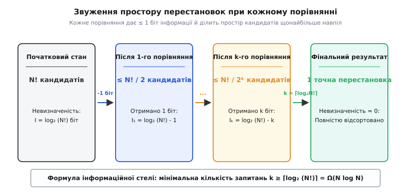
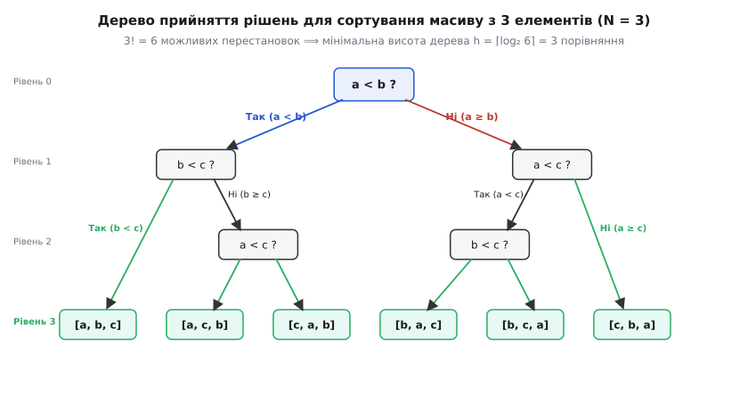
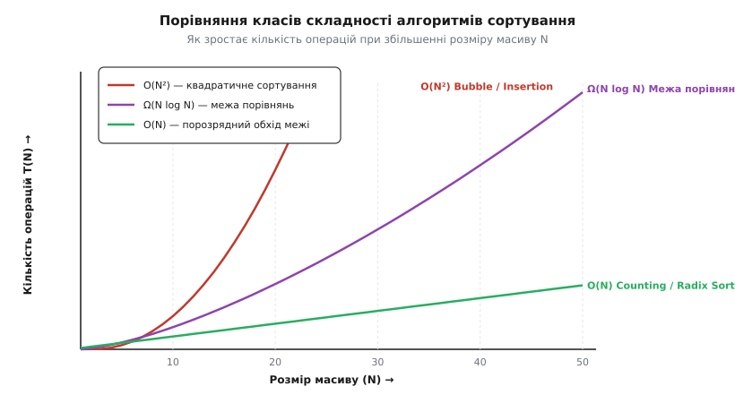

# Нижня межа сортування порівняннями (Ω(n log n))

<preknowlist>
- [Асимптотична складність (нотація O великого)](book:algorithms/asymptotic-complexity) — поняття нижньої межі складності Ω, верхньої межі O та формальний підрахунок кроків.
- [Двійковий логарифм](book:math/binary-logarithm) — властивості log₂ n, вимірювання бітів інформації та висота двійкових дерев.
</preknowlist>

Уяви, що перед тобою лежить тисяча закритих непрозорих коробок, у кожній із яких заховано по одному унікальному числу. Тобі потрібно розставити ці коробки в порядку зростання чисел. Єдина доступна операція — це поставити дві коробки на терези або спитати в чарівного чорного ящика: «Чи число в коробці A менше за число в коробці B?». Ящик відповідає лише «Так» або «Ні».

Скільки щонайменше таких запитань тобі доведеться поставити в найгіршому випадку, щоб гарантовано відсортувати всі коробки? Чи можна придумати настільки хитрий алгоритм, який впорається за лінійну кількість порівнянь — скажімо, за 5n чи 10n запитань?

Відповідь фундаментальна й безжальна: **ні, не можна**. Жоден алгоритм у світі, який спирається виключно на попарні порівняння елементів між собою, не здатний відсортувати n довільних елементів швидше ніж за `Ω(n log n)` операцій. Це обмеження — не наслідок браку людської фантазії чи недосконалості сучасних мов програмування. Це жорстокий інформаційний закон природи. Будь-яка спроба побудувати сортування порівняннями зі складністю `O(n)` або `O(n log log n)` так само приречена на поразку, як і спроба створити вічний двигун.

Звідки береться ця непохитна стеля? Щоб це збагнути, нам потрібно подивитися на сортування не як на переставляння комірок у пам'яті, а як на процес **здобичі інформації та знищення невизначеності**.

---

## Інформаційна інтуїція: 1 порівняння = 1 біт

Коли масив із n унікальних елементів тільки-но потрапляє до нашої програми, ми абсолютно нічого не знаємо про його початковий порядок. Усі елементи можуть бути розташовані у будь-якій із `n!` (n-факторіал) можливих перестановок.

Для масиву з 3 елементів `[a, b, c]` існує 3! = 6 можливих початкових станів:
1. `[a, b, c]` (вже відсортовано)
2. `[a, c, b]`
3. `[b, a, c]`
4. `[b, c, a]`
5. `[c, a, b]`
6. `[c, b, a]`

Серед усіх цих 6 варіантів є лише **одна-єдина правильна перестановка**, яка відповідає впорядкованому масиву. Мета алгоритму сортування — серед n! можливих кандидатів безпомилково визначити саме цю одну правильну послідовність.

Що відбувається, коли алгоритм ставить одне запитання `a < b ?`?
Відповідь на це запитання може бути тільки бінарною: або «Так» (1), або «Ні» (0). Це означає, що одне попарне порівняння дає алгоритму **щонайбільше 1 біт інформації**.

Отримавши 1 біт, алгоритм може розбити весь простір із n! кандидатів щонайбільше на дві групи:
- варіанти, де `a < b`;
- варіанти, де `a ≥ b`.

Якщо початковий простір кандидатів мав розмір N!, то після одного запитання в найгіршому випадку в алгоритму лишиться не менше ніж `N! / 2` кандидатів. Після другого запитання — не менше ніж `N! / 4`, після k-го запитання — не менше ніж `N! / 2ᵏ`.



*Кожне бінарне порівняння вилучає щонайбільше 1 біт невизначеності, ділячи простір можливих перестановок навпіл. Щоб зменшити кількість кандидатів з N! до 1, необхідно зробити принаймні k ≥ ⌈log₂ (N!)⌉ порівнянь.*

Щоб повністю усунути невизначеність і звузити кількість кандидатів від N! до точно 1 варіанта, алгоритм мусить виконати таке число порівнянь k, для якого виконується нерівність:

```
2ᵏ ≥ N!   ⟹   k ≥ ⌈log₂ (N!)⌉
```

Усе зводиться до аналізу функції `log₂ (N!)`. Як поводиться двійковий логарифм факторіала при великих N?

---

## Модель дерева прийняття рішень (Decision Tree)

Щоб надати цій інформаційній інтуїції суворого математичного фундаменту, в теорії алгоритмів використовують абстрактну модель — **дерево прийняття рішень**.

Уявімо будь-який детермінований алгоритм сортування порівняннями (як-от [Сортування злиттям](book:algorithms/divide-and-conquer), [Швидке сортування](book:algorithms/divide-and-conquer) чи [Сортування бульбашкою](book:algorithms/asymptotic-complexity)) для фіксованого розміру входу N. Побудуємо двійкове дерево, де:
- **Внутрішні вузли** описують операції порівняння двох елементів `aᵢ : aⱼ`.
- **Ребра**, що ведуть до нащадків, відповідають результатам порівняння (`aᵢ < aⱼ` — ліве ребро, `aᵢ ≥ aⱼ` — праве ребро).
- **Листки** містять фінальні перестановки елементів, які алгоритм видає як результат сортування.

Кожен конкретний прогін алгоритму на якомусь вхідному масиві відповідає **одному шляху від кореня дерева до одного з листків**. Кількість порівнянь у найгіршому випадку дорівнює **висоті дерева h** (довжині найдовшого шляху від кореня до листка).



*Дерево прийняття рішень для 3 елементів. Будь-який коректний алгоритм мусить мати принаймні 3! = 6 листків, щоб покрити всі можливі початкові порядки. Висота цього дерева дорівнює 3, що відповідає мінімальній кількості порівнянь у найгіршому випадку.*

Дерево прийняття рішень має дві фундаментальні геометричні властивості:

1. **Кількість листків L мусить бути не меншою за N! (`L ≥ N!`).**
   Якщо у дереві буде менше ніж N! листків, то існуватиме хоча б одна початкова перестановка елементів, яку алгоритм принципово не зможе згенерувати на виході. У такому разі алгоритм помилятиметься на деяких вхідних даних і не буде коректним сортуванням.

2. **Двійкове дерево висоти h має щонайбільше 2ʰ листків (`L ≤ 2ʰ`).**
   Це очевидний комбінаторний факт: на рівні 0 маємо 1 вузол (корінь), на рівні 1 — 2 вузли, на рівні 2 — 4, ..., на рівні h — щонайбільше 2ʰ листків.

Поєднуючи ці дві нерівності, отримуємо базове співвідношення для будь-якого сортування порівняннями:

```
N! ≤ L ≤ 2ʰ   ⟹   2ʰ ≥ N!   ⟹   h ≥ log₂ (N!)
```

Отже, висота h (і відповідно кількість порівнянь алгоритму у найгіршому випадку) обмежена знизу величиною `log₂ (N!)`.

---

## Математичне оцінювання log₂ (N!) = Ω(N log N)

Тепер оцінимо порядок зростання величини `log₂ (N!)`. Логарифм добутку дорівнює сумі логарифмів:

```
log₂ (N!) = log₂ (1 · 2 · 3 · ... · N) = ∑ᵢ₌₁ⁿ log₂ i
```

Існує два простих і елегантних способи довести, що ця сума росте як `Ω(N log N)`.

### Спосіб 1: Просте групування (відтинання половини)

Оцінимо суму знизу, відкинувши першу половину доданків і замінивши решту доданків найменшим із них:

```
log₂ (N!) = ∑ᵢ₌₁ⁿ log₂ i
          = ∑ᵢ₌₁^(N/2 - 1) log₂ i  +  ∑ᵢ₌(N/2)ⁿ log₂ i
          ≥ 0  +  ∑ᵢ₌(N/2)ⁿ log₂ (N/2)
```

У другій сумі рівно `N/2` доданків, і кожен з них не менший за `log₂ (N/2)`. Тому:

```
log₂ (N!) ≥ (N / 2) · log₂ (N / 2)
          = (N / 2) · (log₂ N - log₂ 2)
          = (N / 2) · (log₂ N - 1)
          = (1 / 2) · N log₂ N  -  N / 2
          = Ω(N log N)
```

Оскільки константа `1/2 > 0`, ми отримали строге математичне обґрунтування: `log₂ (N!)` росте не повільніше за `N log₂ N`.

### Спосіб 2: Формула Стірлінга

Для більш точної асимптотики скористаємося формулою Стірлінга для факторіала:

```
N! ≈ √(2πN) · (N / e)ᴺ
```

Прологарифмуємо цей вираз за основою 2:

```
log₂ (N!) = log₂ [ √(2πN) · (N / e)ᴺ ]
          = log₂ (N / e)ᴺ + log₂ √(2πN)
          = N · log₂ (N / e) + (1/2) · log₂ (2πN)
          = N log₂ N - N log₂ e + (1/2) log₂ N + (1/2) log₂ (2π)
```

Зважаючи на те, що `log₂ e ≈ 1.4427`, маємо точний розклад:

```
log₂ (N!) = N log₂ N - 1.4427·N + 0.5·log₂ N + 1.3257 + O(1/N)
```

Головним членом цього виразу є `N log₂ N`. Усі інші доданки мають менший порядок зростання й тонуть на великих N.

Розглянемо практичні значення для кількості елементів N:

```
 N        N!               log₂ (N!)     ⌈log₂ (N!)⌉ (мін. порівнянь)    N log₂ N
─── ─────────────── ──────────────────── ──────────────────────────── ────────────
 3                6             2.5849                                3        4.75
 4               24             4.5850                                5        8.00
 8           40 320            15.2993                               16       24.00
10        3 628 800            21.7911                               22       33.22
16  20 922 789 888 000         44.2575                               45       64.00
```

Подивись на ці числа: навіть для крихітного масиву з 10 елементів жоден алгоритм порівнянь не зможе вкластися менше ніж у 22 порівняння в найгіршому випадку!

Детальніше формальне доведення для середнього випадку та властивостей зовнішньої довжини шляху дивись у вставці [🧮 Дерево прийняття рішень, перестановочний простір та формула Стірлінга](book:algorithms/comparison-sort-lower-bound/math-decision-tree-sort.md).

---

## А як щодо середнього випадку?

Можна припустити хитрий хід: «Гаразд, найгірший випадок вимагає Ω(N log N) порівнянь. Але чи не можна створити алгоритм, який у серединному (середньому) випадку для випадкового вхідного масиву працюватиме за лінійний час `O(N)`?».

Відповідь знову негативна. В інформаційній теорії доведено: **середня глибина листків у будь-якому двійковому дереві з L листками становить не менше ніж `log₂ L`**.

Зовнішня довжина шляху дерева E(T) (сума глибин усіх листків) для дерева з `N!` листками обмежується як `E(T) ≥ N! · log₂ (N!)`. Поділивши цю суму на кількість листків N!, отримуємо середню глибину листка:

```
D_avg = E(T) / N! ≥ log₂ (N!) = Ω(N log N)
```

Це означає, що **і середня складність будь-якого сортування порівняннями становить `Ω(n log n)`**. Жодні усереднення за всіма вхідними перестановками не дозволяють зламати цю інформаційну межу.

---

## Наскільки близькі реальні алгоритми до математичної межі?

Як поводяться класичні алгоритми сортування відносно нашої нижньої межі `Ω(n log n)`?



*Порівняння динаміки зростання операцій: квадратичні алгоритми O(N²) стрімко вибухають, алгоритми сортування порівняннями спираються у нижню межу Ω(N log N), а не-порівняльні алгоритми обходять її за рахунок прямого індексування.*

1. **Сортування злиттям (Merge Sort):**
   Виконує не більше ніж `N log₂ N - N + 1` порівнянь у найгіршому випадку. Воно є **асимптотично оптимальним** як за найгіршим, так і за середнім часом виконання `Θ(N log N)`.

2. **Купове сортування (Heap Sort):**
   Виконує близько `2N log₂ N` порівнянь у найгіршому випадку. Воно дає гарантовану складність `O(N log N)` без додаткової пам'яті (in-place), хоч і має дещо більший сталий коефіцієнт порівнянь порівняно з Merge Sort.

3. **Швидке сортування (Quicksort):**
   У найгіршому випадку робить `O(N²)` порівнянь (коли опорний елемент обирається невдало). Але в середньому випадку робить приблизно `2N ln N ≈ 1.39 N log₂ N` порівнянь. Завдяки чудовій локальності кешу процесора та малим константам пересилань у пам'яті Quicksort на практиці часто випереджає інші алгоритми.

4. **Timsort (гібридний алгоритм у Python/Java):**
   Використовує вже впорядковані підпослідовності (runs) у реальних даних. У найгіршому випадку гарантує `O(N log N)`, а на частково впорядкованих масивах наближається до `O(N)`.

Історію того, як математики та інформатики (Клод Шеннон, Дональд Кнут, Лемюель Форд і Селмер Джонсон) шукали оптимальну кількість порівнянь, читайте в історичній вставці [📜 Історія виведення інформаційно-теоретичної межі сортування](book:algorithms/comparison-sort-lower-bound/hist-sorting-lower-bound.md).

---

## Як обійти межу `Ω(n log n)`?

Чи означає межа `Ω(n log n)`, що ми ніколи й за жодних умов не зможемо відсортувати масив за лінійний час `O(n)`?

Ні! Межа `Ω(n log n)` діє **тільки й виключно для алгоритмів, що працюють як «чорний ящик» із чорними коробками**, де єдина доступна операція над елементами — це відповідь на запитання `aᵢ < aⱼ ?`.

Якщо ми знаємо додаткову внутрішню структуру самих елементів (наприклад, що це цілі числа в обмеженому діапазоні від 0 до K, або фіксовані байтові рядки), ми можемо відмовитися від операції порівняння парами!

Замість запитання «хто більший?» ми можемо використати **пряме індексування в пам'яті (Direct Memory Indexing)**:
- **Counting Sort (Сортування підрахунком):** рахує кількість входжень кожного ключа й ставить елемент у масив за обчисленим індексом за час `O(N + K)`.
- **Radix Sort (Порозрядне сортування):** сортує числа по розрядах (побайтово або побітово), викликаючи стабільне сортування підрахунком для кожного розряду, за час `O(d · (N + K))`.

Коли діапазон K або кількість розрядів d є константою, такі алгоритми працюють за **строго лінійний час `O(n)`**!

Нічого парадоксального тут немає: Radix Sort і Counting Sort не порушують теорему про нижню межу, бо вони **не є сортуваннями порівняннями**. Вони здобувають інформацію не з бінарних порівнянь `a < b`, а з розрядного аналізу структури самих ключів.

Детальний аналіз та робочу реалізацію цих алгоритмів мовами C++ та Python дивіться у практичній вставці [⚙️ Обхід межі Ω(N log N): практична реалізація Counting Sort та Radix Sort](book:algorithms/comparison-sort-lower-bound/proj-linear-sort-radix.md).

---

> 🔧 **Навіщо це в реальній розробці.**
> 1. **Проєктування систем:** Якщо тебе просять написати універсальну функцію сортування для довільних об'єктів із користувацьким компаратором (наприклад, `std::sort` у C++ чи `Arrays.sort` у Java), ти знаєш фундаментальну математичну стелю — швидше ніж за `Θ(N log N)` у середньому/найгіршому випадку це зробити неможливо. Не витрачай час на пошуки «лінійного компараторного сортування».
> 2. **Вибір алгоритму під тип даних:** Якщо ти сортуєш 32-бітні цілі числа, IP-адреси чи фіксовані хеші (наприклад, у графічних рушіях для сортування текстур/z-буфера чи в білінгових системах), знання межі підкаже тобі переключитися з загального `std::sort` на `Radix Sort`, що дасть прискорення у 2–4 рази за рахунок чистого `O(N)`.
