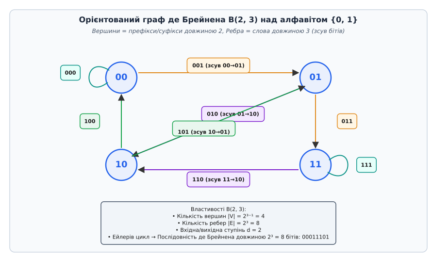
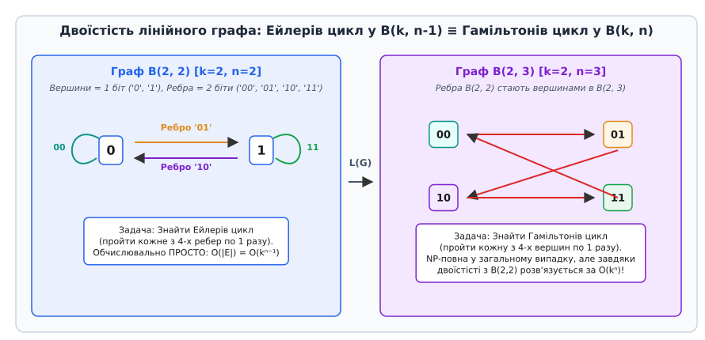
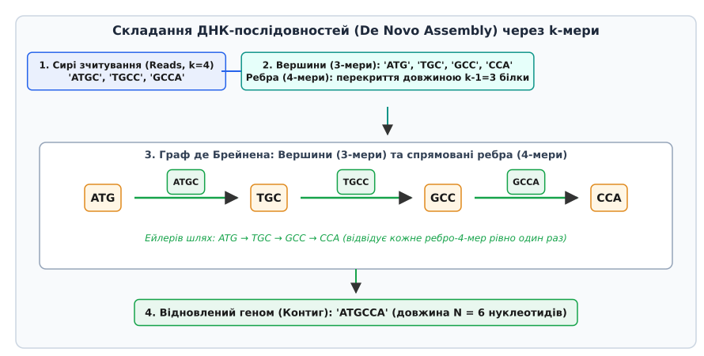
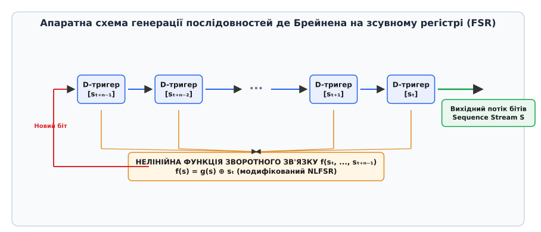

# Граф де Брейнена

<preknowlist>
- [Асимптотична складність](book:algorithms/asymptotic-complexity) — O-нотація, поліноміальний та експоненціальний ріст систем.
- [Матриця суміжності](book:algorithms/adjacency-matrix) — алгебраїчне подання графів, орієнтовані ребра та степені вершин.
- [Гамільтонів цикл](book:algorithms/hamiltonian-cycle) — обхід усіх вершин графа та NP-повнота обчислень.
- [Ейлерів цикл](book:algorithms/eulerian-cycle) — обхід усіх ребер графа та критерії існування циклу.
- [NP-повнота](book:algorithms/np-completeness) — класи складності та поліноміальна зведеність комбінаторних задач.
</preknowlist>

Коли кодовий роторний замок із комбінацією з 4 цифр відкривається прокручуванням циферблата, кожна нова представлена позиція створює нову перевірочну комбінацію за рахунок послідовного зсуву вікна спостереження на один символ. Якщо пробувати всі 10 000 можливих комбінацій введенням окремих 4-значних кодових блоків, доведеться набрати 40 000 цифр. Проте існує замкнена циклічна послідовність довжиною всього 10 000 цифр, яка під час послідовного безперервного прокручування випробовує абсолютно всі 10 000 чотиризначних комбінацій без жодного повтору чи пропуску. Топологічною основою для побудови таких оптимальних послідовностей та опису складних динамічних систем із ковзним вікном спостереження є **граф де Брейнена** (англ. *De Bruijn graph*).

Граф де Брейнена являє собою орієнтований граф, у якому вершини описують стани (префікси та суфікси довжиною `n - 1`), а орієнтовані ребра описують переходи між ними при додаванні нового символу зсуву (слова довжиною `n`). Унікальна топологічна симетрія цього графа перетворює надскладні комбінаторні задачі обходу вершин (які в довільних графах є NP-повними) на прості та елегантні задачі обходу ребер, що розв'язуються за лінійний час `O(|E|)`. Це робить граф де Брейнена центральним інструментом у сучасній біоінформатиці для складання геномів ДНК, у криптографії для проектування зсувних регістрів, а також у міжпроцесорних мережах суперкомп'ютерів.

## 1. Проблема стану та перекриття рядків: від абстракцій до апаратури

У цифрових автоматах, оптичних датчиках кута повороту та системах обробки послідовностей символ за символом стан системи визначається останніми `n - 1` отриманими знаками. Додавання нового символу на правому краї призводить до висування найстаршого символу з лівого краю. 

Розглянемо цей механізм на конкретному прикладі. Нехай поточний стан цифрового вікна описується бітовим рядком `011` (довжина `n - 1 = 3`). При надходженні нового біта `0` найстарший біт `0` зліва випадає за межі вікна, а новий біт додається справа. Новий стан дорівнює `110`. Перехід відбувся за рахунок циклічного зсуву та побітового оновлення:

```
[0] 1 1  ──(додаємо біт 0)──>  1 1 [0]
```

Зв'язок між попереднім станом `011` та наступним станом `110` повністю задається 4-бітним кодовим словом `0110`, де початковий стан `011` є префіксом (перші 3 біти), а новий стан `110` є суфіксом (останні 3 біти). Якщо наступним бітом надійде `1`, то зі стану `110` система перейде у стан `101` через 4-бітне слово `1101`.

Аналогічна фундаментальна проблема виникає в молекулярній біології при спробі відновити вихідний текстовий документ або хромосому ДНК із безлічі хаотичних фрагментів. Якщо ми маємо набір коротких фрагментів довжиною `n` (так званих `n`-мерів), ми можемо сформулювати дві принципово різні математичні моделі для їх об'єднання:

1. **Модель графа перекриття (Overlap Graph / OLC):** Вершинами графа є самі фрагменти (наприклад, зчитані фрагменти ДНК). Орієнтоване ребро проводиться від вершини `A` до вершини `B`, якщо суфікс `A` довжиною `n - 1` збігається з префіксом `B` довжиною `n - 1`. Складання повного рядка вимагає знаходження шляху, який відвідує **кожну вершину графа рівно один раз** — тобто пошуку **Гамільтонового шляху**.
2. **Модель графа де Брейнена (De Bruijn Graph / DBG):** Вершинами графа є коротші підрядки — префікси та суфікси довжиною `n - 1`. Сам вхідний фрагмент довжиною `n` стає **орієнтованим ребром**, що з'єднує свій префікс із суфіксом. Складання повного рядка вимагає знаходження шляху, який проходить через **кожне ребро графа рівно один раз** — тобто пошуку **Ейлерового шляху**.

Різниця між цими двома підходами є фундаментальною з точки зору теорії складності обчислень та обсягу використаних ресурсів.

Розглянемо числовий приклад. Припустімо, ми маємо короткий вихідний рядок ДНК `ATGCCA` і секвенатор згенерував три фрагменти довжиною `n = 4`: `ATGC`, `TGCC`, `GCCA`.

У графі перекриття (Overlap Graph) вершинами є 3 зчитування: `V = {"ATGC", "TGCC", "GCCA"}`.
- Суфікс `TGC` рядка `ATGC` збігається з префіксом `TGC` рядка `TGCC`. Створюємо ребро `ATGC → TGCC`.
- Суфікс `GCC` рядка `TGCC` збігається з префіксом `GCC` рядка `GCCA`. Створюємо ребро `TGCC → GCCA`.
Для знаходження вихідного геному потрібно побудувати шлях `ATGC → TGCC → GCCA`, який відвідує всі 3 вершини. Це є Гамільтоновим шляхом.

У графі де Брейнена (De Bruijn Graph) ми розбиваємо фрагменти довжиною 4 на префікси та суфікси довжиною `n - 1 = 3`. Вершинами є 3-мери: `V = {"ATG", "TGC", "GCC", "CCA"}`.
- Фрагмент `ATGC` стає орієнтованим ребром `ATG → TGC`.
- Фрагмент `TGCC` стає орієнтованим ребром `TGC → GCC`.
- Фрагмент `GCCA` стає орієнтованим ребром `GCC → CCA`.
Для знаходження вихідного геному потрібно побудувати шлях `ATG → TGC → GCC → CCA`, який проходить через усі 3 ребра. Це є Ейлеровим шляхом.

У графі перекриття (Overlap Graph) кількість вершин дорівнює кількості вхідних зчитувань `N`. Для побудови всіх ребер перекриття доводиться порівнювати кожне зчитування з кожним іншим, що вимагає квадратичної кількості операцій `O(N²)`. При обробці сучасних геномних даних, де кількість зчитувань `N` сягає 500 мільйонів, обчислення `N² = 2.5 · 10¹⁷` порівнянь вимагає місяців роботи суперкомп'ютера. Крім того, сама задача пошуку Гамільтонового шляху у довільному графі є NP-повною, і її розв'язання у найгіршому випадку вимагає експоненціального часу `O(2ᴺ · N²)`.

У графі де Брейнена (De Bruijn Graph) кількість вершин обмежена теоретичною кількістю усіх можливих `(n - 1)`-мерів і не перевищує `kⁿ⁻¹`. Побудова графа виконується за один прохід по вхідних даних за лінійний час `O(N · L)`, де `L` — довжина зчитування. А головне — пошук Ейлерового шляху здійснюється за лінійний час `O(|E|)` за допомогою алгоритму Гірхольцера, що дозволяє обробляти гігабайти даних за хвилини на звичайному сервері.

## 2. Формальна топологія графа де Брейнена B(k, n)

Формально орієнтований граф де Брейнена порядку `n` над алфавітом `Σ` потужності `k = |Σ|` позначається як `B(k, n) = (V, E)`.

Параметри графа `B(k, n)` визначаються наступним чином:

1. **Множина вершин `V`:** Усі можливі впорядковані послідовності (слова) довжиною `n - 1` над алфавітом `Σ`. Загальна кількість вершин дорівнює:
```
|V| = kⁿ⁻¹
```
2. **Множина ребер `E`:** Усі можливі слова довжиною `n` над алфавітом `Σ`. Загальна кількість ребер дорівнює:
```
|E| = kⁿ
```
3. **Правило переходу:** Орієнтоване ребро `e = a₁ a₂ ... a♙` спрямоване від вершини-префікса `u = a₁ a₂ ... a♙₋₁` до вершини-суфікса `v = a₂ a₃ ... a♙`.

На рисунку нижче зображено повну топологію орієнтованого графа де Брейнена `B(2, 3)` для двійкового алфавіту `k = 2` та довжини слів `n = 3`.


*Топологія орієнтованого графа де Брейнена B(2, 3) над двійковим алфавітом. Вершинами є 4 двобітові стани {00, 01, 10, 11}, а ребрами — 8 трибітових переходів.*

Проаналізуємо топологічні властивості графа `B(k, n)`:

- **Регулярність вхідних та вихідних ступенів:** З кожної вершини `u = a₁ a₂ ... a♙₋₁` виходить рівно `k` ребер, оскільки новий символ `x ∈ Σ` на правому краї можна вибрати `k` способами (отримуємо ребра `a₁ a₂ ... a♙₋₁ x` до вершин `a₂ ... a♙₋₁ x`). Аналогічно, у кожну вершину `v = a₂ a₃ ... a♙` входить рівно `k` ребер, оскільки попередній вилучений символ `y ∈ Σ` зліва міг бути вибраний `k` способами (ребра `y a₂ ... a♙` з вершин `y a₂ ... a♙₋₁`). Отже, для кожної вершини виконується жорстка рівність:
```
in-degree(u) = out-degree(u) = k
```
- **Балансованість та Ейлеровість:** Оскільки вхідний ступінь кожної вершини дорівнює її вихідному ступеню, а сам граф є сильно зв'язаним, граф `B(k, n)` є **Ейлеровим графом**. Це гарантує існування замкненого Ейлерового циклу, який проходить через кожне ребро рівно один раз.
- **Сильна зв'язність:** З будь-якої вершини `u` можна дістатися до будь-якої іншої вершини `w` щонайбільше за `n - 1` кроків зсуву. Для цього достатньо послідовно подати символи вершини-призначення `w = w₁ w₂ ... w♙₋₁` як вхідні символи зсуву.
- **Логарифмічний діаметр:** Діаметр графа `diam(B(k, n))` дорівнює `n - 1`. Це означає, що у графі з `N = kⁿ⁻¹` вершинами найкоротша відстань між будь-якою парою вузлів становить лише:
```
diam(B(k, n)) = n - 1 = log_k N
```
- **Наявність самопетель (Self-loops):** У графі існує рівно `k` вершин виду `(α, α, ..., α)`, де всі символи однакові. Кожна така вершина має орієнтовану самопетлю, сформовану ребом `(α, α, ..., α)`. Наприклад, у графі `B(2, 3)` вершина `00` має самопетлю `000`, а вершина `11` має самопетлю `111`.

Розглянемо алгебраїчну матрицю суміжності `A` графа `B(k, n)` розмірністю `kⁿ⁻¹ × kⁿ⁻¹`. Елемент `A[i, j] = 1`, якщо з вершини `i` існує орієнтоване ребро до вершини `j`. Оскільки з кожної вершини виходить `k` ребер, сума елементів у кожному рядку дорівнює `k`, і сума у кожному стовпчику дорівнює `k`. 

Найцікавішою властивістю є `n - 1`-а степінь матриці суміжності:

```
Aⁿ⁻¹ = kⁿ⁻² · J
```

де `J` — матриця з усіх одиниць розміром `kⁿ⁻¹ × kⁿ⁻¹`. Ця тотожність означає, що між будь-якими двома вершинами графа існує рівно `kⁿ⁻²` орієнтованих шляхів довжиною `n - 1`. Це доводить ідеальну змішуваність (англ. *mixing time*) та розширювальні властивості графа де Брейнена.

> 🔧 **Навіщо це.**
> У паралельних обчислювальних системах та суперкомп'ютерах зв'язок між тисячами процесорних ядер вимагає побудови топології міжпроцесорної мережі. Топологія графа де Брейнена `B(k, n)` дозволяє об'єднати `N = kⁿ⁻¹` обчислювальних вузлів таким чином, що кожен процесор має фіксовану постійну кількість фізичних портів зв'язку `k` (незалежно від загальної кількості ядер у системі), а максимальна затримка передачі пакета між найвіддаленішими вузлами зростає лише логарифмічно як `O(log_k N)`.

## 3. Двоїстість лінійних графів та зв'язок Ейлерового та Гамільтонового циклів

Глибока математична краса графів де Брейнена полягає в їхній двоїстій природі відносно оператора лінійного графа (англ. *Line Graph*).

Лінійний граф `L(G)` для орієнтованого графа `G = (V, E)` будується шляхом заміни кожного ребра графа `G` на вершину в `L(G)`. Два вузли у `L(G)` з'єднуються орієнтованим ребром тоді й лише тоді, коли відповідні ребра у `G` є послідовними (видане з першого ребра входить у початок другого).

Для графів де Брейнена виконується тотожність:

```
B(k, n) = L( B(k, n - 1) )
```

Граф де Брейнена порядку `n` є точним лінійним графом від графа де Брейнена порядку `n - 1`.


*Двоїстість лінійного графа: Ейлерів цикл у графі B(k, n-1) точно відповідає Гамільтоновому циклу у графі B(k, n).*

Простежимо цей механізм на прикладі переходу від `B(2, 2)` до `B(2, 3)`:
1. Граф `B(2, 2)` має 2 вершини (`0`, `1`) та 4 ребра (`00`, `01`, `10`, `11`).
2. Коли ми будуємо лінійний граф `L(B(2, 2))`, ці 4 ребра стають 4 вершинами (`00`, `01`, `10`, `11`).
3. Ребра у `L(B(2, 2))` описують можливі переходи між суміжними ребрами у `B(2, 2)` — тобто утворюють 8 ребер графа `B(2, 3)`.

Цей зв'язок породжує фундаментальну еквівалентність двох класичних задач теорії графів:

1. **Ейлерів цикл у `B(k, n - 1)`:** Обхід усіх 4 ребер графа `B(k, n - 1)` рівно по одному разу.
2. **Гамільтонів цикл у `B(k, n)`:** Обхід усіх 4 вершин графа `B(k, n)` рівно по одному разу.

Оскільки ребра графа `B(k, n - 1)` є вершинами графа `B(k, n)`, Ейлерів цикл у `B(k, n - 1)` індукує Гамільтонів цикл у `B(k, n)`.

У загальному випадку довільних графів розв'язання задачі Гамільтонового циклу вимагає перебору й належить до класу NP-повних задач. Проте для графів де Брейнена завдяки ізоморфізму `B(k, n) = L(B(k, n - 1))` задачу знаходження Гамільтонового циклу у `B(k, n)` можна звести до знаходження Ейлерового циклу в `B(k, n - 1)`, що виконується за лінійний час `O(kⁿ)` за допомогою алгоритму Гірхольцера.

Розглянемо покроково виконання алгоритму Гірхольцера для обходу графа `B(2, 2)` та знаходження Ейлерового циклу:
- Розпочинаємо з вершини `0`.
- Обираємо ребро `00`, повертаємося у вершину `0`.
- Обираємо ребро `01`, переходимо у вершину `1`.
- З вершини `1` обираємо ребро `11`, повертаємося у вершину `1`.
- З вершини `1` обираємо ребро `10`, повертаємося у початкову вершину `0`.
- Результуючий цикл ребер `00 → 01 → 11 → 10` утворює бітову послідовність `00110` (або `00011101` після розгортання в `B(2, 3)`).

Детальний строгий математичний доказ цієї двоїстісті, спектральні властивості матриці суміжності та точне виведення кількості циклів за теоремою BEST наведено у вставці [Математичні властивості графа де Брейнена](book:algorithms/complexity-computability/de-bruijn-graph/math-debruijn-properties.md).

## 4. Послідовності де Брейнена: мінімальні кодові замки та каскади

Циклічною **послідовністю де Брейнена** `B(k, n)` називається циклічний рядок над алфавітом `Σ` потужності `k`, який має довжину `L = kⁿ` і містить кожен можливий підрядок довжиною `n` як неперервний блок підслів рівно один раз.

Розглянемо бінарний випадок `k = 2` та `n = 3`. Нам потрібно побудувати замкнений бітовий рядок довжиною `2³ = 8` бітів, який містить усі 8 можливих 3-бітових комбінацій: `000`, `001`, `011`, `111`, `110`, `101`, `010`, `100`.

Одна з можливих послідовностей де Брейнена `B(2, 3)` має вигляд:

```
0 0 0 1 1 1 0 1  (замкнена в коло)
```

Перевіримо всі ковзні вікна довжиною 3 під час прокручування по колу:
1. Вікно з позиції 0: `000`
2. Вікно з позиції 1: `001`
3. Вікно з позиції 2: `011`
4. Вікно з позиції 3: `111`
5. Вікно з позиції 4: `110`
6. Вікно з позиції 5: `101`
7. Вікно з позиції 6 (з переходами на початок): `010`
8. Вікно з позиції 7 (з переходами на початок): `100`

Кожна з 8 комбінацій зустрічається рівно один раз. Загальна кількість таких унікальних циклічних послідовностей визначається теоремою BEST та дорівнює:

```
N(k, n) = (k!)^{kⁿ⁻¹} / kⁿ
```

Для `k = 2` ця формула спрощується до:

```
N(2, n) = 2^{2ⁿ⁻¹ - n}
```

Обчислимо кількість варіантів для різних `n`:
- При `n = 3`: `N(2, 3) = 2^{2² - 3} = 2¹ = 2` послідовності (`00011101` та `00010111`).
- При `n = 4`: `N(2, 4) = 2^{2³ - 4} = 2⁴ = 16` унікальних послідовностей.
- При `n = 5`: `N(2, 5) = 2^{2⁴ - 5} = 2¹¹ = 2048` послідовностей.
- При `n = 6`: `N(2, 6) = 2^{2⁵ - 6} = 2²⁶ = 67 108 864` послідовностей.

Стрімке комбінаторне зростання кількості варіантів показує багатство структури графів де Брейнена. 

Практичне застосування послідовностей де Брейнена охоплює кілька важливих інженерних галузей:

1. **Оптичні інкодери та датчики положення роботів:** На диск або лінійку датчика наноситься бітова послідовність де Брейнена. Оптичний зчитувач із `n` фотодіодами вимірює поточне вікно з `n` бітів. Завдяки унікальності кожного `n`-мера система миттєво визначає абсолютний кут повороту вала робота без необхідності початкового повернення у «нульову позицію» (англ. *homing*). На відміну від коду Ґрея, який вимагає `n` окремих доріжок, кодування де Брейнена потребує лише одної доріжки із `n` зчитачами.
2. **Безключові роторні замки:** Роторний код довжиною `kⁿ` дозволяє випробувати всі комбінації замка за `kⁿ` кроків введення замість `n · kⁿ`, скорочуючи час розблокування у `n` разів.
3. **Карткові фокуси та магія:** Ілюзіоністи використовують колоди карт, укладені у порядку послідовності де Брейнена. Знявши 3-4 карти, фокусник за значенням їхніх козирів точно називає позицію в колоді та наступну карту.

Детальний історичний огляд відкриття цих послідовностей — від фокусів із картами Каміля Флє Сент-Марі у 1894 році до робіт де Брейнена та Ґуда 1946 року — висвітлено у вставці [Історія відкриття графа де Брейнена](book:algorithms/complexity-computability/de-bruijn-graph/hist-debruijn-sequences.md).

## 5. Революція в біоінформатиці: De Novo складання геномів

Найважливішим практичним застосуванням графів де Брейнена у XXI столітті стало складання геномів ДНК без наявності референсного шаблону (англ. *De Novo Genome Assembly*).

Молекула ДНК складається з двох комплементарних ланцюгів, утворених чотирма нуклеотидними основами: Аденін (`A`), Цитозин (`C`), Гуанін (`G`) та Тимін (`T`). Геном людини містить близько 3 мільярдів таких пар основ. Сучасні секвенатори нового покоління (Next-Generation Sequencing, NGS, зокрема прилади Illumina) не зчитують хромосому цілком, а розбивають її на мільйони коротких випадкових фрагментів (зчитувань, англ. *reads*) довжиною 100–150 нуклеотидів.


*Пайплайн складання геному De Novo. Сирі зчитування розбиваються на k-мери, будується граф де Брейнена, після чого Ейлерів шлях відновлює вихідну послідовність нуклеотидів.*

Процес складання геному на основі графа де Брейнена складається з шести послідовних етапів:

1. **K-мерізація (K-mer Extraction):** Кожне вхідне зчитування довжиною `L` розбивається ковзним вікном на `(L - k + 1)` підрядків фіксованої довжини `k` (де `k` зазвичай обирається в діапазоні від 21 до 55).
2. **Побудова графа де Брейнена:**
   - Кожен `(k-1)`-мер додається як вершина графа.
   - Кожен `k`-мер додається як спрямоване ребро між своїм префіксом `(k-1)` та суфіксом `(k-1)`.
3. **Фільтрація шумових ребер (Coverage Filtering):** Помилки секвенування створюють поодинокі `k`-мери з низькою частотою повторів (`coverage = 1`). Фільтр вилучає ребра, покриття яких нижче за поріг.
4. **Зрізання тупиків (Tip Clipping):** Помилки на кінцях зчитувань створюють тупикові гілки (англ. *tips*). Алгоритм знаходить і видаляє всі короткі шляхи, які закінчуються вершинами із вихідним ступенем 0.
5. **Схлопування бульбашок (Bubble Popping):** Гетерозиготні мутації та внутрішні помилки розщеплюють шлях на дві паралельні гілки, які згодом знову зливаються (англ. *bubbles*). Алгоритм порівнює альтернативні шляхи й залишає гілку з більшим покриттям.
6. **Стиснення юнітігів (Unitig Compaction) та Ейлерів обхід:** Нерозгалужені ланцюжки вершин об'єднуються у довгі узагальнені ребра (юнітіґи), після чого алгоритм Гірхольцера будує Ейлерів шлях, який відновлює неперервні ділянки хромосоми (контиги).

Сучасні біоінформатичні комплекси (такі як SPAdes, Velvet, MEGAHIT, SOAPdenovo) застосовують мульти-k-мерні підходи (англ. *multi-k assembly*), послідовно будуючи графи де Брейнена для кількох значень `k` (наприклад, `k = 21, 33, 55`). Це дозволяє спочатку надійно з'єднати розриви у покритті при малій довжині `k`, а потім розплутати складні повтори ДНК при великій довжині `k`.

Крім того, у гібридному складанні геномів (англ. *Hybrid Assembly*) графи де Брейнена поєднують переваги двох технологій: точні короткі зчитування Illumina (для побудови графа) та довгі неточні зчитування Oxford Nanopore / PacBio (для розплутування довгих повторів між юнітіґами).

Крім того, у сучасній метагеноміці та пан-геноміці застосовуються **хроматичні (кольорові) графи де Брейнена** (англ. *Colored De Bruijn Graphs*). У цих графах кожне ребро маркується вектором кольорів, де кожен колір відповідає окремому біологічному зразку чи індивіду. Це дозволяє порівнювати тисячі геномів одночасно, знаходячи спільні консервативні ділянки та унікальні мутації без необхідності окремого складання геному для кожного індивіда.

У метагеномних дослідженнях (аналіз мікробіому кишечника або ґрунту) в одному зразку знаходяться сотні видів бактерій із різною абсолютною концентрацією. Граф де Брейнена розбиває вхідну суміш на окремі зважені контиги, а оцінка покриття вершин (`coverage`) дозволяє відокремити геноми домінуючих бактерій від рідкісних видів мікроорганізмів.

Детальний опис бітових структур даних для зберігання мільйонів `k`-мерів, двобітового кодування нуклеотидів та програмного інтерфейсу розшифровано у вставці [Інтерфейс та кодування графа](book:algorithms/complexity-computability/de-bruijn-graph/api-debruijn-graph.md).

## 6. Апаратні зсувні регісті та мережеві топології

Поза межами біології графи де Брейнена є апаратною основою для побудови генераторів псевдовипадкових чисел та потокових шифрів на основі зсувних регістрів зі зворотним зв'язком.

Зсувний регістр із нелінійним зворотним зв'язком (Non-linear Feedback Shift Register, NLFSR) складається з каскаду `n` послідовно з'єднаних D-тригерів, які зберігають біти `s_t, s_{t+1}, ..., s_{t+n-1}`. На кожному такті системного годинника вміст комірок зсувається праворуч, а в першу комірку записується значення нелінійної функції зворотного зв'язку `f(s_t, ..., s_{t+n-1})`.


*Апаратна схема зсувного регістра (FSR) для генерації псевдовипадкових послідовностей де Брейнена у потокових шифрах.*

Якщо функція зворотного зв'язку `f` підібрана так, що послідовність станів регістра описує Ейлерів цикл у графі де Брейнена `B(2, n)`, то вихідний потік бітів утворює послідовність де Брейнена максимального періоду `2ⁿ`. Подібні схеми широко використовуються в криптографічних мікросхема, автокодингу RFID-міток та потокових шифрах (наприклад, Grain та Trivium).

У розподілених мережевих системах та Peer-to-Peer (P2P) хеш-таблицях (DHT, наприклад, у протоколі Koorde) орієнтований граф де Брейнена використовується для побудови системи маршрутизації повідомлень. Кожен вузол мережі отримує бітовий ідентифікатор довжиною `n - 1`. Маршрутизація запиту до будь-якого іншого вузла здійснюється за `O(log N)` стрибків шляхом послідовного зсуву бітів адреси призначення, при цьому кожен вузол зберігає інформацію лише про `k` сусідніх вузлів у своїй локальній таблиці маршрутизації.

У випадку відмови одного з вузлів мережі або обриву зв'язку (англ. *node failure*), альтернативний шлях обходу обчислюється за декілька побітових операцій завдяки наявності `k` паралельних входів та виходів у кожній вершині.

Алгоритмічну реалізацію побудови графа де Брейнена та пошуку Ейлерових циклів мовами C та C++ наведено у вставці [Реалізація генератора та збирача](book:algorithms/complexity-computability/de-bruijn-graph/proj-debruijn-generator.md).

## 7. Алгебраїчна криптографія та квантові системи

У сучасній криптографії послідовності де Брейнена досліджуються з точки зору їхньої лінійної складності (англ. *Linear Complexity*). Лінійна складність послідовності `S` — це довжина найкоротшого лінійного зсувного регістра (LFSR), спроможного згенерувати цю послідовність. 

За алгоритмом Берлекампа — Мессі (Berlekamp-Massey Algorithm), якщо криптоаналітик перехопить `2L` послідовних бітів із лінійного регістра довжиною `L`, він зможе повністю відновити функцію зворотного зв'язку та передбачити всі наступні біти. Для звичайних LFSR лінійна складність є малою, що робить їх непридатними для криптографії.

На противагу цьому, послідовності де Брейнена, згенеровані нелінійними регістрами (NLFSR), володіють **максимально можливою лінійною складністю**:

```
L(S) ≈ 2ⁿ⁻¹
```

Це означає, що для взлому потокового шифру криптоаналітику знадобиться перехопити експоненціально велику кількість бітів `2ⁿ⁻¹`, що робить атаки відновлення ключа практично нездійсненними.

У квантових обчисленнях та квантовій теорії інформації орієнтовані графи де Брейнена застосовуються для моделювання випадкових квантових блукань (англ. *Quantum Random Walks*) та проектування квантових кодувальних схем. Завдяки спектральному розщепленню власних значень матриці суміжності quantum walk на графі де Брейнена забезпечує квадратичне прискорення пошуку станів порівняно з класичними блуканнями.

## 8. Математичні узагальнення: графи Котца та зсувні сімейства

У теорії графів граф де Брейнена слугує основою для цілого сімейства узагальнених орієнтованих графів:

1. **Графи Котца (Kautz Graphs) `K(k, n)`:** За своєю будовою подібні до графів де Брейнена, але з жорстким обмеженням, що суміжні символи у кожному слові не можуть бути однаковими (`a_i ≠ a_{i+1}`). Вони містять `k · (k - 1)ⁿ⁻¹` вершин і мають дещо менший діаметр при тій самій кількості вузлів, що робить їх популярними у міжпроцесорних мережах без самопетель.
2. **Узагальнені графи де Брейнена (Generalized De Bruijn Graphs) `GB(N, d)`:** Розширення графа де Брейнена на довільну кількість вершин `N`. Вершина з номером `i` (`0 ≤ i < N`) має орієнтовані ребра до `d` вершин із номерами `(d · i + j) mod N`, де `0 ≤ j < d`. Вони зберігають регуляторність та низький діаметр для довільного розміру мережі.
3. **Просторово спарені LDPC-коди (Spatially Coupled LDPC Codes):** У сучасній теорії кодування графи де Брейнена використовуються для конструювання перевірочних матриць завадостійких кодів, які досягають теоретичної межі пропускної здатності Шеннона при декодуванні розповсюдженням довіри (англ. *belief propagation*).

## 9. Порівняльний аналіз та обчислювальні межі

Вибір параметрів графа де Брейнена завжди вимагає компромісу між обчислювальною складністю, витратами пам'яті та точністю обхідного шляху.

У таблиці нижче порівнюються дві фундаментальні парадигми складання послідовностей: класичний граф перекриття (OLC) та граф де Брейнена (DBG).

| Параметр порівняння | Граф перекриття (Overlap Graph / OLC) | Граф де Брейнена (De Bruijn Graph / DBG) |
| :--- | :--- | :--- |
| **Елементи вершин (Vertices)** | Цілі зчитування (Reads довжиною `L`). | Короткі `(k-1)`-мери (фіксована довжина `k-1`). |
| **Елементи ребер (Edges)** | Перекриття між зчитуваннями. | Короткі `k`-мери з вхідних зчитувань. |
| **Цільова алгоритмічна задача** | Пошук **Гамільтонового шляху** (NP-повна). | Пошук **Ейлерового шляху** (Лінійна `O(\|E\|)`). |
| **Часова складність побудови** | `O(N² · L)` — квадратична від кількості зчитувань `N`. | `O(N · L)` — строго лінійна від кількості зчитувань. |
| **Вплив повторів у геномі** | Стійкий до довгих повторів, якщо `L > len(repeat)`. | Чутливий до повторів, якщо `k < len(repeat)`. |
| **Втрата контексту зчитувань** | Ні (зчитування зберігається цілком). | Так (зчитування розбивається на фрагменти `k`). |
| **Основна галузь застосування** | Довгі зчитування (PacBio, Oxford Nanopore, `L > 10 000`). | Короткі зчитування (Illumina NGS, `L = 100 - 150`). |

Критичним фактором для графа де Брейнена є вибір розміру `k`:
- **Занадто мале `k` (наприклад, `k = 15`):** Граф стає надзвичайно щільним із високим ступенем розгалуження вершин. Багато геномних повторів виявляються довшими за `k`, що призводить до заплутування графа у «складний вузол» із тисячами хибних альтернативних циклів.
- **Занадто велике `k` (наприклад, `k = 95` при довжині зчитування `L = 100`):** Граф стає вкрай розрідженим. Будь-яка поодинока помилка секвенування знищує всі `k`-мери, що містять помилковий нуклеотид, розділяючи граф на безліч незв'язаних фрагментів.

Таким чином, граф де Брейнена являє собою унікальну комбінаторну структуру, яка поєднує математичну двоїстість лінійних графів, абстрактну теорію зсувних регістрів та високоефективні біоінформатичні алгоритми, роблячи можливим опрацювання велетенських масивів даних цифрового світу.
