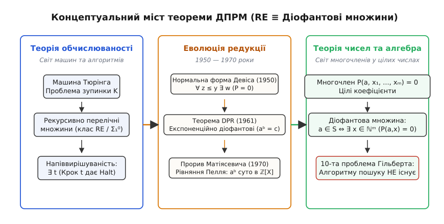
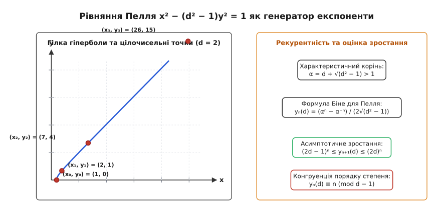

# Діофантові множини та теорема ДПРМ

<preknowlist>
- [Проблема зупинки](book:algorithms/halting-problem)
- [Рекурсивно зліченні множини](book:algorithms/recursively-enumerable-sets)
- [Арифметика Пеано](book:algorithms/peano-arithmetic)
- [Теореми Геделя про неповноту](book:math/godel-incompleteness)
</preknowlist>

У серпні 1900 року на II Міжнародному конгресі математиків у Парижі Давид Гільберт представив епохальну доповідь, що визначила вектор розвитку математики на все наступне століття. Серед двадцяти трьох невирішених проблем під номером десять стояла задача про розв'язність довільних алгебраїчних рівнянь у цілих числах. Гільберт сформулював її гранично чітко: «Нехай задано діофантове рівняння з довільною кількістю невідомих і з цілими раціональними числовими коефіцієнтами: потрібно вказати спосіб, за допомогою якого за допомогою скінченної кількості операцій можна вирішити, чи є рівняння розв'язним у цілих раціональних числах».

На той момент математична спільнота була сповнена оптимізму. Для лінійних рівнянь алгоритм був відомий ще з античності завдяки розширеному алгоритму Евкліда. Для бінарних квадратичних форм Жозеф-Луї Лагранж та Карл Фрідріх Гаусс розробили повну конструктивну теорію редукції. Здавалося, що створення загального обчислювального методу для рівнянь довільного степеня є лише питанням часу та винахідливості.

Особливий драматизм десятої проблеми полягав у тому, що майже вся історія теорії чисел будувалася навколо окремих діофантових рівнянь. Знаменита Велика теорема Ферма (`xⁿ + yⁿ = zⁿ`), рівняння Пелля (`x² − d·y² = 1`), рівняння Маркова (`x² + y² + z² = 3·x·y·z`) та пошук цілих точок на еліптичних кривих Морделла (`y² = x³ + a·x + b`) століттями стимулювали розвиток алгебри, теорії ідеалів та алгебраїчної геометрії. Математики сподівалися, що єдиний алгоритмічний метод дозволить автоматично вирішувати всі подібні проблеми.

Пошук такого універсального алгоритму тривав рівно сімдесят років і завершився несподіваним тріумфом теоретичної інформатики над класичною алгеброю. У 1970 році було остаточно доведено, що шуканого алгоритму Гільберта не існує в принципі. 

Цей фундаментальний результат увійшов в історію науки як **теорема ДПРМ** (DPRM Theorem — за прізвищами чотирьох її авторів: Мартіна Девіса, Гіларі Патнама, Джулії Робінсон та Юрія Матіясевича). Вона встановила дивовижний міст між дискретною теорією обчислюваності та неперервною алгебраїчною геометрією: **множина є діофантовою тоді й лише тоді, коли вона є рекурсивно зліченною**.

---

## 1. Анатомія діофантових рівнянь та діофантових множин

Діофантовим рівнянням називають алгебраїчне рівняння вигляду:
```
P(x₁, x₂, ..., xₙ) = 0
```
де `P` — многочлен із цілими коефіцієнтами від змінних `x₁, ..., xₙ`, причому розв'язки шукаються виключно в множині цілих чисел `ℤ` (або в множині невід'ємних цілих чисел `ℕ₀ = {0, 1, 2, ...}`).

Назва походить від імені античного математика Діофанта Александрійського (III ст. н. е.), автора знаменитої «Арифметики», де вперше систематично розглядалися задачі пошуку раціональних та цілих розв'язків алгебраїчних систем.

### Класифікація за розмірністю та степенем
У класичній алгебраїчній геометрії розв'язність суттєво залежить від геометричного роду кривої `g` та кількості змінних:
1. **Рівняння від однієї змінної `P(x) = 0`**: алгоритмічно тривіальні, оскільки будь-який цілий корінь многочлена `a_n·xⁿ + ... + a₀ = 0` обов'язково є дільником вільного члена `a₀`. Достатньо перевірити скінченну кількість дільників.
2. **Алгебраїчні криві (дві змінні `P(x, y) = 0`)**:
   - Для кривих роду `g = 0` (прямі, конічні перетини) розв'язок дається явною раціональною параметризацією.
   - Для кривих роду `g = 1` (еліптичні криві) теорема Морделла-Вейля гарантує, що група раціональних точок є скінченно породженою абелевою групою, а теорема Зігеля доводить скінченність множини цілих точок. Метод Бейкера над логарифмами алгебраїчних чисел дає ефективні верхні оцінки на розмір цілих розв'язків.
   - Для кривих роду `g ≥ 2` видатна теорема Фальтінгса (1983) стверджує, що множина раціональних точок є завжди скінченною.
3. **Многовиди від багатьох змінних `n ≥ 9`**: саме тут геометричні методи натрапляють на принциповий обчислювальний бар'єр, оскільки простір змінних стає достатньо багатим для кодування довільних машинних станів.

### Еквівалентність розв'язків над ℤ та над ℕ₀
У теорії алгоритмів та математичній логіці вибір між цілими числами `ℤ` та невід'ємними цілими числами `ℕ₀` є суто питанням технічної зручності. Ці дві постановки є алгоритмічно еквівалентними:
1. **Зведення від `ℕ₀` до `ℤ`**: за фундаментальною теоремою Лагранжа про чотири квадрати довільне невід'ємне число `x ≥ 0` завжди і тільки тоді подається як сума чотирьох квадратів цілих чисел:
   ```
   x = u₁² + u₂² + u₃² + u₄²,   де u_i ∈ ℤ
   ```
   Тому будь-яке рівняння над `ℕ₀` від `n` змінних перетворюється на еквівалентне рівняння над `ℤ` від `4·n` змінних заміною кожної невід'ємної змінної `x_i` на відповідну суму чотирьох квадратів.
2. **Зведення від `ℤ` до `ℕ₀`**: кожне ціле число `x ∈ ℤ` однозначно записується як різниця двох невід'ємних чисел `x = p − q`, де `p, q ∈ ℕ₀`. Підстановка цієї різниці перетворює рівняння над цілими числами на рівняння над натуральними числами з подвоєною кількістю змінних.

### Формальне означення діофантової множини
Нехай задано підмножину `S ⊆ ℕᵐ`. Множина `S` називається **діофантовою**, якщо існує многочлен `P(a₁, ..., aₘ, x₁, ..., xₙ)` із цілими коефіцієнтами такий, що вектор параметрів `(a₁, ..., aₘ)` належить множині `S` тоді й лише тоді, коли існують такі невід'ємні цілі числа `(x₁, ..., xₙ)`, за яких многочлен перетворюється на нуль:
```
(a₁, ..., aₘ) ∈ S  ⟺  ∃ x₁ ∃ x₂ ... ∃ xₙ  ( P(a₁, ..., aₘ, x₁, ..., xₙ) = 0 )
```
Змінні `a₁, ..., aₘ` називаються **вільними змінними** (параметрами), а змінні `x₁, ..., xₙ` — **екзистенційними** (зв'язаними квантором існування `∃`).

Геометрично це означає, що діофантова множина `S` є **проєкцією** цілочисельної множини коренів алгебраїчного многовиду в просторі вищої розмірності `ℕᵐ⁺ⁿ` на підпростір параметрів розмірності `ℕᵐ`.

### Базові діофантові предикати та відношення
Низка фундаментальних арифметичних понять природно виражається мовою діофантових предикатів:
- **Множина парних чисел**: `a ∈ Even ⟺ ∃ x (a − 2·x = 0)`.
- **Множина непарних чисел**: `a ∈ Odd ⟺ ∃ x (a − 2·x − 1 = 0)`.
- **Множина складених чисел**: `a ∈ Composite ⟺ ∃ x ∃ y (a − (x + 2)·(y + 2) = 0)`.
- **Відношення нерівності `a ≤ b`**: `a ≤ b ⟺ ∃ k (b − a − k = 0)`.
- **Відношення строгої нерівності `a < b`**: `a < b ⟺ ∃ k (b − a − k − 1 = 0)`.
- **Відношення подільності `a | b`** (для `a > 0`): `a | b ⟺ ∃ q (b − a·q = 0)`.
- **Залишок від ділення `a mod m = r`**: 
  ```
  ∃ q ∃ k ( (a − q·m − r = 0) ∧ (m − r − 1 − k = 0) )
  ```

---

## 2. Алгебраїзація логічних операцій

Мова многочленів із першого погляду виглядає занадто бідною для вираження складної логіки: у ній відсутні логічні зв'язки «І», «АБО», «НЕ», а також квантори загальності «ДЛЯ ВСІХ». Проте завдяки алгебраїчним властивостям кільця цілих чисел будь-яку скінченну формулу числення предикатів першого порядку з кванторами існування можна еквівалентно транслювати в єдине поліноміальне рівняння.

### Кон'юнкція (Логічне І: A = 0 ∧ B = 0)
Оскільки квадрат будь-якого дійсного числа є невід'ємним (`u² ≥ 0`), сума квадратів цілих виразів дорівнює нулю тоді й лише тоді, коли кожен доданок одночасно дорівнює нулю:
```
(A = 0) ∧ (B = 0)  ⟺  A² + B² = 0
```
Для довільної скінченної системи з `k` рівнянь кон'юнкція усувається об'єднанням у суму квадратів:
```
P₁ = 0  ∧  P₂ = 0  ∧ ... ∧  P_k = 0  ⟺  ∑_{i=1}^k P_i² = 0
```

### Диз'юнкція (Логічне АБО: A = 0 ∨ B = 0)
Кільце цілих чисел `ℤ` є областю цілісності (в ньому відсутні дільники нуля). Добуток двох цілих чисел дорівнює нулю тоді й лише тоді, коли хоча б один із множників дорівнює нулю:
```
(A = 0) ∨ (B = 0)  ⟺  A · B = 0
```

### Об'єднання та винесення кванторів існування
Квантори існування комутують як між собою, так і з логічними зв'язками кон'юнкції та диз'юнкції:
```
(∃ x P(x) = 0) ∧ (∃ y Q(y) = 0)  ⟺  ∃ x ∃ y ( (P(x))² + (Q(y))² = 0 )
(∃ x P(x) = 0) ∨ (∃ y Q(y) = 0)  ⟺  ∃ x ∃ y ( P(x) · Q(y) = 0 )
```
Завдяки цьому префіксна нормальна форма будь-якої комбінації діофантових предикатів зводиться до єдиного блоку кванторів існування на початку та єдиного многочлена в тілі виразу.

Повний опис програмного каркаса для автоматичної побудови таких AST-дерев, оптимізації та зведення наведено у вставці [Специфікація API діофантового синтаксичного конструктора](book:algorithms/diophantine-sets-dprm/api-diophantine-builder.md).

---

## 3. Теорема ДПРМ та обчислювальна еквівалентність

Головний результат сучасної теорії діофантових множин встановлює точну еквівалентність між алгебраїчним світом поліномів та алгоритмічним світом машин Тюрінга.

Нагадаємо, що множина `S ⊆ ℕ` називається **рекурсивно зліченною** (recursively enumerable, r.e.), або **обчислювано зліченною**, якщо існує алгоритм (машина Тюрінга), який для будь-якого вхідного числа `x` зупиняється тоді й лише тоді, коли `x ∈ S`. Якщо `x ∉ S`, машина або явно відхиляє вхід, або зациклюється на нескінченний час. В арифметичній ієрархії Кліні цей клас позначається як `Σ₁`.

> **Теорема ДПРМ (Критерій діофантовості)**:  
> Підмножина `S ⊆ ℕᵐ` є діофантовою тоді й тільки тоді, коли вона є рекурсивно зліченною:
> ```
> S ∈ Diophantine  ⟺  S ∈ Σ₁ (Recursively Enumerable)
> ```


*Співвідношення між арифметичною ієрархією, рекурсивно зліченними множинами та діофантовими предикатами.*

Історичний шлях створення цього фундаментального результату від перших гіпотез Еміля Поста до доведення 1970 року докладно описано у вставці [Хронологія та персоналії доведення теореми ДПРМ](book:algorithms/diophantine-sets-dprm/hist-dprm-chronology.md).

### Доведення нерозв'язності 10-ї проблеми Гільберта
Нерозв'язність десятої проблеми Гільберта випливає з теореми ДПРМ за один крок через редукцію класичної проблеми зупинки Алана Тюрінга:

1. Нехай `K` — діагональна мова проблеми зупинки (множина кодів таких машин Тюрінга `e`, які зупиняються на власному коді `e`):
   ```
   K = { e ∈ ℕ : M_e(e) \text{ зупиняється} }
   ```
2. Відомо, що множина `K` є рекурсивно зліченною, але **алгоритмічно нерозв'язною** (не є рекурсивною). Жоден алгоритм не здатен для довільного `e` відповісти «так» або «ні» щодо належності `e ∈ K`.
3. За теоремою ДПРМ множина `K` є діофантовою. Отже, існує конкретний фіксований многочлен `P_K(e, x₁, ..., xₙ)` із цілими коефіцієнтами такий, що:
   ```
   e ∈ K  ⟺  ∃ x₁ ∃ x₂ ... ∃ xₙ ( P_K(e, x₁, ..., xₙ) = 0 )
   ```
4. Припустимо від супротивного, що існує алгоритм Гільберта `Alg_H10`, який вирішує розв'язність довільного діофантового рівняння.
5. Тоді для перевірки зупинки машини `M_e(e)` достатньо передати многочлен `P_K(e, x₁, ..., xₙ)` з фіксованим параметром `e` на вхід алгоритму `Alg_H10`. Якщо алгоритм повертає «розв'язок існує», то `e ∈ K`; якщо «розв'язку немає», то `e ∉ K`.
6. Це дало б алгоритм розв'язання проблеми зупинки Тюрінга, що суперечить теоремі про нерозв'язність проблеми зупинки.

Отже, **загального алгоритму розв'язання діофантових рівнянь не існує**.

---

## 4. Канонічна форма Девіса та бар'єр квантора загальності

У 1950 році Мартін Девіс зробив перший вирішальний теоретичний крок. Він довів, що будь-яку рекурсивно зліченну множину можна записати у так званій **нормальній формі Девіса**:
```
a ∈ S  ⟺  ∃ z ∀ y ≤ z ∃ x₁ ... ∃ x_k ( P(a, z, y, x₁, ..., x_k) = 0 )
```
У цій формулі використовується лише **один-єдиний обмежений квантор загальності** `∀ y ≤ z` («для всіх цілих `y` від `0` до `z` включно»), а решта кванторів є звичайними екзистенційними кванторами існування `∃`.

### Чому скінченна кон'юнкція не працює напряму
Пряма спроба замінити обмежений квантор скінченною сумою квадратів:
```
P(a, z, 0, x(0))² + P(a, z, 1, x(1))² + ... + P(a, z, z, x(z))² = 0
```
є принципово неможливою в рамках мови діофантових рівнянь. Кількість доданків та кількість невідомих векторів `x(0), ..., x(z)` тут залежить від значення змінної `z`. Многочлен же зобов'язаний мати наперед фіксовану скінченну структуру та сталу кількість доданків незалежно від значень вхідних параметрів.

### Механізм кодування послідовностей (β-функція Геделя)
Щоб виразити умову «існує набір векторів `x(0), x(1), ..., x(z)`», потрібно закодувати скінченну послідовність чисел фіксованим набором цілих параметрів.

Курт Гедель у своєму доведенні неповноти 1931 року розв'язав цю задачу за допомогою **`β`-функції Геделя**, заснованої на китайській теоремі про залишки:
```
β(u, v, i) = u mod (1 + (i + 1) · v)
```
Якщо обрати `v = (max_i x_i + z + 1)!`, то всі числа `m_i = 1 + (i + 1)·v` для `i = 0, ..., z` будуть попарно взаємно простими, що дозволяє знайти єдине число `u`, яке одночасно кодує всі елементи послідовності `x(0), ..., x(z)` через залишки від ділення `u mod m_i`.

Однак тут виникає фундаментальна перешкода: визначення числа `v` вимагає операції **факторіала** або **піднесення до степеня**, які ростуть експоненційно. У 1950 році ніхто не знав, чи можна виразити експоненту діофантовим многочленом.

---

## 5. Експоненційний стрибок та гіпотеза Джулії Робінсон

У 1952 році Джулія Робінсон опублікувала фундаментальну роботу, в якій досліджувала зв'язок між піднесенням до степеня та діофантовістю. Вона довела, що якщо вдасться побудувати хоча б одне діофантове відношення двох змінних `J(u, v)` з **експоненційним темпом зростання**, тобто таке, що:
1. Для всіх `(u, v) ∈ J` виконується `v ≤ uᵘ`;
2. Для будь-якого фіксованого `k ≥ 1` існують такі пари `(u, v) ∈ J`, що `v > uᵏ`,
то піднесення до степеня `a = bᶜ`, факторіал `a = b!`, біноміальний коефіцієнт `C(n, k)` та обмежений квантор Девіса `∀ y ≤ z` автоматично стають діофантовими!

Робінсон звела всю проблему елімінації кванторів до пошуку єдиного експоненційного діофантового предиката.


*Експоненційне розрідження дискретних розв'язків рівняння Пелля на гіперболічних кривих.*

### Розв'язок Матіясевича через рівняння Пелля
Майже два десятиліття гіпотеза Робінсон залишалася відкритою. У лютому 1970 року 22-річний ленінградський математик Юрій Матіясевич знайшов шукане відношення, використавши властивості розв'язків **рівняння Пелля**:
```
x² − (d² − 1) · y² = 1   (при d > 1)
```
Цілочисельні розв'язки цього рівняння генеруються степенями фундаментальної одиниці в квадратичному розширенні `ℤ[√(d² − 1)]`:
```
x_n(d) + y_n(d) · √(d² − 1) = ( d + √(d² − 1) )ⁿ
```
Послідовність `y_n(d)` задовольняє лінійне рекурентне співвідношення другого порядку:
```
y₀(d) = 0,   y₁(d) = 1,   y_{n+1}(d) = 2·d · y_n(d) − y_{n-1}(d)
```
Темп зростання величини `y_n(d)` є строго експоненційним:
```
(2·d − 1)ⁿ⁻¹ ≤ y_n(d) ≤ (2·d)ⁿ⁻¹
```
Матіясевич побудував систему з 10 діофантових рівнянь, яка зв'язувала змінні `u, v` так, що рівність `v = y_u(d)` задавалася суто поліноміальними умовами над цілими числами без явного піднесення до степеня. 

Це замкнуло останню відсутню ланку в доведенні теореми ДПРМ. Повний математичний вивід послідовностей Пелля, матричної форми розв'язків та лем про подільність наведено у вставці [Послідовності Пелля та елімінація кванторів](book:algorithms/diophantine-sets-dprm/math-pell-exponential.md).

---

## 6. Універсальні діофантові рівняння

Одним із найбільш разючих наслідків теореми ДПРМ є існування **універсальних діофантових рівнянь**.

В теорії алгоритмів існує універсальна машина Тюрінга `U`, яка приймає на вхід номер довільної іншої машини Тюрінга `e` та її вхід `x`, після чого повністю симулює обчислення `M_e(x)`. За теоремою ДПРМ для мови зупинки універсальної машини існує єдиний універсальний многочлен:
```
U_poly(e, x, y₁, y₂, ..., y_m) = 0
```
Це означає, що **одне-єдине фіксоване многочленне рівняння кодує в собі абсолютно всі можливі обчислення у Всесвіті**:
- Якщо зафіксувати `e` як код програми, що перевіряє справедливість великої теореми Ферма, розв'язність рівняння `U_poly(e_Fermat, x, y) = 0` визначає істинність теореми Ферма.
- Якщо зафіксувати `e` як код програми, що шукає нетривіальні нулі дзета-функції Рімана поза критичною прямою, розв'язність цього ж многочлена рівносильна справедливості гіпотези Рімана.
- Якщо зафіксувати `e` як код пошуку контрприкладу до гіпотези Гольдбаха, наявність розв'язку визначає долю гіпотези Гольдбаха.

Будь-яка проблема математики, яку можна сформулювати як питання про зупинку алгоритму (тобто твердження класу `Π₁`), рівносильна питанню про існування цілих коренів у цьому єдиному поліномі.

### Архітектура універсального полінома
Побудова універсального многочлена спирається на пряме алгебраїчне кодування виконання 2-регістрової машини Мінського:
1. **Змінні траси**: для кожного такту часу `t ∈ {0, ..., T}` вводяться змінні стану `q_{s, t} ∈ {0, 1}` та значення регістрів `r_{0, t}, r_{1, t}`.
2. **Перехідні многочлени**: кожна машинна команда транслюється в поліноміальний інваріант:
   - Інкремент `INC(r)`: `(r_{t+1} − r_t − 1)² = 0`.
   - Декремент з переходом за нулем `DEC_JZ(r, target)`:
     ```
     (q_{s, t} · r_t · (r_{t+1} − r_t + 1))² + (q_{s, t} · (1 − r_t) · (q_{target, t+1} − 1))² = 0
     ```
3. **Глобальне зведення**: сума квадратів усіх перехідних рівнянь для всіх кроків `t = 0, ..., T` формує єдине рівняння, що має цілочисельний розв'язок тоді й лише тоді, коли програма досягає термінального стану `q_{halt, T} = 1`.

### Межі за кількістю змінних та степенем
Після 1970 року розгорнулися дослідження з мінімізації розмірності універсальних многочленів:
- **Степінь 4 є універсальним**: будь-яке діофантове рівняння довільного високого степеня можна звести до еквівалентного рівняння степеня не вище 4. Для цього достатньо розбити складні добутки на ланцюжки квадратичних замін виду `w = u · v`, що додає нові змінні, але знижує загальний степінь системи.
- **9 змінних достатньо**: Юрій Матіясевич та Джеймс Джонс довели, що для нерозв'язності достатньо діофантового рівняння лише з **9 невід'ємними змінними** (хоча його степінь є астрономічно великим — порядку `10⁴⁵`).
- **Компроміс між степенем і змінними**: для степеня 4 мінімальна відома кількість змінних становить 58.

---

## 7. Генератори простих чисел: поліном Джонса-Сато-Вади-Вієнса

Оскільки множина простих чисел `Primes = {2, 3, 5, 7, 11, ...}` є рекурсивно зліченною, за теоремою ДПРМ вона є **діофантовою**.

З цього випливає вражаючий наслідок: існує многочлен із цілими коефіцієнтами, **множина додатних значень якого при натуральних аргументах у точності збігається з множиною всіх простих чисел**!

Відомо, що жоден многочлен від однієї змінної `P(x)` не може продукувати виключно прості числа для всіх `x ∈ ℕ` (теорема Ейлера). Проте для многочленів від багатьох змінних цей бар'єр обходиться тим, що на непростих векторах аргументів значення многочлена стають від'ємними або нулем.

У 1976 році Джеймс Джонс, Дайджу Сато, Хідео Вада та Джеральд Вієнс (JSWW) побудували явний многочлен від 26 змінних степеня 25. Якщо позначити 26 змінних літерами латинського алфавіту від `a` до `z`, многочлен має вигляд:
```
P_Primes(a, b, c, ..., z) = (k + 2) · ( 1 − [ P₁² + P₂² + ... + P₁₄² ] )
```
де `P₁, ..., P₁₄` — 14 спеціальних алгебраїчних виразів, що кодують теорему Вільсона (`(p − 1)! ≡ −1 (mod p)`), факторіали та експоненційні рекурентності Пелля.

Механізм роботи многочлена такий:
- Якщо підставити вектор `(a, b, ..., z) ∈ ℕ²⁶`, за якого всі 14 виразів `P_i` перетворюються на нуль (`P₁ = 0, ..., P₁₄ = 0`), сума квадратів `∑ P_i²` дорівнює нулю. Тоді вираз у дужках дорівнює `1 − 0 = 1`, і многочлен приймає додатне значення `k + 2`, яке гарантовано є простим числом.
- Якщо хоча б один вираз `P_i ≠ 0`, сума квадратів є строго додатною цілою величиною `∑ P_i² ≥ 1`. Тоді дужка `1 − ∑ P_i² ≤ 0`, і значення полінома стає від'ємним або нульовим.

Практичну програмну реалізацію обчислення та перевірки полінома JSWW наведено у вставці [Практична реалізація діофантових солверів та фільтрів](book:algorithms/diophantine-sets-dprm/proj-diophantine-solver.md).

---

## 8. Зв'язок із неповнотою Геделя та випадковістю Хайтіна

Теорема ДПРМ надає максимально конкретне та наочне алгебраїчне формулювання теоремам Курта Геделя про неповноту формальних систем.

Нехай `T` — довільна несуперечлива і рекурсивно аксіоматизовна математична теорія, достатня для вираження базової арифметики (наприклад, арифметика Пеано `PA` або теорія множин Цермело-Френкеля з аксіомою вибору `ZFC`):
1. Множина всіх тверджень, довідних у системі `T`, є рекурсивно зліченною.
2. Отже, множина всіх діофантових рівнянь, для яких система `T` здатна побудувати формальне доведення відсутності цілих коренів, також є рекурсивно зліченною.
3. Оскільки множина всіх нерозв'язних діофантових рівнянь не є рекурсивно зліченною (її доповнення є повною рекурсивно зліченною множиною `K`), **у будь-якій формальній теорії `T` неминуче існують конкретні діофантові рівняння, які не мають розв'язків у цілих числах, але теорія `T` не здатна цього довести**!

Тобто для будь-якої формальної системи можна явно сконструювати многочлен `P_undecidable(x₁, ..., xₙ)`, твердження про відсутність коренів якого є істинним у стандартній моделі арифметики, але принципово недоказовим у рамках обраної системи аксіом.

### Алгоритмічна випадковість у діофантових рівняннях (Число Омега Хайтіна)
Грегорі Хайтін посилив цей результат, зв'язавши діофантові рівняння зі своїм числом зупинки `Ω` (ймовірністю того, що випадково згенерована комп'ютерна програма зупиниться).

Хайтін побудував діофантове рівняння з параметром `k`:
```
P_Chaitin(k, x₁, ..., xₙ) = 0
```
таке, що кількість розв'язків цього рівняння (скінченна чи нескінченна) для кожного `k` визначає `k`-й біт двійкового запису числа `Ω`. Оскільки число `Ω` є алгоритмічно випадковим і нестисливим за Колмогоровим, поведінка цього рівняння є абсолютно непередбачуваною: математична істинність про наявність розв'язків для послідовних `k` поводиться як послідовність незалежних підкидань монети, яку неможливо передбачити жодною теорією швидше, ніж прямим перебором.

Роберт Соловей пізніше показав, що для будь-якої конкретної аксіоматичної системи (наприклад, `ZFC`) існує точна константа `C_ZFC`, така що система `ZFC` не здатна визначити значення жодного біта числа `Ω` з номером більшим за `C_ZFC`. У діофантовій інтерпретації це означає, що для всіх параметрів `k > C_ZFC` питання про скінченність чи нескінченність множини розв'язків рівняння `P_Chaitin(k, x) = 0` є принципово незалежним від аксіом теорії множин.

---

## 9. Практичні наслідки для верифікації програм та SMT-солверів

У сучасній комп'ютерній інженерії та формальній верифікації програмного забезпечення критично важливу роль відіграють автоматичні доводчики теорем — SMT-солвери (Satisfiability Modulo Theories, такі як Z3 від Microsoft Research, CVC5 від Stanford/Iowa, MathSAT та Yices).

При аналізі коду солвери стикаються з двома класами цілочисельних обмежень:
1. **Лінійна цілочисельна арифметика (QF_LIA / Арифметика Пресбургера)**:
   Дозволяє операції додавання, віднімання, порівняння та множення на фіксовані константи (`2·x + 3·y ≤ 10`). Ця теорія є алгоритмічно розв'язною (використовуючи алгоритми омега-тесту, метод Фур'є-Моцкіна та симплекс-метод із відсіканнями Гоморі). Солвер завжди гарантовано повертає результат `sat` (здійсненна) або `unsat` (нездійсненна).
2. **Нелінійна цілочисельна арифметика (QF_NIA)**:
   Дозволяє множення невідомих змінних між собою (`x · y = z`). За теоремою ДПРМ будь-яка задача в цій логіці є діофантовим рівнянням, а отже, проблема здійсненності формул `QF_NIA` є **алгоритмічно нерозв'язною**.

Це створює абсолютний фундаментальний бар'єр для автоматичної верифікації програм:
- Жоден інструмент статичного аналізу коду чи перевірки моделей не може бути одночасно коректним (*sound*) та повним (*complete*) для програм із нелінійними цілочисельними операціями.
- У разі складних діофантових залежностей солвери неминуче або потрапляють у нескінченний цикл, або змушені здаватися, повертаючи відповідь `unknown` за таймаутом.

---

## 10. Відкриті горизонти: Діофантові рівняння над полем раціональних чисел ℚ

Хоча десята проблема Гільберта повністю вирішена для кільця цілих чисел `ℤ` та натуральних чисел `ℕ`, її класичний аналог для **поля раціональних чисел `ℚ`** залишається однією з головних відкритих проблем сучасної математики:

> **Відкрита проблема (10-та проблема Гільберта над ℚ)**:  
> Чи існує алгоритм, який для довільного многочлена `P(x₁, ..., xₙ) = 0` з раціональними коефіцієнтами з'ясовує, чи має він розв'язок у раціональних числах `x_i ∈ ℚ`?

Якби вдалося довести, що підмножина цілих чисел `ℤ` є **діофантовою над полем `ℚ`** (тобто існує такий раціональний многочлен `R(t, y₁, ..., y_k)`, що `t ∈ ℤ ⟺ ∃ y ∈ ℚᵏ (R(t, y) = 0)`), то алгоритмічна нерозв'язність над `ℤ` негайно перенеслася б на `ℚ`.

Проте видатний математик Баррі Мазур сформулював глибоку топологічну гіпотезу, яка свідчить про зворотне:

> **Гіпотеза Мазура**:  
> Нехай `V` — довільний алгебраїчний многовид над `ℚ`. Замикання множини його раціональних точок `V(ℚ)` у дійсній евклідовій топології простору `V(ℝ)` має лише скінченну кількість зв'язних компонент.

Якщо гіпотеза Мазура є правильною, кільце `ℤ` (яке має нескінченну кількість ізольованих точок на дійсній прямій) **не може бути діофантовим над `ℚ`**. Це означає, що розв'язання проблеми для раціональних чисел вимагає принципово нових методів сучасної арифметичної геометрії, теорії еліптичних кривих та когомологій Галуа.

---

## 11. Порівняльний аналіз розв'язності теорій

Щоб оцінити фундаментальне місце теореми ДПРМ у ландшафті математичної логіки та теорії складності, корисно порівняти різні числові теорії:

| Теорія / Логічна система | Множина | Дозволені операції | Статус алгоритмічної розв'язності |
| :--- | :--- | :--- | :--- |
| **Арифметика Пресбургера** | `ℕ` або `ℤ` | `+ , − , ≤ , =` (без множення) | **Розв'язна** (подвійний експоненційний час) |
| **Теорія Скулема** | `ℕ` | `· , =` (лише множення, без додавання) | **Розв'язна** |
| **Алгебра дійсних чисел Тарського** | `ℝ` | `+ , · , ≤ , = , ∀ , ∃` | **Розв'язна** (циліндричний алгебраїчний розклад, CAD) |
| **Алгебра комплексних чисел** | `ℂ` | `+ , · , = , ∀ , ∃` | **Розв'язна** (елімінація кванторів Тарського) |
| **p-адичні числа `ℚ_p`** | `ℚ_p` | `+ , · , = , ∀ , ∃` | **Розв'язна** (теорема Акса-Кохена) |
| **Діофантові рівняння над `ℤ` (ДПРМ)** | `ℤ` | `+ , · , = , ∃` | **Нерозв'язна** (m-повна для класу `Σ₁`) |
| **Діофантові рівняння над `ℚ`** | `ℚ` | `+ , · , = , ∃` | **Відкрита проблема** |

Ця таблиця наочно демонструє парадокс: неперервні теорії над дійсними `ℝ` або комплексними `ℂ` числами є повністю алгоритмічно розв'язними завдяки геометричній неперервності. Проте дискретна природа цілих чисел `ℤ` у поєднанні з нелінійним множенням породжує максимальну обчислювальну потужність, роблячи цілочисельну нелінійну арифметику алгоритмічно нерозв'язною.

---

## 12. Підсумки та висновки

Теорема ДПРМ є одним із найвеличніших інтелектуальних досягнень математики XX століття. Вона не просто дала негативну відповідь на десяту проблему Гільберта, але й назавжди змінила погляд на взаємозв'язок математичної логіки, теорії чисел та комп'ютерних наук:

1. **Єдність алгоритмів та поліномів**: будь-який обчислювальний процес (робота комп'ютерної програми, квантового комп'ютера чи клітинного автомата) еквівалентний системі многочленних рівнянь над цілими числами.
2. **Алгебраїчна універсальність**: існує єдиний фіксований поліном від кількох десятків змінних, у розв'язках якого закодовані відповіді на всі верифіковані математичні гіпотези.
3. **Межі формалізації**: алгебраїчні рівняння в цілих числах демонструють неминучість неповноти за Геделем — у світі многочленів завжди існують істини, які неможливо довести з жодної скінченної системи аксіом.
4. **Міст до теорії складності (NP-повнота)**: для обмежених за величиною розв'язків діофантовий пошук є природним прообразом класу `NP`. Зокрема, перевірка існування невід'ємних розв'язків квадратичних діофантових рівнянь `a·x² + b·y + c = 0` є `NP`-повною задачею (результат Мандерса та Адельмана), що пов'язує ДПРМ-структури безпосередньо з фундаментальною проблемою `P` проти `NP`.

Теорема довела, що поліноміальні рівняння над цілими числами володіють максимально можливою обчислювальною універсальністю: у простих операціях додавання та множення цілих чисел прихована вся нескінченна складність універсальних обчислень.
