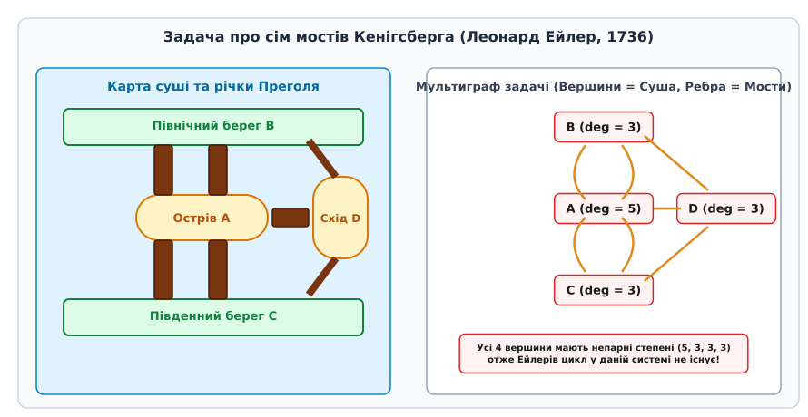
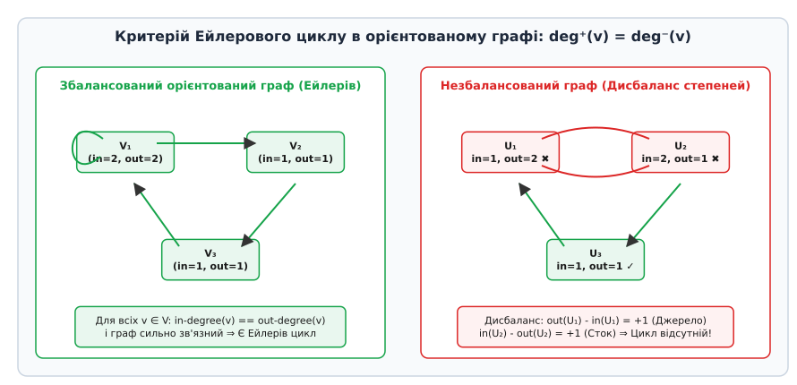
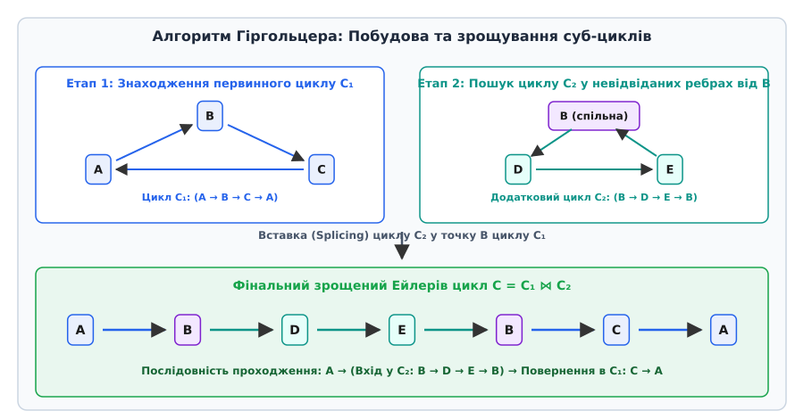
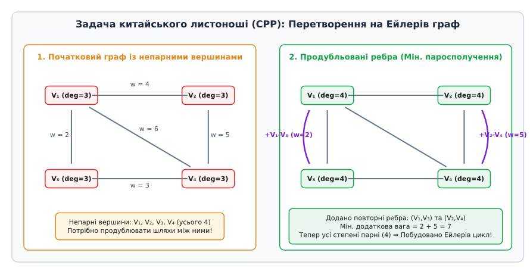

# Ейлерів цикл

<preknowlist>
- [Граф](book:algorithms/adjacency-matrix) — вершини, ребра, матриця суміжності та списки суміжності.
- [Степінь вершини](book:algorithms/bipartite-graph) — кількість ребер, інцидентних вершині (вхідна та вихідна степені в орієнтованому графі).
- [Зв'язність графа](book:algorithms/de-bruijn-graph) — існування шляху між довільною парою вершин, компоненти зв'язності та сильна зв'язність.
- [Пошук у глибину (DFS)](book:algorithms/hamiltonian-cycle) — обхід вершин графа із використанням стеків або рекурсії.
</preknowlist>

Маршрутизація транспортного засобу, який мусить проїхати кожну вулицю мікрорайону для прибирання снігу чи вивозу сміття без повторних неоплачуваних прогонів, вимагає знаходження замкненого обходу, що містить кожне ребро транспортної мережі рівно один раз. На відміну від задачі вибору найкоротшого шляху між двома точками, де оптимізується сума ваг вздовж послідовності вершин, суцільне покриття ребер постає як глобальне топологічне обмеження на парність степеней усіх вершин. Можливість або неможливість побудови такого обходу випливає не з геометричної довжини ребер чи координат об'єктів, а із симетрії входів та виходів у кожному вузлі мережі.

Ейлерів цикл (лат. *circulus*, від грец. *κύκλος* — коло, круг) визначається як замкнений шлях у графі, який проходить через кожне ребро графа рівно один раз. Завдяки класичній праці Леонарда Ейлера 1736 року про сім мостів Кенігсберга ця задача стала фундаментальним витоком теорії графів та топології. Докладний опис історії виникнення задачі, топографії старовинного Кенігсберга та її вирішальну роль у формуванні дискретної математики наведено у вставці [📜 Сім мостів Кенігсберга та народження теорії графів](book:algorithms/eulerian-cycle/hist-konigsberg-bridges.md).


*Сім мостів Кенігсберга: географічна схема та її еквівалентний мультиграф із непарними степенями вершин.*

---

## Топологічна природа та необхідні умови існування

Аналіз існування ейлерового циклу спирається на локальну властивість збереження потоку у кожній вершині. Якщо обхід потрапляє у вершину `v` по деякому ребра, він мусить залишити цю вершину по іншому ребру, ще не використаному в маршруті. Отже, кожне відвідування вершини `v` споживає строго два ребра, інцидентні цій вершині — одне для входу й одне для виходу.

Для неорієнтованого мультиграфа `G = (V, E)` ця властивість формулюється у вигляді критерію парності степеней. Степінь вершини `deg(v)` задає загальну кількість ребер, що приєднуються до `v` (при цьому петля додає 2 до степеня).

### Фундаментальний критерій парності
Зв'язний неорієнтований мультиграф містить ейлерів цикл тоді й лише тоді, коли степінь кожної його вершини є парним числом:

```
∀ v ∈ V : deg(v) ≡ 0 (mod 2)
```

Якщо ж у зв'язному графі існує рівно дві вершини з непарним степенем (`deg(u) % 2 != 0` та `deg(w) % 2 != 0`), то такий граф містить не замкнений цикл, а розімкнений **ейлерів шлях** (*Eulerian path*), який обов'язково починається в одній із непарних вершин і закінчується у другій. Якщо кількість вершин із непарним степенем відмінна від 0 та 2 (наприклад, 4, як у задачі про мости Кенігсберга), побудувати суцільний ейлерів обхід без повторення ребер математично неможливо.

Опорою для цього твердження є **лема про рукостискання** (*Handshaking Lemma*), згідно з якою сума степеней усіх вершин довільного графа дорівнює подвоєній кількості ребер:

```
∑_{v ∈ V} deg(v) = 2 · |E|
```

Звідси випливає фундаментальний інваріант: у будь-якому неорієнтованому графі кількість вершин із непарним степенем є строго парною. Отже, граф не може мати одну, три чи п'ять непарних вершин.

Формальне математичне виведення інваріантів парності, індуктивний доказ достатності умови та висвітлення теореми BEST для обчислення кількості циклів містить вставка [🧮 Теорема Ейлера — Гіргольцера та теорема BEST](book:algorithms/eulerian-cycle/math-euler-hierholzer-theorem.md).

---

## Алгебраїчна теорія: Простір циклів графа

Глибше математичне розуміння ейлерових графів забезпечується інструментарієм алгебраїчної теорії графів через поняття **простору циклів** (*Cycle Space*).

Для графа `G = (V, E)` розглянемо векторний простір над двоелементним скінченним полем `GF(2) = {0, 1}`, де підмножини ребер `E' ⊆ E` представляються як бінарні вектори довжиною `|E|`. Додавання двох векторів (підмножин ребер) виконується як симетрична різниця (операція `XOR` над ребрами):

```
E₁ ⊕ E₂ = (E₁ ∪ E₂) \ (E₁ ∩ E₂)
```

**Простір циклів `Z(G)`** — це підпростір усіх підмножин ребер, у яких кожна вершина має парний степінь у підграфі, утвореному цими ребрами.

З алгебраїчної точки зору:
1. Будь-який ейлерів граф являє собою елемент простору циклів `Z(G)`.
2. Граф `G` є ейлеровим тоді й лише тоді, коли множина всіх його ребер `E` належить простору циклів `Z(G)`.
3. Розмірність простору циклів задається циклічним числом графа (цикломатичним числом):

```
dim(Z(G)) = |E| - |V| + c(G)
```

де `c(G)` — кількість компонент зв'язності графа.

Базис простору циклів складається з `|E| - |V| + c(G)` фундаментальних циклів, утворених додаванням одного ребра хорди до кістякового дерева графа. Будь-який ейлерів цикл можна розглядати як зв'язаний твірний елемент цього простору, що покриває весь базис без залишку.

Ортогональним доповненням простору циклів `Z(G)` є **простір розрізів `C(G)`** (*Cut Space*), утворений множинами ребер розрізів графа. Ці два простори є взаємно ортогональними над `GF(2)`, що означає: скалярний добуток будь-якого елемента простору циклів на будь-який елемент простору розрізів дорівнює 0 (модулем 2). Це фундаментальне співвідношення ортогональності використовується в алгоритмах перевірки цілісності мереж та у розрахунках електричних кіл за законами Кірхгофа.

---

## Баланс степеней у орієнтованих графах

У орієнтованому графі `G = (V, E)` кожне ребро має напрямок від початкової вершини `src` до кінцевої `dst`. Локальне збереження обходу вимагає окремого розрахунку двох величин для кожної вершини `v`:
- `deg⁻(v)` (вхідний степінь, *in-degree*) — кількість ребер, спрямованих у вершину `v`;
- `deg⁺(v)` (вихідний степінь, *out-degree*) — кількість ребер, спрямованих із вершини `v`.

### Суворі умови орієнтованого ейлерового циклу
Критерій існування ейлерового циклу в орієнтованому графі вимагає виконання двох умов:

1. **Точний баланс степеней**: Для кожної вершини вхідний степінь повинен дорівнювати вихідному степеню:
```
∀ v ∈ V : deg⁻(v) = deg⁺(v)
```
2. **Сильна зв'язність ненульових вершин**: Усі вершини, які мають ненульовий степінь (`deg⁻(v) + deg⁺(v) > 0`), мусять належати єдиній сильно зв'язній компоненті (тобто між будь-якою парою таких вершин існує орієнтований шлях у двох напрямках). Ізольовані вершини зі степенем 0 на наявність циклу не впливають.


*Порівняння збалансованого (ейлерового) та незбалансованого (не-ейлерового) орієнтованого графа.*

Для існування розімкненого орієнтованого ейлерового шляху від вершини `s` до вершини `t` (`s != t`) умова балансу модифікується:
- Для стартової вершини `s`: `deg⁺(s) - deg⁻(s) = 1` (одне додаткове вихідне ребро);
- Для кінцевої вершини `t`: `deg⁻(t) - deg⁺(t) = 1` (одне додаткове вхідне ребро);
- Для всіх інших вершин `v ∈ V \ {s, t}`: `deg⁻(v) = deg⁺(v)`.

При порушенні балансу хоча б в одній вершині граф перетворюється на незбалансовану систему, де утворюються "джерела" (*sources*) або "стоки" (*sinks*), у яких обхід неминуче блокується до покриття всіх ребер.

---

## Алгоритми побудови ейлерового циклу

Побудова ейлерового циклу може здійснюватися двома основними алгоритмічними підходами: **алгоритмом Гіргольцера** (*Hierholzer's algorithm*) та **алгоритмом Флері** (*Fleury's algorithm*).

### 1. Алгоритм Гіргольцера: Ітеративна декомпозиція та зрощування

Запропонований Карлом Гіргольцером у 1873 році, цей алгоритм працює за лінійний час `O(|E|)` і вимагає `O(|V| + |E|)` додаткової пам'яті. Метод спирається на лему про те, що будь-який граф із парними степенями вершин розпадається на множину реберно-диз'юнктних простих циклів.

Алгоритм виконує такі кроки:
1. Обирається довільна початкова вершина `v₀` з ненульовим степенем.
2. Будується простий цикл `C₁`, рухаючись по невідвіданих ребрах доти, доки обхід не повернеться у початкову вершину `v₀`. Оскільки всі степені парні, тупик без повернення у `v₀` неможливий.
3. Усі ребра циклу `C₁` позначаються як використані (або вилучаються з графа).
4. Якщо у пройденому циклі `C₁` є вершина `u`, яка має інші невідвідані інцидентні ребра, алгоритм запускає з вершини `u` побудову нового суб-циклу `C₂`.
5. Знайдений цикл `C₂` зрощується (*splicing*) з базовим циклом `C₁` у точці `u`: послідовність обходу `C₁` розривається у `u`, у місце розриву вставляється повний обхід `C₂`, після чого обхід `C₁` продовжується.
6. Процес повторюється до вичерпання всіх ребер у графі.


*Покрокове знаходження суб-циклів та їх вклеювання (splicing) в алгоритмі Гіргольцера.*

На практиці алгоритм Гіргольцера реалізують не через явне зрощування списків, а за допомогою одного DFS-подібного обходу з двома стеками:
- `curr_stack` — стек поточного досліджуваного шляху;
- `circuit` — масив/стек фінальної послідовності ейлерового циклу.

Коли вершина `u` на вершині `curr_stack` більше не має невідвіданих вихідних ребер, вона виштовхується з `curr_stack` і додається в `circuit`. Наприкінці масив `circuit` містить ейлерів цикл у зворотному порядку.

### 2. Алгоритм Флері: Локальне уникнення мостів

Алгоритм Флері (опублікований у 1883 році) будує ейлерів шлях безпосередньо, рухаючись від вершини до вершини. Його головне правило: **ніколи не проходити по мосту (ребру, вилучення якого розриває граф на окремі компоненти зв'язності), якщо є альтернативне не-мостове ребро**.

Алгоритм Флері має складність `O(|E|²)`, оскільки на кожному кроці для перевірки того, чи є ребро мостом, вимагається запуск алгоритму пошуку зв'язності (DFS або BFS). Через високу обчислювальну складність алгоритм Флері практично не застосовується у продакшн-системах і слугує лише навчальною ілюстрацією.

### 3. Випадкові блукання у ейлерових графах (*Random Walks*)
Цікавою властивістю ейлерових орієнтованих графів є поведінка марковських ланцюгів випадкових блукань. Якщо марківська частка переходить із вершини `u` у сусідню вершину `v` з імовірністю `1 / deg⁺(u)`, то стаціонарний розподіл імовірностей знаходження частки у вершині `v` пропорційний її степеню:

```
π(v) = deg⁺(v) / |E|
```

Це означає, що випадкове блукання по ейлеровому графу рівномірно покриває всі ребра графа, не застрягаючи у пастках, що використовується у моніторингу мережевих потоків та аналізі графів знань.

### 4. Паралельні та розмінні алгоритми (Euler Tour Technique)
У паралельних обчислювальних моделях (таких як PRAM) для обходу дерев та графів застосовується методика ейлерового туру (**Euler Tour Technique**, ETT). Вона перетворює неорієнтоване дерево у орієнтований ейлерів граф шляхом заміни кожного неорієнтованого ребра двома зустрічно спрямованими дугами. Отриманий граф є ейлеровим, і його ейлерів тур обчислюється за час `O(log V)` за допомогою паралельного алгоритму стрибків покажчиків (*pointer jumping*). Це використовується у паралельних графічних рушіях для швидкого обчислення розмірів піддерев, глибин вершин та префіксних сум на деревах.

Повні вихідні тексти реалізацій алгоритму Гіргольцера та Флері на мовах C та C++ з детальною обробкою крайніх випадків наведено у вставці [⚙️ Реалізація алгоритму Гіргольцера та Флері](book:algorithms/eulerian-cycle/proj-hierholzer-algorithm.md).

---

## Покроковий розбір прикладу обчислення

Розглянемо неорієнтований граф `G = (V, E)` з 5 вершинами `V = {0, 1, 2, 3, 4}` та 7 ребрами:

```
E = { (0,1), (0,2), (1,2), (1,3), (1,4), (2,3), (2,4) }
```

### Крок 1. Перевірка степеней вершин
Обчислимо степені кожної з вершин:

```
deg(0) = 2  (ребра (0,1), (0,2))             [парне]
deg(1) = 4  (ребра (1,0), (1,2), (1,3), (1,4)) [парне]
deg(2) = 4  (ребра (2,0), (2,1), (2,3), (2,4)) [парне]
deg(3) = 2  (ребра (3,1), (3,2))             [парне]
deg(4) = 2  (ребра (4,1), (4,2))             [парне]
```

Усі степені парні, граф зв'язаний — ейлерів цикл існує.

### Крок 2. Виконання алгоритму Гіргольцера (початок у вершині 0)

```
1. Старт у v = 0.
   curr_stack = [0]

2. Крок 0 -> 1 (вилучаємо ребро (0,1)):
   curr_stack = [0, 1]

3. Крок 1 -> 2 (вилучаємо ребро (1,2)):
   curr_stack = [0, 1, 2]

4. Крок 2 -> 0 (вилучаємо ребро (2,0)):
   curr_stack = [0, 1, 2, 0]

5. Вершина 0 більше не має невідвіданих ребер!
   Поп 0 -> circuit = [0]
   curr_stack = [0, 1, 2]

6. У вершини 2 є невідвідане ребро (2,3)!
   Крок 2 -> 3 (вилучаємо (2,3)):
   curr_stack = [0, 1, 2, 3]

7. Крок 3 -> 1 (вилучаємо (3,1)):
   curr_stack = [0, 1, 2, 3, 1]

8. Крок 1 -> 4 (вилучаємо (1,4)):
   curr_stack = [0, 1, 2, 3, 1, 4]

9. Крок 4 -> 2 (вилучаємо (4,2)):
   curr_stack = [0, 1, 2, 3, 1, 4, 2]

10. Вершина 2 більше не має ребер! Поп 2 -> circuit = [0, 2]
    Вершина 4 більше не має ребер! Поп 4 -> circuit = [0, 2, 4]
    Вершина 1 більше не має ребер! Поп 1 -> circuit = [0, 2, 4, 1]
    Вершина 3 більше не має ребер! Поп 3 -> circuit = [0, 2, 4, 1, 3]
    Вершина 2 більше не має ребер! Поп 2 -> circuit = [0, 2, 4, 1, 3, 2]
    Вершина 1 більше не має ребер! Поп 1 -> circuit = [0, 2, 4, 1, 3, 2, 1]
    Вершина 0 більше не має ребер! Поп 0 -> circuit = [0, 2, 4, 1, 3, 2, 1, 0]
```

### Крок 3. Результат
Реверсувавши масив `circuit`, отримуємо ейлерів цикл:

```
0 -> 1 -> 2 -> 3 -> 1 -> 4 -> 2 -> 0
```

Перевірка показує, що кожне з 7 ребер пройдено рівно один раз, а обхід є замкненим.

---

## Практичні застосування у сучасних технологіях

Задачі ейлерового покриття розповсюджені у сферах від молекулярної біології до низькорівневого програмування мікроконтролерів та проектування друкованих плат.

> 🔧 **Навіщо це.**
> Ейлерові цикли є серцем сучасних біоінформатичних секвенаторів ДНК (платформи Illumina, PacBio), де мільярди коротких фрагментів ДНК завдовжки 100–150 нуклеотидів складаються у хромосоми шляхом побудови ейлерового шляху у графах де Брейнена [de-bruijn-graph](book:algorithms/de-bruijn-graph). Заміна застарілих гамільтонових алгоритмів складання на ейлерові дозволила прискорити збирання геномів у тисячі разів, звівши складність обчислень з експоненційного перебору до лінійного часу.

### 1. Біоінформатика: Складання геному (*De Novo Genome Assembly*)
При секвенуванні геному лабораторне обладнання зчитує мільйони коротких фрагментів ДНК — **зчитувань** (*reads*). Для відновлення вихідної ДНК-послідовності зчитування розбиваються на перекривні слова довжиною `k` (**k-мери**).

Будується орієнтований **граф де Брейнена**:
- **Вершини**: префікси та суфікси `k-мерів` довжиною `k - 1`;
- **Ребра**: самі `k-мери`, що з'єднують свій префікс із суфіксом.

У реальних секвенаторах вхідні дані містять помилки зчитування. Вони створюють дефекти в графі де Брейнена:
- **Тупикові відгалуження (Tips)**: створюються поодинокими помилками на кінцях зчитувань (усуваються обрізанням гілок без виходу);
- **Бульбашки (Bubbles)**: утворюються однонуклеотидними поліморфізмами (SNP) або помилками всередині зчитувань (схоплюються в один шлях через вирівнювання ребер);
- **Ребра низького покриття (Low-coverage edges)**: вилучаються за порогом частоти появи `k-мерів`.

Після очищення граф перетворюється на збалансований ейлерів граф, у якому обчислюється ейлерів шлях — підсумковий геномний контиг.

### 2. Задача китайського листоноші (*Chinese Postman Problem*)
У реальних задачах логістики (прибирання снігу, сміттєзбір, інспекція газопроводів, маршрутизація поштових кур'єрів) вхідний граф вуличної мережі часто містить вершини з непарними степенями. Задача китайського листоноші (*CPP*, сформульована китайським математиком Мей-Гу Гуанем у 1960 році) вимагає знайти найкоротший замкнений маршрут, який покриває кожне ребро принаймні один раз.

Якщо граф не є ейлеровим, деякі ребра доведеться пройти повторно. Алгоритм розв'язання CPP перетворює вхідний граф на ейлерів:
1. Знаходяться всі вершини з непарними степенями `V_odd` (їх кількість завжди парна).
2. Обчислити найкоротші відстані між усіма парами вершин з `V_odd` за допомогою алгоритму Флойд-Воршелла.
3. Будується **зважене паросполучення мінімальної ваги** (*Minimum Weight Perfect Matching*) на множині `V_odd` за допомогою алгоритму Едмондса [perfect-matching](book:algorithms/perfect-matching).
4. Ребра, що увійшли до паросполучення, дублюються у вихідному графі.
5. У збудованому ейлеровому мультиграфі запускається алгоритм Гіргольцера.

Слід зазначити, що варіант цієї задачі для **змішаних графів** (*Mixed Chinese Postman Problem*), де частина ребер орієнтована, а частина є неорієнтованою, є **NP-повною задачею**.


*Перетворення довільного графа на ейлерів через мінімальне паросполучення непарних вершин у задачі китайського листоноші.*

### 3. Генерація послідовностей де Брейнена та апаратне тестування
В апаратному забезпеченні та криптографії псевдовипадкові послідовності бітів максимального періоду генеруються на базі **зсувних регістрів із нелінійним зворотним зв'язком** (*NLFSR*). Бінарна послідовність де Брейнена порядку `n` є циклічною послідовністю довжиною `2ⁿ` бітів, яка містить кожну бінарну комбінацію довжиною `n` рівно один раз.

Побудова такої послідовності виконується шляхом пошуку ейлерового циклу у графах де Брейнена `B(2, n-1)`. Ці послідовності використовуються для:
- Сканування позиції в оптичних енкодерах (відновлення абсолютного кута повороту за `n` зчитаними бітами);
- Генерації вичерпних тестових векторів для верифікації цифрових мікросхем та процесів криптоаналізу.

### 4. Оптимізація Траєкторій у ЧПК-Верстатах та 3D-Друці
При фрезеруванні на верстатах із числовим програмним керуванням (ЧПК) або вирізанні лазером інструмент мусить прорізати лінії контуру деталі. Кожен підйом та холостий перехід різальної головки між контурами збільшує час обробки та знос обладнання. Побудова ейлерового циклу на графі ліній різу мінімізує кількість підйомів інструмента до нуля.

---

## Програмні інтерфейси та вибір структур даних

Для інтеграції ейлерових алгоритмів у складні програмні комплекси розробляється абстрактний API інтерфейс. Він виділяє підсистему перевірки інваріантів графа та безпосередній обчислювач циклів.

При проектуванні системного API вирішуються такі інженерні задачі:
1. **Інкапсуляція стану графа**: Представлення графа через непрозорі покажчики у C API для забезпечення ABI-сумісності.
2. **Управління пам'яттім**: Застосування RAII-обгорток та розумних покажчиків у C++ API для запобігання витокам пам'яті.
3. **Ефективність списків суміжності**: Використання масивів із покажчиками на поточне ребро (`head_cursor`), що усуває промахи кешу при повторному обході.

### Формат CSR (Compressed Sparse Row) для статичних графів надвеликої розмірності
Для статичних графів з мільйонами ребер стандартні зв'язані списки створюють значний оверхед за пам'яттю (покажчики `next` вимагають 8 байт на кожен вузол у 64-бітній системі) та промахи L1/L2 кешу.

У високопродуктивних бібліотеках використовується компактний формат **CSR (Compressed Sparse Row)**:
- `row_ptr` — масив розміром `|V| + 1`, де `row_ptr[i]` вказує на зміщення першого вихідного ребра вершини `i` у загальному масиві ребер;
- `col_ind` — суцільний масив розміром `|E|`, що містить індекси цільових вершин `dst`.

Алгоритм Гіргольцера над CSR-форматом виконується без жодного виклику `malloc` під час обходу, використовуючи два статичні масиви у купі, що забезпечує максимальну продуктивність на процесорах із глибоким конвеєром.

### Забезпечення потокобезпечності та сканування Netfilter/eBPF
У системному програмуванні мережевих стеків графі потоків пакетів аналізуються за допомогою eBPF-програм у Linux-ядрі. Якщо мережева топологія описується орієнтованим ейлеровим графом, відстеження циклічних маршрутів пакетів реалізується через розщеплення списків суміжності в eBPF-картах (`BPF_MAP_TYPE_HASH` та `BPF_MAP_TYPE_ARRAY`). Потокобезпечність аналізу досягається заклиненням стану графа (`is_frozen = true`), після чого будь-яка кількість паралельних робочих потоків ядра може одночасно виконувати пошук ейлерових контурів без взаємних блокувань і без використання м'ютексів.

Повну структурну специфікацію API, підтримувані типи даних, контракти функцій C та C++ класів наведено у вставці [📋 Інтерфейс аналізу та побудови ейлерових шляхів](book:algorithms/eulerian-cycle/api-eulerian-graph.md).

---

## Двоїстість та порівняльний аналіз складності

У теорії графічної складності ейлерів цикл займає унікальне місце завдяки своїй двоїстості відносно **гамільтонового циклу** [hamiltonian-cycle](book:algorithms/hamiltonian-cycle).

| Параметр / Властивість | Ейлерів цикл | Гамільтонів цикл |
| :--- | :--- | :--- |
| **Елемент покриття** | Покриває кожне **ребро** `e ∈ E` рівно 1 раз | Покриває кожну **вершину** `v ∈ V` рівно 1 раз |
| **Необхідна й достатня умова** | Локальна (парність / баланс степеней вершин) | Глобальна (відсутня загальна умова; лише достатні критерії Дірака/Оре) |
| **Алгоритмічна складність** | Поліноміальна `P` — `O(|E|)` | `NP`-повна — `O(2ⁿ n²)` (динамічне програмування) |
| **Підрахунок кількості компонент** | Для орієнтованих: `O(|V|³)` (Теорема BEST) | `♯P`-повна задача |

### Двоїстість лінійного графа (*Line Graph Duality*)
Фундаментальний зв'язок між цими двома задачами розкривається через поняття **лінійного графа** `L(G)` (*line graph*). Лінійний граф `L(G)` будується шляхом перетворення кожного ребра графа `G` на вершину в `L(G)`; дві вершини в `L(G)` з'єднуються ребром, якщо відповідні ребра в `G` мали спільну вершину.

Звідси випливає теорема про двоїстість:
**Ейлерів цикл у графі `G` строго еквівалентний Гамільтоновому циклу в його лінійному графі `L(G)`.**

Оскільки побудова лінійного графа виконується за поліноміальний час, але не кожен граф є лінійним графом іншого графа, це пояснює, чому загальна задача пошуку гамільтонового циклу є `NP`-повною, тоді як пошук ейлерового циклу розв'язується за лінійний час. Графи де Брейнена `B(k, n)` є лінійними графами `L(B(k, n-1))`, що робить розв'язання гамільтонової задачі на графах де Брейнена еквівалентним ейлеровій задачі на попередньому рівні `n-1` і дозволяє розв'язувати її за лінійний час.
