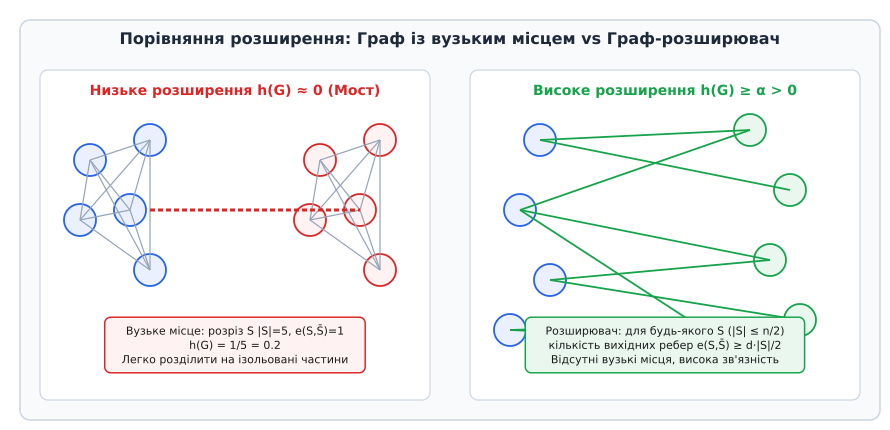
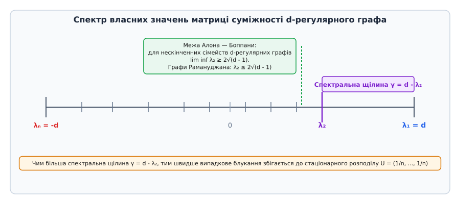
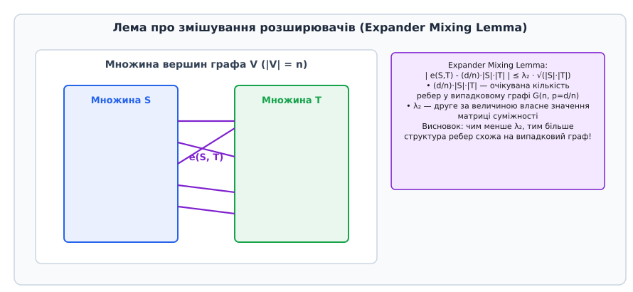
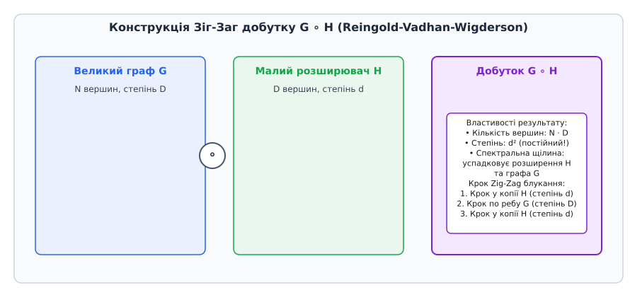

# Графи-розширювачі (Expander Graphs)

<preknowlist>
- [Двочастковий граф](topic:algorithms/bipartite-graph) — двочасткова топологія, частки U та V, хроматичне число.
- [Матриця суміжності](topic:algorithms/adjacency-matrix) — власні значення та власні вектори симетричних матриць суміжності.
- [Клас BPP](topic:algorithms/bpp) — ймовірнісні алгоритми із двосторонньою похибкою та ампліфікація імовірності.
- [Псевдовипадкові генератори](topic:algorithms/pseudorandom-generator) — дерандомізація та економне використання випадкових бітів.
</preknowlist>

Під час проектування комутаційної мережі для суперкомп'ютера з мільйоном обчислювальних вузлів розробники стикаються з геометричним глухим кутом. Повний граф `K_N` забезпечує ідеальний зв'язок із діаметром 1 і відсутністю вузьких місць, але вимагає `O(N²)` фізичних ліній зв'язку — для мільйона вузлів це півтрильйона кабелів, що фізично неможливо розмістити у просторі. Двовимірна сітка або кільце знижують кількість з'єднань на вузол до 2–4, але діаметр мережі зростає до `O(√N)` або `O(N)` кроків, а видалення всього `O(√N)` ліній зв'язку розрізає суперкомп'ютер навпіл, ізолюючи величезні кластери.

Виникає фундаментальне запитання: чи можна побудувати розріджений граф, у якому кожна вершина має лише кілька з'єднань (сталий степінь `d = 3` або `d = 8`), але при цьому граф володіє логарифмічним діаметром `O(log N)`, відсутністю будь-яких вузьких місць та надзвичайно високою зв'язністю? Відповіддю на цей виклик є **графи-розширювачі** (англ. *expander graphs*, від латинського *expandere* — розгортати, розширювати).

Граф-розширювач — це розріджений граф, у якому кожна підмножина вершин має аномально велику межу (багато вихідних ребер). Це створює ефект надшвидкого поширення інформації, стійкість до відмов та експоненціальну швидкість збіжності випадкових блукань.

## Проблема вузьких місць у топології мереж та випадкових блуканнях

Розглянемо фундаментальну проблему передачі інформації у складних топологіях. У розподілених системах, паралельних обчислювальних кластерах та однорангових мережах (P2P) ключовими показниками ефективності є чотири основні величини:
1. **Степінь вершин `d`:** Кількість безпосередніх каналів зв'язку, приєднаних до одного процесорного вузла. Малий степінь знижує вартість обладнання та фізичну складність розведення провідників на друкованій платі чи у кристалі.
2. **Діаметр графа `D`:** Максимальна найкоротша відстань між будь-якою парою вершин. Малий діаметр ґарантує мінімальну затримку (latency) під час маршрутизації пакетів.
3. **Ширина бісекції (Bisection Bandwidth):** Мінімальна кількість ребер, яку потрібно видалити, щоб розбити граф на дві рівні за кількістю вершин частини.
4. **Розширюваність / Відмовостійкість (`h(G)`):** Здатність мережі зберігати зв'язність при виході з ладу частини вузлів або каналів.

У класичних топологіях виникає неприємний компроміс. У повній сітці (Grid) або торі розміром `L × L` кількість вершин `N = L²`. Степінь кожної вершини є малим (`d = 4`), але діаметр становить `D = 2 L = 2 √N`. Якщо відправити повідомлення з одного кута сітки в інший, воно має пройти `O(√N)` транзитних вузлів. Більше того, розрізавши сітку вздовж однієї лінії довжиною `√N`, ми розбиваємо мережу на дві великі незв'язані частини. Це свідчить про наявність критичних «вузьких місць» (bottlenecks).

Історичні суперкомп'ютери, такі як Cray T3E чи IBM Blue Gene, використовували тривимірні тори для зменшення діаметра, але при масштабуванні до мільйонів вузлів тривимірна геометрична сітка все одно стикається з обмеженням `O(N^(1/3))`.

Гіперкуб (Hypercube) вимірності `k` має `N = 2ᵏ` вершин і логарифмічний діаметр `D = k = log₂ N`. Однак його степінь вершин дорівнює `d = k = log₂ N`, що означає, що при зростанні кількості вузлів кожен процесор мусить мати все більше фізичних портів зв'язку.

Графи-розширювачі розривають це порочне коло. Вони поєднують найкращі риси обох світів:
* **Сталий степінь:** `d = O(1)` (наприклад, `d = 3`, `d = 6` або `d = 8`), незалежно від того, скільки мільйонів чи мільярдів вершин має граф.
* **Логарифмічний діаметр:** `D = O(log N)`, що забезпечує ультрашвидке поширення сигналів.
* **Максимальна ізопериметрична зв'язність:** Видалення будь-якої малої чи середньої підмножини ребер принципово не може розколоти граф на дві порівнювані за розміром частини.
* **Експоненційно швидке змішування блукань:** Випадкове блукання на графі-розширювачі збігається до рівномірного розподілу за `O(log N)` кроків.

## Вершинна та реберна розширюваність (Cheeger Constant)

Щоб надати інтуїції суворого математичного змісту, опишемо розширення через геометричну межу підмножин вершин. Нехай `G = (V, E)` — неорієнтований граф із `n = |V|` вершинами та степенем вершин `d`.

Для довільної підмножини вершин `S ⊂ V` визначимо дві критичні величини:

1. **Вершинна межа `∂_out(S)`:** Множина вершин поза `S`, які з'єднані бодай одним ребром із множиною `S`:
   ```
   ∂_out(S) = { v ∈ V \ S | ∃ u ∈ S, (u, v) ∈ E }
   ```

2. **Реберна межа `δ(S)`:** Множина ребер, що мають один кінець у `S`, а інший — поза `S`:
   ```
   δ(S) = { (u, v) ∈ E | u ∈ S, v ∉ S }
   ```

Комбінаторна **вершинна розширюваність** (вершинна константа розширення `h_v(G)`) описує мінімальне відношення розміру межі до розміру самої множини `S` серед усіх підмножин, які не перевищують половину графа:

```
h_v(G) = min_{0 < |S| ≤ n/2} (|∂_out(S)| / |S|)
```

Аналогічно, **реберна розширюваність** (або **ізопериметричне число Чігера**, `h(G)`) визначається як:

```
h(G) = min_{0 < |S| ≤ n/2} (|δ(S)| / |S|)
```


*Порівняння графа з мостовим вузьким місцем (низьке розширення h(G) ≈ 0) та графа-розширювача з високою реберною межею для будь-якого розрізу S.*

Змістовний зміст умови `|S| ≤ n/2` полягає у тому, що ми оцінюємо розширення «меншої половини» графа. Для множини `S`, що охоплює майже всі вершини, її вихідна межа природно стає малою, оскільки поза `S` залишається мало вершин. Тому мінімум береться саме по множинах обсягом до `n/2`.

Розглянемо порівняльну характеристику основних графів за їхніми розширювальними властивостями:

* **Кільцевий граф `C_n` (Ring):** Степінь `d = 2`. Якщо вибрати підмножину `S` із `n/2` послідовних вершин, то реберна межа `|δ(S)| = 2` (два крайніх ребра). Константа Чігера `h(C_n) = 2 / (n/2) = 4 / n → 0`.
* **Двовимірна сітка `Grid(√n × √n)`:** Степінь `d = 4`. Підмножина у формі квадрата розміром `(√n/2) × (√n/2)` має обсяг `|S| = n/4` та межу `|δ(S)| = √n`. Константа Чігера `h(Grid) = √n / (n/4) = 4 / √n → 0`.
* **Повний граф `K_n`:** Степінь `d = n - 1`. Для будь-якої множини `S` розміром `s` кількість вихідних ребер `|δ(S)| = s · (n - s)`. Константа Чігера `h(K_n) = s · (n - s) / s = n - s ≥ n/2`. Розширення є величезним, але степінь `d` зростає лінійно з `n`.
* **Граф-розширювач `Expander`:** Степінь `d = O(1)`. Для будь-якої підмножини `S` виконується `|δ(S)| ≥ α · |S|`, тому `h(G) ≥ α > 0` залишається сталою величиною при `n → ∞`.

Натомість сімейство `d`-регулярних графів `G_n` називається **сімейством графів-розширювачів**, якщо існує стала `α > 0`, незалежна від `n`, така що для всіх `n`:

```
h(G_n) ≥ α > 0
```

Це означає, що незалежно від того, як ми виберемо до половини вершин графа, кількість вихідних ребер завжди буде пропорційною розміру самої множини. У графі-розширювачі принципово відсутні ізольовані кластери чи «вузькі шийки» (bottlenecks).

Історичний процес висунення імовірнісного існування розширювачів Марком Пінскером у 1973 році та створення перших алгебраїчних конструкцій розкрито у вставці [📜 Історія відкриття графів-розширювачів: від імовірнісних доказів Марка Пінскера до теореми Рейнгольда L = SL](topic:algorithms/expander-graphs/hist-expander-discovery.md).

## Спектральна розширюваність та теорема Чігера

Обчислення комбінаторної константи розширення `h(G)` безпосередньо за означенням вимагає перевірки `2ⁿ⁻¹` підмножин вершин, що є `NP`-важкою задачею. На щастя, теорія алгебраїчних графів надає потужний обчислювальний інструмент: **спектральний аналіз матриці суміжності**.

Нехай `A` — `n × n` матриця суміжності `d`-регулярного графа `G`. Розглянемо її нормовану матрицю блукання `M = (1 / d) · A`. Оскільки `M` є дійсною симетричною матрицею, її власні значення є дійсними числами й можуть бути впорядковані за спаданням:

```
d = λ₁ ≥ λ₂ ≥ λ₃ ≥ ... ≥ λ♮ ≥ -d
```

Нормовані власні значення матриці `M` дорівнюють `μᵢ = λᵢ / d`:

```
1 = μ₁ ≥ μ₂ ≥ μ₃ ≥ ... ≥ μ♮ ≥ -1
```

Різниця `γ = d - λ₂` (або у нормованій формі `1 - μ₂`) називається **спектральною щілиною** (spectral gap) графа.


*Розподіл власних значень матриці суміжності d-регулярного графа, спектральна щілина d - λ₂ та межа Алона — Боппани.*

Математичний зв'язок між геометрією графа (комбінаторним розширенням `h(G)`) та алгеброю (спектральною щілиною `d - λ₂`) описується знаменитою **Нерівністю Чігера** (Cheeger Inequality), доведеною для графів Ногою Алоном та Віталієм Боппаною у 1986 році:

```
(d - λ₂) / 2 ≤ h(G) ≤ √(2 · d · (d - λ₂))
```

З нерівності Чігера випливають фундаментальні наслідки:
1. `h(G) > 0` тоді й лише тоді, коли `d - λ₂ > 0` (граф зв'язний і має позитивну спектральну щілину).
2. Велика спектральна щілина `d - λ₂` гарантує високе комбінаторне розширення.
3. Обчислення другого за величиною власного значення `λ₂` виконується за поліноміальний час `O(m)` за допомогою чисельних методів (метод степеневих ітерацій або метод Ланцоша), що дозволяє миттєво оцінювати якість розширювача.

Спектральна щілина контролює швидкість збіжності марківського випадкового блукання до стаціонарного рівномірного розподілу. Якщо розставити у вершинах графа довільний початковий розподіл імовірностей `p₀`, то після `k` кроків блукання відхилення від рівномірного розподілу `u = (1/n, ..., 1/n)` зменшується експоненційно:

```
‖ Mᵏ p₀ - u ‖₂ ≤ (λ₂ / d)ᵏ · ‖ p₀ - u ‖₂
```

Чим менше значення `λ₂`, тим швидше випадкова точка «забуває» свою початкову позицію й рівномірно розмазується по всіх `n` вершинах графа.

Розглянемо фізичну інтуїцію власного вектора `v₂`, що відповідає власному значенню `λ₂`. За теоремою Куранта — Фішера, `v₂` є вектором, що мінімізує відношення Реле серед усіх векторів, ортогональних до постійного вектора `v₁ = (1, ..., 1)ᵀ`. Знаки елементів вектора `v₂` (`v₂[i] > 0` проти `v₂[i] < 0`) задають так званий **спектральний розріз Чігера** (Spectral Bisection). Цей алгоритм розбиття графів широко застосовується у кластеризації даних (Spectral Clustering) та паралельному розподілі задач по ядрах процесора.

Алгоритм спектрального замітання (Cheeger Sweep Algorithm) дозволяє за час `O(n log n)` знайти практичний розріз графа `S`, який задовольняє нерівність Чігера. Для цього елементи другого власного вектора `v₂` сортуються у порядку зростання, і перевіряються всі `n - 1` префіксних розрізів `S_k = {v₂[1], ..., v₂[k]}`. Повертається той префіксний розріз, який надає мінімальне значення відношення `|δ(S_k)| / |S_k|`.

Формальні алгебраїчні доведення обох меж нерівності Чігера, а також спектральний розклад Лапласіана викладено у вставці [𝧮 Математичний апарат спектральної розширюваності та нерівності Чігера](topic:algorithms/expander-graphs/math-spectral-expansion.md).

## Лема про змішування розширювачів (Expander Mixing Lemma)

Окрім ізопериметричних межових властивостей, графи-розширювачі володіють феноменальною псевдовипадковістю. Вони поведінково імітують випадкові графи Ердеша — Реньї `G(n, p = d/n)`, але використовують лише `O(n)` ребер замість `O(n²)`.

Цю властивість формалізує **Лема про змішування розширювачів** (Expander Mixing Lemma).

Нехай `G = (V, E)` — `d`-регулярний граф з `n` вершинами, і нехай `λ = max(|λ₂|, |λ♮|)` — друге за величиною власне значення матриці суміжності за модулем. Для довільних двох підмножин вершин `S, T ⊆ V` позначимо через `e(S, T)` кількість ребер між `S` та `T`. Тоді виконується нерівність:

```
| e(S, T) - (d · |S| · |T|) / n | ≤ λ · √(|S| · |T| · (1 - |S|/n) · (1 - |T|/n))
```


*Геометрична інтуїція Лемми про змішування: кількість ребер між множинами S та T прямує до очікуваного значення у випадковому графі зі швидкістю, пропорційною λ₂.*

Величина `(d · |S| · |T|) / n` являє собою точно математичне очікування кількості ребер між `S` та `T` у повністю випадковому графі з середнім степенем вершин `d`. Лема показує, що відхилення від абсолютно випадкового розподілу ребер обмежене величиною `λ`. Чим менше `λ` (тобто чим більша спектральна щілина `d - λ`), тим ближчим є граф за своїми комбінаторними властивостями до випадкового графа.

Завдяки лемі про змішування графи-розширювачі застосовуються у криптографії та теорії псевдовипадкових генераторів як детермінована заміна повністю випадкових матриць.

## Границі Алона — Боппани та Графи Рамануджана

Наскільки великою може бути спектральна щілина `d - λ₂` у `d`-регулярному графі при прямуванні кількості вершин `n → ∞`?

Відповідь дає **Теорема Алона — Боппани** (1986): для будь-якої нескінченної послідовності `d`-регулярних графів `G_n` друге власне значення матриці суміжності задовольняє нижню межу:

```
lim inf_{n → ∞} λ₂(G_n) ≥ 2 · √(d - 1)
```

Це встановлює теоретичну асимптотичну стіну: жодне нескінченне сімейство `d`-регулярних графів не може мати власне значення `λ₂`, строго менше ніж `2√(d - 1)`.

Графи, які досягають цієї теоретичної межі, називаються **графами Рамануджана** (Ramanujan Graphs).

### Означення графа Рамануджана
`d`-регулярний зв'язний граф `G` називається графом Рамануджана, якщо для всіх його власних значень `λ_i`, відмінних від `±d`, виконується нерівність:

```
|λ_i| ≤ 2 · √(d - 1)
```

Графи Рамануджана є абсолютними спектральними оптимумами серед усіх можливих графів заданого степеня `d`. Вони забезпечують максимально можливе комбінаторне розширення та найшвидше збігання випадкових блукань.

Побудова явних графів Рамануджана (Любоцький, Філліпс, Сарнак, 1988) спирається на глибинну теорію чисел, оперуючи кватерніонними алгебрами над скінченними полями `𝔽_p` та доведеною П'єром Делінем гіпотезою Рамануджана для автоморфних форм.

Зокрема, Любоцький, Філліпс і Сарнак побудували графи Келі над проєктивною спеціальною лінійною групою `PSL(2, ℤ_q)` для двох простих чисел `p, q ≡ 1 (mod 4)`. Степінь цих графів дорівнює `d = p + 1`.

## Властивість Каждана (T) та алгебраїчні графи Келі

Вирішальним проривом у пошуку явних графів-розширювачів стало застосування теорії представлень груп. У 1967 році радянський математик Дмитро Каждан ввів так звану **властивість `(T)` Каждана** для груп Лі та дискретних груп.

Група `Γ` з симетричною скінченною множиною твірних `S = S⁻¹` володіє властивістю `(T)`, якщо будь-яке унітарне представлення групи `Γ`, яке має «майже фіксовані» вектори, обов'язково містить справді фіксований вектор.

Невдовзі після цього Григорій Маргуліс усвідомив фундаментальний алгебраїчний факт: якщо група `Γ` має властивість `(T)` Каждана, то послідовність графів Келі `Cay(Γ / N_k, S)` для будь-якої нескінченної послідовності нормальних підгруп `N_k` утворює **сімейство графів-розширювачів з уніформенно обмеженою знизу спектральною щілиною**:

```
d - λ₂(Cay(Γ / N_k, S)) ≥ ε(Γ, S) > 0
```

Це дозолило будувати нескінченні серії розширювальних графів суто алгебраїчними методами через коефіцієнти Каждана `ε(Γ, S)`.

## Безвтратні розширювачі (Lossless Expanders)

У теорії стиснення даних, дерандомізації та потокових алгоритмах (Data Streaming) особливе значення мають так звані **безвтратні розширювачі** (Lossless Expanders).

Двочастковий `d`-лівий-регулярний граф `G = (L ∪ R, E)` з лівою часткою `L` та правою часткою `R` називається `(k, 1 - ε)`-безвтратним розширювачем, якщо для будь-якої підмножини лівих вершин `S ⊆ L` розміром `|S| ≤ k` її сусідство у правій частці `N(S)` має обсяг:

```
|N(S)| ≥ (1 - ε) · d · |S|
```

Математична унікальність безвтратних розширювачів полягає у тому, що максимальна можлива кількість ребер, які виходять із множини `S`, дорівнює `d · |S|`. Коефіцієнт `(1 - ε)` означає, що майже кожне ребро з `S` прямує до нової, унікальної вершини в `R`, а кількість дубльованих перетинань ребер є зневажливо малою.

Основні сфери застосування безвтратних розширювачів:
1. **Compressed Sensing (Стиснене зчитування):** Відновлення розріджених векторів високої вимірності за допомогою вимірювальних матрицій малої розмірності.
2. **Потокові алгоритми (Count-Min Sketch):** Оцінка частот елементів у безперервних мережевих потоках даних із мінімальним використанням пам'яті.
3. **Суперконцентратори (Superconcentrators):** Побудова лінійних мереж переключення (switching networks) із гарантованим проходженням сигналів без блокування.

## Явні детерміновані конструкції: Маргуліс — Габбер — Галіль та Зіг-Заг добуток

Незважаючи на те, що майже кожен випадковий `d`-регулярний граф є чудовим розширювачем, у практичних системних застосуваннях потрібні детерміновані алгоритми генерації графів (без застосування випадкових монет).

### 1. Конструкція Маргуліса — Габбера — Галіля
Першою детермінованою побудовою став 8-регулярний граф Маргуліса — Габбера — Галіля на торі `V = ℤ_m × ℤ_m` з `N = m²` вершинами. Для кожної вершини з координатами `(x, y) mod m` її 8 сусідів обчислюються за допомогою наступних афінних перетворень:

```
T₁(x, y) = (x, y + x mod m)
T₂(x, y) = (x, y + x + 1 mod m)
S₁(x, y) = (x + y mod m, y)
S₂(x, y) = (x + y + 1 mod m, y)
```

разом із відповідними оберненими перетвореннями `T₁⁻¹`, `T₂⁻¹`, `S₁⁻¹`, `S₂⁻¹`.

Для цього графа спектральне значення `λ₂ ≤ 5√2 / 2 ≈ 3.535`, що дає гарантовану спектральну щілину `γ = 8 - λ₂ ≥ 4.465`. Головна перевага цієї конструкції — можливість обчислити сусідів будь-якої вершини за час `O(1)` без збереження всієї структури графа в пам'яті.

### 2. Зіг-Заг добуток графів (Reingold-Vadhan-Wigderson, 2000)
Зіг-Заг добуток `G ∘ H` дозволяє будувати нескінченні сімейства розширювачів суто комбінаторним шляхом, комбінуючи великий граф `G` та малий граф-розширювач `H`.


*Конструкція Зіг-Заг добутку G ∘ H: поєднання великого графа G та малого розширювача H для отримання графа сталого степеня d².*

Нехай `G` — `D`-регулярний граф на `N` вершинах, а `H` — `d`-регулярний граф на `D` вершинах. Зіг-Заг добуток `G ∘ H` створює новий граф із наступними параметрами:
* **Кількість вершин:** `N · D` (кожна вершина `G` замінюється копією графа `H`).
* **Степінь вершин:** `d²` (постійне число, незалежне від `N`!).
* **Спектральна щілина:** Спадщина спектральної щілини зберігається та контролюється розширенням малого графа `H`.

Один крок блукання у графі `G ∘ H` складається з трьох послідовних підкроків (Зіг-Заг):
1. Малий крок всередині хмари вершин `H` (степінь `d`).
2. Великий крок між хмарами вздовж ребра початкового графа `G` (степінь `D`).
3. Другий малий крок всередині нової хмари `H` (степінь `d`).

Саме Зіг-Заг добуток дозволив Омеру Рейнгольду у 2004 році показати, що досяжність у неорієнтованих графах розв'язується детерміновано у логарифмічній пам'яті (`L = SL`). Теорема Савича (1970) давала лише межу `DSPACE(log² n)` для досяжності. Рейнгольд побудував послідовне зведення неорієнтованого графа до розширювача із логарифмічним діаметром через повторне застосування Зіг-Заг добутку та піднесення графа до квадрата `G²`, довівши тотожність `L = SL`.

Описування алгоритмічної реалізації графа Маргуліса мовами C та C++, а також метод степеневих ітерацій (Power Iteration) для знаходження `λ₂` викладено у вставці [⚙️ Реалізація явного графа Маргуліса — Габбера — Галіля та обчислення спектральної щілини](topic:algorithms/expander-graphs/proj-expander-construction.md).

## Застосування: дерандомізація BPP, коди та мережі

Графи-розширювачі є одним із найпотужніших універсальних інструментів у теоретичній та прикладній інформатиці.

### 1. Дерандомізація ймовірнісних алгоритмів (BPP Amplification)
Нехай існує ймовірнісний алгоритм `A(x, r)` класу `BPP`, який використовує `r` випадкових бітів та повертає правильну відповідь із ймовірністю `3/4`. Щоб знизити ймовірність помилки до `2⁻ᵏ`, стандартна процедура вимагає `k` незалежних запусків алгоритму з новими випадковими бітами, що вимагає всього `k · r` випадкових бітів.

За допомогою блукання на графі-розширювачі можна досягти тієї ж точності з радикально меншими витратами випадковості:
1. Будується `d`-регулярний граф-розширювач з `2ʳ` вершинами, де кожна вершина відповідає одному випадковому рядку довжиною `r`.
2. Вибирається одна початкова вершина випадковим чином (витрачається `r` бітів).
3. Виконується випадкове блукання довжиною `k` кроків на графі-розширювачі. На кожному кроці вибирається один із `d` сусідів (витрачається лише `log₂ d` бітів).
4. Загальна кількість витрачених випадкових бітів становить:
   ```
   r + k · log₂ d
   ```
   замість `k · r`! При цьому ймовірність того, що більшість вибраних вершин дадуть помилкову відповідь, експоненціально спадає як `2^{-Ω(k)}`.

### 2. Коди, що виправляють помилки (Expander Codes)
Спілман та Сіпсер (Sipser & Spielman, 1996) створили коди на основі двочасткових графів-розширювачів (Expander Codes). Ці лінійні коди забезпечують:
* Постійну відносну швидкість кодування (code rate).
* Постійну відносну кодову відстань.
* **Декодування за лінійний час `O(n)`** за допомогою простого локального алгоритму зменшення кількості порушених перевірок на парність (Flip Algorithm).

### 3. Відмовостійка маршрутизація у розподілених системах
У розподілених мережах (P2P overlay networks, такі як Chord або Kademlia, та міжпроцесорні з'єднання у суперкомп'ютерах) топологія розширювачів гарантує:
* Логарифмічну кількість хопів між будь-якими двома вузлами (`O(log n)`).
* Збереження зв'язності мережі навіть при масовому одночасному виході з ладу до `50%` вузлів.
* Відсутність перевантажених вузлів-маршрутизаторів (відсутність гарячих точок або bottlenecks).

Опис програмного C/C++ API для вибіркового блукання та обчислення характеристик розширювачів наведено у вставці [📋 Інтерфейс модуля розширювальних графів та дерандомізованого вибіркового аналізу](topic:algorithms/expander-graphs/api-expander-graph.md).

## Практичний аналіз та інженерні обмеження

Під час впровадження графів-розширювачів у реальні програмно-апаратні системи слід враховувати наступні обмеження:

1. **Компроміс між степенем `d` та спектральною щілиною:**
   Збільшення степеня `d` покращує спектральну щілину `d - λ₂` та швидкість змішування блукання, але збільшує апаратну складність розведення зв'язків у кристалі (chip layout) або кількість відкритих мережевих сокетів.
2. **Низька константа розширення для малих `N`:**
   Асимптотичні переваги графів Рамануджана чи Зіг-Заг добутку починають проявлятися на великих графах (`N > 10⁴`). На малих розмірах сітки наївні випадкові графи або гіперкуби можуть мати кращі практичні характеристики за рахунок малих прихованих констант.
3. **Обчислювальна складність Power Iteration:**
   Для точного обчислення `λ₂` у графах з мільйонами вершин методом степеневих ітерацій необхідно стежити за напрядженістю збіжності та застосовувати примусову ортогоналізацію `project_perpendicular_to_v1`, аби уникнути числового дрейфу до першого власного значення `λ₁ = d`.
