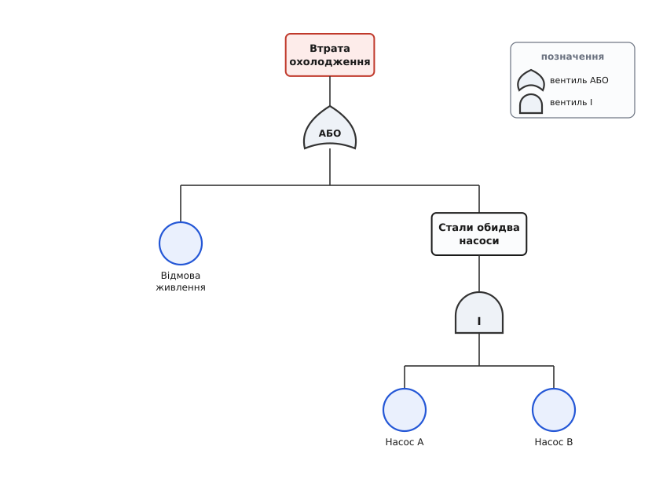
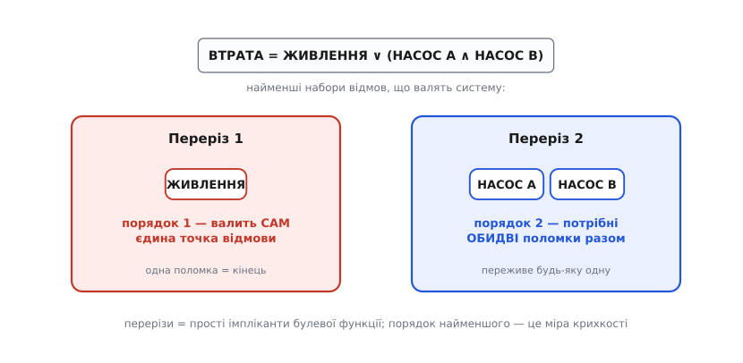

# Аналіз дерева відмов (FTA)

<preknowlist>
- [Булева алгебра](book:math/boolean-algebra) — операції І, АБО, НЕ й що таке булева функція від змінних; дерево відмов — це така функція, лише намальована.
- [Імовірність як міра непевності](book:math/probability-basics) — ймовірність події, незалежність, ймовірність об'єднання P(A або B); без цього не прочитати кількісний бік методу.
</preknowlist>

Є події, яких не можна дочекатися, щоб на них навчитися. Ядерний реактор, що втратив охолодження. Ракета, що стартувала без наказу. Літак, у якого одночасно замовкли всі канали керма. Звичайна інженерна перевірка спирається на спостереження: побудуй, увімкни, подивись, що зламалося, полагодь. Але тут ціна першого ж спостереження — і є та сама катастрофа, якої ти намагаєшся уникнути. Тому потрібен інший спосіб думати: не чекати біди, а **вивести** її наперед — розкласти на всі шляхи, якими вона могла б скластися з дрібніших, звичайних, поодинці терпимих поломок.

Саме це робить аналіз дерева відмов (англ. *fault tree analysis*, FTA). Метод бере одну **вершинну подію** (англ. *top event*) — ту саму катастрофу, якої не можна допустити, — і ставить питання, зворотне до інженерного інстинкту: не «що накоїть оця зламана деталь?», а «**якими способами взагалі можна дійти ось до цього?**». Відповідь розгортається вниз деревом: вершинна подія розпадається на комбінації простіших причин, ті — на ще простіші, і так до самого низу, де сидять окремі відмови окремих деталей, кожну з яких уже видно й можна оцінити числом.

Цим FTA дзеркальний до [FMEA](book:algorithms/fmea), що йде **знизу вгору** — перебирає кожен вузол і питає, до чого призведе його поломка. FTA іде **згори вниз**: бере готовий наслідок і розгалужує його до коренів. FMEA чудово ловить поодинокі відмови, але кепсько — збіги, коли система падає лише від двох поломок разом, а кожна окремо терпима. FTA народжений якраз для збігів: у ньому «мусить статися і те, і те одночасно» — це окрема, явно намальована конструкція.

## Дерево — це булева функція, намальована згори вниз

Придивімося, з чого дерево складено. На вершині — прямокутник вершинної події. Під ним — **логічний вентиль** (англ. *gate*), який каже, **як** комбінуються причини, що ведуть до цієї події. Вентилів по суті два, і вся мова дерева тримається на різниці між ними.

**Вентиль АБО** (англ. *OR*) вмикає свій вихід, якщо спрацював **хоч один** вхід. Це «або те, або те, або обидва» — будь-якої з причин досить, щоб подія над вентилем сталася. **Вентиль І** (англ. *AND*) вмикає вихід, лише якщо спрацювали **всі** входи разом. Це «і те, і те одночасно» — жодної причини поодинці не досить. Різниця між ними — це вся різниця між крихкістю й надлишковістю: подія під АБО стається легко (досить одного винуватця), подія під І — важко (мусять збігтися всі).

Унизу дерева, на листках, сидять **базові події** (англ. *basic events*) — елементарні відмови, які далі не розкладають: «насос став», «просіла напруга», «пробило запобіжник». Їх малюють кружечками. Між вершиною й листками можуть бути **проміжні події** — прямокутники зі своїми вентилями, проміжні наслідки, які самі є комбінацією нижчих причин.

Візьмімо конкретний приклад — систему охолодження з двома насосами про запас.


*Мова дерева на одному прикладі. Угорі — небажана подія «втрата охолодження». Її вентиль АБО каже: біда стається, якщо відмовило спільне живлення **або** стали обидва насоси. А «обидва насоси» — це вже вентиль І: замовкнути мусять і насос A, **і** насос B, бо кожен окремо тримає систему. Живлення сидить під АБО саме — воно спільне для обох насосів, тож його поодинока відмова валить усе.*

Тепер головне спостереження, заради якого метод узагалі належить до теорії складності. Якщо позначити кожну базову подію булевою змінною (1 — «відмовила», 0 — «ціла»), то **все дерево — це одна булева функція** вершинної події від цих змінних. Вентиль АБО — це диз'юнкція (∨), вентиль І — кон'юнкція (∧). Наше дерево читається як один вираз:

```
ВТРАТА = ЖИВЛЕННЯ  ∨  (НАСОС_A  ∧  НАСОС_B)
```

Дерево — просто зручна картинка для булевої формули; уся строгість — у формулі. Усе, що [булева алгебра](book:math/boolean-algebra) вміє робити з такими виразами, застосовне й до дерева відмов. І вся **складність** обчислень над деревом виявляється складністю роботи з булевими функціями, ні на йоту не меншою.

> 🔧 **Навіщо це.** Звівши дерево до формули, ти відв'язуєш аналіз від картинки. Дві геть різні на вигляд схеми можуть давати ту саму булеву функцію — а отже, однаково надійні, і немає сенсу сперечатися, яка «краща». І навпаки: акуратне перемноження дужок одразу показує, чи не заклав ти прихованої спільної причини, яку на малюнку не видно. Формула не бреше про структуру так, як може збрехати око.

## Якісний бік: мінімальні перерізи

Найцінніше дерево віддає ще до того, як у нього підставлять хоч одне число. Спитаймо: **які найменші набори поломок валять систему?** Такий набір називають **мінімальним перерізом** (англ. *minimal cut set*) — це найменша група базових подій, чия одночасна поява вмикає вершинну подію, і при цьому жодну з групи не можна викинути, не втративши цієї властивості.

Для нашого дерева перерізів рівно два. Перший — `{ЖИВЛЕННЯ}`: сама лише відмова живлення валить систему, більше нічого не треба. Другий — `{НАСОС_A, НАСОС_B}`: система падає, якщо стали обидва насоси разом. Ось і все — це вичерпний список способів програти.


*Перерізи одразу показують, де тонко. Одноелементний переріз `{живлення}` — це **єдина точка відмови** (англ. *single point of failure*): одна поломка, і кінець. Двоелементний `{насос A, насос B}` набагато безпечніший — щоб він спрацював, мусять збігтися дві незалежні поломки. Розмір найменшого перерізу — це чесна міра крихкості: система з перерізом розміру 1 беззахисна, хоч би якою складною вона виглядала.*

Порядок (розмір) перерізу — це і є структурна оцінка небезпеки, ще без імовірностей. Переріз розміру 1 кричить про єдину точку відмови; переріз розміру 2 означає, що система переживе будь-яку **одну** поломку зі своєї пари. Саме перерізи підказують, куди ставити [надлишковість](book:programming/redundancy): дублюючи те, що зараз стоїть одинаком, ти перетворюєш переріз розміру 1 на розмір 2 — і одна поломка перестає бути смертельною.

Тут ховається гарний місток до чистої математики. Мінімальні перерізи — це не що інше, як **прості імпліканти** булевої функції дерева: найкоротші кон'юнкції змінних, кожна з яких сама по собі гарантує одиницю на виході. Пошук перерізів — це та сама задача, що й [мінімізація логічних функцій](book:math/logic-minimization), лише в мові надійності. І та сама причина, з якої простих імплікантів може бути експоненційно багато, робить наступний, кількісний крок таким важким.

## Кількісний бік: коли перерізи незалежні

Тепер підставмо числа. Кожній базовій події припишемо **ймовірність відмови** — шанс, що на момент запиту деталь у зламаному стані. Ці числа беруть із польової статистики, з паспортної інтенсивності відмов, із того самого [FMEA](book:algorithms/fmea). Нехай:

```
p(ЖИВЛЕННЯ) = 0.001      (одна відмова на тисячу)
p(НАСОС_A)  = 0.01       (одна на сто)
p(НАСОС_B)  = 0.01
```

Коли дерево — справжнє дерево (кожна базова подія трапляється в ньому **рівно раз**), імовірність вершини рахується легко, знизу вгору, за двома шкільними правилами для незалежних подій:

```
вентиль І   (усі мусять збігтися):   P = p₁ · p₂ · … · pₙ
вентиль АБО (досить одного):         P = 1 − (1−p₁)·(1−p₂)·…·(1−pₙ)
```

Правило для І — пряме множення: незалежні події збігаються з добутком імовірностей. Правило для АБО зручніше рахувати «з іншого боку»: імовірність, що спрацював **хоч хтось**, — це одиниця мінус імовірність, що **не спрацював ніхто** (а «ніхто» — знову добуток, тепер уже ймовірностей уцілити). Пройдімо наше дерево:

**Приклад (втрата охолодження).** Знизу вгору, вентиль за вентилем.

```
І(НАСОС_A, НАСОС_B):   0.01 · 0.01                 = 0.0001
АБО(ЖИВЛЕННЯ, ↑):      1 − (1 − 0.001)·(1 − 0.0001)
                     = 1 − 0.999 · 0.9999
                     = 1 − 0.9989001              = 0.0010999 ≈ 0.0011
```

Висновок читається сам. Пара насосів після резервування дає внесок 0.0001 — дрібниця. А от спільне живлення зі своїм 0.001 тепер **головний винуватець**: воно в десять разів імовірніше за відмову обох насосів і майже цілком визначає підсумок. Якісний аналіз казав те саме без чисел (переріз `{живлення}` — розміру 1), а числа лише підтвердили, наскільки саме. Це типовий урок FTA: додав резервування в одному місці — і слабина переповзла на те, що лишилося одинаком.

Зауваж, як **дешево** це обійшлося: один прохід деревом, по одній арифметичній дії на вентиль. Для дерева з `n` вентилів — робота порядку `O(n)`, лінійна. Здавалося б, задача взагалі не варта згадки в розділі про складність. Але вся ця легкість трималася на одному тихому припущенні — що кожна базова подія трапляється в дереві лише раз. Варто йому впасти — і задача змінює клас.

## Стіна складності: спільні події

У реальних системах одна деталь часто впливає на кілька гілок одразу. Той самий блок живлення годує обидва «незалежні» канали; той самий давач заведений і в основну логіку, і в аварійну. У дереві така деталь з'являється **не раз** — це **спільна (повторювана) подія** (англ. *repeated event*). І тут лінійний прохід знизу вгору ламається, бо гілки, що діляться спільною подією, більше **не незалежні**: перемножувати їхні ймовірності не можна, вийде неправда.

Класичний приклад — система «2 з 3»: три однакові блоки, і система жива, поки працюють хоча б два. Вона падає, якщо відмовили будь-які **два** блоки. Мінімальних перерізів три:

```
ВТРАТА = (A ∧ B)  ∨  (B ∧ C)  ∨  (A ∧ C)
```

Кожен блок сидить одразу у двох перерізах — от вони, спільні події. Спокуса порахувати «як звикли», склавши ймовірності перерізів, дає неправильну відповідь, бо перерізи **перекриваються**: подія `A∧B` і подія `B∧C` можуть статися **водночас** (це коли відмовили всі троє — `A∧B∧C`), і наївна сума порахує цей випадок двічі. Правильна відповідь вимагає **формули включень-виключень** — додати одинарні, відняти перекриття пар, додати назад потрійне:

**Приклад (система «2 з 3», усі p = 0.01).**

```
Σ пар:        P(AB) + P(BC) + P(AC)     = 3 · (0.01)²        = 0.000300
− перекриття: усі попарні перетини = A∧B∧C = (0.01)³, їх три = 3 · 0.000001 = 0.000003
+ потрійне:   P(AB ∧ BC ∧ AC) = A∧B∧C   = (0.01)³           = 0.000001

P(ВТРАТА) = 0.000300 − 0.000003 + 0.000001 = 0.000298
```

Наївна сума перерізів дала б 0.000300 — трохи забагато. На трьох перерізах різниця копійчана, і виправлення дешеве. Але ось де криється прірва: у формулі включень-виключень для `m` перерізів **2ᵐ − 1 доданків**. Що більше перекровних перерізів, то більше членів, і в загальному дереві їхнє число росте **експоненційно**. Проста система «2 з 3» ще піддається олівцю; система на сотні спільних компонентів — уже ні.

Це не наша невдача з методом — це **вроджена складність задачі**. Обчислити точну ймовірність вершинної події для дерева зі спільними подіями — задача **#P-складна** (читається «шарп-пі»; клас [#P](book:algorithms/sharp-p-counting) — це задачі «**скільки** розв'язків?», що не легші за задачі «**чи існує** розв'язок?» класу NP). Строго це довів Леслі Валіант ще 1979 року: близька задача про надійність мережі — яка ймовірність, що граф із ненадійними ребрами лишиться зв'язним — виявилася **#P-повною**, тобто однією з найважчих у цьому класі.

Придивімося, **чому** саме важко, бо в цьому вся суть розділу. Перевірити **один** конкретний набір відмов — тривіально: підстав нулі й одиниці в булеву формулу дерева, пройди його знизу вгору, дізнайся за `O(n)`, чи впала система. А от **порахувати ймовірність** — це просумувати внесок **усіх** наборів, що валять систему, а таких наборів — до `2ⁿ` на `n` базових подій. Легко **перевірити** одну відповідь, нездійсненно дорого **перебрати чи зважено підрахувати всі**. Це та сама межа, що відділяє [задачу здійсненності SAT](book:math/boolean-satisfiability) — «чи існує набір, що вмикає функцію?» — від її рахункової сестри «#SAT» — «скільки таких наборів, і з якою сумарною вагою?». FTA-квантифікація — це якраз зважений #SAT, і тому вона впирається в ту саму стіну.

> 🔧 **Навіщо це.** Зрозуміти, що точна квантифікація #P-складна, — не абстракція, а практичний застережний знак. Він каже: не сподівайся на кнопку «порахуй точно» для великого дерева з купою спільних компонентів — її не існує ні в якому інструменті, скільки б грошей ти не заплатив, бо перешкода математична, а не інженерна. Замість цього свідомо обирай, чим пожертвувати: точністю (наближення), охопленням (обрізати рідкісні перерізи) чи впевненістю (статистична вибірка). Хто цього не знає, той місяцями чекає на розрахунок, який не завершиться ніколи.

## Як із цим живуть

Стіна складності не спиняє інженерів — вона змушує їх бути хитрішими. Три обхідні шляхи трапляються найчастіше, і кожен чимось платить за швидкість.

**Наближення рідкісних подій.** Коли ймовірності малі (а в надійності вони зазвичай крихітні), перекриття перерізів мізерні — ті самі відняті `0.000003` на тлі `0.000300`. Тоді просту **суму ймовірностей мінімальних перерізів** беруть як оцінку зверху: вона трохи завищує (перекриття пораховані двічі), зате рахується миттєво й ніколи не применшує ризику, а для безпеки помилятися вгору — правильний бік. Це робоча конячка практичної FTA.

**Двійкові діаграми рішень.** Коли треба **точно**, найкраще працює [BDD](book:algorithms/binary-decision-diagram) — двійкова діаграма рішень. Ідея гарна: булеву функцію дерева переписують у діаграму, де кожен шлях від кореня до листка відповідає **взаємовиключному** набору станів. А для взаємовиключних випадків імовірності просто **додаються** без жодних включень-виключень — тож щойно діаграму збудовано, точна ймовірність вершини знімається одним лінійним проходом. Уся складність переїхала в **розмір діаграми**: у найгіршому разі він експоненційний (інакше ми б розв'язали #P-складну задачу дешево, а так не буває), але для багатьох реальних дерев діаграма виходить напрочуд компактною. Цей підхід приніс у надійність Антуан Розі 1993 року, і він досі — золотий стандарт точного розрахунку.

**Статистична вибірка (Монте-Карло).** Найгрубіший, зате завжди застосовний шлях: багато разів киньте «монетку» кожній базовій події за її ймовірністю, щоразу перевірте формулу дерева й порахуйте частку кидків, де система впала. Ця частка збігається до істинної ймовірності. Метод байдужий до спільних подій і до розміру дерева, але платить **точністю**: щоб надійно спіймати подію з імовірністю 10⁻⁶, потрібні мільйони прогонів, і кожна зайва значуща цифра коштує вдесятеро більше кидків.


*Дві дороги квантифікації. Ліворуч — щаслива: дерево без спільних подій рахується знизу вгору за `O(n)`. Праворуч — реальна: спільна подія зв'язує гілки, точний розрахунок стає #P-складним, і доводиться вибирати обхід — швидку оцінку зверху сумою перерізів, точний BDD (поки діаграма не розрослася) або всеїдне, але повільне Монте-Карло. Стіна посередині — не поганий інструмент, а межа обчислюваного.*

Сам робочий конвеєр — від пошуку мінімальних перерізів [алгоритмом MOCUS](book:algorithms/fault-tree-analysis/proj-fault-tree-eval.md) до точної квантифікації через BDD — уміщається в кількасот рядків коду; варто побачити його цілком, щоб відчути, де саме ховається експонента й як BDD її приборкує. А чому квантифікація дерев зі спільними подіями еквівалентна зваженому #SAT і звідки береться #P-повнота — це [окрема історія про межу підрахунку](book:algorithms/fault-tree-analysis/math-sharp-p-hardness.md), варта того, щоб пройти доведення власноруч.

## Звідки це взялося

Метод народився не в академії, а на військовій службі. 1962 року в Bell Telephone Laboratories інженер Г. А. Вотсон на замовлення відділу балістичних систем ВПС США шукав спосіб довести, що система керування пуском міжконтинентальної ракети «Мінітмен» не запустить її випадково. З цієї потреби — гарантувати, що страшне **не** станеться, — і виросло дерево відмов. Далі метод підхопив Boeing (передусім Девід Гаасл), а по-справжньому дорослим його зробила ядерна енергетика: гучний [«Звіт про безпеку реакторів» WASH-1400](book:algorithms/fault-tree-analysis/hist-fta.md) 1975 року під керівництвом Нормана Расмуссена вперше поставив імовірнісну оцінку ризику всієї станції на дерева відмов — і став заразом взірцем методу й уроком, як легко його показники роз'їжджаються, коли бракує даних.

---

Підсумок. Аналіз дерева відмов бере одну катастрофу й розкладає її згори вниз на комбінації звичайних поломок, з'єднані вентилями І та АБО, — а це означає, що все дерево є однією булевою функцією. Читати його можна на трьох рівнях. **Структурно** — мінімальні перерізи показують найменші набори відмов, що валять систему, і одразу викривають єдині точки відмови. **Кількісно, у легкому випадку** — коли гілки незалежні, ймовірність вершини знімається лінійним проходом угору. **Кількісно, у чесному випадку** — коли деталі спільні для кількох гілок, точний розрахунок стає #P-складним, бо перетворюється на зважений підрахунок усіх катастрофічних наборів, і доводиться обходити цю стіну оцінками, діаграмами рішень або статистикою. У цьому й полягає подвійна природа FTA: практичний спосіб побачити, як велика біда збирається з малих, — і водночас чиста ілюстрація того, що поєднати незалежні ризики легко, а поєднати спільні **точно** — одна з найважчих задач підрахунку, які ми знаємо.
