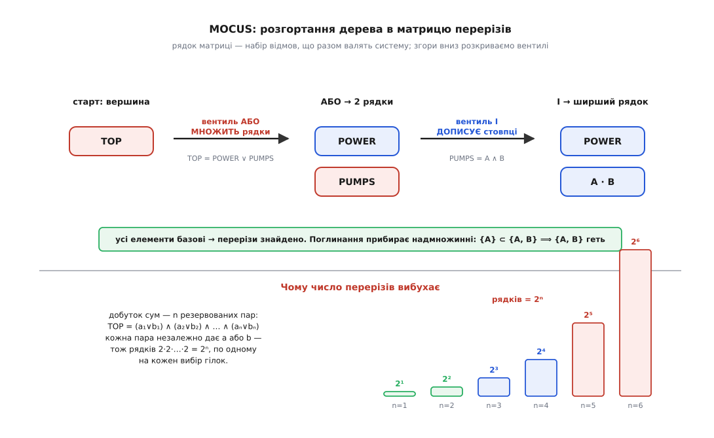

# ⚙️ Конвеєр FTA у коді: MOCUS шукає перерізи, BDD рахує точно

Дерево відмов ми звели до булевої функції — тепер треба зробити з нею дві практичні речі, і це рівно дві половини робочого конвеєра. Перша **читає структуру**: перелічує мінімальні перерізи, найменші набори відмов, що валять систему. Друга **дає число**: точну ймовірність вершинної події. Обидві впираються в ту саму експоненційну стіну, але підходять до неї з різних боків — і найкраще видно, де саме ховається експонента, коли конвеєр стоїть перед очима цілком, кількасот рядків справжнього коду. Зберімо його від початку до кінця й простежмо, як діаграма рішень цю експоненту приборкує (а де не може — чесно віддає її назад).

Домовмося про спільну модель даних, щоб обидві половини читали те саме дерево. Вентиль — це його тип (`І`/`АБО`) і список входів; **базова подія — це просто ім'я, якого немає серед вентилів**. Наскрізний приклад лишається той самий: система охолодження, `TOP = POWER ∨ (PUMP_A ∧ PUMP_B)` — спільне живлення або обидва насоси разом.

## Половина перша: MOCUS розгортає дерево в перерізи

Найстаріший і досі найпоширеніший спосіб дістати перерізи — алгоритм **MOCUS** (англ. *method of obtaining cut sets*), який Джеррі Фассел і Білл Везелі описали 1972 року й який тепер сидить ядром у безлічі інструментів FTA. Ідея тримається на одному спостереженні, простому до банальності: **вентиль АБО збільшує кількість перерізів, вентиль І — їхній розмір**. Це усталений, багато разів перевідкритий факт, і на ньому будується вся механіка.

Уяви **матрицю перерізів**: таблицю, кожен рядок якої — набір подій, чия одночасна поява (поки що) веде до вершини. Почни з єдиного рядка `{TOP}` і розкривай згори вниз: бери в якомусь рядку символ-вентиль і заміняй його на входи за одним правилом.

- **Вентиль АБО** — це «досить будь-якого з входів». Кожен вхід дає **свій окремий спосіб** дійти до події, тож рядок **розмножується** на стільки нових рядків, скільки в АБО входів. АБО **множить рядки**.
- **Вентиль І** — це «потрібні всі входи разом». Усі вони мусять сидіти в **одному** наборі, тож вентиль у рядку заміняється **всіма своїми входами одразу**, той самий рядок лише ширшає. І **дописує стовпці**.

Продовжуй, доки в жодному рядку не лишиться вентиля — самі базові події. Кожен такий рядок — це переріз-кандидат. Чому заміни зберігають зміст? Бо рядок увесь час означає кон'юнкцію своїх подій, а розкриття вентиля — це буквально підстановка його булевого означення (диз'юнкції для АБО, кон'юнкції для І). Уся процедура — не що інше, як розкриття дужок булевого виразу дерева до **диз'юнктивної нормальної форми**: суми добутків, де кожен добуток і є переріз.


*Розгортання згори вниз. Матриця стартує з самої вершини. АБО розмножує рядки (кожен вхід — окремий переріз-кандидат), І дописує стовпці (усі входи в один рядок). Коли всі елементи базові — перерізи знайдено, лишається прибрати немінімальні. Унизу — джерело експоненти: якщо дерево є добутком `n` незалежних сум, кожен вентиль АБО множить число рядків удвічі, і на виході їх `2ⁿ`.*

Лишається одна дія — **поглинання** (англ. *absorption*). Розкриття дужок легко родить набори, що містять усередині менший переріз: якщо система падає вже від `{A}`, то роздутий `{A, B}` — не окремий спосіб програти, а той самий, обтяжений зайвиною. Мінімальний переріз — той, з якого не можна викинути жодної події; тож із усіх кандидатів лишаємо тільки ті, всередині яких немає меншого вже знайденого. Це рівно пошук **простих імплікантів** булевої функції — та сама машинерія, що й [мінімізація логічних функцій](book:math/logic-minimization): найкоротші кон'юнкції, кожна з яких сама вмикає вихід.

> 🔧 **Навіщо це.** Порядок найменшого перерізу — найдешевша чесна оцінка крихкості, яку взагалі можна дістати з проєкту: переріз розміру 1 кричить про єдину точку відмови ще до того, як хтось назве бодай одну ймовірність. Тому MOCUS запускають найпершим — він видає карту слабин, за якою вирішують, куди ставити резервування, і робить це без жодного числа.

Ось повний робочий MOCUS. Дерево — словник вентилів; `mocus` веде список рядків, що ще містять вентилі (черга роботи), і копить готові перерізи; `minimal` робить поглинання.

:::tabs
```py
# Дерево: словник вентилів. Базова подія — ім'я, якого НЕМА серед ключів.
tree = {
    "TOP":   ("or",  ["POWER", "PUMPS"]),
    "PUMPS": ("and", ["PUMP_A", "PUMP_B"]),
}

def mocus(tree, top):
    """Матриця перерізів. АБО множить рядки, І дописує стовпці."""
    work = [frozenset([top])]          # рядки, де ще лишилися вентилі
    cuts = set()                       # рядки з самих базових подій
    while work:
        row = work.pop()
        gate = next((s for s in row if s in tree), None)
        if gate is None:               # у рядку самі базові події → переріз-кандидат
            cuts.add(row)
            continue
        rest = row - {gate}
        kind, inputs = tree[gate]
        if kind == "and":              # І: усі входи в ТОЙ САМИЙ рядок (ширший набір)
            work.append(rest | set(inputs))
        else:                          # АБО: окремий рядок на КОЖЕН вхід (більше наборів)
            for g in inputs:
                work.append(rest | {g})
    return cuts

def minimal(cuts):
    """Поглинання: лишити тільки набори, всередині яких нема меншого перерізу."""
    out = []
    for c in sorted(cuts, key=len):        # від найменших до найбільших
        if not any(m <= c for m in out):   # c не містить уже знайденого перерізу?
            out.append(c)
    return out

for c in minimal(mocus(tree, "TOP")):
    print(sorted(c))
# ['POWER']
# ['PUMP_A', 'PUMP_B']
```
```cpp
#include <bits/stdc++.h>
using namespace std;

struct Gate { bool is_and; vector<string> in; };
using Tree = map<string, Gate>;
using Cut  = set<string>;                       // переріз = набір імен

set<Cut> mocus(const Tree& tree, const string& top) {
    vector<Cut> work{ Cut{top} };               // рядки з вентилями (черга роботи)
    set<Cut> cuts;                              // рядки з самих базових подій
    while (!work.empty()) {
        Cut row = move(work.back()); work.pop_back();
        string gate;
        for (const auto& s : row)
            if (tree.count(s)) { gate = s; break; }
        if (gate.empty()) { cuts.insert(move(row)); continue; }   // переріз-кандидат
        row.erase(gate);
        const Gate& g = tree.at(gate);
        if (g.is_and) {                         // І — дописати стовпці
            row.insert(g.in.begin(), g.in.end());
            work.push_back(move(row));
        } else {                                // АБО — розмножити рядки
            for (const auto& s : g.in) {
                Cut r = row; r.insert(s);
                work.push_back(move(r));
            }
        }
    }
    return cuts;
}

vector<Cut> minimal(const set<Cut>& cuts) {
    vector<Cut> all(cuts.begin(), cuts.end());
    stable_sort(all.begin(), all.end(),
                [](const Cut& a, const Cut& b){ return a.size() < b.size(); });
    vector<Cut> out;                            // поглинання
    for (const auto& c : all) {
        bool dominated = false;
        for (const auto& m : out)               // m ⊆ c  ⇒  c немінімальний
            if (includes(c.begin(), c.end(), m.begin(), m.end())) { dominated = true; break; }
        if (!dominated) out.push_back(c);
    }
    return out;
}

int main() {
    Tree tree = {
        {"TOP",   {false, {"POWER", "PUMPS"}}},
        {"PUMPS", {true,  {"PUMP_A", "PUMP_B"}}},
    };
    for (const auto& c : minimal(mocus(tree, "TOP"))) {
        for (const auto& s : c) cout << s << ' ';
        cout << '\n';
    }
    // POWER
    // PUMP_A PUMP_B
}
```
:::

Дерево охолодження віддає рівно два перерізи — `{POWER}` і `{PUMP_A, PUMP_B}`, — і це вичерпний список способів програти. Підсунь замість нього систему «2 з 3» (`TOP = (A∧B) ∨ (B∧C) ∨ (A∧C)`), і той самий код видасть три перерізи розміру 2, кожен блок у двох із них — от де народжуються спільні події.

А тепер підстав дерево, що є **добутком сум**: `TOP = (a₁∨b₁) ∧ (a₂∨b₂) ∧ … ∧ (aₙ∨bₙ)` — `n` резервованих пар, система падає, коли в кожній парі відмовив хоч один бік. Кожен вентиль АБО помножить число рядків удвічі, і на виході перерізів буде `2ⁿ`: усі способи вибрати по одному винуватцю з кожної пари. При `n = 20` це вже мільйон рядків, при `n = 40` — трильйон. MOCUS не гальмує через невдалу реалізацію — він упирається в те, що **самих перерізів експоненційно багато**, і жоден алгоритм не перелічить швидше, ніж їх існує. Це та сама стіна складності, тільки показана з якісного боку: ще без ймовірностей, самим лише числом наборів.

## Половина друга: BDD рахує ймовірність точно й одним проходом

Здавалося б, перерізи вже все дають — склади їхні ймовірності, та й по всьому. Але щойно дерево має спільні події, ця сума **бреше**. У «2 з 3» три перерізи по `0.1²`, наївна сума — `0.030`; а точна відповідь `0.028`, бо перерізи `{A,B}` і `{B,C}` можуть спрацювати водночас (коли відмовили всі троє), і сума рахує цей світ двічі. Чесно виправити перекриття — це включення-виключення з `2ᵐ` доданками на `m` перерізів: знову експонента, тепер із кількісного боку.

Вихід придумали Олів'є Кудер, Жан-Крістоф Мадр і, окремо для надійності, Антуан Розі 1993 року: не рахувати по перерізах узагалі, а переписати булеву функцію в **двійкову діаграму рішень** ([BDD](book:algorithms/binary-decision-diagram)), де ймовірність знімається одним лінійним проходом. Секрет — у формі діаграми.

В основі — **розклад Шеннона**: будь-яку булеву функцію можна розщепити по одній змінній на дві простіші, взявши її [кофактори](book:math/shannon-expansion) — те, у що функція перетворюється, коли змінну зафіксувати нулем чи одиницею:

```
f = (¬x · f|ₓ₌₀)  ∨  (x · f|ₓ₌₁)
```

Роби так рекурсивно, змінну за змінною **в одному наперед заданому порядку**, — і функція розкладеться в дерево рішень: у кожному вузлі питаємо про одну змінну, гілка `0` веде в піддерево «змінна ціла», гілка `1` — «змінна відмовила». Саме по собі це дерево завбільшки `2ⁿ` — нічого не виграли. Виграш дають **два стискання**, що обертають дерево на компактний орієнтований граф (їх увів Рендал Браянт 1986 року, зробивши BDD канонічною структурою):

1. **Прибрати надлишкові вузли.** Якщо обидві гілки вузла ведуть в одне й те саме — вузол нічого не вирішує, викидаємо його, лишаємо ту гілку.
2. **Хеш-консинг** — не створювати двох однакових вузлів. Тримаємо таблицю `(змінна, гілка-0, гілка-1) → вузол`; перш ніж зробити новий вузол, дивимося, чи такий уже є, і **ділимося** наявним. Це просто [мемоізація](book:algorithms/memoization) побудови: ізоморфні піддерева зливаються в один спільний, і граф із дерева на `2ⁿ` листків усихає до жмені вузлів.

І тоді — головний подарунок. У кожному вузлі гілки `0` і `1` **взаємовиключні за побудовою**: змінна або ціла, або відмовила, третього нема. Ймовірність взаємовиключних випадків просто **додається**, без жодних поправок на перекриття. Тому точна ймовірність вершини знімається одним проходом знизу вгору:

```
P(термінал 1) = 1,   P(термінал 0) = 0
P(вузол на змінній v) = (1 − pᵥ) · P(гілка-0)  +  pᵥ · P(гілка-1)
```

> 🔧 **Навіщо це.** Уся хитрість спільних подій розчиняється саме тут. Наївна сума перерізів бреше, бо перерізи **перекриваються**; включення-виключення чесне, але коштує `2ᵐ`. BDD ж не має чого перекривати: розклад по змінній ділить світ на дві половини, що не мають спільних станів, тож ймовірності лягають у просту суму. Спільна подія, заведена в кілька гілок, проходиться в діаграмі **один раз** і автоматично враховується в усіх — жодного подвійного рахунку, жодних поправок. Ось чому BDD — золотий стандарт точного розрахунку.


*Ймовірність одним проходом. Кожен вузол питає про одну змінну: пунктир — «ціла» (гілка 0), суцільне — «відмовила» (гілка 1). Знизу вгору `P(вузол) = (1−p)·P(0) + p·P(1)`; гілки взаємовиключні, тож просто складаються. Для охолодження проходом угору спливають `0.01 → 0.0001 → 0.0011`. Праворуч — ахіллесова п'ята BDD: розмір діаграми залежить від порядку змінних, і той самий приклад коштує 120 вузлів за доброго порядку й 3069 за поганого.*

Ось повний BDD-рушій: побудова діаграми з дерева через операцію `apply` (рекурсія за розкладом Шеннона з мемоізацією) і зняття ймовірності. Обидві таблиці — `unique` (хеш-консинг вузлів) і `memo` (мемо `apply`) — це те, що не дає рекурсії розсипатися в експоненту на кожному кроці.

:::tabs
```py
class BDD:
    def __init__(self, order):
        self.rank = {v: i for i, v in enumerate(order)}   # порядок змінних
        self.nodes = {}          # id -> (var, lo, hi)
        self.unique = {}         # (var, lo, hi) -> id   ← хеш-консинг
        self.memo = {}           # (op, a, b)   -> id    ← мемо apply
        self.next_id = 2         # 0 і 1 — термінали FALSE / TRUE

    def mk(self, var, lo, hi):
        if lo == hi:                       # надлишковий вузол — гілки збіглися
            return lo
        key = (var, lo, hi)
        if key in self.unique:             # ізоморфний вузол уже є — поділитися ним
            return self.unique[key]
        nid = self.next_id; self.next_id += 1
        self.nodes[nid] = (var, lo, hi)
        self.unique[key] = nid
        return nid

    def var(self, name):                   # BDD однієї події: ціла → 0, відмовила → 1
        return self.mk(self.rank[name], 0, 1)

    def apply(self, op, a, b):             # об'єднати дві діаграми вентилем op
        if op == "and":
            if a == 0 or b == 0: return 0
            if a == 1: return b
            if b == 1: return a
        else:  # or
            if a == 1 or b == 1: return 1
            if a == 0: return b
            if b == 0: return a
        if a == b: return a
        if a > b: a, b = b, a              # комутативність → більше влучань у мемо
        if (op, a, b) in self.memo:
            return self.memo[(op, a, b)]
        va, vb = self.nodes[a][0], self.nodes[b][0]
        top = min(va, vb)                  # спільна верхня змінна
        def cof(n, v):                     # кофактори по змінній v
            if n > 1 and self.nodes[n][0] == v:
                return self.nodes[n][1], self.nodes[n][2]
            return n, n                    # v нема в n — обидва кофактори = n
        a0, a1 = cof(a, top); b0, b1 = cof(b, top)
        r = self.mk(top, self.apply(op, a0, b0), self.apply(op, a1, b1))
        self.memo[(op, a, b)] = r
        return r

    def probability(self, root, p):
        """Один прохід: P(вузол) = (1−p)·P(гілка-0) + p·P(гілка-1)."""
        memo = {0: 0.0, 1: 1.0}
        def rec(n):
            if n in memo: return memo[n]
            v, lo, hi = self.nodes[n]
            memo[n] = (1 - p[v]) * rec(lo) + p[v] * rec(hi)
            return memo[n]
        return rec(root)

def build(bdd, tree, node):                # згорнути дерево у BDD знизу вгору
    if node not in tree:
        return bdd.var(node)
    kind, inputs = tree[node]
    r = build(bdd, tree, inputs[0])
    for child in inputs[1:]:
        r = bdd.apply(kind, r, build(bdd, tree, child))
    return r

tree  = {"TOP": ("or", ["POWER", "PUMPS"]), "PUMPS": ("and", ["PUMP_A", "PUMP_B"])}
order = ["POWER", "PUMP_A", "PUMP_B"]
prob  = {"POWER": 0.001, "PUMP_A": 0.01, "PUMP_B": 0.01}

bdd  = BDD(order)
root = build(bdd, tree, "TOP")
print(bdd.probability(root, [prob[v] for v in order]))   # 0.0010999
```
```cpp
#include <bits/stdc++.h>
using namespace std;

struct BDD {
    struct Node { int var, lo, hi; };
    unordered_map<string,int> rank;
    vector<Node> nodes;                          // nodes[id]; 0,1 — термінали
    map<array<int,3>,int> uniq;                  // (var,lo,hi) -> id   ← хеш-консинг
    map<array<int,3>,int> memo;                  // (op,a,b)   -> id    ← мемо apply

    explicit BDD(const vector<string>& order) {
        for (int i = 0; i < (int)order.size(); ++i) rank[order[i]] = i;
        nodes.push_back({-1,0,0});               // id 0 = FALSE
        nodes.push_back({-1,1,1});               // id 1 = TRUE
    }
    int mk(int var, int lo, int hi) {
        if (lo == hi) return lo;                 // надлишковий вузол
        array<int,3> key{var, lo, hi};
        if (auto it = uniq.find(key); it != uniq.end()) return it->second;
        int id = nodes.size();
        nodes.push_back({var, lo, hi});
        uniq[key] = id;
        return id;
    }
    int var(const string& name) { return mk(rank.at(name), 0, 1); }

    int apply(int op, int a, int b) {            // op: 0 = І, 1 = АБО
        if (op == 0) { if (a==0||b==0) return 0; if (a==1) return b; if (b==1) return a; }
        else         { if (a==1||b==1) return 1; if (a==0) return b; if (b==0) return a; }
        if (a == b) return a;
        if (a > b) swap(a, b);                   // комутативність
        array<int,3> key{op, a, b};
        if (auto it = memo.find(key); it != memo.end()) return it->second;
        int top = min(nodes[a].var, nodes[b].var);
        auto cof = [&](int n, int v) -> pair<int,int> {
            if (n > 1 && nodes[n].var == v) return {nodes[n].lo, nodes[n].hi};
            return {n, n};
        };
        auto [a0,a1] = cof(a, top);
        auto [b0,b1] = cof(b, top);
        int r = mk(top, apply(op, a0, b0), apply(op, a1, b1));
        return memo[key] = r;
    }
    double probability(int root, const vector<double>& p) {
        unordered_map<int,double> mp{{0, 0.0}, {1, 1.0}};
        function<double(int)> rec = [&](int n) -> double {
            if (auto it = mp.find(n); it != mp.end()) return it->second;
            const Node& d = nodes[n];
            return mp[n] = (1 - p[d.var]) * rec(d.lo) + p[d.var] * rec(d.hi);
        };
        return rec(root);
    }
};

struct Gate { bool is_and; vector<string> in; };
using Tree = map<string, Gate>;

int build(BDD& bdd, const Tree& tree, const string& node) {
    auto it = tree.find(node);
    if (it == tree.end()) return bdd.var(node);
    int op = it->second.is_and ? 0 : 1;
    const auto& in = it->second.in;
    int r = build(bdd, tree, in[0]);
    for (size_t i = 1; i < in.size(); ++i)
        r = bdd.apply(op, r, build(bdd, tree, in[i]));
    return r;
}

int main() {
    Tree tree = {
        {"TOP",   {false, {"POWER", "PUMPS"}}},
        {"PUMPS", {true,  {"PUMP_A", "PUMP_B"}}},
    };
    vector<string> order = {"POWER", "PUMP_A", "PUMP_B"};
    BDD bdd(order);
    int root = build(bdd, tree, "TOP");
    vector<double> p = {0.001, 0.01, 0.01};      // за порядком змінних
    printf("%.7f\n", bdd.probability(root, p));  // 0.0010999
}
```
:::

Для охолодження — `0.0010999`, точнісінько як дав ручний прохід угору по вентилях. Але тепер підсунь «2 з 3» зі спільними подіями: той самий `probability` видасть `0.028` при `p = 0.1` і `0.000298` при `p = 0.01` — **точні** значення, які інакше довелося б добувати включенням-виключенням. BDD їх дає одним проходом і навіть не помічає, що події спільні: розклад Шеннона розв'язав перекриття сам, самою своєю формою.

## Складність і пастки

Здавалося б, BDD переміг стіну — точна відповідь лінійним проходом. Але придивися: прохід лінійний **за розміром діаграми**, а розмір ми обійшли мовчанкою. Якби діаграма завжди виходила малою, ми б розв'язали [#P-складну](book:algorithms/sharp-p-counting) задачу дешево — а цього не буває. Отже, десь захована та сама експонента. Вона в **порядку змінних**.

Той самий приклад — `n` резервованих пар, `TOP = (a₁∧b₁) ∨ … ∨ (aₙ∧bₙ)` — за доброго порядку (переплести пару: `a₁ b₁ a₂ b₂ …`) дає діаграму, що росте поліноміально; за поганого (усі `a`, потім усі `b`) — вибухає майже як `3·2ⁿ`. Виміряти легко тим самим кодом, дописавши `len(bdd.nodes)`:

```
n = 10 пар    добрий порядок:  120 вузлів     поганий: 3069 вузлів
              обидва дають ту саму ймовірність 0.0956 — різниться лише РОЗМІР
```

Це не вада реалізації, а фундаментальний факт, який довів Браянт: у одних порядків BDD лінійна, в інших — експоненційна, для тієї самої функції. #P-стіна не зникла — BDD **переселив** її з часу обчислення в розмір діаграми. Для багатьох реальних дерев це велика перемога (структура з інженерії часто дає добрий порядок сама собою, і діаграма виходить напрочуд компактною), але гарантії немає: знайти оптимальний порядок — теж важка задача, і на злих деревах діаграма розростається так само нездоланно, як росла б формула включень-виключень.

> 🔧 **Навіщо це.** Практичний висновок жорсткий: кнопки «порахуй точно» для будь-якого дерева не існує в жодному інструменті. Замість неї є вибір, чим пожертвувати. Точний BDD — поки діаграма тримається малою; коли роздувається, її обрізають евристикою впорядкування (порядок обходом дерева в глибину часто добрий) або динамічним пересіванням змінних. Не помогло — переходь на безпечну оцінку зверху (проста сума перерізів) чи на статистичну вибірку. Розуміти, **де** твоє дерево вдариться об стіну, — і є половина інженерної роботи.

Головні пастки конвеєра, кожна з механізмом:

- **Спільні (повторювані) події.** Найпідступніша. Проста сума ймовірностей перерізів завищує відповідь, бо перерізи ділять базові події й можуть спрацювати водночас — те саме `0.030` замість `0.028`. Не лікуй це власноруч правкою суми: або чесне включення-виключення (`2ᵐ` доданків), або BDD, який розв'язує перекриття формою й дає точне число одним проходом.
- **Забуте поглинання.** Пропустиш `minimal` — і немінімальний `{A, B}` залишиться поряд із `{A}`, роздуваючи список перерізів, а з ним і будь-яку похідну оцінку (важливість подій, суму перерізів). Перерізи без поглинання — це не мінімальні перерізи, а сира ДНФ.
- **Вибух діаграми за поганого впорядкування.** Розібраний вище: та сама функція, той самий результат, але поганий порядок роздуває BDD експоненційно. Ніколи не будуй велику діаграму на першому-ліпшому порядку змінних — почни з порядку, підказаного структурою дерева.
- **Спокуса перелічити всі перерізи «про всяк випадок».** На добутку сум їх `2ⁿ`; спроба виписати їх усі покладе інструмент ще до квантифікації. Коли перерізів забагато, їх **усікають** за порядком чи внеском — а точну ймовірність усе одно беруть із BDD, який квантифікує, не перелічуючи перерізів наодинці.

Зберімо конвеєр у ціле. Перша половина, MOCUS, **читає структуру**: розгортає дерево в перерізи розкриттям дужок до ДНФ — і може вибухнути числом самих перерізів. Друга половина, BDD, **дає число**: точну ймовірність лінійним проходом по діаграмі, взаємовиключність гілок дарує просту суму замість включень-виключень — і може вибухнути розміром діаграми за поганого порядку змінних. Експонента, як бачиш, **зберігається**: обидві половини впираються в ту саму #P-стіну, тільки одна ловить її в кількості перерізів, а друга — у розмірі діаграми. Увесь фокус інженерної квантифікації FTA — обрати те подання, у якому конкретне реальне дерево лишається малим, а де жодне не рятує — свідомо відступити на оцінку зверху чи вибірку. Кількасот рядків коду, і вся драма складності видно в тому єдиному місці, де кожна половина починає гальмувати.
