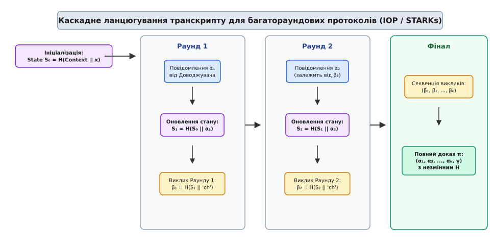
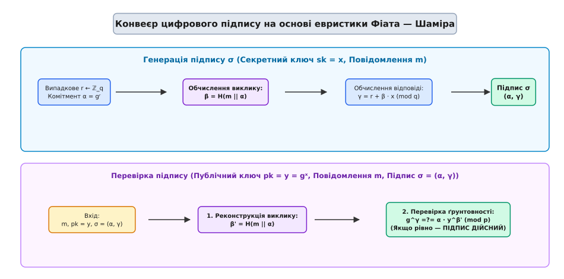
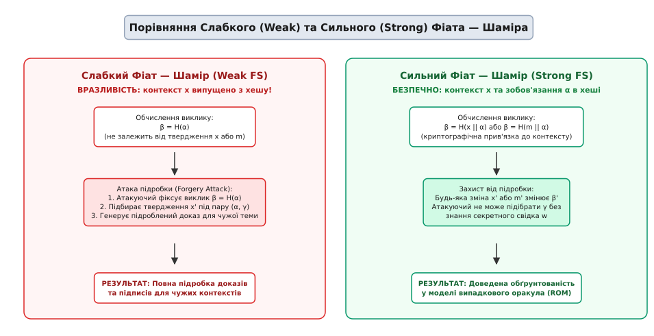

# Евристика Фіата — Шаміра: перетворення інтерактивних доведень на неінтерактивні підписи

<preknowlist>
- [Асимптотична складність](book:algorithms/asymptotic-complexity) — поняття поліноміального часу та асимптотичних оцінок.
- [Ігри Артура — Мерліна](book:algorithms/arthur-merlin-games) — публічні монети, інтерактивні протоколи доведення, повнота та обґрунтованості.
- [Імовірнісний клас BPP](book:algorithms/bpp) — імовірнісні алгоритми, поліномний час та обмежена двостороння помилка.
- [NP-повнота](book:algorithms/np-completeness) — сертифікати, відношення верифікації та складності.
</preknowlist>

Розподілені мережеві системи, криптографічні протоколи та асинхронні канали зв'язку вимагають верифікації математичних тверджень у ситуаціях, коли сторона, що перевіряє, перебуває в режимі офлайн або взагалі не існувала на момент формування доказу. Інтерактивні протоколи доведення знання (Interactive Proof Systems) та ігри з публічними монетами вимагають постійної синхронної взаємодії в реальному часі: верифікатор повинен згенерувати випадковий виклик, надіслати його доводжувачу та дочекатися негайної відповіді. Якщо верифікатор недоступний, мережа має високі затримки або підпис передається в електронному листі чи блоці чейну, інтерактивний діалог стає неможливим. На спробі реалізувати неінтерактивну автентифікацію без передачі секретного ключа тривалий час зупинявся розвиток асиметричної криптографії.

У 1986 році Амос Фіат та Аді Шамір запропонували революційну обчислювальну евристику, яка повністю усунула потребу в живому верифікаторі. Ідея полягала у вилученні другого раунду діалогу — випадкового виклику верифікатора — та заміні його на результат криптографічної хеш-функції, обчисленої від першого повідомлення доводжувача та контексту твердження. Оскільки криптографічна хеш-функція діє як детерміноване, але псевдовипадкове та непередбачуване відображення, доводжувач не здатний передбачити виклик заздалегідь або підібрати вхідні дані так, щоб отримати вигідний результат. **Евристика Фіата — Шаміра** (Fiat-Shamir Transform) стала фундаментальним мостом, що перетворює будь-який інтерактивний Σ-протокол з публічними монетами на неінтерактивне доведення з нульовим розголошенням (NIZK) або на стійку схему цифрового підпису.


*Рис. 1. Перетворення інтерактивного 3-раундового протоколу з публічними монетами на неінтерактивний доказ за допомогою хеш-функції.*

## 1. Інтерактивний фундамент: структура 3-раундового Σ-протоколу

Щоб осягнути математичний механізм перетворення Фіата — Шаміра, необхідно детально розглянути структуру класичного 3-раундового інтерактивного протоколу (відомого в криптографічній літературі як Σ-протокол). Назва цієї категорії протоколів походить від грецької літери Σ, траєкторія якої візуально відображає три послідовні зигзагоподібні кроки обміну повідомленнями між двома учасниками обчислювальної мережі.

Нехай доводжувач `P` (Prover) прагне довести верифікатору `V` (Verifier), що він володіє секретним свідком `w` для публічного твердження `x` (наприклад, знає секретний ключ `w = x_sk` для публічного ключа `y = g^(x_sk)`). Змістовний діалог між учасниками складається з трьох послідовних фаз:

1. **Фаза зобов'язання (Commitment, α):** Доводжувач генерує свіже випадкове значення (одноразове число, nonce) `r` з відповідної алгебраїчної множини та обчислює початкове зобов'язання `α = P1(x, w; r)`. Доводжувач надсилає `α` верифікатору. Це повідомлення криптографічно «заморожує» випадковий вибір доводжувача до того, як він дізнається запит верифікатора.
2. **Фаза виклику (Challenge, β):** Верифікатор незалежно підкидає ідеальні випадкові монети та надсилає доводжувачу випадковий бітовий рядок `β` довжини `k` біт, обраний абсолютно рівномірно з множини можливих викликів `K = {0, 1}^k`.
3. **Фаза відповіді (Response, γ):** Доводжувач, отримавши виклик `β`, обчислює фінальну відповідь `γ = P2(x, w, r, β)` та надсилає її верифікатору.
4. **Фаза підсумкової перевірки (Verification):** Верифікатор обчислює детермінований предикат `V(x, α, β, γ) ∈ {0, 1}`. Якщо `V = 1`, доказ вважається прийнятим.

Властивість непередбачуваної випадковості монет верифікатора є критично важливою для гарантії обґрунтованості (soundness). Якщо необознаний доводжувач (атакуючий), який НЕ володіє свідком `w`, намагається підробити доказ, він може побудувати алгебраїчно коректну відповідь `γ` лише для ОДНОГО конкретного виклику `β`. Якщо `β` обирається верифікатором після отримання `α`, ймовірність того, що вгаданий атакуючим виклик збіжиться з реальним вибором верифікатора, дорівнює `1 / |K| = 2^(-k)`. При розмірі виклику `k = 128` ця ймовірність є нехтовно малою (`2^(-128)`).

Однак у цій моделі верифікатор обов'язково має бути живим суб'єктом. Якщо доводжувач дізнається значення виклику `β` ДО надсилання зобов'язання `α`, він зможе легко згенерувати підроблений транскрипт `(α, β, γ)` без знання секретного свідка `w`, повністю підірвавши довіру до системи.

## 2. Оригінальна схема ідентифікації Фіата — Шаміра (1986)

У своїй фундаментальній праці 1986 року Амос Фіат та Аді Шамір продемонстрували власну евристику на прикладі інтерактивного протоколу ідентифікації, побудованого на важкості добування квадратного кореня за модулем складеного числа RSA `N = p · q`.

### 2.1 Математична структура оригінального протоколу

1. **Генерація ключів:** 
   - Довірене середовище обирає два великі прості числа `p` та `q` і обчислює модуль `N = p · q`.
   - Доводжувач обирає `t` секретних значень `s1, s2, ..., st ∈ Z_N*` (секретний ключ).
   - Обчислюються відповідні публічні значення: `v_i = s_i^2 mod N` для `i = 1, ..., t` (публічний ключ).

2. **Послідовність інтерактивного раунду (виконується k разів):**
   - **Крок 1 (Зобов'язання):** Доводжувач обирає випадкове значення `r ∈ Z_N*` та надсилає верифікатору `x = r^2 mod N`.
   - **Крок 2 (Виклик):** Верифікатор обирає випадковий двозначний вектор виклику `e = (e1, e2, ..., et) ∈ {0, 1}^t` та надсилає його доводжувачу.
   - **Крок 3 (Відповідь):** Доводжувач обчислює та надсилає значення `y = (r · ∏_{i=1}^t s_i^{e_i}) mod N`.
   - **Перевірка:** Верифікатор перевіряє умову:
     ```
     y^2 = (r · ∏_{i=1}^t s_i^{e_i})^2
         = r^2 · ∏_{i=1}^t (s_i^2)^{e_i}   [піднесення до квадрата добутку]
         = x · ∏_{i=1}^t v_i^{e_i} mod N   [заміна r² = x та s_i² = v_i]
     ```

Якщо доводжувач не знає секретів `s_i`, він може передбачити відповідь `y` лише в тому випадку, якщо наперед знає вектор виклику `e`. Ймовірність підробки одного раунду становить `2^(-t)`. Повторення `k` раундів знижує ймовірність помилки до `2^(-k·t)`.

Детальний аналіз хронології відкриття цієї евристики, патентних суперечок довкола підпису Шнорра та розгортання у сучасних стандартах міститься у нарисі [Історія евристики Фіата — Шаміра](book:algorithms/complexity-computability/fiat-shamir-transform/hist-fiat-shamir.md).

## 3. Механізм неінтерактивного перетворення Фіата — Шаміра

Евристика Фіата — Шаміра ліквідує інтерактивний раунд 2, переносячи обчислення виклику `β` (або вектора `e`) на сторону самого доводжувача. Оскільки доводжувач не повинен мати можливості довільно контролювати значення `β`, виклик обчислюється як детермінований хеш від публічного входу `x` та зобов'язання `α`:

```
α = P1(x, w; r)              [Крок 1: Генерація зобов'язання]
β = H(x || α)                 [Крок 2: Евристичний виклик через хеш-функцію]
γ = P2(x, w, r, β)            [Крок 3: Обчислення відповіді]
```

Отриманий неінтерактивний доказ складається з пари `π = (α, γ)` (або еквівалентно `π = (β, γ)`).

Процес верифікації стає повністю автономним і може виконуватися будь-яким третім вузлом у будь-який момент часу:

```
1. Верифікатор отримує вхід x та доказ π = (α, γ).
2. Верифікатор локально обчислює виклик: β' = H(x || α).
3. Верифікатор перевіряє умову: V(x, α, β', γ) =?= 1.
```

Чому ця конструкція є безпечною? Криптографічна хеш-функція `H` має властивість стійкості до пошуку прообразу та другого прообразу. Для доводжувача хеш-функція поводиться як «чорний ящик». Щоб змінити результат `β = H(x || α)`, доводжувач змушений змінювати вхідне значення `α`. Але зміна `α` миттєво змінює вихідне значення хешу `β` на абсолютно нове, непередбачуване випадкове число. Доводжувач більше не може підібрати `α` під бажане `β`, оскільки `β` є жорстко криптографічно зв'язаним із `α`.

## 4. Перетворення протоколів ідентифікації на цифрові підписи

Найпотужнішим прикладом застосування евристики Фіата — Шаміра є створення систем цифрового підпису. В інтерактивній схемі ідентифікації доводжувач переконує верифікатора в тому, хто він є (підтверджує володіння приватним ключем). Щоб перетворити цей протокол на підпис під конкретним документом або повідомленням `m`, достатньо включити це повідомлення `m` у функцію хешування при обчисленні виклику:

```
β = H(m || α)                 [Обчислення виклику для підпису повідомлення m]
```

У результаті підпис під повідомленням `m` являє собою пару `σ = (α, γ)`.


*Рис. 2. Процес формування та перевірки цифрового підпису Шнорра на основі евристики Фіата — Шаміра.*

### 4.1 Математичний приклад: Підпис Шнорра

Розглянемо класичний підпис Шнорра у циклічній групі простого порядку `q` з генератором `g` та модулем `p`.

- **Публічні параметри:** Група `Z_p*`, порядок `q`, генератор `g`.
- **Ключі:** Секретний ключ `sk = x ∈ Z_q`, публічний ключ `pk = y = g^x mod p`.

Процес створення підпису для повідомлення `m`:
1. Доводжувач обирає випадкове значення `r ∈ Z_q`.
2. Обчислює зобов'язання: `α = g^r mod p`.
3. Обчислює виклик за Фіатом — Шаміром: `β = H(m || α) mod q`.
4. Обчислює відповідь: `γ = (r + β · x) mod q`.
5. Підпис дорівнює `σ = (α, γ)`.

Процес перевірки підпису `σ = (α, γ)` для повідомлення `m` та ключа `y`:
1. Верифікатор відтворює виклик: `β' = H(m || α) mod q`.
2. Перевіряє рівність у групі: `g^γ =?= α · y^β' mod p`.

Доведення коректності верифікації спирається на базові закони піднесення до степеня:
```
g^γ = g^(r + β · x)         [підстановка γ = r + β·x]
    = g^r · (g^x)^β          [властивість показників степеня]
    = α · y^β mod p          [заміна gʳ = α та gˣ = y]
```
Якщо підпис створено чесно, ліва та права частини рівності тотожно збігаються.

З розробкою реалізації цього алгоритму мовами C та C++20 можна ознайомитися у практичній вставці [Реалізація підпису Шнорра на C та C++](book:algorithms/complexity-computability/fiat-shamir-transform/proj-fiat-shamir-signature.md).

## 5. Безпека у Моделі випадкового оракула (ROM) та програмування оракула

Чому перетворення Фіата — Шаміра є математично обґрунтованим, якщо детермінована хеш-функція замінює справжній імовірнісний виклик? 

Формальне доведення безпеки вимагає переходу до **Моделі випадкового оракула** (Random Oracle Model, ROM). У цій теоретичній моделі хеш-функція `H` розглядається як концептуальний чорний ящик (оракул), який для кожного нового унікального запиту `u` повертає абсолютно випадковий бітовий рядок з рівномірного розподілу, запам'ятовуючи його для повторних викликів.

У межах ROM доведення безпеки здійснюється методом доведення від протилежного за допомогою редукції: якщо існує імовірнісний поліноміальний противник `A`, здатний підробити підпис Фіата — Шаміра з ненехтовною ймовірністю `ε`, то можна побудувати симулятор `B`, який використає противника `A` як «чорну скриньку» і розв'яже важку математичну задачу (наприклад, знайде дискретний логарифм `x = log_g (y)`).

### 5.1 Техніка програмування оракула (Random Oracle Programming)

Важливою концепцією при доведенні властивості нульового розголошення (Zero-Knowledge) для неінтерактивних доказів є **програмування оракула**. 

В інтерактивному протоколі Імітатор (Симулятор `S`) доводить нульове розголошення шляхом перемотування верифікатора: він спочатку обирає випадковий виклик `β` та випадкову відповідь `γ`, а потім обчислює зобов'язання `α = g^γ · y^(-β) mod p`, підлаштовуючи його під обраний виклик. 

У неінтерактивній версії Фіата — Шаміра Симулятор `S` робить те саме завдяки контролю над оракулом `H`:
1. `S` обирає випадкові значення `β ∈ Z_q` та `γ ∈ Z_q`.
2. `S` обчислює штучне зобов'язання `α = g^γ · y^(-β) mod p`.
3. `S` **програмує** випадковий оракул: встановлює `H(x || α) := β`.
4. `S` видає транскрипт `π = (α, γ)`.

Оскільки значення `α` виглядає абсолютно випадковим для зовнішнього спостерігача, а оракул повертає саме програмоване значення `β`, підроблений транскрипт є статистично неотличимим від справжнього доказу. Це доводить, що неінтерактивний доказ Фіата — Шаміра у модель ROM зберігає нульове розголошення.

### 5.2 Схема роботи Леми про розгалуження (Forking Lemma)

Для доведення обґрунтованості (Soundness) симулятор `B` контролює відповіді оракула `H` і виконує процедуру «перемотування» (rewinding) стану противника:

1. Симулятор запускає противника `A` з фіксованою випадковою стрічкою `r`. Перехоплюючи запити `A` до оракула `H`, симулятор повертає випадкові значення `h1, h2, ..., hq`. Противник видає успішний підпис `(α, γ1)` для виклику `β1 = hi`.
2. Симулятор **перемотує** стан противника `A` до моменту здійснення `i`-го запиту до оракула. Симулятор залишає той самий випадковий стан `r` та ті самі відповіді `h1, ..., hi-1`, але на `i`-му запиті видає СВІЖЕ випадкове значення `β2 = h'i ≠ β1`.
3. Оскільки внутрішній стан противника та всі попередні відповіді оракула були ідентичними, противник `A` згенерує ТЕ САМЕ зобов'язання `α`, але тепер надасть другу відповідь `γ2` для нового виклику `β2`.
4. Симулятор отримує дві підробки з однаковим зобов'язанням: `(α, β1, γ1)` та `(α, β2, γ2)`. 

Завдяки властивості **спеціальної обґрунтованості** (Special Soundness) базового Σ-протоколу, з двох таких транскриптів симулятор алгебраїчно вилучає секретний ключ `x`:
```
γ1 = r + β1 · x mod q
γ2 = r + β2 · x mod q
---------------------
γ1 - γ2 = (β1 - β2) · x mod q
x = (γ1 - γ2) · (β1 - β2)^(-1) mod q
```

Таким чином, у моделі випадкового оракула здатність підробити підпис Фіата — Шаміра еквівалентна здатності розв'язати задачу дискретного логарифмування.

Повний математичний вивід меж ймовірності, формулювання леми Пуаншваля — Стерна та аналіз квантової стійкості у QROM наведено у спеціальній вставці [Доведення обґрунтованості та лема про розгалуження](book:algorithms/complexity-computability/fiat-shamir-transform/math-fiat-shamir-soundness.md).

## 6. Вразливість слабкої евристики: Weak vs Strong Fiat-Shamir

На практиці найнебезпечнішою помилкою при реалізації неінтерактивних доведень є використання так званого **Слабкого Фіата — Шаміра** (Weak Fiat-Shamir). 

Вразливість виникає тоді, коли розробник обчислює хеш-виклик `β`, включаючи туди лише зобов'язання `α`, але опускаючи публічне твердження `x` або текст повідомлення `m`:

```
β = H(α)                      [Слабкий Фіат — Шамір: ВРАЗЛИВИЙ!]
β = H(x || α)                 [Сильний Фіат — Шамір: БЕЗПЕЧНИЙ!]
```


*Рис. 3. Атака підробки при опусканні контексту (Weak Fiat-Shamir) та захист у сильному перетворенні.*

### 6.1 Атака підробки при слабкому перетворенні

Якщо виклик `β = H(α)` не залежить від публічного входу `x`, атакуючий може згенерувати дійсний доказ для чужого або фальсифікованого твердження `x'`:

1. Атакуючий обирає випадкове значення `γ` та випадкове `β`.
2. Атакуючий обчислює значення `α = g^γ · y^(-β) mod p`.
3. Якщо виклик обчислюється як `β = H(α)`, атакуючий шукає таку пару, для якої хеш збігається.
4. Що ще небезпечніше: у системах доведення знання для булевих схем чи поліноміальних рівнянь (ZK-SNARKs), опускання публічних входів `x` (таких як адреси отримувачів транзакції або суми переказів) дозволяє підробити доказ для будь-якої іншої транзакції, оскільки підпис `(α, γ)` залишається математично коректним для нового `x'`.

Реальні уразливості цього типу (відомі як *Frozen Heart Vulnerabilities*) у 2020–2022 роках було виявлено у відкритих бібліотеках Bulletproofs, PlonK та в смарт-контрактах мереж Ethereum та Solana.

Щоб гарантувати обґрунтованість, **Сильний Фіат — Шамір** (Strong Fiat-Shamir) повинен включати у хеш абсолютно всі публічні параметри системи, ідентифікатор протоколу, публічні ключі, текст повідомлення та всі проміжні зобов'язання:

```
β = H( Domain_Separator || Public_Keys || Statement_x || Commitment_α )
```

З детальним описом програмного інтерфейсу та автомата станів, що запобігає атакам слабкого Фіата — Шаміра, можна ознайомитися у специфікації [Специфікація API транскрипту Фіата — Шаміра](book:algorithms/complexity-computability/fiat-shamir-transform/api-fiat-shamir-transform.md).

## 7. Багатораундовий Фіат — Шамір та каскадне ланцюгування транскрипту

Сучасні протоколи доведення з нульовим розголошенням (такі як ZK-STARKs, Bulletproofs, PlonK або протокол перевірки суми Sumcheck) містять не три раунди, а десятки або сотні раундів взаємодії. В інтерактивній формі доводжувач і верифікатор почергово надсилають повідомлення:

```
P -> α1,  V -> β1,  P -> α2,  V -> β2,  ...,  P -> αk,  V -> βk,  P -> γ
```

Для перетворення такого багатораундового протоколу на неінтерактивний застосовують **каскадне ланцюгування транскрипту** (Transcript Chaining / Sponge Construction).


*Рис. 4. Багатораундовий транскрипт Фіата — Шаміра для протоколів перевірки суми (Sumcheck) та ZK-STARKs.*

Математично стан транскрипту розглядається як накопичувальний внутрішній стан `S_i`. Зміна стану описується рекурентними формулами:

```
S₀ = H( Domain_Separator || Statement_x )           [Ініціалізація стану]
S₁ = H( S₀ || α₁ )                                   [Поглинання α₁]
β₁ = H( S₁ || "challenge_1" )                       [Генерація виклику β₁]
S₂ = H( S₁ || α₂ )                                   [Поглинання α₂]
β₂ = H( S₂ || "challenge_2" )                       [Генерація виклику β₂]
...
S_k = H( S_{k-1} || α_k )                           [Поглинання α_k]
β_k = H( S_k || "challenge_k" )                     [Генерація виклику β_k]
```

Завдяки рекурентному криптографічному ланцюгуванню кожен новий виклик `β_i` строго залежить від ВСІЄЇ попередньої історії протоколу — від початкового твердження `x` до останнього зобов'язання `α_i`. Якщо атакуючий спробує змінити хоча б один біт у повідомленні `α_1`, це призведе до лавиноподібної зміни стану `S_1` та всіх наступних викликів `β_1, β_2, ..., β_k`, що унеможливлює підробку підпису чи доказу.

### 7.1 Алгебраїчні хеш-функції для ZK-арифметизації

У ланцюгуванні транскрипту всередині ZK-SNARKs стандартні хеш-функції на кшталт SHA-256 або BLAKE2b виявляються надзвичайно дорогими, оскільки їх бітові операції (XOR, AND, побітові зсуви) перетворюються на сотні тисяч арифметичних обмежень (R1CS або PlonKish constraints).

Для оптимізації неінтерактивного Фіата — Шаміра всередині доказаних схем розроблено **алгебраїчні хеш-функції** (Poseidon, Rescue, Anemoi), побудовані над скінченними полями `F_p`. Вони використовують піднесення до степеня (наприклад, `x^5` mod `p`) як S-блоки, що знижує кількість обмежень у ZK-ланцюгу з 25 000 до 250 на один виклик транскрипту.

> 🔧 **Навіщо це.** Багатораундовий транскрипт Фіата — Шаміра є серцем усіх сучасних блокчейн-систем масштабування на базі ZK-Rollups (Starknet, zkSync, Polygon zkEVM). Завдяки йому обчислювально місткі перевірки виконання смарт-контрактів із мільйонами кроків згортаються у єдиний неінтерактивний доказ розміром у кілька кілобайт, який перевіряється на смарт-контракті Ethereum за кілька мілісекунд.

## 8. Постквантовий Фіат — Шамір: техніка відхилення (Fiat-Shamir with Aborts)

У постквантовій криптографії, що базується на важкості алгебраїчних решіток (Lattice-Based Cryptography), евристика Фіата — Шаміра зіштовхнулася з принциповою перешкодою: лінійна комбінація векторів `γ = r + β · s` може викривати інформацію про секретний вектор `s`, якщо розподіл значень `γ` залежить від `s`.

У 2009 році Вадим Любашевський розробив техніку **Фіата — Шаміра з відхиленням** (Fiat-Shamir with Aborts), яка лягла в основу офіційного стандарту NIST **ML-DSA (Dilithium)**.

### 8.1 Механізм вибіркового відхилення (Rejection Sampling)

1. Доводжувач обирає випадковий вектор `r` з урізаного нормального або рівномірного розподілу.
2. Обчислює зобов'язання `α = A · r mod q` (де `A` — публічна матриця).
3. Обчислює виклик за Фіатом — Шаміром: `β = H(m || α)`.
4. Обчислює потенційну відповідь: `γ = r + β · s`.
5. **Крок відхилення (Abort):** Доводжувач перевіряє норму вектора `γ`. Якщо `γ` потрапляє у граничну зону, яка залежить від `s`, доводжувач **ВІДКИДАЄ** спробу (`abort`), повертається до кроку 1 та обирає СВІЖЕ випадкове `r`.
6. Процес повторюється доти, доки розподіл `γ` не стане повністю незалежним від секретного ключа `s`.

Ця новація дозволила зберегти неінтерактивність Фіата — Шаміра у постквантову еру, створивши найшвидші алгоритми цифрового підпису, захищені від квантового алгоритму Шора.

## 9. Сучасні застосування у криптографічних системах

Евристика Фіата — Шаміра лежить в основі більшості сучасних асиметричних криптосистем:

1. **Стандарти цифрового підпису:**
   - **Ed25519 / EdDSA (RFC 8032):** Побудовані на еліптичних кривих із застосуванням сильної евристики Фіата — Шаміра. Використовуються в SSH, TLS 1.3, Signal, WhatsApp.
   - **Bitcoin Schnorr Signatures (BIP-340):** Забезпечують агрегацію підписів (MuSig2) та підвищену приватність транзакцій.

2. **Постквантова криптографія (NIST PQC):**
   - **ML-DSA (Dilithium):** Офіційний стандарт цифрового підпису NIST на базі векторних решіток. Використовує евристику Фіата — Шаміра з абортом.
   - **SPHINCS+:** Підпис на базі хеш-дерев, стійкий до квантових комп'ютерів, побудований на багатораундовому перетворенні Фіата — Шаміра.

3. **Системи доведення з нульовим розголошенням (NIZK):**
   - **PLONK, Halo2, Bulletproofs:** Застосовують каскадний транскрипт Фіата — Шаміра для генерації випадкових точок обчислення поліномів.
   - **STARKs (Scalable Transparent ARguments of Knowledge):** Застосовують перетворення до протоколів FRI (Fast Reed-Solomon Interactive Oracle Proofs of Proximity), перетворюючи багатораундову перевірку ступеня полінома на підпис прямого виконання.

## 10. Підсумковий синтез

Запропонована у 1986 році евристика Фіата — Шаміра фундаментально змінила парадигму криптографічних доведень. Замінивши інтерактивний діалог із верифікатором на детерміноване обчислення псевдовипадкових викликів через криптографічна хеш-функцію, евристика зробила можливим створення практичних неінтерактивних доведень та ефективних цифрових підписів. 

Хоча в теоретичному плані перетворення спирається на Модель випадкового оракула (ROM) і має відомі межі застосовності у стандартній моделі, на практиці — при дотриманні сильної прив'язки контексту (`Strong Fiat-Shamir`) та суворого ланцюгування транскрипту — евристика Фіата — Шаміра забезпечує найвищий рівень криптографічної стійкості, залишаючись непорушним фундаментом сучасної криптографії та приватних обчислень.
