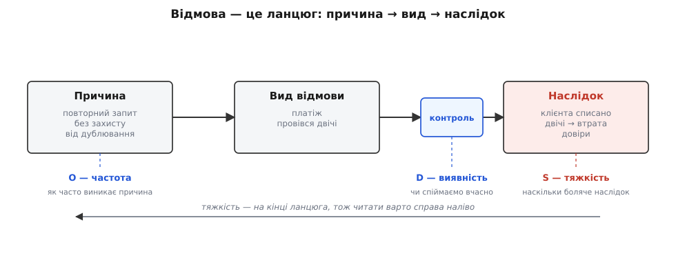
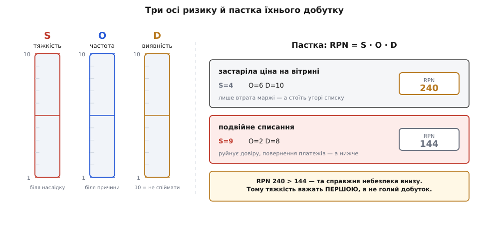

# FMEA: аналіз видів і наслідків відмов

<preknowlist>
- [Ризик-мислення](topic:programming/risk-thinking) — ризик як поєднання ймовірності події й розміру її наслідку; чому ризики зважують і впорядковують, а не «лагодять усе підряд».
- [Імовірність як міра непевності](topic:math/probability-basics) — як міряють «наскільки ймовірно щось станеться»; знадобиться, щоб читати вісь частоти появи причини.
</preknowlist>

Будь-яка складна система вміє відмовляти більшою кількістю способів, ніж її будівник устигає уявити. Тест перевіряє, чи система робить те, що ти задумав; він нічого не скаже про те, чого ти **не** задумав — про давач, що відпаде від корозії за рік, про запит, який хтось повторить двічі, про випадок, якого ти просто не тримав у голові, сідаючи проєктувати. Проти невигаданої біди тесту не напишеш, бо щоб написати тест, спершу треба **здогадатися**, що ця біда взагалі можлива.

FMEA — це дисциплінований спосіб здогадатися наперед. За акронімом ховається англійське *Failure Mode and Effects Analysis*, «аналіз видів відмов та їхніх наслідків». Ідея гранично проста й гранично нудна: ще до того, як щось побудовано, ти систематично перебираєш кожен вузол системи й питаєш про нього три речі — **чим саме** він може зламатися, **до чого** це призведе і **наскільки ти готовий** це зустріти. Не «чи зламається», а «коли зламається ось так — що буде далі». З цього переліку народжується головне, заради чого все й затівається: **порядок дій** — за що братися першим, а що можна відпустити.

## Відмова — це ланцюг, а не точка

Перше, що дає метод, — правильна мова. Інженер за звичкою думає **від деталі**: «згорів транзистор», «завис давач», «відвалилася черга». Але сам по собі «завис давач» ще нічого не каже про небезпеку — усе залежить від того, **що сталося далі**. Тому FMEA розкладає кожну відмову на три ланки одного причинно-наслідкового ланцюга, і кожна ланка відповідає на своє питання.

**Причина** (англ. *cause*) — *чому* зламалось: холодна пайка, просіла напруга, повторний запит без захисту від дублювання. **Вид відмови** (англ. *failure mode*; *mode* — від лат. *modus*, «спосіб») — *як* саме це проявляється на рівні вузла: давач перестав відповідати, платіж провівся двічі, значення «прилипло». **Наслідок** (англ. *effect*) — *що* від цього відчула вся система й людина по той бік: апарат утратив керування, клієнта списано двічі, замовлення продано нижче собівартості.


*Один ланцюг відмови. Причина відповідає на «чому», вид відмови — на «як це бачить вузол», наслідок — на «що відчула система». Інстинкт читає ланцюг зліва направо, від деталі до біди; FMEA змушує читати навпаки — спершу «чим це загрожує», потім «звідки прийде». Найважче живе на кінці: тяжкість визначається наслідком, а не деталлю, тому ланцюг корисно читати справа наліво.*

Чому це розрізнення таке важливе? Бо **одна причина дає різні наслідки, а один наслідок приходить від різних причин**. Холодна пайка може завісити давач — або потягнути живлення; завислий давач може нічого не значити (резерв узяв своє) — або вбити апарат. Якщо думати точками («згорів транзистор — погано»), не видно, наскільки саме погано й де стелити соломку. Якщо думати ланцюгами, видно головне: **тяжкість живе біля наслідку, а не біля деталі**. Тому FMEA читають з кінця — спершу «що найстрашніше може статися», а вже тоді «якими шляхами туди дійти».

## Три осі, які не можна змішувати

Перебрати види відмов — половина справи; їх назбирується десятки, і руки не дійдуть до кожного. Треба **впорядкувати за небезпекою**. FMEA важить кожен вид трьома незалежними числами від 1 до 10 — і вся сила методу в тому, що ці три осі **не зливаються в одну**.

**Тяжкість** (англ. *severity*, S) — наскільки боляче, *якщо* станеться. Міряється на кінці ланцюга, біля наслідку: подряпина — це 2, втрата керування чи шкода людині — 9–10. **Частота появи** (англ. *occurrence*, O) — як часто виникає причина: одиничний дефект пайки на весь випуск — низька, перегрів у тісному корпусі щоліта — висока. **Виявність** (англ. *detection*, D) — наскільки легко спіймати збій **вчасно**, поки вид відмови ще не переріс у наслідок. Тут шкала підступна, її легко прочитати навпаки: **10 — це «майже неможливо виявити»**, а 1 — «ловиться миттєво й гарантовано». Що **гірша** виявність, то **більше** число.

Осі навмисно приколоті до різних точок ланцюга: частота живе біля причини, тяжкість — біля наслідку, виявність — на контролі між ними. Саме тому їх не можна усереднювати чи міняти місцями: рідкісна смертельна відмова й часта дрібниця — це два різні світи, хоча числа поруч виглядають схоже.


*Три незалежні осі та пастка їхнього перемноження. Кожну оцінюють від 1 до 10, але прикріплено їх до різних точок ланцюга. Виявність інвертована: 10 — це «не побачимо, поки не станеться». Класичний RPN зводить три числа в одне множенням, і тут криється біда: «застаріла ціна» (S=4, O=6, D=10) дає RPN=240 і виходить угору списку, а «подвійне списання» (S=9, O=2, D=8) з RPN=144 — нижче, хоча саме воно руйнує довіру до сервісу. Множення топить тяжкість.*

> 🔧 **Навіщо це.** Виявність — найцінніша з трьох осей, бо це часто **єдина, на яку ти впливаєш просто зараз і дешево**. Тяжкість закладена фізикою наслідку, частота — якістю виробництва; а от чи помітить система, що вузол замовк, перш ніж діяти наосліп, — цілком у твоїх руках. Рядок «D=9: давач завмер, і ми цього не бачимо» читається як технічне завдання: *додай перевірку, яка це помітить*. Знизити D з 9 до 2 — це нерідко десяток рядків коду або одна зайва лампа-індикатор, а ризик від того падає в рази.

## Пастка одного числа

Класичний спосіб звести три осі докупи — **RPN** (англ. *Risk Priority Number*, «число пріоритету ризику») = S · O · D. Зручно: одне число, сортуй за спаданням і берися за найбільші. Але саме тут — головна пастка методу, і її треба знати, перш ніж довіритися числу. Перемноження робить осі **взаємозамінними**, а вони не взаємозамінні: втроє більша частота «компенсує» втроє меншу тяжкість, хоча в реальності рідкісна смерть і часта подряпина непорівнянні.

**Приклад (три види відмов у кроці оплати інтернет-крамниці).** Оцінімо три різні відмови й порахуймо RPN кожної.

```
вид відмови               S    O    D     RPN = S · O · D
таймаут шлюзу оплати       6    5    3      6·5·3  =  90    (втрата продажу; видно в логах)
подвійне списання          9    2    8      9·2·8  = 144    (клієнта списано двічі; тихо)
застаріла ціна на вітрині   4    6   10      4·6·10 = 240    (продаж нижче собівартості; місяцями непомітно)

сортування за RPN:   застаріла ціна (240)  >  подвійне списання (144)  >  таймаут (90)
```

За голим RPN черга виходить така: спершу лагодимо застарілу ціну, тоді подвійне списання. Але подивімося на тяжкість. Подвійне списання має S=9 — це зруйнована довіра, повернення платежів, скарги, можливо суд; застаріла ціна має S=4 — прикра втрата маржі, не більше. Тобто **менш небезпечна відмова стоїть у черзі вище за небезпечнішу** — рівно тому, що часта й невидима дрібниця набрала більший добуток. Це не рідкісна аномалія, а вроджена вада RPN: [чому множити ранги від 1 до 10 математично сумнівно](topic:algorithms/fmea/math-rpn-ordinal.md) — окрема розмова, але висновок простий уже тут.

Тому сучасна практика **не множить наосліп**. Автопромисловий стандарт 2019 року замінив RPN на таблицю **пріоритету дій** (англ. *Action Priority*, AP): вона важить тяжкість першою й не дає жодному виду відмови з високою S провалитися вниз, хоч би якими малими були частота й виявність. Робоче правило, яке варто винести, навіть якщо до таблиць руки не дійдуть: **спершу впорядкуй за тяжкістю, і лише в межах однакової тяжкості дивися на частоту й виявність**. Це рятує від класичної біди новачка — годинами «оптимізувати» купу дрібних RPN, поки одна рідкісна смертельна відмова тихо лишається без захисту. Загальніше вміння вибудовувати таку чергу — окрема тема: [як упорядковувати відмови за пріоритетом](topic:programming/failure-priorities).

## FMEA — не таблиця, а процедура

Аркуш із рядками — лише слід методу; сам метод — це **процедура**, яку виконують крок за кроком, і саме її повторюваність робить FMEA надійною. Кожен, хто пройде тими самими кроками над тією самою системою, дійде приблизно того самого переліку небезпек — а це вже не мистецтво окремого генія, а відтворюваний інструмент.


*FMEA як повторюваний цикл, а не разовий обряд. Метод іде **знизу вгору** (індуктивно): від конкретного вузла — до наслідку для всієї системи. Останній крок замикає петлю: щойно схему змінили чи додали вузол, аркуш оживає знову, бо новий елемент приносить нові види відмов. Тому FMEA — «живий» документ, а не звіт, який здають і забувають.*

Кроки, якщо їх розписати, майже очевидні — і в цій очевидності вся суть, бо метод не вимагає натхнення, лише дисципліни:

1. **Розклади систему** на вузли та їхні функції — що кожен має робити.
2. Для кожного вузла **перелічи види відмов** — усі способи не виконати функцію (не спрацював, спрацював не так, спрацював невчасно).
3. Для кожного виду добудуй ланцюг: **причини**, **наслідки** та **наявний контроль**, який мав би це впіймати.
4. **Оціни** S, O, D — три числа від 1 до 10.
5. **Впорядкуй** за пріоритетом (тяжкість першою, не голий RPN).
6. **Признач і виконай заходи** — на верхні рядки черги.
7. **Переоціни** ті самі види з новими S, O, D і **повернися до кроку 2**, бо система вже інша.

Заповнений аркуш — це, по суті, [спеціалізований ризик-реєстр](topic:programming/risk-register): той самий живий перелік небезпек із оцінками до і після заходів, лише скроєний під відмови вузлів. І чи не найцінніше в ньому — колонка «після»: коли захід виконано, ті самі три осі оцінюють **наново**, і видно чорним по білому, наскільки впав ризик. Автоматизувати весь цей рахунок — від RPN до пріоритету за тяжкістю й залишкового ризику після заходів — нескладно: [невеликий інструмент, що будує реєстр і впорядковує його правильно](topic:algorithms/fmea/proj-fmea-rpn.md), уміщається в кількадесят рядків.

> 🔧 **Навіщо це.** FMEA найдешевша **рано** — на папері чи в таблиці, ще до того, як щось спаяно чи написано. У цьому весь виграш: закрити вид відмови, поки він коштує рядка коду, а не відкликання партії чи інциденту в проді. Пізніше та сама знахідка коштує в сотні разів більше. Тому аркуш заводять на старті проєкту й ведуть далі — не заради звітності, а щоб щоразу, змінюючи вузол, одразу питати: «а які нові способи зламатися я щойно приніс?».

## Різновиди й межа методу

За тим самим кістяком стоять кілька родичів, які корисно розрізняти. **DFMEA** (англ. *design*) шукає відмови в **конструкції** — чим завинить сам задум. **PFMEA** (англ. *process*) шукає їх у **процесі виготовлення чи роботи** — чим завинить складання, монтаж, експлуатація. **Системна FMEA** дивиться на взаємодію вузлів. А якщо до трьох осей додати ще й окрему оцінку «критичності» наслідку, метод стає **FMECA** (англ. *Failure Mode, Effects and Criticality Analysis*) — саме в цій, воєнно-космічній формі він і народився.

Головне — знати **межу**, щоб не покладатися на метод сліпо. FMEA дивиться на **поодинокі** види відмов: один вузол, його причини й наслідки. Він кепсько ловить **збіги** — коли система падає лише від двох відмов разом (кожна поодинці терпима, а обидві водночас — катастрофа). Для таких сплетінь є інструмент, що йде з іншого боку: від небажаної події вниз, розгалужуючи її на комбінації причин, — [аналіз дерева відмов](topic:algorithms/fault-tree-analysis). FMEA рухається **знизу вгору** (від вузла до наслідку), дерево відмов — **згори вниз** (від катастрофи до її коренів); разом вони закривають те, що кожен поодинці пропускає.

І ще одна межа, найтихіша: метод рівно настільки добрий, наскільки **чесний перелік** видів відмов. Забутий вид не з'явиться в таблиці сам — його ніхто не оцінить і ні від чого не захистить. Тому FMEA не заперечує тестів, а доповнює їх: аналіз каже, **що** перевіряти й від чого боронитись, а тести підтверджують, що оборона тримає. Один із класичних заходів проти виду відмови з високою тяжкістю — прибрати єдину точку відмови (вузол, чия поодинока поломка валить усю систему) через [надлишковість](topic:programming/redundancy): дублювати так, щоб замовкнути мали одразу всі копії, а це вже геть інша, набагато менша частота.

Сам метод виріс не в програмуванні, а на військовій службі й у космосі: його формалізували [американські військові ще 1949 року](topic:algorithms/fmea/hist-fmea.md), відточила програма «Аполлон», а звичний нам вигляд із числами S, O, D дала пізніше автопромисловість. Ця історія пояснює, чому в методі стільки суворої формальності й звідки взялася суперечлива арифметика RPN, яку згодом довелося лагодити.

---

Підсумок простий. Тест питає «чи правильна моя система?»; FMEA питає **«від чого моя система навіть не пробує боронитись?»** — і відповідає переліком, який можна закрити рядок за рядком. Метод розкладає кожну відмову на ланцюг причина → вид → наслідок, важить її трьома осями — тяжкістю, частотою, виявністю, — і впорядковує за небезпекою, ставлячи тяжкість понад голий добуток RPN. Це не магія й не математика, а чесний, нудний, відтворюваний перебір способів, якими твоя система може тебе підвести, — і саме тому він рятує там, де натхнення й тести мовчать.
