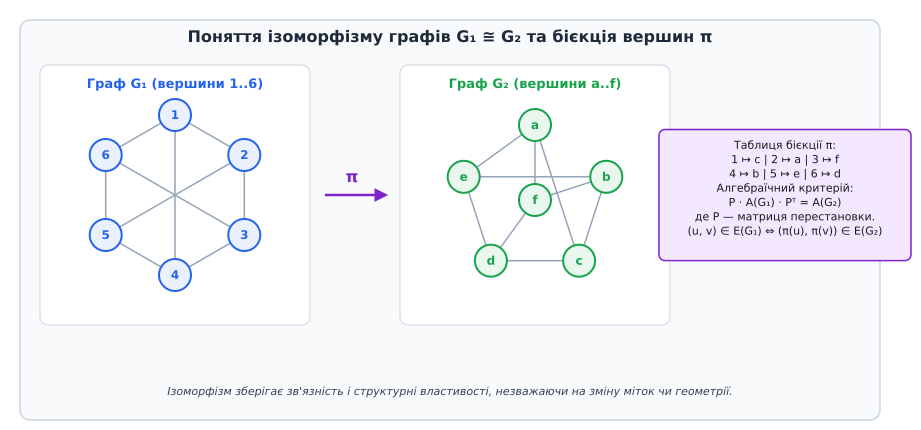
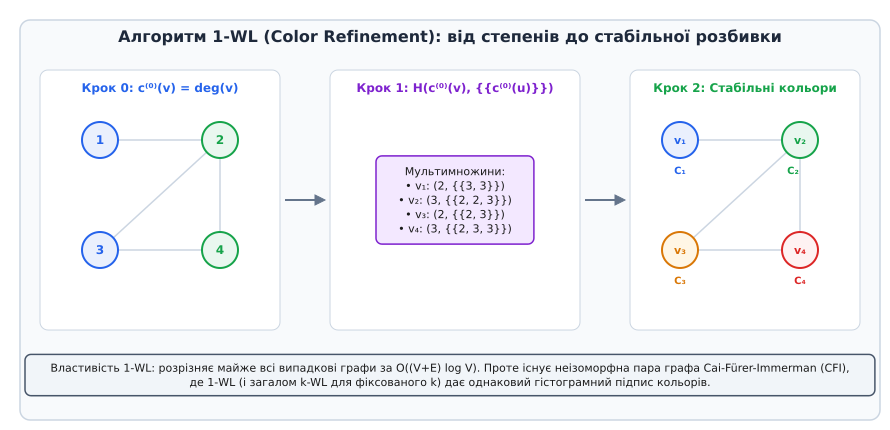
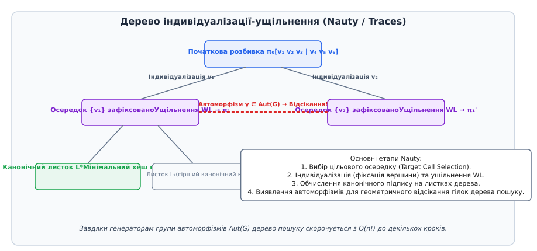
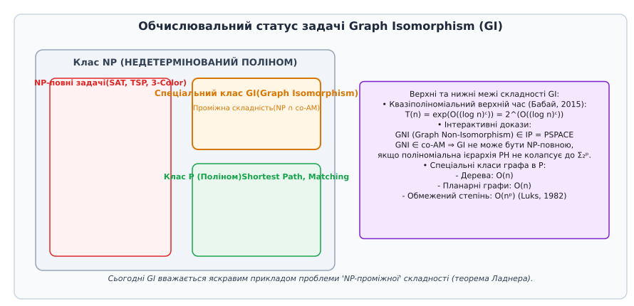

# Ізоморфізм графів

<preknowlist>
- [Матриця суміжності](book:algorithms/adjacency-matrix) — алгебраїчна форма представлення графів.
- [Двочастковий граф](book:algorithms/bipartite-graph) — розбиття вершин на дві незалежні частки.
- [NP-повнота](book:algorithms/np-completeness) — класи складності та поліноміальні редукції.
- [Ігри Артура — Мерліна](book:algorithms/arthur-merlin-games) — імовірнісні інтерактивні протоколи.
</preknowlist>

Коли двоє інженерів проектують інтегральну мікросхему або розробляють топологію розподіленої комп'ютерної мережі, вони можуть занумерувати одні й ті самі фізичні вузли в абсолютно різному порядку. У результаті матриці суміжності отриманих графів виявляються повністю відмінними покомпонентно, хоча з геометричної та функціональної точок зору обидві мережі є тотожними. Задача розпізнавання структурної еквівалентності двох графів незалежно від їхнього маркування чи просторового розміщення становить суть проблеми **ізоморфізму графів** (Graph Isomorphism, GI).

Визначення ізоморфізму спирається на пошук бієктивного відображення (взаємно однозначного відповідника) між множинами вершин двох графів, яке повністю зберігає зв'язність:

```
G₁ = (V₁, E₁),  G₂ = (V₂, E₂)
π: V₁ → V₂  таке, що  (u, v) ∈ E₁ ⇔ (π(u), π(v)) ∈ E₂
```

Якщо таке відображення `π` існує, графи називаються ізоморфними, що позначується як `G₁ ≅ G₂`.


*Поняття ізоморфізму графів: бієктивний мапінг вершин зберігає ребра та формує еквівалентність матрицій суміжності.*

З алгебраїчної точки зору ізоморфізм означає існування такої матриці перестановки `P` (ортогональної матриці, у кожному рядку й стовпці якої міститься рівно одна одиниця, а решта елементів — нулі), яка переводить матрицю суміжності `A(G₁)` у матрицю `A(G₂)`:

```
P · A(G₁) · Pᵀ = A(G₂)
```

Окремим важливим випадком є відображення графа самого на себе: бієкція `γ: V(G) → V(G)`, яка зберігає ребра графа `G`, називається **автоморфізмом**. Множина всіх автоморфізмів графа утворює алгебраїчну групу `Aut(G)` відносно операції композиції.

Розмір та структура групи `Aut(G)` характеризують внутрішню симетрію графа:
- Для абсолютно несиметричного (випадкового) графа група автоморфізмів є тривіальною: `|Aut(G)| = 1`.
- Для повного графа `Kₙ` вона збігається з усією симетричною групою `Sₙ` і має порядок `|Aut(Kₙ)| = n!`.
- Для цикла `Cₙ` група автоморфізмів ізоморфна діедральній групі `Dₙ` порядку `2n`.

Для будь-якої вершини `v ∈ V` позначимо через `Orb(v) = { γ(v) : γ ∈ Aut(G) }` її орбіту під дією групи автоморфізмів, а через `Stab_G(v) = { γ ∈ Aut(G) : γ(v) = v }` — точковий стабілізатор `v`. За теоремою про орбіту-стабілізатор порядок групи підпорядковується рівності:

```
|Aut(G)| = |Orb(v)| · |Stab_G(v)|
```

У теоретичній інформатиці доведено фундаментальну еквівалентність: **задача розпізнавання ізоморфізму графів (GI) є поліноміально еквівалентною задачі обчислення порядку групи автоморфізмів `|Aut(G)|` та побудови її генераторів**. Якщо ми вміємо за поліноміальний час перевіряти ізоморфізм, то можемо побудувати генератори `Aut(G)` шляхом фіксації вершин та порівняння графів із доданими позначками; і навпаки, знання груп автоморфізмів дозволяє ефективно будувати канонічні маркування.

## Різновиди підграфного ізоморфізму

Слід чітко розрізняти три споріднені, але обчислювально відмінні задачі:
1. **Точний ізоморфізм графів (Graph Isomorphism):** `|V₁| = |V₂|`, пошук бієкції `π`, що зберігає як наявність, так і відсутність ребер.
2. **Індукований підграфний ізоморфізм (Induced Subgraph Isomorphism):** Пошук ін'єкції `π: V₁ → V₂`, такої що `(u, v) ∈ E₁ ⇔ (π(u), π(v)) ∈ E₂`. Всі ребра між обраними вершинами у `G₂` повинні точно відповідати ребрам у `G₁`.
3. **Мономорфізм графів / Неіндукований підграфний ізоморфізм (Subgraph Monomorphism):** Пошук ін'єкції `π: V₁ → V₂`, такої що `(u, v) ∈ E₁ ⇒ (π(u), π(v)) ∈ E₂`. Граф `G₂` може містити додаткові ребра між зіставленими вершинами.

На відміну від точного ізоморфізму графів, задачі індукованого підграфного ізоморфізму та мономорфізму є **доведено NP-повними** для довільних графів (шляхом редукції з задачі про кліку або Гамільтонів цикл).

## Графові інваріанти та їхні комбінаторні межі

Пряма перевірка існування бієкції `π` шляхом перебору всіх можливих перестановок потребує `n!` кроків. Для графа всього з 30 вершин це означає аналіз понад `2.6 × 10³²` варіантів, що абсолютно унеможливлює обчислення детермінованим перебором.

Першим природним кроком для прискорення розпізнавання є обчислення **інваріантів графа** — числових характеристик або структурних властивостей, які є однаковими для всіх ізоморфних графів. Якщо принаймні один інваріант для `G₁` та `G₂` відрізняється, графи гарантовано є неізоморфними.

До найпоширеніших базових інваріантів належать:
1. Кількість вершин `|V|` та кількість ребер `|E|`;
2. Послідовність степенів вершин (впорядкований за зростанням список степенів);
3. Кількість простих циклів кожної довжини (наприклад, трикутників `C₃` чи чотирикутників `C₄`);
4. Спектр матриці суміжності (впорядкований набір власних значень `λ₁ ≥ λ₂ ≥ ... ≥ λₙ`);
5. Спектр матриці Лапласа `L = D - A` та нормалізованого Лапласіана `L_norm = D^(-1/2) L D^(-1/2)`;
6. Константа Чегера (Cheeger expansion constant) та геодезичні діаметри.

Однак комбінаторні та алгебраїчні інваріанти забезпечують лише необхідну, але **не достатню** умову ізоморфізму. Існують великі класи неізоморфних графів, які мають абсолютно однакові базові інваріанти.

Наприклад, графи називаються **коспектральними** (cospectral graphs) або **ізоспектральними**, якщо їхні матриці суміжності мають тотожні власні значення. Класичним прикладом є пара неізоморфних графів з 9 вершинами, побудована Алленом Швенком (Allen Schwenk), або пара дерев з 8 вершинами, які мають абсолютно однаковий спектр власних чисел, але різну внутрішню топологію зв'язків.

Ще складнішим бар'єром для інваріантних методів є **сильно регулярні графи** (Strongly Regular Graphs, SRG). Граф `G` з `n` вершинами називається сильно регулярним з параметрами `(n, k, λ, μ)`, якщо:
- Він є `k`-регулярним (кожна вершина має степеней `k`);
- Будь-які дві суміжні вершини мають точно `λ` спільних сусідів;
- Будь-які дві несуміжні вершини мають точно `μ` спільних сусідів.

Матриця суміжності `A` сильно регулярного графа задовольняє квадратне матричне рівняння:

```
A² = k·I + λ·A + μ·(J - I - A)
```

де `I` — одинична матриця, а `J` — матриця з усіх одиниць.

З цього рівняння випливає, що сильно регулярний граф має лише 3 унікальних власних значення: степеней `k` з кратністю 1, та два корені рівняння `x² + (μ - λ)x + (μ - k) = 0`. Отже, для будь-якої пари сильно регулярних графів із однаковими параметрами `(n, k, λ, μ)` усі локальні комбінаторні інваріанти (степені, спектри, кількості трикутників, геодезичні відстані радіуса 1 та 2) є абсолютно тотожними.

Наприклад, існують 15 неізоморфних сильно регулярних графів з параметрами `(25, 12, 5, 6)` (так звані графи Палей та їхні варіанти) і понад 28 000 неізоморфних сильно регулярних графів з параметрами `(36, 15, 6, 6)`. Жоден базовий комбінаторний чи спектральний інваріант не дозволяє виявити відмінність між ними.

## Алгоритм Вейсфайлера — Лемана (1-WL та k-WL)

Для подолання обмежень простих інваріантів у 1968 році Борис Вейсфайлер та Андрій Леман запропонували систематичний метод ітеративного розфарбовування вершин, відомий як **алгоритм 1-WL (Color Refinement)**.

Ідея 1-WL полягає в тому, що кожна вершина кодує не лише свій власний стан, а й мультимножину кольорів своїх сусідів. На кожному кроці `t` колір вершини `v` оновлюється за допомогою ін'єктивної хеш-функції `H`:

```
c⁽ᵗ⁺¹⁾(v) = H(c⁽ᵗ⁾(v), {{ c⁽ᵗ⁾(u) : u ∈ N(v) }})
```

де `{{ ... }}` позначує мультимножину кольорів.


*Алгоритм Вейсфайлера — Лемана (1-WL): ітеративне ущільнення кольорів на основі мультимножини сусідів.*

Процес ущільнення кольорів виконується доти, доки розбиття вершин на кольорові осередки не стабілізується (найбільше за `n - 1` ітерацій). Підсумковий мультимножинний гістограмний підпис кольорів `H(G) = {{ c*(v) : v ∈ V }}` слугує потужним інваріантом. Для випадкових графів алгоритм 1-WL розрізняє неізоморфні пари за лінійний час `O((V + E) log V)`.

Проте для сильно регулярних графів 1-WL виявляється безсилим, оскільки всі вершини утворюють єдиний когерентний осередок і отримують однаковий колір. Для подолання цього обмеження було розроблено багатовимірний алгоритм **k-WL**, який розфарбовує не поодинокі вершини, а `k`-кортежні елементи `(v₁, v₂, ..., vⲕ) ∈ Vᵏ`.

Математичну модель стабілізації 1-WL та k-WL, їхній зв'язок із клетинними алгебрами, логікою першого порядку `Cᵏ` та формальну конструкцію контрприкладів Цай — Фюрера — Іммермана (CFI) винесено у [алгебраїчні властивості алгоритму Вейсфайлера — Лемана](book:algorithms/complexity-computability/graph-isomorphism/math-weisfeiler-leman.md).

## Дерева індивідуалізації та канонізація

На практиці для остаточного розв'язання задачі ізоморфізму застосовують підхід **канонізації графів** (Graph Canonization). Канонічна форма `C(G)` — це така перестановка вершин графа, яка є єдиною для всього класу ізоморфізму. Обчисливши `C(G₁)` та `C(G₂)`, перевірка ізоморфізму зводиться до простого покомпонентного порівняння двох текстових чи матричних представлень за `O(n²)`.

Для побудови `C(G)` фундаментальні алгоритмічні системи, такі як **Nauty** та **Traces**, використовують дерево пошуку індивідуалізації та ущільнення (Individualization-Refinement tree).


*Дерево індивідуалізації та ущільнення в Nauty: відсікання еквівалентних гілок за допомогою групи автоморфізмів.*

Процес індивідуалізації та ущільнення складається з чотирьох послідовних кроків:
1. **Початкове ущільнення:** Застосовується 1-WL розфарбовування. Якщо результатом є повністю дискретне розбиття (кожна вершина має унікальний колір), канонічне маркування знайдено.
2. **Вибір цільового осередку (Target Cell Selection):** Якщо розбиття містить осередки з кількома вершинами, обирається осередок `W ⊆ V` з розміром `|W| ≥ 2`.
3. **Індивідуалізація (Branching):** Алгоритм послідовно обирає вершину `w ∈ W`, штучно призначає їй унікальний новий колір (фіксує її) та запускає повторне 1-WL ущільнення у відповідній гілці дерева пошуку.
4. **Відсікання за автоморфізмами (Pruning):** Як тільки два листки дерева пошуку дають однакове канонічне маркування, виявляється елемент групи автоморфізмів `γ ∈ Aut(G)`. Nauty обчислює орбіти вершин під дією `Aut(G)` і миттєво відсікає всі гілки дерева пошуку, які є еквівалентними вже відвіданим під дією знайдених автоморфізмів.

Завдяки залученню елементів групи `Aut(G)` складність дерева пошуку скорочується з катастрофічного `O(n!)` до кількох гілок, дозволяючи канонізувати графи з тисячами вершин за мілісекунди.

Детальний опис публічного C/C++ інтерфейсу, масивів розбиття `lab`/`ptn` та структур даних Nauty міститься у встановившому файлі [інтерфейс та виклик системної бібліотеки Nauty](book:algorithms/complexity-computability/graph-isomorphism/api-nauty-tracer.md).

Для багатьох практичних задач (наприклад, у хемоінформатиці чи аналізі мереж), де потрібен лише пошук відповідності між конкретними графами без побудови глобального канонічного підпису, використовують алгоритм простору станів **VF2**. Повний код реалізації та аналіз 5 евристичних правил відсікання наведено у матеріалі [практичну реалізацію алгоритму VF2](book:algorithms/complexity-computability/graph-isomorphism/proj-vf2-algorithm.md).

## Особливі класи графів з поліноміальною складністю

Хоча загальна задача ізоморфізму графів довгий час чинила опір поліноміальним алгоритмам, для багатьох специфічних структурних класів графів було розроблено точні алгоритми складності `O(n)` або `O(nᵖ)`.

### 1. Дерева (Trees) — Алгоритм AHU
Для неукорінених дерев задача ізоморфізму розв'язується за лінійний час `O(n)` за допомогою алгоритму Ахо — Хопкрофта — Ульмана (AHU Algorithm):
1. **Знаходження центру:** Обчислюється центр дерева (одна вершина або дві суміжні вершини, які мінімізують максимальну відстань до листків).
2. **Укорінення:** Дерево укорінюється в знайденому центрі. Якщо центрів два, створюється фіктивний корінь.
3. **Низове кодування (Bottom-Up Tree Encoding):** Від листків до кореня кожному піддереву присвоюється рядковий або цілочисельний підпис. Якщо вершина `v` має синів `u₁, u₂, ..., uⲕ` з підписами `s₁, s₂, ..., sⲖ`, то підпис для `v` формується шляхом сортування цих кодових слів:

```
code(v) = "(" + sort(code(u₁), code(u₂), ..., code(uⲖ)) + ")"
```

4. **Порівняння підписів:** Двоє дерев є ізоморфними тоді й тільки тоді, коли кодові слова їхніх коренів `code(r₁)` та `code(r₂)` повністю збігаються.

### 2. Планарні графи (Planar Graphs)
У 1974 році Джон Гопкрофт (John Hopcroft) та Річард Вонґ (Richard Wong) розробили детермінований алгоритм перевірки ізоморфізму планарних графів за час `O(n)`.

Алгоритм спирається на три послідовних кроки:
1. **Декомпозиція на зв'язні компоненти:** Граф розбивається на мости, блоково-шарнірні компоненти (biconnected components) та 3-зв'язні підграфи (triconnected components).
2. **Використання теореми Вайнштайна (Whitney's Unique Embedding Theorem):** Теорема Вайнштайна стверджує, що будь-який 3-зв'язний планарний граф має **унікальну** топологічну укладку на сфері з точністю до дзеркального відображення.
3. **Редукція до графів на сфері:** Укладка графа на сфері перетворюється на плоский двоїстий граф, після чого ізоморфізм перевіряється зіставленням граней за `O(n)`.

### 3. Графи з обмеженим максимальним степенем (Bounded Degree Graphs)
У 1982 році Євген Люкс (Eugene Luks) зробив фундаментальний прорив, довівши, що для графів із максимальним степенем вершин `deg(v) ≤ d` задача ізоморфізму розв'язується за поліноміальний час:

```
T(n) = O(n^(f(d)))
```

Алгоритм Люкса спирався на теорію груп перестановок та розв'язання проблеми перетину суміжних класів підгруп (Coset Intersection Problem):
- Задача перевірки ізоморфізму підграфа редукується до пошуку перестановки в симетричній групі `Sₙ`.
- Для `d`-регулярних графів група автоморфізмів `Aut(G)` є `k`-розв'язною або має обмежені композиційні чинники, які не містять великих знакозмінних груп `A☤` для `m > d`.
- Використовуючи алгоритм Шраєра — Симса (Schreier-Sims algorithm) для побудови сильних множин генераторів (Strong Generating Sets, SGS), Люкс сконструював ітеративну вежу підгруп, розбиваючи групу перестановок на поліноміальну кількість суміжних класів.

### 4. Графи з обмеженою деревною шириною (Bounded Treewidth)
Для графів із деревна шириною `tw(G) ≤ k` (Bounded Treewidth), що включає серійно-паралельні графи, зовнішньопланарні графи та графи малого халіна, алгоритми динамічного програмування на деревних декомпозиціях дозволяють виконувати канонізацію та перевірку ізоморфізму за час `O(nᵏ⁺²)`.

### 5. Інтервальні графи та графи зачеплення (Interval and Permutation Graphs)
Для інтервальних графів (графів перетинів відрізків на прямій) алгоритм Лукса — Бута — Люкера обчислює канонічне представлення за допомогою PQ-дерев за лінійний час `O(V + E)`. Аналогічно, графи перестановок канонізуються за поліноміальний час за допомогою розкладу на модулярні декомпозиції.

## Прорив Ласло Бабая: Квазіполіноміальний час

Найвидатнішою подією в історії теорії обчислювальної складності останніх десятиліть став результат угорсько-американського математика Ласло Бабая (László Babai).

Упродовж понад 30 років найкращим загальним результатом для довільних графів залишався алгоритм Бабая — Люкса 1983 року зі субекспоненційною складністю `T(n) = exp(O(√(n log n)))`.

У листопаді 2015 року Ласло Бабай опублікував доказ того, що задача ізоморфізму графів розв'язується за **квазіполіноміальний час** (Quasipolynomial Time):

```
T(n) = exp((log n)ᶜ) = 2^(O((log n)ᶜ))
```

де `c > 0` — фіксована константа.


*Обчислювальний статус задачі ізоморфізму графів у структурі класів P, NP, co-AM та PSPACE.*

Ключем до алгоритму Бабая стала редукція задачі ізоморфізму графів до проблеми **ізоморфізму рядків під дією групи перестановок** (String Isomorphism under Permutation Groups):
- Дано два рядки `x, y ∈ Σⁿ` та групу перестановок `G ≤ Sₙ`. Потрібно знайти перестановку `g ∈ G`, таку що `xᵍ = y`.
- Алгоритм застосовує складну групово-теоретичну дихотомію: якщо група дій на осередках графа є близькою до дій на графах Джонсона `J(v, k)`, застосовується спеціальна процедура агрегації локальних тестів (`Local Certificates`), яка скорочує розмірність осередків у поліноміальний фактор за `O(log n)` рекурсивних кроків.
- Якщо ж група дій не містить симетрій Джонсона, алгоритм знаходить підгрупу з малим індексом і рекурсивно розщеплює простір перестановок (Divide-and-Conquer over Group Actions).

Детальну хронологію розробки алгоритму Бабая, опис похибки, виявленої Гаральдом Гельфґоттом у 2017 році, та її остаточне виправлення винесено у [історію створення квазіполіноміального алгоритму Ласло Бабая](book:algorithms/complexity-computability/graph-isomorphism/hist-babai-algorithm.md).

## Обчислювальний статус та криптографічні наслідки

Задача ізоморфізму графів є однією з нечисленних природних проблем, які лежать у класі NP, але не є ні доведеними елементами класу P, ні NP-повними задачами (за умови `P ≠ NP`).

Фундаментальний теоретичний результат говорить про те, що **ізоморфізм графів найімовірніше НЕ є NP-повною задачею**. Доказ цього твердження спирається на теорію інтерактивних доказів та ігор Артура — Мерліна:

1. Задача неізоморфності графів (Graph Non-Isomorphism, GNI) належить до класу `co-AM` (Arthur-Merlin games із публічними монетами).
2. Інтерактивний протокол для GNI будується так:
   - Перевіряльник (Артур) випадково кидає монету `b ∈ {1, 2}` та генерує випадкову перестановку `π ∈ Sₙ`.
   - Артур будує граф `H = π(G_b)` і надсилає його Доводжувачу (Мерліну).
   - Мерлін визначає, з якого саме графа `G₁` чи `G₂` було отримано `H`, і надсилає відповідь `b'`.
   - Якщо `G₁ ≇ G₂`, то множини графів `Orb(G₁)` та `Orb(G₂)` є диз'юнктними, і Мерлін завжди вгадує `b` з ймовірністю 1. Якщо ж `G₁ ≅ G₂`, то `Orb(G₁) = Orb(G₂)`, і Мерлін не може вгадати `b` з ймовірністю, більшою за `1/2`.
3. За теоремою Боппана — Гостада — Кароффа (1987), якщо будь-яка `co-AM` задача є NP-повною, то поліноміальна ієрархія складності колапсує до свого другого рівня:

```
PH = Σ₂ᵖ = Π₂ᵖ
```

Оскільки більшість теоретиків переконані в безкінечності поліноміальної ієрархії, NP-повнота GI вважається практично неможливою. Це робить GI яскравим прикладом **NP-проміжної проблеми** (NP-intermediate) у розумінні теореми Ладнера.

### Криптографія з нульовим розголошенням
Протокол GNI став першим у історії прикладом доведення знання без розголошення самого знання (Zero-Knowledge Proof, ZKP). Завдяки власне властивості ізоморфізму (важко знайти бієкцію `π`, але легко перевірити її правильність за `O(n²)`) створилися криптографічні системи ідентифікації Ґольдрайха — Мікалі — Вігдерсона (GMW Scheme).

### Квантова складність
У квантових обчисленнях GI є окремим випадком проблеми прихованої підгрупи (Hidden Subgroup Problem, HSP) над неабелевою симетричною групою `Sₙ`. На відміну від абелевих груп (на яких базується алгоритм Шора для факторизації чисел та дискретного логарифмування за поліноміальний квантовий час), квантовий алгоритм для HSP над `Sₙ` досі не знайдено. Отже, сучасні квантові комп'ютери не надають відомого поліноміального прискорення для задачі ізоморфізму графів.

## Інженерні застосування

> 🔧 **Навіщо це.**
> Ізоморфізм графів є фундаментом автоматичного проектування мікросхем (LVS-перевірка схеми та топології VLSI), хемоінформатики (пошук унікальних хімічних сполук та молекулярних структур за реєстрами CAS/InChI), виявлення клонів вихідного коду у статичному аналізі програм, а також індексації графових баз даних (Neo4j, Memgraph).

У практичній інженерії алгоритми тестування ізоморфізму графів застосовуються у чотирьох ключових галузях:

1. **Проектування мікросхем (VLSI LVS Check — Layout Versus Schematic):**
   При виготовленні напівпровідникових кристалів фізична топологія розміщених транзисторів та металевих доріжок (Layout) порівнюється з початковою принциповою електричною схемою (Schematic). Обидві структури подаються як графи, де вершини — це транзистори чи вентилі, а ребра — з'єднувальні провідники. Перевірка LVS у САПР Cadence Virtuoso чи Synopsys IC Validator є прямою задачею обчислення ізоморфізму графів із мільйонами вершин.
2. **Хемоінформатика та фармацевтика:**
   Молекули речовин зображуються у вигляді графів, де вершини — це атоми, а ребра — хімічні зв'язки. Побудова канонічних кодових слів (таких як InChI або SMILES) спирається на алгоритми канонізації типу Nauty. Це дозволяє унікально ідентифікувати речовини у світових базах даних (PubChem, CAS) та здійснювати фармакофорний пошук підструктур ліків за мілісекунди.
3. **Аналіз та статична верифікація коду:**
   Сучасні статичні аналізатори програм (такі як Joern чи проміжні представлення LLVM IR) будують графи абстрактного синтаксичного дерева (AST) та графи контролю потоку виконання (Control Flow Graph, CFG). Виявлення дубльованого коду (code clones) та шкідливих паттернів у бінарному коді виконується шляхом перевірки ізоморфізму між фрагментами CFG.
4. **Графові бази даних (Graph Databases):**
   Системи управління базами даних Neo4j, Memgraph та Amazon Neptune використовують швидкодіючі алгоритми підграфного ізоморфізму (такі як VF2 та QuickSI) для виконання запитів мовою Cypher при пошуку шаблонів зв'язків у соціальних та фінансових мережах.
