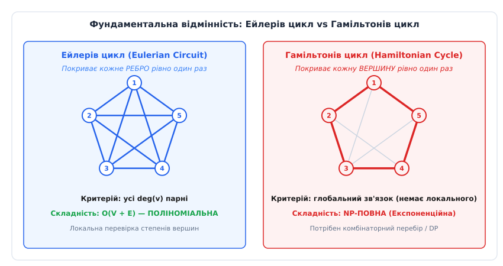
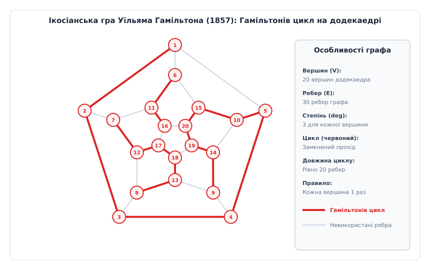
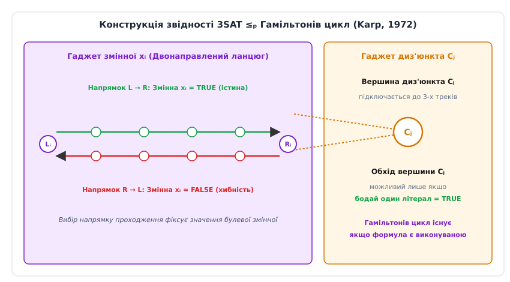
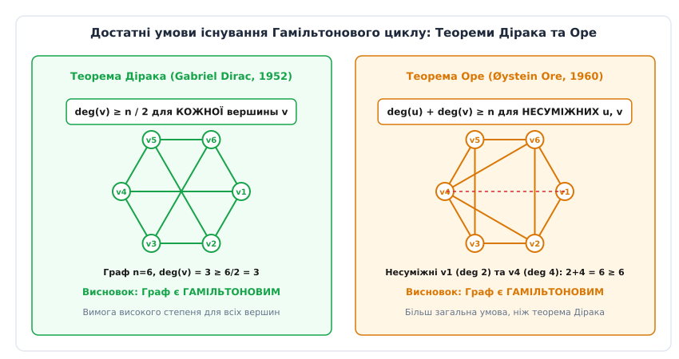

# Гамільтонів граф та гамільтонів цикл

<preknowlist>
- [Матриця суміжності графа](topic:algorithms/adjacency-matrix) — матричне та спискове подання структур графів у пам’яті.
- [Класи NP та NP-повнота](topic:algorithms/np-completeness) — поняття поліноміальної звідності, сертифікатів перевірки та класифікація обчислювальної складності.
- [Проблема рівності класів P та NP](topic:algorithms/p-vs-np) — фундаментальне питання про можливість поліноміального розв'язання складних комбінаторних задач.
- [Теорема Кука-Левіна](topic:algorithms/cook-levin-theorem) — перша NP-повна задача булевої виконуваності (SAT) як основа для звідностей.
</preknowlist>

Оптимізація траєкторії руху свердлильного головки промислового верстата з ЧПК при виготовленні материнської плати із 1200 контактами або трасування лазерного променя при фотолітографії напівпровідникових кристалів зіштовхується з однаковою комбінаторною перешкодою. Для мінімізації робочого часу інструмент повинен відвідати кожну технологічну точку рівно один раз і повернутися у вихідну позицію. Спроба розв'язати цю задачу виснажливим перебором усіх можливих послідовностей вимагає аналізу `1200!` варіантів, що перевищує `10³¹⁷¹` — число, яке незрівнянно більше за кількість фундаментальних частинок у спостережуваному Всесвіті (`10⁸⁰`). Спроба ж припустити, що задача є легкою за аналогією з пошуком Ейлерового шляху або найкоротшого маршруту між двома вершинами, призводить до катастрофічного зависання алгоритмів планера та миттєвого вичерпання системної пам'яті.

Ця обчислювальна прірва є проявом NP-повноти задачі знаходження гамільтонового циклу (Hamiltonian Cycle Problem). Відсутність локальних орієнтирів робить перевірку гамільтоновості графа глобально залежною задачею, де зміна одного ребра на протилежному кінці мережі здана миттєво зруйнувати або утворити шуканий маршрут.


*Порівняння обходу ребер (Ейлерів цикл, P) та обходу вершин (Гамільтонів цикл, NP-повна).*

---

## 1. Ейлерів прохід проти гамільтонового: Локальна парність проти глобальної залежності

Для розуміння комбінаторної природи гамільтонових графів необхідно зіставити їх із близьким за описом, але фундаментально відмінним математичним об'єктом — Ейлеровим циклом.

У 1736 році Леонард Ейлер, розв'язуючи задачу про сім Кенігсберзьких мостів, сформулював критерій існування циклу, що проходить через кожне **ребро** графа рівно один раз. Ейлер довів, що зв'язний неупорядкований граф має Ейлерів цикл тоді й лише тоді, коли степінь кожної його вершини є парним числом:

```
∀ v ∈ V : deg(v) ≡ 0 (mod 2)
```

Цей критерій володіє трьома критичними властивостями:
1. **Локальність:** Для перевірки при придатності графа достатньо ізольовано порахувати кількість ребер у кожній вершині. Обчислення степеня `deg(v)` вимагає лише локального перегляду списку суміжності.
2. **Поліноміальна складність:** Перевірка умов виконується за час `O(V + E)`. Самий цикл будується за той самий лінійний час за допомогою алгоритму Фльорі або алгоритму Ейрольцера (Hierholzer's algorithm).
3. **Незалежність від довжини:** Додавання або вилучення ребра впливає лише на степені його двох кінцевих вершин.

На противагу цьому, **Гамільтонів цикл** вимагає відвідати кожну **вершину** графа рівно один раз. На перший погляд зміна вимоги з «пройти всі ребра» на «пройти всі вершини» здається незначним стилістичним уточненням. Проте ця зміна повністю знищує локальність критерію.

У гамільтоновому циклі факт того, чи утворюють ребра `(u, v)` та `(v, w)` частину загального маршруту, залежить від глобального стану всіх інших `n - 2` вершин графа. Жоден локальний показник — ані степені вершин, ані коефіцієнт кластеризації, ані спектральний радіус матриці суміжності — не дає вичерпного підтвердження наявності чи відсутності гамільтонового циклу у довільному розрідженому графі.

Додавання нового ребра у граф може як утворити новий гамільтонів цикл, так і залишити граф не-гамільтоновим, тоді як вилучення ребра на одному боку графа може заблокувати єдиний прохід через вершину на протилежному боці. Усі вершини виявляються жорстко зачепленими у єдиний комбінаторний вузол.

---

## 2. Формальна математична модель та понятійний апарат

Нехай `G = (V, E)` — простий скінченний граф, де `V` — множина вершин (`|V| = n`), а `E` — множина ребер (`|E| = m`). Граф може бути як неупорядкованим (ребра не мають напрямку), так і орієнтованим (ребра є впорядкованими парами `(u, v)`).

**Основні об'єкти теорії:**
- **Гамільтонів шлях (Hamiltonian Path):** Простий шлях у графі `G`, який містить кожну вершину `v ∈ V` рівно один раз. Формально це послідовність вершин `P = (v₁, v₂, ..., vₙ)`, така що `vᵢ ∈ V`, усі `vᵢ` унікальні (`vᵢ ≠ vⱼ` при `i ≠ j`), і для всіх `i ∈ {1, ..., n-1}` існує ребро `(vᵢ, v_{i+1}) ∈ E`.
- **Гамільтонів цикл (Hamiltonian Cycle):** Замкнений простий шлях `C = (v₁, v₂, ..., vₙ, v₁)`, який починається та закінчується в одній і тій самій вершині, а всі проміжні `n` вершин відвідує рівно один раз. Тобто до умов гамільтонового шляху додається вимога наявності замикаючого ребра `(vₙ, v₁) ∈ E`.
- **Гамільтонів граф (Hamiltonian Graph):** Граф `G`, який містить принаймні один гамільтонів цикл.
- **Напівгамільтонів граф (Traceable Graph):** Граф, який містить гамільтонів шлях, але не має жодного гамільтонового циклу (наприклад, лінійний граф-стежка `Pₙ`).
- **Гіпергамільтонів граф (Hypohamiltonian Graph):** Не-гамільтонів граф, у якому вилучення будь-якої однієї вершини перетворює залишковий підграф на гамільтонів (найвідоміший приклад — граф Петерсена з 10 вершинами).


*Приклад класичного гамільтонового графа — планарна проекція правильного додекаедра з виділеним 20-вершинним циклом.*

Історичні витоки цієї задачі сягають 1857 року, коли ірландський математик Сер Вільям Роан Гамільтон сконструював головоломку «Ікосіанська гра» на дерев'яній моделі додекаедра. Детальний розбір алгебраїчного числення Гамільтона та комерційної історії цієї гри наведено у вставці [Історія виникнення ікосіанської гри та гамільтонових циклів](topic:algorithms/hamiltonian-cycle/hist-icosian-game.md).

### Зв'язок із задачею комбівояжера (Traveling Salesperson Problem, TSP)

Задача про гамільтонів цикл є прямим окремим випадком метричної та загальної задачі комбівояжера. Якщо розглянути повний зважений граф `K♁`, у якому вага ребра `w(u, v)` задається за правилом:

```
w(u, v) = 1,   якщо (u, v) ∈ E
w(u, v) = ∞,   якщо (u, v) ∉ E
```

то граф `G` містить гамільтонів цикл тоді й лише тоді, коли оптимальна вага маршруту комбівояжера у графі `K♁` дорівнює рівно `n`.

Цей зв'язок пояснює, чому задача комбівояжера спадкує всі обчислювальні труднощі гамільтонових циклів. Зокрема, якщо `P ≠ NP`, для загальної задачі комбівояжера з довільними вагами ребер не існує навіть поліноміального наближеного алгоритму з будь-яким константним коефіцієнтом аппроксимації `α > 1`. Знаходження такого поліноміального наближення дозволило б точно розрізняти вагу `n` (цикл існує) від ваги `≥ α · n` (цикл відсутній), що миттєво розв'язало б NP-повну задачу гамільтонового циклу.

---

## 3. Складність та NP-повнота: Дерево звідностей Карпа

З погляду теорії обчислювальної складності задача перевірки гамільтоновості графа посідає центральне місце у класі NP-повних задач.

### Сертифікат та належність до класу NP

Математична задача належить до класу **NP** (Nondeterministic Polynomial time), якщо для будь-якої позитивної відповіді існує короткий (поліноміального розміру) сертифікат-доказ, який можна верифікувати детермінованим алгоритмом за поліноміальний час.

Для задачі гамільтонового циклу сертифікатом слугує просто впорядкована послідовність вершин:

```
C = (v₁, v₂, ..., vₙ)
```

Алгоритм верифікації перевіряє три умови:
1. Довжина масиву дорівнює `n`.
2. Множина вершин `C` збігається з множиною вершин графа `V` (кожна вершина зустрічається рівно один раз).
3. Для кожного `i ∈ {1, ..., n-1}` існує ребро `(vᵢ, v_{i+1}) ∈ E`, і існує замикаюче ребро `(vₙ, v₁) ∈ E`.

Усі три кроки виконуються за лінійний час `O(n)` або `O(n log n)` при використанні хеш-таблиці або впорядкованого масиву. Отже, розпізнавання гамільтонового циклу належить до класу **NP**.

### Доведення NP-повноти за Карпом (1972)

Щоб довести, що задача є **NP-повною**, необхідно показати, що до неї поліноміально зводиться будь-яка інша задача з класу NP. У 1972 році Річард Карп побудував ланцюжок звідностей від 3SAT (булева виконуваність КНФ з 3 літералами у диз'юнкті) до задачі орієнтованого, а потім неупорядкованого гамільтонового циклу:

```
3SAT  ≤ₚ  Directed Hamiltonian Cycle  ≤ₚ  Undirected Hamiltonian Cycle
```


*Архітектура гаджетів у звідності Карпа: ланцюжки змінних задають двозначний напрямок проходження, а вершини диз'юнктів перевіряють виконання булевих умов.*

Ідея звідності полягає у формуванні графових «гаджетів»:
- **Гаджет змінної `xᵢ`:** Двонаправлений ланцюг вершин. Проходження ланцюга у напрямку зліва направо утворює присвоєння `xᵢ = TRUE`, а справа наліво — `xᵢ = FALSE`.
- **Гаджет диз'юнкта `Cⱼ`:** Окрема вершина `cⱼ`, з'єднана з тими сегментами змінних треків, які відповідають літералам у `Cⱼ`.

Розглянемо конкретний приклад для булевої формули з 2 змінними та 1 диз'юнктом: `Ф = (x₁ ∨ ¬x₂)`.
Для `x₁` створюється двонаправлений трек вершин `L₁, w_{1,1}, w_{1,2}, R₁`. Для `x₂` створюється трек `L₂, w_{2,1}, w_{2,2}, R₂`. Вершина диз'юнкта `c₁` підключається дугами від `w_{1,1}` до `c₁` і назад до `w_{1,2}` (напрямок TRUE для `x₁`), а також від `w_{2,2}` до `c₁` і назад до `w_{2,1}` (напрямок FALSE для `x₂`).

Замкнений гамільтонів цикл у такому графі може існувати тоді й лише тоді, коли обхід вершин повністю покриває всі диз'юнктні вершини `cⱼ`, що можливо лише за умови існування виконання вихідної булевої формули.

Детальні математичні доведення кожної леми звідності та викладення побудови графа наведено у вставці [Математичні теореми Дірака, Оре та звідність 3SAT](topic:algorithms/hamiltonian-cycle/math-dirac-ore-theorems.md).

---

## 4. Достатні топологічні критерії: Теореми Дірака, Оре та замикання

Оскільки загальна задача є NP-повною, виникає потреба в аналітичних інструментах, які дозволяють за поліноміальний час гарантовано підтвердити наявність циклу хоча б для певних класів графів. Математики розробили серію **достатніх умов** (Sufficient Conditions), які спираються на щільність ребер та степені вершин.


*Ілюстрація меж застосування теорем Дірака та Оре для графів зі щільними зв'язками.*

### Теорема Дірака (1952)

Першим фундаментальним результатом щодо щільності графів стала теорема британського математика Габріеля Дірака.

**Теорема Дірака:** Якщо у простому неупорядкованому графі `G` з `n ≥ 3` вершинами степінь кожної вершини задовольняє умову:

```
∀ v ∈ V : deg(v) ≥ n / 2
```

то граф `G` є гамільтоновим.

*Інтуїція доведення:* Якщо кожна вершина з'єднана щонайменше з половиною інших вершин графа, будь-який найдовший простий шлях `P = (v₁, ..., vₖ)` виявляється настільки насиченим ребрами на своїх кінцях `v₁` та `vₖ`, що за принципом Діріхле усередині шляху обов'язково знайдеться така пара сусідніх вершин `(vⱼ, v_{j+1})`, що `(v₁, v_{j+1}) ∈ E` та `(vₖ, vⱼ) ∈ E`. Це примусово згортає шлях у цикл, який за умовою зв'язності має покривати всі `n` вершин.

### Теорема Оре (1960)

У 1960 році норвезький математик Ойстейн Оре узагальнив теорему Дірака, показавши, що високий степінь потрібен не для абсолютно кожної вершини, а лише для кожної несуміжної пари.

**Теорема Оре:** Якщо у простому неупорядкованому графі `G` з `n ≥ 3` вершинами для будь-якої пари несуміжних вершин `u, v` (`(u, v) ∉ E`) виконується нерівність:

```
deg(u) + deg(v) ≥ n
```

то граф `G` є гамільтоновим.

Очевидно, що теорема Дірака є прямим наслідком теореми Оре: якщо `deg(v) ≥ n/2` для всіх вершин, то для будь-якої пари `deg(u) + deg(v) ≥ n/2 + n/2 = n`.

### Замикання Бонді-Хватала (1976)

Джон Адріан Бонді та Вацлав Хватал підняли цей підхід на новий рівень абстракції, увівши операцію **замикання графа** `cl(G)`.

**Алгоритм побудови замикання `cl(G)`:**
1. Взяти вихідний граф `G`.
2. Шукати пари несуміжних вершин `u, v`, для яких `deg(u) + deg(v) ≥ n`.
3. Додати ребро `(u, v)` до графа.
4. Повторювати кроки 2–3, оновлюючи степені вершин, доки можливо додати хоча б одне ребро.

**Теорема Бонді-Хватала:** Граф `G` є гамільтоновим тоді й лише тоді, коли його замикання `cl(G)` є гамільтоновим.

```
G є гамільтоновим ⇔ cl(G) є гамільтоновим
```

Це дає потужний критерій: якщо замикання `cl(G)` утворює повний граф `K♁` (у якому гамільтонів цикл існує тривіально), то вихідний граф `G` гарантовано містить гамільтонів цикл. Побудова замикання виконується за поліноміальний час `O(n³)`.

### Теореми Поша та Хватала про степеневі послідовності

Подальшим поглибленням топологічних критеріїв став аналіз **впорядкованої степеневої послідовності** графа:

```
d₁ ≤ d₂ ≤ ... ≤ dₙ
```

- **Теорема Поша (Lajos Pósa, 1962):** Якщо неупорядкований граф з `n ≥ 3` задовольняє умову: для кожного `k < (n - 1) / 2` кількість вершин зі степенем `≤ k` строго менша за `k`, то граф є гамільтоновим.
- **Теорема Хватала (Václav Chvátal, 1972):** Нехай `d₁ ≤ d₂ ≤ ... ≤ dₙ` — степенева послідовність графа `G`. Якщо для кожного `k < n / 2` виконується імплікація:
  ```
  dₖ ≤ k  ⇒  d_{n-k} ≥ n - k
  ```
  то граф `G` є гамільтоновим. Теорема Хватала є найсильнішою з усіх умов, заснованих лише на степенях вершин.

### Турніри та теорема Редеї

Для орієнтованих графів особливий клас становлять **турніри** (Tournaments) — орієнтовані графи, у яких між кожною парою вершин `u, v` існує рівно одна орієнтована дуга `(u, v)` або `(v, u)`.

- **Теорема Редеї (László Rédei, 1936):** Кожен скінченний турнір містить принаймні один орієнтований **гамільтонів шлях**.
- **Теорема Каммара (Paul Camion, 1959):** Сильнозв'язний турнір (у якому з будь-якої вершини можна дістатися будь-якої іншої) містить орієнтований **гамільтонів цикл**.

---

## 5. Точні алгоритми розв'язання: Від рекурсії до динамічного програмування

Оскільки задача є NP-повною, точні алгоритми для загального випадку мають експоненційну складність. На практиці застосовуються дві основні алгоритмічні парадигми.

### Алгоритм повернень із евристичним відсіканням (Backtracking)

Найпростіший детермінований спосіб полягає у глибинному обході дерева станів (Depth-First Search у просторі шляхів). Ми будуємо шлях крок за кроком, додаючи по одній вершині. Якщо чергова вершина потрапляє у тупик (не має невідвіданих сусідів), алгоритм робить крок назад (backtrack) і вибирає іншу гілку.

Складність такого перебору в найгіршому випадку становить `O(n!)` операцій.

Для зменшення константи перебору застосовують такі евристичні відсікання:
1. **Аналіз висячих вершин (Zero/One Degree Pruning):** Якщо на якомусь кроці у графі невідвіданих вершин з'являється вершина із менш ніж 2 вільними сусідами, виконання цієї гілки негайно припиняється. У гамільтоновому циклі кожна вершина повинна мати принаймні одне вхідне та одне вихідне ребро.
2. **Правило Варнсдорфа (Warnsdorff's Rule):** На кожному кроці серед усіх можливих наступних вершин першою обирається та вершина, яка має **найменший доступний степінь** у невідвіданому підграфі. Це дозволяє покривати "важкі" ізольовані вершини на початку рекурсії і не залишати їх на кінець.

### Алгоритм Гелда-Карпа (Held-Karp Bitmask DP)

У 1962 році Майкл Гелд та Річард Карп запропонували алгоритм динамічного програмування, який кардинально знижує часову складність із факторіальної `O(n!)` до експоненційної `O(2ⁿ · n²)`.

![Динамічне програмування з бітовими масками (Held-Karp): DP[S][v]](/book/algorithms/complexity-computability/hamiltonian-cycle/img/fig5-held-karp-bitmask-dp.svg)
*Структура простору станів у алгоритмі Гелда-Карпа та переходи між бітовими масками підмножин вершин.*

**Кодування стану:**
Нехай `mask` — це бітова маска довжини `n`, у якій `i`-й біт дорівнює `1`, якщо вершина `vᵢ` включена до початкового сегмента шляху, і `0` у протилежному випадку.

Двовимірний масив станів `dp[mask][v]` зберігає булеве значення:
- `dp[mask][v] = true`: існує простий шлях, який починається у вершині `0`, відвідує множину вершин, записану у `mask`, і закінчується у вершині `v`.
- `dp[mask][v] = false`: такий шлях відсутній.

**Рівняння динамічного програмування:**

```
dp[mask][v] = ⋁ { dp[mask \ {v}][u] ∧ HasEdge(u, v) }   для всіх u ∈ (mask \ {v})
```

**Покроковий приклад трасування для n = 4:**
Розглянемо граф `G` з 4 вершинами `{0, 1, 2, 3}` та ребрами `(0,1), (1,2), (2,3), (3,0), (1,3)`.
- **Базовий стан (`mask = 0001₂ = 1`):** `dp[1][0] = true`.
- **Крок 2 (`|S| = 2`):** 
  - `mask = 0011₂ = 3` (`{0, 1}`): `dp[3][1] = dp[1][0] ∧ HasEdge(0, 1) = true`.
  - `mask = 1001₂ = 9` (`{0, 3}`): `dp[9][3] = dp[1][0] ∧ HasEdge(0, 3) = true`.
- **Крок 3 (`|S| = 3`):**
  - `mask = 0111₂ = 7` (`{0, 1, 2}`): `dp[7][2] = dp[3][1] ∧ HasEdge(1, 2) = true`.
  - `mask = 1011₂ = 11` (`{0, 1, 3}`): `dp[11][3] = (dp[3][1] ∧ HasEdge(1, 3)) ∨ (dp[9][0] ∧ HasEdge(0, 3)) = true`.
- **Крок 4 (`|S| = 4`):**
  - `full_mask = 1111₂ = 15`: `dp[15][3] = dp[7][2] ∧ HasEdge(2, 3) = true`.
- **Замикання:** Перевіряємо `dp[15][3] ∧ HasEdge(3, 0) == true`. Цикл `0 → 1 → 2 → 3 → 0` знайдено!

**Характеристики алгоритму:**
- **Часова складність:** Кількість масок дорівнює `2ⁿ`. Для кожної маски перебирається кінцева вершина `v` (`n` варіантів) та її попередник `u` (`n` варіантів). Загальна складність становить:
  ```
  T(n) = O(2ⁿ · n²)
  ```
- **Просторова складність:** Потрібно зберігати таблицю розміром `2ⁿ × n` елементів. Для `n = 20` це вимагає `2²⁰ × 20 ≈ 20` Мегабайт пам'яті. Для `n = 30` це вимагає `2³⁰ × 30 ≈ 32` Гігабайт пам'яті.

При порівнянні з факторіалом при `n = 20` маємо:
- `20! ≈ 2.43 × 10¹⁸` операцій (перебір виконається за кілька років).
- `2²⁰ · 20² ≈ 4.19 × 10⁸` операцій (алгоритм Гелда-Карпа виконується за 0.1 секунди).

Вихідні тексти функцій на C та C++ з використанням бітових операцій наведено у вставці [Алгоритми зворотного відстеження та динамічного програмування](topic:algorithms/hamiltonian-cycle/proj-backtracking-held-karp.md).

---

## 6. Експериментальні спостереження, фазові переходи та практичні застосування

У реальних інженерних системах графи рідко бувають абсолютно довільними. Обчислювальна складність пошуку циклу суттєво залежить від топології та щільності ребер.

### Фазовий перехід у випадкових графах Ердеша-Реньї

Розглянемо модель випадкового графа Ердеша-Реньї `G(n, p)`, де між кожною з `C(n, 2)` пар вершин ребро проводиться незалежно з імовірністю `p`.

Якщо змінювати ймовірність `p` від `0` до `1`, поведінка графа зазнає гострого **фазового переходу** (Phase Transition):

```
p(n) = (ln n + ln ln n) / n
```

- **При `p < (ln n + ln ln n) / n`:** З імовірністю `1` (при `n → ∞`) граф не є гамільтоновим. Більш того, з високою імовірністю граф містить ізольовані вершини (`deg = 0`) або висячі вершини (`deg = 1`), що унеможливлює наявність циклу.
- **При `p > (ln n + ln ln n) / n`:** З імовірністю `1` граф стає гамільтоновим.

Найважчі для розв'язання екземпляри задач (Hardness Peak) концентруються у вузькій критичній зоні фазового переходу. Саме у цій зоні графи мають достатньо ребер, щоб не мати тривіальних тупиків, але занадто мало ребер, щоб легко знайти цикл без глибокого перебору.

### Трансляція у Boolean Satisfiability (SAT)

Для графів великої розмірності (`n > 100`) рекурсивні алгоритми та динамічне програмування виявляються безсилими. У таких випадках застосовується трансляція задачі гамільтонового циклу у булеву формулу виконуваності (SAT) з наступним викликом сучасних промислових CDCL (Conflict-Driven Clause Learning) SAT-солверів.

Формулювання змінних для SAT-кодування:
Уводиться `n × n` булевих змінних `x_{i, t}`, де `x_{i, t} = TRUE` означає, що вершина `vᵢ` відвідується на кроці `t` (`1 ≤ t ≤ n`).

**Система обмежень (Clauses):**
1. **Кожен крок має принаймні одну вершину:**
   ```
   ∀ t ∈ {1, ..., n} : (x_{1,t} ∨ x_{2,t} ∨ ... ∨ x_{n,t})
   ```
2. **Кожна вершина відвідана принаймні один раз:**
   ```
   ∀ i ∈ {1, ..., n} : (x_{i,1} ∨ x_{i,2} ∨ ... ∨ x_{i,n})
   ```
3. **Вершина не може бути на двох різних кроках одночасно:**
   ```
   ∀ i, t₁ ≠ t₂ : (¬x_{i,t₁} ∨ ¬x_{i,t₂})
   ```
4. **На одному кроці не може бути двох різних вершин:**
   ```
   ∀ i₁ ≠ i₂, t : (¬x_{i₁,t} ∨ ¬x_{i₂,t})
   ```
5. **Обмеження суміжності ребер:** Якщо `(u, v) ∉ E`, то ці вершини не можуть відвідуватися послідовно:
   ```
   ∀ (u, v) ∉ E, ∀ t : (¬x_{u,t} ∨ ¬x_{v,t+1})
   ```

Сучасні CDCL SAT-солвери (наприклад, CaDiCaL, Kissat), використовуючи евристики вибору змінних VSIDS та аналіз конфліктних диз'юнктів, здатні розв'язувати розряджені екземпляри задач гамільтонового циклу для `n = 500..1000` вершин за кілька секунд.

Докладний опис програмного C/C++ інтерфейсу солвера та структур даних наведено у вставці [Специфікація інтерфейсу солвера гамільтонових циклів](topic:algorithms/hamiltonian-cycle/api-hamiltonian-solver.md).

### Застосування у Біоінформатиці: Складання ДНК-послідовностей

У сучасній біоінформатиці пошук гамільтонового шляху відігравав історично важливу роль при секвенуванні геному за методом Сангера. При складанні геному з коротких прочитаних фрагментів (reads) довжиною `k` будується **граф перетинів** (Overlap Graph), де кожне прочитання є вершиною, а орієнтоване ребро вказує на наявність перекриття між кінцем першого фрагмента та початком другого.

Збирання повного геному еквівалентне знаходженню гамільтонового шляху у графі перетинів. Проте через NP-повноту та важкість обчислення сучасні секвенатори другого та третього поколінь (Illumina, PacBio, Oxford Nanopore) перейшли від гамільтонового підходу до **графів де Брюйна** (de Bruijn Graphs). У графах де Брюйна `k`-мери кодуються **ребрами**, а `(k-1)`-мери — **вершинами**, що зводить задачу збирання ДНК від важкого гамільтонового циклу до поліноміального **Ейлерового шляху**, який розв'язується за лінійний час `O(V + E)`.

### Застосування у робототехніці та розведенні траєкторій (Coverage Path Planning)

У робототехніці задача покриття площі (Coverage Path Planning для автономних газонокосарок, пилосмоків чи безпілотних літальних апаратів) зводиться до розбиття території на сітку осередків-вершин. Робот повинний обійти всі осередки без повторного проходження пройдених ділянок для економії заряду акумулятора. Формулювання задачі у вигляді гамільтонового шляху на сіткових графах (Grid Graphs) дозволяє знаходити оптимальні траєкторії з урахуванням поворотів та перешкод.

---

## 7. Підсумковий порівняльний аналіз

Для вибору оптимального інструменту розв'язання задачі гамільтонового циклу у прикладних розробках слід керуватися порівняльними характеристиками методів.

| Характеристика | Ейлерів цикл | Гамільтонів цикл (Теорема Дірака) | Алгоритм Гелда-Карпа (DP) | CDCL SAT-розв'язувач |
| :--- | :--- | :--- | :--- | :--- |
| **Клас складності** | `P` (Поліноміальний) | `P` (Поліноміальна пре-перевірка) | `NP`-важкий (Точний) | `NP`-повний (Евристичний) |
| **Складність алгоритму** | `O(V + E)` | `O(V)` для перевірки степенів | `O(2ⁿ · n²)` | Недетермінована |
| **Умова застосовності** | Усі `deg(v)` парні | `deg(v) ≥ n / 2` для всіх `v` | `n ≤ 30` | `n ≤ 1000` (для розріджених) |
| **Результат** | Точний маршрут / Ні | Гарантія наявності / Невідомо | Точний цикл / Точне «Ні» | Точний цикл / Свідоцтво UNSAT |
| **Чутливість до пам'яті** | `O(V + E)` | `O(1)` | `O(2ⁿ · n)` (Критична) | `O(V²)` |

Знання комбінаторної природи гамільтонових циклів дозволяє інженерам та розробникам уникати марних спроб побудови «простих і швидких» точних алгоритмів для великих графів, вчасно переходячи до використання бітових маск, достатніх умов Дірака-Оре або промислових SAT-солверів.
