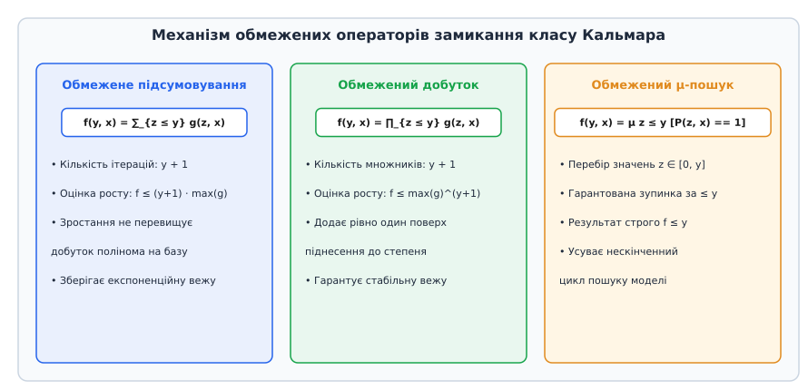
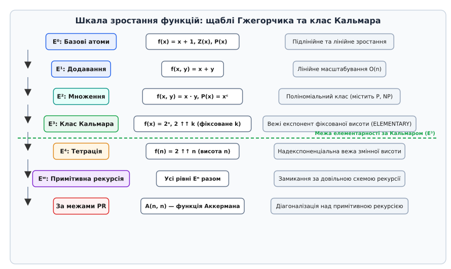
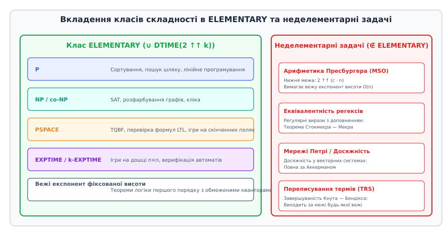

<preknowlist>
* [Примітивно рекурсивні функції](book:math/primitive-recursive-functions)
* [Функція Акермана](book:math/ackermann-function)
* [Асимптотична складність алгоритмів](book:algorithms/asymptotic-complexity)
* [Теореми Ґеделя про неповноту](book:math/godel-incompleteness)
</preknowlist>

# Елементарні функції за Кальмаром

У 1930-х роках у межах дослідницької програми Давида Гільберта з формального обґрунтування математики клас примітивно рекурсивних функцій розглядався як універсальний математичний канон для строго фінітного, конструктивного обчислення. Схема примітивної рекурсії гарантує, що будь-який обчислювальний процес завершується за скінченну кількість кроків за індуктивним числовим параметром, повністю виключаючи ризик нескінченного зациклення. Проте відкриття Вільгельма Акермана та Габріеля Судана виявило фундаментальну інженерну та теоретичну ваду цієї моделі: необмежене ітерування схеми рекурсії дозволяє конструювати операції гіпер-росту (тетрацію, пентацію та діагональну функцію Акермана), які миттєво перевершують будь-які фізично реалізовані ресурси всесвіту (наприклад, значення функції Акермана `A(4, 2)` являє собою вежу двійок висотою 65536 поверхів).

У 1943 році угорський математик Ласло Кальмар запропонував кардинально новий підхід до обмеження рекурсивних процесів. Він звернув увагу на те, що вся практична математична діяльність — включаючи аналітичну теорію чисел, комбінаторику, математичний аналіз, арифметизацію метаматематики за Ґеделем та алгоритмічну верифікацію формальних доведень — насправді ніколи не потребує функцій швидшого росту, ніж повторна експонента. Кальмар побудував мінімальну замкнену алгебраїчну систему, яка отримала назву **класу елементарних функцій** (традиційно позначається символом `E`). Ця система повністю усуває схему необмеженої рекурсії, замінюючи її елементарними операторами обмеженого підсумовування та обмеженого перемноження. Детальний історичний нарис виникнення цієї концепції та її зв'язок із сеґедською школою математичної логіки викладено у вставці [hist-kalmar-origins.md](book:algorithms/kalmar-elementary-functions/hist-kalmar-origins.md).

> 🔧 **Навіщо це.** Клас Кальмара надає математичний фундамент для створення алгоритмічних мов із гарантованою тотальністю та контрольованим бюджетом ресурсів. На відміну від мов програмування загального призначення, повних за Тюрингом (де проблема зупинки алгоритмічно нерозв'язна і будь-який неперевірений цикл загрожує зависанням), будь-який вираз у моделі Кальмара гарантовано зупиняється на всіх можливих входах за побудовою. Більше того, ріст результату та час виконання строго затиснуті вежею експонент фіксованої висоти. Це робить клас Кальмара теоретичною базою для сучасних SMT-розв'язувачів, автоматичних доводчиків теорем, верифікаторів смарт-контрактів та сертифікованих вбудованих систем реального часу.

## Базис Кальмара: початкові функції та обмежені оператори

Клас елементарних функцій за Кальмаром визначається індуктивно як найменший клас функцій `f : ℕᵏ → ℕ`, який містить фіксований набір початкових числових операцій та є замкненим відносно операцій суперпозиції (підстановки), обмеженого підсумовування та обмеженого добутку.

### Початкові базисні функції

Базис Кальмара будується на простих атомарних операціях над натуральними числами `ℕ = {0, 1, 2, ...}`:

1. **Функція константи нуля:**
```
Z(x) = 0
```
Ця функція обнуляє довільний вхідний числовий аргумент і слугує нейтральним елементом для додавання та базовою константою в алгоритмічних конструкціях.

2. **Функція взяття наступника (інкремент):**
```
S(x) = x + 1
```
Функція наступника породжує натуральний ряд і дозволяє збільшувати значення на одиницю.

3. **Функції проекції (вибір i-го аргументу з n-арного кортежу):**
```
Pᵢⁿ(x₁, x₂, ..., xₙ) = xᵢ,    де 1 ≤ i ≤ n
```
Проекції реалізують адресацію та перестановку аргументів: вибір першого аргументу `P₁²(x, y) = x`, вибір другого аргументу `P₂²(x, y) = y`, дублювання аргументу `f(x) = g(P₁¹(x), P₁¹(x)) = g(x, x)` та відкидання невикористаних параметрів.

4. **Базові арифметичні операції:**
- Додавання: `Add(x, y) = x + y`
- Зрізане віднімання (монічне або усічене віднімання):
```
x ∸ y = max(0, x - y)
```
Якщо зменшуване більше або дорівнює від'ємнику (`x ≥ y`), операція повертає звичайну різницю `x - y`. Якщо ж `x < y`, результат примусово прирівнюється до нуля `0`. Зрізане віднімання дозволяє залишатися в межах множини невід'ємних чисел `ℕ` без необхідності введення від'ємних чисел і водночас слугує потужним інструментом для конструювання індикаторних функцій.
- Множення: `Mul(x, y) = x · y`
- Цілочисельне ділення (частка з відкиданням дробової частини):
```
Div(x, y) = ⌊x / y⌋,    якщо y > 0
Div(x, 0) = 0
```
Математична нормалізація ділення на нуль є критичною: операція визначена для абсолютно всіх пар натуральних чисел без винятку, що гарантує тотальність кожної функції в системі та унеможливлює виникнення невизначеної поведінки чи апаратних збоїв.
- Піднесення до степеня (експонента):
```
Exp(x, y) = xʸ,    причому 0⁰ = 1
```
Включення експоненти до базового набору функцій є ключовою відмінністю класу Кальмара від нижчих підкласів поліноміальної складності: експонента слугує універсальним інструментом для позиційного кодування послідовностей та протоколів обчислень.

### Оператори замикання

Нові функції будуються з базових за допомогою трьох операторів:

1. **Суперпозиція (композиція функцій):**
Якщо функція `g(u₁, ..., uₘ)` та функції `h₁(x₁, ..., xₙ), ..., hₘ(x₁, ..., xₙ)` належать до класу `E`, то функція `f`, визначена прямою підстановкою:
```
f(x₁, ..., xₙ) = g(h₁(x₁, ..., xₙ), ..., hₘ(x₁, ..., xₙ))
```
також належить до класу `E`. Суперпозиція дозволяє будувати довільні спрямовані ациклічні графи обчислень, комбінуючи виходи одних операцій із входами інших.

2. **Обмежене підсумовування (Bounded Summation):**
Якщо функція `g(z, x₁, ..., xₙ)` належить до `E`, то функція `f`, яка обчислює скінченну суму значень `g` за цілочисельним параметром `z` від `0` до верхньої межі `y`:
```
f(y, x₁, ..., xₙ) = ∑_{z ≤ y} g(z, x₁, ..., xₙ)
```
також належить до класу `E`. Наприклад, сума перших `y` натуральних чисел (трикутне число) виражається як `T(y) = ∑_{z ≤ y} z = y · (y + 1) / 2`, а сума квадратів — як `S(y) = ∑_{z ≤ y} z²`.

3. **Обмежений добуток (Bounded Product):**
Якщо функція `g(z, x₁, ..., xₙ)` належить до `E`, то функція `f`, яка обчислює скінченний добуток значень `g` за параметром `z` від `0` до верхньої межі `y`:
```
f(y, x₁, ..., xₙ) = ∏_{z ≤ y} g(z, x₁, ..., xₙ)
```
також належить до класу `E`. Наприклад, степінь двійки отримується як обмежений добуток константи: `2ʸ = ∏_{z < y} 2`.


*Рисунок 1. Принцип роботи обмежених операторів Кальмара: лічильник ітерує від 0 до наперед обчисленої межі y, гарантуючи детерміноване завершення без нескінченних циклів.*

## Логічні предикати, обмежені квантори та оператор пошуку

Предикатом називається довільне відношення `P(x₁, ..., xₙ) ⊆ ℕⁿ`. Предикат називається елементарним у сенсі Кальмара, якщо його характеристична функція `χ_P : ℕⁿ → {0, 1}` належить до класу `E`:
```
χ_P(x₁, ..., xₙ) = 1,    якщо відношення P(x₁, ..., xₙ) виконується (істинне)
χ_P(x₁, ..., xₙ) = 0,    якщо відношення P(x₁, ..., xₙ) не виконується (хибне)
```

### Булева алгебра елементарних предикатів

Усі класичні операції математичної логіки виражаються через прості арифметичні комбінації базисних операцій:

1. **Логічне заперечення (`¬P`):**
```
χ_{¬P}(x) = 1 ∸ χ_P(x)
```
Якщо вихідне твердження істинне (`χ_P = 1`), результат дорівнює `1 ∸ 1 = 0`. Якщо вихідне твердження хибне (`χ_P = 0`), результат дорівнює `1 ∸ 0 = 1`.

2. **Логічна кон'юнкція (`P ∧ Q`):**
```
χ_{P ∧ Q}(x) = χ_P(x) · χ_Q(x)
```
Добуток двох булевих значень дорівнює `1` тоді й лише тоді, коли обидва операнди одночасно дорівнюють `1`.

3. **Логічна диз'юнкція (`P ∨ Q`):**
За законом де Моргана `P ∨ Q ≡ ¬(¬P ∧ ¬Q)`:
```
χ_{P ∨ Q}(x) = 1 ∸ ((1 ∸ χ_P(x)) · (1 ∸ χ_Q(x)))
```

4. **Логічна імплікація (`P → Q`):**
Оскільки `P → Q ≡ ¬P ∨ Q`:
```
χ_{P → Q}(x) = 1 ∸ (χ_P(x) · (1 ∸ χ_Q(x)))
```

5. **Умовний оператор розгалуження (if-then-else):**
Функція `Cond(c, t, e)`, яка повертає значення `t`, якщо умова `c == 1`, і значення `e`, якщо `c == 0`, будується чисто арифметично без умовних переходів у коді:
```
Cond(c, t, e) = (c · t) + ((1 ∸ c) · e)
```
Оскільки `c` набуває лише значень `0` або `1`, рівно один із доданків активується, а інший множиться на нуль.

6. **Предикат рівності чисел (`x == y`):**
Рівність перевіряється через взаємну відсутність додатної різниці:
```
χ_{==}(x, y) = (1 ∸ (x ∸ y)) · (1 ∸ (y ∸ x))
```
Якщо `x = y`, то `x ∸ y = 0` та `y ∸ x = 0`, що перетворює обидва множники на `1 ∸ 0 = 1`, і їхній добуток дорівнює `1`. Якщо ж числа не рівні, то одне з них строго більше за інше: відповідна різниця стає не меншою за `1`, обнуляє свій множник і перетворює весь результат на `0`.

7. **Предикати порядку (`x ≤ y` та `x < y`):**
```
χ_{≤}(x, y) = 1 ∸ (x ∸ y)
χ_{<}(x, y) = 1 ∸ ((x + 1) ∸ y)
```

### Обмежені квантори загальності та існування

Логічні квантори в моделі Кальмара обов'язково мають скінченну верхню межу:

1. **Квантор загальності (`∀z ≤ y P(z, x)`):**
Висловлювання стверджує, що умова `P(z, x)` виконується для кожного значення `z ∈ [0, y]`. В арифметиці це відповідає скінченному перемноженню значень характеристичної функції за всіма можливими `z`:
```
χ_{∀z ≤ y P}(y, x) = ∏_{z ≤ y} χ_P(z, x)
```
Якщо хоча б для одного значення `z` предикат не виконується (`χ_P = 0`), весь добуток негайно перетворюється на нуль. Якщо ж умова виконується для всіх `z`, добуток одиниць повертає `1`.

2. **Квантор існування (`∃z ≤ y P(z, x)`):**
За законом подвійності `∃z ≤ y P(z, x) ≡ ¬(∀z ≤ y ¬P(z, x))`:
```
χ_{∃z ≤ y P}(y, x) = 1 ∸ ∏_{z ≤ y} (1 ∸ χ_P(z, x))
```
Якщо в інтервалі `[0, y]` існує хоча б один свідок `z`, для якого `χ_P(z, x) = 1`, відповідний множник перетворюється на `1 ∸ 1 = 0`, увесь добуток стає `0`, а фінальний результат набуває значення `1 ∸ 0 = 1`.

### Обмежена мінімізація (обмежений μ-пошук)

У загальній теорії алгоритмів необмежений пошук найменшого кореня `μ z [P(z, x) = 1]` робить функцію частковою (вона зависає, якщо кореня не існує) і виводить алгоритм за межі класу примітивної рекурсії.

Натомість **обмежений μ-оператор** шукає найменший розв'язок строго в межах заздалегідь заданого відрізка `[0, y]`:
```
f(y, x) = μ z ≤ y [P(z, x) == 1]
```
Якщо на відрізку `[0, y]` існує такий `z`, що `P(z, x)` істинне, функція повертає найменший такий індекс `z`. Якщо ж такого значення немає, функція детерміновано повертає саме значення верхньої межі `y`.

Як математично доведено у вставці [math-kalmar-closure.md](book:algorithms/complexity-computability/kalmar-elementary-functions/math-kalmar-closure.md), оператор обмеженого пошуку аналітично виражається через скінченну комбінацію обмеженого добутку та обмеженої суми:
```
f(y, x) = ∑_{t < y} ∏_{j ≤ t} (1 ∸ χ_P(j, x))
```
Внутрішній добуток сигналізує, чи не з'явився розв'язок на проміжку `[0, t]`. Поки розв'язку немає, добуток дорівнює `1`, і зовнішня сума накопичує лічильник кроків. Як тільки досягнуто найменший розв'язок `k`, усі наступні добутки стають рівними `0`, і сума фіксується на точному значенні `k`. Це доводить, що обмежений пошук не розширює клас `E`, а є внутрішньою алгебраїчною властивістю системи.

## Виразність теорії чисел та кодування послідовностей

Поєднання арифметичного базису з обмеженими сумами, добутками та кванторами перетворює клас Кальмара на універсальний апарат для точного вираження всіх класичних функцій дискретної математики та теорії чисел:

1. **Цілочисельна остача та предикат подільності:**
Остача від ділення `x mod y` визначається через базові операції множення та віднімання:
```
Rem(x, y) = x ∸ (y · Div(x, y))
```
Предикат подільності «число x ділиться на d без остачі» (`d | x`):
```
Divisible(x, d) ≡ (Rem(x, d) == 0)
```

2. **Найбільший спільний дільник (НСД) та найменше спільне кратне (НСК):**
Функція `GCD(a, b)` обчислюється через обмежений пошук найбільшого числа `d ≤ min(a, b)`, яке ділить обидва аргументи:
```
GCD(a, b) = μ d ≤ a [ (d > 0) ∧ Divisible(a, d) ∧ Divisible(b, d) ∧
                      ∀k ≤ a ((k > d ∧ Divisible(a, k) ∧ Divisible(b, k)) → 0) ]
LCM(a, b) = Div(a · b, GCD(a, b))
```

3. **Факторіал та біноміальні коефіцієнти:**
Функція факторіалу будується безпосередньо через обмежений добуток:
```
Factorial(n) = n! = ∏_{z < n} (z + 1)
```
Біноміальний коефіцієнт `Binomial(n, k)` виражається через відношення факторіалів:
```
Binomial(n, k) = Div(Factorial(n), Factorial(k) · Factorial(n ∸ k))
```

4. **Прості числа та функція n-го простого числа:**
Предикат простоти числа `IsPrime(x)` записується за допомогою обмеженого квантора загальності:
```
IsPrime(x) ≡ (x ≥ 2) ∧ ∀d ≤ x (Divisible(x, d) → (d == 1 ∨ d == x))
```
Функція кількості простих чисел `π(y)`, що не перевищують `y`:
```
PrimePi(y) = ∑_{z ≤ y} χ_{IsPrime}(z)
```
Функція знаходження `n`-го простого числа `p_n` (`p₀ = 2, p₁ = 3, p₂ = 5, ...`): за теоремою Евкліда відомо, що `p_n ≤ 2^(2ⁿ)`. Тоді `p_n` визначається через обмежений μ-пошук:
```
p_n = μ z ≤ 2^(2ⁿ) [IsPrime(z) ∧ (PrimePi(z) == n + 1)]
```

5. **Канонічна факторизація чисел:**
Показник входження простого числа `p` у розклад числа `n` (найбільший степінь `k`, при якому `pᵏ | n`):
```
ExpFactor(n, p) = ∑_{k ≤ n} χ_{Divisible}(n, pᵏ) ∸ 1
```
Тоді канонічний розклад числа `n = ∏ pᵢ^(aᵢ)` є чисто елементарною операцією:
```
n = ∏_{i ≤ n} (p_i)^(ExpFactor(n, p_i))
```

6. **Характеристичні предикати спеціальних множин чисел:**
- Предикат перевірки, чи є число степенем двійки:
```
IsPowerOfTwo(x) ≡ (x > 0) ∧ (Div(x, 2^(ExpFactor(x, 2))) == 1)
```
- Предикат досконалого числа (сума власних дільників дорівнює самому числу):
```
IsPerfectNumber(x) ≡ (x > 0) ∧ (∑_{d < x} (d · χ_{Divisible}(x, d)) == x)
```

7. **Числа Фібоначчі та одночасна рекурсія:**
Послідовність Фібоначчі `F(0) = 0, F(1) = 1, F(n + 2) = F(n + 1) + F(n)` мажорується експонентою `F(n) ≤ 2ⁿ`. Хоча вона визначена кроком за двома попередніми значеннями, її протокол згортається в пару Кантора станів `P = Pair(F(n), F(n + 1))`, перехід між якими здійснюється елементарною функцією `Step(P) = Pair(Right(P), Left(P) + Right(P))`. Це доводить, що всі рекурентні послідовності лінійної алгебри належать до класу Кальмара `E`.

8. **Кодування пар Кантора та ґеделівська бета-функція:**
Взаємно-однозначне кодування впорядкованої пари чисел `(x, y)` в одне натуральне число `Pair(x, y)` задається квадратичним многочленом:
```
Pair(x, y) = Div((x + y) · (x + y + 1), 2) + y
```
Функції вилучення першого та другого елемента пари:
```
Left(z) = μ x ≤ z [ ∃y ≤ z (Pair(x, y) == z) ]
Right(z) = μ y ≤ z [ ∃x ≤ z (Pair(x, y) == z) ]
```
Для упаковки числових послідовностей довільної змінної довжини Курт Ґедель запропонував свою знамениту `β`-функцію на базі китайської теореми про остачі:
```
Beta(c, d, i) = Rem(c, 1 + (i + 1) · d)
```
Оскільки ця функція використовує лише цілочисельну остачу та додавання з множенням, вона повністю належить до класу Кальмара `E`. Це дозволяє моделювати довільні динамічні структури даних (списки, стеки, черги, графи) у вигляді окремих натуральних чисел без використання неконтрольованої динамічної пам'яті.

## Арифметизація метаматематики та формальних доведень

Фундаментальним відкриттям математичної логіки XX століття стало те, що синтаксис формальних теорій, аксіоматичні системи та перевірка математичних доведень можуть бути повністю закодовані числовими функціями (метод арифметизації Ґеделя).

У класі Кальмара формули кодуються через степені простих чисел: послідовність символів `(s₀, s₁, ..., s_{m-1})` отримує ґеделівський номер `G = ∏_{i < m} p_i^(s_i + 1)`.

Ключові метаматематичні операції виявляються елементарними за Кальмаром:
- Обчислення довжини закодованого рядка формули `Len(G)`:
```
Len(G) = ∑_{i ≤ G} χ_{>0}(ExpFactor(G, p_i))
```
- Вилучення `i`-го символу формули `Char(G, i) = ExpFactor(G, p_i) ∸ 1`;
- Конкатенація двох закодованих формул `Concat(A, B)`;
- Підстановка терма замість вільної змінної `Subst(Formula, Var, Term)`;
- Перевірка синтаксичної правильності та замкненості формули `IsWellFormedFormula(x)`;
- Перевірка того, чи є формула аксіомою логіки першого порядку або аксіомою індукції Пеано `IsAxiom(x)`;
- Перевірка правила виводу Modus Ponens `IsModusPonens(A, A_implies_B, B)`.

Звідси випливає важливий теоретичний висновок: **предикат доказовості Ґеделя `IsProof(P, F)`** («числовий код P є коректним формальним виведенням формули з кодом F»):
```
IsProof(P, F) ≡ (Elem(P, Len(P) ∸ 1) == F) ∧ 
                 ∀i < Len(P) (IsAxiom(Elem(P, i)) ∨ 
                              ∃j < i ∃k < i IsModusPonens(Elem(P, j), Elem(P, k), Elem(P, i)))
```
є чисто елементарним предикатом класу `E`.

Тут важливо підкреслити фундаментальну різницю між верифікацією доведення та його пошуком:
- **Перевірка готового доведення** полягає в перевірці скінченного ланцюжка формул фіксованої довжини — це задача класу Кальмара `E`, яка розв'язується детерміновано за поліноміальний або експоненціальний час.
- **Пошук існування доведення** вимагає необмеженого квантора `∃P IsProof(P, F)` над усіма можливими текстами доведень, що виводить задачу в клас перелічних, але алгоритмічно нерозв'язних проблем (перша теорема Ґеделя про неповноту).

## Вежова теорема та межі росту: чому тетрація неделементарна

Найважливішою структурною характеристикою класу Кальмара є те, що швидкість зростання будь-якої функції з `E` обмежена зверху вежею експонент фіксованої висоти.

Введемо позначення вежі експонент `2 ↑↑ k (m)` висоти `k` над числом `m`:
```
2 ↑↑ 0 (m) = m
2 ↑↑ 1 (m) = 2ᵐ
2 ↑↑ 2 (m) = 2^(2ᵐ)
2 ↑↑ (k + 1) (m) = 2^(2 ↑↑ k (m))
```

### Теорема про мажорування вежею експонент (Tower Bound Theorem)

Для будь-якої функції `f(x₁, ..., xₙ) ∈ E` існує фіксоване натуральне число `k ≥ 1`, таке що для всіх наборів аргументів виконується нерівність:
```
f(x₁, ..., xₙ) ≤ 2 ↑↑ k (max(x₁, ..., xₙ))
```

Доведення здійснюється структурною індукцією за побудовою формули `f`:
- **Базові атоми:** функції `Zero`, `Succ`, `Proj`, `Add`, `Sub`, `Mul`, `Div`, `Exp` мажоруються вежею висоти `k ≤ 2` для всіх `m ≥ 2`.
- **Суперпозиція:** підстановка функцій з висотами веж `k₁` та `k₂` дає мажоранту `2 ↑↑ k₂ (2 ↑↑ k₁ (m)) = 2 ↑↑ (k₁ + k₂) (m)`. Висота результуючої вежі дорівнює сумі `k₁ + k₂`.
- **Обмежена сума:** якщо `g(z, x) ≤ 2 ↑↑ k (m)`, то сума `y + 1` таких доданків не перевищує `(m + 1) · (2 ↑↑ k (m)) ≤ (2 ↑↑ k (m))² ≤ 2^(2 ↑↑ k (m)) = 2 ↑↑ (k + 1) (m)`. Висота вежі збільшується рівно на `+1`.
- **Обмежений добуток:** якщо `g(z, x) ≤ 2 ↑↑ k (m)`, то перемноження `y + 1` таких множників дає `(2 ↑↑ k (m))^(m + 1) ≤ (2 ↑↑ k (m))^(2ᵐ) ≤ 2^(2 ↑↑ k (m)) = 2 ↑↑ (k + 1) (m)`. Висота вежі також збільшується рівно на `+1`.

Оскільки синтаксичне дерево будь-якої формули має скінченну глибину, висота підсумкової вежі `k` є фіксованою константою, яка залежить виключно від синтаксису функції і не залежить від числових значень вхідних даних.


*Рисунок 2. Спектр росту обчислюваних класів: рівні Гжегорчика від поліноміального E² до експоненціального класу Кальмара E³ та неделементарних рівнів E⁴, E^ω.*

### Неделементарність функції тетрації

Функція тетрації `T(n) = 2 ↑↑ n` визначається як вежа двійок, висота якої дорівнює самому вхідному числу `n`:
```
T(0) = 1
T(n + 1) = 2^(T(n))
```

Припустимо від супротивного, що тетрація `T(n)` належить до класу Кальмара `E`. Тоді за теоремою про мажорування мала б існувати фіксована висота вежі `k`, така що для всіх `n`:
```
T(n) ≤ 2 ↑↑ k (n)
```
Проте якщо розглянути значення `n = k + 1`, ліва частина містить `k + 1` поверх експонент, що при зростанні аргументів неминуче перевершує праву частину з фіксованими `k` поверхами:
```
2 ↑↑ (k + 1) (1) > 2 ↑↑ k (k + 1)
```
Отримане протиріччя доводить, що тетрація **не належить** до класу елементарних функцій Кальмара. Вона утворює наступний якісний поверх обчислювальної складності — клас `E⁴` ієрархії Гжегорчика.

## Ієрархія Гжегорчика та місце класу Кальмара E³

У 1953 році польський логік Анджей Гжегорчик запропонував тонку класифікацію примітивно рекурсивних функцій у вигляді нескінченної ієрархії підкласів `E⁰ ⊂ E¹ ⊂ E² ⊂ E³ ⊂ E⁴ ⊂ ... ⊂ PR`.

Кожен рівень `Eⁿ` визначається як замикання початкових функцій та базової функції росту `E_n(x, y)` відносно суперпозиції та схеми обмеженої рекурсії:
- **`E⁰` (Клас констант та інкрементів):** базова функція росту `E₀(x, y) = y + 1`. Містить лише функції вигляду `x + c`.
- **`E¹` (Клас лінійних функцій):** базова функція `E₁(x, y) = x + y`. Замкнений відносно додавання та множення на фіксовану константу `c · x`.
- **`E²` (Клас поліномів / поліноміальний ріст):** базова функція `E₂(x, y) = (x + 1) · (y + 1)`. Усі функції класу `E²` мажоруються поліномами фіксованого степеня `c · xᵈ`. Клас `E²` точно відповідає логарифмічній пам'яті та поліноміальним обчисленням.
- **`E³` (Клас Кальмара / експоненціальний ріст):** базова функція `E₃(x, y) = 2ʸ`. Гжегорчик довів, що рівень `E³` строго збігається з класом елементарних функцій за Кальмаром `E`.
- **`E⁴` (Клас тетраційного росту):** базова функція `E₄(x, y) = 2 ↑↑ y`.
- **`E^ω = ⋃ Eⁿ` (Клас примітивно рекурсивних функцій):** об'єднання всіх рівнів Гжегорчика покриває весь клас примітивної рекурсії.

Фундаментальна теорема Гжегорчика стверджує:
```
E³ ≡ E (Клас Кальмара)
```
Цей результат остаточно пов'язав алгебраїчне визначення Кальмара через обмежені суми та добутки з теорією стратифікації рекурсивних функцій за швидкістю асимптотичного зростання.

В ієрархії швидкого росту (Fast-Growing Hierarchy `f_α` для ординалів `α < ω^ω`):
- Рівень `f₀(n) = n + 1` відповідає `E⁰`;
- Рівень `f₁(n) = 2n` відповідає `E¹`;
- Рівень `f₂(n) = n · 2ⁿ` відповідає класу Кальмара `E³`;
- Рівень `f₃(n) = 2 ↑↑ n` відповідає тетраційному класу `E⁴`;
- Діагональний перехід `f_ω(n) = f_n(n)` відповідає повній функції Акермана.

## Схема обмеженої рекурсії та її редукція до операторів Кальмара

Схема обмеженої примітивної рекурсії (англ. *bounded primitive recursion*) визначає функцію `f(y, x)` за допомогою індукції, але з наявністю відомої елементарної мажоранти `b(y, x) ∈ E`:
```
f(0, x) = g(x)
f(y + 1, x) = h(y, f(y, x), x)
за умови: ∀y, x  f(y, x) ≤ b(y, x)
```

Чому обмежена рекурсія не виводить за межі класу Кальмара?

Для обчислення значення `f(y, x)` достатньо зберегти послідовність проміжних результатів `(v₀, v₁, ..., v_y)`. Оскільки кожне `vᵢ ≤ M = b(y, x)`, уся історія обчислення кодується в одне число `C` в системі числення з основою `B = M + 1`:
```
C = ∑_{i ≤ y} v_i · Bⁱ < (b(y, x) + 1)^(y + 1)
```
Умова того, що число `C` кодує коректний протокол обчислення рекурсії:
```
IsTrace(C, y, x, B) ≡ (Rem(C, B) == g(x)) ∧
                       ∀i < y (Rem(Div(C, B^(i + 1)), B) == h(i, Rem(Div(C, Bⁱ), B), x))
```
є елементарним предикатом. Тоді значення функції `f(y, x)` знаходиться через обмежений μ-пошук:
```
C_opt = μ C ≤ (b(y, x) + 1)^(y + 1) [IsTrace(C, y, x, B) == 1]
f(y, x) = Rem(Div(C_opt, Bʸ), B)
```
Це доводить повну еквівалентність схеми обмеженої рекурсії та операторів обмеженого добутку і суми Кальмара.

## Зв'язок із теорією складності: клас ELEMENTARY

У 1960-х роках Роберт Рітчі (Robert Ritchie) та Алан Кобгем (Alan Cobham) перенесли клас Кальмара в контекст машинного аналізу складності обчислень на машинах Тюринга.

### Бітова довжина входу проти числових значень

При аналізі складності важливо розрізняти дві системи відліку:
- **Унітарне представлення:** число `n` має розмір `n` одиниць.
- **Двійкове машинне представлення:** число `n` кодується рядком із `L = ⌈log₂ (n + 1)⌉` бітів.

З точки зору машинної складності:
- Додавання двох `L`-бітових чисел вимагає `O(L)` кроків;
- Множення вимагає `O(L²)` кроків (або `O(L log L)` за Шенхаге-Штрассеном);
- Операція піднесення до степеня `2ⁿ = 2^(2ᴸ)` створює вихідний бітовий рядок довжини `2ᴸ`, що еквівалентно експоненціальному простору пам'яті відносно розміру входу `L`.

### Визначення класу складності ELEMENTARY

У теорії обчислювальної складності класом **`ELEMENTARY`** називається об'єднання всіх задач розпізнавання мов, які розв'язуються на детермінованих машинах Тюринга за час, обмежений вежею експонент фіксованої висоти від довжини входу `n`:
```
ELEMENTARY = ⋃_{k ≥ 1} DTIME(2 ↑↑ k (n)) = DTIME(2ⁿ) ∪ DTIME(2^(2ⁿ)) ∪ DTIME(2^(2^(2ⁿ))) ∪ ...
```

Теорема Рітчі (1963) стверджує: множина предикатів, обчислюваних за детермінований час або пам'ять класу `ELEMENTARY`, абсолютно точно збігається з множиною характеристичних предикатів класу Кальмара `E`:
```
ELEMENTARY ≡ E
```


*Рисунок 3. Структура класу складності ELEMENTARY: стандартні поліноміальні та експоненціальні класи (P, NP, PSPACE, EXPTIME) утворюють початкові шари всередині вежі Кальмара.*

### Неделементарні задачі (Non-Elementary Problems)

Клас `ELEMENTARY` охоплює практично всі задачі класичного комп'ютерного моделювання, криптографії та комбінаторної оптимізації (`P`, `NP`, `PSPACE`, `EXPTIME`, `2-EXPTIME`).

Проте в теоретичній інформатиці існують важливі задачі, які виходять за межі класу `ELEMENTARY` (їхня часова складність зростає швидше за будь-яку фіксовану вежу експонент):

1. **Розв'язність арифметики Пресбургера з кванторами:**
Повна теорія додавання натуральних чисел без множення `(ℕ, +)` є алгоритмічно розв'язною (теорема Мойжеша Пресбургера, 1929). Проте за теоремою Фішера та Рабіна (Fischer-Rabin, 1974) будь-який алгоритм перевірки істинності пресбургерових формул довжини `n` вимагає неделементарного часу:
```
Time(n) ≥ 2 ↑↑ 2 (c · n) = 2^(2^(c · n))
```
у найгіршому випадку.

2. **Монадична логіка другого порядку на деревах (MSO on Trees):**
Теорема Рабіна про розв'язність теорії дерев із двома наступниками (S2S) є одним із найпотужніших результатів логіки. Проте алгоритм перевірки формул вимагає вежі експонент, висота якої дорівнює кількості чергувань кванторів у формулі, що робить повну проблему неделементарною.

3. **Еквівалентність розширених регулярних виразів (Regular Expressions with Complement):**
Перевірка того, чи задають два регулярні вирази з операцією доповнення одну й ту саму мову, за теоремою Майєра та Стокмайєра (Meyer-Stockmeyer, 1972) є неделементарною задачею, оскільки детермінізація автоматів із запереченням на кожному кроці додає новий поверх експоненти.

## Дескриптивна складність та логіка вищих порядків

У галузі дескриптивної складності (англ. *Descriptive Complexity*), започаткованій Рональдом Фагіном (Ronald Fagin) та Нілом Іммерманом (Neil Immerman), класи обчислювальної складності характеризуються типами логічних мов, необхідних для вираження відповідних властивостей скінченних структур:

- Логіка першого порядку з оператором транзитивного замикання `FO(TC)` над впорядкованими структурами описує клас логарифмічної пам'яті `NL` (рівень `E²`);
- Логіка першого порядку з оператором найменшої нерухомої точки `FO(LFP)` описує клас поліноміального часу `P` (теорема Іммермана-Варді);
- Логіка другого порядку з кванторами існування за відношеннями `∃SO` описує клас `NP` (теорема Фагіна);
- Повна логіка другого порядку `SO` описує всю поліноміальну ієрархію `PH`.

Фундаментальна теорема про дескриптивну характеризацію класу Кальмара стверджує: **довільна логіка вищих порядків над скінченними моделями (Higher-Order Logic, `HOL`)** — де дозволено квантифікацію над предикатами довільного фіксованого рангу `k` — за виразною силою абсолютно точно збігається з класом складності `ELEMENTARY` та класом функцій Кальмара `E`. Кожен додатковий поверх квантифікації над множиною підмножин відповідає піднесенню потужності множини `2^X`, що точно генерує новий поверх у вежі експонент Кальмара.

## Моделювання регістрових машин Мінського та RAM-машин

Елементарність класу Кальмара проявляється також у можливості прямого моделювання дискретних обчислювальних архітектур:

1. **Регістрові машини Мінського (Counter Machines):**
Стан машини з `m` регістрами описується кортежем `(q, r₁, ..., rₘ)`, де `q` — номер поточної інструкції програми. Крок виконання машини — це функція переходу, яка змінює номер команди та збільшує або зменшує вибраний лічильник на одиницю. Оскільки перевірка рівності нулю лічильника `(rᵢ == 0)` є елементарним предикатом, функція одного кроку `Step(S)` належить до класу `E`.

2. **Машини з довільним доступом до пам'яті (RAM-машини):**
Операція непрямої адресації `Load(M, addr)` (читання комірки `M[addr]`) та `Store(M, addr, val)` моделюються через оновлення ґеделівського коду пам'яті або список пар Кантора. Якщо кількість кроків виконання RAM-машини обмежена вежею експонент `2 ↑↑ k (n)`, то вся траєкторія обчислення від початкового стану до фінальної зупинки повністю кодується та верифікується всередині класу `E`.

## Зв'язок із теоріями обмеженої арифметики (IΔ₀ та теорія Паріха)

У математичній логіці важливу роль відіграють фрагменти арифметики Пеано зі збереженням лише обмежених кванторів. Зокрема, теорія `IΔ₀` (арифметика з індукцією, обмеженою `Δ₀`-формулами), введена Рохітом Паріхом (Rohit Parikh) у 1971 році, спирається на той самий клас кванторів, що й модель Кальмара. Додавання аксіоми повноти експоненти `Ω₁` до `IΔ₀` утворює систему, в якій доказово рекурсивними функціями є в точності елементарні функції Кальмара `E`. Це робить клас `E` точним мостом між теорією моделей логіки першого порядку та теорією обчислювальної складності.

## Застосування в тотальному функціональному програмуванні та формальній верифікації

Концепція класу Кальмара лежить в основі парадигми **тотального функціонального програмування** (англ. *Total Functional Programming*):

- **Мови з гарантованою зупинкою:** у мовах типу Turner's Charity, Epigram або підсистемах ядра типізації Coq Gallina та Agda будь-яка функція мусить бути доведено тотальною. Використання схем обмеженої рекурсії замість довільних нескінченних циклів гарантує, що компілятор може автоматично перевірити завершуваність програми без участі програміста.
- **Верифікація смарт-контрактів та ліміти газу:** у віртуальних машинах розподілених реєстрів (таких як EVM) виконання недетермінованих циклів обмежується механізмом газу. Модель Кальмара дозволяє статично обчислити точну верхню межу вартості виконання контракту до його відправки в мережу.
- **SMT-розв'язувачі:** сучасні автоматичні доводчики теорем (Z3, CVC5, Vampire) транслюють обмежені квантори у скінченні ланцюги диз'юнкцій та кон'юнкцій, спираючись на тотальність та властивості вежі Кальмара.

Практичну програмну реалізацію обчислювача та статичного аналізатора складності наведено у вставці [proj-elementary-evaluator.md](book:algorithms/complexity-computability/kalmar-elementary-functions/proj-elementary-evaluator.md), а повну технічну специфікацію структур даних та функцій C/C++ API — у [api-elementary-spec.md](book:algorithms/complexity-computability/kalmar-elementary-functions/api-elementary-spec.md).

## Підсумок: фундаментальний баланс між виразністю та контролем

Клас елементарних функцій за Кальмаром являє собою винятковий математичний компроміс:
- Він достатньо потужний, щоб виразити всю конструктивну дискретну математику, теорію чисел та перевірку формальних доведень Пеано;
- Він достатньо обмежений, щоб усунути неконтрольований гіпер-ріст функцій типу Акермана та гарантувати повну тотальність і зупинку будь-якої програми;
- Він утворює природний міст між абстрактною теорією рекурсії 1930-х років та сучасною теорією складності алгоритмів.
