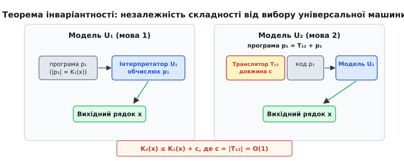
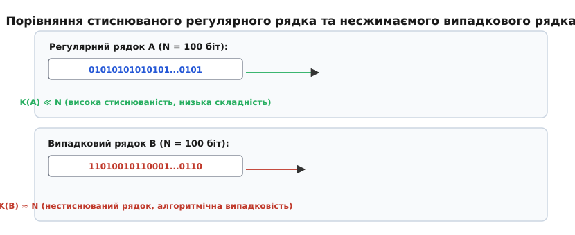
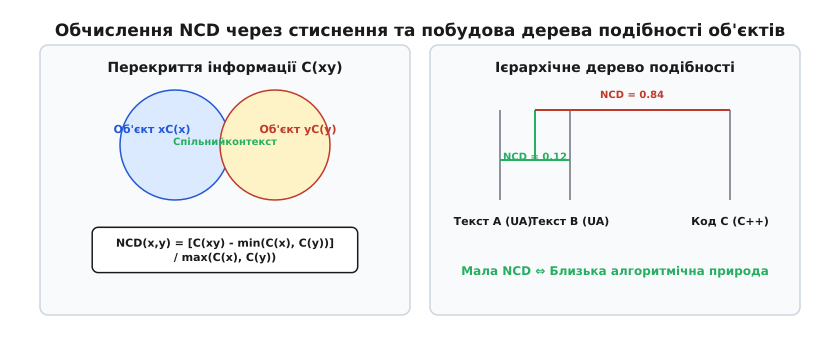

# Складність за Колмогоровим

<preknowlist>
- [Машина Тюринга](book:math/turing-machine) — універсальна модель обчислень; програма — це скінченний текст, який може слугувати вхідними даними для іншої програми.
- [Ентропія Шеннона](book:communications/shannon-entropy) — міра невизначеності й середня довжина коду для ймовірнісного джерела.
- [Проблема зупинки](book:algorithms/halting-problem) — нерозв'язність питання про те, чи зупиниться дана машина Тюринга на заданому вході.
</preknowlist>

Розглянемо два бінарних рядки однаковою довжиною `N = 100` біт. Перший рядок складається зі строгово чергованих нулів та одиниць: `0101010101010101...0101`. Другий рядок отримано шляхом 100 послідовних незалежних підкидань підправленої симетричної монети: `1101001011000101...0110`. З точки зору класичної теорії ймовірностей та теорії інформації Шеннона, якщо припустити, що обидва рядки згенеровані джерелом без пам'яті з рівноймовірними бітами, їх виникнення має абсолютно однакову ймовірність `2⁻¹⁰⁰`, а ентропія обох послідовностей на біт дорівнює одиниці. Проте будь-який програміст чи математик миттєво відчуває фундаментальну відмінність: перший рядок є гранично простим та закономерним, тоді як другий — хаотичним і випадковим.

Причина цієї відмінності лежить не в ймовірності появи рядка, а в обсязі знань, необхідних для його відтворення. Щоб передати перший рядок іншій людині чи комп'ютеру, не потрібно перераховувати всі 100 біт — достатньо сказати коротку інструкцію: «повтори рядок 01 п'ятдесят разів». Для другого ж рядка жодного коротшого корочування не існує: єдиним способом його передачі є повне виписування всіх 100 символів.

Оця довжина найкоротшої інструкції (програми), яка генерує даний об'єкт і зупиняється, і є **складністю за Колмогоровим** (або алгоритмічною складністю, алгоритмічною інформацією). Вона вимірює кількість інформації у конкретному індивідуальному об'єкті, незалежно від того, з якого ймовірнісного розподілу цей об'єкт було отримано.

## Означення складності за Колмогоровим

Щоб перетворити інтуїтивну ідею «найкоротшої інструкції» на строге математичне поняття, необхідно чітко зафіксувати виконавця цієї інструкції. У якості універсального виконавця виступає [універсальна машина Тюринга](book:math/turing-machine) `𝒰` (або еквівалентна їй універсальна мова програмування, як-от C, Python чи машиновий код).

Нехай `x ∈ {0,1}*` — скінченний бінарний рядок, а `p ∈ {0,1}*` — бінарний рядок, що репрезентує програму для універсальної машини `𝒰`. Позначимо через `𝒰(p)` результат виконання програми `p` на машині `𝒰`. Якщо програма `p` на машині `𝒰` завершує роботу за скінченний час і друкує рядок `x`, пишемо `𝒰(p) = x`.

**Проста складність за Колмогоровим** (позначається `K_𝒰(x)` або `C(x)`) рядка `x` відносно універсальної машини `𝒰` визначається як мінімальна довжина програми `p` у бітах, яка виводить `x`:

```
K_𝒰(x) = min { |p| : 𝒰(p) = x }
```

Якщо жодна програма не виводить рядок `x`, вважають `K_𝒰(x) = ∞`. Оскільки універсальна машина Тюринга за визначенням здатна обчислити будь-яку частково-рекурсивну функцію, для кожного скінченного бінарного рядка `x` існує щонайменше тривіальна програма видачі `print("x")`, тому значення `K_𝒰(x)` завжди є скінченним натуральним числом.

### Умовна складність за Колмогоровим

Часто виникає потреба виміряти обсяг додаткової інформації, яку містить рядок `x`, за умови, що нам уже відомий інший рядок `y`. Це приводить до поняття **умовної складності за Колмогоровим** `K_𝒰(x | y)`.

Умовна складність `K_𝒰(x | y)` — це довжина найкоротшої програми `p`, яка, отримавши на вхід рядок `y` як допоміжний аргумент (наприклад, у формі доступної константи чи файлу даних), виводить рядок `x` і зупиняється:

```
K_𝒰(x | y) = min { |p| : 𝒰(p, y) = x }
```

Якщо `y` містить усю інформацію про `x` (наприклад, `y = x`), то `K(x | x) = O(1)` — програма повинна лише скопіювати вхідні дані на вихід, що вимагає константного обсягу коду. Якщо ж `x` та `y` не мають між собою жодного зв'язку, знання `y` не допомагає стиснути `x`, і `K(x | y) ≈ K(x)`.

## Теорема інваріантності: незалежність від мови

Перше природне занепокоєння, яке виникає при знайомстві з означенням складності, звучить так: якщо складність визначена через довжину програми для машини `𝒰`, чи не виявиться вона абсолютно свавільною величиною? Адже рядок, який легко згенерувати короткою командою в мові A, може вимагати довгого коду в мові B.

Відповідь на це занепокоєння дає фундаментальна **теорема інваріантності**, незалежно доведена Андрієм Колмогоровим, Реєм Соломоноффом та Ґреґорі Чайтіним.

**Теорема інваріантності:** Для будь-яких двох універсальних машин Тюринга `𝒰₁` та `𝒰₂` існує така константа `c`, яка залежить лише від вибору цих машин і не залежить від самого рядка `x`, що для всіх рядків `x ∈ {0,1}*` виконується нерівність:

```
|K_𝒰₁(x) - K_𝒰₂(x)| ≤ c
```

Суть доведення полягає в тому, що машина `𝒰₂` є універсальною, а отже, на ній можна написати програму-інтерпретатор (компілятор) `T₁₂` для мови `𝒰₁`. Позначимо довжину цього інтерпретатора в бітах через `c = |T₁₂|`. Щоб згенерувати рядок `x` на машині `𝒰₂`, достатньо взяти найкоротшу програму `p₁` для машини `𝒰₁` (довжиною `K_𝒰₁(x)`) і приєднати її до коду інтерпретатора `T₁₂`. Отримана комбінована програма `p₂ = T₁₂ + p₁` виконується на `𝒰₂` і виводить той самий рядок `x`.



*Теорема інваріантності гарантує, що зміна обчислювальної моделі з U₁ на U₂ додає до складності будь-якого рядка x лише фіксовану константу c, яка дорівнює довжині інтерпретатора мови U₁ на мові U₂. Для асимптотично довгих рядків ця константа стає неістотною.*

Отже, довжина програми на `𝒰₂` дорівнює `|p₂| = |p₁| + c = K_𝒰₁(x) + c`. Оскільки `K_𝒰₂(x)` за визначенням є довжиною *найкоротшої* програми на `𝒰₂`, маємо `K_𝒰₂(x) ≤ K_𝒰₁(x) + c`. З міркувань симетрії аналогічно `K_𝒰₁(x) ≤ K_𝒰₂(x) + c'`, що й доводить обмежувальну нерівність.

Завдяки теоремі інваріантності ми можемо опустити вказівку конкретної машини `𝒰` і писати просто `K(x)`, пам'ятаючи, що складність за Колмогоровим визначена з точністю до додатної аддитивної константи `O(1)`:

```
K(x) = K_𝒰(x) + O(1)
```

Для довгих рядків, складність яких становить тисячі чи мільйони бітів, фіксована константа в кілька сотень бітів (довжина інтерпретатора) стає неістотною добавкою. Детальний математичний вивід цієї теореми зі строгим кодуванням префіксів розібрано в [математичній вставці](book:algorithms/complexity-computability/kolmogorov-complexity/math-kolmogorov-incompleteness.md), а історичні обставини її відкриття висвітлено в [історичному нарисі](book:algorithms/complexity-computability/kolmogorov-complexity/hist-kolmogorov-complexity.md).

## Верхні й нижні межі та стиснюваність

Які межі може набувати значення `K(x)` для бінарного рядка `x` довжини `n` (`|x| = n`)?

### Верхня межа

Для будь-якого рядка `x` довжини `n` його складність обмежена зверху його власним розміром плюс константа:

```
K(x) ≤ n + O(1)
```

Ця межа випливає з існування тривіальної програми `p = print_literal + x`. Команда друку текстового літералу має фіксовану довжину `c_print`, після якої йдуть самі `n` бітів рядка `x`. Якщо рядок не має жодних внутрішніх закономірностей чи симетрій, найкоротшим способом його задання залишається його явне перерахування.

### Нижній підрахунковий аргумент та існування нестиснюваних рядків

Поставимо фундаментальне запитання: скільки існує рядків довжини `n`, які можна «стиснути» алгоритмічно хоча б на `k` біт (тобто для яких `K(x) < n - k`)?

Скористаємося комбінаторним підрахунком (Counting Argument). Скільки взагалі існує програм `p` з довжиною, строго меншою ніж `n - k` біт? Оскільки програма — це бінарний рядок, загальна кількість усіх можливих програм довжиною від 0 до `n - k - 1` дорівнює сумі геометричної прогресії:

```
N_programs = ∑_{j=0}^{n-k-1} 2ʲ      [сума програм усіх довжин від 0 до n-k-1]
           = 2⁰ + 2¹ + ... + 2ⁿ⁻ᵏ⁻¹   [розгортання суми степенів двійки]
           = 2ⁿ⁻ᵏ - 1                 [формула суми геометричної прогресії]
```

Оскільки кожна детермінована програма `p` при виконанні на машині `𝒰` може згенерувати **не більше одного** вихідного рядка `x`, за принципом Діріхле (pigeonhole principle) `2ⁿ⁻ᵏ - 1` програм спроможні згенерувати максимум `2ⁿ⁻ᵏ - 1` різних рядків.



*Підрахунковий аргумент Колмогорова: кількість програм довжиною менше n біт строго менша за загальну кількість рядків довжиною n (2ⁿ - 1 < 2ⁿ). Отже, більшість рядків принципово неможливо стиснути — вони є алгоритмічно випадковими.*

Проте загальна кількість усіх бінарних рядків довжини `n` дорівнює `2ⁿ`. Поділивши кількість «коротких» програм на загальну кількість рядків, отримуємо частку рядків, що піддаються стисненню на `k` біт:

```
Fraction(K(x) < n - k) < (2ⁿ⁻ᵏ) / 2ⁿ = 2⁻ᵏ
```

З цього простого розрахунку випливають вражаючі наслідки:
1. При `k = 1`: частка рядків довжини `n`, для яких `K(x) < n - 1`, менша ніж `1/2` (менше 50%). Це означає, що **принаймні половина всіх можливих рядків довжини `n` принципово не піддаються стисненню навіть на 1 біт**!
2. При `k = 10`: частка рядків зі складністю `K(x) < n - 10` менша ніж `2⁻¹⁰ ≈ 0.00097` (менше 0.1%). Понад 99.9% усіх бінарних рядків не можна стиснути ні на 10 бітів.

Рядок `x` довжини `n`, для якого `K(x) ≥ n`, називається **алгоритмічно нестиснюваним** або **випадковим за Колмогоровим–Мартін-Льофом**.

Це означення дає математично строгу відповідь на питання, що таке «випадковий об'єкт»: об'єкт є випадковим тоді й лише тоді, коли він не містить жодних алгоритмічних закономірностей, регулярностей чи симетрій, використання яких дозволило б записати його коротшим кодом, ніж сам об'єкт.

### Нескінченні послідовності та випадковість за Мартін-Льофом

Для нескінченних бінарних послідовностей `ω = ω₁ω₂ω₃... ∈ {0,1}^∞` поняття випадковості вимагає акуратного узагальнення. Якщо просто вимагати `C(ω[1..n]) ≥ n` для всіх `n`, то через коливання складності жодна нескінченна послідовність не зможе задовольнити цій вимозі для абсолютно всіх `n`.

Пер Мартін-Льоф розв'язав цю проблему у 1966 році, задіявши теорію міри. Він визначив алгоритмічний тест випадковості як обчислювану послідовність відкритих множин `U₁, U₂, ...` зі спадною мірою Лебега `μ(U_m) ≤ 2⁻ᵐ`. Нескінченна послідовність `ω` називається **випадковою за Мартін-Льофом**, якщо вона уникає проходження будь-якого ефективного тесту випадковості (тобто не належить перетину `∩_m U_m`).

Мартін-Льоф довів фундаментальну теорему про еквівалентність підходів: послідовність `ω` є алгоритмічно випадковою за Мартін-Льофом тоді й лише тоді, коли існує така константа `c`, що для всіх її скінченних префіксів `ω[1..n]` префіксна складність Колмогорова задовольняє нерівності:

```
K(ω[1..n]) ≥ n - c
```

Цей результат остаточно об'єднав теорію міри, статистичне тестування та алгоритмічну теорію інформації в єдину концепцію індивідуальної випадковості.

## Необчислюваність складності K(x)

Тепер, коли ми пересвідчилися у величі та стрункості поняття складності за Колмогоровим, природно захотіти написати функцію чи програму `kolmogorov_complexity(x)`, яка б бере рядок `x` і повертає число `K(x)`.

Проте тут нас чекає принципова бар'єр-стіна: **функція `K(x)` є алгоритмічно необчислюваною**. Не існує й ніколи не буде створено жодного алгоритму, який був би здатний обчислити складність за Колмогоровим для довільного вхідного рядка.

### Доведення через парадокс Беррі

Найкрасивіше доведення необчислюваності `K(x)` спирається на формалізацію класичного лінгвістичного парадоксу Беррі: «розглянемо найменше натуральне число, яке неможливо описати менш ніж двадцятьма словами українською мовою». Парадокс полягає в тому, що сам наведений фразовий опис складається з 12 слів, але він строго вказує саме на це число, чим суперечить власному означенню.

Перекладемо цей парадокс мовою теорії обчислюваності. Припустимо від супротивного, що існує програма-функція `eval_K(x)`, яка за скінчений час точно обчислює `K(x)` для будь-якого рядка `x`.

За допомогою `eval_K` ми можемо зконструювати нову програму під назвою `find_complex(n)`. Ця програма бере на вхід ціле число `n` і виконує такий алгоритм:

```
1. Перебирати всі бінарні рядки x у лексикографічному порядку: ε, 0, 1, 00, 01, 10, 11, ...
2. Для кожного рядка x викликати eval_K(x).
3. Якщо eval_K(x) >= n, вивести x і негайно зупинитися.
```

Проаналізуємо довжину коду самої програми `find_complex(n)`:
- Сам текст алгоритму перебору та порівняння має фіксований константний розмір `C_code` бітів.
- Число `n` передається програмі як параметричний вхідний рядок, який у двійковому записі вимагає `⌈log₂ n⌉` бітів.

Отже, повна довжина коду програми `find_complex(n)` становить:

```
|find_complex(n)| = log₂ n + O(1)
```

За побудовою, ця програма знаходить і виводить рядок `x₀`, складність якого задовольняє умові `K(x₀) ≥ n`. Проте програма `find_complex(n)` самісінька є описом рядка `x₀`! Тому за означенням складності за Колмогоровим, складність рядка `x₀` не може перевищувати довжину програми, яка його вивела:

```
K(x₀) ≤ |find_complex(n)| = log₂ n + O(1)
```

Поєднуючи обидві нерівності для рядка `x₀`, отримуємо фундаментальне співвідношення, яке має виконуватися для всіх натуральних чисел `n`:

```
n ≤ K(x₀) ≤ log₂ n + C
```

Проте функція `log₂ n` зростає значно повільніше за лінійну функцію `n`. При достатньо великих `n` (наприклад, `n = 1 000 000`) нерівність `1000000 ≤ log₂ 1000000 + C ≈ 20 + C` стає очевидно хибною та суперечливою!

Отримана суперечність показує, що вихідне припущення про існування алгоритму `eval_K` було хибним. Отже, **функція складності за Колмогоровим `K(x)` є необчислювальною**.

### Зв'язок із проблемою зупинки

Чому саме `K(x)` виявляється необчислювальною з обчислювальної точки зору? Корінь неможливості полягає у [проблемі зупинки Тюрінга](book:algorithms/halting-problem).

Аби знайти `K(x)` перебором, ми могли б перебирати всі програми `p` у порядку збільшення довжини `|p| = 1, 2, 3, ...` і запускати їх на універсальній машині `𝒰`, чекаючи, яка з них першою видасть рядок `x` і зупиниться. Проте серед перераховуваних програм неодмінно траплятимуться вічні програми, які зациклюються й ніколи не завершують роботу. Оскільки ми не маємо універсального судді зупинки `halts(p)`, ми не можемо дізнатися, чи варто чекати завершення виконання `p` ще секунду, чи програма зависла назавжди.

Граничним втіленням необчислюваності в алгоритмічній теорії інформації є **константа Чайтіна `Ω`** — ймовірність того, що випадково обрана програма на префіксній універсальній машині Тюринга спиниться:

```
Ω = ∑_{p: 𝒰(p) stops} 2⁻|p|
```

Число `Ω` є строго визначеним дійсним числом між 0 та 1. Проте кожен його біт є алгоритмічно випадковим і містить нестиснюваний обсяг знання: знаючи перші `N` бітів числа `Ω`, можна розв'язати проблему зупинки для всіх програм довжиною до `N` бітів.

## Префіксна складність K(x) проти простої складності C(x)

У початковому формулюванні Колмогорова (проста складність `C(x)`) існувала одна технічна прикрість. При визначенні складності пари рядків `(x, y)` інтуїтивно очікується виконання субадитивності: складність опису двох об'єктів разом не повинна перевищувати суму складностей кожного з них окремо: `C(x, y) ≤ C(x) + C(y) + O(1)`.

Проте для простої складності це не завжди так. Якщо ми маємо найкоротшу програму `p_x` для `x` і найкоротшу програму `p_y` для `y`, і просто зчепимо їх у новий рядок `p_x p_y`, дедетермінована машина Тюринга не зможе зрозуміти, де закінчується код `p_x` і починається код `p_y`. Щоб розділити ці дві програми, доводиться кодувати довжину `|p_x|`, що додає логарифмічний член `O(log K(x))` до загального розміру:

```
C(x, y) ≤ C(x) + C(y) + 2 log₂ C(x) + O(1)
```

Щоб повернути математичній теорії строгу логарифмічну та математичну алгебру, Леонід Левін, Андрій Колмогоров та Ґреґорі Чайтін змінили вимоги до самої машини Тюринга, увівши **префіксну складність `K(x)`**.

У префіксній моделі машина Тюринга зчитує програму `p` зі стрічки послідовно по біту, і машина **сама визначає момент, коли зчитування програми завершено**, не вимагаючи спеціального символу-маркера кінця. Це означає, що множина всіх допустимих програм `{p : 𝒰(p) stops}` утворює **префіксний код** (жодна допустима програма не є префіксом іншої допустимої програми).

Для префіксних кодів справджується фундаментальна **нерівність Крафта–Чайтіна**:

```
∑_{p: 𝒰(p) stops} 2⁻|p| ≤ 1
```

Завдяки нерівності Крафта–Чайтіна, для префіксної складності `K(x)` строго виконуються природні алгебраїчні властивості:
1. **Субадитивність:** `K(x, y) ≤ K(x) + K(y) + O(1)`.
2. **Нерівність ланцюгового правила (Chain Rule):** `K(x, y) = K(x) + K(y | x, K(x)) + O(1)`.

У сучасній теоретичній інформатиці під терміном «складність за Колмогоровим» за замовчуванням мають на увазі саме **префіксну складність `K(x)`**.

## Зв'язок із теорією Шеннона та соломоновською ймовірністю

Одне з найвишуканіших досягнень алгоритмічної теорії інформації — це наведення мосту між Колмогоровською складністю індивідуального об'єкта та Шеннонівською ентропією ймовірнісного ансамблю.

У теорії Клода Шеннона ентропія `H(X)` визначається для ймовірнісного джерела `X`, яке генерує символи з розподілом імовірностей `P(x)`:

```
H(X) = - ∑_x P(x) log₂ P(x)
```

Колмогоров довів фундаментальну теорему про збіжність: якщо бінарні рядки `x` довжини `n` генеруються стаціонарним ергодичним джерелом `X` з ентропією `H(X)`, то математичне сподівання алгоритмічної складності `K(x)`, поділене на довжину `n`, при `n → ∞` майже напевно прямує до Шеннонівської ентропії `H(X)`:

```
lim_{n → ∞} E[ K(x) ] / n = H(X)
```

Це означає, що Шеннонівська ентропія є середньою алгоритмічною складністю об'єктів, які породжуються даним імовірнісним джерелом. Шеннон оцінює середню стисливість ансамблю, тоді як Колмогоров оцінює абсолютну граничну стисливість конкретного даного екземпляра.

### Алгоритмічна ймовірність Соломонова та Бритва Оккама

Рей Соломонофф пов'язав складність із байєсівським передбаченням через **універсальну алгоритмічну ймовірність `P_S(x)`**. 

Якщо на вхід префіксній універсальній машині Тюринга подавати випадковий потік бітів (згенерований підкиданням монети), ймовірність того, що машина згенерує рядок `x` як початок свого виводу, дорівнює:

```
P_S(x) = ∑_{p: 𝒰(p) = x*} 2⁻|p|
```

Завдяки тому, що домінуючий внесок у цю суму надає найкоротша програма `p_min` довжиною `K(x)`, виконується теорема Соломонова–Левіна:

```
- log₂ P_S(x) = K(x) + O(1)
```

Це співвідношення надає строге математичне формулювання принципу **бритви Оккама**: ймовірність того, що спостережуваний феномен `x` підпорядковується певній гіпотезі (програмі `p`), експоненціально спадає із зростанням складності цієї гіпотези `2⁻|p|`. Прості гіпотези мають перевагу не з естетичних міркувань, а тому, що вони займають гігантську частку в універсальному обчислювальному просторі.

## Часова складність за Колмогоровим та теорія складності

Оскільки класична складність `K(x)` є необчислювальною через відсутність обмежень на час виконання програми `p`, у теоретичній інформатиці розглядають її обчислювальну модифікацію — **обмежену за часом складність за Колмогоровим `K^t(x)`**.

### Часово-обмежена складність K^t(x)

Нехай `t: ℕ → ℕ` — обчислювальна функція обмеження часу (наприклад, `t(n) = n²` або `t(n) = 2ⁿ`). Часово-обмежена складність за Колмогоровим `K^t(x)` визначається як мінімальна довжина програми `p`, яка виводить рядок `x` за не більше ніж `t(|x|)` кроків обчислень:

```
K^t(x) = min { |p| : 𝒰(p) = x за ≤ t(|x|) кроків }
```

На відміну від класичної `K(x)`, функція `K^t(x)` є **алгоритмічно обчислюваною**: для знаходження `K^t(x)` достатньо перебрати всі програми `p` довжиною до `|x| + O(1)` і запустити кожну на не більше ніж `t(|x|)` кроків. Оскільки ліміт часу обмежений, зависання програм не становить проблеми — зациклені програми просто перериваються за таймаутом.

### KT-складність Сантанама–Аллендера та криптографія

У сучасній теорії обчислювальної складності наибольшого поширення набула модифікація, розроблена Еріком Аллендером та Рагу Сантанамом — **KT-складність**. Для рядка `x` величина `KT(x)` вимірює комбіновану суму довжини програми та часу роботи для доступу до будь-якого біта `x[i]`:

```
KT(x) = min { |p| + t : ∀i, 𝒰(p, i) повертає x[i] за ≤ t кроків }
```

Величина `KT(x)` має фундаментальний зв'язок із криптографією та проблемами класифікації P проти NP:
- **Генератори псевдовипадкових чисел (PRNG):** Вихід надійного криптографічного генератора псевдовипадкових чисел мусить мати високу `KT`-складність. Якщо криптоаналітик знайде алгоритм, здатний відрізняти вихід PRNG від справді випадкового рядка, це еквівалентно знаходженню короткого алгоритмічного опису високої `KT`-складності.
- **Односторонні функції (One-Way Functions):** Існування односторонніх функцій (на чому тримається вся сучасна криптографія з відкритим ключем) математично еквівалентне існуванню алгоритмів, для яких обчислення `KT`-складності є середньо-важкою задачею для класу NP.

## Принцип мінімальної довжини опису (MDL)

У 1978 році фінський дослідник Йорма Ріссанен (Jorma Rissanen) перевів ідеї Колмогорова та Соломонова у практичне знаряддя математичної статистики й машинного навчання, сформулювавши **принцип мінімальної довжини опису (Minimum Description Length, MDL)**.

### Двочастинний код MDL

При побудові моделей машинного навчання (наприклад, регресії, дерев рішень чи нейронних мереж) виникає вічна проблема перенавчання (overfitting): надто складна модель ідеально запам'ятовує навчальну вибірку (включаючи шум), але повертає жахливі результати на нових даних.

Принцип MDL розглядає процес навчання як стиснення даних. Припустімо, ми маємо спостережувані дані `D` і сімейство моделей `M`. За принципом MDL найкращою моделью `M*` є та, яка мінімізує **загальну довжину двочастинного опису**:

```
Len_Total(D, M) = Len(M) + Len(D | M) → min
```

де:
- `Len(M)` — довжина коду самої моделі у бітах (параметри, структура дерева, ваги мережі). Складні моделі мають високий `Len(M)`.
- `Len(D | M)` — довжина опису помилок або неворушених залишків даних `D` за умови використання моделі `M` (невідповідність даних моделі).

```
[Невдала проста модель]  : Len(M) мала,   але Len(D | M) велетенська  → Загальна довжина велика
[Перенавчена модель]    : Len(M) велетенська, але Len(D | M) мала      → Загальна довжина велика
[Оптимальна MDL модель]  : Len(M) + Len(D | M) досягає глобального мінімуму
```

Таким чином, принцип MDL автоматично штрафує надто складні моделі без потреби вносити штучні евристичні коефіцієнти регуляризації. Регуляризація L1 (Lasso) та L2 (Ridge) у машинному навчанні є не що іншим, як практичною апроксимацією довжини опису параметрів моделі `Len(M)`.

## Метод нестиснюваності в комбінаториці

Алгоритмічна складність за Колмогоровим є не лише об'єктом дослідження, а й надзвичайно потужним **методом доведення** в комбінаториці, теорії графів та аналізі складних алгоритмів. Цей підхід отримав назву **методу нестиснюваності (The Incompressibility Method)**.

### Схема методу нестиснюваності

Щоб довести математичне твердження для найгіршого чи середнього випадку алгоритму:
1. Припускають існування елемента (рядка, графа, масиву) `x` довжини `n`, який є алгоритмічно нестиснюваним: `K(x) ≥ n`. За підрахунковим аргументом Колмогорова такий об'єкт неодмінно існує.
2. Припускають, що алгоритм на цьому вхідному об'єкті виконує занадто мало кроків або використовує занадто мало ресурсів.
3. Показують, що на основі короткого трасу виконання алгоритму можна побудувати схему стиснення об'єкта `x` до довжини, строго меншої за `n`.
4. Оскільки `K(x) ≥ n` за вибором `x`, отримане стиснення створює суперечність. Отже, припущення про малу кількість ресурсів було хибним.

### Приклад: нижня межа сортування порівняннями

Доведемо за допомогою методу нестиснюваності, що будь-який алгоритм сортування порівняннями вимагає `Ω(n log₂ n)` порівнянь у найгіршому випадку.

Розглянемо перестановку `π` чисел `{1, 2, ..., n}`. Всього існує `n!` різних перестановок. Зафіксуємо таку перестановку `π`, складність якої є максимальною:

```
K(π) ≥ log₂ (n!) = n log₂ n - O(n)
```

Запустимо детермінований алгоритм сортування на цій перестановці `π`. Під час роботи алгоритм робить послідовність з `m` порівнянь елементів. Результат кожного порівняння — це 1 біт інформації (`0` або `1`). Послідовність результатів усіх `m` порівнянь утворює бінарний рядок `B` довжиною `m` бітів.

Знаючи послідовність результатів порівнянь `B` та алгоритм сортування, ми можемо повністю відтворити початкову перестановку `π` (прокрутивши порівняння у зворотному напрямку). Отже, рядок `B` є повним описом перестановки `π`:

```
n log₂ n - O(n) ≤ K(π) ≤ |B| + O(1) = m + O(1)
```

Звідси негайно випливає, що кількість порівнянь `m` мусить задовольняти нерівності:

```
m ≥ n log₂ n - O(n)
```

Доведення зайняло всього кілька рядків і не вимагало складних комбінаторних підрахунків дерев рішень. Аналогічним чином через нестиснюваність доводять нижні межі часу роботи для однострічкових машин Тюринга (зокрема, що розпізнавання паліндромів вимагає `Ω(n²)` кроків) та нижні межі висоти збалансованих дерев пошуку.

## Практична оцінка складності та метрика NCD

Оскільки `K(x)` необчислювана, чи можна використовувати її ідеї у реальному програмуванні та аналізі даних? 

Відповідь — так. У практичних задачах замість недосяжної універсальної машини Тюринга `𝒰` використовують **реальні алгоритми стиснення даних** (як-от zlib/deflate, bzip2, lzma або zstd). Розмір стисненого файлу `C(x)`, отриманий за допомогою належного компресора, слугує практичною нижньою оцінкою зверху для складності за Колмогоровим:

```
K(x) ≤ C(x) + C_header
```

На основі цієї ідеї Пауль Вітаньї (Paul Vitányi) та Руді Сіладі (Rudi Cilibrasi) розробили **нормалізовану стиснювальну відстань (Normalized Compression Distance, NCD)**.

NCD вимірює алгоритмічну відмінність між двома об'єктами `x` та `y` через порівняння розмірів їх окремого та спільного стиснення:

```
NCD(x, y) = [ C(xy) - min( C(x), C(y) ) ] / max( C(x), C(y) )
```

де `C(x)` — розмір стисненого об'єкта `x`, `C(y)` — розмір стисненого об'єкта `y`, а `C(xy)` — розмір стисненого файла, утвореного конкатенацією `x` та `y`.



*Метрика NCD обчислює інформаційне перекриття двох об'єктів через компресію їх конкатенації C(xy). Мала NCD свідчить про спільну алгоритмічну природу об'єктів, що дозволяє будувати дерева подібності без знання специфіки домену.*

### Властивості та переваги метрики NCD:
1. **Нормалізованість:** Значення `NCD(x, y)` завжди лежить в інтервалі від `0.0` (об'єкти ідентичні) до `1.0` (об'єкти абсолютно незалежні).
2. **Параметрична універсальність:** NCD не вимагає розробки спеціалізованих векторних ознак (feature engineering). Вона працює безпосередньо з сирими байтовими потоками.
3. **Незалежність від домену:** Одна й та сама формула NCD однаково успішно кластеризує тексти різними мовами, послідовності ДНК, музичні файли у форматі MIDI, вихідний код мовами C/C++ та бінарні вірусні файли.

Покрокову розробку модуля обчислення NCD мовами C та C++ показано у [практичному проектному розділі](book:algorithms/complexity-computability/kolmogorov-complexity/proj-compress-in-practice.md), а повний контракт функцій, параметрів та CLI-інтерфейсу наведено у [довіднику API](book:algorithms/complexity-computability/kolmogorov-complexity/api-compress-distance.md).

> 🔧 **Навіщо це.** Складність за Колмогоровим — це не абстрактний математичний курйоз, а теоретична межа всього інформаційного світу.
> 
> У **машинному навчанні** вона лежить в основі принципу мінімальної довжини опису (MDL — Minimum Description Length): найкраща модель даних — це та, яка забезпечує найкоротший сукупний код моделі та її помилок (`Len(Model) + Len(Data | Model) → min`).
> 
> У **кібербезпеці** та вірусному аналізі оцінка складності дозволяє миттєво відрізняти упакований чи зашифрований шкідливий код (який має `K(x) ≈ |x|` і не стискається) від звичайного виконуваного коду.
> 
> У **криптографії** та генераторах псевдовипадкових чисел (PRNG) складність за Колмогоровим задає граничний критерій стійкості: вихід безпечного генератора мусить бути алгоритмічно нестиснюваним для будь-якої поліноміальної машини.
