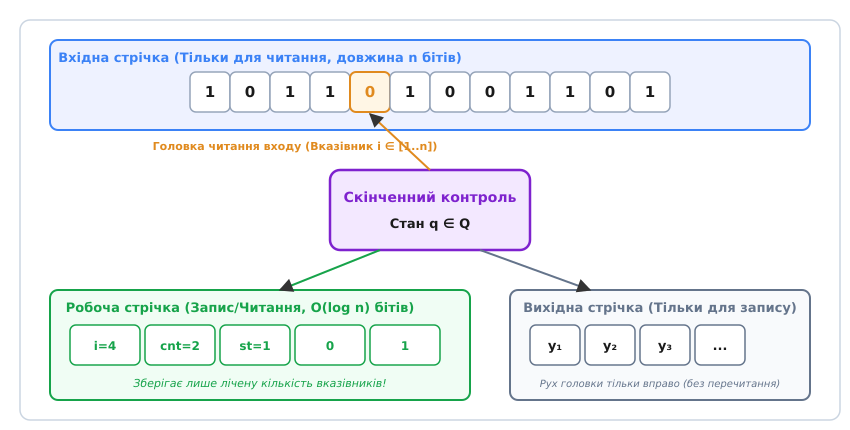
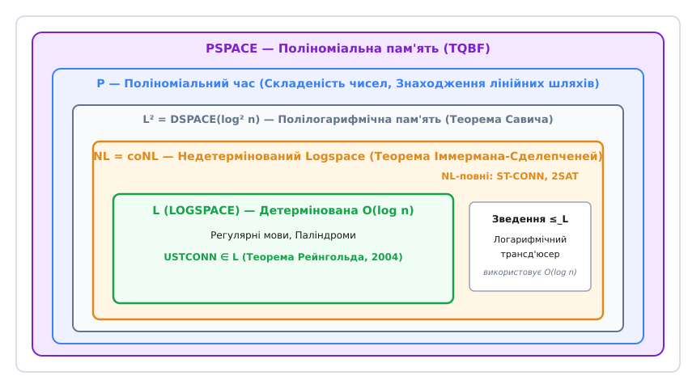
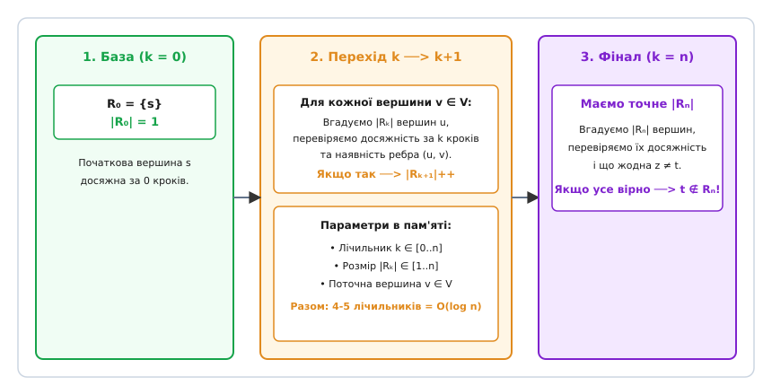
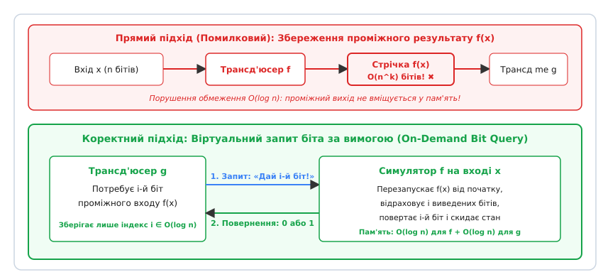

# Класи складності логарифмічної пам'яті L та NL

<preknowlist>
- [Асимптотична складність](topic:algorithms/asymptotic-complexity) — поняття поліномного O(nᵏ) та експоненційного 2ⁿ часу, просторова складність DSPACE і NSPACE.
- [Машина Тюринга](topic:math/turing-machine) — детерміновані та недетерміновані обчислювачі, стрічка, конфігурація та функція переходу.
- [NP-повнота](topic:algorithms/np-completeness) — класи P, NP, coNP, асиметрія пошуку розв'язку та перевірки готового свідка.
- [Клас PSPACE](topic:algorithms/pspace) — поліноміальна пам'ять, конфігураційний простір та теорема Савича.
- [Поліноміальна ієрархія](topic:algorithms/polynomial-hierarchy) — вежі з чергуванням кванторів, оракульні машини та класи Σₖᵖ, Πₖᵖ.
- [Клас схем AC0](topic:algorithms/ac0-circuits) — булеві схеми константної глибини з необмеженою валентністю вентилів.
</preknowlist>

Мікроконтролер космічного апарата або автомобільний контролер гальмівної системи ABS опрацьовує безперервний потік телеметрії обсягом у десятки гігабайтів, володіючи при цьому всього кількома кілобайтами оперативної пам'яті. У такій системі неможливо зберегти навіть коротку копію вхідного масиву даних. Єдине, що може дозволити собі алгоритм — це тримати у пам'яті кілька числових лічильників та вказівників, які показують на поточні позиції у зовнішньому вхідному буфері.

Якщо довжина вхідного потоку становить `n` бітів, то для збереження номера позиції від `1` до `n` потрібно записати двійкове число, яке займає точно `\lceil \log_2 n \rceil` бітів. Зберігання фіксованої кількості `k` таких вказівників вимагає `k · \log_2 n` бітів оперативної пам'яті, що в асимптотичному аналізі становить `O(\log n)`. 

Саме це суворе обмеження утворює фундамент **класів складності L (LOGSPACE) та NL (NLOGSPACE)** — математичної теорії обчислень, які виконуються з логарифмічним обсягом оперативної пам'яті. У цій області теоретичної інформатики вивчають фундаментальну межу: що саме здатні обчислити комп'ютери, якщо їм дозволено пам'ятати лише вказівники на вхідні дані.

> 📜 **Історія визрівання:** [від формалізації Гартманіса й Савича до фундаментального результату Рейнгольда](topic:algorithms/l-nl-logspace/hist-logspace.md) — як дослідники 1960–1980-х років розмежували просторові й часові ресурси, чому спровокувала бурю теорема Іммермана-Сделепченей та як було розв'язано проблему досяжності в неорієнтованих графах.

---

## 1. Модель тристрічкової машини та фізика логарифмічного простору

Щоб коректно вимірювати обсяг пам'яті, який є меншим за розмір вхідного слова `n` (тобто `S(n) < n`), класична однострічкова машина Тюринга не підходить. Якщо машина зберігає вхідні дані на єдиній робочій стрічці, то самі вхідні дані вже займають `n` комірок, що робить розгляд логарифмічної пам'яті `O(\log n)` формально неможливим.

Для вирішення цієї суперечності в теорії складності застосовують **тристрічкову модель машини Тюринга**:

1. **Вхідна стрічка (Read-Only):** містить вхідне слово довжини `n`. Зчитувальна головка може вільно переміщатися вліво та вправо, але програмі суворо заборонено змінювати або перезаписувати символи на цій стрічці.
2. **Робоча стрічка (Read-Write):** оперативна пам'ять алгоритму. Саме її розмір підлягає обмеженню `S(n) = O(\log n)`. Робоча головка може читати, писати та стирати дані.
3. **Вихідна стрічка (Write-Only):** призначена для виведення результату обчислень (наприклад, при зведенні однієї задачі до іншої). Головка запису може рухатися тільки вправо і не здатна зчитувати раніше записані символи.


*Тристрічкова модель: вхідна стрічка доступна тільки для читання, робоча стрічка обмежена O(log n) бітами, а вихідна стрічка працює виключно на запис без можливості повторного зчитування.*

Логарифмічна пам'ять за своєю природою відповідає можливості зберігати **сталу кількість вказівників та лічильників**. Наприклад, якщо алгоритм аналізує граф з `|V| = n` вершинами, вказівник на одну вершину становить `\log_2 n` бітів. Маючи робочу пам'ять `c · \log_2 n`, програма може одночасно зберігати у пам'яті `c` різних вершин або index-вказівників на вхідні символи. Проте вона абсолютно не здатна зберегти стек викликів глибиною `n` або копію списку суміжності графа.

### Нижній поріг просторової складності: чому логарифм є мінімумом
Виникає природне запитання: чи існують змістовні класи складності для пам'яті, меншої за `O(\log n)`, наприклад `O(\log \log n)` або `O(1)`?

Фундаментальна теорема Гартманіса, Льюїса та Стірнса про просторові межі стверджує, що для будь-якої тристрічкової машини Тюринга:
- Якщо `S(n) = o(\log \log n)`, то клас `DSPACE(S(n))` збігається з класом регулярних мов `DSPACE(1)`.
- Будь-яка нерегулярна мова (наприклад, мова дужкових структур або паліндромів `{w wᴿ}`) вимагає щонайменше `Ω(\log \log n)` пам'яті для відстеження позицій.
- Якщо ж ми вимагаємо від алгоритму можливості відстежувати індекси вхідного слова довжини `n`, то **логарифмічний простір O(\log n) є найменшою функціональною межею**, яка дозволяє алгоритмам адресувати кожен символ входу.

---

## 2. Формальне означення класів L та NL

Математичний апарат теорії складності визначає просторові класи через класи детермінованих `DSPACE(f(n))` та недетермінованих `NSPACE(f(n))` машин Тюринга.

### Означення класів L та NL
- **Клас L (LOGSPACE):** множина всіх мов (задач розпізнавання), які приймаються детермінованою тристрічковою машиною Тюринга з робочою пам'яттю `O(\log n)`:
```
L = DSPACE(log n)
```
- **Клас NL (NLOGSPACE):** множина всіх мов, які приймаються недетермінованою тристрічковою машиною Тюринга, у якої на кожній гілці недетермінованого вибору обсяг робочої пам'яті обмежений `O(\log n)`:
```
NL = NSPACE(log n)
```

### Обмеження конфігураційного простору: чому пам'ять обмежує час
Ключова властивість просторових класів полягає у тому, що суворе обмеження на пам'ять автоматично накладає верхню межу на час виконання.

Обчислимо повну кількість унікальних **конфігурацій** `N`, у яких може перебувати логарифмічна машина Тюринга на вході довжини `n`. Конфігурація повністю визначається чотирма параметрами:
1. Поточним внутрішнім станом скінченного контролю `q ∈ Q` (всього `|Q|` варіантів).
2. Позицією головки на вхідній стрічці `i ∈ [1..n]` (всього `n` варіантів).
3. Позицією головки на робочій стрічці `j ∈ [1..S(n)]` (всього `S(n)` варіантів).
4. Вмістом `S(n)` комірок робочої стрічки в алфавіті `Γ` (всього `|Γ|^{S(n)}` варіантів).

Загальна кількість конфігурацій обчислюється як добуток:
```
N = |Q| · n · S(n) · |Γ|^{S(n)}
```

Підставивши значення `S(n) = c · \log_2 n`, отримаємо:
```
|Γ|^{c · \log_2 n} 
= 2^{(c · \log_2 |Γ|) · \log_2 n}     [перехід до основи 2: a^b = 2^(b·log₂ a)]
= (2^{\log_2 n})^{c · \log_2 |Γ|}     [перестановка показників степеня]
= n^{c · \log_2 |Γ|}                  [основна логарифмічна тотожність: 2^(log₂ n) = n]
```

Звідси загальна кількість конфігурацій становить:
```
N = |Q| · n · (c · \log_2 n) · n^{c · \log_2 |Γ|} 
= O(n^{d})
```
де `d = 1 + c · \log_2 |Γ|` є деякою сталою величиною.

Цей результат має фундаментальне значення: **детермінована логарифмічна машина Тюринга має не більше ніж поліноміальну кількість унікальних станів O(nᵈ)**. Якщо детермінований алгоритм працюватиме більше ніж `N` кроків, він за принципом Діріхле вдруге потрапить у вже пройдену конфігурацію і зайде у безкінечний цикл. 

Отже, будь-який алгоритм з класу L гарантовано завершується за поліноміальний час `O(nᵈ)`. Звідси випливає ланцюжок вкладення фундаментальних класів складності:

```
L ⊆ NL ⊆ P ⊆ NP ⊆ PSPACE
```


*Ієрархія просторових і часових класів складності: L міститься у NL, NL збігається з coNL і вкладений у полілогарифмічний клас L², який знаходиться всередині поліноміального часу P.*

---

## 3. Недетермінізм у логарифмічній пам'яті та задача досяжності (ST-CONN)

У часовій складності різниця між детермінізмом (P) та недетермінізмом (NP) залишається найвеличнішою нерозв'язаною загадкою математики. Проте у просторовій складності недетермінізм проявляє зовсім інші властивості.

Недетермінована машина Тюринга в класі NL на кожному кроці може вгадувати один із декількох варіантів подальшого руху (наприклад, вибрати ребро в графі). При цьому вона не повинна зберігати історію своїх попередніх виборів чи будувати дерево обчислень у пам'яті — вона лише прямує по одній з гілок, і якщо хоча б одна гілка приведе до приймаючого стану, вхідне слово вважається прийнятим.

### Головна NL-повна задача: Досяжність у орієнтованому графі (ST-CONN)
Центральною задачею для класу NL є **ST-CONN (Directed Graph Reachability / PATH)**:
- **Вхід:** орієнтований граф `G = (V, E)` з `n` вершинами та дві виділені вершини `s` (початок) і `t` (кінець).
- **Питання:** чи існує орієнтований шлях у графі `G` від вершини `s` до вершини `t`?

Алгоритм доведення того, що `ST-CONN ∈ NL`, демонструє елегантну простоту недетермінованого логарифмічного обчислення:

1. Встановлюємо поточну вершину `curr = s`.
2. Заводимо лічильник кроків `steps = 0`.
3. Поки `steps < n`:
   - Якщо `curr == t`, алгоритм зупиняється й видає відповідь «ТАК».
   - Недетерміновано вгадуємо наступну вершину `next ∈ V`.
   - Перевіряємо за вхідною стрічкою, чи існує орієнтоване ребро `(curr, next) ∈ E`.
   - Якщо ребра немає, поточна гілка обчислення блокується (відхиляється).
   - Якщо ребро є, оновлюємо `curr = next` і збільшуємо `steps = steps + 1`.
4. Якщо після `n` кроків вершину `t` не досягнуто, гілка завершується відмовою.

**Аналіз пам'яті:** робоча стрічка зберігає лише дві змінні — номер поточної вершини `curr` та лічильник `steps`. Оскільки `curr ∈ [1..n]` та `steps ∈ [1..n]`, кожна з них вимагає `\lceil \log_2 n \rceil` бітів. Загальний обсяг пам'яті становить `2 · \log_2 n = O(\log n)` бітів. Отже, `ST-CONN ∈ NL`.

### Задача 2-SAT як NL-повна проблема
Іншим класичним прикладом NL-повної задачі є **2-SAT** (здійсненність булевих формул у 2-кон'юнктивній нормальній формі, де кожна диз'юнкція містить не більше двох літералів).

Доведення належності 2-SAT до NL здійснюється через побудову **графа імплікацій**. Диз'юнкція `(A ∨ B)` математично еквівалентна двом імплікаціям: `(¬A → B)` та `(¬B → A)`. Булева формула 2-SAT є здійсненною тоді й лише тоді, коли у графі імплікацій не існує жодної змінної `x`, для якої одночасно є шлях від `x` до `¬x` та шлях від `¬x` до `x`.

Розглянемо приклад: формула `(x₁ ∨ x₂) ∧ (¬x₁ ∨ x₂) ∧ (x₁ ∨ ¬x₂) ∧ (¬x₁ ∨ ¬x₂)` створює граф імплікацій з циклами `x₁ → ¬x₁ → x₁` та `x₂ → ¬x₂ → x₂`. Оскільки присутні обопільні шляхи між літералами та їхніми запереченнями, формула є суперечливою (нездійсненною).

Оскільки перевірка відсутності такого шляху зводиться до перевірки досяжності в орієнтоованому графі, задача 2-SAT належить до класу NL. Натомість задача 3-SAT є NP-повною, що підкреслює глибокий бар'єр між диз'юнктами довжини 2 та 3: для 3-SAT неможливо побудувати еквівалентний граф імплікацій зі сталим числом літералів на ребро, оскільки вибір значення однієї змінної залежить від комбінації двох інших.

---

## 4. Теорема Савича та полілогарифмічний недетермінізм

Фундаментальне питання теорії складності полягає у тому, наскільки детермінована пам'ять поступається недетермінованій. У 1970 році Волтер Савич (Walter Savitch) довів теорему, яка повністю закриває це питання для просторових ресурсів.

> **Теорема Савича (просторова симуляція недетермінізму):**
> Для будь-якої функції `S(n) ≥ \log n` виконується співвідношення:
> ```
> NSPACE(S(n)) ⊆ DSPACE(S(n)²)
> ```

Застосувавши теорему Савича до логарифмічної пам'яті `S(n) = \log n`, отримуємо результат:
```
NL ⊆ DSPACE(log² n)
```
Клас `DSPACE(\log² n)` називають **полілогарифмічним простором** і позначають як `L²`.

### Ідея алгоритму Савича: рекурсія діленням навпіл
Щоб детерміновано перевірити досяжність `t` з `s` за `k` кроків у графі з `n` вершинами, застосовують рекурсивну функцію `CanReach(u, v, k)`:

```
CanReach(u, v, k):
    якщо k == 1:
        повернути (u == v) або існування ребра (u, v) у графі
    для кожної вершини w ∈ V:
        якщо CanReach(u, w, ⌈k/2⌫) і CanReach(w, v, ⌊k/2⌋):
            повернути ІСТИНА
    повернути ХИБНІСТЬ
```

**Аналіз простору:** Глибина стек-рекурсії для цього алгоритму становить `\log_2 n` рівнів. На кожному рівні рекурсії алгоритм зберігає лише номер проміжної вершини `w`, що вимагає `\log_2 n` бітів.

Загальний обсяг пам'яті для всього стека обчислюється як добуток глибини рекурсії на розмір одного кадру:
```
S(n) = (глибина рекурсії) · (пам'ять кадру) = \log_2 n · \log_2 n = O(\log² n)
```

Ціною такого кардинального стиснення пам'яті є час виконання: алгоритм Савича виконує перебір проміжних вершин на кожному рівні, що призводить до часової складності:
```
T(n) = O(n^{\log_2 n})
```
Для графа з `n = 1000` вершин час обчислення сягає `1000^{10} = 10^{30}` операцій, що є суперполіноміальним часом. Це ілюструє класичний драматичний компроміс між часом та пам'яттю.

---

## 5. Симетрія заперечення: теорема Іммермана-Сделепченей (NL = coNL)

Протягом майже двох десятиліть у теоретичній інформатиці панувала впевненість, що клас NL не замкнений відносно доповнення, тобто `NL ≠ coNL`. У часовій складності вважається, що `NP ≠ coNP` (перевірка наявності виконання формули SAT фундаментально простіша за доведення того, що формула не має жодного розв'язку). Оскільки NL моделював недетермінізм, логічно припускали таку ж асиметрію.

Проте у 1987 році Ніл Іммерман (Neil Immerman) та Роберт Сделепченей (Róbert Szelepcsényi) незалежно відкрили приголомшливий факт, який спростував попередні уявлення.

> **Теорема Іммермана-Сделепченей (1987):**
> Для будь-якої просторової функції `S(n) ≥ \log n` клас `NSPACE(S(n))` замкнений відносно доповнення:
> ```
> NSPACE(S(n)) = coNSPACE(S(n))
> ```
> Зокрема для логарифмічної пам'яті:
> ```
> NL = coNL
> ```

Це означає, що задача **UNREACHABILITY** (перевірити, що між `s` та `t` **не існує** шляху в орієнтованому графі) вирішується в недетермінованій логарифмічній пам'яті NL за допомогою такого ж `O(\log n)` обсягу оперативної пам'яті.

### Ключ до доведення: Метод індуктивного підрахунку (Inductive Counting)
Щоб довести недосяжність вершини `t`, алгоритм повинен перебрати всі вершини графа і переконатися, що жодна з тих вершин, які є досяжними з `s`, не збігається з `t`. Проте недетермінована машина не може зберегти список усіх досяжних вершин, бо такий список вимагав би `O(n)` бітів пам'яті.

Іммерман та Сделепченей обійшли це обмеження за допомогою алгоритму **індуктивного підрахунку**.

Нехай `R_k` — множина всіх вершин графа `G`, які досяжні з початкової вершини `s` за не більше ніж `k` кроків. Замість збереження самої множини `R_k`, алгоритм обчислює лише її точний розмір `r_k = |R_k|`.


*Схема індуктивного підрахунку: послідовне обчислення розміру досяжної множини |Rₖ| з подальшою перевіркою недосяжності цільової вершини t без збереження списку вершин.*

Алгоритм обчислює `r_{k+1}` на основі вже відомого значення `r_k`:
1. **База індукції:** При `k = 0` маємо `R_0 = {s}`, отже `r_0 = 1`.
2. **Крок індукції (`r_k → r_{k+1}`):** Для кожної вершини `v ∈ V` алгоритм недетерміновано перевіряє, чи є вона досяжною за `k+1` кроків. Для цього він недетерміновано вгадує `r_k` різних вершин `u_1, u_2, ..., u_{r_k}`, для кожної з яких підтверджує досяжність з `s` за `k` кроків. Якщо хоча б для однієї з них існує ребро `(u_i, v)` або `u_i == v`, лічильник `r_{k+1}` збільшується на 1.
3. **Фінальна перевірка:** Знаючи точне значення `r_n = |R_n|` (загальну кількість вершин, досяжних з `s`), алгоритм недетерміновано згенеровує всі `r_n` досяжних вершин, перевіряє їх досяжність і переконується, що **жодна з них не є вершиною `t`**.

Завдяки цьому методу недетермінований алгоритм здатен підтвердити **відсутність** об'єкта, не зберігаючи масив знайдених елементів, а зберігаючи лише 4–5 числових лічильників, кожен з яких займає `\log_2 n` бітів.

### Відкрита проблема L проти NL
Незважаючи на доведення тотожності `NL = coNL`, питання про те, чи дорівнює `L = NL`, залишається однією з головних відкритих проблем теоретичної інформатики. Переважна більшість фахівців схиляється до гіпотези, що `L ≠ NL`, оскільки недетермінізм у логарифмічному просторі дає можливість здійснювати вгадування шляхів у графах без збереження стека, що здається неможливим для детермінованих алгоритмів без збільшення пам'яті до `O(\log² n)`.

> 🧮 **Математичний аналіз:** [доведення теореми Іммермана-Сделепченей методом індуктивного підрахунку](topic:algorithms/l-nl-logspace/math-immerman-szelepcsenyi.md) — детальний крок-за-кроком вивід індуктивних переходів, коректності лічильників та збереження O(log n) обмеження пам'яті.

---

## 6. Зведення за логарифмічною пам'яттю (≤_L) та трансд'юсери

У теорії NP-повноти стандартним інструментом є зведення за поліноміальний час (зведення за Карпом `≤_P`). Проте для аналізу класів L та NL зведення `≤_P` є надто «грубим»: оскільки клас P містить і L, і NL, поліноміальний трансд'юсер міг би самостійно повністю розв'язати будь-яку задачу з L або NL ще під час процедури зведення.

Тому для дослідження точної структури всередині класу P використовують **зведення за логарифмічною пам'яттю (`≤_L`)**.

### Визначення логарифмічного трансд'юсера
Мова `A` зводиться за логарифмічною пам'яттю до мови `B` (`A ≤_L B`), якщо існує функція `f: Σ* → Σ*`, яка обчислюється детермінованою машиною Тюринга (логарифмічним трансд'юсером) з робочою пам'яттю `O(\log n)`, така що:
```
x ∈ A ⇔ f(x) ∈ B
```

Трансд'юсер має три стрічки: вхідну (read-only), робочу (обмежену `O(\log n)` бітами) та вихідну (write-only).

> 📋 **Інтерфейс та специфікація:** [інтерфейс логарифмічного трансд me та контракт зведення](topic:algorithms/l-nl-logspace/api-logspace-transducer.md) — повний формальний контракт автоматного інтерфейсу, обмеження вихідної стрічки та системний POSIX-протокол обмеження пам'яті.

### Парадокс композиції логарифмічних функцій
Головна математична складність логарифмічних зведень полягає у доведенні **транзитивності**: якщо `A ≤_L B` за допомогою функції `f`, а `B ≤_L C` за допомогою функції `g`, чи правда, що `A ≤_L C` за допомогою композиції `g(f(x))`?

Пряма спроба обчислити `f(x)`, записати результат на проміжну стрічку, а потім запустити на ній `g` є **помилковою**: довжина результату `f(x)` може становити `O(n^k)` бітів. Збереження такого проміжного слова вимагатиме поліноміальної пам'яті, що порушує обмеження `O(\log n)`.


*Проблема композиції та її розв'язання: замість запису поліноміального слова f(x) у пам'ять, симулятор g здійснює віртуальний запит конкретного i-го біта f(x) за вимогою (On-Demand Bit Query).*

Розв'язанням є **метод віртуального обчислення за вимогою (Lazy Bit Query Protocol)**:
1. Машина для `g(f(x))` виконує обчислення `g`.
2. Коли `g` намагається зчитати `i`-й біт свого вхідного слова `f(x)`, замість читання зі стрічки вона призупиняється.
3. Алгоритм зберігає індекс `i` (який займає `O(\log n)` бітів) і перезапускає трансд'юсер `f` від початку на вихідному вході `x`.
4. Трансд'юсер `f` генерує свої вихідні символи один за одним, але замість запису на вихід він лише рахує їхню кількість за допомогою лічильника.
5. Коли відраховано точно `i` символів, `i`-й символ повертається алгоритму `g`, після чого стан `f` повністю скидається.

Оскільки зберігається лише один індекс `i` та стан машин, загальний обсяг пам'яті залишається `O(\log n)`. Це доводить транзитивність зведень `≤_L`.

---

## 7. Неорієнтована досяжність (USTCONN) та прорив Рейнгольда

Протягом десятиліть однією з найцікавіших задач теоретичної інформатики залишалася **USTCONN (Undirected Graph Reachability)** — перевірка наявності шляху між `s` та `t` у **неорієнтованому** графі.

Задача досяжності в орієнтованому графі (ST-CONN) є NL-повною. Проте відсутність орієнтації ребер робить неорієнтовані графи фундаментально симетричнішими: якщо з `u` можна перейти у `v`, то з `v` завжди можна повернутися у `u`.

Очевидно, що `USTCONN ∈ NL`. Тривалий час було відомо, що `USTCONN` належить до імовірнісного логарифмічного класу **RL (Randomized Logspace)**: випадкове блукання (Random Walk) по неорієнтованому графу з імовірністю `≥ 1/2` знаходить цільову вершину `t` за поліноміальну кількість кроків, використовуючи лише `O(\log n)` пам'яті для збереження поточної вершини.

Проте залишалося відкритим питання: чи можна розв'язати USTCONN **детерміновано** у логарифмічній пам'яті?

> **Теорема Омера Рейнгольда (Omer Reingold, 2004):**
> Задача досяжності у неорієнтованих графах належить до детермінованого логарифмічного класу L:
> ```
> USTCONN ∈ L
> ```

### Механізм алгоритму Рейнгольда: Розширювальні графи (Expander Graphs)
Доведення Рейнгольда базується на використанні **зигзаг-добутку (Zig-zag product)** графових розширювачів. 

Ідея полягає у послідовній трансформації початкового графа `G`:
1. Граф перетворюють на регулярний граф зі сталим степенем вершин `d`.
2. За допомогою повторного застосування зигзаг-добутку з фіксованим експандером малого розміру спектральна щілина графа (Spectral Gap `1 - λ`) поступово збільшується.
3. Збільшення спектральної щілини означає, що діаметр кожної зв'язаної компоненти графа логарифмічно зменшується, доки граф не перетвориться на набір компонент з логарифмічним діаметром `O(\log n)`.
4. На графі з логарифмічним діаметром перевірка досяжності здійснюється простим детермінованим обходом у глибину на глибину `O(\log n)`, що вимагає лише `O(\log n)` оперативної пам'яті.

Цей видатний результат показав, що детермінована логарифмічна пам'яті є значно потужнішою, ніж вважалося раніше, і повністю ліквідував розрив між імовірнісними алгоритмами (RL) та детермінованим простором (L) для неорієнтованих графів.

### Дерандомізація та математичне значення теореми Рейнгольда
Відкриття Рейнгольда має величезне значення для всієї теорії складності, оскільки воно продемонструвало працездатність концепції **дерандомізації (Derandomization)**.

Протягом тривалого часу імовірнісний алгоритм випадкового блукання (Random Walk) залишався єдиним практичним способом перевірки досяжності в `O(\log n)` пам'яті. При випадковому блуканні алгоритм переходить у випадкового сусіда поточної вершини. Оскільки для неорієнтованого графа матриця суміжності є симетричною, стаціонарний розподіл Марковського ланцюга є рівномірним, а математичне сподівання часу покриття (Cover Time) не перевищує `2|E| · |V| = O(n³)`.

Проте імовірнісні алгоритми залишають потенційну можливість помилки (хоча й зникаюче малої при повторних запусках). Конструкція Рейнгольда довела, що використання імовірнісного джерела вихідних бітів у просторовій складності не додає фундаментальної обчислювальної сили для неорієнтованої досяжності: будь-яке імовірнісне блукання можна замінити детермінованою послідовністю переходів через експандерні графи.

> ⚙️ **Алгоритмічна реалізація:** [реалізація алгоритмів перевірки досяжності та 2-SAT у C та C++](topic:algorithms/l-nl-logspace/proj-st-connectivity.md) — практичні C та C++ реалізації обходу графів, рекурсії Савича та 2-SAT перевірки з оптимізованим використанням пам'яті.

---

## 8. Зв'язок із схемною складністю та класом NC

Для глибшого розуміння місця класів L та NL в теорії обчислень важливо розглянути їхній зв'язок із **схемною складністю (Circuit Complexity)** та паралельними обчисленнями.

Клас **NC (Nick's Class)** та [клас схем AC0](topic:algorithms/ac0-circuits) моделюють задачі, які ефективно паралелізуються на схемних обчислювачах поліноміального розміру:
- **AC⁰:** мови, що розпізнаються булевими схемами константної глибини `O(1)` з вентилями AND/OR необмеженої валентності входу.
- **NC¹:** мови, що розпізнаються булевими схемами логарифмічної глибини `O(\log n)` з вентилями AND/OR степеня входу 2.
- **NC²:** мови, що розпізнаються схемами глибини `O(\log² n)`.

Існує фундаментальне ланцюгове співвідношення між схемними та просторовими класами:
```
AC⁰ ⊂ NC¹ ⊆ L ⊆ NL ⊆ NC² ⊆ P
```

Це свідчить про те, що будь-яка задача, яка розв'язується у логарифмічній пам'яті L або NL, може бути ефективно обчислена на паралельному комп'ютері за полілогарифмічний час `O(\log² n)` із використанням поліноміальної кількості процесорів.

Зокрема, оцінка арифметичних виразів над дужковими структурами та перевірка збалансованості дужок належить до класу NC¹, а отже, і до детермінованого логарифмічного простору L.

Втім, питання про те, чи збігаються класи NC¹ та L, залишається відкритим. Схемна модель вимагає паралельного обчислення всіх гілок булевого дерева за логарифмічний час, тоді як послідовний алгоритм у логарифмічній пам'яті виконується поліноміальний час, але з мінімальним ресурсом RAM. Розмежування цих класів є важливим напрямком сучасної математичної теорії складнісних ієрархій.

---

## 9. Практичне значення та інженерне застосування логарифмічного мислення

Розгляд класів L та NL може здатися суто абстрактною математичною дисципліною, проте принципи логарифмічної пам'яті лежать в основі проектиування сучасних високопродуктивних систем обробки даних.

> 🔧 **Навіщо це.**
> Концепція логарифмічного простору вимагає від інженера кардинальної зміни мислення: **відмови від локального буферизатора на користь потокових обчислень та ітераторів за вимогою**.
> 
> Потокова обробка великих даних (Streaming Systems) у системному програмуванні спирається саме на ці модальності:
> - **Zero-Allocation Parsers (SAX / Streaming JSON / Protocol Buffers):** парсери мережевих пакетів у ядрах ОС або високонавантажених проксі (на кшталт Nginx чи HAProxy) не створюють дерево об'єктів у пам'яті (DOM), оскільки це вимагало б `O(n)` пам'яті від розміру документа. Замість цього вони використовують скінченний автомат з `O(\log n)` пам'яті, який зберігає лише поточний стан та кілька індексних вказівників.
> - **Спеціалізовані мікроконтролери та вбудовані системи (Embedded & IoT):** пристрої з 512 байтами RAM під час виконання критичних завдань керування польотом або медичними приладами не можуть дозволити динамічне виділення пам'яті (`malloc`). Алгоритми, спроектовані за шаблонами логарифмічного простору, гарантують відсутність переповнення стека чи витоків пам'яті.
> - **Обробка великих графів на дискових масивах (External Memory Algorithms):** коли граф зв'язків соціальної мережі чи веб-павука обсягом у десятки петабайтів не вміщується в RAM сервера, алгоритми перевірки досяжності оперують лише вказівниками на блоки диска, мінімізуючи обсяг оперативної пам'яті.

### Підсумкова таблиця порівняння класів пам'яті

| Клас складності | Модель обчислення | Обсяг пам'яті | Головна характерна задача | Часова межа виконання |
| :--- | :--- | :--- | :--- | :--- |
| **NC¹** | Булеві схеми | `O(\log n)` глибина | Оцінка арифметичних виразів | `O(\log n)` паралельно |
| **L** | Детермінована МТ | `O(\log n)` | USTCONN, Регулярні мови, 2-SAT (детерміновано) | `O(nᵈ)` (Поліноміальний) |
| **NL (= coNL)** | Недетермінована МТ | `O(\log n)` | ST-CONN, 2-SAT, UNREACHABILITY | `O(nᵈ)` (Поліноміальний) |
| **L²** | Детермінована МТ | `O(\log² n)` | Симуляція Савича для NL | `O(n^{\log n})` (Суперполіном) |
| **P** | Детермінована МТ | Поліном за часом | CVP (Circuit Value Problem), Max Flow | `O(nᵏ)` (Поліноміальний) |
| **PSPACE** | Детермінована МТ | `O(nᵏ)` | TQBF, Шахи на дошці n×n | `2^{O(nᵏ)}` (Експоненційний) |

Теорія класів L та NL демонструє глибоку внутрішню гармонію обчислювального світу: жорстке обмеження простору до логарифмічних межеутворюючих лічильників здатне приборкати експоненційний вибух часових комбінацій, залишаючи обчислення у межах поліноміальної реалістичності.

Математичні гарантії логарифмічного простору показують, що навіть при вкрай обмежених фізичних ресурсах оперативної пам'яті комп'ютер здатний вирішувати складні структуровані задачі. Дослідження класів L та NL продовжує надихати розробників новітніх розподілених систем, алгоритмів потокового парсингу даних та архітектур спеціалізованих обчислювачів.
