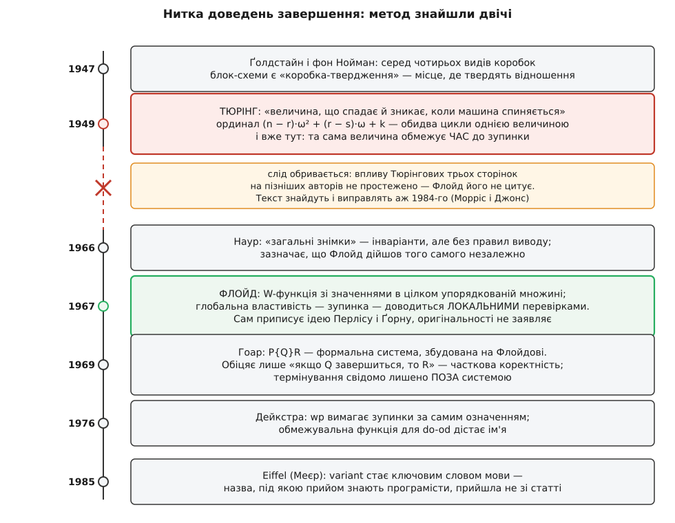

# 📜 Хто довів, що цикл спиниться

Наприкінці 1940-х машина, яка не спинялася, була не абстракцією з семінару, а звичайним робочим днем. Програму заряджали, вона крутилася, і хтось стояв біля стійки й дивився на лампи, вирішуючи: воно ще рахує — чи вже навіки? Розсудити не міг ніхто, бо єдиний чесний спосіб пересвідчитися, що цикл **не** спиниться, — чекати нескінченно. Прогони теж не рятували: хоч скільки входів перебери, зависання сидить рівно на тому, якого ти не перебрав.

Отже, зупинку треба було доводити — на папері, не запускаючи машину. І тут виявилася заковика: ніхто не знав, як узагалі виглядає доведення **про програму**. Математики вміли доводити теореми про числа й фігури, а програма — це не твердження, це послідовність дій. Що тут доводити і як?

## Твердження в коробці

Перший крок зробили не з боку зупинки, а з боку правильності. У квітні 1947-го Герман Ґолдстайн (Herman Goldstine, американець) і Джон фон Нойман (John von Neumann; народився як Neumann János Lajos у Будапешті в угорсько-єврейській родині, від 1930-х працював у США) випустили доповідь «Planning and Coding of Problems for an Electronic Computing Instrument». Там уперше з'явилася блок-схема — і в ній чотири різновиди коробок: операційна, альтернативна, підстановча і, найцікавіша, **коробка-твердження** (assertion box).

Коробка-твердження нічого не робить. Вона не змінює жодної величини й не витрачає жодного такту машини. Вона лише **стверджує**: коли керування дійшло сюди, між величинами тримається ось таке відношення. Це і є зародок усього подальшого — думка, що програму можна проколоти в кількох місцях і в кожному записати правду про стан, а тоді перевіряти не всю програму нараз, а лише ділянки між сусідніми проколами.

Але про **зупинку** там не було ні слова. Коробка-твердження каже, що́ буде правдою в точці, якщо виконання туди дійде. А чи дійде — питання, якого ще ніхто не поставив.

## Кембридж, 24 червня 1949

Поставив його Алан Тюрінг (Alan Turing, британець) — і одразу відповів.

Того дня в Математичній лабораторії Кембриджського університету відкривали EDSAC — машину, збудовану під керівництвом Моріса Вілкса. На інавгураційній конференції Тюрінг прочитав доповідь «Checking a Large Routine» — три сторінки великого паперу. Він мав право говорити: програми для електронної машини він писав із кінця 1945-го — спершу для проєктованої ACE у Національній фізичній лабораторії, а з жовтня 1948-го для манчестерського прототипа, де був заступником директора.

Починає він з аналогії — і аналогія точна. Уяви, що перевіряєш чуже додавання довгого стовпця чисел. Якщо дано лише підсумок, доводиться перелічувати весь стовпець за один раз, бо переноси зв'язують усе з усім. А якщо той, хто рахував, **дописав проміжні суми по колонках**, робота розпадається на дрібні незалежні перевірки, і кожну можна зробити окремо, у будь-якому порядку. Звідси Тюрінгова вимога до програміста: лиши тому, хто перевірятиме, набір окремих тверджень, з яких правильність цілого випливає легко.

Ілюструє він це на малій підпрограмі — обчисленні `n!` **без множника**, самим лише додаванням. Це два вкладені цикли: зовнішній нарощує `r` до `n`, внутрішній додає `v` до накопичувача стільки разів, скільки треба, щоб дістати добуток.

```c
/* Підпрограма з Тюрінгової доповіді 1949-го: n! без множника.
   v — попередній факторіал, u — накопичувач,
   r — лічильник зовнішнього циклу, s — внутрішнього.
   Множення (r+1)·v виконується (r+1)-кратним додаванням. */
unsigned long factorial(int n) {
    unsigned long u = 1, v = 1;
    for (int r = 1; r < n; r++) {        /* що спадає тут: n − r */
        v = u;                            /* v = r!              */
        u = 0;
        for (int s = 0; s <= r; s++)      /* що спадає тут: r − s */
            u += v;                       /* u = (r+1)·v = (r+1)! */
    }
    return u;
}
```

І далі — абзац, заради якого варто було все це піднімати. Той, хто перевіряє, пише Тюрінг, мусить пересвідчитися ще й у тому, що процес доходить кінця; і тут йому теж має допомогти програміст, давши ще одне чітке твердження. Воно може набути форми величини, про яку стверджують, що вона **невпинно спадає й зникає, коли машина спиняється** (в оригіналі — «decrease continually and vanish when the machine stops»).

Це 1949 рік. Метод варіанта названо повністю, за одне речення, без жодної попередньої традиції.

Але Тюрінг іде далі. Чистому математикові, каже він, природно дати тут **ординал** — і для цієї задачі ординал міг би бути таким:

```
(n − r)·ω² + (r − s)·ω + k
```

Придивись, що це. Перша «цифра» — запас зовнішнього циклу, `n − r`. Друга — запас внутрішнього, `r − s`. Третя, `k`, — номер коробки в прямій ділянці блок-схеми між перевірками. Три цифри, і кожен окремий **крок машини** зменшує бодай одну з них, а старша переважує будь-який стрибок молодшої: коли `r` зростає на одиницю, `r − s` підскакує вгору, а `k` вертається до початку — та `n − r` при цьому впало, і вся величина стала меншою попри все.

Тобто Тюрінгова величина спадає не «за прохід циклу», як у сучасному підручнику, а **за кожен окремий крок машини**, і однією формулою обслуговує обидва цикли нараз. Морріс і Джонс, розбираючи цей текст 1984 року, зауважать: Тюрінг тут фактично користується словниковим порядком на кортежах, тимчасом як у стилі Флойда зупинку кожного циклу розглядали б окремо.

А тоді Тюрінг додає те, що сьогодні продали б як окрему думку. Менш високочолою (він каже «a less highbrow form») формою того самого, пише він, було б дати замість ординала звичайне ціле:

```
2⁸⁰·(n − r) + 2⁴⁰·(r − s) + k
```

Це не інший метод — це той самий, з `ω`, заміненою на достатньо велику основу. Чому саме `2⁴⁰`? Бо манчестерська машина зберігала числа в 40-бітових «лініях», і жодна з цифр не могла дорости до `2⁴⁰`. Основа, більша за будь-яку цифру, — і словниковий порядок на трійці стає звичайним порядком на одному цілому числі, точнісінько як у позиційному записі. Тюрінг подав обидві форми поспіль, ніби між іншим.

І останнє речення того абзацу: дорогою до доведення зупинки можна ще й **оцінити час**, підібравши спадну величину так, щоб вона була верхньою межею числа кроків до спинення. Варіант як оцінка складності — теж 1949-й.

## Що сказали в залі

Далі йде найдивніше місце в цій історії.

Конференцію стенографували, і обговорення доповіді збереглося. Професор Дуглас Гартрі (Douglas Hartree, британець, тоді професор математичної фізики в Кембриджі, свого часу рушійна сила і в Національній фізичній лабораторії, і в Кембриджі) висловився в тому дусі, що доктор Тюрінг ужив слова «індукція» та «індуктивна змінна» оманливо: більшості математиків «індукція» підкаже [математичну індукцію](topic:math/mathematical-induction) — доведення твердження одразу для всіх натуральних через базу й крок, — тимчасом як процес, що його так називають фон Нойман і Тюрінг, часто є просто повторенням без логічного зв'язку. Професор Макс Ньюмен (Max Newman, британський математик, який відіграв провідну роль у створенні манчестерської машини) запропонував казати натомість «рекурсивна змінна». Доктор Тюрінг усе ж уважав, що його термінологію можна виправдати.

І це все. Перше відоме доведення завершення програми — з ординалом, зі словниковим порядком, з оцінкою часу — прочитано вголос, і єдине, що зала обговорила, це чи вдале слово «індукція».

Іронія тут подвійна. Гартрі мав рацію по суті: те, що Тюрінг робив із **циклами**, справді не було математичною індукцією в чистому вигляді. Але те, що він робив із **зупинкою**, було нею буквально: фундованість натуральних чисел і принцип індукції на них — це те саме твердження, прочитане з різних кінців. Зауваження влучило поруч із найглибшим місцем доповіді й не зачепило його.

## Тридцять п'ять років у забутті

Доповідь надрукували у звіті конференції, на сторінках 67–69. І на цьому нитка обірвалася.

Текст вийшов покаліченим: складач загубив **усі** знаки факторіала — головного символа задачі — і переплутав десяток ідентифікаторів. Читати таке майже неможливо: формули втратили сенс, а разом із ними й доведення.

Але річ навіть не в друкарні. Ф. Л. Морріс (F. L. Morris, Сиракузький університет) і Кліф Джонс (Cliff B. Jones, Манчестерський університет), які 1984 року видали виправлений текст із коментарем в «Annals of the History of Computing», підсумували прямо: попри ранню дату й проникливість тих сторінок, їм **не відомо жодного свідчення**, що ця стаття вплинула на пізніших авторів ідей доведення програм. Це не здогад і не скромність — це висновок фахівців, і він тримається донині: статус — усталено.

Тобто метод варіанта не успадкували від Тюрінга. Його знайшли вдруге, з нуля, майже через двадцять років — а Тюрінгів текст відкопали ще пізніше, як археологи, і не тому, що він був комусь потрібен, а тому, що стало цікаво, з чого все починалося.



*Робоча нитка методу йде повз Тюрінга. Червоний розрив на осі — не пропуск у даних, а сам сюжет: 1949 року все вже було сказано, але не почуте, і його довелося казати заново.*

## Флойд 1967: глобальне з локального

Удруге це сказали двоє, майже одночасно й незалежно.

1966 року данець Петер Наур (Peter Naur, 1928–2016; редактор звіту про ALGOL 60, та сама «N» у записі Бекуса–Наура, Тюрінгова премія 2005) надрукував у журналі BIT статтю «Proof of algorithms by general snapshots». Його «загальні знімки» — це вирази умов, що тримаються щоразу, коли виконання доходить певної точки, тобто [інваріанти](topic:programming/loop-invariants) під іншою назвою. Формальних правил виводу Наур не дав, зате чесно зазначив: подібні поняття незалежно розвинув Роберт Флойд, який повідомив йому це приватно.

1967-го Роберт Флойд (Robert W. Floyd, американець, 1936–2001) надрукував «Assigning Meanings to Programs» — статтю, з якої заведено відлічувати верифікацію програм. Постать сама по собі неймовірна: перший диплом у сімнадцять, другий — із фізики, докторського ступеня він **не мав ніколи**, доцентом у Карнеґі став у двадцять сім, повним професором Стенфорда — у тридцять три, Тюрінгова премія 1978-го.

Флойд ставив за мету суворий стандарт доведень про програми — і зупинку записав у цю мету від початку, поруч із правильністю та еквівалентністю. Його розв'язок такий. З кожним ребром блок-схеми пов'язують не лише твердження, а ще й вираз — **W-функцію**, — що бере значення в цілком упорядкованій множині `W`. Цілком упорядкована множина, нагадує Флойд, це така, де кожна непорожня підмножина має найменший елемент; рівносильно — де немає нескінченних спадних послідовностей. Якщо показати, що після кожної команди значення W-функції на виході менше за значення на вході, величина мусить невпинно спадати, а нескінченний спуск у `W` неможливий — отже, програма рано чи пізно спиниться.

І тут — фраза, заради якої все будувалося: у такий спосіб зупинку, **глобальну** властивість блок-схеми, доводять **локальними** міркуваннями — так само, як доводять правильність. Ось воно, ядро. Не «прогляньмо всі виконання» — а «перевірмо кожну команду окремо, і глобальний висновок складеться сам».

Флойд одразу додає й те, чого шукатимуть десятиліттями по тому: найвідоміша цілком упорядкована множина — цілі числа, і найочевидніший вибір W-функції — формула для числа кроків до кінця або добра верхня межа на нього; але досвід підказує, що інші повні порядки часто зручніші, а подеколи й неминучі — приміром, `n`-ки цілих зі словниковим порядком.

А тепер найважливіше для тих, хто любить питання «хто перший». Флойд у тій-таки статті пише, що ці способи доведення правильності й завершення **не оригінальні**: вони спираються на думки Перліса й Ґорна і, можливо, найраніше з'явилися в неопублікованій праці Ґорна. Ідеться про Алана Перліса (Alan J. Perlis, американець, 1922–1990, перший в історії лауреат Тюрінгової премії, 1966, і перший голова факультету інформатики в Карнеґі — тобто Флойдів старший колега) і Сола Ґорна (Saul Gorn, американець, 1912–1992, Школа Мура при Пенсильванському університеті, ENIAC і EDVAC).

Тобто автор канонічної статті сам каже, що метод не його. Тюрінга він при цьому не згадує — не з неповаги, а тому, що тих трьох сторінок ніхто не читав.

## Гоар 1969: чесно лишена дірка

Далі метод дістав формальну систему — і разом із нею дірку, зроблену навмисне.

Тоні Гоар (C. A. R. «Tony» Hoare, британець; народився 11 січня 1934 в Коломбо на Цейлоні в британській родині, помер 5 березня 2026 в Кембриджі) прийшов до цього незвичайним шляхом: диплом із класичної філології в Оксфорді, російська мова на службі в Королівському флоті, тоді аспірантура в Московському університеті — теорія ймовірностей і машинний переклад, — де він і винайшов швидке сортування. Тюрінгова премія 1980-го, лицарське звання 2000-го.

Його стаття «An Axiomatic Basis for Computer Programming» (Communications of the ACM, том 12, число 10, жовтень 1969) відкривається твердженням, що програмування — точна наука, бо всі властивості програми й усі наслідки її виконання можна, в принципі, вивести з самого тексту програми суто дедуктивно. Стаття спирається на Флойда й переносить його підхід із блок-схем на текст мови, вводячи запис `P{Q}R`.

І ось що цей запис означає — дослівно: якщо твердження `P` істинне перед запуском програми `Q`, то твердження `R` буде істинним **по її завершенні**. Прочитай уважно: «по завершенні». Про те, що завершення станеться, тут не сказано нічого.

Це не недогляд, а рішення. Система Гоара доводить **часткову коректність** і тільки її; термінування свідомо лишене поза нею. Ціна відома й весела: цикл, що не спиняється ніколи, задовольняє **будь-яку** трійку — адже посилка «по завершенні» ніколи не справджується, і твердження про наслідок стає порожньо істинним. Правило ітерації в Гоара має вигляд «якщо інваріант `I` переживає тіло, то після циклу тримається `I` і заперечення умови» — і жодна його частина не питає, чи цикл вийде.

> 🔧 **Навіщо це.** Ця дірка 1969 року й досі відкрита — тільки тепер вона в інструментах. Коли верифікатор каже «доведено», перше питання до нього: доведено **що** — часткову коректність чи повну? Якщо часткову, то `while (true) {}` пройде перевірку з будь-якою постумовою, і це не хиба інструмента, а рівно те, що він обіцяв. Тому там, де зупинка важлива, її вимагають **окремим рядком**, який доводиться писати руками: `decreases` у Dafny (і одразу з кортежами: `decreases m, n`), `loop variant` в ACSL для Frama-C, `variant` в Eiffel, структурно спадний аргумент у `Fixpoint` в Coq. Побачив доведення циклу без такого рядка — доведено половину; і бракує саме тієї половини, яка й зветься зависанням.

Але саме ця чесно лишена дірка дала полю словник. Коли одну половину назвали **частковою коректністю**, друга дістала ім'я за контрастом — **завершуваність**, а сума двох — **повна коректність**. Поділ, який сьогодні здається очевидним, народився з того, що хтось відмовився вдавати, ніби покрив усе.

## Дейкстра 1976: зупинка в самому означенні

Дірку залатав нідерландець Едсгер Дейкстра (Edsger W. Dijkstra, 1930 Роттердам — 2002 Нюенен; перший програміст Нідерландів, узятий на роботу Адріаном ван Вейнґаарденом до Математичного центру в Амстердамі; Тюрінгова премія 1972).

1975-го він надрукував «Guarded commands, nondeterminacy and formal derivation of programs» (Communications of the ACM, том 18, число 8, с. 453–457), а 1976-го вийшла книжка «A Discipline of Programming». Там з'явилася **найслабша передумова** `wp(S, Q)` — і в її означенні зупинка стоїть від початку: це ті початкові стани, з яких `S` **гарантовано завершиться** в стані, що задовольняє `Q`. Не «якщо завершиться», а «завершиться». Термінування перестало бути добавкою до системи й стало частиною самого значення програми.

Для повторюваної конструкції `do … od` Дейкстра ввів **обмежувальну функцію** (bound function) — цілий вираз, що спадає з кожним проходом і лишається невід'ємним. Величина та сама, що в Тюрінга й Флойда; нове тут — місце, яке вона посіла: не збоку від логіки, а всередині означення.

Тут же — деталь, від якої в статті про походження ідей не відвернешся. У передмові до «A Discipline of Programming» Дейкстра написав, що за відсутність бібліографії не пропонує ні пояснення, ні вибачення. Книжка, що дала методові його канонічну форму й половину назв, вийшла без жодного посилання. Нитку, яку ми зараз розплутуємо, обривали не лише складачі 1949 року.

## Звідки взялися назви

Тепер видно, чому в цієї однієї величини стільки імен — і чому жодне з них не Тюрінгове.

У Тюрінга назви не було взагалі: він казав просто «величина» (a quantity). Флойд назвав своє **W-функцією** — від `W`, well-ordered set, цілком упорядкованої множини, куди вона відображає стани; назва прижилася в статтях і майже не вийшла за них. Дейкстра дав **обмежувальну функцію** — і це ім'я живе там, де говорять про `wp` і виведення програм. У літературі з верифікації всі три ходять як синоніми: цілий вираз, що спадає, звуть функцією термінування, іноді обмежувальною функцією, іноді варіантом.

А **варіант** — назва, під якою прийом знають програмісти, — прийшла взагалі не зі статті. Вона утворена від протилежного: інваріант — те, що не змінюється; варіант — те, що мусить змінюватися, і то в один бік. Ключовим словом мови вона стала в Eiffel, яку від 1985 року розробляв француз Бертран Меєр (Bertrand Meyer) разом із [проєктуванням за контрактом](topic:programming/design-by-contract): цикл в Eiffel має обидві необов'язкові секції — `invariant` і `variant`, поруч, як дві половини одного доведення. Не стаття, а синтаксис мови зробив слово загальним.

Пізніше, коли зупинку взялися доводити машинно, та сама величина дістала ще одне ім'я — **ранжувальна функція** (ranking function): у сучасному аналізі завершуваності шукають саме її, і шукають автоматично.

## Що лишається з цієї історії

Три речі, і кожна вперта.

Перша: метод знайшли **щонайменше двічі**, і вдруге — не тому, що вперше вийшло погано, а тому, що вперше ніхто не почув. Тюрінг 1949-го мав повний набір — спадну величину, ординал, словниковий порядок, оцінку часу — і вплив його на подальше дорівнює нулю. Флойд 1967-го мав те саме й змінив поле — бо потрапив у мить, коли питання вже дозріло, і бо його прочитали. Ідея, яку не почули, не стає внеском; вона стає знахідкою для істориків.

Друга: **ніхто з учасників не претендував на одноосібність**. Флойд відсилає до Перліса й Ґорна. Наур зазначає, що Флойд дійшов того самого сам. Гоар будує на Флойді. І всі вони стоять на коробках-твердженнях Ґолдстайна й фон Ноймана. Коли наступного разу почуєш, що метод варіанта «винайшов X», спитай, яку саме з чотирьох різних речей мають на увазі: думку, робочий спосіб, формальну систему чи назву. У цій історії їх зробили різні люди в різні роки.

Третя, і найтихіша: за сімдесят із гаком років **сам аргумент не змінився анітрохи**. Величина спадає, спадати вічно не може, отже, спиниться. Змінилося те, хто її перевіряє: спершу людина з олівцем, якій Тюрінг хотів полегшити роботу, потім правило виводу, потім означення семантики, а тепер [формальна верифікація](topic:programming/formal-verification), де ранжувальну функцію шукає машина. Ядро, яке Тюрінг умістив в одне речення на третій сторінці, пережило всі оправи, які для нього придумали, — і, схоже, переживе ще кілька.
