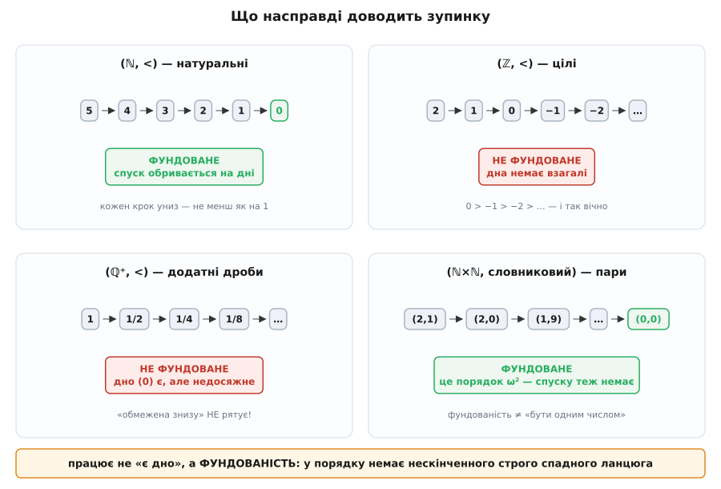
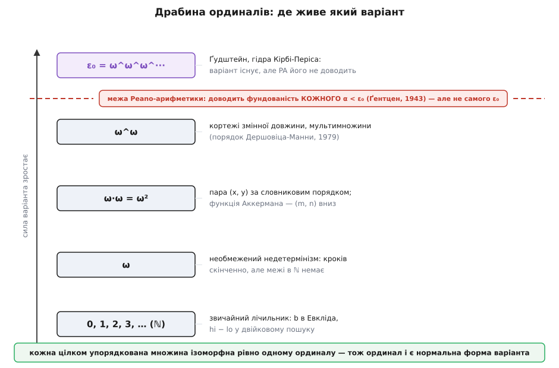
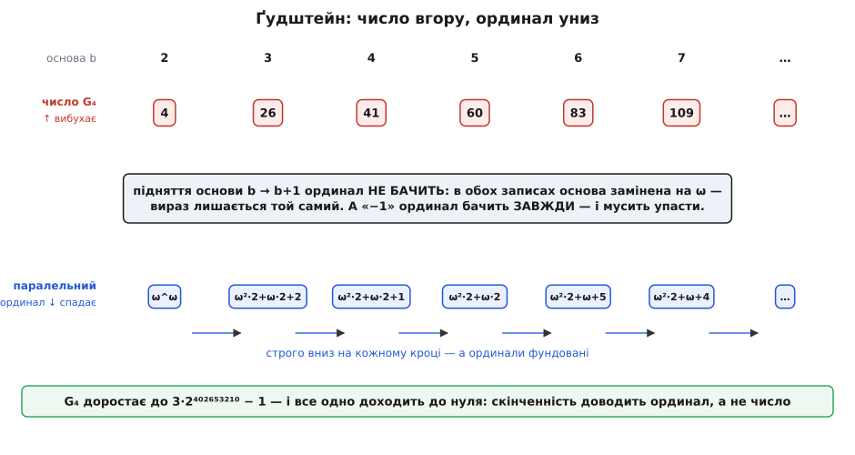

# 🧮 Фундованість: чому спадання взагалі щось доводить

## Дно, якого не досить

Твердження «величина строго спадає й обмежена знизу, отже, цикл спиниться» звучить самоочевидно. Воно хибне.

```py
from fractions import Fraction

x = Fraction(1)
while x > 0:
    x = x / 2        # строго спадає; обмежена знизу нулем; НІКОЛИ не спиняється
```

Кожен прохід строго зменшує `x`. Нуль — бездоганне дно: `x` його ніколи не пробиває. Обидві умови виконано дослівно, а цикл крутиться вічно, бо `1/2ⁿ` додатне при будь-якому `n`.

Найповчальніше — що буде, коли замінити точний дріб на `float`:

```py
x = 1.0
while x > 0:
    x = x / 2        # спиняється рівно за 1075 ділень
```

Оцей завершується. Але не з математичної причини: `float` має скінченне число бітів, і після 1075 ділень найменше денормалізоване значення `2⁻¹⁰⁷⁴` округлюється до нуля. Зупинку забезпечила обмеженість подання, а не властивість чисел. Полагодь тип на точний — і цикл зависне. Доведення, яке тримається на розрядності `double`, — не доведення.

Отже, у зв'язці «строго спадає + обмежена знизу» роботу робить **не** «обмежена знизу». Роботу робить щось, чого в цьому формулюванні взагалі не названо: воно є в ℕ і його немає в ℚ⁺. Знайти його — означає зрозуміти, чому метод варіанта працює.

Різниця ось у чому. У ℕ кожен крок униз коштує **щонайменше одиницю**: між сусідніми натуральними числами нічого немає, тож зі старту `v₀` більше ніж `v₀` кроків не зробиш. У ℚ⁺ кроки можна робити дедалі дрібнішими й спускатися вічно, не діставши дна. Дно там теж є — нуль, — але воно недосяжне.



*Однакове «строго вниз» дає різні наслідки. У ℤ ланцюг не має дна. У ℚ⁺ дно є — нуль — і воно нічого не рятує: `1 > 1/2 > 1/4 > …` спадає вічно. Працює не наявність дна, а фундованість: властивість порядку не мати нескінченного строго спадного ланцюга.*

> 🔧 **Навіщо це.** Це не схоластика, а безпосередня перевірка твоїх варіантів. Щоразу, коли варіант — дійсне число, дріб, «відстань», «похибка» чи «залишкова вага», доведення зупинки **не побудовано**, хоч би як строго та величина спадала: `while err > 0: err = err / 2` — законний нескінченний цикл. Саме тому реальні критерії виходу пишуть як `err < 1e-9` або `for _ in range(max_iter)` — це підміна недоведеного варіанта на цілочисловий, який фундований. Перше питання до варіанта — не «чи спадає», а «в якому порядку він живе».

## Дві грані означення

Властивість, що робить роботу, називають **фундованістю** (англ. *well-founded* — «добре обґрунтований», «з надійним дном»). Її означують двома способами, і різниця між ними важливіша, ніж здається.

Нехай `≺` — бінарне відношення на множині `A` (читай «строго менше»; для варіантів це «стан після проходу дає менше значення»).

```
(A) НЕМАЄ НЕСКІНЧЕННОГО СПУСКУ
    не існує послідовності a₀ ≻ a₁ ≻ a₂ ≻ a₃ ≻ …,
    де кожен наступний член строго менший за попередній

(B) КОЖНА НЕПОРОЖНЯ ПІДМНОЖИНА МАЄ МІНІМАЛЬНИЙ ЕЛЕМЕНТ
    для будь-якої S ⊆ A, S ≠ ∅, існує m ∈ S таке,
    що в S немає жодного s з s ≺ m
```

Форма (A) — та, якою користується програміст: нескінченний спуск — це і є нескінченний цикл. Форма (B) — та, якою користується математик: вона дає точку опори для доведень.

Рівносильність в один бік очевидна. Якщо (B) справджується, то візьми будь-який нескінченний спадний ланцюг і поглянь на множину його членів `S = {a₀, a₁, a₂, …}`. Вона непорожня, отже, має мінімальний елемент — якесь `aₙ`. Але в ланцюзі є `aₙ₊₁ ≺ aₙ`, і він теж у `S`. Суперечність: `aₙ` не мінімальний. Тож нескінченного ланцюга немає.

Другий бік — (A) ⟹ (B) — містить тонкість, яку зазвичай проминають. Доводять від протилежного: нехай `S` непорожня й **не** має мінімального елемента. Тоді для кожного `s ∈ S` знайдеться менший `s′ ∈ S`. Візьми будь-яке `s₀ ∈ S`, знайди менше `s₁`, тоді менше `s₂`… — і маєш нескінченний спуск, що суперечить (A).

Придивись до слова «візьми». Воно виконується **нескінченно багато разів**, і щоразу треба обрати один елемент із непорожньої множини кандидатів, коли жодного правила вибору не задано. Це не безневинний крок: він потребує окремої аксіоми — **залежного вибору** (англ. *axiom of dependent choice*, DC), ослабленої форми аксіоми вибору. У самій лише теорії множин ZF (A) і (B) не рівносильні: з (B) завжди випливає (A), а зворотне — ні.

Тому канонічним означенням фундованості беруть саме (B), через мінімальний елемент: воно сильніше, не потребує вибору й одразу дає механізм доведень. А (A) — його наслідок і повсякденне обличчя.

Ще дві межі, які варто провести чітко.

**Мінімальний — не найменший.** Мінімальний елемент — той, під яким нічого немає; найменший — той, що лежить під усіма. У ℕ це збігається, і звідси береться хибне узагальнення. Але фундоване відношення **не зобов'язане** бути повним порядком: у ньому цілком законно мати пари непорівнянних елементів і кілька різних мінімальних. Покомпонентний порядок на парах — `(a,b) ≺ (c,d)` тоді й лише тоді, коли `a ≤ c`, `b ≤ d` і пари різні — фундований, хоча `(0,5)` і `(5,0)` між собою непорівнянні взагалі.

**Цілком упорядкована множина** (англ. *well-ordered*) — це фундованість **плюс** повнота порядку: будь-які два елементи порівнянні. Тоді мінімальний елемент кожної підмножини єдиний і є найменшим. ℕ цілком упорядкована; покомпонентний порядок на парах — ні, хоч і фундований. Для варіантів це практична свобода: цілі одного класу порівнювати не обов'язково.

## Фундованість — це індукція, прочитана згори вниз

Тепер найцікавіше. Фундованість не просто «схожа» на [математичну індукцію](topic:math/mathematical-induction) — вона є нею. Індукція доводить твердження для всіх натуральних, спираючись на те, що кожне наступне спирається на попередні; головне звідти — принцип найменшого числа: кожна непорожня множина натуральних має найменший елемент. Це та сама (B).

Ось повний принцип **фундованої індукції** — її ще звуть ноетеровою, на честь німецької математикині Еммі Нетер, чиї міркування про обриви ланцюгів у алгебрі дали цій схемі ім'я. Нехай `≺` фундоване на `A`. Тоді:

```
якщо  ∀a ∈ A:  ( ∀b ≺ a: P(b) )  ⟹  P(a)
то    ∀a ∈ A:  P(a)
```

Словами: якщо властивість `P` успадковується від **усього, що менше**, до самого елемента — то вона справджується скрізь. Жодної окремої бази індукції тут немає, і це не недогляд. База захована всередині: для мінімального елемента умова «`∀b ≺ a: P(b)`» порожня — менших немає, — тож вона істинна задарма, і `P` мусить справдитися на ньому просто так.

Доведення вміщається в чотири рядки, і воно того варте:

```
Припустімо, що ∃a: ¬P(a).
Тоді множина контрприкладів S = { a ∈ A : ¬P(a) } непорожня.
За (B) вона має мінімальний елемент m.
Кожне b ≺ m не лежить у S (бо m мінімальний), отже, P(b) істинне для всіх b ≺ m.
Але тоді за умовою схеми P(m) істинне — тож m ∉ S.
Суперечність. Отже, контрприкладів немає.
```

Цей хід має старе народне ім'я — «найменший злочинець»: якщо контрприклади є, візьми найменший і покажи, що він не найменший.

Тепер поглянь, що ми щойно зробили. Ми взяли фундованість — властивість про **спуск** — і дістали з неї принцип доведення для **всіх** елементів. Індукція й завершуваність — це одна теорема, читана у два боки. Індукція йде вгору: істина ллється від менших до більших, і саме тому дістає кожного. Варіант іде вниз: величина сходить від більших до менших, і саме тому не сходить вічно. Обидва спираються на єдиний факт — нескінченного спуску не існує. Довести, що цикл спиниться, і довести щось індукцією — це буквально одне й те саме міркування, повернуте іншим боком.

Той самий принцип, ужитий протилежно, — знаменитий **нескінченний спуск** П'єра де Ферма: якщо з контрприкладу в натуральних завжди можна дістати менший, контрприкладів немає взагалі. Назву («*descente infinie ou indéfinie*») Ферма подав у листі до П'єра де Каркаві від 14 серпня 1659 року; сам метод давніший — спуском користувалися ще в «Началах» Евкліда, тож Ферма радше перевідкрив і назвав його, ніж винайшов. Статус: усталено.

## Варіант — це відображення у фундовану множину

Тепер апарат можна зібрати. Формалізуймо цикл як **відношення переходу**: `s → s′` означає «зі стану `s`, при істинній умові циклу, один прохід тіла дає стан `s′`». Тоді речення «цикл зациклився на вході `s₀`» дослівно означає: існує нескінченний ланцюг `s₀ → s₁ → s₂ → …`.

А тепер прочитай це через означення (A). Прочитаймо перехід як «менше»: хай `s′ ≺ s` означає `s → s′` — стан після проходу вважаємо меншим за стан до нього. Тоді «цикл завершується з кожного досяжного стану» ⟺ «немає нескінченного ланцюга переходів» ⟺ **«відношення переходу фундоване»**. Не «схоже на», не «випливає з» — тотожно, за означенням. Завершуваність **є** фундованість, просто названа мовою програм.

Але фундованість відношення переходу треба ще якось довести, а воно нове й невідоме. Ось тут і з'являється варіант — як спосіб **позичити** фундованість у множини, де її вже доведено.

```
ВАРІАНТ. Нехай (A, ≺) — фундована множина.
Відображення V: Стани → A називають варіантом циклу, якщо
    для кожного переходу s → s′  виконано  V(s′) ≺ V(s).

ТЕОРЕМА (надійність). Якщо варіант існує, цикл завершується.

ДОВЕДЕННЯ. Нехай є нескінченне виконання s₀ → s₁ → s₂ → …
Застосуй V почленно:  V(s₀) ≻ V(s₁) ≻ V(s₂) ≻ …
Це нескінченний строго спадний ланцюг у A — суперечить фундованості A.
Отже, нескінченного виконання немає. ∎
```

Один рядок. І в цьому рядку — уся сила методу: він переносить фундованість із `A` на відношення переходу через відображення `V`. Загальна лема, окремим випадком якої є **кожен** варіант, що ти коли-небудь напишеш: **прообраз фундованого відношення при довільному відображенні фундований**. Варіант нічого не доводить сам — він лише під'єднує твій цикл до фундованої множини, яку хтось довів раніше. Ось чому весь вибір зводиться до двох речей: **яка фундована множина** й **яке відображення в неї**.

Із цього кута стають прозорими обидва способи схибити. Перший: `A` не фундована — і тоді `V` може спадати скільки завгодно строго, а доведення порожнє (саме це сталося з `Fraction` вище: `A = ℚ⁺`). Другий: `A` фундована, але `V` спадає не на кожному переході — досить однієї гілки тіла, де величина встояла, і ланцюг `V(s₀) ≻ V(s₁) ≻ …` розривається. Звідси й вимога **строгості** на **кожному** проході: не бонус до акуратності, а те, без чого рядок доведення просто не складається.

## Словниковий порядок: чому пара працює — і де прийом ламається

Найпоширеніша фундована множина після ℕ — пари натуральних зі словниковим порядком:

```
(a, b) ≺ (c, d)   ⟺   a < c,   або   a = c і b < d
```

Що вона фундована — не самоочевидно: друга координата може стрибати вгору як завгодно високо, і то нескінченно багато разів. Ось доведення, і воно вчить прийому.

```
Припустімо нескінченний спуск (x₀,y₀) ≻ (x₁,y₁) ≻ (x₂,y₂) ≻ …

КРОК 1. Подивись лише на перші координати.
За означенням словникового порядку кожен крок або зменшує x, або лишає його тим самим.
Отже, x₀ ≥ x₁ ≥ x₂ ≥ … — послідовність не зростає.

КРОК 2. Множина { x₀, x₁, x₂, … } — непорожня підмножина ℕ.
За (B) вона має найменший елемент; хай його вперше досягнуто на кроці N.
Оскільки послідовність не зростає, xₙ = x_N для ВСІХ n ≥ N.
Тобто від кроку N перша координата завмирає назавжди.

КРОК 3. Від кроку N кожен перехід має xₙ = xₙ₊₁,
а словниковий порядок при рівних перших координатах вимагає yₙ > yₙ₊₁.
Отже, y_N > y_{N+1} > y_{N+2} > … — нескінченний спуск у ℕ.
Суперечність. ∎
```

Механізм видно як на долоні: перша координата може падати лише скінченне число разів (бо ℕ фундована), тож рано чи пізно вона **мусить** застигнути — і з цієї миті вся робота лягає на другу, якій тікати вже нема куди. Стрибки `y` вгору не безкоштовні: кожен оплачено падінням `x`, а `x` має скінченний запас падінь. Індукцією за довжиною кортежу те саме переноситься на трійки, четвірки й будь-яку **фіксовану** арність.

І ось тут — місце, де прийом ламається, і зламується він тихо.

**Словниковий порядок на послідовностях змінної довжини не фундований.** Візьми слова над `{a, b}` і впорядкуй їх словниково, як у справжньому словнику:

```
b  ≻  ab  ≻  aab  ≻  aaab  ≻  aaaab  ≻  …
```

Кожне наступне слово строго менше за попереднє — воно ж починається з `a`, а попереднє з `b` або з коротшого пасма `a`. Ланцюг нескінченний. Той самий словниковий порядок, та сама фундована абетка — а фундованості немає, бо арність перестала бути фіксованою: додавання нової координати на початку **не оплачене** нічим.

> 🔧 **Навіщо це.** Різниця «фіксована арність / змінна довжина» — це різниця між доведенням і його примарою. Пара `(x, y)` чи трійка `(x, y, z)` — законний варіант. А «список задач, який може подовшати», порівнюваний словниково, — законна пастка: щоразу, коли твій варіант — це стек, черга чи будь-яка структура, здатна **вирости** новим рівнем, словникове порівняння твоєї гарантії не дає. Для таких випадків беруть інші фундовані порядки: **мультимножинний** — Нахум Дершовіц і Зогар Манна, 1979 («Proving termination with multiset orderings», *CACM* 22(8):465–476), де елемент можна замінити на будь-яке скінченне число строго менших, — або порядок за довжиною з дотягуванням словниковим (shortlex).

## Ординали: нормальна форма всіх варіантів

Тепер несподіванка, що зшиває всю картину. Пара зі словниковим порядком — **уже** трансфінітний варіант, просто в маскуванні.

Придивись до її будови. Пари з ℕ×ℕ, розкладені за словниковим порядком, лягають у нескінченну низку блоків: спершу всі `(0, y)` — а це копія ℕ, — потім усі `(1, y)` — ще одна копія ℕ, кожен член якої більший за **все** з першого блоку, — потім `(2, y)` і так далі. «ω копій ω, поставлених одна за одною» — це рівно ординал `ω·ω = ω²`, і ізоморфізм виписується явно:

```
(x, y)  ↦  ω·x + y

бо   ω·x + y  <  ω·x′ + y′   ⟺   x < x′,  або  x = x′ і y < y′
```

Тобто той-таки словниковий варіант — це ординальний варіант зі значеннями в `ω²`. Читач, який хоч раз доводив зупинку вкладеного циклу парою, уже користувався ординалами, не знаючи назви.

Це не збіг, а закон. **Ординали** — це канонічні «форми» цілком упорядкованих множин, уведені Ґеорґом Кантором 1883 року (німецький математик; народився 1845 в Санкт-Петербурзі в датсько-німецькій родині, від одинадцяти років жив і працював у Німеччині). Головна теорема: **кожна цілком упорядкована множина ізоморфна рівно одному ординалу**. Отже, ординали — не екзотична добавка до методу, а його **нормальна форма**: будь-який варіант із повним порядком можна без утрат переписати як ординальний, і повний список усіх можливих таких варіантів — це список ординалів. Питання «який варіант тут потрібен?» перетворюється на точне «до якого ординала треба піднятися?».

Арифметика цих величин має пастку, на якій легко посковзнутися: вона **не комутативна**.

```
1 + ω = ω        але   ω + 1 > ω      (одиниця спереду губиться в нескінченному хвості;
                                        ззаду вона додає новий елемент після всіх)
2·ω = ω          але   ω·2 = ω + ω    (ω копій двійки — це знову просто ω;
                                        дві копії ω — це вдвічі довша низка)
```

Саме тому нормальну форму Кантора пишуть із коефіцієнтами **справа**: `ω^β·k`, а не `k·ω^β`. Запис `ω²·2 + ω·2 + 2` означає «дві копії ω², потім дві копії ω, потім двійка», і читати його слід зліва направо, як довжину.

Драбина ординалів піднімається так: скінченні `0, 1, 2, …`, тоді `ω` — перше, що більше за всі скінченні, тоді `ω+1, ω+2, …, ω·2, …, ω²`, далі `ω³`, `ω^ω`, і врешті

```
ε₀ = sup { ω, ω^ω, ω^(ω^ω), ω^(ω^(ω^ω)), … } = найменший ординал α, для якого ω^α = α
```

`ε₀` — перший ординал, до якого не дотягнешся вежею з `ω` скінченної висоти; він же — перший, що не виражається в нормальній формі Кантора через менші.

Лишається чесне питання: а **навіщо** взагалі виходити за ℕ? Ось найчистіша відповідь — цикл, для якого натурального варіанта не існує в принципі:

```
x := довільне натуральне число        ← вибір без жодної межі
while x > 0:
    x := x − 1
```

Він завершується **завжди**: хай яке `x` обрано, до нуля лишається рівно `x` кроків. Але жодне натуральне число не обмежує його зверху — для будь-якого `n` є виконання довше за `n` кроків. Скільки ж кроків лишається у стані **перед** вибором? Не `0`, не `1`, не `10⁹⁹`, а «більше за всі скінченні» — тобто `ω`. Ординал `ω` тут не примха, а найменша величина, здатна виміряти цей стан. Саме через це нідерландець Едсгер Дейкстра 1976 року виніс необмежений недетермінізм за межі своїх охоронюваних команд — бо його обмежувальна функція жила в ℕ, а тут ℕ замало.



*Кожен щабель — фундована множина, у яку можна відображати стани. Звичайний лічильник живе в ℕ; пара за словниковим порядком — це вже `ω²` (там-таки живе доведення для функції Аккермана); мультимножини сягають `ω^ω`; послідовність Ґудштейна вимагає всього `ε₀`. Червона риска — межа арифметики Пеано: фундованість кожного окремого `α < ε₀` вона доводить, а `ε₀` — ні.*

## Ґудштейн: число вгору, ординал униз

Найкращий доказ того, що трансфінітне не декорація, — послідовність, яку без ординалів приборкати неможливо. Її побудував британський математик Ройбен Ґудштейн 1944 року («On the restricted ordinal theorem», *Journal of Symbolic Logic* 9(2):33–41).

Правило будується на **спадковому записі за основою `b`**: число розкладають за степенями `b`, тоді так само розкладають показники, тоді показники показників — аж поки в записі не лишиться нічого, крім `b`, цифр менших за `b`, і дужок. Наприклад, `4 = 2^(2^1)` за основою 2.

Крок послідовності: **підняти основу на одиницю** (усі `b` в записі стають `b+1`) і **відняти одиницю**. Повторювати.

```py
def to_hered(n, b):
    """Спадковий запис n за основою b: список пар (показник у такому ж записі, цифра)."""
    out, e = [], 0
    while n > 0:
        n, d = divmod(n, b)
        if d:
            out.append((to_hered(e, b), d))
        e += 1
    return out

def from_hered(h, b):
    return sum(b ** from_hered(e, b) * d for (e, d) in h)

def goodstein_step(n, b):
    return from_hered(to_hered(n, b), b + 1) - 1

n, b = 4, 2
for _ in range(6):
    print(b, n)
    n, b = goodstein_step(n, b), b + 1
# 2 4 · 3 26 · 4 41 · 5 60 · 6 83 · 7 109 · далі 139, 173, 211, 253, 299 …
```

Стартуємо з `4` — і воно росте: `4, 26, 41, 60, 83, 109, 139, 173, 211, 253, 299…`. Число не просто зростає, а розганяється до `3·2⁴⁰²⁶⁵³²¹⁰ − 1`. Жодного натурального варіанта тут не видно й близько: величина, яку ми відстежуємо, **збільшується**.

І все ж послідовність доходить до нуля. Щоб побачити чому, збудуй **паралельний ординал**: візьми спадковий запис і заміни в ньому основу `b` на `ω`.

```
основа  2 :   4  = 2^(2^1)              →   ω^ω
основа  3 :  26  = 2·3² + 2·3 + 2       →   ω²·2 + ω·2 + 2
основа  4 :  41  = 2·4² + 2·4 + 1       →   ω²·2 + ω·2 + 1
основа  5 :  60  = 2·5² + 2·5           →   ω²·2 + ω·2
основа  6 :  83  = 2·6² + 6 + 5         →   ω²·2 + ω + 5
основа  7 : 109  = 2·7² + 7 + 4         →   ω²·2 + ω + 4
```

Число злітає — ординал спадає, крок за кроком, без жодного винятку. Чому так, видно з побудови, і це вся суть в одному реченні: **підняття основи ординал не бачить**. Адже основу — і до підняття, і після — замінюють на те саме `ω`; вираз виходить буквально той самий. Отже, з двох дій кроку перша для ординала невидима, а друга — «відняти одиницю» — видима завжди й завжди строго його зменшує. Ординали фундовані, нескінченного спуску немає, тож послідовність мусить дійти до дна.



*Дві доріжки того самого процесу. Верхня — число, і воно росте без упину. Нижня — ординал, і він падає щокроку. Скінченність доводить нижня доріжка: підняття основи ординал не помічає (`b` в обох записах замінено на `ω`), а віднімання одиниці помічає завжди.*

Тепер порахуй, наскільки високо треба піднятися. Спадковий запис числа за основою 2 — це вежа з двійок скінченної висоти; замінивши двійки на `ω`, дістанеш вежу з `ω` скінченної висоти, тобто ординал, менший за `ε₀`. Для **кожного** старту `m` варіант живе строго нижче `ε₀`. Але висота вежі зростає разом з `m` і не має спільної межі — тож, щоб покрити **всі** старти одразу, потрібне рівно `ε₀`, не менше.

І тут метод варіанта впирається в стіну — не свою, а стіну формальної системи. Лорі Кірбі та Джефф Періс (британські логіки) 1982 року довели: **теорему Ґудштейна не можна довести в арифметиці Пеано** («Accessible independence results for Peano arithmetic», *Bull. LMS* 14:285–293; там-таки — і гідра Кірбі-Періса, той самий сюжет у вигляді гри). Механізм точний: Ґергард Ґентцен (німецький математик) 1936 року довів несуперечність арифметики Пеано, додавши до фінітних засобів трансфінітну індукцію до `ε₀`, а 1943-го показав другий бік — індукцію до кожного окремого `α < ε₀` арифметика Пеано проводить сама, а до `ε₀` — ні. Якби могла, вона довела б власну несуперечність — а це заборонено другою теоремою Ґеделя. Отже, `ε₀` — точна міра сили цієї системи, її **теоретико-доказовий ординал**.

Зверни увагу на межу цієї стіни, бо вона гостра. Для **кожного окремого** `m` твердження «послідовність зі старту `m` доходить до нуля» — істинне твердження виду `∃k …`, а арифметика Пеано такі твердження доводить усі до одного (це її `Σ₁`-повнота: істинну скінченну обчислювальну історію завжди можна виписати). Недоводжуване тут — лише **загальне** `∀m`. Стіна стоїть не перед фактами, а перед квантором.

## Надійний, та неповний — точно де саме

Тепер можна сказати точно, чого метод вартий і де саме він програє. Відповідь тонша за звичне «варіант не завжди можна знайти».

**Надійність — беззастережна.** Теорему вже доведено вище, і в її доведенні немає ані гіпотез, ані винятків: є відображення у фундовану множину, що строго спадає на кожному переході, — цикл завершується. Крапка.

**Семантична повнота — теж є, і саме вона найповчальніша.** Візьми детермінований цикл, який завершується з кожного стану. Оголоси варіантом `V(s) = число проходів, що лишилися від стану s до виходу`. Це натуральне число, і на кожному проході воно падає рівно на одиницю. Варіант **завжди існує**.

Здавалося б, метод повний і питання закрите. Але подивись на цей варіант уважно: `V(s)` **визначене лише тоді, коли цикл із `s` завершується** — інакше «проходів, що лишилися» не існує як числа. Теорема повноти видає варіант лише тому, хто вже знає відповідь. Вона істинна — і як метод порожня.

**Виразність теж не є перепоною**, і це варто сказати чітко, бо тут ховається поширена помилка. За теоремою Кліні про нормальну форму існує примітивно рекурсивний предикат `T(e, x, y)` — «`y` кодує повну історію обчислення програми `e` на вході `x`», — тож «число кроків, що лишилися» записується звичайною арифметичною формулою. Варіант не лише існує абстрактно — його можна **виписати**.

Отже, що ж ламається? Рівно дві речі, і обидві — не про існування варіанта.

**Перша: його не знайти механічно.** [Проблема зупинки](topic:algorithms/halting-problem) — доведена Аланом Тюрінгом 1936 року нерозв'язність питання, чи спиниться дана програма на даному вході; будь-який алгоритм, що обіцяв би відповідати на нього для всіх програм, суперечив би сам собі. Якби існував загальний спосіб **знаходити** варіанти, ним би розв'язали й зупинку. Ба більше: навіть **перевірка** готового кандидата — чи справді `V` спадає на всіх досяжних станах — у загальному випадку нерозв'язна, бо «досяжні стани» самі невідомі наперед.

**Друга: його не завжди можна довести — у наперед заданій системі.** Це вже Ґедель, і найясніше видно через діагональ. Зафіксуй будь-яку надійну систему `T` зі скінченно описаним переліком аксіом (арифметика Пеано, ZFC — байдуже).

```
Програми, для яких T ДОВОДИТЬ завершення на всіх входах,
можна перелічити: перебирай усі тексти доведень у T підряд.
Дістанемо список  f₀, f₁, f₂, …
Кожна fᵢ справді всюди визначена — бо T надійна.

Означ  g(n) = fₙ(n) + 1.
g обчислювана (список перелічний) і всюди визначена (кожна fₙ завершується).

Якби T довела, що g завершується на всіх входах,
то g стояла б у списку під якимось номером k, тобто g = f_k.
Тоді  g(k) = f_k(k) + 1 = g(k) + 1.
Суперечність.

Отже, g — цикл, що завершується ЗАВЖДИ,
але T цього не доводить.
```

Ось точна форма неповноти. Варіант для `g` існує (кроки, що лишилися) і навіть виписується формулою — але `T` не може довести, що він **є** варіантом. Не «варіанта немає», а «його не доведеш **тут**». Візьми сильнішу систему `T′` — вона впорається з `g`, і тут-таки програє на власній діагоналі. Стіна не зникає, лише відсувається.

І остання деталь, яка не дає скласти хибну картину. Чому ж тоді неповнота не заважає щодня доводити зупинку сотень циклів? Бо квантори різні. «Ця програма спиниться на **цьому** вході» — твердження виду `Σ₁`; якщо воно істинне, арифметика Пеано його доводить **завжди** (досить формалізувати саму історію обчислення). Неповнота прокидається лише на **всюди визначеності**: «спиняється на **кожному** вході» — це `∀x ∃y …`, тобто `Π₂`, і саме тут діагональ кусає. Тобто метод варіанта неповний рівно щодо тих тверджень, заради яких його й вигадали, — універсальних. Послідовність Ґудштейна — не курйоз, а точний портрет цього зазору: кожен окремий випадок арифметика Пеано доводить, усі разом — ні.

Звідси й правильне місце Коллатца в цій картині. Те, що для нього не знайдено варіанта, — не вирок методові й не доказ його безсилля. Якщо ця послідовність справді завжди доходить до одиниці, то варіант для неї **існує** й **виразний**; ніхто просто не зумів пред'явити такий, що його вдалося б довести. Ми не знаємо, це наша нестача кмітливості чи справжня межа.

## Куди це складається

Уся конструкція тримається на одному факті — «нескінченного спуску не буває» — і кожен її поверх лише перевдягає його в новий одяг. Фундованість — це той факт, названий властивістю порядку. Індукція — той самий факт, прочитаний угору. Варіант — той самий факт, позичений твоєму циклові через відображення. Ординали — повний список усіх множин, у яких він справджується.

Тому кожен варіант, від найпростішого до найдикішого, — це відповідь на дві однакові анкетні позиції:

```
яка фундована множина?     ℕ            — лічильник: b в Евкліда, hi − lo у двійковому пошуку
                           ω            — необмежений недетермінізм
                           ω²           — пара (x, y) за словниковим порядком; функція Аккермана
                           ω^ω          — мультимножини, кортежі змінної довжини
                           ε₀           — Ґудштейн, гідра (арифметиці Пеано вже не до снаги)

яке відображення в неї?    V: Стани → A,  строго спадне на КОЖНОМУ переході
```

Заповнив обидві — зупинку доведено, і жодна сила цього не скасує. Не заповнив — питання лишається відкритим: або ще не додумався, або стоїш перед стіною, яку не обійти зсередини цієї системи. Метод варіанта чесно не обіцяє відрізнити одне від одного — і саме ця чесність робить його доведенням, а не обіцянкою.
