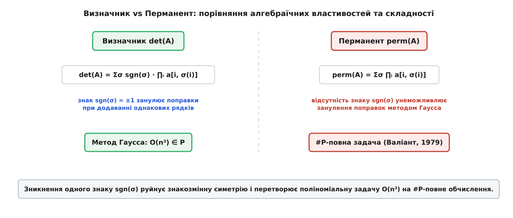
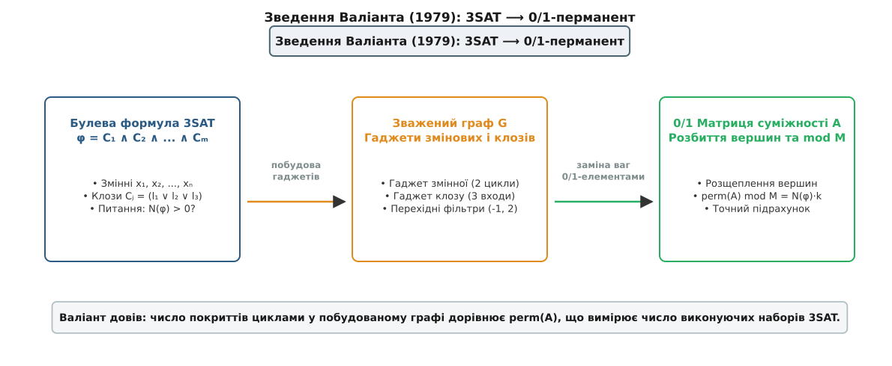
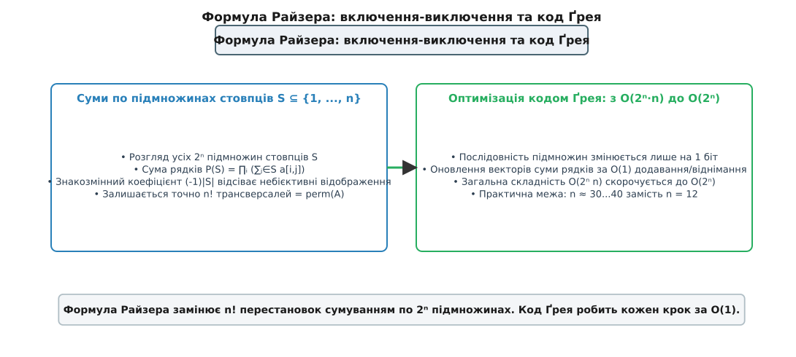
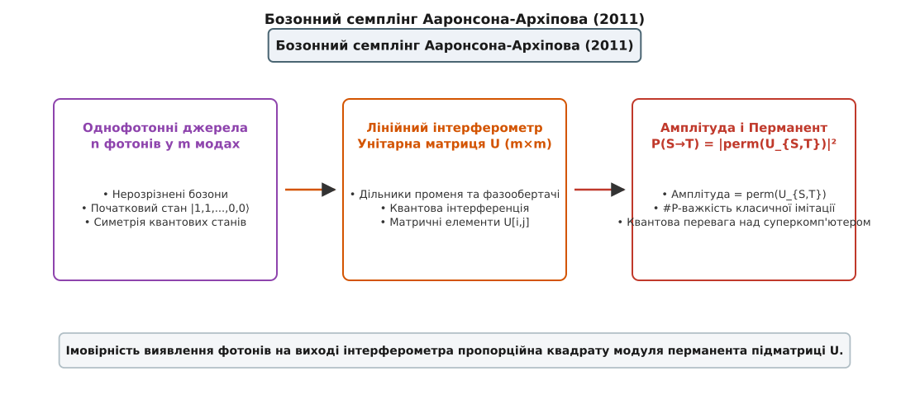

# Перманент матриці та складність обчислення

<preknowlist>
- [Визначник матриці](topic:math/matrix-determinant) — знакозмінна сума за перестановками; рахується швидко методом Гаусса за O(n³).
- [Класи складності P та NP](topic:algorithms/p-vs-np) — поліноміальна розв'язність та недетермінована перевірка.
- [Складність підрахунку #P](topic:algorithms/sharp-p-counting) — підрахунок кількості розв'язків та повнота класу за Валіантом.
</preknowlist>

Коли [алгоритм Едмондса](topic:algorithms/edmonds-algorithm) шукає [досконале паросполучення](topic:algorithms/perfect-matching) у [двочастковому графі](topic:algorithms/bipartite-graph) з `n` вершинами в кожній частці, він знаходить відповідь за поліноміальний час `O(n²·⁵)` через зведення до максимізації потоку. Проте спроба порахувати точну кількість усіх таких досконалих паросполучень зіштовхується з обчислювальною катастрофою. [Матриця суміжності](topic:algorithms/adjacency-matrix) графа `A` розміру `n × n`, складена з нулів та одиниць, містить усю інформацію про ребра: якщо підставити її у формулу визначника, чергування знаків `sgn(σ) = ±1` призводить до взаємного скасування доданків, і детермінант вимірює алгебраїчний орієнтований об'єм, а не кількість паросполучень. Якщо ж вилучити з формули множник-знак `sgn(σ)`, утворюється перманент `perm(A)` — точний комбінаторний лічильник досконалих паросполучень. Тим самим прибранням одного знаку формула втрачає симетрію елементарних перетворень Гаусса, і задача обчислення `perm(A)` перестрибує з легкого класичного класу **P** у [найважчий клас підрахунку #P](topic:algorithms/sharp-p-counting).


*Визначник vs Перманент: порівняння алгебраїчних властивостей та складності*

## 1. Чому один зниклий знак руйнує обчислюваність

Математичне означення перманента квадратної матриці `A` розміру `n × n` зовнішньо майже ідентичне до означення [визначника матриці](topic:math/matrix-determinant). Обидві функції виражаються як суми по всіх `n!` перестановках `σ` симетричної групи `Sₙ`:

```
det(A)  = ∑_{σ ∈ Sₙ} sgn(σ) · a[1, σ(1)] · a[2, σ(2)] · ... · a[n, σ(n)]
perm(A) = ∑_{σ ∈ Sₙ}          a[1, σ(1)] · a[2, σ(2)] · ... · a[n, σ(n)]
```

Кожна перестановка `σ` визначає **трансверсаль** — вибір `n` елементів матриці таким чином, щоб із кожного рядка та кожного стовпця було взято рівно один елемент. Для визначника кожен доданок множиться на знак перестановки `sgn(σ) ∈ {-1, +1}`, який дорівнює `+1` для парних перестановок (що розкладаються у парне число транспозицій) та `-1` для непарних. Для перманента всі `n!` доданків беруться виключно зі знаком плюс.

Геометрично визначник вимірює орієнтований `n`-вимірний об'єм паралелепіпеда, побудованого на вектор-рядках матриці. Знак `sgn(σ)` забезпечує узгодженість орієнтації простору: при обміні двох векторів місцями орієнтація дзеркально перевертається, що змінює знак визначника на протилежний. Перманент же є скалярною симетричною сумою, яка позбавлена геометричного змісту орієнтованого об'єму і виступає чисто комбінаторним агрегатором добутків елементів.

### Полілінійні симетричні форми та тензорне представлення

З точки зору вищої алгебри визначник і перманент є крайніми випадками більш загального сімейства функцій — **імманантів** (англ. *immanants*), уведених Дадлі Літтлвудом та Арчибальдом Річардсоном 1934 року. Для кожного непривідного характеру `χλ` симетричної групи `Sₙ`, розбиття `λ ⊢ n` визначає імманант:

```
dλ(A) = ∑_{σ ∈ Sₙ} χλ(σ) · ∏_{i=1}ⁿ a[i, σ(i)]
```

Знак `sgn(σ)` відповідає знаковому характеру `λ = (1, 1, ..., 1)` (знакова представленість), що дає визначник. Повністю тривіальний характер `λ = (n)` дає перманент. У той час як імманант знакового характеру обчислюється за поліноміальний час `O(n³)` завдяки знакозмінності, іммананти більшості інших характерів, включно з тривіальним, є #P-важкими.

Прірва між обчислювальною складністю двох функцій виникає у той момент, коли ми намагаємося застосувати елементарні операції над рядками для триангуляції матриці. В елімінації Гаусса (метод Гаусса) до рядка `i` додається рядок `j`, помножений на скаляр `c`: `Rᵢ ⟵ Rᵢ + c · Rⱼ`.

Для визначника ця операція не змінює його значення. Причиною є знакозмінність полілінійних форм: якщо матриця має два однакових рядки (`Rᵢ = Rⱼ`), то при їхній перестановці знак визначника змінюється на протилежний. Звідси випливає рівність `det(A) = -det(A)`, що у будь-якій чисельній системі дає `det(A) = 0`. Отже, поправка від додавання рядка тотожно дорівнює нулю:

```
det(A з доданим рядком Rᵢ + c·Rⱼ)
= det(A) + c · det(A з двома однаковими рядками Rᵢ, Rⱼ)  [полілінійність визначника]
= det(A) + c · 0                                        [знакозмінність: однакові рядки дають 0]
= det(A)                                                [збереження визначника]
```

Завдяки цьому метод Гаусса зводить довільну матрицю до верхньо трикутного вигляду за `O(n³)` арифметичних операцій, де визначник обчислюється як звичайний добуток елементів головної діагоналі: `det(U) = u₁₁ · u₂₂ · ... · uₙₙ`.

Для перманента ця фундаментальна властивість повністю ламається. Якщо матриця має два однакових рядки, доданки перестановок не скасовуються, а подвоюються:

```
perm([1 1; 1 1]) = 1·1 + 1·1 = 2 ≠ 0
```

Розглянемо докладніше приклад додавання рядків у матриці `3 × 3`:

```
A = [a₁₁ a₁₂ a₁₃;
     a₂₁ a₂₂ a₂₃;
     a₃₁ a₃₂ a₃₃]
```

При здійсненні елементарного кроку Гаусса `R₂ ⟵ R₂ + c · R₁` перманент розпадається на суму двох перманентів:

```
perm(A') = perm(A) + c · perm([a₁₁ a₁₂ a₁₃;
                               a₁₁ a₁₂ a₁₃;
                               a₃₁ a₃₂ a₃₃])
```

Другий доданок є перманентом матриці з двома збіжними рядками `R₁` та `R₂`. Для визначника ця друга матриця давала б нуль. Але для перманента вона дорівнює:

```
2 · (a₁₁·a₁₂·a₃₃ + a₁₁·a₁₃·a₃₂ + a₁₂·a₁₃·a₃₁) ≠ 0
```

Поправка від елементарного кроку не занулюється. Кожне додавання рядків змінює значення перманента на величину додаткового перманента, обчислити який без знання відповіді неможливо. Спроба обнулити елемент під діагоналлю породжує рекурсивну залежність від перманентів допоміжних матриць, кількість яких зростає експоненційно. Зведення матриці до трикутного вигляду стає нездійсненним: алгоритм розсипається, і задача обчислення перманента залишається без алгебраїчного інструменту скорочення `n!` доданків.

Розклад Лапласа за рядком також демонструє цю відмінність:
```
det(A)  = ∑_{j=1}ⁿ (-1)ⁱ⁺ʲ · a[i, j] · det(A_{i, j})
perm(A) = ∑_{j=1}ⁿ          a[i, j] · perm(A_{i, j})
```
Для визначника розклад Лапласа у поєднанні з елементарними кроками Гаусса дозволяє занулити всі елементи рядка, крім одного, зводячи обчислення до єдиного мінора. Для перманента жоден елемент рядка занулити без псування матриці не вдається, тож рекурсія розгортається у повне дерево з `n!` листя.

Детальний перебіг математичної історії від Коші й Райзера до квантових експериментів систематизовано у вставці [Історія теореми Валіанта та бозонного семплінгу](topic:algorithms/matrix-permanent/hist-valiant-permanent.md).

## 2. Перманент як комбінаторний лічильник та парадокс поля 𝔽₂

Комбінаторний зміст перманента найвиразніше проявляється на 0/1-матрицях. Нехай `G = (U, V, E)` — двочастковий граф, у якому ліва та права частки мають однакову кількість вершин `|U| = |V| = n`. Матриця суміжності `A` розміру `n × n` задається як:

```
a[i, j] = 1, якщо (uᵢ, vⱼ) ∈ E
a[i, j] = 0, якщо (uᵢ, vⱼ) ∉ E
```

Досконале паросполучення — це множина з `n` ребер, яка покриває кожну вершину графів `U` та `V` рівно один раз. Подібне покриття еквівалентне бієкції (перестановці) `σ ∈ Sₙ`, для якої всі ребра `(uᵢ, v_{σ(i)})` існують у графі `G`.

Розглянемо доданок у формулі перманента для даної перестановки `σ`:

```
∏_{i=1}ⁿ a[i, σ(i)] = 1  [якщо всі ребра (uᵢ, v_{σ(i)}) існують у графі]
∏_{i=1}ⁿ a[i, σ(i)] = 0  [якщо хоча б одне ребро з перестановки відсутнє]
```

Отже, доданок дорівнює `1` для кожного досконалого паросполучення і `0` для всіх інших перестановок. Сума `perm(A)` дорівнює точній кількості досконалих паросполучень у графах `G`:

```
perm(A) = кількість досконалих паросполучень M ⊆ E у G
```

У той час як алгоритм Едмондса або алгоритм Гопкрофта-Карпа шукає **одне** досконале паросполучення за поліноміальний час `O(E √V)`, перманент рахує **усі** такі паросполучення.

Якщо ж матрицю суміжності розпушити на орієнтований граф `G_dir = (V, E)` із вагами ребер, то `perm(A)` вимірює сумарну вагу всіх покриттів графа орієнтованими циклами (англ. *cycle covers*). Покриття циклами — це підмножина ребер, така що в кожну вершину входить і з кожної вершини виходить рівно одне орієнтоване ребро.

### Символьна матриця Едмондса та розпізнавання паросполучень

Щоб зрозуміти, як визначник допомагає шукати існування паросполучення (хоча й не рахує їх), розглянемо **символьну матрицю Едмондса** `E(x)` розміру `n × n`, де замість одиниць підставляються незалежні формальні змінні `x[i, j]` для кожного ребра `(uᵢ, vⱼ) ∈ E`.

Визначник символьної матриці Едмондса є багаточленом від змінних `x[i, j]`:
```
det(E(x)) = ∑_{σ ∈ Sₙ} sgn(σ) · ∏_{i=1}ⁿ x[i, σ(i)]
```
Оскільки кожен доданок відповідає окремому досконалому паросполученню і має свій унікальний монохромний вираз `∏ x[i, σ(i)]`, різні паросполучення дають різні мономи, які **не можуть скасувати один одного** в символьному многочлені.

Тому символьний визначник `det(E(x))` не дорівнює нулю як многочлен тоді й лише тоді, коли у графі існує принаймні одне досконале паросполучення. За лемою Шварца-Зіппеля (Schwartz-Zippel Lemma), підставивши замість змінних `x[i, j]` випадкові цілі числа зі скінченного поля, ми можемо за поліноміальний час змовірністю, близькою до 1, перевірити, чи є паросполучення. Але при підстановці конкретних чисел додані доданки складаються або віднімаються, що втрачає точний підрахунок кількості й дає лише вердикт існування.

### Пфаффіани та планарні графи: теорема Кастелейна (1961)

Варто порівняти перманент у двочасткових графах із підрахунком паросполучень у недвочасткових або планарних графах. Для довільних недвочасткових графів задача підрахунку паросполучень також є #P-повною. Однак 1961 року Пітер Кастелейн (Pieter Kasteleyn), а також Гарольд Темперлі та Майкл Фішер розробили метод **Орієнтацій Кастелейна** (алгоритм FKT) для **планарних графів**.

Кастелейн довів, що для будь-якого планарного графа можна розставити напрямки ребер (орієнтацію) так, що знак кожної перестановки у відповідній кососиметричній матриці `T` (матриці Тутте) точно компенсує знак `sgn(σ)`. Завдяки цьому підрахунок паросполучень у планарному графі зводиться до обчислення **Пфаффіана** (англ. *Pfaffian*) кососиметричної матриці `T`:

```
(Кількість паросполучень у планарному G)² = det(T)
```

Оскільки визначник `det(T)` обчислюється за `O(n³)`, підрахунок паросполучень для планарних графів належить до класу **P**! Це показує, що геометричне обмеження планарності знімає бар'єр #P-важкості, дозволяючи звести перманент до визначника через пфаффіани. Для непланарних графів (таких як повний двочастковий граф `K_{3,3}` або повний граф `K₅`) такого підбору знаків зробити неможливо через топологічні перешкоди.

### Дивовижний парадокс скінченного поля 𝔽₂

Алгебраїчна теорія перманентів приховує вражаючий парадокс при переході до арифметики за модулем 2. У скінченному полі `𝔽₂ = {0, 1}` виконується тотожність `-1 ≡ +1 (mod 2)`. Тому знак перестановки втрачає свій вплив:

```
sgn(σ) ≡ +1 (mod 2)  для всіх σ ∈ Sₙ
```

Підставляючи це значення у формулу визначника, отримуємо тотожність:

```
det(A) ≡ perm(A) (mod 2)
```

Це означає дивовижну річ: **обчислення перманента за модулем 2 належить до класу P**! Його можна порахувати за поліноміальний час `O(n³)` через звичайний визначник Гаусса над `𝔽₂`. З практичного погляду це дозволяє миттєво визначити парність кількості досконалих паросполучень у будь-якому двочастковому графі.

Проте не слід робити поспішний висновок про легкість підрахунку взагалі. Якщо перманент над `𝔽₂` обчислюється легко у **P**, то обчислення перманента над полем `𝔽₃`, кільцем цілих чисел `ℤ` або полем дійсних чисел `ℝ` є **#P-повною задачею**. Вже при переході до модуля 3 або 5 знакозмінна симетрія зникає: `-1 ≢ +1 (mod 3)`, і задача відновлює свою повну комбінаторну складність.

## 3. Теорема Валіанта 1979 року та її значення для теорії складності

У 1970-х роках теорія складності зосереджувалася на задачах прийняття рішень (класи **P** та **NP**), де відповіддю є бинарний вердикт «так/ні». 1979 року Леслі Валіант опублікував працю, яка довела необхідність виділення окремого виміру обчислювальної складності — складності підрахунку.

Валіант увів [клас підрахунку #P](topic:algorithms/sharp-p-counting) (англ. *Number P*), який містить функції `f: {0,1}* ⟶ ℕ`, що обчислюють кількість приймальних шляхів недетермінованої машини Тюрінга поліноміального часу. Центральним результатом цієї теорії стала коронна теорема:

> **Теорема Валіанта (1979):** Обчислення перманента квадратної матриці, складеної з елементів `{0, 1}`, є **#P-повною задачею**.

Для доведення Валіант побудував поліноміальну редукцію від #3SAT (підрахунок кількості задовольняльних наборів булевої формули у 3-КНФ) до 0/1-перманента.


*Зведення Валіанта (1979): 3SAT ⟶ 0/1-перманент*

Конструкція зведення включає три основні елементи:
1. **Гаджети змінних та клозів:** Кожній булевій змінній відповідає графовий вузол із двома циклами, що моделюють значення Істина/Хибність. Кожному клозу відповідає гаджет, що дає внесок у покриття циклами лише при виконанні принаймні одного літералу.
2. **Перехідні фільтри та зважені ребра:** Небажані паразитичні цикли скасовуються призначенням ребрам цілочисельних ваг (зокрема `-1` та `2`). У результаті перманент [матриці суміжності](topic:algorithms/adjacency-matrix) зваженого графа точно дорівнює `4ᵐ · N(φ)`, де `N(φ)` — кількість задовольняльних наборів формули, а `m` — кількість клозів.
3. **Модульна арифметика та розщеплення вершин:** Для заміни від'ємних ваг обирається число `M = 2ᵐ + 1`. Вага `-1` замінюється на `M - 1`. Далі кожна цілочисельна вага `w` замінюється на комбінацію паралельних і послідовних ребер із вагами `1`.

Повний алгебраїчний доказ цієї редукції та точний пристрій гаджетів наведено у вставці [Математичний доказ #P-повноти та гаджети Валіанта](topic:algorithms/matrix-permanent/math-valiant-proof.md).

### #2SAT та #MATCHING: Важкість підрахунку легких задач

Найбільш вражаючим наслідком теореми Валіанта є те, що підрахунок кількості розв'язків є #P-повним навіть для тих задач, розпізнавання існування яких належить до класу **P**:
- **2SAT (Розпізнавання в P):** Перевірити, чи існує задовольняльний набір булевої формули з 2 літералами у клозі, виконується за лінійний час `O(N + M)` побудовою графа імплікацій (алгоритм Таржана або Асвалла). Проте підрахунок кількості задовольняльних наборів **#2SAT є #P-повним**.
- **[Досконале паросполучення](topic:algorithms/perfect-matching) (Розпізнавання в P):** Перевірити, чи існує паросполучення у [двочастковому графі](topic:algorithms/bipartite-graph), виконується за поліном `O(n².⁵)`. Проте підрахунок кількості паросполучень **#MATCHING (перманент) є #P-повним**.

Це підкреслює фундаментальну прірву між питаннями «чи існує хоч один розв'язок» та «скільки існує розв'язків».

### Ієрархічний наслідок: Теорема Тоди

Значення #P-повноти перманента сягає далеко за межі комбінаторики матриць. 1991 року Сейносуке Тода (Seinosuke Toda) довів фундаментальну теорему складності:

```
PH ⊆ P#P
```

Теорема Тоди стверджує: якщо детермінований алгоритм має доступ до оракула, який вміє за `O(1)` обчислювати перманент 0/1-матриці, то цей алгоритм здатний розв'язати будь-яку задачу з **усієї поліноміальної ієрархії** `PH` (включаючи `NP`, `co-NP`, `Σ₂P`, `Π₂P` тощо) за поліноміальний час.

Поліноміальна ієрархія `PH` об'єднує квантифіковані булеві формули довільної глибини (`∃∀∃...SAT`). Довевши, що один єдиний виклик оракула #P (а отже, й перманента) дозволяє згорнути всю нескінченну ієрархію `PH`, Тода показав, що точний підрахунок є обчислювально сильнішим за будь-які розпитувальні квантори рішення. Якщо для перманента існуватиме поліноміальний алгоритм `O(nᵏ)`, це призведе до повного колапсу усієї поліноміальної ієрархії до рівнів `P = NP = PH`.

## 4. Точні алгоритми: від n! до формул Райзера та Ґлінна

Оскільки прямому перебору перестановок за `O(n! · n)` не під силу навіть матриці `15 × 15` (де `15! ≈ 1.3 · 10¹²`), у практичних обчисленнях використовують експоненційні алгоритми з оптимізованим показником основи.


*Формула Райзера: включення-виключення та код Ґрея*

### Формула Райзера та код Ґрея

1963 року Герберт Райзер застосував [принцип включень-виключень](topic:math/inclusion-exclusion), виразивши перманент через суму по всіх `2ⁿ` підмножинах стовпців `S ⊆ {1, ..., n}`:

```
perm(A) = (-1)ⁿ · ∑_{S ⊆ {1,...,n}} (-1)|S| · ∏_{i=1}ⁿ ( ∑_{j ∈ S} a[i, j] )
```

Ідея формули Райзера полягає у тому, що ми розглядаємо всі `nⁿ` відображень рядків у стовпці. Включення-виключення знакозмінним коефіцієнтом `(-1)|S|` відсіває всі відображення, які не є сюр'єктивними (тобто пропускають хоча б один стовпець). Єдиними відображеннями, які виживають після просіювання, є бієкції — тобто перестановки.

Пряме обчислення цієї суми вимагає `O(n)` додавань для кожного з `2ⁿ` доданків, що дає складність `O(2ⁿ · n)`.

Оптимізація полягає у використанні **коду Ґрея** (Binary Reflected Gray Code) для обходу підмножин `S`. Оскільки кожна наступна підмножина `S_{k}` відрізняється від попередньої `S_{k-1}` додаванням або вилученням лише одного стовпця `j`, вектор рядкових сум `row_sum[i]` оновлюється всього за `n` операцій:

```
row_sum[i] ⟵ row_sum[i] + a[i, j]  [якщо біт j увімкнувся]
row_sum[i] ⟵ row_sum[i] - a[i, j]  [якщо біт j вимкнувся]
```

Це знижує амортизовану складність до `O(2ⁿ)` операцій. Код Ґрея дозволяє розширити практичну межу обчислення перманента з `n = 12` до `n ≈ 30...36`.

### Точний алгоритм Ґлінна (1990)

Алгоритм Добра Ґлінна (David Glynn) спирається на сумування по векторах знаків `δ ∈ {-1, +1}ⁿ`:

```
perm(A) = (1 / 2ⁿ⁻¹) · ∑_{δ ∈ {-1,+1}ⁿ, δ₁=1} ( ∏_{k=1}ⁿ δ⩢ ) · ∏_{i=1}ⁿ ( ∑_{j=1}ⁿ δⱼ · a[i, j] )
```

Головна перевага алгоритму Ґлінна — фіксація першого знаку `δ₁ = +1`, що зменшує кількість ітерацій удвічі: `2ⁿ⁻¹` замість `2ⁿ`. Крім того, операції з векторами знаків `δ` є чисельно стійкішими для матриць із дійсними та комплексними елементами, бо вони не створюють великих проміжних асиметрій.

Практичні реалізації обох алгоритмів мовами C та C++ з вимірами продуктивності детально розібрано у вставці [Практична реалізація алгоритмів Райзера та Ґлінна](topic:algorithms/matrix-permanent/proj-ryser-glynn.md).

## 5. Наближене обчислення: FPRAS та Марковські ланцюги (JSV)

Теорема Валіанта забороняє швидке точне обчислення перманента, але вона лишає лазівку для **наближеного підрахунку**.

Для **невід'ємних матриць** `A ≥ 0` Марк Джеррум, Алістер Сінклер та Еріка Віґода (2004) розробили повністю поліноміальну рандомізовану схему наближення (FPRAS).

Алгоритм JSV будує Марковський ланцюг, станами якого є всі можливі паросполучення (розміру `n` та `n-1`) у двочастковому графі:
1. **Переходи:** На кожному кроці алгоритм випадково додає, видаляє або замінює одне ребро у поточному паросполученні з ймовірностями методу Метрополіса-Гастінгса.
2. **Швидке перемішування (Rapid Mixing):** Автори довели теорему про провідність (англ. *conductance*) Марковського ланцюга, показавши, що час досягнення стаціонарного розподілу обмежується поліномом `O(n⁴ ln n)`.
3. **Оцінка перманента:** Оскільки частота появи досконалих паросполучень відносно майже досконалих пропорційна `perm(A)`, Марковський ланцюг дозволяє знайти оцінку `X`, таку що:

```
Pr[ (1 - ε) · perm(A) ≤ X ≤ (1 + ε) · perm(A) ] ≥ 1 - δ
```

за поліноміальний від `n`, `1/ε` та `ln(1/δ)` час. За цей видатний результат Джеррум і Сінклер отримали премію Ґеделя 2006 року.

Однак цей успіх не поширюється на матриці з від'ємними або комплексними елементами: для них скасування доданків робить навіть наближений підрахунок знаку #P-важким.

## 6. Алгебраїчна теорія складності: Гіпотеза Валіанта (VP ≠ VNP)

У 1970-х роках Леслі Валіант запропонував алгебраїчний аналог теорії складності, у якому замість мов та булевих функцій розглядаються послідовності багаточленів над полем `K`.

У цьому алгебраїчному світі аналогами класів **P** та **NP** є класи **VP** та **VNP**:
- **Клас VP (Valiant's Polynomial):** Клас сімейств багаточленів ступеня `poly(n)`, які можна обчислити арифметичними схемами (ланцюжками додавань та множень) поліноміального розміру. Яскравим представником класу **VP** є детермінант `det(A)`.
- **Клас VNP (Valiant's Non-deterministic Polynomial):** Клас багаточленів, коефіцієнти яких можна обчислити за допомогою значень із класу **VP**. Перманент `perm(A)` є **VNP-повним багаточленом**.

### Гіпотеза Валіанта: проєкція визначника у перманент

Теорема Валіанта про проєкцію стверджує, що будь-який багаточлен `f ∈ VP` можна подати у вигляді визначника `det(M)` дещо більшої матриці `M` розміру `m × m`.

> **Гіпотеза Валіанта:** Сім'я перманентів `perm_n(A)` не може бути виражена як визначник `det(M)` матриці розміру `m × m`, якщо `m = poly(n)`. Мінімальний розмір `m` вимагає експоненційного зростання: `m = 2^{Ω(n)}`.

Ця гіпотеза є алгебраїчним аналогом відкритої проблеми `P vs NP`. Для її доведення Кетан Мулмулей (Ketan Mulmuley) та Харіхаран Сохоні (Hariharan Sohoni) започаткували напрям **Геометричної теорії складності (GCT)**, яка застосовує теорію представлень груп Лі `GL_n` та геометрію замикань орбіт для розділення симетрій детермінанта й перманента.

## 7. Квантова складність та бозонний семплінг

2011 року Скотт Ааронсон та Алекс Архіпов продемонстрували, що обчислювальна важкість перманента проявляється у фундаментальних законах квантової фізики.


*Бозонний семплінг Ааронсона-Архіпова (2011)*

У квантово-оптичному експерименті `n` нерозрізнених фотонів подаються на входи лінійного оптичного інтерферометра, який описується унітарною матриці `U` розміру `m × m`. Фотони розсіюються на дільниках променя та фазообертачах, інтерферуючи між собою.

Імовірність виявлення фотонів у певній конфігурації вихідних каналів `T` пропорційна квадрату модуля перманента унітарної підматриці `U_{S,T}`:

```
Pr(S ⟶ T) = |perm(U_{S,T})|² / (s₁! · ... · sₘ! · t₁! · ... · tₘ!)
```

Причиною виникнення перманента є симетрія хвильової функції бозонів (ефект Гонга-Оу-Манделя): при інтерференції двох нерозрізнених фотонів на 50:50 дільнику променя амплітуди додаються без чергування знаків.

Оскільки обчислення перманентів комплексних матриць є #P-важкою задачею, класичний суперкомп'ютер не може ефективно змоделювати вихідний розподіл ймовірностей для `n > 50` фотонів. У той же час фізична оптична система здійснює це семплювання природним шляхом за мікросекунди.

Це перетворило бозонний семплінг на головний інструмент для експериментальної демонстрації **квантової переваги** над класичними обчислювачами. 2020 та 2021 років оптичний квантовий процесор «Цзючжан» під керівництвом Пань Цзяньвея продемонстрував семплювання для 76 та 113 фотонів, що зафіксувало фізичну перевагу квантових систем над класичними алгоритмами обчислення перманентів.

## 8. Практичний вибір та інтерфейс обчислювальних бібліотек

Для програмної інженерії та розробки систем комбінаторного аналізу обчислення перманента вимагає чіткого вибору алгоритму під конкретні умови задачі:

> 🔧 **Навіщо це.**
> 1. **Малі розмірності (`n ≤ 30`):** Використовуйте точний алгоритм Райзера з кодом Ґрея або алгоритм Ґлінна з 64-бітною беззнаковою арифметикою.
> 2. **Проміжні розмірності (`30 < n ≤ 60`):** Застосовуйте обчислення перманента за декількома простими модулями `mod p` з наступним відновленням за [китайською теоремою про остачі](topic:math/chinese-remainder-theorem).
> 3. **Великі 0/1-матриці (`n > 60`):** Застосовуйте рандомізований алгоритм JSV (MCMC) для знаходження поліноміального наближення з гарантованою точністю.

Специфікацію програмного інтерфейсу C/C++ бібліотеки для перманентів із контрактами функцій та типами даних описано у вставці [Інтерфейс C/C++ бібліотеки для перманентів](topic:algorithms/matrix-permanent/api-matrix-permanent.md).
