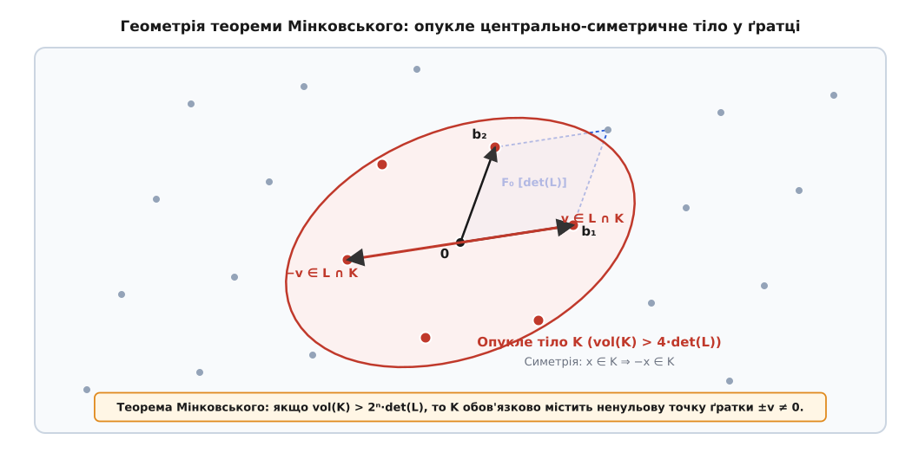
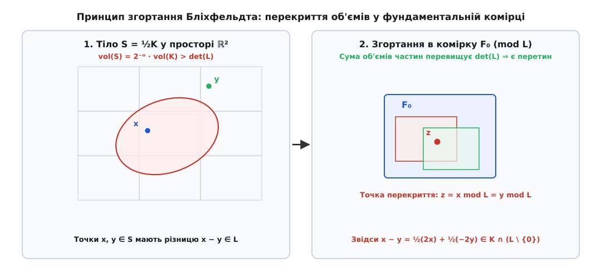
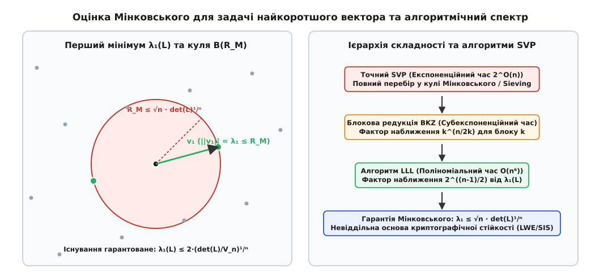

# Теорема Мінковського про опуклі тіла

<preknowlist>
- [Асимптотична складність](book:algorithms/asymptotic-complexity) — O-нотація, поліноміальний та експоненціальний ріст систем.
- [Криптографія на ґратках](book:algorithms/lattice-cryptography) — структури дискретних ґраток, задачі SVP та LWE.
</preknowlist>

Дискретний евклідів простір та неперервна геометрія оперують принципово протилежними поняттями щільності: неперервна область довільного додатного об'єму містить нескінченну кількість точок, тоді як дискретна ґратка утворює розріджену множину ізольованих вузлів із нульовою мірою Лебега. Якщо зафіксувати ґратку в багатовимірному просторі й почати неперервно роздувати опуклу фігуру навколо початку координат, виникає фундаментальне геометричне питання: який мінімальний критичний об'єм повинно мати тіло, щоб його просторові межі гарантовано накрили хоча б один ненульовий вузол дискретної ґратки?

Відповідь на це питання дає теорема Германа Мінковського про опуклі тіла — наріжний результат геометричної теорії чисел, сформульований у 1889 році. Вона встановлює прямий числовий міст між неперервною мірою об'єму довільного симетричного опуклого тіла та дискретною щільністю просторової ґратки. Теорема стверджує, що перевищення об'ємом тіла певного порогу, пропорційного визначнику ґратки, робить геометрично неможливим розміщення цього тіла у просторі без захоплення дискретних вузлів.

У теоретичній інформатиці та аналізі обчислювальної складності теорема Мінковського визначає фундаментальні межі розв'язності задачі знаходження найкоротшого вектора (Shortest Vector Problem, SVP), задачі найближчого вектора (Closest Vector Problem, CVP), алгоритмів цілочисельного лінійного програмування у фіксованій розмірності та сучасних криптографічних конструкцій, стійких до квантового криптоаналізу.

## Геометрія дискретних ґраток та фундаментальний визначник

Нехай задано n лінійно незалежних векторів евклідового простору b₁, b₂, …, bₙ ∈ ℝⁿ. Дискретною ґраткою повної розмірності (full-rank lattice) L = L(B) називається множина всіх їхніх цілочисельних лінійних комбінацій:

```text
L = { ∑ (zᵢ · bᵢ)  |  zᵢ ∈ ℤ,  i = 1, …, n }
```

Матриця B = [b₁, b₂, …, bₙ] ∈ ℝ^(n×n), складена з базисних векторів як стовпчиків, називається матрицею базису ґратки. Один і той самий дискретний точковий каркас L може породжуватися нескінченною кількістю різних базисів: перехід від одного базису B до іншого B' здійснюється множенням на цілочисельну унімодулярну матрицю U ∈ ℤ^(n×n) із визначником det(U) = ±1 за правилом B' = B · U.

Вибір базису кардинально впливає на числову стійкість алгоритмів та геометрію обчислень: один базис може складатися з майже взаємно ортогональних коротких векторів, тоді як інший базис тієї ж самої ґратки може містити гігантські вектори, спрямовані під мікроскопічно малим кутом один до одного. Число обумовленості матриці базису κ(B) = ‖B‖ · ‖B⁻¹‖ слугує мірою ортогональності: для ідеально ортогонального базису κ(B) = 1, тоді як для погано обумовлених базисів це число може сягати значень 10¹² і більше, провокуючи чисельні катастрофи під час наївного округлення координат.

Кожен базис B визначає у просторі фундаментальну паралелепіпедальну комірку (fundamental parallelotope) P(B), яка при паралельних переносах на всі вектори ґратки замощує простір ℝⁿ без прогалин і взаємних перекриттів внутрішніх областей:

```text
P(B) = { ∑ (xᵢ · bᵢ)  |  0 ≤ xᵢ < 1,  i = 1, …, n }
```

Об'єм фундаментальної області vol(P(B)) є геометричним інваріантом ґратки, який не залежить від вибору конкретного базису. Він називається фундаментальним визначником або детермінантом ґратки det(L):

```text
det(L) = |det(B)| = √(det(Bᵀ · B))
```

Величина детермінанта має прозорий фізичний зміст: вона задає об'єм простору, який припадає рівно на один вузол ґратки. Відповідно, середня просторова густина вузлів дорівнює величині, оберненій до визначника: ρ(L) = 1 / det(L). Якщо детермінант малий, вузли ґратки розташовані густо; якщо детермінант великий — простір розріджений. Будь-яка вибірка простору об'єму V у середньому містить приблизно V / det(L) точок ґратки.

Історичний шлях відкриття цих просторових структур від досліджень квадратичних форм Лагранжем і Гауссом до створення геометрії чисел Мінковським детально висвітлено в нарисі [Історичний розвиток геометрії чисел від теорії квадратичних форм до криптографії ґраток](book:algorithms/minkowski-theorem/hist-minkowski-geometry-of-numbers.md).

## Перша теорема Мінковського: формулювання та принцип Бліхфельдта

Перша теорема Мінковського встановлює строгу умову на об'єм геометричного тіла, за якої воно гарантовано містить ненульову точку ґратки.

Нехай L ⊂ ℝⁿ — повна ґратка з визначником det(L), а K ⊂ ℝⁿ — опукла множина, центрально-симетрична відносно початку координат (тобто x ∈ K ⟹ -x ∈ K). Якщо об'єм тіла задовольняє строгу нерівність:

```text
vol(K) > 2ⁿ · det(L)
```

то тіло K містить щонайменше одну пару ненульових вузлів ґратки ±v ∈ L \ {0}. Якщо множина K є компактною (замкненою та обмеженою), то твердження залишається справедливим і при нестрогій нерівності vol(K) ≥ 2ⁿ · det(L).


*Опукле центрально-симетричне тіло K у просторі ґратки L, об'єм якого перевищує поріг 2ⁿ det(L), гарантовано накриває протилежні ненульові вузли ґратки.*

Вимоги опуклості та центральної симетрії є принциповими, і їх не можна відкинути без руйнування теореми. Якщо відмовитися від опуклості, легко побудувати неопукле тіло як завгодно великого (навіть нескінченного) об'єму, яке не містить жодної ненульової точки стандартної цілочисельної ґратки ℤⁿ: достатньо взяти хрестоподібне об'єднання тонких смуг уздовж координатних площин або простір між вузлами. Якщо ж відкинути центральну симетрію, зміщений опуклий симплекс або куб без початку координат у центрі симетрії може мати об'єм, що значно перевищує det(L), не містячи при цьому жодного вузла.

Геометричний поріг 2ⁿ · det(L) виникає з операції рівномірного стискання тіла K у два рази в усіх просторових напрямках: розглянемо множину K/2 = { x/2 ∈ ℝⁿ : x ∈ K }. При лінійному масштабуванні з коефіцієнтом 1/2 у просторі розмірності n об'єм тіла змінюється як (1/2)ⁿ:

```text
vol(K/2) = (1 / 2ⁿ) · vol(K) > det(L)
```

Оскільки об'єм стиснутого тіла K/2 строго перевищує об'єм фундаментальної області det(L), це тіло неможливо розмістити у просторі так, щоб воно не перекривало саме себе при паралельних переносах на вектори ґратки. Це твердження становить суть принципу складання Бліхфельдта (Blichfeldt's Principle).


*Принцип складання Бліхфельдта: розбиття масштабованого тіла K/2 на фрагменти та їхній паралельний перенос у фундаментальну комірку P(B) неминуче породжує перекриття областей.*

Якщо розрізати стиснуте тіло K/2 на частини фундаментальними комірками ґратки й перенести кожен фрагмент вектором ґратки у вихідну фундаментальну область P(B), сума об'ємів перенесених частин дорівнюватиме vol(K/2) > vol(P(B)). За принципом Діріхле для міри Лебега, у фундаментальній області P(B) обов'язково знайдуться дві різні точки x₁, x₂ ∈ K/2, які накладаються одна на одну після перенесення на різні вектори ґратки v₁, v₂ ∈ L:

```text
x₁ + v₁ = x₂ + v₂  ⟹  x₁ - x₂ = v₂ - v₁ ∈ L \ {0}
```

Позначимо отриманий ненульовий вектор ґратки як v = x₁ - x₂ ∈ L \ {0}. Оскільки x₁, x₂ ∈ K/2, за визначенням існують точки y₁, y₂ ∈ K такі, що x₁ = y₁ / 2 та x₂ = y₂ / 2. Тоді різниця набуває вигляду:

```text
v = (y₁ - y₂) / 2 = (1/2) · y₁ + (1/2) · (-y₂)
```

Тут критично спрацьовують обидві геометричні властивості тіла K:
1. За центральною симетрією, оскільки y₂ ∈ K, протилежна точка -y₂ також належить K.
2. За опуклістю тіла K, відрізок між будь-якими двома точками множини повністю лежить усередині множини. Точка (y₁ + (-y₂)) / 2 є серединою відрізка між y₁ ∈ K та -y₂ ∈ K, отже v ∈ K.

Таким чином, ненульовий вузол ґратки v ∈ L \ {0} гарантовано належить тілу K. Якщо тіло компактне, але vol(K) = 2ⁿ · det(L), твердження доводиться розглядом послідовності роздутих тіл (1 + 1/k) · K для k = 1, 2, …: кожне з них містить ненульовий вузол vₖ ∈ L, а з дискретності ґратки випливає, що перетин скінченної кількості таких точок непорожній і лежить у K.

Строге мірно-теоретичне доведення теореми Бліхфельдта з інтегруванням характеристичних функцій та переходом до границі компактності наведено в документі [Мірно-теоретичне доведення теореми Бліхфельдта та наслідків Мінковського](book:algorithms/minkowski-theorem/math-blichfeldt-proof.md).

## Оцінка довжини найкоротшого вектора та константи Ерміта

Найважливішим наслідком першої теореми Мінковського в обчислювальній геометрії є апріорна верхня оцінка довжини найкоротшого ненульового вектора ґратки. Першим послідовним мінімумом ґратки λ₁(L) називається евклідова довжина її найкоротшого ненульового елемента:

```text
λ₁(L) = min { ‖v‖₂  |  v ∈ L \ {0} }
```

Застосуємо теорему Мінковського до закритої n-вимірної евклідової кулі Bₙ(r) = { x ∈ ℝⁿ : ‖x‖₂ ≤ r }. Куля є опуклою, центрально-симетричною та компактною множиною. Її n-вимірний об'єм виражається через гамма-функцію Ейлера:

```text
vol(Bₙ(r)) = Vₙ · rⁿ = (π^(n/2) / Γ(n/2 + 1)) · rⁿ
```

Щоб у кулі радіуса r гарантовано існував ненульовий вузол ґратки, її об'єм повинен досягти критичного порогу vol(Bₙ(r)) ≥ 2ⁿ · det(L):

```text
Vₙ · rⁿ ≥ 2ⁿ · det(L)  ⟺  r ≥ 2 · (det(L) / Vₙ)^(1/n)
```

Отже, мінімальний радіус кулі, що містить вузол ґратки, задовольняє нерівність:

```text
λ₁(L) ≤ 2 · Vₙ^(-1/n) · (det(L))^(1/n)
```

Використовуючи асимптотичну формулу Стірлінга для гамма-функції Γ(n/2 + 1) ≈ √(2π(n/2)) · ((n/2)/e)^(n/2), отримуємо асимптотичну поведінку коефіцієнта об'єму кулі:

```text
Vₙ^(1/n) ≈ √(2πe / n)
```

Підставляючи це значення в нерівність радіуса, отримуємо класичну межу Мінковського для довжини найкоротшого вектора ґратки:

```text
λ₁(L) ≤ √(2n / (πe)) · (det(L))^(1/n) ≤ √n · (det(L))^(1/n)
```


*Співвідношення радіуса Мінковського R_M, гауссової евристики GH(L) та точності наближених алгоритмів редукції ґраток у просторах високої розмірності.*

Для порівняння, очікувана довжина найкоротшого вектора у випадковій рівномірно розподіленій ґратці (гауссова евристика) становить:

```text
GH(L) = (1 / √π) · (Γ(n/2 + 1))^(1/n) · (det(L))^(1/n) ≈ √(n / (2πe)) · (det(L))^(1/n)
```

Співвідношення між межею Мінковського та гауссовою евристикою є сталим множником: R_M / GH(L) ≈ 2. Це означає, що теоретична верхня межа Мінковського лише вдвічі перевищує середньостатистичну довжину найкоротшого вектора типової випадкової ґратки.

Відношення квадрата довжини найкоротшого вектора до масштабованого визначника ґратки називається константою Ерміта γₙ:

```text
γₙ = sup { λ₁(L)² / (det(L))^(2/n)  |  L ⊂ ℝⁿ }
```

Теорема Мінковського забезпечує універсальну верхню оцінку константи Ерміта для довільної розмірності: γₙ ≤ 4 · Vₙ^(-2/n) ≈ 2n / (πe). Точні аналітичні значення γₙ знайдені лише для невеликих розмірностей: γ₁ = 1, γ₂ = 2/√3 (гексагональна ґратка A₂), γ₃ = 2^(1/3) (гранецентрована кубічна ґратка A₃), γ₄ = √2 (ґратка D₄), γ₅ = 8^(1/5), γ₆ = (64/3)^(1/6), γ₇ = (64)^(1/7), γ₈ = 2 (високосиметрична ґратка E₈), а також для розмірності n = 24: γ₂₄ = 4 (знаменита ґратка Ліча Λ₂₄).

## Друга теорема Мінковського: послідовні мінімуми

Перша теорема Мінковського контролює лише один найкоротший вектор ґратки. Однак повний геометричний опис просторової ґратки вимагає оцінки довжин базису з n лінійно незалежних векторів. Для цього Мінковський увів поняття послідовних мінімумів (successive minima).

Нехай L ⊂ ℝⁿ — ґратка, а K ⊂ ℝⁿ — опукле центрально-симетричне тіло ненульового об'єму. i-м послідовним мінімумом λᵢ(L, K) називається найменше додатне дійсне число λ > 0 таке, що гомотетично розтягнуте тіло λK містить щонайменше i лінійно незалежних векторів ґратки:

```text
λᵢ(L, K) = inf { λ > 0  |  dim(span(λK ∩ L)) ≥ i }
```

За визначенням послідовні мінімуми утворюють монотонно неспадно ланцюжок дійсних чисел:

```text
0 < λ₁ ≤ λ₂ ≤ … ≤ λₙ < ∞
```

Важливо підкреслити тонкий алгебраїчний факт: вектори v₁, v₂, …, vₙ, що реалізують послідовні мінімуми ‖vᵢ‖ = λᵢ(L), завжди є лінійно незалежними у векторному просторі ℝⁿ, проте для розмірностей n ≥ 5 вони не обов'язково утворюють базис самої ґратки L (вони можуть породжувати підґратку строгого індексу [L : span_ℤ(v₁,…,vₙ)] > 1).

Якщо ґратка є сильно витягнутою (анізотропною), значення мінімумів можуть відрізнятися на багато порядків: наприклад, λ₁ може бути дуже малим, а λₙ — гігантським. Друга теорема Мінковського пов'язує добуток усіх n послідовних мінімумів із загальним об'ємом тіла та визначником ґратки.

Для будь-якої повної ґратки L ⊂ ℝⁿ та будь-якого опуклого центрально-симетричного компактного тіла K ⊂ ℝⁿ виконується двостороння нерівність другої теореми Мінковського:

```text
(2ⁿ / n!) · det(L) ≤ ( ∏ λᵢ(L, K) ) · vol(K) ≤ 2ⁿ · det(L)
```

Верхня межа другої теореми Мінковського є істотним посиленням першої теореми: оскільки λ₁ ≤ λ₂ ≤ … ≤ λₙ, маємо λ₁ⁿ ≤ ∏ λᵢ, звідки λ₁ⁿ · vol(K) ≤ 2ⁿ · det(L), що негайно повертає твердження першої теореми.

Геометричний зміст другої теореми полягає в тому, що ґратка не може мати всі послідовні мінімуми малими одночасно: якщо вздовж одних осей ґратка є надзвичайно щільною (малі λ₁, …, λₖ), то вздовж решти ортогональних напрямків вона неминуче виявиться розрідженою (великі λₖ₊₁, …, λₙ), зберігаючи інваріант фундаментального об'єму комірки det(L).

Ця властивість тісно пов'язана зі структурою двоїстої ґратки L* = { y ∈ ℝⁿ : ∀ x ∈ L, ⟨x, y⟩ ∈ ℤ }. Відповідно до теорем переносу Баная–Куршака (Banaszczyk transference theorems), послідовні мінімуми прямої та двоїстої ґраток зв'язані співвідношенням:

```text
1 ≤ λ₁(L) · λₙ(L*) ≤ n
```

Наявність дуже короткого вектора в двоїстій ґратці L* безпосередньо сигналізує про те, що всі точки прямої ґратки L розшаровані вздовж системи паралельних гіперплощин із великою міжплощинною відстанню 1 / ‖v*‖₂. Цей факт є наріжним каменем для виявлення пласких напрямків в алгоритмах цілочисельної оптимізації.

## Теорема про лінійні форми та діофантові наближення

Якщо як опукле симетричне тіло K обрати не евклідову кулю, а багатовимірний паралелепіпед, обмежений системою лінійних нерівностей, теорема Мінковського перетворюється на потужний апарат для розв'язання діофантових рівнянь та наближення ірраціональних чисел.

Розглянемо систему n дійсних лінійних форм від n змінних Lᵢ(x) = ∑ aᵢⱼ xⱼ, матриця коефіцієнтів якої A = (aᵢⱼ) має визначник det(A) ≠ 0. Задамо додатні дійсні межі c₁, c₂, …, cₙ > 0. Множина точок:

```text
K = { x ∈ ℝⁿ  |  |Lᵢ(x)| ≤ cᵢ,  i = 1, …, n }
```

є центрально-симетричним опуклим багатогранником (паралелепіпедом). Його об'єм обчислюється через визначник матриці перетворення:

```text
vol(K) = (2ⁿ · ∏ cᵢ) / |det(A)|
```

Розглядаючи стандартну цілочисельну ґратку L = ℤⁿ із det(ℤⁿ) = 1, умова теореми Мінковського vol(K) ≥ 2ⁿ · det(ℤⁿ) зводиться до числової нерівності ∏ cᵢ ≥ |det(A)|.

Якщо добуток додатних чисел задовольняє умову c₁ c₂ … cₙ = |det(A)|, то існує ненульовий цілочисельний вектор z = (z₁, …, zₙ) ∈ ℤⁿ \ {0} такий, що:

```text
|L₁(z)| ≤ c₁,   |L₂(z)| < c₂,   …,   |Lₙ(z)| < cₙ
```

Прямим наслідком цього результату є теорема Діріхле про одночасні діофантові наближення: для будь-якого набору n дійсних чисел α₁, α₂, …, αₙ ∈ ℝ та будь-якого цілого числа N ≥ 1 існує цілий знаменник 1 ≤ q ≤ N та цілі чисельники p₁, …, pₙ ∈ ℤ такі, що:

```text
max |q · αᵢ - pᵢ| ≤ 1 / N^(1/n),   i = 1, …, n
```

Геометричний підхід Мінковського дозволив також миттєво довести класичні теореми теорії чисел:
- **Теорема Ферма про два квадрати:** Кожне просте число виду p = 4k + 1 розкладається в суму двох квадратів p = a² + b². Доведення полягає в побудові 2-вимірної ґратки L = { (x, y) ∈ ℤ² : y ≡ u · x (mod p) }, де u² ≡ -1 (mod p), із визначником det(L) = p, та застосуванні теореми Мінковського до круга радіуса √(2p). Об'єм круга vol(K) = π · (√(2p))² = 2πp > 4p = 4 det(L). Звідси існує ненульова точка (a, b) ∈ L з a² + b² ≤ 2p. Оскільки a² + b² ≡ a² + (ua)² ≡ a²(1 + u²) ≡ 0 (mod p) і 0 < a² + b² < 2p, єдиним можливим значенням є a² + b² = p.
- **Теорема Лагранжа про чотири квадрати:** Будь-яке натуральне число є сумою чотирьох квадратів цілих чисел n = x₁² + x₂² + x₃² + x₄². Доведення використовує 4-вимірну ґратку кватерніонних лишків із визначником det(L) = n та 4-вимірну кулю радіуса √(2n), об'єм якої vol(K) = (π² / 2) · (2n)² = 2π² n² > 16n = 16 det(L).

## Обчислювальний бар'єр: NP-складність SVP та алгоритми редукції

Попри математичну елегантність, теорема Мінковського є суто екзистенційним твердженням: вона доводить існування короткого вектора v ∈ L із довжиною ‖v‖₂ ≤ √n · (det(L))^(1/n), але не вказує ефективного алгоритму його обчислення.

Задача знаходження вектора, що реалізує перший послідовний мінімум λ₁(L), називається задачею найкоротшого вектора (Shortest Vector Problem, SVP):

```text
SVP:  знайти v ∈ L \ {0} такий, що ‖v‖₂ = λ₁(L)
```

У загальній розмірності n задача SVP є NP-важкою відносно ймовірнісних рандомізованих редукцій (результати Міккіанчо, Аятая та Хавара). Навіть наближена версія задачі SVP_γ, яка вимагає знайти вектор довжини ‖v‖₂ ≤ γ · λ₁(L), залишається NP-важкою для довільних константних факторів наближення γ = O(1) та субполіноміальних факторів γ = n^(c / log log n).

Для точного знаходження найкоротшого вектора в межах кулі Мінковського R_M = √n · (det(L))^(1/n) застосовується детермінований алгоритм сферичного перебору Шнорра–Ейхнера (Schnorr-Euchner Enumeration). Алгоритм здійснює рекурсивний пошук у глибину по дереву цілочисельних коефіцієнтів, обрізаючи піддерева, квадрат відстані яких у проєкціях Грама–Шмідта перевищує поточний знайдений мінімум або радіус Мінковського R_M².

Часова складність точного перебору складає 2^(O(n · log n)) на попередньо редукованих базисах при поліноміальній просторовій пам'яті O(n). Альтернативний клас точних методів — алгоритми просіювання (lattice sieving, алгоритми NV08, BDGL16) — досягають суто експоненційного часу 2^(0.292 n + o(n)), проте вимагають експоненційного обсягу пам'яті 2^(0.208 n + o(n)) для збереження сотень мільйонів векторів-кандидатів.

Для задачі знаходження найближчого вектора (Closest Vector Problem, CVP) геометричним аналогом фундаментальної комірки є клітина Вороного (Voronoi cell) — опуклий багатогранник точок простору, найближчих до початку координат. Оскільки точне знаходження клітини Вороного вимагає експоненційної кількості гіперплощин 2 · (2ⁿ - 1), у практичних задачах застосовують наближені геометричні алгоритми:
- **Алгоритм округлення Бабая (Babai's Rounding):** Проєктує цільову точку t на базис та незалежно округлює дійсні координати z = ⌊B⁻¹ · t⌉. Метод ефективний лише на майже ортогональних базисах.
- **Алгоритм найближчої площини Бабая (Babai's Nearest Plane):** Здійснює послідовну ортогональну проєкцію на гіперплощини Грама–Шмідта від рівня n до 1, гарантуючи відстань ‖t - v‖₂ ≤ 2^(n/2) · dist(t, L).
- **Вкладення Каннана (Kannan's Embedding):** Зводить неоднорідну задачу CVP у просторі ℝⁿ до однорідної задачі SVP у просторі розмірності n + 1, конструюючи блочну матрицю базису з вектором зміщення t та масштабним коефіцієнтом d = μ · dist(t, L).

Алгоритмічну реалізацію, структури дерева перебору та паралелізацію обчислень наведено в інженерному проєкті [Реалізація точного розв'язувача задачі найкоротшого вектора у кулі Мінковського](book:algorithms/minkowski-theorem/proj-minkowski-svp-solver.md).

Для подолання експоненційного бар'єру в комп'ютерній алгебрі використовуються алгоритми поліноміальної редукції базису:

1. **Алгоритм LLL (Lenstra–Lenstra–Lovász, 1982):**
   Знаходить ненульовий вектор ґратки, що гарантує наближену оцінку Мінковського з експоненційним фактором:
   ```text
   ‖b₁‖₂ ≤ 2^((n-1)/4) · (det(L))^(1/n) ≤ 2^((n-1)/2) · λ₁(L)
   ```
   Алгоритм працює за строго поліноміальний час O(n⁵ · B · log³ B), де B — бітова довжина елементів вхідної матриці. Якість редукції LLL на практиці характеризується кореневим фактором Ерміта δ₀ = (‖b₁‖ / det(L)^(1/n))^(1/n) ≈ 1.0219.
2. **Алгоритм BKZ (Block Korkin-Zolotarev):**
   Узагальнює LLL, розбиваючи n-вимірну ґратку на перекривні блоки розмірності β ∈ [2, n] та викликаючи точний SVP-оракул всередині кожного блоку. Забезпечує кореневий фактор Ерміта порядку δ₀ ≈ (β / (2πe))^(1 / (2(β-1))) (наприклад, δ₀ ≈ 1.012 для β = 20 та δ₀ ≈ 1.005 для β = 300) за час n · 2^(O(β · log β)).

Повний програмний інтерфейс бібліотеки для роботи з ґратками, перевірки умов Мінковського та виконання редукції представлено в довіднику [Специфікація інтерфейсу геометрії ґраток та опуклих тіл](book:algorithms/minkowski-theorem/api-lattice-geometry.md).

Крім того, геометрія чисел лежить в основі знаменитого алгоритму Ленстри (1983) для задачі цілочисельного лінійного програмування (Integer Linear Programming, ILP). Ленстра показав, що задача перевірки сумісності системи лінійних нерівностей A x ≤ b, x ∈ ℤⁿ розв'язується за поліноміальний час при фіксованій розмірності n. Алгоритм знаходить афінне перетворення, що округлює багатогранник рішень, після чого або знаходить внутрішній вузол ґратки за теоремою Мінковського, або виявляє «плаский» напрямок (flattest direction) за теоремою Хінчина та зводить задачу до константної кількості підзадач у розмірності n - 1.

## Роль у постквантовій криптографії

В останні два десятиліття геометрія чисел та теорема Мінковського перетворилися з класичного розділу чистої математики на фундамент світової криптографічної інфраструктури нового покоління.

У 1996 році Міклош Аятай (Miklós Ajtai) здійснив фундаментальний прорив у теоретичній інформатиці, відкривши явище зведення від найгіршого випадку до середнього (worst-case to average-case reduction). Аятай показав, що існує сімейство випадкових ґраток (так звані q-арні ґратки L_q(A) = { x ∈ ℤⁿ : A x ≡ 0 (mod q) }), для яких знаходження короткого вектора у випадково згенерованому екземплярі ґратки (задача Short Integer Solution, SIS) є настільки ж обчислювально важким, як і розв'язання задачі SVP_γ у найгіршому випадку для абсолютно будь-якої ґратки розмірності n.

На цій математичній основі Одет Регев (Oded Regev, 2005) побудував концепцію навчання з помилками (Learning With Errors, LWE), яка дозволяє створювати системи асиметричного шифрування з доказовою стійкістю: розв'язання задачі LWE зводиться до задачі знаходження найближчого вектора (CVP) у випадковій q-арній ґратці. Оцінка стійкості LWE опирається на дві основні геометричні стратегії криптоаналізу:
1. **Пряма атака (Primal Attack):** Зведення LWE до задачі пошуку унікального найкоротшого вектора (uSVP) у розширеній ґратці розмірності d = n + m + 1 через вкладення Каннана.
2. **Двоїста атака (Dual Attack):** Пошук короткого вектора у двоїстій ґратці за допомогою алгоритму BKZ для розрізнення шумів від рівномірного розподілу.

Квантові комп'ютери завдяки алгоритму Шора здатні зламати класичні криптосистеми RSA, DSA та ECDSA за поліноміальний час через розв'язання задач факторизації та дискретного логарифмування в абелевих групах. Проте для задач на ґратках (SVP, CVP, LWE) швидких квантових алгоритмів не знайдено: задача знаходження прихованої підгрупи (Hidden Subgroup Problem) на ґратках відповідає неабелевим групам діедра, для яких алгоритм Шора не працює. Найкращі квантові алгоритми (включаючи прискорення перебору за алгоритмом Ґровера) покращують часову складність SVP лише на постійний множник у показнику степеня: 2^(0.265 · n) проти 2^(0.292 · n) для класичних алгоритмів просіювання.

У серпні 2024 року Національний інститут стандартів і технологій США (NIST) затвердив перші глобальні постквантові стандарти:
- **FIPS 203 (ML-KEM / Kyber):** Основний алгоритм квантово-стійкого обміну ключами (рівні безпеки NIST 1, 3, 5 відповідають параметрам Kyber-512, Kyber-768 та Kyber-1024).
- **FIPS 204 (ML-DSA / Dilithium):** Основний алгоритм квантово-стійкого цифрового підпису.

Обидва стандарти повністю спираються на геометричні властивості модульних ґраток над кільцями многочленів R_q = ℤ_q[X] / (X²⁵⁶ + 1). Вибір розмірностей (n = 512, 768, 1024), модуля q = 3329 та розподілів помилок у цих протоколах базується на розрахунках межі Мінковського, гауссової евристики та обчислювальної стійкості алгоритмів блокової редукції BKZ проти знаходження найкоротших векторів.

Теорема Мінковського про опуклі тіла залишається фундаментальним геометричним орієнтиром: вона вказує точну теоретичну межу, де закінчується неперервна пустота простору і неминуче з'являється дискретна структура цілих чисел.
