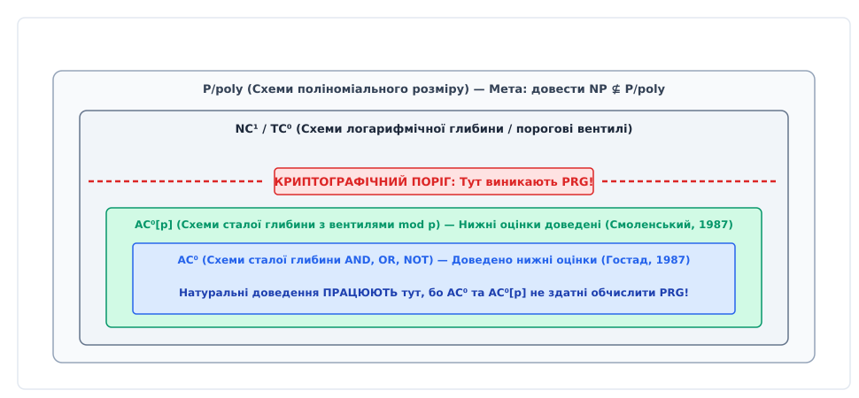
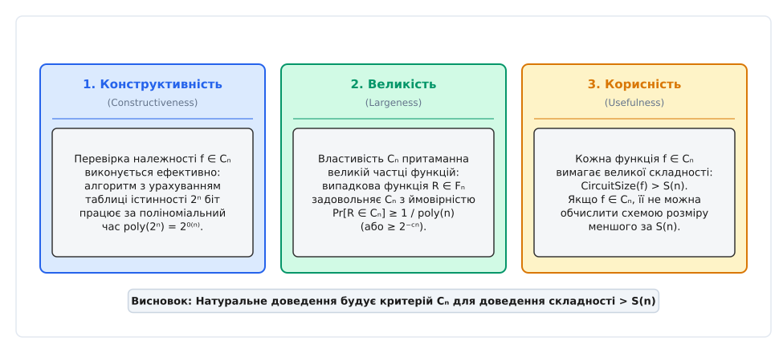
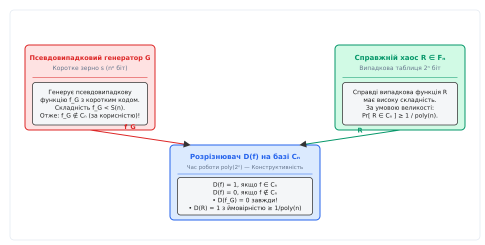
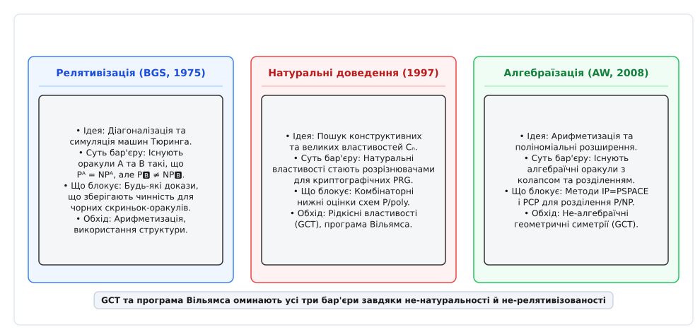

# Природні доведення

<preknowlist>
- [P проти NP](book:algorithms/p-vs-np) — основна проблема складності та гіпотеза про нерівність класів.
- [Кук–Левін та NP-повнота](book:algorithms/cook-levin-theorem) — зведення задач та поняття найважчих задач у NP.
- [Асимптотична складність](book:algorithms/asymptotic-complexity) — поліноміальне та експоненційне зростання.
- [Теорема Ладнера](book:algorithms/ladner-theorem) — проміжні класи складності в ієрархії NP.
</preknowlist>

Кожен електронний транзистор у найсучасніших кремнієвих процесорах є фізичною реалізацією булевого вентиля — базового логічного елемента, що обчислює кон'юнкцію, диз'юнкт чи заперечення над бінарними сигналами. Якщо довільний алгоритм розв'язання NP-повної задачі (як-от здійсненності булевих формул SAT) можна виразити послідовністю дій на комп'ютері, то його обчислення на будь-якій фіксованій довжині входу `n` можна розгорнути у комбінаторну схему із булевих вентилів. Доведення того, що ніяка булева схема поліноміального розміру `n^k` принципово не здатна розв'язати NP-повну задачу, автоматично довело б нерівність класів `P ≠ NP` без прив'язки до оракулів та специфічних архітектур машин Тюринга.

Протягом 1980-х років комбінаторна теорія схемної складності (англ. *circuit complexity* від латинського *circuitus* — обхід, коло) вважалася найперспективнішим та найпотужнішим напрямом розділення складнісних класів. Дослідникам вдалося отримати вражаючі математичні результати для схем обмеженої глибини та монотонних схем без вентилів заперечення. Здавалося, що перехід від обмежених моделей до загальних булевих схем — це лише питання часу, нових комбінаторних лем та витонченішого математичного апарату.

Однак у 1994 році Олександр Разборов та Стівен Рудіч на симпозіумі FOCS опублікували працьовиту концептуальну революційну статтю під назвою «Natural Proofs» (опубліковану в журнальному варіанті у Journal of Computer and System Sciences 1997 року). Вони довели фундаментальну мета-теорему: **будь-яке комбінаторне доведення нижніх оцінок схемної складності, яке задовольняє дві природні й майже неминучі умови — конструктивність та великість, — автоматично перетворюється на ефективний алгоритм розрізнення псевдовипадкових послідовностей від справжнього хаосу**. Якщо у світі існують стійкі криптографічні псевдовипадкові генератори (що є основою всієї сучасної криптографії та прямо випливає з гіпотези `P ≠ NP`), то жодне подібне доведення **не здатне** показати надполіноміальну складність для загального класу булевих схем. Цей результат отримав назву **бар'єра природних доведень** (Natural Proofs barrier) і розкрив глибокий, шокуючий зв'язок між теорією складності обчислень та криптографією.

[Історію відкриття мета-теореми Разборова–Рудіча та драматичний перелом 1990-х років](book:algorithms/complexity-computability/natural-proofs/hist-razborov-rudich.md) детально описано у хронологічному екскурсі: від комбінаторного ейфорійного прориву 1980-х років до криптографічного ультиматуму Разборова–Рудіча.

---

## 1. Схемна складність та надія на комбінаторне розділення P і NP

Щоб збагнути витоки природних доведень, необхідно формалізувати модель булевих схем і зрозуміти, чому інформатики вбачали у ній головний ключ до проблеми `P ≟ NP`.

### Неоднорідна модель обчислень P/poly

Булевою схемою `C` від `n` змінних `x₁, x₂, ..., x♮` називається орієнтований ациклічний граф (DAG), у якому:
- Вершини з напівступенем входу 0 (вхідні листки) позначені змінними `xᵢ` або константами 0 і 1.
- Внутрішні вершини (вентилі) позначені базовими булевими операціями: кон'юнкцією `AND` (`∧`), диз'юнкцією `OR` (`∨`) та запереченням `NOT` (`¬`).
- Принаймні одна вершина є вихідною і видає підсумкове значення булевої функції `f(x₁, ..., x♮)`.

**Розміром схеми** `Size(C)` називається загальна кількість вентилів у графі, а **глибиною** `Depth(C)` — найдовший шлях від вхідної вершини до виходу.

```
       x₁         x₂             x₃
        │          │              │
        ├───┐  ┌───┤              │
        ▼   ▼  ▼   ▼              ▼
       [AND_1]    [OR_1]        [NOT_1]
          │          │              │
          └────┬─────┘              │
               ▼                    ▼
            [OR_2]──────────────►[AND_2]
                                    │
                                    ▼
                                  Вихід f(x₁, x₂, x₃)
```

На відміну від машин Тюринга, де один і той самий скінченний алгоритм (програма) обробляє вхідні рядки довільної довжини `n`, модель булевих схем є **неоднорідною** (англ. *non-uniform*): для кожної довжини входу `n` дозволяється будувати окрему схему `C♮`. 

Класом **P/poly** називається множина всіх мов, які розпізнаються сімейством булевих схем `{C♮}_{n=1}^∞` поліноміального розміру: `Size(C♮) ≤ n^k` для деякої константи `k`.

Кожну мову із класу `P` можна ефективно трансформувати у сімейство схем поліноміального розміру (шляхом розгортання роботи машини Тюринга у сітку вентилів, аналогічно до доведення теореми Кука–Левіна). Звідси випливає включення:

```
P ⊆ P/poly
```

Втім, зворотне твердження є хибним: клас `P/poly` містить навіть деякі неалгоритмічні (нерозв'язні) мови, оскільки неоднорідне сімейство схем може «кодувати» необчислювані підказки (англ. *advice bits*) для кожної довжини `n`. Проте з огляду на включення `P ⊆ P/poly`, якщо довести, що якась мова з класу `NP` (наприклад, `SAT`) **не належить** до `P/poly` (`NP ⊈ P/poly`), це автоматично тягне за собою бажаний висновок `P ≠ NP`.

### Теорема Шеннона та підрахунок функцій

У 1949 році Клод Шеннон застосував комбінаторний підрахунок функцій і довів, що абсолютна більшість булевих функцій є гранично важкими. Усього існує `2^{2^n}` різних булевих функцій від `n` змінних. Проте кількість булевих схем розміру `S` над базовими вентилями оцінюється як:

```
N(S) ≤ (c · S)^S
```

Якщо обрати `S(n) = 2^n / (3 n)`, то кількість усіх можливих схем розміру `S(n)` виявляється незрівнянно меншою за загальну кількість булевих функцій `2^{2^n}`:

```
N(S) / 2^{2^n}  →  0   (при n → ∞)
```

Це означає, що випадково обрана булева функція `R` з імовірністю, практично рівною 1, вимагає схемної складності `Size(R) = Ω(2^n / n)`. Однак підрахунок Шеннона є чистим доведенням існування (англ. *existential proof*) за допомогою імовірнісного методу: він не дає жодного способу вказати на **конкретну** NP-функцію (наприклад, SAT чи Clique) і довести для неї складність навіть `n^2`.

### Стратегія комбінаторних нижніх оцінок

Протягом 1980-х років головна стратегія доведення `NP ⊈ P/poly` полягала у пошуку математичної властивості булевих функцій, яка слугує «сертифікатом складності». Ідея виглядала так:

1. Обрати складностну задачу `f♮ ∈ NP` (наприклад, пошук кліки у графі або здійсненність формул).
2. Сформулювати комбінаторний критерій (властивість `C♮`), який притаманний цій конкретній функції `f♮`.
3. Довести теорему розділення: якщо функція `g` володіє властивістю `C♮`, то будь-яка булева схема для `g` мусить мати розмір, більший за `S(n)` (де `S(n)` — надполіноміальна або експоненційна функція).

Дослідники сподівалися, що послідовне посилення методів комбінаторного аналізу дозволить крок за кроком переходити від простих схемних моделей до складніших, аж поки не буде підкорено загальний клас `P/poly`.


*Ієрархія схемних класів: нижні оцінки успішно доведено для AC⁰ та AC⁰[p], але на рівні TC⁰ та NC¹ виникає криптографічний поріг, де з'являються псевдовипадкові генератори.*

---

## 2. Анатомія Натуральної властивості: Три умови Разборова–Рудіча

Разборов та Рудіч проаналізували всі відомі на той час доведення нижніх оцінок у комбінаторній теорії схем. Вони помітили, що практично всі математичні критерії, які використовувалися для доведення складності функцій, мають спільну абстрактну структуру.

Нехай `F♮ = {f: {0,1}^n → {0,1}}` позначує множину всіх `2^{2^n}` можливих булевих функцій від `n` змінних. Таблиця істинності кожної такої функції являє собою бінарний рядок довжини `N = 2^n`. 

Властивістю булевих функцій називається послідовність підмножин `C = {C♮}_{n=1}^∞`, де `C♮ ⊆ F♮`.

Означення Разборова–Рудіча формулює концепцію **натуральності** через три суворі математичні вимоги.

### 1. Конструктивність (Constructiveness)

Властивість `C` називається **конструктивною з часовим бар'єром T(N)**, якщо існує детермінований алгоритм, який за таблицею істинності функції `f ∈ F♮` (довжини `N = 2^n`) обчислює належність `f ∈ C♮` за час `poly(N) = 2^{O(n)}`.

Інтуїтивно це означає, що перевірка того, чи володіє функція «сертифікатом складності», є обчислювально доступною процедурою відносно розміру таблиці істинності. Алгоритму перевірки не потрібно шукати мінімальну схему для `f` через повний перебір усіх можливих схем (що вимагало б `2^{2^n}` кроків), достатньо виконати ефективні комбінаторні або алгебраїчні обчислення над таблицею істинності.

### 2. Великість (Largeness)

Властивість `C` називається **векою**, якщо випадкова булева функція `R ∈ F♮`, обрана за рівномірним розподілом з множини `F♮`, задовольняє властивість `C♮` з помітною ймовірністю:

```
Pr_{R ∈ F♮}[ R ∈ C♮ ]  ≥  δ(n)
```

де `δ(n) ≥ 1 / poly(n)` (у загальному випадку `δ(n) ≥ 2^{-c n}`).

Це означає, що критерій складності `C♮` не є чимось рідкісним чи екзотичним — йому підпорядковується більшість або принаймні вагома поліноміальна частка всіх існуючих булевих функцій. Оскільки абсолютна більшість функцій з `F♮` за теоремою Шеннона мають експоненційну схемну складність (`Size(f) = Ω(2^n / n)`), природно очікувати, що критерій складності справджується для «майже всіх» функцій.

### 3. Корисність проти схем розміру S(n) (Usefulness)

Властивість `C` називається **корисною проти схем розміру S(n)**, якщо для кожної послідовності функцій `f = {f♮}_{n=1}^∞`, яка задовольняє `f♮ ∈ C♮` для всіх достатньо великих `n`, виконується умова:

```
Size(f♮) > S(n)
```

Це означає, що належність функції до множини `C♮` слугує математичним доказом того, що `f♮` неможливо обчислити жодною булевою схемою розміру, меншого або рівного `S(n)`.


*Три фундаментальні вимоги до натуральної властивості C♮: Конструктивність (швидка перевірка), Великість (покриття більшості функцій) та Корисність (гарантія високої складності).*

Доведення нижньої оцінки розміру `S(n)` для конкретної NP-функції `f♮`, яке спирається на побудову такої властивості `C`, називається **натуральним доведенням** (англ. *Natural Proof*).

[Детальний математичний апарат та формальні доведення теореми Разборова–Рудіча](book:algorithms/complexity-computability/natural-proofs/math-razborov-rudich.md) виведено у спеціалізованому математичному розборі: від теорії випадкових функцій Шеннона до побудови розрізнювачів на основі псевдовипадкових сімейств Голдрейха–Голдвассер–Мікалі (GGM).

---

## 3. Криптографічний парадокс: Чому нижні оцінки стають зброєю проти генераторів

Головне відкриття Разборова та Рудіча полягає у тому, що три вимоги натуральності утворюють приховане математичне цунамі, яке зносить можливість доведення нижніх оцінок для загальних схем.

### Псевдовипадкові генератори функцій (PRF) та дерево GGM

Сучасна криптографія спирається на існування **псевдовипадкових генераторів функцій** (англ. *Pseudorandom Function Generators*, PRF). За фундаментальною теоремою Голдрейха, Голдвассер та Мікалі (GGM, 1986), якщо існують односторонні функції (англ. *one-way functions*), то для будь-якої константи `ε > 0` існує сімейство псевдовипадкових функцій:

```
G: {0,1}^{k} × {0,1}^n → {0,1}
```

де `k = n^ε` — довжина короткого криптографічного зерна (англ. *seed*).

Побудова GGM будує binary tree глибини `n`: починаючи із зерна `s` кореня, кожен вузол розгортається одностороннім генератором `g: {0,1}^k → {0,1}^{2k}` у два синівські вузли. Значення у листку з бінарним адресом `x₁x₂...x♮` визначає біт `f_s(x)`.

Для кожного фіксованого зерна `s ∈ {0,1}^{k}` генератор задає булеву функцію `f_s(x) = G(s, x)` від `n` змінних. Специфіка полягає у тому, що:

1. **Мала схемна складність:** Оскільки зерно `s` має коротку довжину `n^ε`, обчислення гілки дерева GGM вимагає лише `n` застосувань базового генератора `g`. Отже, функція `f_s(x)` обчислюється булевою схемою дуже малого поліноміального розміру `S(n) = poly(n)`.
2. **Криптографічна нерозрізненість:** Жодний алгоритм-розрізнювач (англ. *distinguisher*) `D`, який працює за поліноміальний час від довжини входу, не може відрізнити випадково обрану псевдовипадкову функцію `f_s` від справді випадкової функції `R ∈ F♮` з помітною перевагою:

```
| Pr_{s}[ D(f_s) = 1 ] - Pr_{R ∈ F♮}[ D(R) = 1 ] |  <  1 / poly(n)
```

Існування PRF є фундаментальним припущенням, на якому базується стійкість симетричного шифрування (AES), блочних шифрів, кодів автентифікації повідомлень (MAC) та мережевих протоколів TLS/SSL. Більше того, існування односторонніх функцій є математично слабшою вимогою, ніж `P ≠ NP` (якщо `P = NP`, то односторонніх функцій та криптографії не існує взалі).

### Механізм зламу криптографії за допомогою натурального доведення

Припустимо, що математикам вдалося побудувати натуральну властивість `C = {C♮}_{n=1}^∞`, яка є корисною проти схем розміру `S(n) = n^k`. Разборов і Рудіч показали, як з цієї властивості миттєво сконструювати ефективний криптографічний розрізнювач `D`, що повністю зламує псевдовипадковий генератор `G`.

Сконструюємо алгоритм-розрізнювач `D(f)`, який отримує на вхід таблицю істинності неоднозначної булевої функції `f ∈ F♮` довжини `N = 2^n`:

1. Алгоритм `D` запускає перевірку належності `f ∈ C♮`, використовуючи алгоритм з умови **Конструктивності**.
2. Якщо `f ∈ C♮`, алгоритм видає відповідь `1` (справді випадкова функція).
3. Якщо `f ∉ C♮`, алгоритм видає відповідь `0` (псевдовипадкова функція).


*Схема розрізнювача Разборова–Рудіча: Натуральна властивість C♮ класифікує справді випадкову функцію R як складностну (видає 1), а псевдовипадкову функцію f_G відсікає як просту (видає 0), зламуючи PRG.*

Проаналізуємо поведінку розрізнювача `D` на двох джерелах функцій:

- **Поведінка на псевдовипадкових функціях `f_s`:**
  Кожна псевдовипадкова функція `f_s` обчислюється схемою розміру `poly(n) < S(n)`. Проте за умовою **Корисності**, кожна функція `g ∈ C♮` вимагає схемної складності, суворо більшої за `S(n)`. Отже, жодна псевдовипадкова функція принципово не може володіти властивістю `C♮`:
  
  ```
  f_s ∉ Cₙ   ⇒   Pr_{s}[ D(f_s) = 1 ] = 0
  ```

- **Поведінка на справді випадкових функціях `R`:**
  За умовою **Великості**, справді випадкова функція `R ∈ F♮` задовольняє властивість `C♮` з високою ймовірністю:
  
  ```
  Pr_{R ∈ F♮}[ D(R) = 1 ]  =  Pr_{R ∈ F♮}[ R ∈ C♮ ]  ≥  1 / poly(n)
  ```

- **Обчислювальна ефективність розрізнювача:**
  За умовою **Конструктивності**, перевірка `f ∈ C♮` виконується за час `poly(N) = 2^{O(n)}`. Оскільки довжина входу розрізнювача дорівнює `N = 2^n`, час роботи `D` є поліноміальним відносно розміру входу `N`!

Отже, розрізнювач `D` має помітну статистичну перевагу:

```
| Pr_{s}[ D(f_s) = 1 ] - Pr_{R ∈ F♮}[ D(R) = 1 ] |  ≥  1 / poly(n)  >  0
```

Цей результат означає, що розрізнювач `D` повністю спростовує псевдовипадковість генератора `G` та зламує відповідну криптографічну систему!

> **Теорема Разборова–Рудіча (1997).** Якщо у світі існують псевдовипадкові генератори функцій складності `2^{n^ε}` (що є стандартною криптографічною гіпотезою), то не існує жодної натуральної властивості, корисної проти схем поліноміального розміру `P/poly`.

Виникає фундаментальний парадокс: **намагаючись довести `P ≠ NP` за допомогою натуральних комбінаторних оцінок, науковці спростовують існування криптографії — тобто спростовують саме те припущення, з якого випливає `P ≠ NP`**.

---

## 4. Чому нижні оцінки 1980-х працювали: Лінія між AC⁰ та TC⁰

Відкриття Разборова та Рудіча викликало природне запитання: якщо натуральні доведення безсилі проти загальних булевих схем `P/poly`, чому ж комбінаторні методи 1980-х років дозволили довести видатні нижні оцінки для обмежених класів схем?

Щоб відповісти на це питання, слід розглянути ієрархію схемних класів нижчого рівня.

### 1. Монотонні схеми та лема про соняшники Разборова (1985)

У 1985 році Олександр Разборов здобув революційний результат: він довів експоненційну нижню оцінку для **монотонних булевих схем** (схем, які містять лише вентилі `AND` та `OR`, але позбавлені вентилів заперечення `NOT`) для задачі про Кліку (`CLIQUE`).

Разборов використав метод апроксимацій: кожен вентиль `AND` та `OR` замінюється спрощеним оператором над DNF-формами за допомогою комбінаторної **леми про соняшники** Ердьоша–Радо (Sunflower Lemma). Доведення Разборова було на 100% **натуральним**: властивість «не апроксимуватися малими формами» є конструктивною та притаманна більшості монотонних функцій.

Чому це доведення спрацювало? Тому що монотонні схеми є принципово неповною моделлю обчислень: вони не здатні реалізувати заперечення, а отже, у класі монотонних функцій принципово неможливо обчислити жоден псевдовипадковий генератор. Згодом Разборов і Тардош (1988) довели, що монотонна складність проблеми досконалого паросполучення (Perfect Matching) є експоненційною, хоча сама задача належить до класу `P` і розв'язується за поліноміальний час при наявності вентилів `NOT`. Це підкреслило, що монотонний світ повністю відірваний від реальної складності обчислень.

### 2. Схеми AC⁰ та лема про перемикання Гостада (1987)

Клас **AC⁰** складається з сімейств булевих схем **сталої глибини** (англ. *bounded depth*) `d = O(1)` над вентилями `AND`, `OR` та `NOT`, де вентилі `AND` та `OR` мають необмежений напівступінь входу (англ. *unbounded fan-in*).

У 1987 році Йоган Гостад довів знамениту **лему про перемикання** (Switching Lemma): якщо до булевої функції з класу `AC⁰` застосувати випадкове підставляння констант (зафіксувати більшість змінних випадковими значеннями 0 і 1 з параметром `p`), то будь-який диз'юнкт великої ширини з високою ймовірністю перетворюється на короткий кон'юнктичний вираз степеня `k`. Завдяки цьому Гостад довів, що функція парності `PARITY(x₁, ..., x♮) = x₁ ⊕ x₂ ⊕ ... ⊕ x♮` вимагає експоненційного розміру схем `2^{Ω(n^{1/(d-1)})}` у класі `AC⁰`.

Доведення Гостада виявилося **натуральним**: властивість «спрощуватися при випадковому фіксуванні змінних» є конструктивною (перевіряється за час `poly(2^n)`) і притаманна більшості функцій. Чому це не суперечить теоремі Разборова–Рудіча? Тому що **клас `AC⁰` є занадто слабким, щоб обчислити бодай один псевдовипадковий генератор**! Всередині `AC⁰` криптографія неможлива, тому натуральне доведення не зіштовхується із криптографічним бар'єром.

### 3. Схеми AC⁰[p] та поліноміальний метод Смоленського (1987)

Роман Смоленський розширив клас `AC⁰`, додавши до нього порогові вентилі додавання за модулем простого числа `p` (`MOD_p`), утворивши клас **AC⁰[p]**. 

Для доведення нижніх оцінок Смоленський застосував **алгебраїчний метод апроксимації**: кожен вентиль `AND` та `OR` апроксимується поліномом низького степеня над скінченним полем `𝔽_p` за допомогою теореми Разборова. Це дозволило довести, що обчислення функції `MOD_q` (де `q ≠ p` є іншим простим числом) вимагає експоненційного розміру схем у класі `AC⁰[p]`.

Властивість «представлятися поліномами низького степеня над `𝔽_p`» також є **натуральною**. Але, як і `AC⁰`, клас `AC⁰[p]` принципово не здатний реалізувати псевдовипадкові генератори (наприклад, PRG на основі дискретного логарифмування чи RSA), тому криптографічної суперечності знову не виникає.

### 4. Схеми TC⁰ та NC¹: Криптографічний поріг

Клас **TC⁰** розширює `AC⁰` вентилями більшості (англ. *majority gates* `MAJ`), а **NC¹** містить схеми логарифмічної глибини `O(log n)` з вентилями із напівступенем входу 2.

Саме на рівні `TC⁰` та `NC¹` проходить **криптографічний поріг**:
- У 1997 році Нааор і Рейнгольд (Naor & Reingold) побудували стійкі псевдовипадкові функції, які обчислюються у класі `TC⁰` (на основі трудності пошуку діленого у групах із вирішальним передбаченням Ддіффі–Геллмана DDH).
- Схеми класу `NC¹` здатні виконувати матричне множення та обчислювати криптографічні хеш-функції.

Як тільки теорія складності підходить до класів `TC⁰`, `NC¹` та загального `P/poly`, спроби застосувати натуральні комбінаторні властивості впираються у стіну: у цих класах існують PRG, тому жодна натуральна властивість не може довести нижні оцінки.

---

## 5. Потенційні шляхи обходу бар'єру: GCT та програма Вільямса

Бар'єр Разборова–Рудіча показав, що для доведення `P ≠ NP` та `NP ⊈ P/poly` науковці мусять шукати **ненатуральні доведення** (англ. *Non-Natural Proofs*). Щоб доведення було ненатуральним, воно має порушувати щонайменше одну з двох вимог: **Конструктивність** або **Великість**.


*Еволюція трьох мета-бар'єрів теорії складності: Релятивізація (1975) блокує діагоналізацію, Натуральні доведення (1997) блокують комбінаторику через PRG, Алгебраїзація (2008) блокують арифметизацію. Сучасні підходи (GCT, програма Вільямса) оминають усі три стіни.*

### 1. Порушення умови Великості: Рідкісні (Specific) властивості

Найважливішим сучасним напрямом, який свідомо порушує умову **Великості**, є **Геометрична теорія складності** (Geometric Complexity Theory, GCT), започаткована Кетаном Мулікеном та Міліндом Сохоні у 2001 році.

Замість розрізнення булевих класів, GCT аналізує алгебраїчний аналог гіпотези `P ≟ NP` — розділення **перманента** (Permanent) та **детермінанта** (Determinant) матриць (гіпотеза Валіанта):

```
Perm_n(X) = ∑_{σ ∈ S_n} ∏_{i=1}^n X_{i, σ(i)}
```

GCT переводить це питання у мову алгебраїчної геометрії та теорії уявлень алгебраїчних груп: чи належить орбіта перманента до замикання орбіти детермінанта під дією загальної лінійної групи `GL_{n^2}(ℂ)`. 

Критерієм розділення в GCT виступають **представлення-теоретичні перешкоди** (англ. *representation-theoretic obstructions*) — порівняння кратностей незвідних уявлень `V_λ` у координатних кільцях многовидів. Критерій звучить так: кратність уявлення `V_λ` у детермінанті є додатною (`m_λ(Det) > 0`), а у перманенті дорівнює нулю (`m_λ(Perm) = 0`).

Мулікен і Сохоні довели важливу властивість: перевірка умов ненульової кратності `m_λ(Det) > 0` для певних класів діаграм Юнга здійснюється за поліноміальний час (належить до класу `P` за допомогою комбінаторного обчислення коефіцієнтів Літлвуда–Річардсона та Кронекера). Це означає, що GCT задовольняє вимогу **Конструктивності**.

Чому ж метод GCT оминає бар'єр Разборова–Рудіча?
- Критерій перешкод є **не-великим** (порушує умову Великості): нульові кратності уявлень притаманні лише поодиноким, виключним алгебраїчним багатовидам з високою симетрією. Для випадкового полінома чи випадкової булевої функції кратність уявлень майже завжди є додатною. Ймовірність того, що випадкова функція задовольняє критерій GCT, дорівнює **нулю**: `Pr_{R ∈ F♮}[ R ∈ C_GCT ] = 0`.
- Оскільки умова Великості не виконується, розрізнювач на базі GCT не здатен класифікувати справді випадкові функції і **не створює жодної загрози для псевдовипадкових генераторів**.

### 2. Порушення умови Конструктивності: Неконструктивні властивості

Другий шлях полягає у використанні властивостей, перевірка яких є обчислювально недосяжною за час `poly(2^n)` — наприклад, властивостей, визначених через квантори високого порядку, або неалгоритмічних комбінаторних іваріантів. Втім, цей шлях вимагає принципово нових математичних методів, оскільки більшість стандартних комбінаторних технік за своєю природою є конструктивними.

### 3. Алгоритмічний підхід Раяна Вільямса (Williams' Program)

У 2011 році Раян Вільямс (Ryan Williams) запропонував новаторський шлях до доведення нижніх оцінок через побудову **нетривіальних алгоритмів аналізу схем**.

Вільямс довів фундаментальну підсилювальну теорему: якщо існує детермінований алгоритм, який перевіряє здійсненність булевої схеми (Circuit-SAT) з класу `C` від `n` змінних за час `O(2^n / n^k)` (тобто хоча б трохи швидше за наївний повний перебір `2^n`), то клас **NEXP** (недетермінований експоненційний час) **не належить** до схемного класу `C` (`NEXP ⊈ C`).

У 2011 році Вільямс застосував цей підхід до класу схем **ACC⁰** (схеми сталої глибини з вентилями додавання за будь-яким модулем `m`) і довів, що `NEXP ⊈ ACC⁰`.

Чому програма Вільямса оминає бар'єр Разборова–Рудіча?
- Алгоритм аналізу схем шукає не комбінаторну властивість більшості функцій, а використовує **внутрішні алгоритмічні слабкості конкретного схемного класу**.
- Складностні оцінки виводяться через не-релятивізовані та не-натуральні симуляції машин Тюринга із застосуванням теореми PCP та затриманого моделювання (Delayed Simulation).

---

## 6. Зведення трьох мета-бар'єрів складності

Теорія складності обчислень на сьогодні сформулювала три фундаментальні «мета-теореми», кожна з яких відсікає певний клас математичних інструментів у спробах довести `P ≠ NP`:

| Мета-бар'єр | Автори та рік | Що заперечує / Суть | Чим оминається |
| :--- | :--- | :--- | :--- |
| **Релятивізація** | Бейкер, Ґілл, Соловей (BGS, 1975) | Доведення, що зберігають чинність для довільних оракулів, не можуть розділити P та NP. | Арифметизація, невикористання оракулів (IP=PSPACE, PCP). |
| **Натуральні доведення** | Разборов, Рудіч (RR, 1997) | Комбінаторні властивості (конструктивні та великі) стають розрізнювачами PRG і ламають криптографію. | Рідкісні (не-великі) властивості (GCT), програма Вільямса. |
| **Алгебраїзація** | Ааронсон, Вігдерсон (AW, 2008) | Методи арифметизації з низькостепеневими розширеннями оракулів безсилі проти кванторних асиметрій. | Глобальні алгебраїчні симетрії (GCT), алгоритми Circuit-SAT. |

### Бар'єр алгебраїзації Скотта Ааронсона та Аві Вігдерсона (2008)

Після відкриття релятивізації BGS у 1975 році науковці знайшли обхідний шлях — **арифметизацію** (представлення логічних формул багатовимірними поліномами над скінченними полями `𝔽_q`). Саме завдяки арифметизації було доведено фундаментальні результати `IP = PSPACE` (Шамір, 1992) та теорему PCP (Арора та ін., 1998), які не релятивізувалися.

Проте у 2008 році Скотт Ааронсон та Аві Вігдерсон довели третій грандіозний бар'єр — **алгебраїзацію** (англ. *algebrization*). Вони ввели поняття **алгебраїчного оракула**, надавши машині Тюринга доступ не лише до чорної скриньки `A`, але й до її низькостепеневого поліноміального розширення `Ā` над полем `𝔽`.

Ааронсон і Вігдерсон довели, що існують алгебраїчні оракули `Ā` та `B̄`, при яких `P^{Ā} = NP^{Ā}`, але `P^{B̄} ≠ NP^{B̄}`. Усі відомі на той час техніки арифметизації (зокрема використані в доведеннях `IP = PSPACE` та `PCP`) виявилися алгебраїзованими, а отже, принципово неспроможними розділити класи `P` та `NP`.

Практична реалізація алгоритмів аналізу схем та оцінки натуральності демонструє, як конструктивні виміри перетворюють математичні тести на розрізнювачі.

[Практичний проект симулятора криптографічного розрізнювача](book:algorithms/complexity-computability/natural-proofs/proj-pseudo-random-distinguisher.md) містить повну реалізацію на C та C++ з демонстрацією атаки натуральної властивості на генератори псевдовипадкових послідовностей.

[Довідник інтерфейсу бібліотеки аналізу схем та натуральності](book:algorithms/complexity-computability/natural-proofs/api-circuit-analyzer.md) описує повністю структурований C/C++ API для тестування конструктивності, великості та аналізу схемної складності.

---

## 7. Підсумковий синтез: Уроки відкриття Разборова–Рудіча

Відкриття природних доведень принципово змінило філософію теоретичної інформатики. До 1994 року складність обчислень та криптографія розглядалися як дві суміжні, але незалежні дисципліни: перша намагалася доводити нижні оцінки та шукати межі ефективних обчислень, а друга будувала захищені протоколи на припущеннях про складність.

Теорема Разборова–Рудіча довела, що **теорія складності та криптографія є двома боками одного й того самого математичного меча**:
- Кожна криптографічна система є доказом існування псевдовипадкових функцій з малою схемною складністю.
- Кожне натуральне доведення нижніх оцінок є алгоритмом зламу цієї криптографічної системи.

Це означає, що фундаментальні перешкоди на шляху до розв'язання проблеми `P проти NP` полягають не у недостатній ізобрітальності комбінаторних лем, а у глибоких внутрішніх симетріях математичного всесвіту. Покоління доказів `P ≠ NP` вимагає створення математики нового типу — такій, яка вміє бачити унікальні, рідкісні симетрії конкретних NP-повних задач, не порушуючи спокою криптографічного хаосу.
