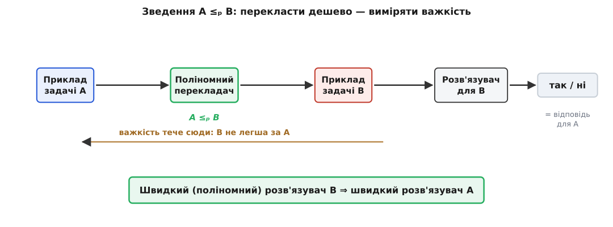
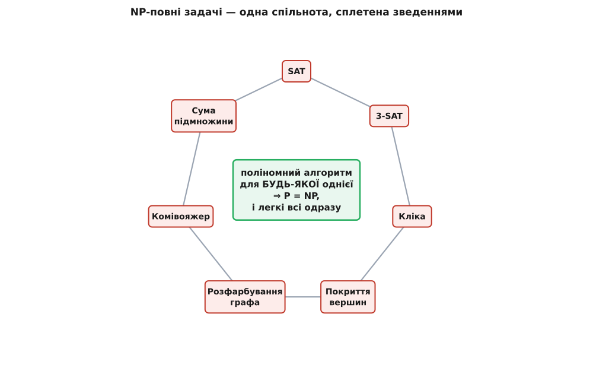
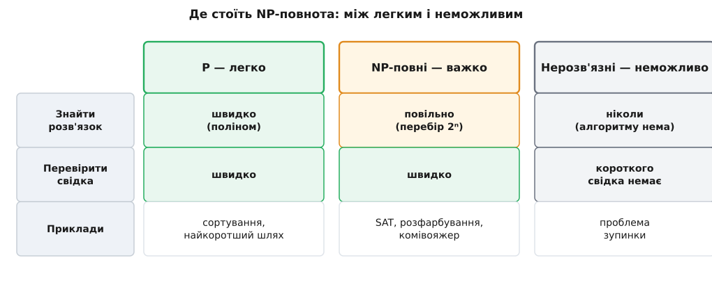

# Чому «перевірити» легше, ніж «знайти»

<preknowlist>
- [Асимптотична складність](book:algorithms/asymptotic-complexity) — нотація O(…); поліном (n, n², n³) проти експоненти (2ⁿ) і чому саме 2ⁿ — стіна.
- [Машина Тюринга](book:math/turing-machine) — абстрактна машина, що працює крок за кроком; робить поняття «кількість кроків» точним і незалежним від конкретного заліза.
</preknowlist>

Помножити 17 на 19 — робота на кілька секунд навіть у стовпчик: виходить 323. А тепер зворотне: вам дали 323 і просять назвати два множники. Доводиться пробувати — ділити на 2, на 3, на 5, на 7, на 11, на 13, на 17… аж поки пощастить. На трицифровому числі це ще терпимо. Але візьміть число з шестисот цифр — і його розклад на множники не подужає жодна машина на Землі за весь вік Всесвіту, хоча **перевірити** запропоновану відповідь (просто перемножити два множники) вона зробить миттєво. Ось на цій прірві між «перемножити» і «розкласти» стоїть уся сучасна криптографія.

Та сама прірва зяє скрізь. Готову судоку перевіряєш за хвилину, а порожню розв'язуєш вечір. У складений маршрут через сто міст можна вчитатися й пересвідчитися, що він коротший за тисячу кілометрів, — а знайти найкоротший навпомацки безнадійно. Дію **перевірити** відповідь раз по раз даровано легко саме там, де дію **знайти** її з нуля майже неможливо виконати.

І тут постає питання, від якого залежить ціла наука: **чи справді знайти принципово важче, ніж перевірити** — чи ми просто ще не додумалися до кмітливого способу шукати? Щоб на нього відповісти строго, спершу треба домовитися, що взагалі означає «легко» й «важко». Із цієї домовленості виростають два класи задач — **P** і **NP**, — а з питання про їхній зв'язок — одне з найглибших відкриттів інформатики: виявляється, тисячі на позір різних важких задач насправді **одна й та сама задача** в різних одежах. Це і є NP-повнота.

## P — задачі, які вміємо розв'язувати швидко

Щоб відділити «легко» від «важко», потрібна мірка часу, яка не залежить від того, який у вас процесор. Її дає [асимптотична складність](book:algorithms/asymptotic-complexity): дивимось не на секунди, а на те, **як росте** число кроків, коли задача більшає. Вхід розміру n алгоритм може обробляти за час, що росте як n, n², n³ — це **многочлен** (поліном) від n; а може — як 2ⁿ, і це вже **експонента**. Різниця між ними — не кількісна, а прірва.

```
розмір n:      10        50            100
поліном n³:    1 000     125 000       1 000 000        ← кероване
експонента 2ⁿ: 1 024     ≈1.1·10¹⁵     ≈1.3·10³⁰        ← стіна
```

На n = 10 обидва дрібні. Але кожна нова одиниця входу **множить** експоненту вдвічі, тимчасом як поліном лише трохи підростає. Тому проводять межу саме тут: задача вважається **легкою** (розв'язною за розумний час), якщо для неї є алгоритм із **поліномним** часом. Усі такі задачі складають клас **P** (від англ. *polynomial* — многочленний).

Чому межу кладуть саме по поліному, а не, скажімо, по n²? Бо поліном — на диво міцна межа. Алан Кобем і Джек Едмондс незалежно помітили це 1965 року, і відтоді це називають **тезою Кобема–Едмондса**: поліномність не змінюється, хоч би якою розумною машиною ви рахували — [ідеальна машина Тюринга](book:math/turing-machine) чи справжній процесор дають поліном той самий; поліноми **складаються** (поліном від полінома — знову поліном, тож алгоритм із поліномних частин лишається поліномним); і на практиці задачі з P справді зазвичай піддатливі, а ті, де вміємо лише експоненту, — ні. Це не означає, що n¹⁰⁰ — швидко: межа радше відділяє **де є надія** від **де стіна**, ніж «миттєве» від «повільного».

Задач у P безліч, і всі знайомі. Відсортувати мільйон чисел — за n·log n. Знайти [найкоротший шлях у графі](book:algorithms/dijkstra) — за поліном алгоритмом Дейкстри. Перемножити матриці, знайти найбільший спільний дільник, перевірити число на простоту (це аж 2002 року довели Аґравал, Каял і Саксена — індійські математики з IIT Kanpur — своїм алгоритмом «PRIMES is in P»). Для всіх них хтось колись знайшов структуру, що дає обхід сліпого перебору.

> 🔧 **Навіщо це.** Межа «поліном / експонента» — головний вододіл, за яким інженер вирішує долю задачі. Побачивши, що ваш метод експоненційний, ви знаєте: він зламається не «колись», а вже на десятках елементів входу, і докупити заліза не поможе — подвоєння входу з'їсть будь-який приріст швидкодії. Побачивши поліном — знаєте, що масштаб дає лише степеневу, а не катастрофічну ціну. Тому перше питання про будь-який алгоритм не «скільки мілісекунд», а «поліном це чи ні».

## NP — задачі, де легко перевірити відповідь

Тепер повернімося до прірви з початку. Розкласти число на множники ми **швидко не вміємо** — це не в P (наскільки відомо). Але є в цій задачі дивовижна риса: якщо хтось **дасть** нам відповідь — два множники, — перевірити її ми можемо за поліном: просто перемножити й порівняти. Готова відповідь тут — це короткий **свідок** (англ. *certificate* — посвідка), а перевірка свідка дешева, навіть коли пошук його дорогий.

Саме за цією рисою й окреслюють другий, ширший клас — **NP**: до нього належить задача, для якої існує **поліномний перевіряч** — процедура, що, діставши вхід і запропонований свідок, за поліномний час каже «так, цей свідок годиться» або «ні». Знайти свідка може бути як завгодно важко; вимагається лише, щоб **перевірка** була швидка.

Прикладів — легіон, і всі впізнавані. [Задача здійсненності (SAT)](book:math/boolean-satisfiability): чи є набір значень булевих змінних, за якого логічна формула істинна? Свідок — сам набір; перевірка — підставити й порахувати. [Розфарбування графа](book:math/graph-coloring): чи можна пофарбувати вершини трьома кольорами так, щоб сусіди різнилися? Свідок — саме фарбування; перевірка — пробігти ребра. Маршрут комівояжера, коротший за задану межу; підмножина чисел із заданою сумою; розклад без накладок — усюди та сама будова: **знайти важко, перевірити легко**.

Ось ця перевірка на прикладі — навмисно короткий, щоб було видно, наскільки вона дешева. Задача про суму підмножини: дано числа й ціль; чи є підмножина, що дає в сумі рівно ціль? Свідок — самі обрані числа, а перевіряч уміщається в кілька рядків:

```python
def verify(numbers, target, certificate):
    # certificate — обрана підмножина (список чисел зі списку numbers)
    # перевірка: (1) усе взяте справді є серед чисел; (2) сума збігається з ціллю
    pool = list(numbers)
    for x in certificate:
        if x not in pool:
            return False          # свідок посилається на число, якого нема
        pool.remove(x)            # кожне число можна взяти лише раз
    return sum(certificate) == target

# {3, 34, 4, 12, 5, 2}, ціль 9  →  свідок [4, 5]  дає 4 + 5 = 9  → True
```

Це один прохід по свідкові — поліном, і жодного натяку на перебір усіх 2ⁿ підмножин. Знайти ту підмножину серед експоненційно багатьох — інша річ, і от вона важка. Ця асиметрія — «перевірити один прохід, знайти цілий ліс варіантів» — і є суть NP.

Звідки химерна назва? **N** — це «недетермінований» (англ. *nondeterministic*), **P** — «поліномний». Уявімо казкову машину, яка на кожній розвилці не пробує варіанти по черзі, а щасливо **вгадує** правильний і далі лише перевіряє свій здогад за поліном. Така недетермінована [машина Тюринга](book:math/turing-machine) розв'язала б задачу з NP за поліном — бо їй досить угадати свідка й перевірити. Реальні машини вгадувати не вміють, тож для них лишається чесний пошук; але клас названо саме за тією уявною здогадливістю.

Одне очевидне, та важливе: **P ⊆ NP**. Якщо задачу вміємо швидко **розв'язати**, то вміємо й швидко **перевірити** будь-яку пропоновану відповідь — просто розв'яжемо самі й порівняємо, свідок навіть не потрібен. Отже, усе легке автоматично лежить і в NP. Цікаве питання — про зворотне.

## Велике питання: чи P = NP

Кожну задачу з NP можна **перевірити** швидко. А чи можна кожну з них швидко **розв'язати**? Тобто чи збігаються два класи — чи P = NP? Це і є знамените «**P проти NP**», і воно досі без відповіді. 2000 року Математичний інститут Клея вніс його до семи «задач тисячоліття» з премією в мільйон доларів за розв'язок; премія й досі незаймана.

Майже всі, хто над цим думає, певні, що **P ≠ NP** — що знайти таки принципово важче, ніж перевірити. Інтуїція проста: якби існував розумний обхід перебору для кожної задачі-головоломки, за півстоліття гарячих пошуків його б уже намацали бодай для однієї показової задачі. Але **довести** нерівність не вміє ніхто — і в цьому впертість питання. Ставка ж величезна: якби раптом виявилося, що P = NP і всі ці задачі насправді легкі, впала б чи не вся криптографія (той-таки розклад числа на множники став би швидким), а відшукання математичних доказів можна було б доручити машині. [Історію того, як це питання визріло по два боки залізної завіси](book:math/boolean-satisfiability/hist-cook-levin.md) — від загубленого листа Ґеделя через Кука в Торонто до Левіна, уродженця Дніпра, — варто прочитати окремо: це рідкісний випадок, коли одну істину незалежно відкрили двоє.

Але щоб узагалі говорити про «найважчі» задачі NP і про те, чому вони стоять чи падають разом, потрібен один інструмент — спосіб **порівнювати важкість** двох задач.

## Зведення — важкість однієї задачі мовою іншої

Як довести, що задача B **не легша** за задачу A, навіть не знаючи, скільки насправді коштує кожна? Хитрість — у **зведенні** (англ. *reduction*): показати, що вміючи розв'язувати B, ми задарма розв'язуємо й A.

Зведення A до B (пишуть **A ≤ₚ B**) — це поліномний перекладач: він будь-який приклад задачі A перетворює на приклад задачі B так, щоб відповідь «так/ні» збереглася. Тоді розв'язувач для B стає й розв'язувачем для A: переклали приклад A в приклад B, віддали розв'язувачу B, дістали відповідь — вона ж і є відповідь для A.


*Що означає «A зводиться до B». Приклад задачі A проганяють через поліномний перекладач — він видає рівносильний приклад B (відповідь «так/ні» та сама). Тепер будь-який розв'язувач для B автоматично розв'язує й A: досить перекласти й запитати. Звідси головний висновок — якщо переклад дешевий (поліномний), то B **не легша** за A: швидкий метод для B одразу дає швидкий метод для A. Стрілка важкості напрямлена проти стрілки перекладу.*

Ключове — саме напрям висновку. Дешевий переклад A ≤ₚ B означає, що **B принаймні така сама важка, як A**: якби B була легка (поліномна), то через переклад легкою стала б і A. Тому зведення — це терези: чіпляючи відому важку задачу до нової, ми зважуємо нову проти неї. І ще одна властивість робить зведення потужним: воно **транзитивне**. Якщо A ≤ₚ B і B ≤ₚ C, то A ≤ₚ C — два поліномні переклади поспіль дають знову поліномний. Важкість передається ланцюжком.

## NP-повнота — найважчі задачі в NP

Тепер з'єднаймо дві думки — клас NP і зведення — і дістанемо найкрасивіше поняття теми. Задачу L називають **NP-повною**, коли справджуються дві умови:

```
L — NP-повна   ⟺   (1) L належить NP  (її свідка можна перевірити за поліном)
                    І
                   (2) КОЖНА задача A з NP зводиться до L:  A ≤ₚ L
```

Друга умова — приголомшлива за силою. Вона каже, що L — **найзагальніша** задача класу: у ній, як у ключі до всіх дверей, захована кожна NP-задача одразу. Знайдіть поліномний розв'язувач для однієї-єдиної NP-повної L — і через зведення ви розв'яжете поліномно **геть усе** в NP, тобто доведете P = NP. І навпаки: якщо P ≠ NP, то жодна NP-повна задача поліномного розв'язку не має.

Здавалося б, звідки взагалі взятися задачі, до якої зводиться **все** NP, — умова здається надто сильною, щоб її бодай хтось задовольняв. І тут — головна несподіванка теорії: такі задачі **існують**. 1971 року Стівен Кук, а незалежно Леонід Левін, довели, що [задача здійсненності SAT](book:math/boolean-satisfiability) — NP-повна: будь-яку NP-задачу можна закодувати булевою формулою так, що формула здійсненна ⟺ задача має розв'язок. SAT стала **першою** NP-повною задачею — першим універсальним ключем.

А далі — те, що перетворило теорему на щоденний інструмент. Раз одна NP-повна задача є, інші знаходять уже **зведенням від неї**: щоб довести NP-повноту нової задачі, досить (а) показати, що вона в NP, і (б) звести до неї якусь уже відому NP-повну — за транзитивністю тоді до неї зводиться все NP. 1972 року Річард Карп зробив це для **двадцяти однієї** класичної задачі одним махом — розфарбування графів, кліка, покриття вершин, комівояжер, розбиття, сума підмножини. Раптом виявилося: десятки славетних головоломок із геть різних галузей — це насправді **одна задача** в різних масках. Сьогодні таких відомо тисячі.


*Чому NP-повні задачі — одне ціле. SAT, 3-SAT, кліка, покриття вершин, розфарбування графа, комівояжер, сума підмножини сполучені зведеннями в обидва боки: кожну можна за поліном перекласти в будь-яку іншу. Тому вони мають спільну долю — як кісточки доміно: варто одну повалити (знайти для неї поліномний алгоритм), і поліномними стають усі одразу, а з ними й увесь NP. Ніхто досі не повалив жодної — і майже всі певні, що не повалить.*

Ця взаємозводжуваність — не пуста метафора. Три задачі — **найбільша незалежна множина**, **найбільша кліка** й **найменше покриття вершин** — переходять одна в одну майже механічно: множина вершин незалежна в графі рівно тоді, коли вона кліка в **доповненні** графа, і рівно тоді, коли решта вершин утворюють покриття. [Ці зведення розписано з робочим кодом](book:algorithms/np-completeness/proj-verify-reduce.md) — видно, як кілька рядків перетворюють розв'язувач однієї задачі на розв'язувач трьох.

> ⚙️ **Поряд — робочий код:** [перевірка свідка, чесний перебір і взаємні зведення](book:algorithms/np-completeness/proj-verify-reduce.md) — компактні перевіряч і брутфорс для суми підмножини й незалежної множини (видно ту саму асиметрію «перевірити швидко / знайти повільно» наживо), а тоді взаємні зведення незалежної множини, кліки й покриття вершин: одна функція-перекладач — і розв'язувач однієї задачі розв'язує решту дві.

> 🧮 **Поряд — математика:** [класи P, NP, NP-повнота — формально](book:algorithms/np-completeness/math-classes.md) — строгі означення через рішеневі задачі й мови, дві рівносильні дефініції NP (перевіряч зі свідком і недетермінована машина), поліномне зведення ≤ₚ та його транзитивність, теорема Кука–Левіна, ієрархія P ⊆ NP ⊆ PSPACE ⊆ EXPTIME і чому NP ⊆ EXPTIME (тобто всі NP-задачі **розв'язні**, лише повільно).

## NP-важка й NP-повна — і що поруч

Два близькі терміни варто чітко розвести. Умова (2) сама по собі — «до задачі зводиться все NP» — задає **NP-важкість**: задача не легша за все в NP. **NP-повна** — це NP-важка **та ще й сама належить NP** (умова 1). Різниця тонка, але суттєва: NP-важка задача може бути й **важчою** за NP або взагалі не бути перевірною задачею з «так/ні». Скажімо, знайти **найкоротший** маршрут комівояжера (не «чи є коротший за межу», а сам найкращий) — NP-важка задача, та вона не в NP, бо готову відповідь непросто швидко засвідчити як найкращу. Так само [пошук найкращого розміщення блоків на кристалі](book:algorithms/np-hard-placement) — NP-важкий: він містить у собі відому NP-повну задачу, тож не може бути легшим.

Корисно й побачити сусідів NP-повноти — задачі, що **не** вписуються в неї, бо це окреслює її межі з обох боків.

З одного боку — задачі, що в NP, але їх, схоже, NP-повнота **обходить**. Той-таки [розклад числа на множники](book:algorithms/rsa), з якого ми почали: він у NP (свідок — множники), однак його вважають **не** NP-повним — бо він лежить водночас у NP і в co-NP, а це для NP-повної задачі майже неможливо (звідси випливав би обвал усієї теорії класів). Факторизацію відносять до ймовірних «проміжних» задач — важчих за P, але не найважчих у NP. І саме тому на ній безпечно будують [RSA](book:algorithms/rsa): якби вона була NP-повна, злом RSA ламав би заразом усе NP.

З іншого боку — задачі, важчі не кількісно, а **якісно**: не «повільно розв'язні», а **нерозв'язні взагалі**. Класика — [проблема зупинки](book:algorithms/halting-problem): чи спиниться задана програма на заданому вході? Доведено, що загального алгоритму, який відповість на це для **всіх** програм, не існує **в принципі** — жодного, ні за яку кількість часу. Це геть інша межа, ніж у NP-повноти. Варто тримати три щаблі окремо:


*Де серед меж обчислюваного стоїть NP-повнота. Ліворуч — клас P: є поліномний алгоритм, задачу і розв'язуємо, і перевіряємо швидко (сортування, найкоротший шлях). Посередині — NP-повні: свідка перевіряємо швидко, а знайти його вміємо лише перебором, тобто повільно (SAT, розфарбування, комівояжер) — і саме тут проходить фронт «P проти NP». Праворуч — нерозв'язні: алгоритму немає взагалі, скільки часу не дай (проблема зупинки). NP-повнота — це межа не обчислюваного, а **практично** обчислюваного.*

## Що робити, коли ваша задача NP-повна

Здавалося б, довести задачу NP-повною — вирок. Насправді це початок розумної роботи, а не кінець. Практик виносить звідси не розпач, а тверезість — і кілька робочих шляхів.

Перший урок — **не купуйте квитка, якого не існує**: «дай мені гарантовано найкраще й швидко» не продається, тож перестаньте цього вимагати. Замість оптимуму ставлять ціль-поріг і женуться за розв'язком, що її б'є. Далі — вибір знаряддя. **Евристики** на кшталт [імітації відпалу](book:algorithms/simulated-annealing) дають добрий, хоч і не гарантовано найкращий, результат за прийнятний час. **Наближені алгоритми** йдуть ще далі — гарантують результат не гірший за оптимум у стільки-то разів. Часто рятує **структура**: реальний вхід не випадковий, і якщо задача обмежена (граф майже дерево, параметр малий), стає піддатливою, хоч у загальному випадку NP-повна. Нарешті, є **розумний перебір**: сучасні розв'язувачі SAT буденно перемелюють формули на мільйони змінних за секунди, бо найгірший випадок — це вирок **найгіршому** входу, а не тому, що трапляється вам.

> 🔧 **Навіщо це.** Найдорожча користь від NP-повноти — знати, коли **перестати шукати ідеальний алгоритм**. Витративши тиждень на «швидкий точний» метод для NP-повної задачі, ви женетеся за тим, чого, найпевніше, не існує. Упізнавши NP-повноту (а впізнають її саме зведенням від відомої важкої задачі), ви одразу перемикаєтеся на правильні рейки: евристика, наближення, використання структури входу або готовий SAT-розв'язувач. Це різниця між місяцем змарнованих зусиль і робочим рішенням до вечора.

---

Отже, «перевірити» й «знайти» — різні за ціною дії, і ця різниця розкраює задачі на два класи. **P** — ті, що вміємо **розв'язувати** швидко (за поліномний час); **NP** — ті, чий готовий розв'язок вміємо швидко **перевірити**, навіть коли знайти його важко. Чи збігаються ці класи — славетне відкрите питання «P проти NP» ціною в мільйон доларів. Порівнювати важкість задач дає **зведення** A ≤ₚ B: дешевий переклад показує, що B не легша за A. Найважчі в NP — **NP-повні** задачі, до яких зводиться все NP; така задача — універсальний ключ, і всі вони сплетені в одну спільноту, що стоїть і падає разом. Першою (Кук і Левін, 1971) виявилася [здійсненність SAT](book:math/boolean-satisfiability), за нею Карп відкрив ще двадцять одну, а сьогодні їх тисячі — і всі, як з'ясувалося, одна задача в різних масках. NP-повнота — не край обчислюваного (за ним є ще нерозв'язне, як проблема зупинки), а край **практично** обчислюваного; і мудрість тут не в тому, щоб узяти цю стіну штурмом, а в тому, щоб, упізнавши її, обійти розумно.
