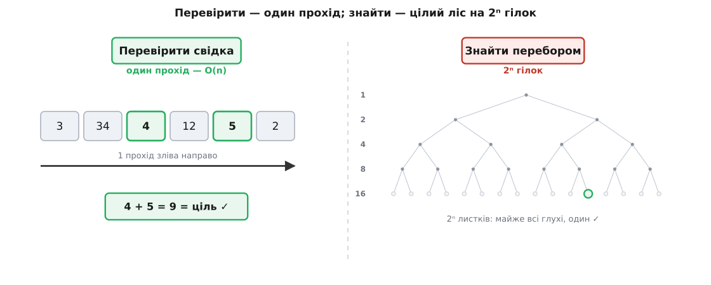
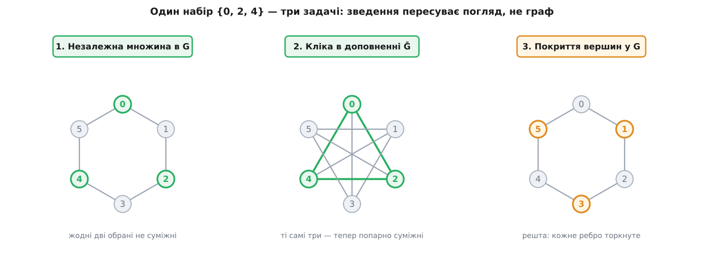

# ⚙️ Перевірити за прохід, знайти за ліс — і три задачі, що виявилися однією

Прірва між «перевірити» і «знайти» описана словами звучить майже як гра слів. Та вона не риторична — вона вимірна, і найпростіше в цьому переконатися, змусивши її **працювати** на екрані. Тож зберемо код. Спершу — дві пари програм, які ставлять ту прірву під секундомір: перевіряч, що ковтає готову відповідь за один прохід, і чесний перебір, що мусить перекопати цілий ліс варіантів, аби ту відповідь відшукати. Ми побачимо, як перевірка лишається дешевою хоч на якому вході, а перебір з кожним доданим елементом **подвоюється** — і за десяток кроків впирається в стіну. А тоді — найкрасивіше: три задачі, що на позір про різне (числа, незалежні вершини, покриття ребер), виявляться однією й тією самою, бо кілька рядків-перекладач перетворюють розв'язувач будь-якої з них на розв'язувач решти двох.

Уся арифметика тут — на реальних числах: наведені виміри й виводи дає саме цей код, а не приблизні оцінки.

## Асиметрія в коді: один прохід проти цілого лісу

### Сума підмножини — перевіряч на кілька рядків

Задача про **суму підмножини** (англ. *subset sum*) формулюється по-дитячому просто: дано список чисел і ціль; чи є серед чисел така підмножина, що дає в сумі рівно ціль? Свідок тут очевидний — самі обрані числа. І перевірити такий свідок можна за один-єдиний прохід:

```python
from collections import Counter

def verify_subset_sum(numbers, target, cert):
    """Свідок cert — обрана підмножина. True, якщо (1) усе взяте справді
    є серед numbers у потрібній кількості і (2) сума дорівнює цілі."""
    pool = Counter(numbers)          # скільки разів кожне число доступне
    for x in cert:
        if pool[x] <= 0:
            return False             # свідок бере число, якого вже (чи взагалі) нема
        pool[x] -= 1                 # витратили одну «копію»
    return sum(cert) == target
```

Придивімося, чому тут два окремі рядки перевірки, а не один. Спокуса написати просто `return sum(cert) == target` велика — і хибна. Тоді свідок `[9]` для набору `{3, 4, 5}` пройшов би: сума дев'ять, ціль дев'ять, «так». Але дев'ятки в наборі немає — свідок збрехав, підсунувши число зі стелі. Тому перевіряч мусить пересвідчитися, що **кожне** число свідка справді лежить серед даних, і то лежить у достатній кількості: якщо в наборі одна трійка, свідок `[3, 3]` брати двох трійок не має права. Саме для цього — `Counter`: він тримає рахунок копій, і друга трійка натрапить на вичерпаний запас.

**Перевіряч на прикладах.** Проженімо його на наборі `{3, 34, 4, 12, 5, 2}` й кількох свідках — правдивому, брехливому-за-сумою й брехливому-за-складом:

```python
nums = [3, 34, 4, 12, 5, 2]
print(verify_subset_sum(nums, 9,  [4, 5]))   # 4 + 5 = 9, обидва є        -> True
print(verify_subset_sum(nums, 6,  [3, 3]))   # трійка лиш одна            -> False
print(verify_subset_sum(nums, 12, [12]))     # ціль = саме 12             -> True
print(verify_subset_sum(nums, 0,  []))       # порожня сума — нуль        -> True
```

```
True
False
True
True
```

Скільки коштує ця перевірка? Один прохід по свідкові плюс одне підсумовування — це `O(n)`, лінійно від довжини входу, і жодного натяку на розгляд усіх підмножин. Хоч дай сюди шість чисел, хоч шістсот — перевірка так само промине список раз і скаже своє «так» чи «ні».

### Той самий приклад — чесний перебір

Тепер зворотний бік. Свідка нам ніхто не дав; його треба **знайти**. Найпряміший спосіб — перебрати всі підмножини й спитати кожну, чи не дає вона цілі. Підмножину зручно кодувати бітовою маскою: `n`-бітове число, де біт `i` каже, брати `i`-те число чи ні. Масок таких — рівно 2ⁿ, від порожньої до повної.

Той самий перебір однаково прямий і в мові-скрипті, і в системній мові; різниця лише в тому, як швидко машина домеле ті 2ⁿ масок:

:::tabs
```python
def find_subset_sum(numbers, target):
    n = len(numbers)
    for mask in range(1 << n):                 # усі 2ⁿ підмножин
        s = 0
        for i in range(n):
            if mask & (1 << i):
                s += numbers[i]
        if s == target:
            return [numbers[i] for i in range(n) if mask & (1 << i)]
    return None                                # жодна підмножина не підійшла
```
```cpp
#include <cstdint>
#include <optional>
#include <vector>

std::optional<std::vector<long long>>
find_subset_sum(const std::vector<long long>& a, long long target) {
    int n = (int)a.size();
    for (uint64_t mask = 0; mask < (uint64_t(1) << n); ++mask) {   // усі 2ⁿ підмножин
        long long s = 0;
        for (int i = 0; i < n; ++i)
            if (mask & (uint64_t(1) << i)) s += a[i];
        if (s == target) {
            std::vector<long long> pick;
            for (int i = 0; i < n; ++i)
                if (mask & (uint64_t(1) << i)) pick.push_back(a[i]);
            return pick;
        }
    }
    return std::nullopt;                        // жодна підмножина не підійшла
}
```
:::

На дрібному наборі перебір відповідає вмить:

```python
print(find_subset_sum([3, 34, 4, 12, 5, 2], 9))    # -> [4, 5]
print(find_subset_sum([3, 34, 4, 12, 5, 2], 11))   # -> [4, 5, 2]
```

Уся біда — не в тому, що перебір неправильний, а в тому, скільки він коштує, коли чисел більшає. Виміряймо це прямо. Щоб перебір змушений був **справді** обійти всі 2ⁿ масок (а не втекти на першій-ліпшій вдалій), візьмімо ціль недосяжну — на одиницю більшу за суму всіх чисел; тоді жодна маска не підійде, і кожну доведеться перевірити. А поряд щоразу заміряймо перевірку готового свідка:

```
 n     підмножин (2ⁿ)      перебір     перевірка    × до попереднього
18         262 144          0.24 с       ~4 мкс
19         524 288          0.50 с       ~4 мкс          ×2.1
20       1 048 576          1.46 с       ~4 мкс          ×2.9
21       2 097 152          3.38 с       ~4 мкс          ×2.3
22       4 194 304          7.45 с       ~4 мкс          ×2.2
23       8 388 608         14.94 с       ~4 мкс          ×2.0
24      16 777 216         35.20 с       ~4 мкс          ×2.4
```

Прочитаймо цю табличку повільно, бо в ній — уся суть. Ліва пара стовпців зростає рівно вдвічі за кожен доданий елемент: додав одне число — і кількість підмножин, а з нею й час перебору, **подвоїлися**. Правий стовпчик тим часом не ворухнувся: перевірка свідка як забирала мікросекунди, так і забирає, бо їй байдуже до 2ⁿ — вона дивиться лише на сам свідок. Ось вона, асиметрія, у голих числах: на n = 24 перебір молотить понад шістнадцять мільйонів варіантів більш ніж півхвилини, а перевірка одного з них — коротша за одне моргання, і такою лишиться хоч на n = 24, хоч на n = 240.

> 🔧 **Навіщо це.** Стовпчик «× до попереднього» — найважливіший інженерний висновок з усієї теми. Він каже: у методі, що перебирає підмножини, **кожен доданий елемент входу подвоює час**. Це не «стане повільно колись» — це стіна, до якої ти дійдеш на десятках елементів. Абсолютні секунди тут — з одного прогону на одній машині, і саме тому не в них річ: докупити вдесятеро швидший процесор — це відсунути стіну лише на три-чотири елементи (2³ ≈ 10), і все. [Різниця «поліном проти експоненти»](topic:algorithms/asymptotic-complexity) — не про «швидше-повільніше», а про те, чи метод узагалі доживе до реального розміру задачі.

І тут варто чесно випередити заперечення, яке неодмінно виникне в уважного читача. «Стривайте, — скаже він, — сума підмножини має ж швидкий розв'язок динамічним програмуванням, за час порядку `n · ціль`, без жодних 2ⁿ!» Правда. Але приглянься до `ціль`: якщо ціль — число з тридцяти десяткових цифр, то `n · ціль` — це `n`, помножене на величину близько 10³⁰, і жодним «швидким» це не назвеш. Річ у тім, що вхід задають **цифри** числа, і ціль завдовжки в `b` бітів має значення аж до 2ᵇ; тож `O(n · ціль)` — це `O(n · 2ᵇ)`, знову експонента, тільки від кількості бітів. Такий алгоритм звуть **псевдополіномним**: він поліномний від числового *значення*, але експоненційний від *розміру запису* — а розмір запису і є справжня мірка входу. [Динамічне програмування](topic:algorithms/dynamic-programming) рятує суму підмножини рівно доти, доки числа малі; на великих числах стіна повертається. І — головне — цей фокус зовсім не переноситься на графові задачі нижче: там немає жодного «значення», за яким можна було б сховати експоненту, і перебір лишається єдиним прямим шляхом.



*Чому «перевірити» й «знайти» такі різні за ціною. Ліворуч: готового свідка перевіряч промітає одним проходом — кожен елемент оглянуто раз, разом `O(n)`. Праворуч: пошук на кожному з `n` чисел мусить розгалузитися надвоє — взяти його чи ні, — і за `n` кроків дерево розростається до 2ⁿ листків, з яких потрібен щонайбільше один. Перевірка йде **вздовж** відповіді; пошук блукає **впоперек** усього простору відповідей.*

### Найбільша незалежна множина — та сама асиметрія на графі

Щоб побачити, що асиметрія не про числа зокрема, а про будову задачі взагалі, перенесімо її на [граф](topic:math/graph-theory) — набір вершин, сполучених ребрами. **Незалежна множина** (англ. *independent set*) — це набір вершин, серед яких **жодні дві не з'єднані ребром**: такі собі вершини-одинаки, що взаємно не сусідять. Питають зазвичай про найбільшу: скільки вершин щонайбільше можна обрати, щоб між ними не було жодного ребра?

Свідок — сам набір вершин. Перевірити його знову дешево: пройтися по **всіх ребрах** і впевнитися, що жодне ребро не з'єднує двох обраних, та що набір досить великий:

```python
def verify_independent(n, edges, cert, k):
    """True, якщо cert — незалежна множина розміру щонайменше k."""
    S = set(cert)
    if len(S) != len(cert) or any(v < 0 or v >= n for v in S):
        return False                      # дублікати чи неіснуючі вершини
    if len(S) < k:
        return False                      # замала
    for (u, v) in edges:
        if u in S and v in S:
            return False                  # обидва кінці ребра обрано — не незалежна
    return True
```

Це один прохід по ребрах, `O(ребер)` — знову лінійно від входу, знову без тіні перебору. А пошук найбільшої незалежної множини йде тим самим приреченим шляхом, що й сума підмножини: перебрати всі 2ⁿ підмножин вершин, для кожної перевірити незалежність, запам'ятати найбільшу вдалу:

```python
def max_independent(n, edges):
    adj = [set() for _ in range(n)]
    for (u, v) in edges:
        adj[u].add(v); adj[v].add(u)
    best = []
    for mask in range(1 << n):                       # усі 2ⁿ підмножин вершин
        S = [i for i in range(n) if mask & (1 << i)]
        ok = all(v not in adj[u] for a, u in enumerate(S) for v in S[a + 1:])
        if ok and len(S) > len(best):
            best = S
    return best
```

Виміри — той самий портрет, лише крива експоненти трохи крутіша, бо перевірка незалежності всередині кожної маски й сама коштує:

```
 n    вершин    підмножин      перебір     перевірка свідка
14      14        16 384         0.05 с        ~5 мкс
16      16        65 536         0.18 с        ~5 мкс
18      18       262 144         0.81 с        ~5 мкс
20      20     1 048 576         3.26 с        ~5 мкс
22      22     4 194 304        12.49 с        ~5 мкс
```

Кожні дві додані вершини множать час перебору десь учетверо (тобто вдвічі за одну) — 0.05 → 0.18 → 0.81 → 3.26 → 12.49, — а перевірка знову стоїть на місці, мікросекунди й мікросекунди. Дві геть різні на вигляд задачі — числа й граф — дали **той самий** графік: пласка лінія перевірки й експонента пошуку. Це і є та спільна будова, за яку клас NP названо NP: свідок перевіряється за прохід, а знаходиться перебором.

## Зведення: один розв'язувач — три задачі

Тепер — до другого, ще дивовижнішого. Ми маємо розв'язувач однієї задачі — `max_independent`, важкий і повільний, як усі вони. Виявляється, цей самий розв'язувач, майже без доробок, розв'язує ще дві славетні задачі про графи. Не тому, що ми хитро його переписали, а тому, що ці три задачі — **одна й та сама**, лише вбрана по-різному. Місток між ними — **зведення** (англ. *reduction*): дешевий переклад прикладу однієї задачі на приклад іншої.

Познайоммося з двома сусідами незалежної множини.

**Кліка** (фр. *clique* — тісний, зімкнутий гурток) — протилежність незалежної множини: набір вершин, у якому **кожні дві** з'єднані ребром. Не одинаки, а суцільні знайомі — всі попарно.

**Покриття вершин** (англ. *vertex cover*) — набір вершин, що **торкається кожного ребра**: у будь-якого ребра хоч один кінець лежить у наборі. Питають про найменше таке покриття — найощадніший «дозор», що встереже всі ребра.

### Дві тотожності, на яких усе тримається

Уся магія — у двох простих спостереженнях. Візьмімо граф `G` і його **доповнення** `Ḡ` (англ. *complement*) — той самий набір вершин, але ребра **навпаки**: у `Ḡ` дві вершини з'єднані рівно тоді, коли в `G` вони **не** з'єднані.

**Тотожність перша: незалежна множина в `G` — це кліка в `Ḡ`.** Чому? Набір `S` незалежний у `G` означає, що серед його вершин **немає жодного ребра** `G`. Але «немає ребра `G`» — це те саме, що «є ребро `Ḡ`». Отже, у `Ḡ` кожні дві вершини з `S` з'єднані — а це в точності означає, що `S` — кліка `Ḡ`. Той самий набір, той самий погляд — лише граф перевернули.

**Тотожність друга: якщо `S` незалежна в `G`, то решта вершин `V ∖ S` — покриття.** Чому? `S` незалежна означає, що жодне ребро не має **обох** кінців у `S`. Отже, у кожного ребра хоч один кінець — **поза** `S`, тобто у `V ∖ S`. А це і є означення покриття: кожне ребро торкнуте. Причому найбільшій незалежній множині відповідає найменше покриття — бо що більше вершин ми відклали в `S`, то менше лишилось у `V ∖ S`.



*Три задачі — один набір. Ліворуч: у графі-шестикутнику `G` вершини {0, 2, 4} — незалежна множина (жодне ребро їх не сполучає). Посередині: у доповненні `Ḡ` ті самі {0, 2, 4} стали трикутником — кожні дві тепер сполучені, тобто кліка. Праворуч: решта вершин {1, 3, 5} — покриття `G`, бо кожне з шести ребер торкається котроїсь із них. Зведення не будує нового графа з нуля — воно лише **пересуває погляд** на ту саму картину.*

### Код-перекладач

Ці дві тотожності — уже готовий перекладач, і він кумедно короткий. Доповнення графа будується одним проходом по всіх парах вершин, а «решта вершин» — це просто різниця множин:

```python
def complement(n, edges):
    """Ребра доповнення: усі пари, яких у вихідному графі НЕ було."""
    E = set((min(u, v), max(u, v)) for (u, v) in edges)
    return [(i, j) for i in range(n) for j in range(i + 1, n) if (i, j) not in E]
```

Скільки коштує цей переклад? Доповнення обходить усі `n·(n−1)/2` пар вершин — це `O(n²)`, а «решта вершин» — узагалі `O(n)`. Обидва **поліномні**, і то дешеві. Ось у цьому вся сила зведення: місток між задачами коштує копійки проти самого переходу через нього. Тепер зберімо з одного розв'язувача — трьох:

```python
def solve_all(n, edges):
    S_is  = max_independent(n, edges)                    # 1. найбільша незалежна множина G
    S_cl  = max_independent(n, complement(n, edges))     # 2. найбільша кліка G = незалежна множина Ḡ
    S_vc  = [v for v in range(n) if v not in set(S_is)]  # 3. найменше покриття G = V ∖ (незалежна множина)
    return S_is, S_cl, S_vc
```

Уся друга й третя задачі — це два рядки навколо того самого `max_independent`. Найбільшу **кліку** графа `G` ми знаходимо, згодувавши розв'язувачеві незалежної множини **доповнення** `G`: кліка в `G` — це незалежна множина в `Ḡ`, точнісінько за першою тотожністю, тільки в інший бік. А найменше **покриття** — це просто ті вершини, що **не** ввійшли в найбільшу незалежну множину. Один важкий розв'язувач плюс два поліномні рядки — і три класичні задачі розв'язані заразом.

### Один розв'язувач розв'язує три — наживо

Візьмімо конкретний граф — шестикутник із фігури вище, вершини 0…5, ребра по колу (0-1, 1-2, 2-3, 3-4, 4-5, 5-0) — і проженімо `solve_all`. Поряд, для чесності, порівняймо кожну відповідь із **прямим** розв'язувачем відповідної задачі (кліку шукаємо власним перебором клік, покриття — власним перебором покриттів), щоб пересвідчитися: зведення не збрехало.

**Три відповіді з одного розв'язувача.**

```
max IS (прямо)              : [0, 2, 4]
доповнення, ребра           : [(0,2),(0,3),(0,4),(1,3),(1,4),(1,5),(2,4),(2,5),(3,5)]
max кліка = IS(доповнення)  : [0, 1]      (звірка з прямим розв'язувачем клік: [0, 1])
min покриття = V ∖ maxIS    : [1, 3, 5]   (звірка з прямим розв'язувачем покриттів: [0, 2, 4])
```

Найбільша незалежна множина шестикутника — `{0, 2, 4}`, три вершини через одну. Найбільша кліка виходить куценька — `{0, 1}`, лише пара: шестикутник трикутників не має, тож більшої за ребро кліки в ньому не буває, і розв'язувач це чесно показав, знайшовши найбільшу незалежну множину доповнення розміру два. Найменше покриття — `{1, 3, 5}`, доповнення до `{0, 2, 4}`. Прямі розв'язувачі підтвердили розміри: покриттів найменших тут навіть два — `{1,3,5}` і `{0,2,4}`, обидва по три вершини, — і те, що зведення знайшло одне, а прямий перебір інше, не суперечність, а просто дві однаково добрі відповіді.

Придивімося до однієї тонкості, бо в ній — серце зведення. Той самий набір `{0, 2, 4}`, який `solve_all` знайшов як незалежну множину `G`, є заразом **клікою в доповненні**, і його доповнення `{1, 3, 5}` — покриттям. Перевірмо це прямо, тими самими перевірячами:

```
той самий {0,2,4} — кліка в доповненні Ḡ  : True
V ∖ {0,2,4} = {1,3,5} — покриває G         : True
```

Одна знахідка — три відповіді. І щоб це не здавалося щасливим збігом на одному графі, я прогнав звірку на двох тисячах випадкових графів різної щільності: щоразу розмір кліки зі зведення збігався з розміром, що дає прямий перебір клік, розмір покриття — з прямим перебором покриттів, а сам знайдений набір щоразу проходив відповідний перевіряч. **Дві тисячі графів — жодної розбіжності.** Тотожності не приблизні й не «майже завжди» — вони точні.

### Складність кожного кроку — і де підстерігають пастки

Складімо ціну по кроках, бо саме розкладка цін пояснює, чому зведення таке потужне. Сам розв'язувач `max_independent` — **експоненційний**, `O(2ⁿ · n²)`: перебір усіх підмножин помножити на перевірку кожної. А обидва зведення — **поліномні**: доповнення `O(n²)`, різниця множин `O(n)`. Виходить різкий перепад: місток дешевий, перехід дорогий. Ось чому висновок про важкість тече **проти** напряму перекладу. Якщо існував би швидкий (поліномний) розв'язувач кліки, ми через поліномне зведення дістали б швидкий розв'язувач незалежної множини — а отже, і покриття. Дешевий переклад робить три задачі **однаково важкими**: полегшити одну — значить полегшити всі три разом.

І кілька пасток, на яких спотикаються, коли пишуть зведення вперше.

- **Зведення мусить зберігати відповідь — і в правильний бік.** Уся справа в тому, що переклад тримає рівносильність «так ⟺ так». Легко переплутати напрям і шукати кліку в самому `G` замість доповнення: тоді для шестикутника ти дістав би кліку розміру 2 і подумав, що це відповідь про незалежну множину, — а вона розміру 3. Незалежна множина `G` — це кліка `Ḡ`, не кліка `G`; переплутати граф із його доповненням означає відповісти на іншу задачу.

- **Доповнення — без петель.** Будуючи `Ḡ`, легко ненароком «з'єднати» вершину саму з собою (пара `(i, i)`), бо в `G` такого ребра не було. Петлі тут ні до чого — тому в коді пари беруться строго `i < j`. Забудеш цю дрібницю — і трикутник-кліка обросте фальшивими самопетлями, а перевіряч кліки почне вимагати неможливого.

- **Найбільша незалежна — і тільки найбільша — дає найменше покриття.** Тотожність `V ∖ S` перетворює на покриття **будь-яку** незалежну множину, але найменшим воно виходить лише для **найбільшої** `S`. Візьмеш незалежну множину абияк — дістанеш якесь покриття, тільки не найощадніше. Оптимум відповідає оптимуму, не будь-що будь-чому.

- **Кілька однакових оптимумів — це норма, не помилка.** Шестикутник має дві найбільші незалежні множини (`{0,2,4}` і `{1,3,5}`) і два найменші покриття. Зведення й прямий перебір можуть повернути різні з них — обидва правильні. Плутати «інша відповідь» із «неправильна відповідь» не варто: важить розмір, а не те, яку саме з рівних знахідок вихопив перебір.

- **Зведення поліномне — та задача лишається важкою.** Найпідступніше непорозуміння: «раз я звів кліку до незалежної множини за поліном, кліка стала легкою». Ні. Зведення дешеве, але воно веде до **того самого** дорогого розв'язувача; воно перекладає важкість, а не знищує її. Легкою кліка стала б лише тоді, коли б `max_independent` раптом виявився поліномним, — а це і є питання [P проти NP](topic:math/boolean-satisfiability), яке ніхто не розв'язав. Зведення каже «ці троє стоять і падають разом», а не «вони впали».

## Що з усього цього виносимо

Дві прості речі, показані кодом, а не на віру. Перша: **перевірити** відповідь і **знайти** її — дії різної ціни, і різниця не кількісна, а прірва. Перевіряч суми підмножини й незалежної множини промітає свідка одним проходом за `O(n)` — і ця ціна стоїть незворушно, хоч би як ріс вхід; перебір же на кожному доданому елементі **подвоюється**, і за пару десятків елементів упирається в стіну з мільйонів і мільярдів варіантів. Саме цю асиметрію — дешева перевірка при дорогому пошуку — і схоплює клас NP.

Друга: важкі задачі не самотні. Незалежна множина, кліка й покриття вершин — це **одна** задача під трьома масками, і знімає маску кілька рядків-перекладач: доповнення графа обертає незалежну множину на кліку, а різниця множин — на покриття, обидва переклади поліномні й майже безкоштовні. Тому розв'язувач однієї з трьох, обгорнутий двома дешевими рядками, розв'язує всі три; і тому полегшити одну — значить полегшити всі. Помнож цю картину на тисячі відомих NP-повних задач, сплетених такими самими містками, — і стане видно, чому поліномний алгоритм бодай для однієї з них повалив би заразом усі. Прірва «перевірити / знайти» тут не метафора: її можна запустити, виміряти секундоміром і перейти містком-зведенням з одного її берега на інший.
