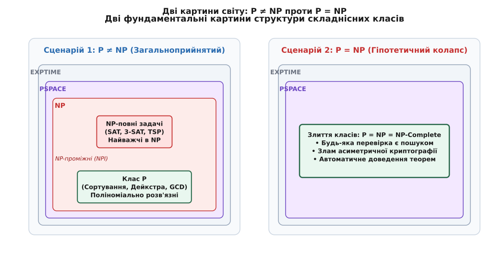
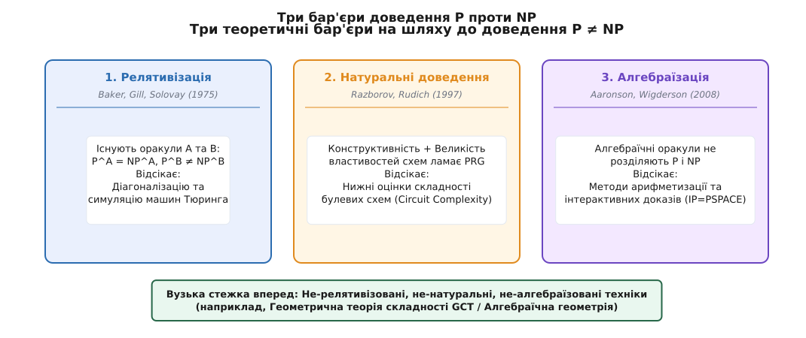
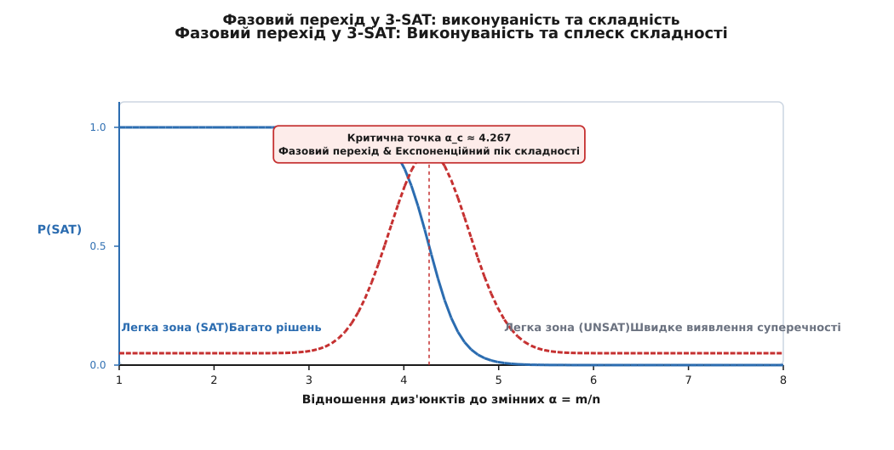

# P проти NP: Головна загадка обчислюваності

<preknowlist>
- [Класи P і NP та NP-повнота](topic:algorithms/np-completeness) — визначення P, NP, перевіряча та NP-повноти.
- [Асимптотична складність](topic:algorithms/asymptotic-complexity) — поліноміальне зростання (легке) проти експоненційного (нездоланна стіна).
- [Машина Тюринга](topic:math/turing-machine) — детерміновані й недетерміновані машини Тюринга, стрічки та стани.
</preknowlist>

Захист кожного банківського переказу в мережі Інтернет тримається на фундаментальній асиметрії: помножити два 1024-бітні прості числа — це частка мікросекунди на будь-якому смартфоні, а зворотна дія (знайти ці два числа за їхнім добутком у 600 цифр) вимагатиме мільярди років роботи всіх суперкомп'ютерів Землі разом узятих. Проте чи існує доказова математична гарантія, що швидкого алгоритму розкладання на множники або розв'язання тисяч NP-повних задач не існує в природі? Чи ми просто ще не здогадалися до кмітливого способу шукати?

Питання P проти NP (`P ≟ NP`) формалізує цю прірву: чи є кожна задача, запропоновану відповідь до якої можна швидко **перевірити** (за поліноміальний час), такою задачею, яку можна швидко **розв'язати** з нуля? З моменту створення теорії складності обчислень це питання перетворилося на найвідомішу відкриту проблему теоретичної інформатики та чистої математики, за розв'язання якої Математичний інститут Клея призначив нагороду в \$1,000,000.

---

## 1. Дві картини Всесвіту: Суть гіпотези P проти NP

Щоб збагнути масштаб проблеми, слід розглянути дві принципово різні картини обчислювального світу, які постають залежно від відповіді на питання `P ≟ NP`.


*Дві можливі картини структури складнісних класів: сувора ієрархія при P ≠ NP проти гіпотетичного колапсу при P = NP.*

### Сценарій 1: P ≠ NP (Загальноприйнятий Всесвіт)

Понад 95% фахівців із теорії складності вірять, що `P ≠ NP`. У цьому світі існують проблеми, відповідь до яких перевіряється легко, але пошук цієї відповіді принципово вимагає експоненційного часу або надполіноміальних ресурсів.

Основні аргументи на користь `P ≠ NP`:

1. **Інтуїція пасивного споглядання проти творчості:** Оцінити написану симфонію чи перевірити рядок за рядком математичне доведення теореми — це механічна робота, доступна людині або програмі помірної складності. Створити симфонію чи знайти доказ з нуля вимагає пошуку в гігантському просторі варіантів. Якби `P = NP`, то заучування й перевірка були б інструментально тотожними створенню.
2. **Існування односторонніх функцій та криптографії:** Увесь сучасний цифровий захист (RSA, криптографія на еліптичних кривих ECC, протокол Diffie–Hellman, цифрові підписи) вимагає існування односторонніх функцій (відносин, які легко обчислити в один бік і практично неможливо обернути). Якщо `P = NP`, односторонніх функцій не існує в природі.
3. **Пів століття безуспішних спроб:** Тисячі найвидатніших математиків та інженерів планети протягом 50 років намагалися знайти поліноміальний алгоритм бодай для однієї з тисяч NP-повних задач (3-SAT, задача комівояжера, розфарбування графів, кліка, пакування контейнерів). Усі вони зіштовхнулися з тією самою експоненційною стіною.

### Сценарій 2: P = NP (Гіпотетичний колапс)

Якщо виявиться, що `P = NP`, це означатиме існування поліноміального алгоритму для найважчої в NP задачи — SAT. За теоремою Кука–Левіна, це автоматично дасть поліноміальні алгоритми для **всіх** задач із класу NP.

Наслідки рівності `P = NP` для людської цивілізації були б грандіозними та шокуючими:

- **Миттєвий крах криптографії:** Асиметричне шифрування, банківські ключі, блоктейни, цифрові підписи та зашифровані канали зв'язку стануть прозорими. Будь-який зашифрований текст або приватний ключ можна буде відновити за поліноміальний час, оскільки перевірка правильності ключа виконується миттєво.
- **Автоматизація математики та науки:** Доведення будь-якої математичної теореми, яка має доказ помірної довжини `n` символів (наприклад, у рамках формальної системи ZFC), можна буде знайти за поліноміальний час від `n`. Математики перетворяться з шукачів доказів на операторів постановки задач для програм-доказувачів.
- **Ідеальна оптимізація та лікування хвороб:** Проблеми згортання білків (protein folding), проектування ліків під індивідуальний геном, логістика транспортних мереж, розподіл енергосистем та синтез мікропроцесорів розв'язуватимуться за секунди.

> 🔧 **Навіщо це.** Рівність `P = NP` — це математичний еквівалент винайдення філософського каменя в обчисленнях. На практиці, проте, має значення не лише факт поліноміальності, але й **показник степеня** та **константа**. Алгоритм складності `O(n¹⁰⁰)` або `O(10¹⁰⁰ · n)` є математично поліноміальним і довів би `P = NP`, але для практичного застосування на `n = 100` він залишався б так само непридатним, як і експонента.

### Складність у середньому випадку та П'ять світів Імпальяццо

Доведення `P ≠ NP` описує складність у **найгіршому випадку** (worst-case complexity). Проте для практичної криптографії та оптимізації важлива складність у **середньому випадку** (average-case complexity). 1995 року Рассел Імпальяццо (Russell Impagliazzo) описав п'ять можливих математичних світів залежно від того, як розподілена складність задач із NP:

1. **Algorithmica:** `P = NP` (або NP-найважчі задачі легко розв'язуються в середньому). Криптографія неможлива, оптимізація тривіальна.
2. **Heuristica:** `P ≠ NP` у найгіршому випадку, але задачі з NP легко розв'язуються в середньому для будь-яких практичних розподілів входу. Справжньої криптографії немає, хоча формально `P ≠ NP`.
3. **Pessimland:** NP-найважчі задачі важкі в середньому, але не існує **односторонніх функцій з лазейкою** (trapdoor one-way functions). Створення односторонніх функцій важке, асиметрична криптографія неможлива.
4. **Minicrypt:** Односторонні функції існують, тому можлива симетрична криптографія (AES, хеш-функції), але асиметрична криптографія (RSA, Diffie-Hellman) неможлива.
5. **Cryptomania:** Існують односторонні функції з лазейкою. Можлива як симетрична, так і асиметрична криптографія, а також безпечний обмін ключами. Ми сподіваємося, що живемо саме в Cryptomania.

Дослідження Андрейса Богданова та Луки Тревізана довели, що зведення складності найгіршого випадку до середнього випадку для найважчих NP-повних задач неможливе за допомогою безнатуральних та релятивізованих методів, що пояснює концептуальну прірву між найгіршим та середнім випадками. Ця теоретична асиметрія означає, що гарантія важкості в одному екстремальному прикладі не автоматизує створення стійких криптосистем без додаткових алгебраїчних структур.

---

## 2. Класи складності P, NP, coNP та їхня внутрішня анатомія

Щоб проводити межу строго, інформатика оперує формальними визначеннями задач прийняття рішень (decision problems), де відповіддю є один біт — «Так» або «Ні».

### Клас P: Ефективно розв'язні задачі

Класом **P** (Polynomial-time) називається множина мов (задач), для яких існує детермінована машина Тюринга, що розпізнає вхідний рядок `x` довжини `n = |x|` за час `O(n^k)` для деякої константи `k`.

Міцність класу P базується на **тезі Кобема–Едмондса** (Alan Cobham, Jack Edmonds, 1965):
- Поліноміальний час є інваріантним щодо обчислювальних моделей. Перехід від однострічкової машини Тюринга до багатострічкової, машини з довільним доступом до пам'яті (RAM) або реального процесора збільшує час виконання щонайбільше на поліноміальний множник (наприклад, з `O(n²)` до `O(n⁴)` або `O(n³)`). Це гарантує абстрагування теорії від деталей апаратного забезпечення.
- Клас P замкнений відносно композиції (поліном від полінома залишається поліномом). Якщо програма викликає поліноміальну кількість підпрограм, кожна з яких працює поліноміальний час, загальний час алгоритму залишається поліноміальним.

Прикладами задач із класу P є сортування чисел (`O(n log n)`), пошук найкоротшого шляху алгоритмом Дейкстри (`O(m + n log n)`), обчислення найбільшого спільного дільника алгоритмом Евкліда, перевірка графа на зв'язність та перевірка чисел на простоту (алгоритм AKS, 2002).

### Клас NP: Задачі з швидкою перевіркою свідків

Класом **NP** (Nondeterministic Polynomial-time) називається множина мов `L`, для яких існує детермінований поліноміальний перевіряч `V(x, w)` та константа `c` такі, що:
- Якщо `x ∈ L`, то існує свідок (сертифікат) `w` довжини `|w| ≤ |x|^c` такий, що `V(x, w) = True`.
- Якщо `x ∉ L`, то для будь-якого свідка `w` перевіряч видає `V(x, w) = False`.

Еквівалентне дефініційне значення NP спирається на **недетерміновану машину Тюринга** (NTM): це уявна машина, яка на кожному кроці обчислення може розгалужуватися на кілька можливих станів. Мова належить до NP, якщо недетермінована машина Тюринга розпізнає її за поліноміальний час (тобто існує гілка обчислювального дерева поліноміальної глибини, яка завершується у стані прийняття).

### Клас coNP та гіпотеза NP ≟ coNP

Поряд із класом NP існує дуальний клас **coNP** — клас задач, для яких існує короткий поліноміальний свідок для **негативної** відповіді (або, еквівалентно, додаткові мови належать до NP).

Прикладом задачи з coNP є **TAUTOLOGY** (чи є дана булева формула тотожно істинною при всіх значеннях змінних?). Для спростування тотожності достатньо одного свідка — набору змінних, що робить формулу хибною.

Питання про співвідношення класів `NP ≟ coNP` є ще однією великою загадкою складності. Якщо `P = NP`, то автоматично `NP = coNP = P`. Більшість науковців припускають, що `NP ≠ coNP`, і це означає, що спростувати істинність формули простіше, ніж довести її тотожність при всіх можливих значеннях.

### Поліноміальна ієрархія (PH) та теорема Тоди

Узагальненням класів NP та coNP за допомогою чередування кванторів `∃` (існує) та `∀` (для всіх) є **Поліноміальна ієрархія** (Polynomial Hierarchy, PH):

- `Σ₀ᴾ = Π₀ᴾ = P`
- `Σ₁ᴾ = NP`, `Π₁ᴾ = coNP`
- `Σ₂ᴾ = NPˢᴬᵀ` (NP з оракулом SAT), `Π₂ᴾ = coNPˢᴬᵀ`
- `Σ_{k+1}ᴾ = NP^(Σ_kᴾ)`, `Π_{k+1}ᴾ = coNP^(Σ_kᴾ)`

Співвідношення між Поліноміальною ієрархією та іншими класами визначається видатною **теоремою Тоди** (Seinosuke Toda, 1989):

```
Теорема Тоди (1989):
Уся поліноміальна ієрархія міститься всередині P з оракулом до задачи підрахунку #P:
PH ⊆ P^(#P)
```

Це показує, що точний підрахунок кількості задовольняючих наборів (`#SAT`) є фундаментально потужнішим за будь-яке скінченне чередування кванторів вибору.

### Неоднорідні схеми та теорема Карпа–Ліптона

Іншим кутом зору на клас P є **неоднорідні логічні схеми** (non-uniform circuit complexity). Клас **P/poly** визначається як множина мов, що розпізнаються сімейством логічних схем поліноміального розміру `S(n) ≤ n^k`, де для кожного розміру входу `n` дозволяється своя схема (підказка довжини `poly(n)`).

Співвідношення між NP та P/poly визначається класичною теоремою Річарда Карпа та Річарда Ліптона:

```
Теорема Карпа–Ліптона (Karp–Lipton Theorem, 1980):
Якщо NP ⊆ P/poly (тобто всі NP-повні задачі можна розв'язати схемами поліноміального розміру),
то поліноміальна ієрархія обвалюється на другий рівень: PH = Σ₂ᴾ.
```

Доведення Карпа–Ліптона спирається на те, що якщо SAT має поліноміальні схеми, то універсальний квантор `∀` у `Π₂ᴾ`-формулі `∀y ∃z R(x,y,z)` можна замінити на вгадування відповідної схеми `∃C`, перетворюючи `Π₂ᴾ` на `Σ₂ᴾ` і призводячи до колапсу всієї ієрархії. Оскільки більшість фахівців вірять, що поліноміальна ієрархія PH є нескінченною, теорема Карпа–Ліптона вважається потужним доказом того, що `NP ⊄ P/poly`.

### Теорема Ладнера та NP-проміжні задачі (NPI)

Річард Ладнер 1975 року довів фундаментальну теорему про внутрішню структуру класу NP:

```
Теорема Ладнера (1975):
Якщо P ≠ NP, то в класі NP \ P існують задачі, які НЕ Є NP-повними.
Множина таких задач називається NPI (NP-Intermediate).
```

Доведення Ладнера використовує техніку **затриманої симуляції** (*delayed simulation*) та метод штучного падування (*padding*). Будується штучна мова `L_NPI`, у якій чергуються величезні блоки входу задачи 3-SAT із блоками порожніх рядків. Розмір порожніх блоків підбирається так, щоб затримати симуляцію детермінованих машин і не дати мові стати NP-повною, але при цьому зберегти її складність вищою за будь-який поліном із P.

Це означає, що між легкими поліноміальними задачами (P) та найважчими задачами (NP-Complete) існує цілий спектр проблем середньої складності. Довгі роки головними кандидатами на статус NPI вважалися:
1. **Розклад чисел на множники (Integer Factorization):** Знайти два прості числа за їхнім добутком. Задача належить до `NP ∩ coNP`, тому не вважається NP-повною.
2. **Дискретне логарифмування (Discrete Logarithm):** Обчислити показник степеня у скінченному полі.
3. **Ізоморфізм графів (Graph Isomorphism):** Чи є два графи однаковими з точністю до перейменування вершин. 2015 року Ласло Бабаї звів цю задачу до квазіполіноміального часу `2^{O(log^c n)}`.

### Часова проти просторової складності (Time vs Space)

Варто порівняти ситуацію з часовою складністю із класичними результатами для **просторової складності** (пам'яті). Тут теорія має набагато сильніші теореми:

- **Теорема Севіча (Savitch's Theorem, 1970):** Детермінована й недетермінована пам'ять відрізняються щонайбільше квадратично:
  ```
  NSPACE(f(n)) ⊆ DSPACE(f(n)²)
  ```
  Зокрема, `NPSPACE = PSPACE`. Це показує, що для пам'яті недетермінізм **не дає** експоненційного прискорення!
- **Теорема Іммермана–Селепченій (Immerman–Szelepcsényi, 1987):** Класи просторової складності замкнені відносно доповнення: `NSPACE(f(n)) = coNSPACE(f(n))`.

Ці фундаментальні результати підкреслюють, чому саме **часова** складність `P ≟ NP` є набагато важчою: недетермінізм у часі створює дерево з `2ⁿ` гілок, яке не можна просто згорнути за допомогою повторного використання пам'яті.

```
┌─────────────────────────────────────────────────────────────┐
│                           EXPTIME                           │
│  ┌───────────────────────────────────────────────────────┐  │
│  │                        PSPACE                         │  │
│  │  ┌─────────────────────────────────────────────────┐  │  │
│  │  │                       NP                        │  │  │
│  │  │  ┌──────────────┐  ┌──────────────┐  ┌───────┐  │  │  │
│  │  │  │ NP-Complete  │  │     NPI      │  │ coNP  │  │  │  │
│  │  │  │ (3-SAT, TSP) │  │(Факторизація)│  │       │  │  │  │
│  │  │  └──────────────┘  └──────────────┘  └───────┘  │  │  │
│  │  │  ┌───────────────────────────────────────────┐  │  │  │
│  │  │  │                    P                      │  │  │  │
│  │  │  │ (Сортування, Дейкстра, GCD, PRIMES)       │  │  │  │
│  │  │  └───────────────────────────────────────────┘  │  │  │
│  │  └─────────────────────────────────────────────────┘  │  │
│  └───────────────────────────────────────────────────────┘  │
└─────────────────────────────────────────────────────────────┘
```

---

## 3. Історичний контекст та формування проблеми

Концепція P проти NP не виникла на порожньому місці — вона стала результатом еволюції логіки та обчислювальної техніки протягом XX століття.

[Історія проблеми P проти NP](topic:algorithms/p-vs-np/hist-p-vs-np.md) бере свій початок із передвісницького листа Курта Ґеделя до Джона фон Неймана 1956 року. Ґедель запитав, чи можна механічно перевіряти докази теорем за час `O(n)` або `O(n²)`.

Формальний фундамент теорії було закладено у 1971–1973 роках завдяки незалежним працям Стівена Кука та Леоніда Левіна (теорема Кука–Левіна), які відкрили феномен **NP-повноти** та довели універсальність задачи SAT. 1972 року Річард Карп опублікував знаменитий список із 21 комбінаторної задачи, довівши, що NP-повнота — це не поодинокий виняток, а масове явище, що об'єднує ключові проблеми комбінаторики, теорії графів та оптимізації.

```
1956: Лист Ґеделя ──► 1971: С. Кук (SAT) ──► 1972: Р. Карп (21 задача) ──► 2000: Clay Institute
 (Інтуїція)            (Теорема Cook-Levin)   (NP-повнота — масова)      ($1,000,000 премія)
```

2000 року Математичний інститут Клея включив проблему P проти NP до числа семи Задач тисячоліття (Millennium Prize Problems), закріпивши її статус як одного з найвеличніших викликів людського розуму.

---

## 4. Чому проблему досі не розв'язали: Три стіни складності

Головна причина, чому проблема P проти NP залишається невирішеною понад пів століття, полягає у тому, що математики зіштовхнулися з трьома строгими **бар'єрами доведення**. Ці бар'єри (мета-теореми) доводять, що цілі класи стандартних математичних методів принципово не здатні розділити P і NP.


*Три математичні бар'єри (релятивізація, натуральність, алгебраїзація) та відсічені ними методи доведення.*

[Бар'єри доведення P проти NP](topic:algorithms/p-vs-np/math-proof-barriers.md) піддаються строгій математичній формалізації та піддають критичному аналізу наявний арсенал дослідника.

### Бар'єр 1: Релятивізація (Baker, Gill, Solovay, 1975)

Першим фундаментальним ударом по класичних методах стала теорема Т. Бейкера, Дж. Ґілла та Р. Соловея (BGS). Більшість методів теорії автомата та теорії обчислюваності (зокрема діагоналізація Кантора–Тюринга та симуляція машин) є **релятивізованими**: вони залишаються чинними, якщо машинам Тюринга надати доступ до довільного оракула `A` (чорної скриньки, яка відповідає на запити про належність до множини `A` за 1 крок).

Теорема BGS доводить існування двох таких оракулів `A` та `B`:

```
Існує оракул A такий, що  Pᴬ = NPᴬ     (наприклад, A = TQBF / PSPACE)
Існує оракул B такий, що  PⲞ ≠ NPⲞ     (побудований методом діагоналізації)
```

**Наслідок:** Жоден метод доведення, що релятивізується (тобто не залежить від внутрішньої будови обчислювальної моделі й працює однаково з оракулами), не зможе відповісти на питання `P ≟ NP`. Це відсікло майже всі техніки, створені до 1975 року.

### Бар'єр 2: Натуральні доведення (Razborov, Rudich, 1997)

У 1980-х роках дослідники спробували обійти релятивізацію за допомогою складності булевих схем (*circuit complexity*). Ідея полягала у тому, щоб довести, що NP-повні функції вимагають надполіноміальної кількості логічних вентилів (AND, OR, NOT). Перші обмежені успіхи (нижні оцінки Разборова для монотонних схем та Смоленського для `AC⁰[p]`) показували можливість виявлення математичних властивостей складності функцій.

Проте 1997 року Олександр Разборов та Стівен Рудіч довели теорему про **Натуральні доведення** (*Natural Proofs*). Властивість булевих функцій `C_n` називається *натуральною*, якщо вона задовольняє дві умови:
1. **Конструктивність:** Властивість можна легко перевірити за час `2^{O(n)}` від розміру таблиці істинності.
2. **Великість:** Властивість притаманна більшості булевих функцій (частка `≥ 1/poly(n)`).

Разборов і Рудіч довели: якщо існують криптографічно стійкі псевдовипадкові генератори (що є необхідною умовою існування криптографії та випливає з `P ≠ NP`), то **жодна натуральна властивість не здатна довести надполіноміальні нижні оцінки для загальних булевих схем**. Спроба довести `P ≠ NP` натуральним шляхом спростовує саме припущення про існування `P ≠ NP`!

### Бар'єр 3: Алгебраїзація (Aaronson, Wigderson, 2008)

У 1990-х роках виникли не-релятивізовані техніки, такі як арифметизація (представлення формул поліномами над скінченними полями), що дозволили довести `IP = PSPACE`. Проте 2008 року Скотт Ааронсон та Аві Вігдерсон довели бар'єр **алгебраїзації**: навіть розширення оракулів до низькостепеневих поліномів над полями не дозволяє розділити P і NP.

```
┌─────────────────────────┬──────────────────────────┬──────────────────────────────────────┐
│ Бар'єр                  │ Авторство та рік         │ Що саме відсікає                     │
├─────────────────────────┼──────────────────────────┼──────────────────────────────────────┤
│ 1. Релятивізація        │ Baker, Gill, Solovay     │ Діагоналізацію та симуляцію машин    │
│                         │ (1975)                   │ Тюринга                              │
├─────────────────────────┼──────────────────────────┼──────────────────────────────────────┤
│ 2. Натуральні доведення │ Razborov, Rudich         │ Нижні оцінки складності булевих схем │
│                         │ (1997)                   │ (Circuit Complexity)                 │
├─────────────────────────┼──────────────────────────┼──────────────────────────────────────┤
│ 3. Алгебраїзація        │ Aaronson, Wigderson      │ Арифметизацію, інтерактивні докази   │
│                         │ (2008)                   │ (IP=PSPACE, PCP)                     │
└─────────────────────────┴──────────────────────────┴──────────────────────────────────────┘
```

Будь-яке майбутнє розв'язання проблеми P проти NP мусить бути **не-релятивізованим**, **не-натуральним** та **не-алгебраїзованим**.

### Питання про незалежність від формальних систем (ZFC)

Після відкриття трьох бар'єрів виникли сумніви щодо того, чи можна взагалі розв'язати проблему P проти NP у рамках стандартної математичної аксіоматики Цермело–Френкеля з аксіомою вибору (ZFC).

1976 року Юріс Хартманіс та Річард Гопкрофт довели існування таких штучних обчислювальних моделей, для яких твердження `P = NP` є **незалежним** (тобто його не можна ані довести, ані спростувати в рамках певної формальної системи). Наразі більшість математиків вважають, що проблема P проти NP має конкретну відповідь у ZFC (і цією відповіддю є `P ≠ NP`), проте для її доведення потрібні фундаментально нові концептуальні ідеї.

---

## 5. Практика на межі: SAT-соловери та фазовий перехід

Хоча теорія шукає не-натуральні методи доведення, інженерна практика зіштовхується з межею складності у реальних обчисленнях.

Сучасні алгоритми розв'язання SAT — зокрема **DPLL** (Davis–Putnam–Logemann–Loveland) та його нащадок **CDCL** (Conflict-Driven Clause Learning) — здатні обробляти формули з мільйонами змінних у формальній верифікації мікропроцесорів.


*Падіння ймовірності виконуваності та експоненційний сплеск часу виконання DPLL у критичній точці α ≈ 4.267.*

У вставці [Практичне дослідження межі складності у SAT-соловерах](topic:algorithms/p-vs-np/proj-sat-solver.md) наведено готову реалізацію DPLL-соловера мовами C та C++.

Головне практичне відкриття полягає у явищі **фазового переходу** (phase transition). Якщо розглядати випадкові формули 3-SAT і змінювати відношення кількості диз'юнктів до кількості змінних `α = m / n`:

- При `α < 4.0` (мало обмежень) формула майже завжди виконувана (SAT), і розв'язок знаходиться миттєво.
- При `α > 4.5` (надто багато обмежень) формула майже завжди невиконувана (UNSAT), і суперечність виявляється швидко через unit propagation.
- На критичній межі `α_c ≈ 4.267` відбувається фазовий перехід: ймовірність виконуваності різко падає з 1.0 до 0.0, а час виконання алгоритму **вибухає експоненційно**.

Саме на цій критичній межі інженер наочно бачить ціну `P ≠ NP`: найрозумніші евристики відсікання гілок безпорадні проти комбінаторного вибуху.

---

## 6. Сучасні тонкі ієрархії, тонка складність та квантова перспектива

Неможливість швидкого розв'язання P проти NP змусила науковців розробити більш точні інструменти вимірювання складності.

### Гіпотеза експоненційного часу (ETH та SETH) та тонка складність

Оскільки `P ≠ NP` лише стверджує, що 3-SAT не має поліноміального алгоритму, виникло питання: а наскільки саме важкою є ця задача?

- **ETH (Exponential Time Hypothesis):** Стверджує, що для розв'язання 3-SAT не існує алгоритму зі складністю `2^{o(n)}`. Тобто складові 3-SAT принципово вимагають часу `2^{c · n}` для деякої константи `c > 0`.
- **SETH (Strong ETH):** Стверджує, що при збільшенні довжини диз'юнктів `k` у k-SAT константа `c` прямує до 1. Тобто k-SAT вимагає часу `2^{(1 - ε)n}`, де `ε → 0` при `k → ∞`.

На гіпотезах ETH/SETH базується так звана **тонка складність** (Fine-grained complexity). Вона дозволяє доводити точні нижні оцінки навіть для задач із класу P:
- **Задача 3-SUM:** Дано `n` цілих чисел; чи є 3 числа із сумою 0? Гіпотеза 3-SUM стверджує, що ця задача вимагає часу `Ω(n²)`. Узагальнення до k-SUM вимагає часу `Ω(n^{\lceil k/2 \rceil})`.
- **Найкоротший шлях між усіма парами (APSP):** Гіпотеза APSP стверджує, що обчислення найкоротших шляхів між усіма парами у графі з `n` вершинами вимагає часу `Ω(n³)`.
- **Відстань редагування (Edit Distance):** Гіпотеза SETH доводить, що обчислення Левенштейнівської відстані між двома рядками довжини `n` вимагає `Ω(n^{2-ε})`, тобто класичний динамічний алгоритм `O(n²)` є практично оптимумом.
- **Незмінні точні оцінки для комбінаторних задач:** Гіпотеза SETH дає тісні нижні оцінки складності `O(2^{(1-ε)n})` для задач про покриття вершин, незалежну множину та розфарбування графів.

### Квантові обчислення та клас BQP

Популярна омана полягає у тому, що квантові комп'ютери нібито зможуть легко розв'язати будь-яку NP-повну задачу за допомогою квантової паралельності. Це не так.

Клас задач, які ефективно розв'язуються квантовим комп'ютером за поліноміальний час, називається **BQP** (Bounded-Error Quantum Polynomial-Time).

- Алгоритм Шора розкладає числа на множники за поліноміальний час `O(n³)`. Проте розклад на множники **не є NP-повним** (він належить до класу `NP ∩ coNP`). Шор використовує алгебраїчну структуру періодичності точкових груп, якої немає у загальних NP-повних задачах.
- Для загальних NP-повних задач (таких як 3-SAT) найкращий універсальний квантовий алгоритм — це **алгоритм Ґровера**, який дає лише **квадратне прискорення**: від `O(2ⁿ)` до `O(2^{n/2}) = O(1.414ⁿ)`. Це поліпшує константу в основі степеня, але залишає складність **експоненційною**.
- 2019 року Ран Раз та Авішай Тал довели існування оракула `A`, для якого `BQP^A ⊄ PH^A`. Це підтверджує, що квантові обчислення та недетермінований пошук є принципово різними вимірами складності. Більшість спеціалістів вважають, що `NP ⊄ BQP` (квантові комп'ютери не здатні розв'язувати NP-повні задачі за поліноміальний час).

---

## 7. Інженерна стратегія: Що робити, коли задача поза P

Коли розробник зіштовхується із задачею, яка є NP-повною або не належить до класу P, стандартний пошук точного алгоритму припиняють. Використовують одну з п'яти інженерних стратегій:

1. **Наближені алгоритми (Approximation Algorithms):** Для багатьох задач можна знайти розв'язок за поліноміальний час із гарантованою точністю (наприклад, 1.5-наближений алгоритм Крістофідеса для метричної задачи комівояжера, або алгоритм Ґоеманса–Вільямсона із точністю 0.878 для Max-Cut за допомогою семідефінітного програмування SDP). Теорема PCP стверджує, що для деяких задач (наприклад, 3-SAT) наближення краще за 7/8 є NP-важким (межа Гостада).
2. **Параметеризована складність (FPT — Fixed-Parameter Tractability):** Якщо експонента залежить не від загального розміру входу `n`, а від малого параметра `k` (наприклад, складність `O(2^k · n)`), задача легко розв'язується при малих `k` (наприклад, пошук покриття вершин малого розміру `k`). Техніки ядерізації (*kernelization*) дозволяють за поліноміальний час стиснути вхідні дані до ядра розміру `f(k)`.
3. **Рандомізовані та евристичні алгоритми:** Алгоритми генетичного пошуку, імітація відпалу (Simulated Annealing), табу-пошук та локальний пошук не дають 100% гарантії оптимальності, але знаходять якісні розв'язки за секунди.
4. **Промислові SAT/SMT-соловери:** Переведення формули у формат CNF та використання Z3, CVC5 чи MiniSat. Сучасні соловери чудово обробляють структуровані промислові дані, уникаючи фазового переходу випадкових формул.
5. **Спрощення постановки задачи:** Часто обмеження реального світу (наприклад, планарність графа або обмежена ширина дерева) переводять задачу з класу NP назад у клас P.

Проблема P проти NP залишається найбільшим маяком теоретичної інформатики. Вона показує точну межу між тим, що обчислювальна техніка може виконати за розумний час, і тим, що назавжди залишиться за межами можливостей будь-яких реальних і квантових комп'ютерів.
