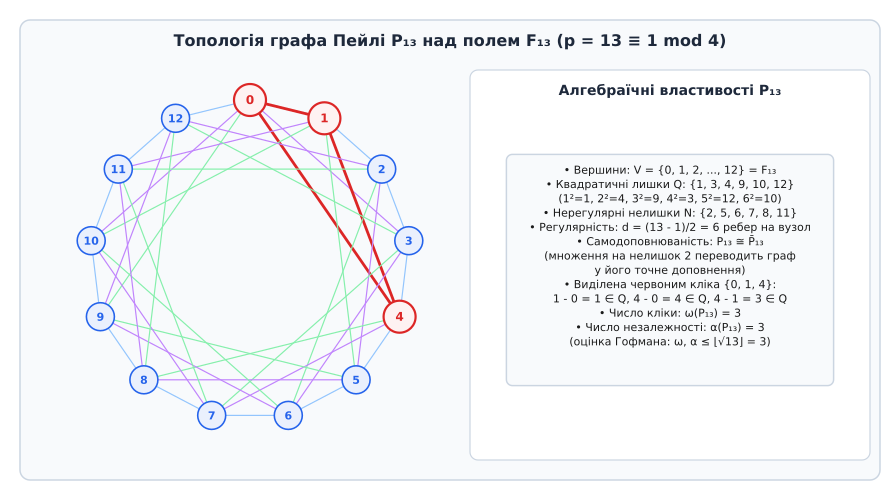
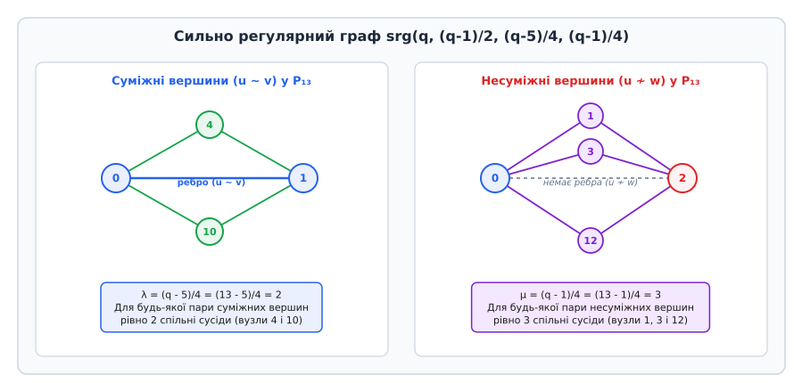
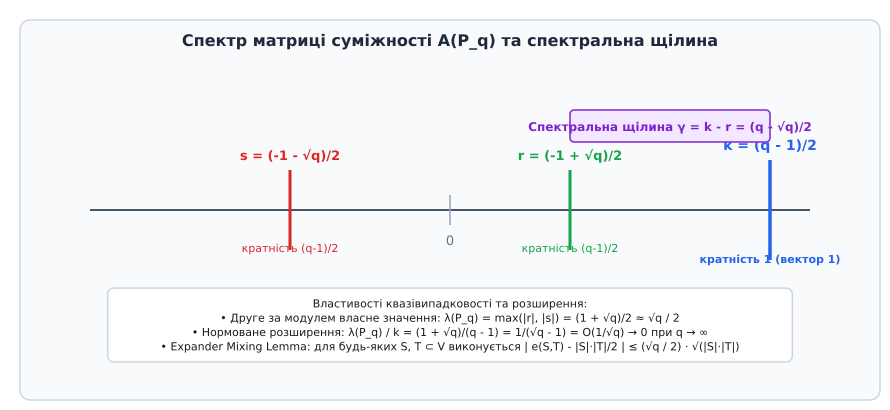
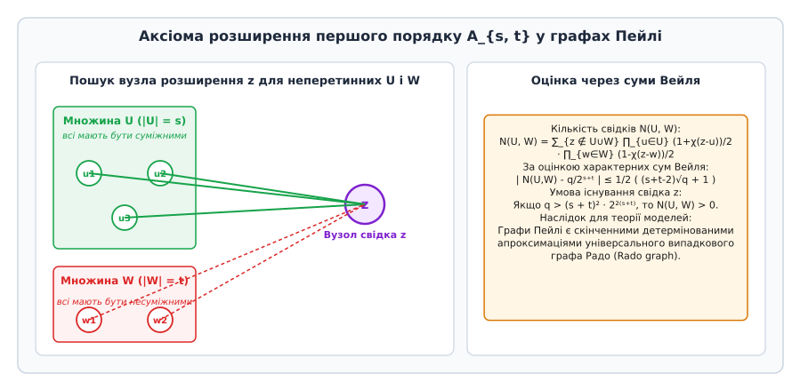

# Графи Пейлі

<preknowlist>
* [Скінченні поля](topic:algorithms/finite-field-arithmetic)
* [Квадратичні лишки](topic:math/quadratic-residues)
* [Матриця суміжності](topic:algorithms/adjacency-matrix)
* [Теорема Рамсея](topic:algorithms/ramseys-theorem)
* [Графи-розширювачі](topic:algorithms/expander-graphs)
</preknowlist>

Ймовірнісний метод Пала Ердеша дозволяє за кілька рядків довести, що випадковий граф із високою ймовірністю володіє визначними комбінаторними властивостями: він не містить великих клік, має малий діаметр та рівномірно перемішує ребра. Проте цей метод має фундаментальну ваду: він не дає жодного детермінованого алгоритму побудови конкретного екземпляра такого графа за поліноміальний час. Якщо алгоритму потрібен детермінований об'єкт для дерандомізації або криптографічного перетворення, випадковий вибір вимагає нескінченного джерела істинно випадкових бітів та дорогої перевірки властивостей, яка часто є `NP`-важкою.

Графи Пейлі, побудовані на алгебраїчній структурі скінченних полів через квадратичні лишки, надають елегантний міст між теоретико-числовими симетріями та детермінованою псевдовипадковістю. Вони слугують основним полігоном для дослідження нижніх оцінок чисел Рамсея, побудови сильно регулярних графів, тестування меж алгоритмів розпізнавання ізоморфізму та створення детермінованих експандерів.

Історичний шлях від матриць нормованих розв'язків Реймонда Пейлі до відкриття їхньої графової природи Саксом та Ердешем детально описано у вставці [📜 Історія відкриття: від матриць Реймонда Пейлі до дерандомізації Ердеша](topic:algorithms/paley-graphs/hist-paley-hadamard.md).

## Алгебраїчна конструкція та умова симетрії

Нехай `F_q` — скінченне поле Галуа порядку `q = p^m`, де `p` — просте число, а `q ≡ 1 (mod 4)`. Позначимо через `Q` множину всіх ненульових квадратичних залишків у полі `F_q`:

```
Q = { x^2 : x ∈ F_q, x ≠ 0 }
```

Оскільки мультиплікативна група поля `F_q*` є циклічною групою порядку `q - 1`, рівно половина її елементів є квадратами. Таким чином, потужність множини залишків становить `|Q| = (q - 1)/2`.

Граф Пейлі `P_q` визначається як неорієнтований граф, множиною вершин якого є саме поле `F_q` (`V = F_q`). Дві різні вершини `u, v ∈ F_q` з'єднані ребром тоді й лише тоді, коли їхня різниця є квадратичним лишком у полі `F_q`:

```
(u, v) ∈ E  ⟺  (u - v) ∈ Q
```

Умова неорієнтованості графа вимагає симетрії реберного відношення: наявність ребра від `u` до `v` повинна гарантувати наявність ребра від `v` до `u`. Оскільки `v - u = -(u - v)`, це означає, що елемент `(u - v)` належить `Q` тоді й лише тоді, коли `-(u - v) = -1 · (u - v)` належить `Q`.

За мультиплікативною властивістю символу квадратичного характеру `χ(a · b) = χ(a) · χ(b)` отримуємо:

```
χ(v - u) = χ(-1) · χ(u - v)
```

Отже, умова `χ(v - u) = χ(u - v)` виконується для всіх пар вершин тоді й лише тоді, коли `χ(-1) = 1`, тобто `-1` є квадратичним лишком у полі `F_q`. За першим критерієм Ейлера:

```
χ(-1) = (-1)^((q - 1)/2)
```

Значення `(-1)^((q - 1)/2) = 1` досягається тоді й лише тоді, коли степінь `(q - 1)/2` є парним числом. Це рівносильно конгруенції:

```
q ≡ 1 (mod 4)
```

Якщо ж порядок поля задовольняє `q ≡ 3 (mod 4)`, то `χ(-1) = -1`. У цьому випадку для будь-якої пари вершин або `(u - v) ∈ Q`, або `(v - u) ∈ Q`, але ніколи обидва одночасно. Така конструкція породжує орієнтований турнір Пейлі, матриця суміжності якого є кососиметричною.


*Структура графа Пейлі P₁₃ над полем F₁₃: вершини розташовані по колу, а ребра сполучають пари з різницями, що є квадратичними лишками {1, 3, 4, 9, 10, 12}.*

Розглянемо структуру графа `P₁₃` над простим полем `F₁₃` (`p = 13 ≡ 1 mod 4`). Квадратами ненульових елементів є:
- `1² = 1`, `2² = 4`, `3² = 9`
- `4² = 16 ≡ 3 (mod 13)`
- `5² = 25 ≡ 12 (mod 13)`
- `6² = 36 ≡ 10 (mod 13)`

Множина залишків `Q = {1, 3, 4, 9, 10, 12}`. Кожна вершина `u` має степінь `k = 6` і з'єднана з вузлами `u + 1`, `u + 3`, `u + 4`, `u + 9`, `u + 10`, `u + 12` за модулем 13.

## Сильно регулярна геометрія та параметри srg

Графи Пейлі належать до виняткового класу сильно регулярних графів (Strongly Regular Graphs, SRG). Граф `G = (V, E)` на `v` вершинах називається сильно регулярним із параметрами `srg(v, k, λ, μ)`, якщо:
1. Кожна вершина має однаковий степінь `k` (`k`-регулярність).
2. Будь-які дві суміжні вершини мають рівно `λ` спільних сусідів.
3. Будь-які дві несуміжні вершини мають рівно `μ` спільних сусідів.

Для графа Пейлі `P_q` параметри сильно регулярності мають фіксований алгебраїчний вигляд:

```
v = q
k = (q - 1) / 2
λ = (q - 5) / 4
μ = (q - 1) / 4
```


*Конфігурація сусідів у сильно регулярному графі Пейлі: для будь-якої суміжної пари кількість спільних сусідів фіксована і дорівнює λ, для несуміжної — μ.*

Обчислимо кількість спільних сусідів для двох довільних вершин `u` та `v`. Вершина `z` є спільним сусідом `u` та `v` тоді й лише тоді, коли обидві різниці `(z - u)` та `(z - v)` є квадратичними лишками. Здійснивши зсув змінної `x = z - u` та позначивши `d = v - u`, шукана кількість спільних сусідів `N(u, v)` виражається кількістю таких елементів `x ∈ F_q \ {0, d}`, що `x ∈ Q` та `(x - d) ∈ Q`.

Використовуючи квадратичний характер Лежандра `χ(a)`, який дорівнює `+1` для квадратів, `-1` для неквадратів та `0` для нуля, характеристична функція належності множині `Q` записується як `(1 + χ(a))/2` для `a ≠ 0`. Тоді кількість спільних сусідів набуває вигляду:

```
N(u, v) = (1/4) · ∑_{x ∉ {0, d}} (1 + χ(x)) · (1 + χ(x - d))
```

Розкриваючи дужки, розбиваємо вираз на чотири суми:

```
N(u, v) = (1/4) · ∑_{x ∉ {0, d}} 1
        + (1/4) · ∑_{x ∉ {0, d}} χ(x)
        + (1/4) · ∑_{x ∉ {0, d}} χ(x - d)
        + (1/4) · ∑_{x ∉ {0, d}} χ(x · (x - d))
```

Оцінимо кожен доданок:
1. Перша сума містить `q - 2` доданків, отже її внесок дорівнює `(q - 2)/4`.
2. Сума характерів `∑_{x ∈ F_q} χ(x) = 0`. Вилучення точок `x = 0` та `x = d` дає: `∑_{x ∉ {0, d}} χ(x) = -χ(d)`.
3. Аналогічно для другої лінійної суми: `∑_{x ∉ {0, d}} χ(x - d) = -χ(-d) = -χ(d)` (оскільки `χ(-1) = 1`).
4. Остання сума є сумою Якобсталя `J(d) = ∑_{x ∉ {0, d}} χ(x(x - d))`. Підстановкою `x = d · y` вона зводиться до `χ(d²) · ∑_{y ∉ {0, 1}} χ(y(y - 1)) = ∑_{y ∉ {0, 1}} χ(1 - y⁻¹) = -1`.

Підставляючи отримані значення, маємо точний алгебраїчний вираз:

```
N(u, v) = (q - 2 - 2 · χ(d) - 1) / 4
        = (q - 3 - 2 · χ(d)) / 4
```

Звідси негайно випливають два фундаментальні випадки:
- Якщо `u` та `v` суміжні, то `d = v - u ∈ Q`, отже `χ(d) = 1`. Кількість спільних сусідів дорівнює `λ = (q - 3 - 2)/4 = (q - 5)/4`.
- Якщо `u` та `v` несуміжні, то `d ∉ Q`, отже `χ(d) = -1`. Кількість спільних сусідів дорівнює `μ = (q - 3 + 2)/4 = (q - 1)/4`.

Цей результат підтверджує, що локальна геометрія графа Пейлі є абсолютно однорідною: відстань між вершинами повністю визначає кількість їхніх спільних зв'язків.

Детальні математичні виведення через квадратичні суми Гаусса та спектральні проектори наведено у вставці [🧮 Спектральний аналіз графів Пейлі та характерні суми](topic:algorithms/paley-graphs/math-paley-spectrum.md).

## Спектральний аналіз та експандери

Спектр матриці суміжності `A(P_q)` графа є ключовим інструментом для оцінки його псевдовипадкових та комунікаційних властивостей. Оскільки граф Пейлі є сильно регулярним, його матриця суміжності задовольняє фундаментальне матричне рівняння:

```
A^2 = k · I + λ · A + μ · (J - I - A)
```

де `I` — одинична матриця, а `J` — матриця з усіх одиниць розміру `q × q`.

Оскільки граф є `k`-регулярним, вектор з усіх одиниць `j = (1, 1, ..., 1)^T` є власним вектором матриці `A` з власним значенням `k = (q - 1)/2`. Будь-який інший власний вектор `v` є ортогональним до `j` (`J · v = 0`), тому на підпросторі `j^⟂` матричне рівняння зводиться до квадратного алгебраїчного рівняння над власними значеннями `θ`:

```
θ^2 - (λ - μ) · θ - (k - μ) = 0
```

Підставляючи значення параметрів `λ = (q - 5)/4`, `μ = (q - 1)/4` та `k = (q - 1)/2`, отримуємо:
```
λ - μ = (q - 5 - q + 1) / 4 = -1
k - μ = (2q - 2 - q + 1) / 4 = (q - 1) / 4
```

Квадратне рівняння набуває канонічного вигляду:
```
θ^2 + θ - (q - 1)/4 = 0
```

Його коренями є два нетривіальні власні значення матриці суміжності:

```
r = (-1 + √q) / 2
s = (-1 - √q) / 2
```

Обидва власні значення мають кратність `(q - 1)/2`.


*Спектральний розрив матриці суміжності графа Пейлі: власне значення степеня k=(q-1)/2 та два вироджені рівні r та s, модуль яких обмежений O(√q).*

Максимальне за модулем нетривіальне власне значення становить:

```
λ_max = max(|r|, |s|) = (1 + √q) / 2
```

Спектральний розрив графа Пейлі дорівнює:

```
gap = k - λ_max = (q - 1)/2 - (1 + √q)/2 = (q - √q - 2) / 2 = O(q)
```

За лемою про перемішування для експандерів (Expander Mixing Lemma), для будь-яких двох підмножин вершин `S, T ⊆ V` кількість ребер `e(S, T)` між ними задовольняє нерівність:

```
| e(S, T) - (k / q) · |S| · |T| | ≤ λ_max · √(|S| · |T|)
```

Підставляючи параметри графа Пейлі, маємо:

```
| e(S, T) - (1/2) · |S| · |T| | ≤ ((1 + √q) / 2) · √(|S| · |T|)
```

Це означає, що розподіл ребер між будь-якими множинами вершин у графі Пейлі наближається до випадкового графа Ердеша — Реньї `G(q, 1/2)` з граничною точністю порядку `O(√q)`. Графи Пейлі є суттєво детермінованими експандерами з константною щільністю `1/2`.

## Числа Рамсея та оцінки Гофмана — Дельсарта

Одним із найглибших застосувань графів Пейлі є теорія Рамсея. Число Рамсея `R(k, k)` визначається як найменша кількість вершин `N`, за якої будь-який граф на `N` вершинах обов'язково містить або повний граф `K_k` (кліку розміру `k`), або порожній граф `I_k` (незалежну множину розміру `k`).

Граф Пейлі `P_q` має виняткову властивість **самодоповнюваності**: його доповнення `P_q` (граф на тих самих вершинах, де ребра замінено на неребра) є ізоморфним до самого графа `P_q`.

Ізоморфізм задається відображенням `f(x) = g · x`, де `g` — будь-який квадратичний нелишок поля `F_q` (`g ∉ Q`). Дійсно:
```
(f(u) - f(v)) = g · (u - v)
```
Оскільки `g ∉ Q`, добуток `g · (u - v)` є квадратом тоді й лише тоді, коли `(u - v)` не є квадратом. Отже, відображення `f` переводить ребра в неребра, а неребра — в ребра.

Внаслідок самодоповнюваності число кліки `ω(P_q)` (розмір найбільшої кліки) та число незалежності `α(P_q)` (розмір найбільшої незалежної множини) у графі Пейлі є строго рівними:

```
ω(P_q) = α(P_q)
```

За межею співвідношення Гофмана (Hoffman Ratio Bound) для довільного `k`-регулярного графа з найменшим власним значенням `s`:

```
α(G) ≤ (v · (-s)) / (k - s)
```

Підставляючи власні значення графа Пейлі `s = (-1 - √q)/2` та `k = (q - 1)/2`:

```
-s = (1 + √q) / 2
k - s = (q - 1 + 1 + √q) / 2 = (q + √q) / 2 = √q · (1 + √q) / 2
```

Ділення дає фундаментальну межу Гофмана — Дельсарта:

```
α(P_q) ≤ (q · ((1 + √q)/2)) / (√q · ((1 + √q)/2)) = √q
```

Отже, розмір будь-якої кліки та будь-якої незалежної множини в графі Пейлі обмежений зверху:

```
ω(P_q) = α(P_q) ≤ √q
```

Ця оцінка демонструє різку дихотомію між простими та складеними порядками полів:
1. **Поля квадратичного розширення `q = p²`:** Підполе `F_p` є замкненим відносно віднімання, і кожен його ненульовий елемент є квадратом у `F_{p²}`. Тому вершини, що відповідають елементам підполя `F_p`, утворюють точну кліку розміру `p = √q`. Отже, для полів-квадратів `ω(P_{p²}) = √q` точно.
2. **Прості поля `q = p`:** Якщо `p` — просте число, підполів не існує. За гіпотезою Монтгомері та оцінками сум характерів Берджесса розмір максимальної кліки значно менший: `ω(P_p) = O(p^(1/2 - ε))` і, ймовірно, `ω(P_p) = O((log p) · (log log p))`. Це робить графи Пейлі над простими полями найкращими відомими детермінованими конструкціями для нижніх оцінок чисел Рамсея `R(k, k) ≥ k²`.

## Аксіоми розширення першого порядку та граф Радо

У теорії моделей та математичній логіці випадковий зліченний граф Радо `R` є унікальним універсальним графом, що задовольняє всі аксіоми розширення першого порядку `A_{s, t}`.

Граф `G` задовольняє властивість розширення `(s, t)`, якщо для будь-яких двох неперетинних множин вершин `U = {u₁, ..., uₛ}` та `W = {w₁, ..., w_t}` існує хоча б одна вершина `z ∉ U ∪ W`, яка з'єднана з усіма вершинами з `U` і не з'єднана з жодною вершиною з `W`.


*Аксіома розширення першого порядку A_{s, t}: існування вершини-свідка z, з'єднаної з усіма вузлами U та несуміжної з вузлами W.*

У графі Пейлі `P_q` кількість таких вершин-свідків `z` можна точно оцінити за допомогою суми мультиплікативних характерів:

```
N(U, W) = ∑_{z ∉ U ∪ W} ∏_{u ∈ U} (1 + χ(z - u))/2 · ∏_{w ∈ W} (1 - χ(z - w))/2
```

Розкриваючи добуток, головний член суми дає очікувану кількість `q / 2^(s + t)`. Залишковий член складається з характерних сум вигляду:

```
∑_{z ∈ F_q} χ(f(z))
```

де `f(z) = ∏_{u ∈ U'} (z - u) · ∏_{w ∈ W'} (z - w)` — многочлен степеня `d ≤ s + t` без кратних коренів.

За фундаментальною теоремою Андре Вейля (доведення гіпотези Рімана для кривих над скінченними полями):

```
| ∑_{z ∈ F_q} χ(f(z)) | ≤ (d - 1) · √q
```

Застосовуючи оцінку Вейля до всіх `2^(s + t) - 1` нетривіальних доданків, отримуємо строгу нерівність для кількості свідків:

```
| N(U, W) - (q / 2^(s + t)) | ≤ (s + t - 1) · √q + (s + t)
```

Звідси випливає, що якщо порядок поля задовольняє умову:

```
q > (s + t - 1)^2 · 2^(2(s + t))
```

то `N(U, W) > 0`. Отже, для будь-яких фіксованих `s` та `t` граф Пейлі достатньо великого порядку гарантовано задовольняє аксіому розширення `A_{s, t}`.

Цей результат доводить, що послідовність скінченних графів Пейлі `(P_q)_{q → ∞}` у логічному сенсі локально збігається до нескінченного графа Радо. Це забезпечує виконання закону нуля або одиниці (0-1 law) для довільних властивостей першого порядку на графах Пейлі.

Алгоритмічна перевірка властивості `A_{s, t}` та практичний пошук свідків реалізовані у вставці [⚙️ Алгоритмічна побудова та верифікація графів Пейлі](topic:algorithms/paley-graphs/proj-paley-construction.md).

## Складність обчислень та дерандомізація

Графи Пейлі займають особливе місце у теорії складності обчислень:

### Проблема ізоморфізму графів (Graph Isomorphism)

Задача перевірки ізоморфізму двох графів належить до класу складності `NP`, але невідомо, чи є вона `NP`-повною. Сильно регулярні графи вважаються найскладнішими вхідними даними для комбінаторних алгоритмів ізоморфізму:
- **Алгоритм Вейсфейлера — Лемана (1-WL та 2-WL):** 1-WL (класичне розфарбування вершин за степенями) та 2-WL (розфарбування пар вершин за спільними сусідами) є повністю безсилими проти графів Пейлі. Оскільки всі вершини мають однаковий степінь, а всі пари однакової суміжності — однакову кількість спільних сусідів, 2-WL стабілізується за одну ітерацію, не розрізняючи неізоморфні сильно регулярні графи з однаковими параметрами.
- **Алгоритм Бабая (2016):** Для доведення квазіполіноміальної складності задачі ізоморфізму графів `2^O((log n)^c)` Ласло Бабай використав глибокий теоретико-груповий аналіз саме на класах сильно регулярних графів та конфігурацій Джонсона й Пейлі.

### Дерандомізація класів BPP та RL

У ймовірнісних алгоритмах рандомізовані біти використовуються для вибору випадкових шляхів у просторі станів. Якщо алгоритм використовує випадковий граф для перевірки властивостей, граф Пейлі дозволяє повністю усунути випадковість (дерандомізувати алгоритм):
1. **Зниження ентропії:** Замість генерації `O(n²)` випадкових бітів для матриці суміжності достатньо згенерувати або зафіксувати одне просте число `p ≡ 1 (mod 4)` довжиною `O(log n)` бітів.
2. **Блукання на експандерах:** Використання детермінованих блукань по графу Пейлі дозволяє перетворювати ймовірнісні алгоритми класу `BPP` у детерміновані алгоритми класу `P`, зменшуючи ймовірність помилки експоненціально за довжиною блукання завдяки спектральному розриву `O(√q)`.

> 🔧 **Навіщо це.**
>
> Графи Пейлі мають значне прикладне значення у телекомунікаціях, криптографії та квантових обчисленнях:
> - **Конференц-матриці та кодування CDMA:** Матриця суміжності графа Пейлі `A` безпосередньо трансформується у конференц-матрицю `C = 2A - J + I` порядку `q + 1`, яка використовується для побудови ортогональних кодів з нульовою взаємною інтерференцією.
> - **Квадратично-лишкові коди (QR-коди):** На основі лишків `Q` будуються циклічні коди виправлення помилок із максимальною мінімальною кодовою відстанню, що застосовуються у глибококосмічному зв'язку.
> - **Квантові квантові блукання (Quantum Walks):** Завдяки транзитивності групи автоморфізмів `Aut(P_q) ≅ F_q ⋊ Q` квантові блукання на графах Пейлі демонструють миттєву рівномірну дисперсію хвильового пакета, що використовується в алгоритмах квантового просторового пошуку.

## Підсумок

Графи Пейлі є фундаментальним алгебраїчним об'єктом, який розв'язує задачу детермінованої конструкції псевдовипадкових мереж. Їхня структура поєднує:
- Просте арифметичне означення через квадратичні лишки поля `F_q` при `q ≡ 1 (mod 4)`.
- Строгу сильно регулярну топологію `srg(q, (q - 1)/2, (q - 5)/4, (q - 1)/4)`.
- Оптимальний спектральний розрив `O(√q)` та виконання леми про перемішування.
- Межу Гофмана на розмір клік `ω(P_q) ≤ √q`, що дає екстремальні конструкції для чисел Рамсея.
- Асимптотичне виконання всіх аксіом розширення першого порядку `A_{s, t}`, що наближає їх до універсального графа Радо.
