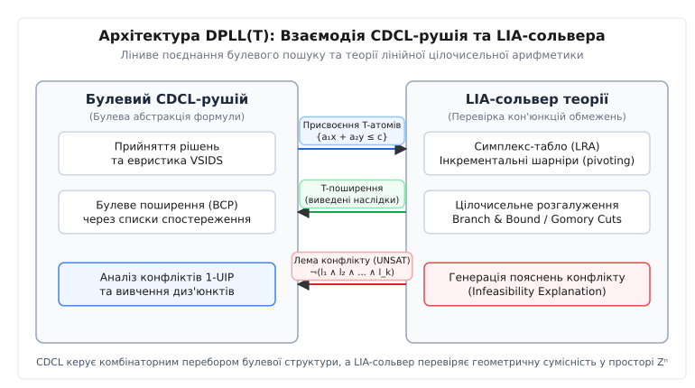
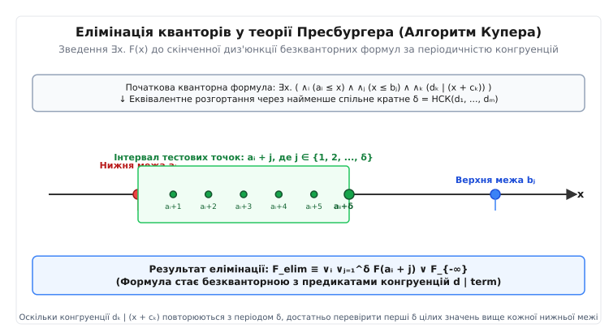
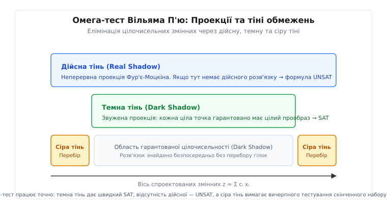
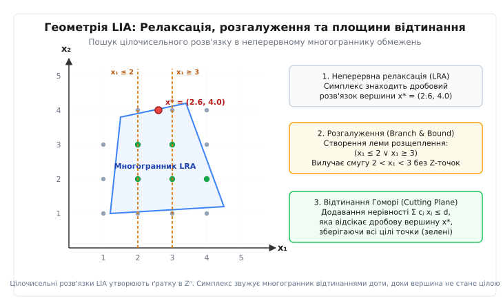

# SMT-солівери та лінійна арифметика Пресбургера (LIA)

<preknowlist>
* [DPLL та CDCL: Алгоритми розв'язання булевої здійсненності](book:algorithms/dpll-cdcl/dpll-cdcl-d.md)
* [Логіка першого порядку та формальні системи виводу](book:algorithms/first-order-logic/first-order-logic-d.md)
* [Арифметика Пеано та межі формалізації](book:algorithms/peano-arithmetic/peano-arithmetic-d.md)
* [Діофантові множини та теорема Матіясевича (DPRM)](book:algorithms/diophantine-sets-dprm/diophantine-sets-dprm-d.md)
* [Теорія NP-повноти та класи обчислювальної складності](book:algorithms/np-completeness/np-completeness-d.md)
</preknowlist>

У статичному аналізі критичного коду авіоніки або ядра операційної системи типова процедура перевірки буфера оперує символічними індексами: нехай масив розміру 65536 байтів адресується виразом `buf[2*i + 3*j]`, де змінні обмежені передумовами циклу `0 ≤ i ≤ 20000`, `0 ≤ j ≤ 15000` та інваріантом розгалуження `i - j ≤ 500`. Щоб довести абсолютну відсутність аварійного виходу за межі пам'яті на апаратному рівні, верифікатор мусить математично перевірити, чи існує хоча б одна пара цілих чисел `(i, j) ∈ Z²`, за якої одночасно виконуються всі попередні умови безпеки та нерівність порушення діапазону `2*i + 3*j ≥ 65536`.

Якщо спробувати розв'язати цю систему за допомогою класичного булевого SAT-сольвера через побітове кодування (Bit-Blasting), кожна 32-розрядна цілочисельна змінна замінюється на 32 булеві змінні. Операція додавання транслюється у каскад вентилів повних суматорів, а константне множення породжує сотні допоміжних бітових перенесень. У результаті проста система з чотирьох лінійних нерівностей перетворюється на кон'юнктивну нормальну форму (CNF) із понад 25 000 диз'юнктів та 8 000 булевих змінних. Булевий розв'язувач повністю втрачає просторову опуклу геометрію многогранника і починає сліпий комбінаторний перебір окремих бітів, витрачаючи експоненційний час на доведення тривіальної арифметичної несумісності.

SMT-сольвери (Satisfiability Modulo Theories) долають цей бар'єр, поєднуючи швидкість булевого аналізу конфліктів із високорівневими математичними процедурами розв'язання над конкретними предметними теоріями. Для цілочисельної лінійної арифметики без множення змінних такою фундаментальною математичною основою є **теорія Пресбургера (Presburger Arithmetic)** та її безкванторний фрагмент **`QF_LIA` (Quantifier-Free Linear Integer Arithmetic)**.

## 1. Архітектура DPLL(T): Синергія SAT та теорійних оракулів

Сучасний SMT-сольвер не намагається виконувати цілочисельні обчислення всередині булевого рушія. Замість цього система організована у вигляді двошарового конвеєра **DPLL(T)**, де класичний алгоритм CDCL (Conflict-Driven Clause Learning) відповідає за логічну структуру формули (диз'юнкції, кон'юнкції, імплікації), а спеціалізований розв'язувач теорії (T-Solver) перевіряє геометричну сумісність лише лінійних арифметичних обмежень.


*Рис. 1. Дворівневий конвеєр DPLL(T): передача призначень літералів, рання теорійна фільтрація та повернення вивчених лем конфлікту Farkas у CDCL-trail.*

Взаємодія компонентів у конвеєрі DPLL(T) відбувається за суворим протоколом:
1. **Булеве абстрагування (Boolean Abstraction):** Кожен унікальний арифметичний атом (наприклад, `2*i + 3*j ≥ 65536` або `i - j ≤ 500`) замінюється новою булевою змінною `p₁`, `p₂`. Складна формула першого порядку перетворюється на чисто булеву пропозиційну формулу `F_bool`.
2. **Пошук булевої моделі:** CDCL-рушій призначає значення пропозиційним змінним, знаходячи задовольняючий набір літералів `M = { p₁ = true, p₂ = false, ... }`.
3. **Теорійна фільтрація (Theory Checking):** Набір призначень транслюється назад у кон'юнкцію арифметичних нерівностей `⋀ l_i` і передається у LIA-сольвер.
4. **Генерація лем конфлікту (Conflict Learning):** Якщо LIA-сольвер встановлює, що кон'юнкція нерівностей не має розв'язку в цілих числах `Z`, він формує строгий сертифікат несумісності — лему Фа Farkas або цілочисельне відтинання. Булеве заперечення цієї леми повертається в CDCL-рушій як новий вивчений диз'юнкт (Learned Clause), назавжди блокуючи схожі тупикові конфігурації в усьому дереві пошуку.

### Лінива та рання теорійна фільтрація (Lazy vs Eager T-Propagation)

У наївній лінивій схемі (Lazy Checking) CDCL призначає значення всім булевим змінним до побудови повної моделі `M`, і лише після цього викликає LIA-рушій. Якщо конфлікт виникає на перших трьох змінних, а загалом у формулі їх 500, лінивий сольвер марно здійснює мільйони непотрібних рішень у решті простору.

Тому сучасні рушії реалізують **ранню теорійну фільтрацію (Eager Theory Propagation)**. На кожному кроці прийняття рішення або булевого поширення (BCP) призначений арифметичний літерал негайно передається в LIA-сольвер. Симплекс-табло робить декілька швидких шарнірних кроків. Якщо межі змінних затискаються до фіксованої константи (наприклад, `low(x) = high(x) = 5`), LIA-сольвер генерує **T-поширення (Theory Propagation)**, передаючи виведені рівності назад у булевий trail без необхідності комбінаторного розгалуження.

Детальний історичний шлях становлення цих архітектур — від перших теоретичних праць Мойжеша Пресбургера у 1929 році до створення сучасних рушіїв Z3, CVC5 та стандарту SMT-LIB — викладено у вставці [📜 Історія розвитку SMT-сольверів та арифметики Пресбургера](book:algorithms/smt-solvers-lia/hist-presburger-smt.md).

## 2. Межа обчислюваності: Чому арифметика Пресбургера вирішувана

Щоб зрозуміти, чому LIA займає центральне місце у верифікації, необхідно поглянути на межі обчислюваності класичної арифметики.

Стандартна формальна арифметика Пеано `PA` формулюється у сигнатурі `Σ_PA = (0, 1, +, ·, ≤, =)`, що включає операції додавання та множення над множиною натуральних або цілих чисел. Відповідно до теореми Геделя про неповноту та негативного розв'язку 10-ї проблеми Гільберта (теорема Матіясевича — Робінсона — Девіса — Патнама, DPRM), довільне діофантове рівняння вигляду `P(x₁, ..., x_n) = 0` ступеня `d ≥ 4` є алгоритмічно нерозв'язним: не існує універсального алгоритму, здатного визначити наявність цілочисельного розв'язку.

Арифметика Пресбургера `Th(Z, +, ≤, 0, 1)` виникає шляхом свідомого вилучення операції загального множення двох змінних `x · y`. Сигнатура теорії містить лише константи `0` і `1`, додавання `+`, рівність `=`, нерівність `≤` та зліченну множину предикатів конгруентності (подільності на фіксовану константу) `k | x` для кожного натурального `k ≥ 2`:

```
Σ_Pres = (0, 1, +, ≤, =, { ≡_k }_{k ≥ 2})
```

Множення на фіксовану цілу константу `c · x` є допустимим синтаксичним скороченням для багаторазового додавання `x + x + ... + x` (для `c > 0`).

Вилучення нелінійного множення повністю усуває можливість закодувати обчислення довільної машини Тюрінга всередині формули, що повертає теорії **алгоритмічну вирішуваність (Decidability)** та **семантичну повноту**: для будь-якого закритого твердження `φ` мовою Пресбургера або `φ`, або `¬φ` є строго доказовним.

Математичні доведення складності, теорему Фішера — Рабіна про подвійно експоненційну нижню межу та формальний аналіз опуклості дискретних многогранників наведено у вставці [🧮 Математична складність та алгоритми елімінації кванторів Пресбургера](book:algorithms/smt-solvers-lia/math-presburger-complexity.md).

## 3. Алгоритми повної елімінації кванторів

Історично першим конструктивним доведенням вирішуваності теорії Пресбургера був метод **елімінації кванторів (Quantifier Elimination, QE)**. Метод полягає у послідовній трансформації формули з кванторами `∃x. φ(x, y₁, ..., y_k)` в еквівалентну безкванторну формулу `ψ(y₁, ..., y_k)`, що містить ті самі вільні змінні.

### Алгоритм Купера

Алгоритм Дерека Купера (1972) реалізує елімінацію квантора існування за три кроки:


*Рис. 2. Схематична редукція квантора існування за алгоритмом Купера: вибір граничних точок B та врахування модулярного зсуву за модулем періоду подільності δ.*

1. **Нормалізація та масштабування:** Формула під квантором приводиться до заперечної нормальної форми (NNF). Усі входження змінної `x` приводяться до однакового додатного коефіцієнта `a · x` через обчислення найменшого спільного кратного `L = lcm(a₁, ..., a_m)`. Після заміни `x' = L · x` додається обмеження подільності `L | x'`.
2. **Побудова періоду подільності:** Обчислюється період `δ = lcm(k₁, ..., k_p)` для всіх предикатів конгруентності `k_i | (x' + c_i)`.
3. **Скінченна диз'юнкція тестових точок:** Купер довів, що якщо цілочисельний розв'язок існує, то принаймні одна точка розв'язку обов'язково лежить у скінченній множині:
   - Або в граничній зоні зсуву від лівих чи правих меж нерівностей: `x' = b_j + t`, де `b_j` — константи з нерівностей `b_j ≤ x'`, а `1 ≤ t ≤ δ`.
   - Або в зоні асимптотичної поведінки на мінус нескінченності `φ_{-∞}(x')` при `1 ≤ t ≤ δ`.

Квантор `∃x. φ(x)` повністю замінюється скінченною диз'юнкцією:

```
⋁_{b_j ∈ B} ⋁_{t=1}^δ φ(b_j + t)  ∨  ⋁_{t=1}^δ φ_{-∞}(t)
```

### Геометричний Омега-тест Вільяма П'ю

Для практичних задач оптимізації вкладених циклів у компіляторах Вільям П'ю (1991) розробив **Omega Test** — цілочисельне розширення методу елімінації змінних Фур'є — Моцкіна.

При елімінації змінної `z` із системи нерівностей пари нижніх меж `a · z ≥ L` та верхніх меж `b · z ≤ U` комбінуються у неперервну раціональну тінь (Real Shadow): `a · U - b · L ≥ 0`. Проте наявність раціональної точки в тіні не гарантує існування цілої точки `z ∈ Z` між границями `L/a` та `U/b`.


*Рис. 3. Геометрія проекцій цілочисельних многогранників в алгоритмі Omega Test: неперервна дійсна тінь, звужена темна тінь та точний перебір зрізів сірої тіні.*

П'ю ввів поняття трьох просторових проекцій (тіней):
1. **Дійсна тінь (Real Shadow):** `b · L ≤ a · U`. Необхідна, але недостатня умова для цілих точок.
2. **Темна тінь (Dark Shadow):** Звужена проекція `a · U - b · L ≥ (a - 1) · (b - 1)`. Якщо темна тінь має цілий розв'язок, вихідна система **гарантовано** має цілочисельний розв'язок у просторі більшої розмірності.
3. **Сіра тінь (Gray Shadow):** Вузька смуга між дійсною та темною тінями: `0 ≤ a · U - b · L < (a - 1) · (b - 1)`. У цій зоні виконується вичерпний перебір скінченної кількості паралельних гіперплощин (зрізів), що забезпечує точність і завершеність алгоритму.

## 4. Інкрементальний симплекс Дютертра — де Моури

Хоча алгоритми Купера та П'ю повністю вирішують кванторну задачу, їхнє застосування всередині DPLL(T) є нераціональним: у булевому CDCL-рушії квантори відсутні (фрагмент `QF_LIA`), натомість критично необхідні **інкрементальність** (швидке додавання та вилучення окремих обмежень) та здатність генерувати пояснення конфліктів.

У 2006 році Бруно Дютертр та Леонардо де Моура розробили спеціалізовану версію симплекс-методу для SMT.

### Канонічна таблиця та інтервальні межі

Замість введення штучних змінних та штучного базису для кожного обмеження, всі лінійні нерівності `∑ a_j · x_j ≤ b` транслюються введенням слабких змінних `s_i` у систему лінійних рівностей із двосторонніми межами:

```
s_i = ∑_{j=1}^n a_{ij} · x_j
l_k ≤ x_k ≤ u_k,    k ∈ {1, ..., n + m}
```

Таблиця (табло) підтримує поділ змінних на небазисні `x_N` (первинні змінні) та базисні `x_B` (додаткові слабкі змінні).

Фундаментальний інваріант полягає в тому, що всі небазисні змінні завжди задовольняють свої інтервальні межі: `l_j ≤ val(x_j) ≤ u_j`. Значення базисної змінної однозначно виражається через відповідний рядок табло: `val(x_i) = ∑_{j ∈ N} a_{ij} · val(x_j)`.

### Шарнірний крок (Pivoting) та правило Бленда

Якщо для базисної змінної `x_i` виявлено порушення межі (наприклад, `val(x_i) < l_i`), алгоритм шукає серед небазисних змінних рядка такого кандидата `x_j`, зміна якого здатна збільшити `val(x_i)`:
- Якщо `a_{ij} > 0`, змінна `x_j` повинна мати можливість збільшення: `val(x_j) < u_j`.
- Якщо `a_{ij} < 0`, змінна `x_j` повинна мати можливість зменшення: `val(x_j) > l_j`.

Якщо кандидата знайдено, виконується шарнірний обмін змінних `x_i` та `x_j` з перерахунком матриці. Для запобігання зацикленню при дегенеративних базисах застосовується **правило найменшого індексу Бленда (Bland's Rule)**: завжди обирається змінна з найменшим системним ідентифікатором.

### Покроковий числовий приклад шарнірного переходу

Розглянемо поводження табло на конкретній системі з двома первинними змінними `x, y`:
```
(1) x + y ≤ 4
(2) 2*x - y ≤ 2
(3) x ≥ 3,  y ≥ 0
```

1. **Формування табло:** Вводяться базисні змінні `s₁ = x + y` з межею `s₁ ≤ 4` та `s₂ = 2*x - y` з межею `s₂ ≤ 2`. Небазисні змінні мають початкові значення `val(x) = 3` (на нижній межі) та `val(y) = 0`.
2. **Перевірка базисних змінних:**
   - `val(s₁) = 3 + 0 = 3 ≤ 4` (норма).
   - `val(s₂) = 2·3 - 0 = 6 > high(s₂) = 2` (порушення верхньої межі).
3. **Вибір шарніра:** Для рядка `s₂ = 2*x - y` необхідно зменшити значення `s₂`. Оскільки `val(x) = 3` вже досяг нижньої межі (зменшити `x` не можна), обирається змінна `y` з від'ємним коефіцієнтом `-1`. Збільшення `y` призводить до зменшення `s₂`. Оскільки `val(y) = 0 < +∞`, змінна `y` підходить для шарніра `(row=s₂, col=y)`.
4. **Перерахунок:** Рівняння розв'язується відносно `y`: `y = 2*x - s₂`.
   Значення `val(s₂)` фіксується на верхній межі `2`, а нове значення `val(y) = 2·3 - 2 = 4`.
5. **Оновлення інших рядків:** Рядок `s₁` перераховується підстановкою `y`: `s₁ = x + (2*x - s₂) = 3*x - s₂`.
   Нове значення `val(s₁) = 3·3 - 2 = 7 > high(s₁) = 4`.
6. **Виявлення конфлікту:** Для рядка `s₁ = 3*x - s₂` порушено верхню межу `7 > 4`. Проте `val(x) = 3` знаходиться на мінімумі (зменшити не можна), а `val(s₂) = 2` знаходиться на максимумі (збільшити не можна). Шарнір неможливий. Формується сертифікат Фа Farkas: кон'юнкція `(x ≥ 3) ∧ (2*x - y ≤ 2) ∧ (x + y ≤ 4)` несумісна над `Q`.

### Інфінітезимальне розширення Q(ε) для строгих нерівностей

Для коректної обробки строгих нерівностей вигляду `x < c` над полем раціональних чисел значення та межі представляються парою `(k, c) ∈ Q × Q`, що задає символічне число `k + c · ε`, де `ε > 0` — нескінченно мала величина, менша за будь-яке додатне раціональне число.

Порівняння таких чисел виконується лексикографічно:

```
(k₁, c₁) < (k₂, c₂)  ⟺  (k₁ < k₂) ∨ (k₁ = k₂ ∧ c₁ < c₂)
```

Завдяки цьому нерівність `x < 5` кодується як `high(x) = (5, -1)`, а `x ≤ 5` — як `high(x) = (5, 0)`, що повністю зберігає алгебраїчну строгість без чисельних округлень.

## 5. Дискретний пошук: Branch and Bound та відтинання Гоморі

Симплекс-метод Дютертра — де Моури швидко знаходить розв'язок над полем раціональних чисел `Q`. Проте для LIA знайдена точка повинна належати дискретній цілочисельній решітці `Zⁿ`.


*Рис. 4. Просторовий розтин задачі LIA: неперервний раціональний многогранник Q, дискретна решітка цілих точок Z² та відтинання дробових вершин площинами Гоморі.*

Якщо раціональна релаксація сумісна, але деяка цілочисельна змінна набула дробового значення `val(x_i) = v ∉ Z`, LIA-сольвер застосовує дві взаємодоповнюючі техніки:

### 1. Метод гілок і меж (Branch and Bound)

Простір рішень рекурсивно розщеплюється на дві взаємовиключні підзадачі:
- **Ліва гілка:** додається тимчасова межа `x_i ≤ ⌊v⌋`.
- **Права гілка:** додається тимчасова межа `x_i ≥ ⌈v⌉`.

Кожна гілка перевіряється інкрементальним симплексом. Якщо обидві гілки повертають `UNSAT`, уся підсистема є несумісною в цілих числах.

### 2. Відтинальні площини Хватала — Гоморі (Gomory Cuts)

Замість комбінаторного розгалуження дерево пошуку можна скоротити, згенерувавши нову лінійну нерівність, яка відтинає поточну дробову вершину многогранника, не вилучаючи жодної цілочисельної точки.

Нехай рядок табло для дробової змінної `x_i` має вигляд:

```
x_i = a_{i0} + ∑_{j ∈ N} a_{ij} · x_j
```

Позначаючи через `f_{i0} = a_{i0} - ⌊a_{i0}⌋` та `f_{ij} = a_{ij} - ⌊a_{ij}⌋` дробові частини коефіцієнтів, площина відтинання Гоморі записується як:

```
∑_{j ∈ N} f_{ij} · x_j ≥ f_{i0}
```

Ця нерівність додається як новий рядок симплекс-табло з новою базисною змінною `s_cut`. Оскільки в поточному стані `val(s_cut) = 0 < f_{i0}`, виникає миттєве порушення межі, і дуальний симплекс робить декілька шарнірних кроків до нової раціональної вершини, яка лежить значно ближче до цілочисельної опуклої оболонки.

Повну програмну реалізацію симплекс-табло, стека відкотів `push`/`pop` та модуля Branch-and-Bound мовами C та C++ наведено у вставці [⚙️ Інкрементальний LIA-сольвер на основі дуального симплексу та розгалужень](book:algorithms/smt-solvers-lia/proj-lia-solver.md).

## 6. Алгебраїчні структури решіток та алгоритм Ленстри

Фундаментальний теоретичний погляд на розв'язання LIA базується на теорії **геометрії чисел (Geometry of Numbers)** Германа Мінковського.

Множина цілих точок `Zⁿ` утворює дискретну векторну решітку `Λ`. Довільна система лінійних нерівностей визначає опуклий політоп `P ⊂ Rⁿ`. Задача LIA полягає у визначенні перетину `P ∩ Λ ≠ ∅`.

У 1983 році Хендрік Ленстра довів фундаментальну теорему: **при фіксованій кількості змінних `n` задача цілочисельного лінійного програмування розв'язується за поліноміальний час `O(m · 2^{O(n³)})`**.

Алгоритм Ленстри базується на знаходженні редукованого базису решітки за допомогою **алгоритму LLL (Lenstra — Lenstra — Lovász)**:
1. Застосовується лінійне афінне перетворення простору, що трансформує витягнутий політоп `P` у квазісферичне тіло.
2. Знаходиться плоский напрямок (Flat Direction) — гіперплощина, вздовж якої ширина політопа є мінімальною.
3. Якщо ширина політопа в цьому напрямку перевищує константу Мінковського `c(n)`, політоп гарантовано містить цілу точку.
4. Якщо ширина мала, простір розщеплюється на константну кількість паралельних зрізів меншої розмірності `n - 1`, і алгоритм викликається рекурсивно.

Хоча константа `2^{O(n³)}` робить метод Ленстри неефективним для `n > 50`, його ідеї використовуються у сучасних SMT-сольверах для швидкого знаходження розв'язків у вузьких необмежених конусах, де класичний Branch and Bound зациклюється.

## 7. Спеціалізовані підфрагменти LIA: Різницева логіка та UTVPI

У багатьох інженерних задачах повна потужність симплекс-методу не потрібна, оскільки нерівності мають специфічну синтаксичну структуру. Для таких випадків застосовують спеціалізовані надшвидкі графічні алгоритми:

### 1. Різницева логіка (Difference Logic, QF_IDL)

Обмеження мають вигляд `x - y ≤ c`. Будь-яка система різницевих нерівностей однозначно транслюється в орієнтований зважений граф (Constraint Graph):
- Кожна змінна `x` стає вершиною графа.
- Нерівність `x - y ≤ c` задає орієнтоване ребро `y → x` з ваговою міткою `c`.

Сумісність системи еквівалентна **відсутності циклів від'ємної ваги** у графі обмежень. Перевірка виконується алгоритмом Беллмана — Форда або інкрементальним пошуком найкоротших шляхів (SPFA) за поліноміальний час `O(|V| · |E|)` без використання матричних табло.

### 2. Логіка двох змінних на нерівність (UTVPI / Octagons)

Обмеження мають вигляд `± x ± y ≤ c` або `± x ≤ c`. Цей фрагмент активно використовується в абстрактній інтерпретації під назвою **октагональний числовий домен (Octagon Abstract Domain)**.

Система зводиться до подвоєного графа обмежень (Skew-Symmetric Graph), де кожна змінна `x` розщеплюється на дві вершини `+x` та `-x`. Перевірка сумісності та замикання транзитивних нерівностей виконується модифікованим алгоритмом Флойда — Воршелла за час `O(|V|³)`.

## 8. Комбінація теорій: Алгоритм Нельсона — Оппена

У реальних програмах лінійна арифметика рідко зустрічається в ізоляції. Зазвичай вона скомбінована з теорією неінтерпретованих функцій з рівністю (`EUF`) для моделювання викликів функцій та покажчиків і теорією масивів (`Arrays` за аксіоматикою Маккарті):

```
x + 1 = y  ∧  f(x) ≠ f(y - 1)  ∧  select(store(arr, i, v), j) = 42
```

Для об'єднання незалежних розв'язувачів теорій у єдиний узгоджений рушій Грег Нельсон та Дерек Оппен (1979) запропонували метод **поділу рівностей (Equality Sharing)**.

### Умови застосовності та очищення формули (Purification)

Теорії `T₁` та `T₂` можуть бути скомбіновані за методом Нельсона — Оппена за виконання трьох фундаментальних умов:
1. Сигнатури теорій не перетинаються, за винятком символу рівності: `Σ₁ ∩ Σ₂ = { = }`.
2. Обидві теорії є **стабільно нескінченними (Stably Infinite)**: будь-яка сумісна кванторна формула має нескінченну модель (це виконується для `LIA`, `LRA`, `EUF` та `Arrays`).
3. Формула очищена (Purified): кожне атомарне обмеження належить виключно одній із теорій (змішані терми розділяються введенням допоміжних змінних, наприклад, `f(x + 1)` транслюється в `f(v) ∧ v = x + 1`).

### Проблема неопуклості теорії LIA

Теорія називається **опуклою (Convex)**, якщо з кон'юнкції обмежень `Γ ⊨ ⋁ (x_i = y_i)` завжди випливає, що `Γ ⊨ (x_k = y_k)` для деякого конкретного індексу `k`.

Теорія дійсної лінійної арифметики `LRA` є опуклою (опуклий многогранник не може бути покритий скінченною кількістю гіперплощин без повного входження в одну з них).

Натомість теорія цілочисельної арифметики **`LIA` є строго неопуклою**. Розглянемо систему:

```
1 ≤ x ≤ 2  ∧  y = 1  ∧  z = 2
```

У цілих числах `Z` змінна `x` може набувати лише значень `1` або `2`. Отже, система логічно тягне диз'юнкцію рівностей:

```
(x = y) ∨ (x = z)
```

Проте окремо жодна з рівностей `x = y` чи `x = z` не є істинною для всіх розв'язків.

У результаті комбінація Нельсона — Оппена для `LIA` вимагає комбінаторного розщеплення (Disjunctive Case-Splitting): коли LIA-сольвер виводить диз'юнкцію рівностей над спільними змінними, CDCL-рушій змушений створювати нові точки прийняття рішень для кожної гілки розгалуження, що збільшує комбінаторну складність взаємодії теорій.

## 9. Взаємодія з теорією масивів та аксіоматикою Маккарті

Найбільш потужною практичною комбінацією у верифікації коду є об'єднання `LIA` з теорією масивів (`Arrays`).

Аксіоматика Джона Маккарті (1962) визначає масив двома поліморфними операціями: читання `select(a, i)` та запису `store(a, i, v)`. Семантика фіксується двома аксіомами:
1. `select(store(a, i, v), i) = v` (читання за щойно записаним індексом повертає записане значення).
2. `i ≠ j → select(store(a, i, v), j) = select(a, j)` (запис за індексом `i` не змінює елементи за іншими індексами `j`).

Коли LIA-сольвер доводить, що за поточних меж індексів `i - j ≥ 1` або `i - j ≤ -1` (тобто `i ≠ j`), розв'язувач теорії масивів миттєво спрощує вираз `select(store(a, i, v), j)` до `select(a, j)` без породження булевих розгалужень. Ця синергія дозволяє автоматично верифікувати складні алгоритми сортування, операції з буферами та драйвери пристроїв.

## 10. Індуктивна верифікація: Алгоритм IC3 / PDR над LIA

У перевірці моделей програм із нескінченним простором станів (Software Model Checking) LIA-сольвери використовуються всередині сучасного алгоритму **IC3 / PDR (Property Directed Reachability)**.

Замість повного розгортання переходів циклу на фіксовану глибину `k` (Bounded Model Checking), IC3 будує послідовність наближених індуктивних інваріантів `F₀, F₁, ..., F_k`:
1. На кожному кроці генерується запит до LIA-сольвера: `F_i ∧ Trans(s, s') ∧ Bad(s')`.
2. Якщо формула сумісна (`sat`), знайдена модель `s` є конкретним контрприкладом до індуктивності (Proof Obligation).
3. Якщо формула несумісна (`unsat`), вилучене ядро суперечності узагальнюється (Lemma Generalization) у нове лінійне обмеження `lemma(s)`, яке додається до множини інваріантів `F_i`.

Цей процес повністю автоматично знаходить лінійні інваріанти складних циклів (наприклад, `2*x + y ≤ 100`) без необхідності ручних анотацій з боку програміста.

## 11. Нелінійні розширення: евристики лінеаризації (NIA)

Коли у вихідному коді програми зустрічається нелінійне множення змінних `x · y` (наприклад, обчислення площі, зміщення покажчика за динамічним кроком `stride * elem_size` або криптографічні хеш-функції), задача переходить у клас **`NIA` (Non-linear Integer Arithmetic)**, який у загальному випадку є алгоритмічно нерозв'язним за теоремою DPRM.

Промислові SMT-сольвери обробляють такі формули за допомогою багаторівневих евристик лінеаризації:
1. **Інтервальне поширення обмежень (Interval Constraint Propagation, ICP):** Межі змінних звужуються за правилами інтервальної арифметики `low(x · y) = min(l_x · l_y, l_x · u_y, u_x · l_y, u_x · u_y)`.
2. **Лінійна апроксимація дотичними (Tangent Planes / Linearization):** Нелінійна поверхня `z = x · y` оточується набором лінійних площин, які динамічно генеруються в околі поточної точки релаксації.
3. **Циліндричне алгебраїчне розкладання (Cylindrical Algebraic Decomposition, CAD):** Застосовується як крайній засіб для розв'язання поліноміальних систем над полем дійсних чисел з подальшою цілочисельною фільтрацією.

## 12. Порівняльний аналіз провідних SMT-сольверів

Сучасний ринок промислових SMT-сольверів сформований кількома провідними науковими розробками, кожна з яких має свою унікальну архітектурну спеціалізацію:

1. **Z3 (Microsoft Research):** Універсальний промисловий розв'язувач. Використовує дворівневу модель арифметики (швидкі 64-бітні цілі з переходом на довгі раціональні числа GMP), розширені евристики для Branch and Bound та передовий рушій MBQI для кванторів.
2. **CVC5 (Stanford University / University of Iowa):** Провідний академічний та промисловий сольвер. Вирізняється максимально строгою генерацією сертифікатів доведення (Alethe, LFSC), повноцінною підтримкою елімінації кванторів та розвиненою системою інстанціювання за шаблонами.
3. **Yices 2 (SRI International):** Найшвидший у світі розв'язувач для безкванторних фрагментів `QF_LIA` та різницевої логіки. Повністю написаний на мові C, використовує гранично оптимізовані розріджені структури даних та власні швидкі алгоритми пошуку шарнірних переходів.
4. **MathSAT (Fondazione Bruno Kessler):** Спеціалізований SMT-рушій для задач верифікації апаратури та безпеки. Має найкращу в класі підтримку інтерполяції Крейга для лінійної арифметики та алгоритмів IC3/PDR.

## 13. Стандарт SMT-LIB 2.6 та програмна інтеграція

Для уніфікації взаємодії між верифікаторами та сольверами консорціум SMT-LIB затвердив стандарт командного протоколу на основі S-виразів.

Сценарій для перевірки безпеки індексу масиву у логіці `QF_LIA`:

```smt2
(set-logic QF_LIA)
(set-option :produce-models true)

(declare-const i Int)
(declare-const j Int)

; Передумови виконання
(assert (and (>= i 0) (<= i 20000)))
(assert (and (>= j 0) (<= j 15000)))
(assert (<= (- i j) 500))

; Умова досяжності помилки (виходу за межі буфера)
(assert (>= (+ (* 2 i) (* 3 j)) 65536))

(check-sat)
; Очікувана відповідь сольвера: unsat (помилка недосяжна, інваріант безпеки доведено)
```

Повну специфікацію граматики SMT-LIB 2.6, таблиці операторів, евклідову семантику ділення та низькорівневий C/C++ API розібрано у вставці [📋 Стандарт SMT-LIB 2.6 та програмний інтерфейс LIA-сольвера](book:algorithms/smt-solvers-lia/api-smt-lib.md).

> 🔧 **Навіщо це.**
>
> 1. **Статичний аналіз та верифікація компіляторів (LLVM Polly, Rust Borrow Checker):** Автоматичне доведення відсутності переповнення цілочисельних буферів та коректності поліедральної оптимізації циклів (Loop Vectorization and Tiling).
> 2. **Символьне виконання та фаззинг (KLEE, S2E, AFL-SMT):** Автоматична генерація конкретних тестових векторів, що гарантують 100% покриття розгалужень у скомпільованих бінарних файлах та пошук вразливостей нульового дня (Zero-Day Exploits).
> 3. **Синтез програм за специфікацією (Syntax-Guided Synthesis, SyGuS):** Автоматичний синтез оптимальних вільних від розгалужень асемблерних інструкцій (Branch-Free Bit Twiddling) за заданим математичним відношенням входу та виходу.
> 4. **Формальна верифікація смарт-контрактів та криптографії (Certora, Slither, Z3):** Доведення збереження балансу токенів та відсутності неконтрольованого переповнення цілих чисел (Underflow / Overflow) у фінансових протоколах.
> 5. **Авіаційні та автомобільні стандарти безпеки (DO-178C, ISO 26262):** Повна заміна ручного тестування коду на формальні математичні сертифікати відсутності збоїв пам'яті та дедлоків у вбудованих системах керування польотом.

## 14. Підсумок: Ландшафт складності та практична сила LIA

Лінійна цілочисельна арифметика Пресбургера демонструє один із найразючіших контрастів у сучасній комп'ютерній науці.

З теоретичного боку повна кванторна логіка Пресбургера має подвійно експоненційну нижню часову складність `2^{2^{c · n}}` за теоремою Фішера — Рабіна. Проте практична інженерія алгоритмів пішла шляхом локалізації найбільш затребуваних підзадач:

| Логічний фрагмент | Обчислювальна складність | Головний алгоритм розв'язання | Сфера застосування |
| :--- | :--- | :--- | :--- |
| **Кванторна LIA** | `2-EXPTIME` (повнота) | Алгоритм Купера / Омега-тест П'ю | Синтез інваріантів, кванторні теореми |
| **Різницева логіка (Difference Logic)** | Поліноміальний час `O(V · E)` | Алгоритм Беллмана — Форда на графах | Планування задач, часові обмеження |
| **UTVPI / Октагони** | Поліноміальний час `O(V³)` | Замикання Флойда — Воршелла | Абстрактна інтерпретація, аналіз діапазонів |
| **Безкванторна LIA (`QF_LIA`)** | `NP`-повнота | DPLL(T) + Симплекс + Gomory Cuts | Верифікація ПЗ, аналіз меж масивів |
| **Нелінійна арифметика (`NIA`)** | Алгоритмічно нерозв'язна | Евристики лінеаризації (ICP, CAD) | Нелінійні фізичні та фінансові моделі |

Завдяки поєднанню CDCL-пошуку, інкрементального дуального симплексу Дютертра — де Моури та динамічних цілочисельних відтинань Гоморі, сучасні SMT-сольвери здатні за лічені частки секунди доводити сумісність систем із мільйонами лінійних нерівностей, перетворюючи формальну логіку з абстрактної математичної дисципліни на надійний інженерний щит сучасного системного програмування.
