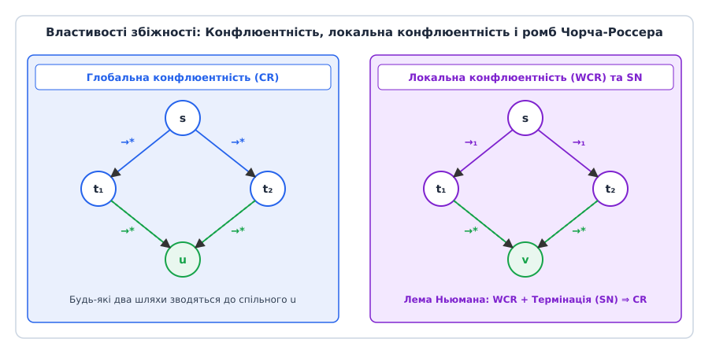
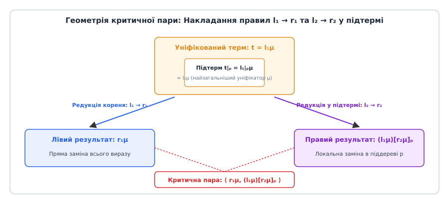
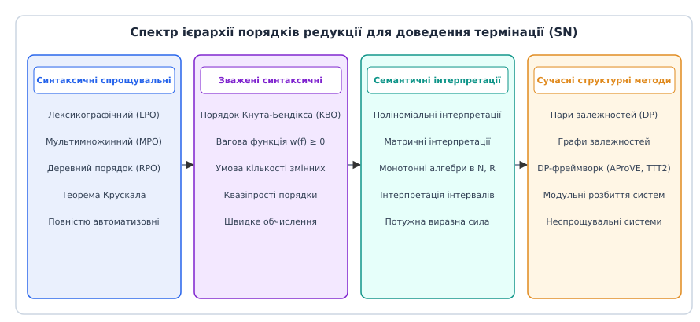
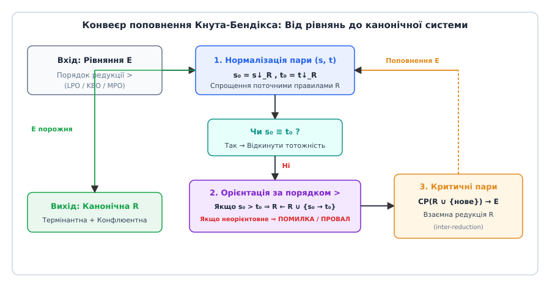

# Системи переписування термів

<preknowlist>
- [Логіка першого порядку](topic:algorithms/descriptive-complexity) — синтаксис термів, змінні, функціональні символи та підстановки.
- [Проблема зупинки](topic:algorithms/halting-problem) — нерозв'язність проблеми завершення та алгоритмічні межі обчислень.
- [Машина Тюринга](topic:math/turing-machine) — універсальна покрокова модель обчислень та конфігураційних переходів.
</preknowlist>

Коли оптимізатор компілятора зустрічає арифметичний вираз `(x + 0) * 1`, він замінює його на `x`. Коли система автоматичного доведення теорем перевіряє тотожність у теорії груп `(x · y) · (i(y) · i(x)) = e`, вона послідовно спрощує підвирази, доки не отримає нейтральний елемент `e`. Якщо розглядати рівність як двонапрямлене симетричне відношення, будь-який автоматичний пошук вироджується у нескінченний перебір циклів вигляду `a = b = a = b`. Системи переписування термів (Term Rewriting Systems, TRS) перетворюють симетричні аксіоми на спрямовані односторонні правила спрощення `l → r`, замінюючи неконтрольований комбінаторний пошук детермінованим обчисленням канонічної нормальної форми.

> 🔧 **Навіщо це.** Системи переписування термів є фундаментальним мостом між математичною логікою рівностей та виконуваними алгоритмами. Вони лежать в основі компіляторів функціональних мов (зіставлення за зразком у Haskell, OCaml, Scala), систем комп'ютерної алгебри (Mathematica, SymPy), інтерактивних довідників теорем (Lean, Coq, Isabelle), SMT-розв'язувачів (Z3, CVC5) та сучасних оптимізаторів на базі насичення рівностями в E-графах (`egg`). Розуміння TRS дає математичний апарат для відповіді на ключові питання: чи завершиться обчислення за скінченну кількість кроків, чи залежить кінцевий результат від порядку застосування оптимізацій і чи можливо автоматично згенерувати повний набір правил спрощення для довільної алгебраїчної структури.

## 1. Синтаксична геометрія термів, контексти та редекси

Формальний апарат систем переписування базується на мові логіки першого порядку без предикатних символів.

### 1.1. Сигнатури, змінні та дерева виразів
Нехай `Σ` — скінченна множина функціональних символів, де кожен символ `f ∈ Σ` має фіксовану невід'ємну цілочислову арність `arity(f) ≥ 0`. Символи з арністю `0` називаються константами. Нехай `V` — зліченна множина синтаксичних змінних, disjoint з `Σ` (`Σ ∩ V = ∅`).

Множина термів першого порядку `T(Σ, V)` визначається як найменша множина, що задовольняє дві індуктивні умови:
1. Будь-яка змінна `x ∈ V` є термом: `x ∈ T(Σ, V)`.
2. Якщо `f ∈ Σ` має арність `n`, а `t₁, t₂, ..., tₙ ∈ T(Σ, V)` — терми, то складений вираз `f(t₁, t₂, ..., tₙ)` також є термом: `f(t₁, t₂, ..., tₙ) ∈ T(Σ, V)`.

Символьний терм синтаксично ізоморфний впорядкованому скінченному дереву. Кожна позиція у дереві кодується послідовністю натуральних чисел `p = i₁ · i₂ · ... · iₖ ∈ ℕ*`, яка задає шлях від кореневого вузла `ε` (порожнє слово) до відповідного піддерева. Множина всіх позицій терма позначається як `Pos(t)`.

Між позиціями визначається природний частковий порядок префіксів:
- Позиція `p` є префіксом `q` (`p ≤ q`), якщо існує така послідовність `w`, що `q = p · w`. У цьому випадку підтерм `t|_q` є частиною піддерева `t|_p`.
- Позиції `p` та `q` називаються паралельними або незалежними (`p ⊥ q`), якщо жодна з них не є префіксом іншої (`p ≰ q` та `q ≰ p`).

```
        * (ε)
       /     \
    * (1)     z (2)
   /     \
 x (1.1)  y (1.2)
```

Підтерм у позиції `p` позначається як `t|_p`. Запис `t[s]_p` позначає новий терм, отриманий із `t` шляхом хірургічної заміни підтерма у позиції `p` на вираз `s`. Якщо дерево не містить змінних (`Var(t) = ∅`), терм називається основним (ground term).

### 1.2. Підстановки, правила та відношення редукції
Підстановка `σ: V → T(Σ, V)` — це відображення змінних у терми, домен якого `dom(σ) = { x ∈ V | σ(x) ≠ x }` є скінченним. Гомоморфне поширення підстановки на довільний терм `tσ` рекурсивно замінює кожне входження змінної `x` на вираз `σ(x)`.

Правилом переписування (rewrite rule) називається впорядкована пара термів `l → r`, що задовольняє дві фундаментальні умови коректності:
1. Ліва частина `l` не може бути ізольованою змінною (`l ∉ V`), оскільки правило `x → r` дозволяло б переписати будь-який вираз у системі довільним чином, миттєво руйнуючи структуру даних.
2. Усі змінні правої частини обов'язково присутні в лівій частині: `Var(r) ⊆ Var(l)`. Якщо у правій частині з'явиться вільна змінна `y ∉ Var(l)`, редукція породить неінстанційоване значення «з повітря», що порушує детермінізм обчислень.

Система переписування термів (TRS) — це пара `(Σ, R)`, де `R` — множина правил переписування. Крок редукції `s →_R t` здійснюється тоді й лише тоді, коли у виразі `s` знайдено позицію `p ∈ Pos(s)`, правило `l → r ∈ R` та підстановку `σ` такі, що підтерм `s|_p` синтаксично тотожний інстанційованій лівій частині правила:
```
s|_p  ≡  lσ   ==>   t = s[rσ]_p
```
Підтерм `s|_p = lσ` називається **редексом** (reducible expression). Відношення редукції `→_R` є стабільним щодо підстановок (`s → t ⟹ sσ → tσ`) та замкненим щодо контекстів (`s → t ⟹ C[s] → C[t]`).

### 1.3. Стратегії редукції та необхідні редекси
Коли вираз одночасно містить кілька редексів у різних позиціях, порядок їх вибору визначається стратегією редукції:
- **Внутрішньо-ліва стратегія (Innermost / Call-by-Value):** Спершу скорочуються найглибші редекси, аргументи функцій нормалізуються до застосування правила у корені. Це модель обчислень імперативних мов (C, Rust) та суворих функціональних мов (OCaml). Її недолік — обчислення зайвих нескінченних гілок, якщо аргумент виявиться непотрібним.
- **Зовнішньо-ліва стратегія (Outermost / Call-by-Name):** Правила застосовуються якомога ближче до кореня. У нетермінантних системах (наприклад, лямбда-численні) ця стратегія є квазі-повною: якщо терм має нормальну форму, зовнішня редукція обов'язково її знайде.
- **Стратегія необхідних редексів (Needed Redexes, Huet & Lévy 1991):** Для ортогональних систем кожен терм, що не має нормальної форми, містить так звані необхідні редекси (редекси, які неминуче мають бути скорочені у будь-якому шляху до нормальної форми). Скорочення лише необхідних редексів гарантує оптимальну кількість обчислювальних кроків.

## 2. Конфлюентність, термінація та лема Ньюмана

Коли вираз містить кілька незалежних редексів, постає питання порядку їх скорочення. Нехай `→*` позначає рефлексивно-транзитивне замикання кроків редукції.

### 2.1. Класифікація властивостей збіжності
- **Термінація (Termination / Strong Normalization, SN):** Система `R` є термінантною, якщо в ній не існує нескінченних ланцюгів редукції `t₀ → t₁ → t₂ → t₃ → ...`. Для будь-якого вхідного виразу процес покрокового спрощення гарантовано зупиняється за скінченну кількість кроків у нередуковному виразі — **нормальній формі** (normal form).
- **Конфлюентність (Confluence / Church-Rosser, CR):** Система є глобально конфлюентною, якщо для будь-яких розбіжних шляхів редукції `s →* u` та `s →* v` існує спільний терм `w`, до якого обидва вирази сходяться: `u →* w` та `v →* w`.
- **Локальна конфлюентність (Weak Church-Rosser, WCR):** Система є локально конфлюентною, якщо властивість збіжності виконується для одного кроку розгалуження: `s → u` та `s → v` тягне за собою існування такого `w`, що `u →* w` та `v →* w`.


*Співвідношення між локальною та глобальною конфлюентністю: за наявності термінації локальна конфлюентність гарантує єдиність нормальної форми за лемою Ньюмана.*

Конфлюентність гарантує, що якщо нормальна форма існує, вона є **єдиною**. Порядок виконання редукцій (лінивий, енергійний чи паралельний) може впливати на кількість кроків, але ніколи не змінить фінальний результат. Системи, що володіють одночасно термінацією та конфлюентністю, називаються **канонічними** або **конвергентними**.

### 2.2. Лема Ньюмана: Міст від локального до глобального
У загальному випадку локальна конфлюентність не тягне за собою глобальну конфлюентність (контрприклад: система з нескінченним циклом `a ↔ b`, `a → c`, `b → d`). Проте 1942 року математик Макс Ньюман довів фундаментальний результат:

> **Лема Ньюмана (1942).** Якщо система абстрактного переписування є термінантною (SN) та локально конфлюентною (WCR), то вона є глобально конфлюентною (CR).

Доведення здійснюється методом нетерової індукції (індукції за фундованим порядком редукції `→+`): якщо властивість виконується для всіх прямих нащадків `u` та `v`, вона автоматично поширюється на весь конус обчислень.

Для читачів, які прагнуть розібрати повний формалізм абстрактних редукційних систем, доступне [детальне індуктивне виведення леми Ньюмана](topic:algorithms/term-rewriting-systems/math-confluence-termination.md). А ширшу історичну еволюцію ідей переписування від комбінаторної теорії слів висвітлює [історія становлення теорії переписування від Акселя Туе до сучасних E-графів](topic:algorithms/term-rewriting-systems/hist-term-rewriting.md).

## 3. Критичні пари та алгоритм перевірки конфлюентності

Оскільки множина всіх можливих термів `T(Σ, V)` є нескінченною, пряма перевірка локальної конфлюентності через усі можливі розгалуження `s → u` та `s → v` неможлива. Жерер Юе (Gérard Huet, 1980) показав, що всі можливі конфлікти між правилами локалізуються у скінченній кількості синтаксичних накладень.

### 3.1. Класифікація взаємного розташування редексів
Нехай у термі `s` одночасно застосовні правило `l₁ → r₁` у позиції `p₁` та правило `l₂ → r₂` у позиції `p₂`. Можливі рівно три геометричні випадки:


*Геометрія взаємного розташування двох редексів: незбіжність виникає виключно за умови незмінної уніфікації у функціональних вузлах.*

1. **Паралельні позиції (`p₁ ⊥ p₂`):** Редекси розташовані у незалежних піддеревах. Скорочення одного редекса не зачіпає інший, і розгалуження тривіально сходиться за 1 крок: `s[r₁]_{p₁}[r₂]_{p₂}`.
2. **Вкладення в область змінної:** Позиція `p₂` потрапляє всередину підстановки змінної правила `l₁` (тобто `p₂ = p₁ · p_var · q`, де `l₁|_{p_var} ∈ V`). Скорочення внутрішнього редекса лише дублює або знищує аргумент, зберігаючи збіжність за стабільністю відношення редукції щодо підстановок.
3. **Критичне перекриття (Critical Overlap):** Позиція `p₂` вказує на внутрішній *незмінний* вузол правила `l₁` (`l₁|_{p₂} ∉ V`), причому підтерм `l₁|_{p₂}` уніфікується з лівою частиною `l₂` через найзагальніший уніфікатор (MGU) `μ = mgu(l₁|_{p₂}, l₂)`.

### 3.2. Лема про критичні пари та обчислення уніфікаторів
Кожне критичне перекриття породжує **критичну пару** (critical pair) `⟨s, t⟩`:
```
s = r₁μ,    t = (l₁[r₂]_{p₂})μ
```
Критична пара називається **збіжною** (joinable, `s ↓_R t`), якщо існує такий вираз `w`, що `s →* w` та `t →* w`.

Розглянемо практичний розрахунок критичної пари для системи з правилом асоціативності `r₁: (x · y) · z → x · (y · z)` та лівої дистрибутивності `r₂: a · (b + c) → (a · b) + (a · c)`:
1. Перейменовуємо змінні для усунення колізій: `Var(r₁) ∩ Var(r₂) = ∅`.
2. Шукаємо внутрішній незмінний підтерм у лівій частині `r₁`. Підтерм `(x · y)` уніфікується з лівою частиною `r₂`:
   `mgu(x · y, a · (b + c)) = {x ↦ a, y ↦ (b + c)}`.
3. Уніфікований вихідний терм: `(a · (b + c)) · z`.
4. Ліва редукція (за правилом `r₁` у корені): `a · ((b + c) · z)`.
5. Права редукція (за правилом `r₂` у підтермі): `((a · b) + (a · c)) · z`.
6. Отримуємо нетривіальну критичну пару: `⟨ a · ((b + c) · z),  ((a · b) + (a · c)) · z ⟩`.

> **Лема про критичні пари (Кнут-Бендікс / Юе).** Система переписування термів є локально конфлюентною (WCR) тоді й лише тоді, коли всі її критичні пари є збіжними.

Для скінченної системи `R` множина критичних пар є скінченною. Отже, для термінантної системи перевірка глобальної конфлюентності є **алгоритмічно розв'язною**: достатньо знайти всі критичні пари, нормалізувати їхні ліві та праві частини до нормальних форм `s↓` та `t↓` і перевірити їх синтаксичну тотожність `s↓ ≡ t↓`.

## 4. Порядки редукції та доведення термінації

Доведення термінації довільної TRS вимагає побудови строгого фундованого часткового порядку `>` на множині `T(Σ, V)`, що задовольняє дві умови:
1. **Монотонність (Monotonicity):** `s > t ⟹ C[s] > C[t]` для будь-якого контексту `C[_]`.
2. **Стабільність (Stability):** `s > t ⟹ sσ > tσ` для будь-якої підстановки `σ`.

Порядок з такими властивостями називається **порядком редукції** (reduction ordering). Якщо для кожного правила `l → r ∈ R` виконується нерівність `l > r`, система `R` гарантовано є термінантною.


*Ієрархія виражальної сили порядків редукції: від простих синтаксичних порядків до повних семантичних матричних інтерпретацій.*

### 4.1. Спрощувальні порядки та теорема Крускала
За теоремою Дершовіца (1982), будь-який порядок, що містить відношення вкладення підтермів (`C[t] > t` для `C ≠ [_]`) і є стабільним та монотонним, є фундованим на скінченних сигнатурах за **теоремою Крускала про деревоподібні вкладення**. Такі порядки називаються спрощувальними (simplification orderings):

- **Лексикографічний деревний порядок (LPO):** Базується на строгому пріоритеті функціональних символів `>_Σ`. Терм `s = f(s₁, ..., sₘ)` перевершує `t = g(t₁, ..., tₙ)` (`s >_lpo t`), якщо:
  1. Бодай один аргумент `sᵢ ≥_lpo t`; або
  2. `f >_Σ g` і для всіх `j` виконується `s >_lpo tⱼ`; або
  3. `f = g`, вектор аргументів `⟨s₁, ..., sₘ⟩` лексикографічно більший за `⟨t₁, ..., tₙ⟩`, і `s >_lpo tⱼ` для всіх `j`.
- **Порядок Кнута-Бендікса (KBO):** Комбінує додатні числові ваги символів `w(f)` із пріоритетом `>_Σ`. Порівняння спершу здійснюється за сумарною вагою термів `weight(s) > weight(t)`, а при рівності ваг розв'язується через пріоритет кореневого символу. Обов'язкова умова коректності KBO: для кожної змінної `x` кількість входжень `|s|_x ≥ |t|_x`, а константи мають строго додатну вагу `w(c) > 0`.

### 4.2. Семантичні інтерпретації та матричні порядки
Якщо правила спричиняють дублювання або розростання розміру термів (наприклад, асоціативність та дистрибутивність `x · (y + z) → (x · y) + (x · z)`), синтаксичні спрощувальні порядки можуть бути безсилими.

У таких випадках застосовують семантичні методи:
- **Поліноміальні інтерпретації (Тарський / Ланке):** Кожен символ `f` арності `n` зіставляється з монотонним многочленом `[f](x₁, ..., xₙ)` над натуральними числами. Нерівність `l > r` перевіряється через абсолютну позитивність різниці многочленів `[l] - [r] > 0`.
- **Матричні інтерпретації (Ендрісс та ін.):** Змінні та терми інтерпретуються векторами та матрицями фіксованого розміру `d × d`, забезпечуючи доведення складної нетермінації з поліноміальними вагами.
- **Фреймворк пар залежностей (Dependency Pairs, Arts & Giesl 2000):** Трансформує проблему глобальної термінації у пошук нескінченних ланцюгів викликів рекурсивних функцій (вузлів залежностей) у зваженому графі залежностей, що дозволяє автоматизувати доведення для 98% практичних систем у змаганнях Termination Competition (termCOMP).

## 5. Алгоритм автопоповнення Кнута-Бендікса

Якщо вхідний набір аксіом `E` породжує незбіжні критичні пари, система не є конфлюентною. 1970 року Дональд Кнут та Пітер Бендікс запропонували фундаментальний алгоритм, який трансформує довільну множину симетричних рівнянь `E` у канонічну систему переписування `R`.


*Алгоритмічний цикл автопоповнення Кнута-Бендікса: перетворення симетричних рівностей на канонічну систему спрощення.*

### 5.1. Конвеєр поповнення та взаємне спрощення (Inter-Reduction)
Алгоритм працює як машина виведення над парою множин `⟨E, R⟩`:
1. **Вибір та нормалізація:** З черги рівнянь `E` вибирається рівність `s = t`. Обидва терми нормалізуються поточним набором правил `R`: `s₀ = s↓_R`, `t₀ = t↓_R`.
2. **Елімінація тотожностей:** Якщо `s₀ ≡ t₀`, рівність є тривіальним наслідком наявних правил і відкидається.
3. **Орієнтація за порядком редукції:** Використовуючи фіксований порядок `>` (наприклад, LPO):
   - Якщо `s₀ > t₀`, створюється нове правило `s₀ → t₀`.
   - Якщо `t₀ > s₀`, створюється нове правило `t₀ → s₀`.
   - Якщо `s₀` та `t₀` є непорівнюваними (наприклад, комутативність `x · y = y · x`), алгоритм **аварійно зупиняється з помилкою** (Failure: Unorientable Equation).
4. **Взаємне спрощення (Inter-reduction):** Нове правило `l → r` додається до `R`. Одночасно всі наявні правила в `R` спрощуються новим правилом:
   - Якщо ліва частина старого правила `l' → r'` редукується новим правилом (`l' →_l→r l''`), старе правило видаляється з `R`, а рівність `l'' = r'` повертається в чергу `E` (ліва редукція).
   - Якщо права частина редукується (`r' →_l→r r''`), правило замінюється на `l' → r''` (права редукція).
5. **Генерація критичних пар:** Обчислюються всі критичні пари між новим правилом та всіма правилами з `R`. Усі знайдені пари додаються до черги рівнянь `E`.
6. **Критерій завершення:** Процес повторюється, доки черга `E` не спорожніє.

### 5.2. Демонстрація на аксіомах теорії груп
Класичним тріумфом алгоритму є автоматичне виведення 10 правил теорії груп із 3 початкових аксіом:
```
1. e · x = x               (ліва нейтральність)
2. i(x) · x = e            (лівий обернений)
3. (x · y) · z = x · (y · z) (асоціативність)
```
Поповнення послідовно знаходить накладання лівих частин, орієнтує незбіжні критичні пари за LPO (з пріоритетом `i > * > e`) і автоматично виводить:
- Праву нейтральність: `x · e → x`
- Правий обернений: `x · i(x) → e`
- Інволютивність взяття оберненого: `i(i(x)) → x`
- Обернений нейтрального: `i(e) → e`
- Антигомоморфізм добутку: `i(x · y) → i(y) · i(x)`
- Асоціативні взаємодії: `i(x) · (x · z) → z` та `x · (i(x) · z) → z`

Отримана канонічна система з 10 правил дозволяє розв'язувати проблему слів для вільної групи за лінійний час від довжини виразу.

Повний вихідний код рушія переписування та алгоритму поповнення на C та C++ подано у вставці [реалізація рушія переписування та автопоповнення теорії груп на C та C++](topic:algorithms/term-rewriting-systems/proj-knuth-bendix.md). А формальний контракт бібліотеки та архітектуру пам'яті описує [повна специфікація програмного інтерфейсу C/C++ рушія переписування](topic:algorithms/term-rewriting-systems/api-rewriting-engine.md).

## 6. Узагальнені розширення: Умовні, контекстно-залежні та вищих порядків

Класичні системи переписування першого порядку мають фундаментальні обмеження виражальної сили, для подолання яких розроблено низку алгебраїчних розширень:

### 6.1. Умовні системи переписування термів (CTRS)
У багатьох мовах програмування та специфікаціях правила діють лише за виконання певних умов:
```
l → r  ⇐  c₁ = d₁, ..., cₖ = dₖ
```
Залежно від інтерпретації знака рівності в умовах виділяють:
- **Напів-екваційні CTRS:** Рівності в умовах перевіряються через рефлексивно-транзитивне замикання `cᵢ ↔* dᵢ`.
- **Збіжні CTRS (Join CTRS):** Умови вимагають збіжності до спільного виразу `cᵢ ↓ dᵢ`.
- **Орієнтовані CTRS:** Умови обчислюються як редукція до нормальної форми `cᵢ →* dᵢ`, де `dᵢ` є нередуковними зразками.

### 6.2. Контекстно-залежне переписування (Context-Sensitive Rewriting)
Для моделювання лінивих обчислень над нескінченними структурами даних (потоками) кожному символу `f ∈ Σ` зіставляється множина активних позицій аргументів `μ(f) ⊆ {1, ..., arity(f)}`. Редукція дозволяється лише у виділених позиціях, що запобігає нескінченному розгортанню нетермінантних генераторів (наприклад, списку простих чисел `primes = sieve(from(2))`), зберігаючи при цьому повноту обчислення нормальних форм.

### 6.3. Системи переписування вищих порядків (HRS та CRS)
Для моделювання зв'язування змінних (як у кванторах `∀x`, інтегралах `∫` або лямбда-абстракціях `λx. t`) розроблено системи редукції вищих порядків (Higher-Order Rewriting Systems, Nipkow 1991) та комбінаторні редукційні системи (Klop 1980).
- Терми типізуються за допомогою простої теорії типів Черча.
- Синтаксична уніфікація замінюється на уніфікацію вищих порядків (Higher-Order Pattern Unification Міллера), що розв'язується за лінійний час.
- Правило `beta: app(lam(F), X) → F(X)` виражає фундаментальний крок обчислення функціональних мов програмування з коректною заміною змінних без захоплення імен (capture-avoiding substitution).

## 7. Алгоритмічні межі та складність

Теорія переписування термів тісно пов'язана з основами теорії обчислюваності та комбінаторної теорії груп.

### 7.1. Нерозв'язність проблеми слів і теорема Новікова-Боона
Проблема еквівалентності термів (Word Problem) для скінченно заданої системи рівнянь полягає у з'ясуванні, чи виводиться рівність `s =_E t` за правилами логіки рівностей Біркгофа (рефлексивність, симетрія, транзитивність, конгруентність та підстановка).

За теоремою Новікова-Боона (1955), проблема слів для скінченно представлених напівгруп та груп є **алгоритмічно нерозв'язною** в загальному випадку. Звідси випливає, що поповнення Кнута-Бендікса не може бути повним алгоритмом: для систем із нерозв'язною проблемою слів воно або зіткнеться з неорентовним рівнянням, або генеруватиме нескінченну множину правил `R`, працюючи як напіврозв'язна процедура (перелічувач теорем).

### 7.2. Нерозв'язність термінації (Теорема Доше)
Може здатися, що перевірка термінації для фіксованої скінченної множини правил `R` є розв'язною. Проте 1992 року Макс Доше (Max Dauchet) довів фундаментальну теорему:

> **Теорема Доше (1992).** Властивість термінації TRS є алгоритмічно нерозв'язною навіть для систем, що містять лише 3 правила переписування або правила лінійного розміру.

Доведення базується на моделюванні роботи довільної універсальної машини Тюринга: конфігурація стрічки кодується деревом термів, а кроки переходів автомата — правилами редукції. Проблема зупинки машини Тюринга напряму зводиться до термінації відповідної TRS.

### 7.3. Розв'язні підкласи: Основниі терми та лінійні системи
Попри загальну нерозв'язність, виділено важливі практичні класи TRS з точними оцінками складності:
- **Основні системи переписування (Ground TRS):** Якщо правила не містять змінних (`Var(l) = Var(r) = ∅`), конфлюентність, термінація та проблема слів є поліноміально розв'язними за час `O(|R| · |t| log |t|)` за допомогою алгоритмів конгруентного замикання (Congruence Closure).
- **Лінійні праві та ліві системи (Left-Linear / Orthogonal TRS):** Якщо кожна змінна входить у ліву частину правила не більше одного разу, а критичні пари відсутні (ортогональні системи), система гарантовано є конфлюентною без жодних вимог до термінації (теорема Россера для комбінаторної логіки та λ-числення).

## 8. Сучасні напрямки: AC-переписування, логіка переписування та E-графи

Класична теорія термів першого порядку отримала потужний розвиток у сучасних комп'ютерних науках:

### 8.1. AC-переписування (Associative-Commutative Rewriting)
Коли сигнатура містить комутативні оператори (`x + y = y + x`), їх неможливо орієнтувати жодним строгим фундованим порядком без виникнення циклу `s > t > s`. Для подолання цього бар'єру розроблено **переписування за модулем еквівалентності** (Rewriting Modulo Equivalence `E_AC`):
- Терми розглядаються як класи еквівалентності мультисистем.
- Синтаксична уніфікація замінюється на AC-уніфікацію за алгоритмом Стіка (Stickel), що зводить пошук спільних виразів до розв'язання систем лінійних діофантових рівнянь.

### 8.2. Логіка переписування та мова Maude
Хосе Месегер (José Meseguer, 1992) запропонував розглядати переписування не як спрощення рівностей, а як **універсальну логіку паралельних обчислень та зміни станів** (Rewriting Logic).
- Правило `l(x) ⇒ r(x)` трактується як незворотний динамічний перехід системи зі стану `l` у стан `r`.
- Відсутність конфлюентності інтерпретується як справжній недетермінізм поведінки (конкурентні транзакції, розподілені протоколи).
- Мова Maude дозволяє виконувати формальну верифікацію розподілених систем, перевірку моделей (LTL Model Checking) та аналіз криптографічних протоколів.

### 8.3. Насичення рівностями та фреймворк `egg`
У сучасних оптимізувальних компіляторах деструктивне переписування (коли вираз замінюється новим, а старий знищується) страждає від так званої «проблеми порядку фаз» (Phase Ordering Problem): невдале раннє спрощення може заблокувати глибшу векторну або алгебраїчну оптимізацію на наступному етапі.

Технологія **насичення рівностями (Equality Saturation)** на основі еквівалентнісних графів (E-Graphs) розв'язує цю проблему:
- E-граф зберігає експоненційну кількість еквівалентних форм програми у компактному поліноміальному об'ємі пам'яті через класи конгруентності.
- Правила переписування застосовуються недеструктивно, лише додаючи нові еквівалентні ребра між вузлами до досягнення точки насичення.
- Після насичення алгоритм динамічного програмування (екстракція) за один прохід знаходить глобально оптимальний вираз за обраною функцією вартості (розмір бінарного коду або кількість тактів CPU).

### 8.4. E-Matching у сучасних SMT-розв'язувачах
У системах автоматичного міркування Z3, CVC5 та Vampire правила переписування застосовуються всередині архітектури Нельсона-Оппена для інстанціювання універсальних кванторів.
- Квантифіковані аксіоми позначаються тригерами (E-matching patterns), наприклад `∀x. {:pattern (f x)} P(x)`.
- Рушій E-matching шукає в поточному E-графі еквівалентності терми, що зіставляються з тригером, і генерує відповідні інстанціації кванторів без важкої уніфікації вищих порядків.

### 8.5. Графове переписування та мережі взаємодії (Interaction Nets)
Ів Лафон (Yves Lafont, 1990) та Джон Лампінг (John Lamping, 1990) розробили теорію оптимального редукування термів на графах через мережі взаємодії. Замість дублювання цілих синтаксичних дерев під час підстановок виразів, графове переписування використовує спеціальні вузли розмноження (fan/eraser nodes), що дозволяє виконувати редукцію лямбда-виразів з асимптотично оптимальною кількістю кроків без зайвого клонування пам'яті.

## 9. Інженерні компроміси та практичне впровадження

Застосування рушіїв переписування термів у промислових системах вимагає врахування ключових компромісів між часовою складністю, локальністю кешу та витратами оперативної пам'яті:

| Архітектурний аспект | Наївний підхід (Pointer Tree) | Промисловий підхід (DAG / E-Graph) | Ціна та обмеження |
| :--- | :--- | :--- | :--- |
| **Представлення термів** | Окремі вузли з `malloc` | Хеш-консинг (Hash-Consing / Unique Nodes) | Накладні витрати на хешування при кожній побудові виразу |
| **Перевірка рівності** | Рекурсивне порівняння `O(\|t\|)` | Порівняння покажчиків `O(1)` | Необхідність глобальної синхронізації таблиці інтернування |
| **Пошук редексів** | Лінійне сканування правил `O(\|R\| · \|t\|)` | Дискримінаційні дерева (Discrimination Trees) | Витрати пам'яті на підтримку префіксного індексу правил |
| **Керування пам'яттю** | Деструктивне виділення/звільнення | Аренні алокатори (Region / Monotonic Allocators) | Неможливість вибіркового звільнення окремих вузлів |
| **Стратегія нормалізації** | Довільний спуск (Random-step) | Фіксована внутрішня або зовнішня стратегія | Ризик зациклення на нетермінантних гілках (Innermost) |

### 9.1. Практичні кейси індустріального застосування
- **Компілятор Glasgow Haskell Compiler (GHC):** Підтримує користувацькі прагми `{-# RULES ... #-}`, які дозволяють програмістам декларувати правила переписування проміжного представлення Core (наприклад, злиття спискових операцій `map f (map g xs) = map (f . g) xs` або скорочення операцій над потоками векторних інструкцій).
- **Інтерактивний довідник теорем Lean 4:** Рушій спрощення `simp` використовує конгруентне замикання, кешовані дискримінаційні дерева та лексикографічні порядки для автоматичного доведення тисяч допоміжних лем під час перевірки коректності математичних формул.
- **Оптимізатори байт-коду WebAssembly (фреймворк Cranelift / Wasmtime):** Застосовують алгоритми насичення рівностями на E-графах для векторизації SIMD-інструкцій та оптимізації доступу до лінійної пам'яті без загрози руйнування порядку виконання фаз компілятора.

### 9.2. Локальність кешу процесора та серіалізація
У високопродуктивних довідниках теорем (Vampire, E Prover) представлення термів у вигляді зв'язних об'єктів з покажчиками створює значне навантаження на підсистему пам'яті через часті промахи кешу L1/L2. Для прискорення редукції вирази лінеаризують у компактні байти-масиви польського запису, де операція перевірки рівності термів зводиться до швидкого виклику `memcmp()`, а клонування виконується однією векторною процесорною інструкцією `memcpy()`. Аренне виділення блоків пам'яті дозволяє переробляти мільйони проміжних термів без звернення до блокувальних системних викликів ядра ОС.

## 10. Підсумковий синтез

Системи переписування термів демонструють виняткову математичну гармонію: проста локальна операція — заміна зіставленого підвиразу за спрямованим правилом — породжує багатий обчислювальний універсум. Фундаментальні теореми Ньюмана, Крускала та Юе дозволяють перетворити хаотичний недетермінований пошук на строгий алгебраїчний інструмент гарантованого обчислення нормальних форм.

Від класичного автопоповнення аксіом груп і кілець до сучасних верифікаторів коду та E-графів компіляторів нового покоління, апарат TRS залишається одним із найелегантніших і найпотужніших фундаментів теоретичної та практичної інформатики.
