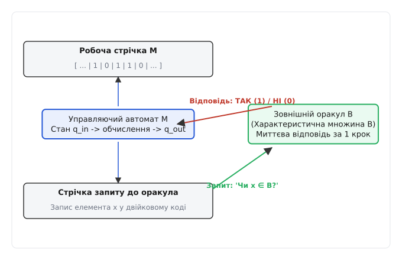
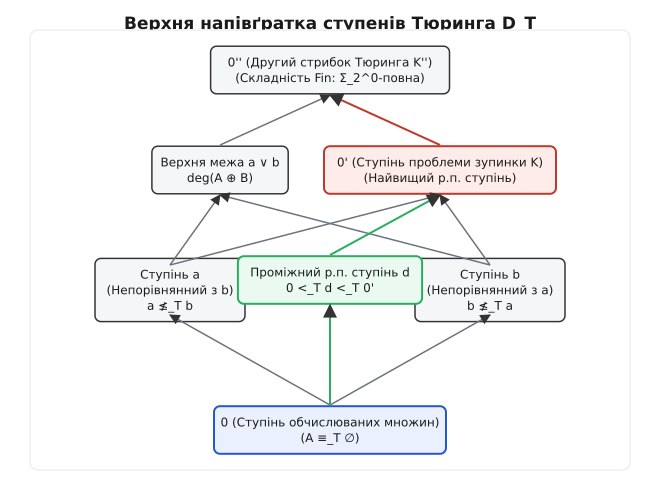
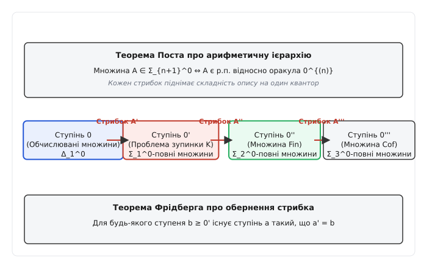

# Ступені Тюринга

<preknowlist>
- [Проблема зупинки](book:algorithms/halting-problem) — нерозв'язність алгоритмічним шляхом та діагональний аргумент.
- [Теорія множин](book:math/set-theory) — відношення еквівалентності, часткові порядки та потужність континууму.
</preknowlist>

Розробник аналізатора вихідного коду намагається створити статичний інструмент, який би гарантовано виявляв нескінченні цикли у довільних програмах на C++. Упершись у фундаментальну нерозв'язність проблеми зупинки, він вирішує обійти це обмеження математичним припущенням: що, якби аналізатор мав доступ до спеціального апаратного модуля — «магічного чорного ящика», який за один крок відповіді повідомляє, чи зупиниться представлена програма? Проте, побудувавши аналізатор наступного рівня із цим модулем, інженер знову виявляє аналогічну незахищену прогалину: проблема зупинки для *самих нових аналізаторів* із чорним ящиком стає для нього алгоритмічно недосяжною. Ця нескінченна драбина складності показала, що алгоритмічна нерозв'язність — не суцільна монолітна стіна, а безмежна ієрархічна структура, ступені якої вимірюють відносну обчислювальну силу алгоритмів.

Математичним фундаментом для вимірювання цієї відносної сили є **ступені Тюринга** (або ступені нерозв'язності). Вони об'єднують алгоритмічні задачі у класи еквівалентності за їхньою здатністю розв'язувати одна одну через механізм оракулів.

---

## 1. Оракульні машини та відносна обчислюваність

Класична машина Тюринга оперує абсолютно автономно: вона зчитує вхідні дані з власної нескінченної стрічки, змінює внутрішні стани згідно з фіксованою таблицею переходів і виходить у стан зупинки. Вся її обчислювальна потужність замкнена у внутрішніх правилах. Проте в багатьох математичних ситуаціях виникає потреба дослідити, що станеться з обчислюваністю, якщо алгоритм отримає можливість ставити запити до зовнішнього джерела знань, яке миттєво розв'язує деяку складну проблему.

Аби формалізувати поняття «обчислення за наявності зовнішнього джерела знань», Алан Тюринг у своїй докторській дисертації 1939 року увів концепцію оракульної машини (лат. *oraculum* — віщування).

Оракульна машина Тюринга `M^B` містить усі стандартні компоненти звичайної машини Тюринга (робочу стрічку, голівку зчитування-запису, скінченний управляючий автомат), але доповнена трьома новими конструктивними елементами:
1. **Стрічкою запиту до оракула** (англ. *query tape*), на яку управляючий автомат може записувати кодувальне число `x`.
2. **Спеціальним станом запиту `q_query`**, у якому управляючий автомат призупиняє власне обчислення і звертається до оракула.
3. **Двома станами відповіді `q_yes` та `q_no`**, у один з яких машина переходить за рівно один крок залежно від рішення оракула.


*Архітектура оракульної машини Тюринга M^B із залученням стрічки запиту та миттєвої відповіді оракула B.*

Зовнішній оракул являє собою характеристичну множину натуральних чисел `B ⊆ N`. Коли машина `M^B` виходить у стан `q_query` із числом `x` на стрічці запиту, оракул за один крок відповіді переводить машину у стан `q_yes` (якщо `x ∈ B`) або `q_no` (якщо `x ∉ B`). При цьому внутрішня математична будова оракула, спосіб збереження інформації або алгоритм визначення належності `x` до `B` залишається для машини абсолютно непрозорим чорним ящиком. Машина оцінює лише результат запиту.

Розглянемо механізм роботи оракульної машини на конкретному кроці обчислення. Нехай машина `M^B` виконує програму аналізу графів, а оракул `B` містить номери всіх гамільтонових графів. У управляючому автоматі машина будує код графа `G` і записує число `x = code(G)` на стрічку запиту. Після входу у стан `q_query` машина за один крок переходить у стан `q_yes`, якщо `G` є гамільтоновим, і в `q_no` в протилежному випадку. Далі машина продовжує звичайні обчислення на робочій стрічці, спираючись на отриману відповідь.

### 1.1 Покрокова трасувальна послідовність оракульного обчислення
Процес обчислення оракульної машини `M^B(x)` на вхідному значенні `x` описується такою послідовністю конфігурацій станів:

```
[Початковий стан q_start] ──> [Написання числа y на стрічці запиту]
                                              │
                                              ▼
[Стан запиту q_query] ──> [Миттєвий крок Оракула B]
                                              │
                    ┌─────────────────────────┴─────────────────────────┐
                    ▼                                                   ▼
[Стан відповіді q_yes (якщо y ∈ B)]                [Стан відповіді q_no (якщо y ∉ B)]
                    │                                                   │
                    └─────────────────────────┬─────────────────────────┘
                                              ▼
                           [Продовження виконання алгоритму]
                                              │
                                              ▼
                           [Вихід у кінцевий стан q_halt]
```

Під час цього циклу машина може неодноразово переходити у стан `q_query`, опитуючи оракул щодо різних натуральних чисел `y_1, y_2, ..., y_k`. 

> 🔧 **Навіщо це.**
> У практичній теорії складності та архітектурі програмного забезпечення оракули слугують фундаментальною моделлю відносної складності. Вони дозволяють аналізувати складність задач за умови доступності певних підпрограм: наприклад, зведення за Тюрингом є основою для відносних криптографічних доведень безпеки (чорний ящик-оракул для криптографічного примітива), аналізу алгоритмів зі специфічними запитами (англ. *black-box query complexity*), а також вивчення редукцій у теорії складнісних класів (NP-повні задачі, поліноміальна ієрархія).

Відношення між алгоритмічними задачами задається за допомогою зведення (лат. *reductio* — повернення, зведення):

**Означення (Зведенність за Тюрингом).** Множина натуральних чисел `A` є зведеною за Тюрингом до множини `B` (позначується `A ≤_T B`), якщо існує оракульна машина `M^B`, яка обчислює характеристичну функцію `χ_A`:
```
χ_A(x) = 1,  якщо x ∈ A
χ_A(x) = 0,  якщо x ∉ A
```
причому машина `M^B(x)` зупиняється за скінченну кількість кроків для будь-якого вхідного значення `x ∈ N`.

Якщо `A ≤_T B`, це означає, що задача розпізнавання належності елементів до `A` є не складнішою за відповідну задачу для `B`: маючи алгоритм для `B` (або оракул `B`), ми можемо за скінченний час алгоритмічно розв'язати задачу для `A`.

**Функція використання (Use Function):**
Під час обчислення `M^B(x)` машина може поставити лише скінченну кількість запитів до оракула `B`. Позначимо через `u(x)` максимальне значення запитаного числа плюс `1`:
```
u(x) = 1 + max { y ∈ N | під час обчислення M^B(x) відбувся запит 'чи y ∈ B?' }
```
Якщо запитів не було взагалі, покладають `u(x) = 0`. Значення `u(x)` називається функцією використання (англ. *use function*). Оскільки обчислення зупиняється за скінченне число кроків, значення `u(x)` завжди є скінченним натуральним числом. Це означає, що результат обчислення `M^B(x)` залежить виключно від скінченного початкового відрізка характеристичного рядка оракула `B`, а саме від елементів, менших за `u(x)`. Якщо будь-яка інша множина `C` збігається з `B` на проміжку `[0, u(x) - 1]`, то обчислення `M^C(x)` буде повністю тотожним обчисленню `M^B(x)`.

**Еквівалентність та ступені Тюринга:**
Якщо виконується як `A ≤_T B`, так і `B ≤_T A`, множини `A` та `B` називаються **еквівалентними за Тюрингом** (позначується `A ≡_T B`).
Відношення `≡_T` є рефлексивним (`A ≡_T A`), симетричним (`A ≡_T B ⇒ B ≡_T A`) та транзитивним (`A ≡_T B ∧ B ≡_T C ⇒ A ≡_T C`), а отже, утворює відношення еквівалентності на множині всіх підмножин натуральних чисел `P(N)`.

Класи еквівалентності щодо відношення `≡_T` називаються **ступенями Тюринга** (або ступенями нерозв'язності). Ступінь множини `A` позначується як `deg(A)` або жирним шрифтом **a**.

---

## 2. Алгебраїчна структура напівґратки ступенів

Множина всіх ступенів Тюринга позначується через `D_T`. На цій множині природним чином вводиться відношення часткового порядку:
```
deg(A) ≤ deg(B)  ⇔  A ≤_T B
```
Це відношення є коректно визначеним, оскільки якщо `A_1 ≡_T A_2` та `B_1 ≡_T B_2`, то `A_1 ≤_T B_1 ⇔ A_2 ≤_T B_2`. Відношення `≤` перетворює `D_T` на частково впорядковану множину. Для вивчення геометричної та алгебраїчної будови цієї множини розглянемо її ключові операції та елементи.

### Найменший елемент (Ступінь 0)
Усі обчислювані (рекурсивні) множини утворюють один єдиний ступінь Тюринга, який позначується як **0** (або **0**_T). Множина `A` належить до ступеня **0** тоді й лише тоді, коли її характеристична функція `χ_A` обчислюється звичайною машиною Тюринга без залучення жодних оракулів (тобто `A ≤_T ∅`). Ступінь **0** є найменшим елементом часткового порядку: для будь-якого ступеня **a** виконується **0** ≤ **a**.

Властивості ступеня **0**:
- Порожня множина `∅` та множина всіх натуральних чисел `N` належать до ступеня **0**.
- Будь-яка скінченна або коскінченна множина належить до ступеня **0**.
- Множина парних чисел, множина простих чисел, множина квадратів належать до ступеня **0**.
- Будь-які две обчислювані множини `A` та `B` є Тюринг-еквівалентними: `A ≡_T B ≡_T ∅`.

### Точна верхня межа (Операція Join)
Для будь-яких двох множин `A` та `B` їхнім точним верхнім обмеженням в сенсі часткового порядку є ступінь їхнього симетричного об'єднання `A ⊕ B`:
```
A ⊕ B = {2x | x ∈ A} ∪ {2x + 1 | x ∈ B}
```
Ступінь `deg(A ⊕ B)` називається об'єднанням (англ. *join*) ступенів **a** та **b** і позначується як **a** ∨ **b**. Враховуючи, що `A ≤_T A ⊕ B` (парні позиції) та `B ≤_T A ⊕ B` (непарні позиції), а для будь-якого ступеня **c**, що обмежує **a** та **b** зверху, виконується `A ⊕ B ≤_T C`, ступінь **a** ∨ **b** є найменшою верхньою межею елементів **a** та **b**.

Доведемо мінімальність верхньої межі `A ⊕ B`. Якщо `C` — множина така, що `A ≤_T C` та `B ≤_T C`, то існують оракульні машини `M_1^C` для `A` та `M_2^C` для `B`. Тоді побудуємо оракульну машину `M^C` для `A ⊕ B`: якщо вхідне число є парним `2x`, машина запускає `M_1^C(x)`; якщо вхідне число є непарним `2x + 1`, машина запускає `M_2^C(x)`. Машина `M^C` обчислює `A ⊕ B` за скінченний час, отже `A ⊕ B ≤_T C`. Звідси `deg(A ⊕ B)` є найменшою верхньою межею.

Завдяки існуванню найменшого елемента **0** та точної верхньої межі для будь-якої пари елементів, структура `(D_T, ≤, ∨)` утворює **верхню напівґратку** (нім. *Halbgitter*, англ. *upper semilattice*).


*Верхня напівґратка ступенів Тюринга D_T: від обчислюваного ступеня 0 до стрибка 0' та вищих ступенів.*

### Потужність та відсутність точної нижньої межі
Кількість елементів у кожному окремому ступені Тюринга є зліченною (потужність ℵ₀), оскільки існує лише зліченна кількість оракульних машин Тюринга (кожна машина кодується скінченним програмою-індексом `e ∈ N`). З іншого боку, загальна потужність множини підмножин натуральних чисел `P(N)` дорівнює континууму (`2^{ℵ₀}`). Оскільки об'єднання зліченної кількості зліченних множин є зліченним, звідси негайно випливає, що **існує континуум ступенів Тюринга** (потужність `2^{ℵ₀}`).

Виникає природне алгебраїчне питання: чи є структура `D_T` повною ґраткою, тобто чи існує для будь-якої пари ступенів **a** та **b** їхня точна нижня межа (англ. *meet*, **a** ∧ **b**)?
Виявляється, відповідь на це питання є негативною. У 1954 році Стівен Кліні та Еміль Пост побудували два ступені **a** та **b**, які є непорівнянними, але не мають найбільшої нижньої межі у `D_T`. Це доводить, що `D_T` є саме *верхньою* напівґраткою, а не повною ґраткою.

Крім того, у 1956 році Клиффорд Спектор (англ. *Clifford Spector*) довів існування **мінімальних ступенів**: існує ступінь **a** > **0** такий, що не існує жодного ступеня **b** строго між **0** та **a** (тобто якщо **b** < **a**, то **b** = **0**). Це означає, що структура ступенів містить елементи, розташовані безпосередньо над ступенем **0**.

---

## 3. Стрибок Тюринга та ієрархія необчислюваності

Аби рухатися вгору по драбині нерозв'язності, застосовується канонічний оператор, який узагальнює діагональну конструкцію проблеми зупинки на довільні оракули.

**Означення (Стрибок Тюринга).** Для довільної множини `A ⊆ N` її стрибком Тюринга (англ. *Turing jump*) називається множина `A'`, що визначається як:
```
A' = {e ∈ N | оракульна машина M_e^A(e) зупиняється}
```

Стрибок Тюринга кодує проблему зупинки для машин Тюринга, що використовують `A` як оракул.

### Фундаментальні властивості стрибка:
1. **Суворе зростання:** Для будь-якої множини `A` виконується `A <_T A'`. Це означає, що `A ≤_T A'`, але `A' ≰_T A`. Ніяка множина не може алгоритмічно розв'язати власну проблему зупинки.
2. **Монотонність:** Якщо `A ≤_T B`, то `A' ≤_T B'`.
3. **Коректність на ступенях:** Якщо `A ≡_T B`, то `A' ≡_T B'`. Завдяки цьому оператор стрибка є коректно визначеним відображенням на ступенях: `(deg(A))' = deg(A')`.

Розглянемо доведення того, що `A' ≰_T A`. Припустимо протилежне: нехай `A' ≤_T A`. Тоді існує оракульна машина `M_k^A`, яка обчислює `χ_{A'}`. Побудуємо діагональну машини `D^A`: на вхідному значенні `x` машина `D^A(x)` запитує оракул `A'`, чи належить `x` до `A'`. Якщо `x ∈ A'`, машина `D^A(x)` входить у нескінченний цикл (розбігається); якщо `x ∉ A'`, машина `D^A(x)` негайно зупиняється. Нехай `d` — індекс цієї машини `D^A`. Тоді розглянемо запуск `D^A(d)`:
```
D^A(d) зупиняється  ⇔  d ∉ A'  ⇔  M_d^A(d) розбігається
```
Проте за визначенням `D^A` є саме машиною `M_d^A`, отже `M_d^A(d)` зупиняється тоді й лише тоді, коли `M_d^A(d)` розбігається. Отримане протиріччя доводить, що припущення `A' ≤_T A` є хибним. Отже, `A <_T A'`.

Перший стрибок порожньої множини **0**' = `deg(∅')` являє собою ступінь класичної проблеми зупинки `K = {e | M_e(e) ↓}`. Це найвищий ступінь серед усіх рекурсивно перелічних множин.

Послідовне застосування оператора стрибка породжує нескінченну ітеративну послідовність ступенів:
```
0 <_T 0' <_T 0'' <_T 0''' <_T ... <_T 0^{(n)} <_T ...
```


*Ієрархія стрибків Тюринга та зв'язок з рівнями арифметичної ієрархії відповідно до теореми Поста.*

Ієрархія стрибків володіє глибоким математичним зв'язком із класифікацією арифметичних формул. Відповідно до **Теореми Поста**, множина `A` належить до класу `Σ_{n+1}^0` арифметичної ієрархії тоді й лише тоді, коли `A` є рекурсивно перелічною відносно оракула `0^{(n)}`.

```
Рівень арифметичної ієрархії | Характерна задача                | Ступінь Тюринга
---------------------------------------------------------------------------------
Δ_1^0                        | Обчислювані множини              | 0
Σ_1^0                        | Проблема зупинки K               | 0'
Σ_2^0                        | Скінченність множин (Fin)        | 0''
Σ_3^0                        | Коскінченність множин (Cof)      | 0'''
```

Крім того, за **Лемою Шоенфілда про границі** (англ. *Shoenfield Limit Lemma*), множина `A` є зведеною до `0'` (`A ≤_T 0'`) тоді й лише тоді, коли її характеристична функція є границею послідовності обчислюваних функцій `f(x, s)`:
```
χ_A(x) = lim_{s → ∞} f(x, s)
```
Це дає практичний інструмент аналізу: задачі ступеня **0**' — це саме ті задачі, які можна наблизити обчислюваним процесом у границі.

Оператор стрибка є сюр'єктивним відображенням на конус ступенів, що перевищують **0**'. Відповідно до **Теореми Фрідберга про обернення стрибка** (1957), для будь-якого ступеня **b** такого, що **b** ≥ **0**', існує ступінь **a** такий, що **a**' = **b**.

---

## 4. Проблема Поста та метод пріоритету

Після введення ступенів Тюринга у 1944 році Еміль Пост сформулював центральне питання, яке визначало вектор розвитку теорії обчислюваності протягом наступних десятиліть:

> **Проблема Поста:** Чи існують рекурсивно перелічні (р.п.) ступені Тюринга, які знаходяться суворо між обчислюваним ступенем **0** та ступенем проблеми зупинки **0**'? Тотожно: чи існує р.п. множина `A` така, що `0 <_T A <_T 0'`?

[Історія від проблеми Поста до методу пріоритету](book:algorithms/complexity-computability/turing-degrees/hist-turing-degrees.md) детально описує еволюцію математичних ідей від перших спроб Еміля Поста через побудову простих та гіперпростих множин до остаточного тріумфу Фрідберга та Мучника.

Еміль Пост сподівався розв'язати цю проблему комбінаторним шляхом. Він побудував просту множину `S` — р.п. множину, доповнення якої є нескінченним, але не містить жодної нескінченної р.п. множини. Пост сподівався, що така структурна "бідність" доповнення завадить множині `S` кодувати проблему зупинки `K`. Проте виявилося, що прості множини можуть бути Тюринг-повними: комбінаторна структура елементарних зведень не збігається з Тюринговою зведеністю.

Розв'язання проблеми Поста вимагало створення нового фундаментального методу математичної логіки — **методу пріоритету з скінченними пошкодженнями** (англ. *finite injury priority method*).

### 4.1 Структура вимог та динаміка пошкоджень
Аби побудувати дві р.п. множини `A` та `B`, які є Тюринг-непорівнянними (`A ≰_T B` та `B ≰_T A`), необхідно задовольнити нескінченну послідовність вимог для кожного індексу оракульної машини `e`:
```
R_{2e}   : A ≠ M_e^B   (гарантує A ≰_T B за допомогою свідка x_e)
R_{2e+1} : B ≠ M_e^A   (гарантує B ≰_T A за допомогою свідка y_e)
```

Головне джерело складності полягає у конфлікті між вимогами: коли вимога `R_{2e+1}` додає елемент `y_e` до множини `B`, щоб забезпечити відмінність `B` від `M_e^A`, ця дія змінить відповіді оракула `B` для вимоги `R_{2e}`, яка вже спостерігала за обчисленням `M_e^B(x_e)`. Таке скасування називається **пошкодженням** (англ. *injury*).

```
Вимога R_{2e} (вищий пріоритет)  ── Встановлює обмеження r = u(x_e)
                                              ▲
                                              │ (Пошкодження, якщо y_e < r)
                                              │
Вимога R_{2e+1} (нижчий пріоритет) ── Намагається додати свідок y_e до B
```

Метод пріоритету розв'язує цей конфлікт шляхом впорядкування вимог за пріоритетом (`R_0 > R_1 > R_2 > ...`). Вимога вищого пріоритету має право встановити обмеження на зміну оракула. Вимога нижчого пріоритету може додавати свої свідки лише тоді, коли вони строго перевищують обмеження всіх вимог з вищим пріоритетом. Оскільки кожна вимога `R_k` зазнає пошкодження лише скінченну кількість разів (від дій вимог `R_j` з `j < k`), система вимог послідовно стабілізується.

Детальний математичний формалізм конструкції Фрідберга — Мучника, індуктивне доведення стабілізації вимог та обчислення обмежень викладено у вставці [Математичний метод пріоритету з скінченними пошкодженнями](book:algorithms/complexity-computability/turing-degrees/math-priority-method.md).

З розв'язання проблеми Поста випливає, що структура р.п. ступенів `R_T` містить безліч проміжних елементів. У 1964 році Джеральд Сакс поглибив цей результат, довівши **Теорему Сакса про щільність** (англ. *Sacks Density Theorem*): для будь-яких двох р.п. ступенів **a** < **b** завжди існує р.п. ступінь **c** такий, що **a** < **c** < **b**. Це означає, що частковий порядок р.п. ступенів є щільним і не містить суміжних елементів.

---

## 5. Практичне моделювання оракульних систем

Хоча теорія ступенів Тюринга оперує нескінченними множинами та нескінченними стрічками машин, її концептуальні принципи піддаються комп'ютерному моделюванню на скінченних підмножинах.

У практичному програмуванні оракул інтерпретується як інтерфейс (абстрактний базовий клас або функціональний об'єкт), який надає відповідь за час `O(1)`. Трасування оракульних запитів дозволяє обчислити конкретне значення функції використання `u(x)` для даного кроку обчислення.

```
+------------------------------------------------------------------+
|                   OracleTuringMachine Engine                     |
|                                                                  |
|   +-------------------+       Query x      +-----------------+   |
|   |  Work Tape & State| ─────────────────> | Oracle Provider |   |
|   |   Control Unit    | <───────────────── |  (B = {x_i})    |   |
|   +-------------------+   Answer (0 / 1)   +-----------------+   |
|             │                                                    |
|             ▼                                                    |
|   +----------------------------------------------------------+   |
|   |  Query Tracker (Computes Use Function u(x) = max(x_i)+1) |   |
|   +----------------------------------------------------------+   |
+------------------------------------------------------------------+
```

Для реалізації дискретного моделювання оракульних машин, протоколювання запитів та симуляції кроків пріоритетного алгоритму Фрідберга — Мучника створено відповідний програмний комплекс. Ознайомитися з реалізацією мовами C та C++20 можна у вставці [Симулятор оракульних машин та обчислення стрибка](book:algorithms/complexity-computability/turing-degrees/proj-oracle-machine.md).

Строга специфікація програмного контракту оракульного середовища, структури даних C API, концепти C++20 та таблиці кодів помилок наведені у вставці [Інтерфейс та специфікація оракульної системи](book:algorithms/complexity-computability/turing-degrees/api-oracle-interface.md).

---

## 6. Підсумок та роль ступенів Тюринга у сучасній науці

Ступені Тюринга перетворили поняття необчислюваності з хаотичної та неструктурованої області на впорядковану математичну дисципліну з власною топологією та алгеброю. 

Створення методу пріоритету заклало основу для сучасних методів аналізу складнісних бар'єрів. У теорії складності обчислень оракули відіграють роль «тестового середовища»: теорема Бейкера — Гілла — Соловея (1975) про існування оракулів, відносно яких `P^A = NP^A` та `P^B ≠ NP^B`, показала, що проблему `P vs NP` неможливо розв'язати суто редукційними (релятивізовними) методами. Отже, ієрархія ступенів Тюринга не лише висвітлює межі обчислюваного, а й вказує на внутрішні обмеження самих математичних методів доведення.
