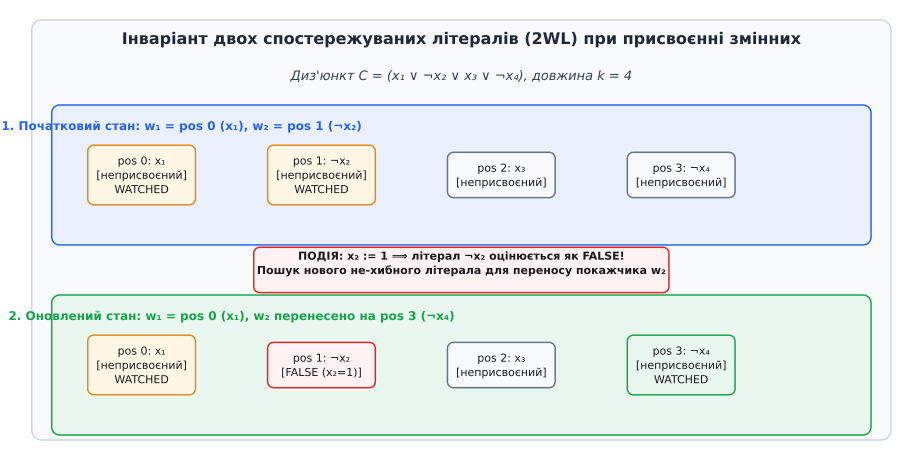
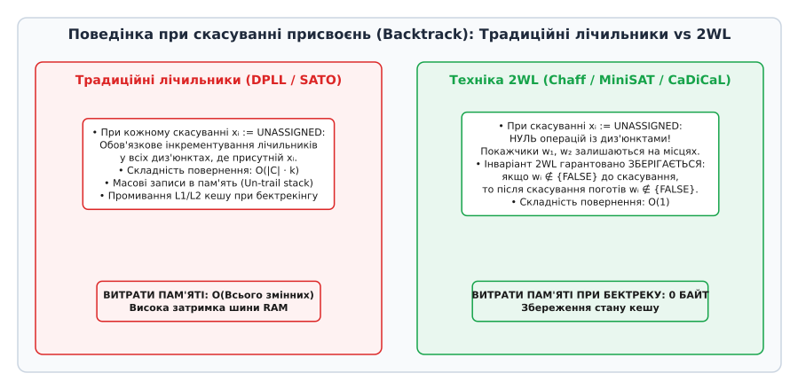
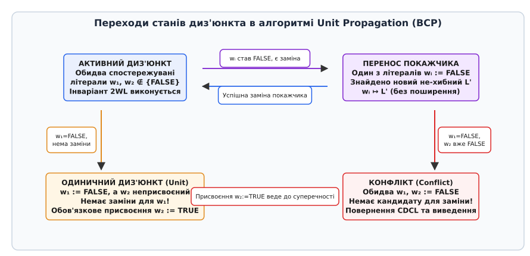

# Техніка двох спостережуваних літералів (Watched Literals)

<preknowlist>
- [Диз'юнктивні та кон'юнктивні нормальні форми (ДНФ і КНФ)](topic:algorithms/dnf-cnf) — структура КНФ-формул, літерали, диз'юнкти та кон'юнкції.
- [Перетворення Цейтіна](topic:algorithms/tseytin-transformation) — лінійна за розміром побудова КНФ для довільної булевої формули.
- [Алгоритми DPLL та CDCL у SAT-солверах](topic:algorithms/dpll-cdcl) — алгоритмічна рамка розв'язування задач здійсненності та керована конфліктами вибіркова вивідність.
- [Амортизований аналіз](topic:algorithms/amortized-analysis) — оцінка середньої вартості послідовності операцій у найгіршому випадку.
</preknowlist>

У сучасних системах автоматизованої верифікації мікропроцесорів, доведення коректності криптографічних протоколів та синтезу складних програмних комплексів КНФ-формули задачі здійсненності булевих виразів (SAT) легко сягають розмірів у 1 500 000 диз'юнктів (від лат. *disjunctus* — роз'єднаний) та понад 400 000 змінних. У класичних SAT-солверах на базі алгоритму DPLL кожне надання значення одній-єдиній змінній вимагало перегляду й оновлення лічильників у десятках тисяч диз'юнктів, а кожен крок повернення (backtracking) за деревом пошуку змушував відновлювати мільйони попередніх станів у пам'яті. Цей безперервний перезапис осередків поглинав від 85% до 90% усього часу виконання програми, перетворюючи системну шину RAM на критичне вузьке місце. З появою техніки двох спостережуваних літералів (Two-Watched Literals, або 2WL) ця обчислювальна перешкода була усунена: трудомісткість обслуговування бази даних диз'юнктів при бектрекінгу була зведена до абсолютної нульової вартості `O(1)`.

## Проблема класичного оцінювання диз'юнктів у SAT-пошуку

Щоб зрозуміти глибоку причинно-наслідкову мотивацію виникнення техніки спостережуваних літералів, необхідно проаналізувати роботу традиційного алгоритму DPLL (Davis-Putnam-Logemann-Loveland). Нехай дано КНФ-формулу `F`, яка є кон'юнкцією диз'юнктів, побудованих із літералів (від лат. *littera* — буква, змінна або її заперечення). Процес пошуку виконує послідовний вибір змінних, призначає їм значення True (1) або False (0) та запускає процедуру поширення одиничних диз'юнктів — Unit Propagation, або Boolean Constraint Propagation (BCP).

Одиничним диз'юнктом (unit clause) називається диз'юнкт, у якому під поточним частковим присвоєнням усі літерали, крім одного, вже оцінені як False, а один літерал залишається неприсвоєним (Unassigned). Оскільки для здійсненності формули `F` кожен її диз'юнкт мусить бути істинним, цей єдиний неприсвоєний літерал зобов'язаний набути значення True. Таке вимушене присвоєння викликає ланцюгову реакцію: інші диз'юнкти формули перетворюються на одиничні, що породжує нові хвилі поширення обмежень.

У ранніх SAT-солверах для відстеження стану диз'юнкта довжиною `k` застосовували дві основні структури даних:
- **Динамічні лічильники станів:** Для кожного диз'юнкта в пам'яті виділяли два цілочисельні лічильники: `satisfied_count` (кількість літералів у стані True) та `false_count` (кількість літералів у стані False). Диз'юнкт вважався задоволеним при `satisfied_count > 0`, одиничним — при `satisfied_count = 0` та `false_count = k - 1`, і конфліктним — при `false_count = k`.
- **Списки входжень (Occurrence Lists):** Для кожного літерала `L` підтримувався масив `Occurs[L]`, який містив посилання на всі диз'юнкти формули, де цей літерал фігурував.

Коли змінна `x[i]` отримувала значення True, її заперечення `¬x[i]` ставало False. Солвер проходив по всьому списку `Occurs[¬x[i]]` та інкрементував `false_count` у кожному знайденому диз'юнкті. Якщо під час інкрементування лічильник ставав рівним `k - 1`, даний диз'юнкт додавався до черги поширення як одиничний.

Справжньою катастрофою для продуктивності був крок повернення за деревом пошуку (backtracking). Коли алгоритм потрапляв у конфліктний тупик і скасовував присвоєння змінної `x[i]` (повертаючи її в стан Unassigned), він був змушений повторно ітеруватися по всьому списку `Occurs[¬x[i]]` та декрементувати `false_count` для кожного диз'юнкта.

Розглянемо числовий масштаб цієї проблеми: якщо КНФ-формула містить 1 000 000 диз'юнктів середньою довжиною `k = 5`, загальна кількість входжень літералів становить 5 000 000. При кожній зміні напрямку пошуку в дереві рішень солвер виконує скасування десятків тисяч змінних. Це змушувало програму здійснювати мільйони операцій читання та запису в лічильники пам'яті. З погляду мікроархітектури сучасного центрального процесора (CPU), кожен такий запис у неперервно оновлювані лічильники призводив до викидання кеш-ліній із кешу L1/L2 та спричиняв затримки (stalls) виконання інструкцій тривалістю 100–200 тактів через очікування відповіді від оперативної пам'яті (RAM).

Оскільки в процесі розв'язання складних індустріальних задач дерево пошуку містить мільйони вузлів і безперервно виконує скасування глибоких гілок, процесор витрачав колосальний ресурс на модифікацію лічильників. Кількість оновлень осередків пам'яті була пропорційною до загальної кількості входжень літералів у формулі `L = ∑ k_j`. У результаті кеш-пам'ять процесора L1/L2 постійно промивалася операціями запису, а пропускна здатність оперативної пам'яті ставала головним гальмом алгоритму. Детальний хронологічний огляд еволюції методів відстеження диз'юнктів наведено в [історичному екскурсі](topic:algorithms/watched-literals/hist-two-watched-literals.md).

## Фундаментальний інваріант двох спостережуваних літералів

Головне алгоритмічне відкриття техніки двох спостережуваних літералів полягає у відмові від ідеї повного контролю стану всіх `k` літералів у диз'юнкті. Для коректного виявлення одиничних диз'юнктів та конфліктів солверу взагалі не потрібно знати точний стан кожного з `k` елементів.

Для довільного незадоволеного диз'юнкта довжиною `k ≥ 2` достатньо обрати та спостерігати (watch) рівно **два** виділені літерали. Стан решти `k - 2` літералів диз'юнкта алгоритм може повністю ігнорувати.

**Інваріант двох спостережуваних літералів (2WL Invariant):**
У кожному незадоволеному диз'юнкті `C`, що містить принаймні два літерали (`k ≥ 2`), покажчики спостереження `w[1]` та `w[2]` вказують на два виділені елементи цього диз'юнкта, які за поточного часткового присвоєння **не є хибними** (тобто перебувають у стані Unassigned або True).

З цього фундаментального інваріанту (від лат. *invarians* — незмінний) випливають три ключові математичні стани диз'юнкта:

1. **Стан ігнорування (Пасивний стан):** Доки обидва спостережувані літерали `w[1]` та `w[2]` залишаються не-хибними (`w[1], w[2] ∉ {False}`), диз'юнкт **гарантовано не може** бути ані одиничним, ані конфліктним. Навіть якщо всі інші `k - 2` літерали диз'юнкта набудуть значення False, наявність принаймні двох не-хибних елементів забезпечує, що в диз'юнкті є як мінімум два потенційні джерела істинності.
2. **Умова виникнення одиничного диз'юнкта (Unit Clause):** Диз'юнкт перетворюється на одиничний тоді й лише тоді, коли один зі спостережуваних літералів (наприклад, `w[1]`) стає False, а при лінійному скануванні решти `k - 1` літералів диз'юнкта **не вдається знайти жодного іншого** не-хибного літерала для заміни `w[1]`, причому другий спостережуваний літерал `w[2]` є Unassigned. У цьому випадку літерал `w[2]` вимушено присвоюється як True.
3. **Умова виникнення конфлікту (Conflict):** Якщо один зі спостережуваних літералів `w[1]` стає False, спроба знайти йому заміну серед інших літералів зазнає невдачі, а другий спостережуваний літерал `w[2]` **вже оцінений як False**, диз'юнкт є повністю обнуленим (усі його літерали False). Це фіксує виникнення суперечності.

Математична обґрунтованість цього інваріанту спирається на логічну еквівалентність: щоб диз'юнкт із `k` елементів перетворився на одиничний під дією часткового присвоєння `α`, у ньому має залишитися строго один не-хибний літерал. Якщо ж у диз'юнкті є хоча б два не-хибних літерали, кількість хибних літералів не перевищує `k - 2`, а отже, диз'юнкт не може викликати поширення. Таким чином, спостереження за довільною парою не-хибних літералів є достатньою і необхідною умовою для фіксації моментів перехода в одиничний стан.

Строгі формальні доведення інваріантних переходів та аналіз простору присвоєнь викладено в [математичній вставці 2WL](topic:algorithms/watched-literals/math-watched-literals-invariant.md).

```
Диз'юнкт C = (L[0] ∨ L[1] ∨ L[2] ∨ ... ∨ L[k-1])
            ↑        ↑
          w[1]     w[2]     [Решта k-2 літералів повністю ігноруються]
```

Оскільки покажчики спостереження прив'язані лише до двох елементів, солвер не відвідує даний диз'юнкт при зміні значень тих `k - 2` літералів, які не перебувають під спостереженням. Перевірка диз'юнкта ініціюється виключно тоді, коли значення одного з двох спостережуваних літералів змінюється на False.


*Схема інваріанту 2WL: при зміні значення спостережуваного літерала на False алгоритм здійснює перенос покажчика на новий не-хибний літерал.*

## Механіка оновлення покажчиків при присвоєнні

Для забезпечення швидкого доступу в пам'яті створюються інвертовані списки спостереження (watch lists). Для кожного літерала `L` підтримується масив `watches[L]`, який містить посилання на всі диз'юнкти, де літерал `L` наразі слугує першим або другим спостережуваним літералом (`w[1]` або `w[2]`).

Коли в ході роботи процедури BCP літерал `p` отримує значення True, його заперечення `¬p` оцінюється як False. Солвер зобов'язаний обробити лише той список диз'юнктів, який спостерігає за хибним літералом `¬p` — тобто `watches[¬p]`.

Послідовність дій для кожного диз'юнкта `C` у списку `watches[¬p]` виконується за таким алгоритмом:

```
[Подія: літерал ¬p оцінено як False]
 1. Нормалізація: якщо хибний літерал ¬p перебуває в позиції w[2],
    поміняти місцями покажчики w[1] та w[2], щоб хибний літерал завжди був у w[1].
 2. Перевірка другого спостережуваного літерала w[2]:
    - Якщо w[2] == True:
        [Диз'юнкт уже задоволений!] Залишити покажчики без змін і перейти до наступного диз'юнкта.
 3. Сканування альтернатив: проітеруватися по неспостережуваних літералах L[i] (від індексу 2 до k-1):
    - Якщо знайдено літерал L[i] ∉ {False} (Unassigned або True):
        [Успішна заміна знайдена!]
        a. Переставити елементи місцями: swap(C.literals[0], C.literals[i]).
        b. Видалити диз'юнкт C зі списку watches[¬p].
        c. Додати диз'юнкт C до списку watches[L[i]].
        d. Завершити обробку диз'юнкта C (інваріант 2WL відновлено).
 4. Якщо жодної заміни не знайдено (усі решта k-2 літералів оцінені як False):
    - [Заміни немає, інваріант невідновний]
    - Якщо w[2] == Unassigned:
        [Виявлено одиничний диз'юнкт!]
        Додати вимушене присвоєння w[2] := True до черги поширення (propagation queue).
    - Якщо w[2] == False:
        [Виявлено конфлікт!]
        Повернути вказівник на конфліктний диз'юнкт C і перервати BCP.
```

Важливою деталлю реалізації є підтримка інваріанту фізичного розташування літералів: спостережувані літерали завжди зберігаються за індексами 0 та 1 у масиві диз'юнкта. Перестановка `swap(C.literals[0], C.literals[i])` гарантує, що процедура перевірки завжди звертається до `w[1]` та `w[2]` за фіксованими індексами `0` та `1` без використання додаткових нелокальних покажчиків.

Розглянемо практичний приклад: нехай диз'юнкт `C = (x1 ∨ x2 ∨ x3 ∨ x4)` має спостережувані літерали `w[1] = x1` (індекс 0) та `w[2] = x2` (індекс 1). Якщо зміна стану надає значення `x1 := 0`, літерал `x1` стає False. Солвер відкриває диз'юнкт `C`, перевіряє `w[2] = x2`. Якщо `x2` є Unassigned, алгоритм сканує елементи починаючи з індексу 2. Знайшовши `x3` у стані Unassigned, він виконує `swap(literals[0], literals[2])`, перетворюючи масив диз'юнкта на `(x3 ∨ x2 ∨ x1 ∨ x4)`. Після цього диз'юнкт видаляється зі списку `watches[x1]` і переноситься до списку `watches[x3]`.

Повний вихідний код двигуна BCP з обробкою списків спостереження мовами C та C++ наведено у [практичному проєкті](topic:algorithms/watched-literals/proj-watched-literals-engine.md).

## Асинхронний бектрекінг без запису в пам'ять (Lazy Backtracking)

Найважливішим системним досягненням 2WL є абсолютна лінивість (laziness) під час скасування присвоєнь змінних під час бектрекінгу.

Уявімо процес пошуку в CDCL-солвері. Виявивши конфлікт, алгоритм будує резолюційний диз'юнкт, обчислює новий рівень рішення та скасовує присвоєння сотень або тисяч змінних, змінюючи їхній стан із True чи False назад на Unassigned.

**Що робить 2WL під час бектрекінгу?**
**Нічого.** Солвер взагалі **не здійснює жодних записів** у масиви диз'юнктів або списки спостереження `watches`.

Математичне пояснення збереження інваріанту при бектрекінгу:
Нехай до бектрекінгу диз'юнкт `C` мав спостережувані літерали `w[1]` та `w[2]`, які відповідали вимогам інваріанту (не були False). Зміна стану будь-якої змінної у формулі з True чи False на Unassigned **не здатна зробити жоден літерал хибним**. Літерал, який був Unassigned або True, під дією бектрекінгу може залишитися True або перетворитися на Unassigned. У кожному з цих випадків він залишається **не-хибним** (`∉ {False}`).

Це означає, що покажчики спостереження можуть залишатися на тих самих позиціях, куди вони перемістилися під час попередніх кроків пошуку. При переході до нової гілки дерева рішення ці покажчики є абсолютно коректними!

```
Традиційний підхід (лічильники):
[Backtrack x[i]] ──> [Сканувати Occurs[x[i]]] ──> [Записи в RAM: count--] (Повільно!)

Техніка 2WL:
[Backtrack x[i]] ──> [Зміна стану x[i] := Unassigned] ──> [Готово] (Нуль записів у диз'юнкти!)
```

Завдяки цьому вартість бектрекінгу для всієї структури диз'юнктів є строго нульовою — `O(1)` операцій на диз'юнкт. Специфікації інтерфейсів та формати даних деталізовано в [довіднику API для 2WL](topic:algorithms/watched-literals/api-watched-literals-interface.md).


*Порівняльна схема бектрекінгу: класичні лічильники вимагають масового оновлення пам'яті, тоді як 2WL не потребує жодних дій.*

## Автомат станів BCP та обробка спеціальних диз'юнктів

Під час поширення обмежень кожен диз'юнкт формули переходить між кількома станами, які утворюють автомат станів BCP.


*Автомат станів диз'юнкта під час проведення Boolean Constraint Propagation.*

У практичних застосуваннях виділяють три ключові оптимізації автомата BCP:

### 1. Дволітеральні диз'юнкти (Binary Clauses)
Диз'юнкти довжиною `k = 2` складають значну частку КНФ-формул (до 70–80% після Цейтін-перетворення). Для бінарного диз'юнкта `(L[1] ∨ L[2])` пошук альтернативного літерала за визначенням неможливий — у ньому відсутній третій елемент.

Для бінарних диз'юнктів сканування альтернатив (Крок 3) повністю виключають:
Якщо `w[1]` стає False, бінарний диз'юнкт миттєво викликає одиничне поширення `w[2] := True` або фіксує конфлікт (якщо `w[2]` вже False). Сучасні двигуни (Kissat, CaDiCaL) взагалі не виділяють об'єкти пам'яті під бінарні диз'юнкти, а зберігають їх безпосередньо у списку спостереження у вигляді пар `(¬L[1] → L[2])`.

### 2. Додавання вивчених диз'юнктів (Learned Clauses)
У CDCL-солверах під час аналізу конфлікту будується новий вивчений диз'юнкт. При його додаванні до бази покажчики `w[1]` та `w[2]` ініціалізують так:
- `w[1]` обирається як літерал з найвищим рівнем рішення (Asserting Literal / 1UIP).
- `w[2]` обирається як літерал з другим за величиною рівнем рішення.

Це забезпечує, що щойно створений вивчений диз'юнкт негайно перетворюється на одиничний на рівні повернення, викликаючи вимушене поширення без додаткового пошуку.

### 3. Видалення та збір сміття (Clause Elimination)
При періодичному видаленні неефективних вивчених диз'юнктів диз'юнкт видаляється зі списків `watches[w[1]]` та `watches[w[2]]`. Оскільки решта літералів диз'юнкта не спостерігається, жодних інших списків коригувати не потрібно.

## Апаратно-орієнтовані оптимізації: Blocking Literals та кеш-локальність

У первинній версії 2WL існувала проблема нелокального доступу до пам'яті: під час ітерації по списку `watches[¬p]` солвер мусив розіменовувати вказівник на кожен диз'юнкт `C`, щоб перевірити стан `w[2]`. Оскільки диз'юнкти розкидані по купі, це спричиняло значну кількість промахів кешу L1/L2.

У 2003 році в солвері MiniSAT було застосовано оптимізацію **блокуючого літерала (Blocking Literal)**.

Замість зберігання у списку `watches[¬p]` лише вказівника на диз'юнкт, кожна комірка списку зберігає дві величини:

```cpp
struct Watcher {
    ClauseRef clause;        // Вказівник або 32-бітний індекс диз'юнкта у пам'яті
    Literal   blocker;       // Блокуючий літерал (копія другого спостережуваного літерала)
};
```

**Принцип дії блокуючого літерала:**
У полі `blocker` зберігається значення літерала `w[2]`. Під час ітерації по `watches[¬p]` солвер спершу перевіряє стан `blocker` безпосередньо в неперервному масиві списку спостереження (без розіменування вказівника `clause`):
- Якщо `value(blocker) == True`, диз'юнкт уже є істинним. Солвер **не розіменовує** вказівник `clause` і негайно переходить до наступного диз'юнкта.

Оскільки під час SAT-пошуку більшість диз'юнктів виявляються задоволеними саме другим спостережуваним літералом, `blocker` відсікає до 75–85% промахів кешу, прискорюючи BCP у 2–3 рази.

Додатково в сучасних високоефективних двигунах розробники об'єднують базу диз'юнктів у єдиний суцільний масив байтів (flat array), де кожен диз'юнкт вирівнюється за 32-бітною межею. Це дозволяє апаратному префетчеру процесора заздалегідь завантажувати наступні диз'юнкти у L1-кеш ще до того, як цикл обробки звернеться до них. Для ще вищої продуктивності у новітніх двигунах застосовують векторні інструкції SIMD (AVX2/AVX-512) для одночасного сканування 8 або 16 32-бітних літералів диз'юнкта при пошуку альтернативного кандидату на заміну.

## Взаємодія 2WL з евристиками вибору змінних (VSIDS) та структурами Trail/Reason

Важливою складовою CDCL-архітектури є взаємодія між механізмом 2WL та стеком присвоєнь (Trail stack), масивом причин (Reason array) і евристиками пріоритету змінних (VSIDS — Variable State Independent Decaying Sum).

Коли процедура BCP здійснює вимушене одиничне поширення літерала `L`, у масиві стеку `trail` фіксується факт присвоєння літерала `L`. Одночасно в масиві `reason[var(L)]` записується вказівник `ClauseRef` на той диз'юнкт `C`, який викликав це поширення.

При виникненні конфлікту алгоритм аналізу конфлікту (Conflict Analysis) використовує масив `reason` для побудови графа імплікацій (Implication Graph):
- Рухаючись назад від конфліктного диз'юнкта, алгоритм розіменовує `reason[var]`, щоб отримати диз'юнкти, що зумовили вимушені кроки.
- 2WL забезпечує, що при отриманні `reason[var]` диз'юнкт `C` містить указівники `w[1]` та `w[2]` у стані, де `w[1]` є вимушеним літералом, а решта елементів оцінені як False. Це дозволяє проводити резолюційні кроки без додаткового пошуку вихідних умов.

Одночасно евристика VSIDS збільшує оцінку евристичної активності (activity score) для всіх літералів, які брали участь у резолюційному виведенні конфліктного диз'юнкта. При цьому 2WL не потребує жодних змін у списках спостереження при зміні евристичних балів змінних.

## Вплив на інваріант при нехронологічному бектрекінгу (Backjumping)

На відміну від класичного алгоритму DPLL, який скасовує рішення покроково (хронологічно, рівень за рівнем), сучасні CDCL-солвери виконують **нехронологічне повернення (Backjumping)**. Виявивши конфлікт на рівні рішення, наприклад, 50, аналіз конфлікту може встановити, що причиною суперечності стала комбінація рішений з рівнів 3 та 12. У цьому випадку алгоритм негайно здійснює стрибок назад з рівня 50 безпосередньо на рівень 12, скасовуючи присвоєння для всіх змінних, прийнятих на рівнях від 13 до 50 включно.

**Як поводиться 2WL при нехронологічному стрибку через 38 рівнів?**
Унікальна стійкість 2WL полягає в тому, що навіть при вилученні цілих блоків рішень інваріант 2WL **не порушується жодним чином**. Зміна стану змінних з рівня 13 до 50 з True/False на Unassigned є банальним розширенням множини не-хибних літералів. Оскільки покажчики `w[1]` та `w[2]` вказували на не-хибні літерали на рівні 50, вони залишаються строго не-хибними і на рівні 12. Жодного коригування списків `watches` при стрибках через довільну кількість рівнів не потрібно!

## Порівняльний аналіз 2WL з альтернативними інваріантами

Щоб оцінити унікальність 2WL, порівняємо його з двома конкуруючими підходами до відстеження диз'юнктів:

### 1. Головно-хвостові покажчики (Head-Tail Pointers / SATO, 1997)
У солвері SATO (Хантао Чжан) для диз'юнкта використовували два покажчики: `head` (вказував на перший не-хибний літерал з початку диз'юнкта) та `tail` (вказував на перший не-хибний літерал з кінця диз'юнкта).
- **Слабке місце Head-Tail:** Під час бектрекінгу покажчики `head` та `tail` були змушені зміщуватися **назад** до вихідних позицій, щоб відновлювати коректне охоплення. Це вимагало збереження історії операцій бектреку та спричиняло додаткові записи у пам'ять `O(depth)`. 2WL усунув цю вимогу, зробивши рух покажчиків строго однонапрямленим під час пошуку та незмінним під час повернення.

### 2. Багатоспостережувальні літерали (Multi-Watched Literals / 3WL / PB Constraints)
Для звичайних КНФ-диз'юнктів 2WL є математично мінімальним і достатнім інваріантом (`k ≥ 2`). Проте при розв'язанні задач із псевдобулевими обмеженнями (Pseudo-Boolean constraints) вигляду `∑ a_i x_i ≥ K` або обмеженнями потужності (cardinality constraints) двох спостережуваних літералів недостатньо. Для обмеження з порогом `K` потрібно спостерігати `K + 1` літерал. У цьому випадку алгоритм узагальнюється до `(K+1)-Watched Literals`, зберігаючи ліниву властивість бектрекінгу.

## Паралельний BCP та багатопотокові SAT-солвери

Сучасні SAT-солвери для багатоядерних систем застосовують паралельні підходи: Portfolio (запуск кількох екземплярів 2WL з різними евристиками) та Cube-and-Conquer (розбиття простору пошуку на куби з подальшим паралельним CDCL).

При обміні вивченими диз'юнктами між паралельними потоками 2WL грає вирішальну роль:
- Потік-емітер надсилає новий вивчений диз'юнкт разом із двома виділеними спостережуваними літералами `w[1], w[2]`.
- Потік-приймач вставляє отриманий диз'юнкт у свої власні списки `watches[w[1]]` та `watches[w[2]]` за допомогою блокувальних або lock-free операцій над списком.
- Оскільки бектрекінг у потоці-приймачі не змінює покажчиків 2WL, отриманий диз'юнкт не потребує синхронізації при поверненнях за деревом рішень, що виключає стан гонки (data race).

## Амортизований аналіз і ресурсомісткість

Проведемо порівняльний аналіз складності обробки КНФ-формули з `m` диз'юнктів загальною довжиною `L = ∑ k_j` та `n` змінними за допомогою амортизованого аналізу.

| Критерій оцінки | Класичні лічильники | Техніка 2WL |
| :--- | :--- | :--- |
| **Складність прямих присвоєнь** | `O(∑ Occurs[¬p])` — перевірка всіх диз'юнктів | `O(∑ watches[¬p])` — лише ті, де `¬p` спостерігається |
| **Кількість оновлюваних диз'юнктів** | Усі диз'юнкти з літералом `¬p` | У середньому `2m / (2n) = m / n` диз'юнктів |
| **Складність скасування (Backtrack)** | `O(∑ Occurs[¬p])` на кожен крок бектреку | **`O(1)`** — нуль операцій із диз'юнктами |
| **Обсяг записаних байтів при бектреку** | `O(N_back · L_active)` записів у пам'ять | **`0` байтів** |
| **Промахи кешу L1/L2 при BCP** | Високі (постійне оновлення лічильників) | Мінімальні (завдяки `blocking_literal`) |

Амортизована вартість переміщення покажчика спостереження всередині диз'юнкта довжиною `k` за весь час пошуку обмежена числом `k`. Оскільки покажчик рухається в одному напрямку при пошуку не-хибного літерала, кожен елемент диз'юнкта перевіряється константну кількість разів між бектреками.

З погляду методу потенціалів (Potential Method), призначимо кожному диз'юнкту `C_j` потенціал `Ф(C_j)`, що дорівнює відстані від поточного покажчика `w[1]` до кінця масиву диз'юнкта `k_j - 1`. Загальний потенціал системи `Ф = ∑ Ф(C_j)` задовольняє умови `Ф ≥ 0`. При виконанні бектреку потенціал `Ф` не змінюється (бо покажчики залишаються на місці), а при русі покажчика вперед на одну позицію потенціал зменшується на 1, компенсуючи константні витрати на перевірку літерала.

Детальний підрахунок потенціалу структури подано у [математичній вставці 2WL](topic:algorithms/watched-literals/math-watched-literals-invariant.md).

## Детальний розбір алгоритму вибору початкових спостережуваних літералів

При завантаженні КНФ-формули з файлу в форматі DIMACS CNF або при створенні диз'юнктів під час перетворення Цейтіна солвер зобов'язаний первинно ініціалізувати покажчики спостереження для кожного нового диз'юнкта.

Процедура ініціалізації диз'юнкта `C` з літералів `L[0], L[1], ..., L[k-1]` виконується за такими правилами:

1. **Диз'юнкти довжиною `k = 1` (Однолітеральні диз'юнкти / Unit Clauses):**
   Унарний диз'юнкт не має достатньо елементів для створення пари спостереження. Солвер не додає унарний диз'юнкт до баз 2WL. Натомість літерал `L[0]` одразу вміщується до черги поширення на базовому рівні рішення (Level 0). Це означає, що всі 1-диз'юнкти задовольняються ще до початку пошуку в дереві рішень.

2. **Диз'юнкти довжиною `k ≥ 2`:**
   Солвер вибирає перші два літерали `L[0]` та `L[1]` як початкові спостережувані літерали `w[1]` та `w[2]`.
   Диз'юнкт реєструється у двох списках спостереження: `watches[L[0]]` та `watches[L[1]]`.

У сучасних двигунах вибір початкових покажчиків додатково оптимізують за допомогою евристик:
- Вибирають літерали з найменшою кількістю вже призначених хибних значень.
- Якщо частина літералів уже оцінена на вищих рівнях рішення, спостережувані покажчики призначають на літерали з найбільшим рівнем рішення (найпізніші у стеку присвоєнь). Це гарантує, що при майбутньому бектрекінгу покажчики не доведеться змінювати передчасно.

## Динамічний простежувальний приклад (Execution Trace)

Розглянемо роботу 2WL на конкретному прикладі КНФ-формули з 4 змінних та 3 диз'юнктів:

```
C1 = (x1 ∨ x2 ∨ x3)
C2 = (¬x1 ∨ x4)
C3 = (¬x2 ∨ ¬x3 ∨ ¬x4)
```

**Початковий стан (Рівень 0):**
- Усі змінні `x1, x2, x3, x4` у стані Unassigned.
- `C1`: `w[1] = x1`, `w[2] = x2`. Зареєстровано у `watches[x1]` та `watches[x2]`.
- `C2`: `w[1] = ¬x1`, `w[2] = x4`. Зареєстровано у `watches[¬x1]` та `watches[x4]`.
- `C3`: `w[1] = ¬x2`, `w[2] = ¬x3`. Зареєстровано у `watches[¬x2]` та `watches[¬x3]`.

**Крок 1: Прийняття рішення `x1 := 1` (Рівень 1):**
- Оскільки `x1` став True, протилежний літерал `¬x1` оцінюється як False.
- Солвер викликає BCP і перевіряє список `watches[¬x1]`. У ньому перебуває диз'юнкт `C2`.
- У `C2` хибний літерал `w[1] = ¬x1`. Другий покажчик `w[2] = x4` є Unassigned.
- Алгоритм шукає заміну для `¬x1` серед інших літералів `C2`. Оскільки довжина `k = 2`, заміни немає.
- Оскільки `w[2] = x4` є Unassigned, диз'юнкт `C2` фіксується як **одиничний**!
- Двигун вимушено додає `x4 := 1` до черги поширення (на рівні рішення 1).

**Крок 2: Поширення вимушеного рішення `x4 := 1`:**
- Літерал `x4` стає True, отже `¬x4` стає False.
- Солвер відкриває список `watches[¬x4]`. Спочатку `C3` там немає, бо `C3` спостерігає `¬x2` та `¬x3`.
- Припускаємо, що наступним рішенням є `x2 := 1` (Рівень 2).

**Крок 3: Прийняття рішення `x2 := 1` (Рівень 2):**
- `¬x2` стає False. Солвер перевіряє `watches[¬x2]`, де перебуває `C3`.
- У `C3`: `w[1] = ¬x2` (False), `w[2] = ¬x3` (Unassigned).
- Алгоритм шукає заміну серед решти літералів `C3`. На індексі 2 перебуває літерал `¬x4`. Але `x4 = 1`, тому `¬x4` є **False**!
- Заміни не знайдено! Диз'юнкт `C3` фіксується як **одиничний**, вимагаючи `¬x3 := 1`, тобто `x3 := 0`.

**Крок 4: Вхід у конфлікт при поширенні `x3 := 0`:**
- `x3 := 0` означає, що літерал `x3` в `C1` став False!
- Солвер перевіряє `C1 = (x1 ∨ x2 ∨ x3)`. У `C1`: `w[1] = x1` (True, бо `x1=1`), `w[2] = x2` (True, бо `x2=1`).
- Оскільки `w[1] = True`, диз'юнкт `C1` є задоволеним! `x3` навіть не був під спостереженням, тому `C1` **взагалі не відвідувався**.

**Крок 5: Повернення (Backtrack з Рівня 2 на Рівень 1):**
- Скасовуються присвоєння `x3 := Unassigned`, `x2 := Unassigned`.
- Усі списки спостереження `watches` та покажчики `w[1], w[2]` залишаються в точності на своїх місцях. Ніяких відновлень станів у пам'яті!

Цей покроковий сценарій наочно демонструє, як 2WL виключає марні перевірки задоволених диз'юнктів та забезпечує нульові витрати на бектрекінг.

> 🔧 **Навіщо це.**
> Техніка 2WL є основою всіх сучасних SAT-солверів (CaDiCaL, Kissat, Z3, CVC5, MiniSAT) та SMT-систем. Без неї індустріальна автоматизована верифікація мікропроцесорів (Intel, AMD, ARM), верифікація критичного програмного забезпечення та автоматичний розв'язок залежностей у менеджерах пакувальників (Cargo у Rust, Pip у Python, Apt у Debian) були б неможливими. 2WL дозволяє обробляти понад 10 000 000 поширень одиничних диз'юнктів за секунду на одному процесорному ядрі.
