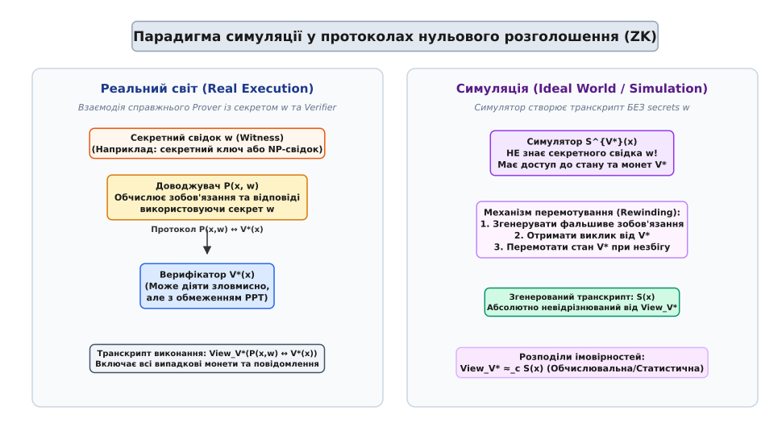
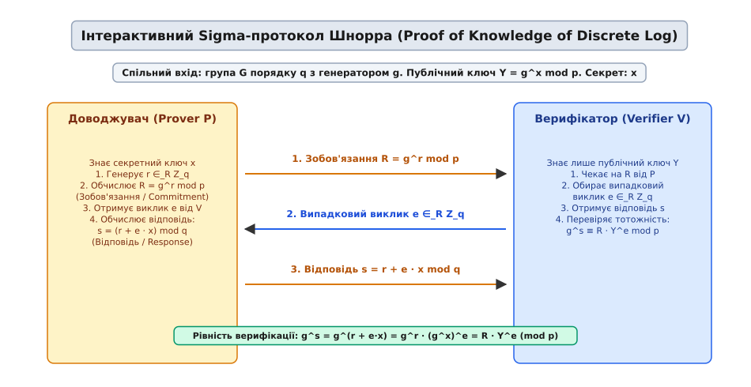
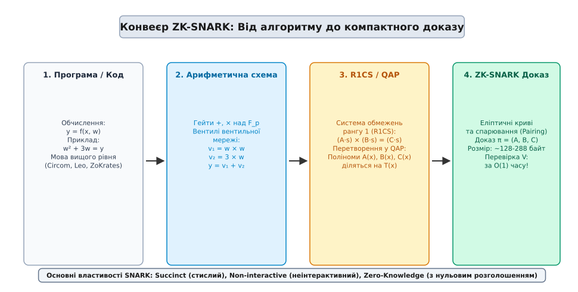

# Протоколи нульового розголошення

<preknowlist>
- [Ігри Артура — Мерліна](topic:algorithms/arthur-merlin-games) — інтерактивні доказові системи, монети випадковості та роль доводжувача й верифікатора.
- [Клас BPP](topic:algorithms/bpp) — імовірнісні обчислення поліноміального часу (PPT) та границі помилок прийняття.
- [Класи P і NP та NP-повнота](topic:algorithms/np-completeness) — поняття мов L ∈ NP, NP-повнота та поліноміальні зведення.
- [Евристика Фіата — Шаміра](topic:algorithms/fiat-shamir-transform) — трансформація інтерактивних протоколів у неінтерактивні за допомогою хеш-функцій.
- [Скінченні поля](topic:algorithms/finite-field-arithmetic) — модульна арифметика, групи еліптичних кривих та алгебраїчні структури.
</preknowlist>

Коли банківський сервер перевіряє користувача за допомогою пароля з 16 символів, передача чистого пароля або його MD5-хешу через мережу створює фундаментальну проблему безпеки: будь-який проміжний вузол, що перехоплює трафік, отримує можливість використати отриманий секрет для несанкціонованого входу. Навіть якщо сервер зберігає хеш пароля й порівнює його з надісланим значенням, користувач змушений щоразу віддавати сам секрет, довіряючи безпеці сервера. Якщо сервер буде зламано, усі збережені секрети опиняться в руках нападника. Усунення цієї залежності вимагає математичного механізму, який дозволяє довести факт володіння секретом `w` без передачі жодного біта інформації про сам секрет `w`.

Протоколи нульового розголошення (англ. *zero-knowledge proofs*, ZKP) вирішують цю задачу фундаментальним чином: вони перетворюють доведення з передачі вмісту на криптографічний інтерактивний процес. Доводжувач переконує верифікатора в істинності твердження, не залишаючи верифікатору жодних слідів, які той міг би використати для переконання третьої сторони або для відтворення самого секрету.

Про те, як виникла ця ідея, які наукові дискусії вона спричинила у 1980-х роках і як перетворилася з відхиленої тричі статті на премію Тюринга, розповідає [історичний екскурс](topic:algorithms/zero-knowledge-proofs/hist-zkp-origins.md).

## 1. Фундаментальні аксіоми доведень з нульовим розголошенням

Математично доведення з нульовим розголошенням — це інтерактивний протокол між двома імовірнісними машинами Тюринга поліноміального часу (PPT): доводжувачем (англ. *prover*, `P`) та верифікатором (англ. *verifier*, `V`). Вони мають спільний вхід `x`, який фіксує публічне твердження (наприклад, графічну структуру або публічний ключ). Доводжувач додатково володіє приватним свідком `w` (англ. *witness*, лат. *testis* — свідок), який підтверджує належність `x` до мови `L ∈ NP`.

Будь-який валідний протокол нульового розголошення повинен одночасно задовольняти три фундаментальні властивості.

### 1. Повнота (Completeness)

Якщо твердження `x ∈ L` є істинним, а доводжувач `P` та верифікатор `V` сумлінно дотримуються інструкцій протоколу, то верифікатор завжди приймає доказ з високою імовірністю (ідеально — з імовірністю `1`):

```
Pr[ (P(x, w) ↔ V(x)) = Accept ] = 1
```

Повнота гарантує, що чесний доводжувач, який дійсно володіє секретом `w`, ніколи не буде безпідставно відхилений чесним верифікатором. У практичних криптографічних системах будь-яке відхилення чесного доказу вважається дефектом повноти та усувається на етапі верифікації параметрів групи.

### 2. Надійність або обґрунтованість (Soundness)

Якщо твердження `x ∉ L` є хибним (або доводжувач `P*` не знає секрету `w`), то жоден зловмисний доводжувач `P*`, навіть маючи необмежену обчислювальну потужність, не зможе обдурити чесного верифікатора `V`, окрім як з нехтовно малою імовірністю `ε(n)`:

```
Pr[ (P*(x) ↔ V(x)) = Accept ] ≤ ε(n)
```

Величина `ε(n)` називається помилкою надійності (англ. *soundness error*). Завдяки повторенню протоколу `k` разів помилка надійності зменшується за експоненційним законом `(1/2)ᵏ`, що дозволяє досягти довільно високого рівня безпеки.

У теорії доказів знань (англ. *Proofs of Knowledge*) надійність посилюють до вимоги існування екстрактора знань (англ. *knowledge extractor*): якщо доводжувач проходить перевірку з помітною імовірністю, з його поведінки можна ефективно вилучити сам секрет `w`.

### 3. Нульове розголошення (Zero-Knowledge)

Якщо твердження `x ∈ L` є істинним, то жоден зловмисний верифікатор `V*` поліноміального часу не дізнається з взаємодії нічого, окрім самого факту істинності твердження.

Ця властивість формалізується через парадигму симуляції (англ. *simulation paradigm*): для кожного верифікатора `V*` існує ефективний імовірнісний алгоритм поліноміального часу — симулятор `S` (лат. *simulator* — той, що імітує), який, маючи доступ лише до публічного входу `x` (і **не маючи** доступу до секрету `w`), здатний згенерувати стенограму розмови, що за розподілом імовірностей не відрізняється від реальної взаємодії `P` та `V*`.

Детальний математичний апарат статистичної відстані, класифікація формальних розподілів та редукція розрізненності наведені у [математичному аналізі парадигми симуляції](topic:algorithms/zero-knowledge-proofs/math-simulation-paradigm.md).


*Порівняння реального виконання протоколу між доводжувачем та верифікатором із побудовою еквівалентного транскрипту ідеальним симулятором без використання секрету.*

## 2. Парадигма симуляції та перемотування

Причина, чому існування симулятора доводить відсутність витоку знань, полягає в логічному висновку: якщо верифікатор міг самостійно згенерувати точно такий самий запис розмови на своєму власному комп'ютері, не спілкуючись ні з ким, то перегляд цього запису під час реального діалогу не дає йому жодної нової інформації.

Постає природне запитання: як симулятор може створити валідну стенограму, якщо він **не знає** секрету `w`, а доведення є надійним?

Відповідь полягає у суперсилі, яку отримує симулятор відносно верифікатора `V*`. Під час симуляції симулятор запускає програму верифікатора `V*` у віртуальному середовищі (як симулятор або інспектор процесу). Це надає симулятору два критичних привілеї:
1. Симулятор може повністю читати та контролювати випадкові монети (англ. *random tape*) верифікатора `V*`.
2. Симулятор може **перемотувати** (англ. *rewind*) внутрішній стан верифікатора назад у часі до будь-якої попередньої точки виконання.

Завдяки перемотуванню симулятор здатний діяти «задом наперед»: він спочатку обирає випадкову відповідь і майбутній виклик верифікатора, підганяє під них перше зобов'язання, і лише потім показує це зобов'язання верифікатору. Якщо верифікатор видає не той виклик, на який розраховував симулятор, симулятор просто перемотує стан верифікатора назад і повторює спробу.

З точки зору третьої сторони, згенерований симулятором запис є абсолютно невідрізнюваним від справжньої розмови. Проте верифікатор не може передати цей запис як доказ іншим: будь-хто скаже верифікатору, що той міг сам згенерувати цей запис за допомогою симулятора.

## 3. Базові протоколи: від геометрії до криптографії

Щоб зрозуміти механізм роботи ZKP у ділі, розглянемо два класичних приклади: інтерактивний протокол для неізоморфізму графів та Sigma-протокол Шнорра для дискретного логарифма.

### Графовий ізоморфізм (Graph Isomorphism)

Нехай є два графи `G₀ = (V, E₀)` та `G₁ = (V, E₁)` з однаковою кількістю вершин `n`. Доводжувач `P` стверджує, що він знає ізоморфізм — таку перестановку вершин `π ∈ Sₙ`, що `π(G₀) = G₁`. Оскільки проблема пошуку ізоморфізму графів є обчислювально важкою, факт володіння `π` є секретом `w`.

Протокол складається з трьох повторюваних кроків:

1. **Зобов'язання (Commitment):** Доводжувач `P` обирає випадкову перестановку `σ ∈_R Sₙ` та будує виділений граф `H = σ(G₀)`. `P` відправляє граф `H` верифікатору `V`.
2. **Виклик (Challenge):** Верифікатор `V` підкидає випадкову монету та надсилає доводжувачу біт-виклик `b ∈_R {0, 1}`.
3. **Відповідь (Response):** 
   - Якщо `b = 0`, доводжувач розкриває перестановку `τ = σ`. Верифікатор перевіряє, що `τ(G₀) = H`.
   - Якщо `b = 1`, доводжувач розкриває перестановку `τ = σ ∘ π⁻¹`. Верифікатор перевіряє, що `τ(G₁) = H`.

Повнота очевидна: оскільки `H = σ(G₀) = σ(π⁻¹(G₁))`, доводжувач завжди здатний надати коректну перестановку для будь-якого `b ∈ {0, 1}`.

Надійність: якщо `G₀` та `G₁` не є ізоморфними, обманщик `P*` може побудувати граф `H`, ізоморфний лише одному з двох графів (наприклад, `G₀`). Тоді `P*` зможе відповісти лише на виклик `b = 0`. Якщо верифікатор вимагає `b = 1`, `P*` зазнає поразки. Імовірність обману за один раунд дорівнює `1/2`. Після `k` раундів імовірність успішного обману становить `(1/2)ᵏ`.

Нульове розголошення: на кожному раунді верифікатор бачить лише випадковий граф `H` та перестановку `τ`, яка пов'язує `H` з **одним** із двох графів. Оскільки випадкова перестановка випадкового графа не несе жодної інформації про зв'язок між `G₀` та `G₁`, верифікатор не дізнається про `π` абсолютно нічого.

### Протокол Шнорра (Schnorr Protocol)

Протокол Шнорра є основою сучасних криптографічних підписів та ідентифікаційних систем. Нехай `G` — група еліптичної кривої або підгрупа `Z_p*` простого порядку `q` з генератором `g`. Доводжувач знає секретний дискретний логарифм `x ∈ Z_q` (приватний ключ), а верифікатор знає лише публічний ключ `Y = gˣ mod p`.

Протокол виконується за схемою Sigma (3 кроки):

```
Доводжувач P(x)                               Верифікатор V(Y)
───────────────                               ────────────────
r ∈_R Z_q
R = gʳ mod p        ─── Зобов'язання R ───>

                    <─── Виклик e ∈_R Z_q ───

s = (r + e · x) mod q ─── Відповідь s ────>
                                              Перевіряє:
                                              gˢ ≡ R · Yᵉ (mod p)
```

Перевіримо алгебраїчну тотожність верифікації:

```
gˢ
= g^(r + e·x)           [зазначено формулу відповіді s]
= gʳ · (gˣ)ᵉ            [властивість показників степеня]
= R · Yᵉ  (mod p)       [заміна gʳ = R та gˣ = Y]
```

Рівність виконується тотожно для чесного доводжувача.

Програмну реалізацію протоколу Шнорра, симулятора та екстрактора знань мовами C та C++ подано у [практичному проекті реалізації Шнорра](topic:algorithms/zero-knowledge-proofs/proj-schnorr-zkp.md).


*Схема трьох кроків обміну повідомленнями (Commitment, Challenge, Response) у Sigma-протоколі Шнорра та рівняння перевірки.*

## 4. Теорема GMW: Нульове розголошення для всього класу NP

У 1986 році Одед Ґольдрейх, Сильвіо Мікалі та Аві Вігдерсон довели фундаментальний результат теоретичної інформатики — теорему GMW:

> **Теорема (GMW):** Якщо існують криптографічні зобов'язання (або однонаправлені функції), то будь-яка мова `L ∈ NP` має інтерактивний протокол з нульовим розголошенням.

Значення цієї теореми важко переоцінити. Клас NP включає тисячі складних комбінаторних задач: від розфарбування графів та знаходження Гамільтонових циклів до перевірки виконуваності булевих формул (SAT), розкладання чисел на множники та верифікації виконання довільного програмного коду.

Доведення теореми GMW спирається на поліноміальне зведення до NP-повної задачі розфарбування графа у 3 кольори (Г3К, Graph 3-Colorability):

1. **Завдання:** Доводжувач знає правильне 3-розфарбування графа `G = (V, E)`, тобто функцію `c: V → {1, 2, 3}`, таку що для кожного ребра `(u, v) ∈ E` виконується `c(u) ≠ c(v)`.
2. **Крок 1 (Зобов'язання):** Доводжувач випадковим чином вибирає перестановку трьох кольорів `ψ ∈ S₃`. Для кожної вершини `v ∈ V` він обчислює зашифрований колір `c'(v) = ψ(c(v))` і поміщає його в криптографічний «конверт» (схема криптографічного зобов'язання, англ. *bit commitment scheme*). Схема зобов'язань задовольняє дві вимоги: схову (англ. *hiding*, конверт не розкриває колір до відкриття) та зв'язування (англ. *binding*, доводжувач не може змінити вміст конверта після відправки). Доводжувач відправляє всі `|V|` запечатаних конвертів верифікатору.
3. **Крок 2 (Виклик):** Верифікатор обирає одне випадкове ребро `e = (u, v) ∈ E` і просить доводжувача відкрити конверти лише для вершин `u` та `v`.
4. **Крок 3 (Відповідь):** Доводжувач відкриває конверти для `u` та `v`. Верифікатор перевіряє, що обрані кольори є різними (`c'(u) ≠ c'(v)`) і що вони належать множині `{1, 2, 3}`.

Оскільки на кожному раунді доводжувач застосовує нову випадкову перестановку кольорів `ψ`, верифікатор бачитиме лише пари двох випадкових різних чисел (наприклад, `(1, 3)` або `(2, 1)`). Жодний раунд не розкриває глобальної структури розфарбування. Щоб досягти нехтовної помилки надійності `ε`, раунд повторюють `|E|²` разів.

Завдяки властивості NP-повноти, будь-яку проблему класу NP (наприклад, доведення того, що зашифрований транскрипт відповідає правильному виконанню смарт-контракту) можна автоматично конвертувати у граф і виконати протокол GMW.

Повний програмний контракт для розробки верифікуючих систем, специфікація кодів помилок та скінченного автомата описані у [специфікації API верифікатора ZK-протоколів](topic:algorithms/zero-knowledge-proofs/api-zk-verifier.md).

## 5. Сучасна ера: NIZK, ZK-SNARK та ZK-STARK

Хоча класичні протоколи 1980-х років довели теоретичну можливість ZK для всіх NP-задач, вони були занадто повільними для практичного використання: вони вимагали тисяч раундів мережевої взаємодії та передачі мегабайтів даних для простейших тверджень.

Сучасний практичний прорив стався завдяки поєднанню трьох концепцій: неінтерактивності, лаконічності (англ. *succinctness*) та арифметизації обчислень.

```
┌─────────────────────────┐
│ Загальне обчислення    │
│ y = f(x, w)             │
└───────────┬─────────────┘
            │ 1. Арифметизація
            ▼
┌─────────────────────────┐
│ Арифметична схема       │
│ Вентилі +, × над F_p    │
└───────────┬─────────────┘
            │ 2. Система обмежень
            ▼
┌─────────────────────────┐
│ R1CS (Rank-1 Constraint)│
│ (A·s) × (B·s) = (C·s)   │
└───────────┬─────────────┘
            │ 3. Інтерполяція
            ▼
┌─────────────────────────┐
│ QAP (Quadratic Program) │
│ A(x) · B(x) - C(x) = T(x)H(x)
└───────────┬─────────────┘
            │ 4. Криптографічний спаринг
            ▼
┌─────────────────────────┐
│ ZK-SNARK Доказ π        │
│ Розмір: ~128-288 байт   │
└───────────┘
```

### Перетворення Фіата — Шаміра (Fiat-Shamir Heuristic)

Щоб усунути потребу в мережевому діалозі в режимі реального часу, інтерактивний виклик верифікатора `e` замінюють криптографічним хешем від першого повідомлення (зобов'язання `R`) та публічного входу `x`:

```
e = H(x, R)
```

Оскільки хеш-функція `H` поводиться як криптографічний оракул випадковості (англ. *random oracle*), доводжувач не може передбачити значення `e` до того, як зафіксує зобов'язання `R`. Це перетворює 3-кроковий Sigma-протокол на автономний цифровий доказ, який складається з пари `(R, s)` і може бути перевірений будь-ким без участі доводжувача.

Уразливість слабкого Фіата-Шаміра (англ. *weak Fiat-Shamir vulnerability*) виникає тоді, коли розробники хешують лише зобов'язання `R`, опускаючи публічний вхід `x`. Зловмисник отримує можливість модифікувати вхід `x` і підробляти докази.

### Арифметичні схеми та R1CS

Будь-яка програма або алгоритм перетворюється на арифметичну схему над скінченним полем `F_p`. Схема складається з вентилів додавання та множення.

Далі схема записується у формі системи обмежень рангу 1 (англ. *Rank-1 Constraint System*, R1CS). Кожне обмеження має вигляд скалярного добутку векторів:

```
(A · s) × (B · s) = (C · s)
```

де `s` — вектор усіх змінних схеми (включаючи публічні входи, приватний свідок `w` та проміжні значення вентилів), а `A, B, C` — матриці коефіцієнтів.

### Поліноміальне кодування (QAP), KZG та SNARK

За допомогою теореми про остачу та інтерполяції Лагранжа векторне обмеження R1CS перетворюється на квадратну арифметичну програму (англ. *Quadratic Arithmetic Program*, QAP). Система векторних тотожностей зводиться до одного поліноміального рівняння:

```
A(x) · B(x) - C(x) = H(x) · T(x)
```

де `T(x)` — цільовий поліном, корені якого відповідають точкам обмежень.

Використовуючи еліптичні криві зі спарюванням (англ. *pairing-friendly elliptic curves*, BN254 або BLS12-381) та схеми поліноміальних зобов'язань KZG (Kate-Zaverucha-Goldberg), доводжувач обчислює криптографічне зобов'язання до поліномів `A, B, C`. Результатом є доказ **ZK-SNARK** (англ. *Zero-Knowledge Succinct Non-Interactive Argument of Knowledge*):
- **Succinct (стислий):** Розмір доказу становить лише пару сотень байтів (наприклад, 128 байтів у протоколі Groth16), незалежно від складності вихідної програми!
- **O(1) верифікація:** Час перевірки верифікатором становить кілька мілісекунд (2-3 операції спарювання).


*Послідовні етапи трансформації довільного обчислювального алгоритму на компактний криптографічний доказ ZK-SNARK.*

### Початкові установки (Trusted Setup vs Transparent Setups)

Системи ZK-SNARK на основі KZG (такі як Groth16) вимагають проведення фази генерації параметрів — довіреної установки (англ. *trusted setup* або *Powers of Tau ceremony*). Під час церемонії створюються секретні криптографічні токсичні відходи (англ. *toxic waste*), які після закінчення генерації параметрів CRS мають бути безповоротно знищені. Якщо бодай один учасник багаторазової церемонії (MPC, Multi-Party Computation) знищить свою частку секрету, цілісність всієї системи гарантована.

Системи ZK-STARK повністю усувають потребу в довіреній установці, замінюючи її публічною ентропією та FRI-протоколом (Fast Reed-Solomon Interactive Oracle Proofs of Proximity).

### Порівняння ZK-SNARK та ZK-STARK

Наразі у практицій розробці домінують два сімейства неінтерактивних доказів:

| Властивість / Специфікація | ZK-SNARK (Groth16 / PLONK) | ZK-STARK (Ben-Sasson et al.) |
| :--- | :--- | :--- |
| **Розмір доказу (Proof Size)** | Надзвичайно малий (~128 – 1000 байт) | Більший (~10 – 100 Кбайт) |
| **Час верифікації (Verification Time)** | Сталий `O(1)` (мілісекунди) | Полілогарифмічний `O(log² n)` |
| **Початкова установка (Setup)** | Довірена установка (Trusted Setup / CRS) | Прозора (Transparent, без CRS) |
| **Пост-квантова стійкість** | Ні (вразливий до алгоритму Шора) | Так (спирається лише на хеш-функції) |
| **Криптографічне підґрунтя** | Спарювання еліптичних кривих | Хеш-функції та FRI-протокол |

Детальніше про алгебраїчні підвалини кривих BN254 та піднесення до степеня у скінченних полях розказано у статті про [скінченні поля](topic:algorithms/finite-field-arithmetic).

## 6. Практичні застосування та обчислювальні витрати

> 🔧 **Навіщо це.**
> Протоколи нульового розголошення усувають фундаментальний компроміс між приватністю та перевіряваністю. Вони дозволяють будувати системи, у яких будь-яке обчислення може бути перевірене третьою стороною за мілісекунди без доступу до приватних даних користувачів.

Основні сфери практичного застосування ZKP охоплюють:

1. **Приватні цифрові гроші та анонімні транзакції:** Протоколи Zcash, Monero та Iron Fish використовують ZK-SNARK для підтвердження того, що транзакція є балансово коректною (сума входів дорівнює сумі виходів, джерела не витрачені двічі), без розкриття адрес відправника, отримувача та суми переказу.
2. **Масштабування блокчейнів (ZK-Rollups):** Середовища виконання (наприклад, zkEVM у Starknet, zkSync, Scroll) обробляють тисячі транзакцій офчейн (поза основною мережею), виключають арифметичну схему їх виконання і генерують один короткий доказ SNARK/STARK. Мережа Ethereum перевіряє цей єдиний доказ за один крок, гарантуючи коректність усіх 10 000 транзакцій без їх повторного виконання.
3. **Децентралізована ідентифікація (Self-Sovereign Identity):** Користувач може довести веб-сервісу, що йому виповнилося 18 років, або що він є громадянином певної країни, надав доказ цифрового підпису державного документа, без розкриття свого імені, точної дати народження або паспорта.
4. **Перевіряємі хмарні обчислення (Verifiable Computation):** Клієнт передає важку задачу обробки даних хмарному серверу. Сервер повертає результат разом із ZK-доказом. Клієнт перевіряє доказ за мілісекунди, отримуючи гарантію, що хмара не допустила помилок і не підробила результати.

### Ціна та цільові компроміси

Використання ZKP супроводжується відчутними обчислювальними накладними витратами:

- **Накладні витрати доводжувача (Prover Overhead):** Генерація доказу вимагає в `100` – `10000` разів більше обчислювальних ресурсів і оперативної пам'яті, ніж звичайне виконання тієї самої програми. Для складних схем генерація доказу може займати хвилини або години на потужних графічних прискорювачах (GPU) або FPGA.
- **Складність розробки:** Написання програм для ZKP вимагає мислення в термінах арифметичних схем над скінченними полями, де відсутні звичайні операції розгалуження `if/else` та цикли з динамічною кількістю ітерацій.

Незважаючи на ці обчислювальні витрати, унікальна здатність стискати докази мільйонів обчислень до кількох сотень байтів робить протоколи нульового розголошення однією з найперспективніших технологій сучасної комп'ютерної науки.
