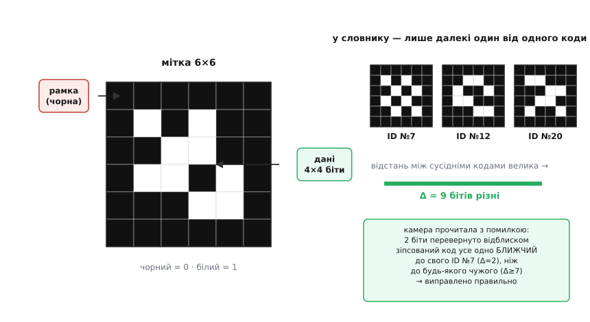
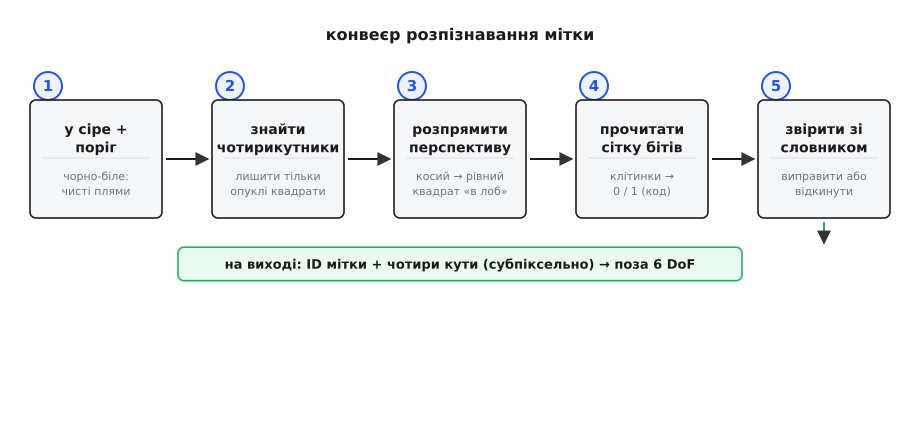
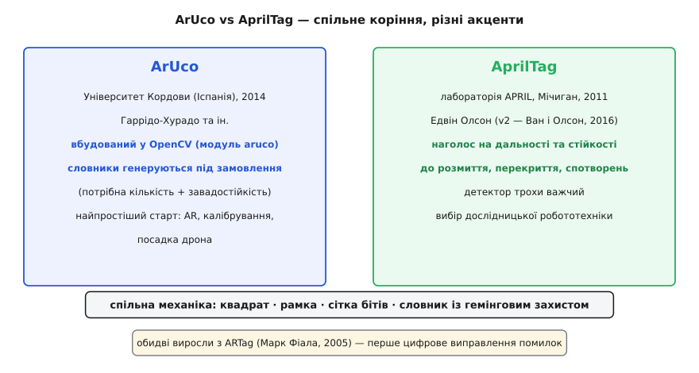

# Фідуційні мітки ArUco та AprilTag

Уяви, що дрону треба точно сісти на майданчик, а роботу-візку — знати, де він стоїть, з точністю до сантиметра. Камера бачить купу пікселів, але звідки їй знати, **що** перед нею і **де воно** в просторі? Найдешевший чесний спосіб — заздалегідь наклеїти в сцену **щось, що камера впізнає безпомилково**: чорно-білий квадрат із візерунком усередині. Це і є **фідуційна мітка** (лат. *fiducia* — довіра, опора; звідси *fiducial* — опорний, реперний): штучна позначка, яку ти сам ставиш у кадр як **опору для вимірювання**. ArUco та AprilTag — дві найпоширеніші системи таких міток, і вони влаштовані на диво схоже.

Чому взагалі саме мітка, а не «розпізнати об'єкт як він є»? Бо розпізнати довільну річ у довільному світлі — важко, повільно й ненадійно. А от квадрат, який ти сам надрукував, можна зробити **навмисно легким для машини**: різкий контраст, проста геометрія, візерунок, спеціально дібраний так, щоб його майже неможливо було сплутати ні з чим іншим. Ти міняєш складну задачу «зрозумій сцену» на просту «знайди відомий квадрат» — і виграєш і в швидкості, і в надійності.

### Що мітка має віддати: не лише «хто», а й «де»

Фідуційна мітка несе одразу **дві** речі, і плутати їх не можна.

Перша — **ідентичність**: числовий ID. Візерунок усередині квадрата кодує число (скажімо, «мітка №23»), щоб система розрізняла багато міток. Приземлення — на майданчик №5; ця полиця складу — стелаж №112; цей куток кімнати — якір №0. Без ID усі мітки були б однакові й марні.

Друга, і часто головна, — **поза** (англ. *pose*): де мітка перебуває **відносно камери** в трьох вимірах. Не просто «десь угорі кадру», а повні шість чисел — три координати (ліворуч-праворуч, вгору-вниз, ближче-далі) і три кути повороту. Це те, що звуть **6 ступенями вільності** (англ. *6 DoF*, degrees of freedom). Саме поза дає змогу дрону сказати «мітка за 1.2 метра піді мною, нахилена на 8°» і сісти точно.

Звідки береться поза? З **геометрії квадрата**. Мітка — квадрат **відомого фізичного розміру** (наприклад, сторона 10 см). Камера бачить його чотири кути як чотири точки на знімку. Знаючи, як **справжній** квадрат зі стороною 10 см спроєктувався в оцей перекошений чотирикутник на матриці, можна розв'язати обернену задачу: під яким кутом і на якій відстані має стояти квадрат, щоб дати саме таку проєкцію. Це і є суть [відновлення пози за чотирма кутами](topic:algorithms/pose-estimation) — окрема, доволі математична задача (її звуть *perspective-n-point*, PnP), але важливо, що **чотирьох кутів квадрата достатньо**, щоб її розв'язати. Ось чому мітки квадратні: квадрат дає рівно чотири надійні, легко впізнавані кути.

> 🔧 **Навіщо це.** Коли дрону ArduPilot треба точна посадка на рухому платформу, GPS дає метрові похибки — замало. Наклеюєш під дрон камеру, на платформу — мітку 20×20 см, і бортовий детектор віддає позу з точністю до сантиметрів на дистанції кількох метрів. Той самий трюк — у складській робототехніці (візок знаходить стелаж), у калібруванні камер і в доповненій реальності (куди «приклеїти» віртуальний об'єкт). Мітка — це коли тобі потрібні **надійні координати в реальному світі за копійки**: аркуш паперу й звичайна камера.

### Анатомія мітки: рамка, сітка, надлишок

Придивімося до самої мітки. Це квадрат, поділений на клітинки — типово сітка **6×6** або **8×8** маленьких чорних чи білих квадратиків (клітинку в цьому контексті часто звуть *біт*, бо вона несе один двійковий розряд).

Зовнішнє кільце клітинок **завжди чорне** — це **рамка** (англ. *border*). Вона не несе даних; її завдання — дати різкий чорний контур на світлому тлі, який детектор легко знайде як замкнений чотирикутник. Рамка також задає, де мітка **починається й закінчується**, тож її не сплутати з фоном.

Усередині рамки — **сітка даних**: наприклад, у мітки 6×6 зовнішнє кільце чорне, а всередині лишається сітка **4×4 = 16** клітинок, кожна чорна або біла. Здавалося б, 16 біт — це 2¹⁶ = 65536 різних міток. Але насправді доступних ID **набагато менше**, і це зроблено **навмисно**.


*Мітка 6×6: зовнішнє кільце клітинок — чорна **рамка** (контур для пошуку, даних не несе), усередині — сітка **4×4 біти** даних (чорний = 0, білий = 1). Праворуч — головна ідея словника: із усіх можливих візерунків беруть лише ті, що **сильно різняться між собою** (велика відстань Геммінга). Тоді навіть якщо кілька бітів прочитаються хибно через відблиск чи розмиття, зіпсований код усе одно **ближчий до свого** правильного, ніж до будь-якого чужого, — і його впізнають правильно.*

Чому не всі 65536 комбінацій? Бо камера **помиляється**. Відблиск, тінь, розмиття руху, косий кут — і клітинка, що мала бути білою, прочитається як чорна. Якби кожен візерунок був легітимним ID, один перевернутий біт перетворив би мітку №23 на мітку №25 — і система б цього **не помітила**. Тому з усіх можливих візерунків у **словник** (англ. *dictionary* — набір дозволених міток) відбирають лише невелику підмножину — таку, щоб будь-які два коди різнилися **якомога більшою** [відстанню Геммінга](topic:communications/hamming-distance) (кількістю позицій, у яких біти не збігаються). Якщо найближчі дозволені коди різняться, скажімо, на 5 бітів, то навіть двійко хибно прочитаних клітинок не доведуть один код до іншого — зіпсований візерунок лишиться **ближчим до свого** оригіналу, ніж до будь-якого чужого. Система бере прочитаний візерунок, знаходить **найближчий** код зі словника — і так **виправляє** помилку. Надлишок клітинок — це і є плата за завадостійкість: частину бітів «витрачають» не на ID, а на те, щоб ID **вижив** попри шум.

> 🔧 **Навіщо це.** Практичний висновок: **не бери словник більший, ніж потрібно**. Якщо тобі треба 20 міток, візьми словник на 50, а не на 1000 — тоді коди в ньому розведені далі один від одного, і хибних розпізнавань буде менше. Велике поле для типової помилки новачка: беруть найбільший словник «про запас», а потім дивуються, чому детектор плутає мітки під поганим світлом. Менший словник = більша відстань між кодами = надійніше.

### Як детектор знаходить і читає мітку

Конвеєр розпізнавання — ланцюжок простих кроків, кожен звужує пошук. Приємно, що майже всі вони — вже знайомі операції обробки зображення, зібрані в правильному порядку.

**Крок 1 — у сірі й у чорно-біле.** Колір тут не потрібен: мітка чорно-біла. Кадр переводять у відтінки сірого, а тоді [порогом бінаризують](topic:algorithms/threshold-morphology) — кожен піксель стає або чорним, або білим. Зазвичай беруть **адаптивний поріг** (різний у різних ділянках кадру), щоб мітка ловилася і в тіні, і на сонці. Після цього кроку в кадрі лишаються чисті чорні плями на білому.

**Крок 2 — знайти чотирикутники.** Тепер шукають **контури** — межі чорних плям — і серед них лишають тільки ті, що схожі на **опуклий чотирикутник** (чотири кути, чотири прямі сторони). Це відсіює переважну більшість сміття: круглі плями, літери, складні форми геть, лишаються тільки квадрати-кандидати. Пошук контурів і кутів спирається на ту саму механіку, що й [виявлення кутів та контурів](topic:algorithms/corner-detection) у решті машинного бачення.

**Крок 3 — розпрямити перспективу.** Кандидат на знімку перекошений (мітку ж знято під кутом). Його «розпрямляють» — перетворенням перспективи натягують той косий чотирикутник назад на ідеальний квадрат «згори». Тепер маємо рівну картинку мітки, ніби дивимося на неї прямо в лоб.

**Крок 4 — прочитати біти.** Розпрямлений квадрат ділять на сітку клітинок і в кожній дивляться: середня яскравість темна чи світла? Так дістають матрицю нулів і одиниць — сирий код мітки.

**Крок 5 — звірити зі словником і виправити.** Сирий код шукають у словнику. Спершу перевіряють рамку (зовнішнє кільце мусить бути чорне — інакше це не мітка, викидаємо). Тоді внутрішній код звіряють з усіма кодами словника за відстанню Геммінга. Точний збіг — чудово. Кілька розбіжних бітів — беремо найближчий код (виправлення помилки), якщо він досить близький; якщо ж прочитане однаково далеке від усіх — це не наша мітка, відкидаємо. На виході — **ID** мітки та її **чотири кути** з субпіксельною точністю. Кути потім ідуть у [відновлення пози](topic:algorithms/pose-estimation).


*П'ять кроків розпізнавання. **1)** Кадр у сіре й [порогом](topic:algorithms/threshold-morphology) у чорно-біле. **2)** Знайти контури й лишити тільки **опуклі чотирикутники** — кандидати. **3)** Розпрямити перспективу: косий чотирикутник → рівний квадрат «в лоб». **4)** Поділити на сітку й прочитати кожну клітинку як 0/1. **5)** Звірити зі словником за [відстанню Геммінга](topic:communications/hamming-distance), виправити хибні біти або відкинути чуже. Результат: **ID** + чотири **кути** для [пози](topic:algorithms/pose-estimation). Кожен крок відсіює несправжніх кандидатів, тож до дорогого зчитування доходять одиниці.*

Ось спрощений код кроку зчитування бітів — серце всього конвеєра. Він показує, як з розпрямленого квадрата дістати сирий код: пройти сітку клітинок, у кожній усереднити яскравість і вирішити, чорна вона чи біла.

**Зчитування коду з розпрямленого квадрата мітки 6×6.**
:::tabs
```cpp
// warped — розпрямлене зображення мітки, W×W пікселів, 8 біт/піксель, рядок = W байтів.
// GRID=6 (з рамкою); внутрішні 4×4 несуть дані. Повертаємо 16-бітний сирий код.
#define GRID 6
#define CELL (W / GRID)          // скільки пікселів припадає на одну клітинку

// Середня яскравість клітинки (gx,gy) — беремо серединку клітинки, без країв.
static int cell_mean(const uint8_t *warped, int W, int gx, int gy) {
    int x0 = gx * CELL + CELL / 4;      // відступ від краю клітинки, щоб не чіпати
    int y0 = gy * CELL + CELL / 4;      // сусідню (краї «пливуть» після розпрямлення)
    int x1 = gx * CELL + 3 * CELL / 4;
    int y1 = gy * CELL + 3 * CELL / 4;
    long sum = 0; int n = 0;
    for (int y = y0; y < y1; y++)
        for (int x = x0; x < x1; x++) { sum += warped[y * W + x]; n++; }
    return (int)(sum / n);              // 0..255
}

// Перевірити рамку й прочитати внутрішні 4×4 у 16-бітний код (чорне=0, біле=1).
static int read_marker(const uint8_t *warped, int W, uint16_t *code_out) {
    const int THR = 128;               // поріг чорне/біле (спрощено; краще адаптивний)
    // 1) Рамка: усе зовнішнє кільце має бути ЧОРНЕ, інакше це не мітка.
    for (int g = 0; g < GRID; g++)
        if (cell_mean(warped, W, g, 0)        > THR ||   // верхній край
            cell_mean(warped, W, g, GRID - 1) > THR ||   // нижній край
            cell_mean(warped, W, 0, g)        > THR ||   // лівий край
            cell_mean(warped, W, GRID - 1, g) > THR)     // правий край
            return 0;                  // рамка пробита — відкинути кандидата
    // 2) Внутрішні 4×4 → біти коду.
    uint16_t code = 0;
    for (int gy = 1; gy <= 4; gy++)
        for (int gx = 1; gx <= 4; gx++) {
            code <<= 1;
            if (cell_mean(warped, W, gx, gy) > THR) code |= 1;   // біла = 1
        }
    *code_out = code;
    return 1;                          // код прочитано; далі — звірка зі словником
}
```
```python
# warped — розпрямлене зображення мітки, масив W×W (numpy), 8 біт/піксель.
# GRID=6 (з рамкою); внутрішні 4×4 несуть дані. Повертаємо 16-бітний сирий код.
GRID = 6

# Середня яскравість клітинки (gx,gy) — беремо серединку клітинки, без країв.
def cell_mean(warped, W, gx, gy):
    cell = W // GRID                    # скільки пікселів припадає на одну клітинку
    x0 = gx * cell + cell // 4          # відступ від краю клітинки, щоб не чіпати
    y0 = gy * cell + cell // 4          # сусідню (краї «пливуть» після розпрямлення)
    x1 = gx * cell + 3 * cell // 4
    y1 = gy * cell + 3 * cell // 4
    return int(warped[y0:y1, x0:x1].mean())   # 0..255

# Перевірити рамку й прочитати внутрішні 4×4 у 16-бітний код (чорне=0, біле=1).
def read_marker(warped, W):
    THR = 128                          # поріг чорне/біле (спрощено; краще адаптивний)
    # 1) Рамка: усе зовнішнє кільце має бути ЧОРНЕ, інакше це не мітка.
    for g in range(GRID):
        if (cell_mean(warped, W, g, 0)        > THR or   # верхній край
            cell_mean(warped, W, g, GRID - 1) > THR or   # нижній край
            cell_mean(warped, W, 0, g)        > THR or   # лівий край
            cell_mean(warped, W, GRID - 1, g) > THR):    # правий край
            return None                # рамка пробита — відкинути кандидата
    # 2) Внутрішні 4×4 → біти коду.
    code = 0
    for gy in range(1, 5):
        for gx in range(1, 5):
            code <<= 1
            if cell_mean(warped, W, gx, gy) > THR:       # біла = 1
                code |= 1
    return code                        # код прочитано; далі — звірка зі словником
```
:::

Далі цей `code` порівнюють з кожним кодом словника (враховуючи, що мітка могла бути повернута на 90°, 180° чи 270° — тож перевіряють усі чотири оберти) і беруть найближчий за Геммінгом. Повний робочий детектор із розпрямленням перспективи, чотирма обертами й виправленням помилок розписано в [проєкті-розборі декодування ArUco](topic:algorithms/aruco-apriltag/proj-aruco-decode.md).

### ArUco проти AprilTag: спільне коріння, різні акценти

Обидві системи роблять те саме — квадрат, рамка, сітка бітів, словник із гемінговим захистом, конвеєр «поріг → чотирикутник → розпрямити → прочитати → звірити». Різняться вони деталями, і різниця пояснюється тим, **звідки й для чого** кожна виросла.

**ArUco** народився в Іспанії, в **Університеті Кордови** (Universidad de Córdoba) — звідси й ім'я: **Ar**ugmented Reality + Uni**Co**rdoba. Його придумали Серхіо Гаррідо-Хурадо з колегами й описали 2014 року в статті «Automatic generation and detection of highly reliable fiducial markers under occlusion» (журнал *Pattern Recognition*) — це усталений факт. Головна фішка ArUco — **словники генеруються під замовлення**: ти кажеш «хочу 30 міток сітки 5×5 з максимальною завадостійкістю» — і алгоритм будує саме такий словник, підбираючи коди так, щоб максимізувати відстань між ними. ArUco став частиною бібліотеки **OpenCV** (модуль `aruco`), тому він фактично «вбудований» у стандартний інструментарій машинного бачення й найлегший, щоб почати.

**AprilTag** виріс раніше й в іншому середовищі — у робототехнічній лабораторії **APRIL** Мічиганського університету (APRIL = Autonomy, Perception, Robotics, Interfaces, Learning), яку веде Едвін Олсон. Він представив AprilTag 2011 року на конференції ICRA у статті «AprilTag: A robust and flexible visual fiducial system», а 2016-го Джон Ван і Олсон випустили пришвидшену другу версію (AprilTag 2). Акцент AprilTag — **максимальна надійність на дистанції та в поганих умовах**: він виявляє мітки далі, стійкіший до розмиття, часткового перекриття й спотворень об'єктива. Ціна — детектор трохи важчий обчислювально. AprilTag дуже популярний саме в **робототехніці й дослідженнях**, де надійність позиціювання важливіша за легкість інтеграції.


*Дві системи одного роду. **ArUco** (Університет Кордови, 2014): вбудований у **OpenCV**, словники генеруються під потрібну кількість міток і завадостійкість — найпростіший старт для доповненої реальності й прикладних задач. **AprilTag** (лабораторія APRIL, Мічиган, 2011): наголос на **дальності та стійкості** до розмиття, перекриття й спотворень — вибір робототехніки. Механіка спільна (квадрат, рамка, сітка, словник із гемінговим захистом); різні лише акценти й екосистема. Обидві виросли з ранішого **ARTag** Марка Фіали (2005), що першим приніс цифрове виправлення помилок у фідуційні мітки.*

Обидві, своєю чергою, спираються на ранішу ідею — систему **ARTag** Марка Фіали (2005), яка перша принесла у фідуційні мітки строгі **цифрові** прийоми: рамку-контур і виправлення помилок кодом, замість крихкого зіставлення довільних картинок, як у давнішому ARToolKit. Як лінія розвитку йшла від ARToolKit через ARTag до ArUco й AprilTag — у [короткій історії фідуційних міток](topic:algorithms/aruco-apriltag/hist-fiducial-lineage.md).

Що ж брати на практиці? Потрібно **швидко почати**, вже працюєш з OpenCV, задача прикладна (доповнена реальність, калібрування, посадка дрона) — бери **ArUco**: він під рукою й простий. Робиш **дослідницьку робототехніку**, де мітку треба ловити здалеку, у русі й попри перекриття, — бери **AprilTag**. Але пам'ятай головне: **обидві — про те саме**, і зрозумівши одну, ти зрозумів обидві.

### Де мітки ламаються

Мітка — не магія, і корисно знати її межі, щоб не наступити на них у полі.

**Роздільність.** Щоб прочитати сітку 6×6, мітка має займати на знімку **достатньо пікселів** — грубо, щонайменше кілька пікселів на клітинку. Здалеку мітка стискається до плямки, клітинки зливаються, і код не прочитати. Тому дальність упирається у фізичний **розмір** мітки й роздільність камери: хочеш ловити далі — друкуй більшу мітку.

**Освітлення й відблиски.** Пряме сонце, дзеркальний глянець паперу, різка тінь упоперек мітки — усе це псує бінаризацію: клітинки прочитаються хибно. Адаптивний поріг рятує від плавних градієнтів світла, але не від **дзеркального відблиску**, що вибілює півмітки. Матовий друк і розсіяне світло — найкращі друзі детектора.

**Ракурс.** Під дуже гострим кутом квадрат вироджується в тонку смужку — кутів не знайти, перспективу не розпрямити. Мітки працюють, поки камера дивиться на них хоч приблизно спереду; майже «з ребра» — марно.

**Плутанина при слабкому захисті.** Якщо взяти завеликий словник (коди близько один до одного) і додати шум, детектор може **впевнено видати хибний ID** — і це підступніше за просто «не побачив мітку», бо система думає, що все гаразд. Звідси й порада тримати словник мінімальним.

> 🔧 **Навіщо це.** Перед польотом чи запуском візка перевір найпростіше: мітка **достатньо велика** для потрібної дистанції, надрукована **матово**, освітлена **рівно, без відблиску**, а камера бачить її **приблизно в лоб**. Ці чотири речі вирішують 90% проблем «детектор не бачить / бачить не те». І не жени за великим словником: візьми рівно стільки міток, скільки треба, — надійність важливіша за запас.

### Підсумок теми

Фідуційна мітка — це штучна чорно-біла позначка, яку ти сам ставиш у сцену як **надійну опору для вимірювання**: замість складного «зрозумій світ» камера розв'язує просте «знайди відомий квадрат». Мітка несе **ID** (число у візерунку сітки) і дає **позу** — повні 6 ступенів вільності відносно камери, бо чотири кути квадрата відомого розміру дозволяють [відновити його положення в просторі](topic:algorithms/pose-estimation). Будова: чорна **рамка** (контур для пошуку) плюс сітка **бітів**, де частину розрядів навмисно віддано на завадостійкість — коди у **словнику** розведено за [відстанню Геммінга](topic:communications/hamming-distance), тож хибно прочитані клітинки виправляються, а не породжують чужий ID. Розпізнавання — конвеєр знайомих операцій: [поріг](topic:algorithms/threshold-morphology) → пошук [чотирикутних контурів](topic:algorithms/corner-detection) → розпрямлення перспективи → зчитування сітки → звірка й виправлення. **ArUco** (Університет Кордови, 2014, у складі OpenCV, словники під замовлення) і **AprilTag** (лабораторія APRIL Мічигану, Едвін Олсон, 2011, наголос на дальності й стійкості) роблять по суті те саме — обидва виросли з ARTag Фіали (2005). Ламаються мітки на малій роздільності, відблисках, гострому ракурсі та завеликому словнику — тримай мітку великою, матовою, рівно освітленою й у кадрі спереду, а словник — мінімальним.
