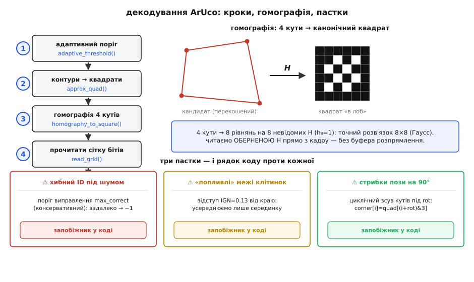

# ⚙️ Декодуємо ArUco-мітку від пікселів до ID — робочий C

Ти маєш кадр із камери — суцільний масив байтів яскравості — і десь у ньому чорно-білий квадрат. Треба, не покладаючись на жодну важку бібліотеку, витягти з нього одне ціле число: **ID мітки**. І не «десь помилитися на один біт і видати сусідній ID», а або дати правильний, або чесно сказати «це не наша мітка». Оце і є декодування: перетворити прямокутник шуму на надійне число, за яким дрон дізнається, на який майданчик сідати.

Задача виглядає майже тривіальною («знайди квадрат, прочитай клітинки»), але кожен із п'яти кроків ховає пастку, на якій наївний код тихо ламається в полі. Розберімо весь конвеєр так, як його справді робить OpenCV у модулі `aruco`, — але напишімо руками, компактним C, який поміститься в прошивку без OpenCV узагалі. Кожен шматок — робочий; наприкінці вони склеюються в один `aruco_decode()`.

Будову самої мітки — рамку, сітку бітів, ідею словника — вважаємо відомою; тут ми **читаємо** цю будову з пікселів.

## Задача точніше: що на вході, що на виході

На вході — сірий кадр `img[H][W]`, один байт (0..255) на піксель, рядок = `W` байтів поспіль. Це найдешевший формат, який віддає будь-який сенсор після дебаєризації; кольору нам не треба, мітка чорно-біла.

На виході для кожної знайденої мітки хочемо структуру:

:::tabs
```cpp
typedef struct {
    int      id;            // ID зі словника, або -1 якщо не мітка
    float    corner[4][2];  // 4 кути (x,y) у пікселях кадру, за годинниковою
} Marker;
```
```python
from dataclasses import dataclass, field

@dataclass
class Marker:
    id: int = -1                                   # ID зі словника, або -1 якщо не мітка
    corner: list[list[float]] = field(            # 4 кути (x,y) у пікселях кадру, за годинниковою
        default_factory=lambda: [[0.0, 0.0] for _ in range(4)])
```
:::

Чотири кути потрібні не менше за ID: саме вони підуть далі у [відновлення пози](topic:algorithms/pose-estimation) (задача PnP), щоб дістати відстань і нахил. Тож декодер зобов'язаний повернути кути **у сталому порядку** — інакше поза «перескакуватиме» на 90° щоразу, як мітку прочитають повернутою. Це вже підказує: оберт мітки — не дрібниця десь у кінці, а наскрізна турбота всього коду.

Весь конвеєр — п'ять кроків, кожен звужує кандидатів:

```
кадр → [1] адаптивний поріг → [2] контури → чотирикутники-кандидати
     → [3] розпрямити перспективу (гомографія 4 кутів) → [4] прочитати біти
     → [5] звірити зі словником (4 оберти + Гемінг) → id + впорядковані кути
```

Пройдімо їх по черзі, з робочим кодом на кожному.

## Крок 1 — адаптивний поріг: чому не звичайний

Найперша спокуса — один глобальний поріг: `pixel > 128 ? біле : чорне`. У лабораторії працює; у полі гине з першим косим світлом. Уяви мітку, половину якої накриває тінь від дрона: у тіні навіть біла клітинка дає яскравість 60, на сонці навіть чорна — 150. Жоден **єдиний** поріг не розділить їх правильно по всьому кадру.

> 🔧 **Навіщо це.** Дрон сідає на майданчик проти низького сонця: половина мітки засвічена, половина в тіні від власної рами. Глобальний поріг перетворить засвічену половину на суцільне біле, тіньову — на суцільне чорне; квадрат розпадеться, детектор осліпне саме тоді, коли він найпотрібніший. Адаптивний поріг дивиться на **локальний** фон і виживає там, де глобальний здається.

Ідея адаптивного порогу проста: піксель темний **не абсолютно, а відносно своїх сусідів**. Порівнюємо кожен піксель із середнім по невеликому вікну навколо нього (у OpenCV — `ADAPTIVE_THRESH_MEAN_C`): якщо він темніший за локальне середнє на константу `C`, це чорне. Тоді тінь, що плавно веде фон униз, тягне за собою й поріг — контраст мітки лишається видимим у будь-якій зоні.

Наївно рахувати середнє по вікну w×w для кожного пікселя — це O(W·H·w²), для вікна 23×23 понад пів тисячі додавань на піксель. Рятує **інтегральне зображення** (англ. *summed-area table*): один прохід, і сума по будь-якому прямокутнику — це чотири звертання до таблиці. Деталі техніки — окрема тема ([бінаризація порогом](topic:algorithms/threshold-morphology)); тут покажу компактну робочу реалізацію під прошивку.

:::tabs
```cpp
// Адаптивний поріг ADAPTIVE_THRESH_MEAN_C через інтегральне зображення.
// out[i] = 1, якщо піксель ТЕМНІШИЙ за (локальне середнє − C): це «чорнило» мітки.
// win — сторона вікна (непарна), у OpenCV-aruco її беруть у діапазоні 3..23.
// integ — буфер (W+1)*(H+1) на 32-бітних сумах; викликач виділяє його раз.
static void adaptive_threshold(const uint8_t *img, int W, int H,
                               int win, int C, uint8_t *out, uint32_t *integ) {
    const int IW = W + 1;
    // 1) Інтегральне зображення: integ[y+1][x+1] = сума всіх пікселів лівіше-вище.
    for (int x = 0; x <= W; x++) integ[x] = 0;          // нульовий рядок
    for (int y = 0; y < H; y++) {
        uint32_t row = 0;
        integ[(y + 1) * IW] = 0;                        // нульовий стовпець
        for (int x = 0; x < W; x++) {
            row += img[y * W + x];
            integ[(y + 1) * IW + (x + 1)] = integ[y * IW + (x + 1)] + row;
        }
    }
    // 2) Для кожного пікселя — середнє по вікну навколо, порівняння з C.
    const int r = win / 2;
    for (int y = 0; y < H; y++) {
        for (int x = 0; x < W; x++) {
            int x0 = x - r < 0 ? 0 : x - r,  y0 = y - r < 0 ? 0 : y - r;
            int x1 = x + r >= W ? W - 1 : x + r,  y1 = y + r >= H ? H - 1 : y + r;
            int area = (x1 - x0 + 1) * (y1 - y0 + 1);
            // сума по прямокутнику [x0..x1]×[y0..y1] — чотири кути таблиці:
            uint32_t s = integ[(y1 + 1) * IW + (x1 + 1)]
                       - integ[(y0    ) * IW + (x1 + 1)]
                       - integ[(y1 + 1) * IW + (x0    )]
                       + integ[(y0    ) * IW + (x0    )];
            int mean = (int)(s / (uint32_t)area);
            out[y * W + x] = (img[y * W + x] < mean - C) ? 1 : 0;   // темніше → «чорнило»
        }
    }
}
```
```python
import numpy as np

# Адаптивний поріг ADAPTIVE_THRESH_MEAN_C через інтегральне зображення.
# Повертає маску: 1, де піксель ТЕМНІШИЙ за (локальне середнє − C) — «чорнило» мітки.
# win — сторона вікна (непарна), у OpenCV-aruco її беруть у діапазоні 3..23.
def adaptive_threshold(img, win, C):
    H, W = img.shape
    # 1) Інтегральне зображення з нульовими рядком і стовпцем (padding).
    integ = np.zeros((H + 1, W + 1), dtype=np.int64)
    integ[1:, 1:] = np.cumsum(np.cumsum(img.astype(np.int64), axis=0), axis=1)

    r = win // 2
    out = np.zeros((H, W), dtype=np.uint8)
    for y in range(H):
        y0, y1 = max(0, y - r), min(H - 1, y + r)
        for x in range(W):
            x0, x1 = max(0, x - r), min(W - 1, x + r)
            area = (x1 - x0 + 1) * (y1 - y0 + 1)
            # сума по прямокутнику [x0..x1]×[y0..y1] — чотири кути таблиці:
            s = (integ[y1 + 1, x1 + 1] - integ[y0, x1 + 1]
                 - integ[y1 + 1, x0] + integ[y0, x0])
            mean = int(s // area)
            out[y, x] = 1 if int(img[y, x]) < mean - C else 0   # темніше → «чорнило»
    return out
```
:::

Зверни увагу: `out` — це маска **чорнила** (одиниця там, де темно). Далі шукатимемо саме зв'язні чорні області — контур мітки — тож зручно, коли чорне = 1.

## Крок 2 — знайти чотирикутники: контур і його чотири кути

Тепер по масці чорнила треба знайти замкнені контури й серед них — схожі на квадрат. Повний алгоритм трасування контурів (Сузукі) — окрема велика тема; для прошивки достатньо компактнішого підходу, який дає рівно те, що нам треба: для кожної чорної компоненти — її **чотири кути**.

Ключова ідея зведення контуру до чотирикутника — **апроксимація полігону** (алгоритм Рамера–Дугласа–Пекера, `approxPolyDP` в OpenCV): ламану з сотень точок спрощують, викидаючи точки, що лежать майже на прямій, поки не лишиться кілька вершин. Якщо лишилося рівно чотири й фігура опукла — це наш кандидат. OpenCV відсіює ще й за периметром (`minMarkerPerimeterRate = 0.03`, `maxMarkerPerimeterRate = 4.0` від більшого боку кадру): надто дрібні й надто великі плями — не мітки.

Щоб код лишався оглядним, покажу серце відбору — перевірку кандидата-чотирикутника — і винесу трасування контуру за дужки (його роль: дати масив точок межі `pts[n]` однієї чорної компоненти). Апроксимація до 4 вершин:

:::tabs
```cpp
typedef struct { float x, y; } Pt;

// Відстань точки p до прямої (a,b) — для Рамера–Дугласа–Пекера.
static float perp_dist(Pt p, Pt a, Pt b) {
    float dx = b.x - a.x, dy = b.y - a.y;
    float len = dx * dx + dy * dy;
    if (len < 1e-6f) { dx = p.x - a.x; dy = p.y - a.y; return dx*dx + dy*dy; }
    float t = ((p.x - a.x) * dx + (p.y - a.y) * dy) / len;   // проєкція на відрізок
    float projx = a.x + t * dx, projy = a.y + t * dy;
    dx = p.x - projx; dy = p.y - projy;
    return dx * dx + dy * dy;                                // квадрат відстані
}

// Спростити замкнений контур pts[n] до чотирикутника quad[4].
// Повертає 1, якщо вийшло рівно 4 «сильні» вершини (кандидат у мітки).
static int approx_quad(const Pt *pts, int n, float eps2, Pt quad[4]) {
    if (n < 4) return 0;
    // 1) Дві найвіддаленіші точки — старт діагоналі (грубий, надійний засів).
    int i0 = 0, i1 = 0; float best = -1;
    for (int i = 1; i < n; i++) {
        float dx = pts[i].x - pts[0].x, dy = pts[i].y - pts[0].y;
        float d = dx*dx + dy*dy;
        if (d > best) { best = d; i1 = i; }
    }
    best = -1;
    for (int i = 0; i < n; i++) {
        float dx = pts[i].x - pts[i1].x, dy = pts[i].y - pts[i1].y;
        float d = dx*dx + dy*dy;
        if (d > best) { best = d; i0 = i; }
    }
    // 2) На кожній із двох дуг між i0 та i1 шукаємо найвіддаленішу точку —
    //    це ще дві вершини. Разом чотири кути квадрата.
    int lo = i0 < i1 ? i0 : i1, hi = i0 < i1 ? i1 : i0;
    int c1 = -1, c2 = -1; float b1 = eps2, b2 = eps2;
    for (int i = lo + 1; i < hi; i++) {
        float d = perp_dist(pts[i], pts[lo], pts[hi]);
        if (d > b1) { b1 = d; c1 = i; }
    }
    for (int k = 0; k < n - (hi - lo) - 1; k++) {
        int i = (hi + 1 + k) % n;
        float d = perp_dist(pts[i], pts[hi], pts[lo]);
        if (d > b2) { b2 = d; c2 = i; }
    }
    if (c1 < 0 || c2 < 0) return 0;         // не набралося 4 сильних кутів → не квадрат
    quad[0] = pts[lo]; quad[1] = pts[c1];
    quad[2] = pts[hi]; quad[3] = pts[c2];
    return 1;
}
```
```python
# Точку зберігаємо як кортеж (x, y).

# Квадрат відстані точки p до прямої (a,b) — для Рамера–Дугласа–Пекера.
def perp_dist(p, a, b):
    dx, dy = b[0] - a[0], b[1] - a[1]
    length = dx * dx + dy * dy
    if length < 1e-6:                                   # a==b: відстань до точки
        dx, dy = p[0] - a[0], p[1] - a[1]
        return dx * dx + dy * dy
    t = ((p[0] - a[0]) * dx + (p[1] - a[1]) * dy) / length   # проєкція на відрізок
    projx, projy = a[0] + t * dx, a[1] + t * dy
    dx, dy = p[0] - projx, p[1] - projy
    return dx * dx + dy * dy                             # квадрат відстані

# Спростити замкнений контур pts до чотирикутника.
# Повертає список із 4 вершин, якщо набралося 4 «сильні» кути; інакше None.
def approx_quad(pts, eps2):
    n = len(pts)
    if n < 4:
        return None
    # 1) Дві найвіддаленіші точки — старт діагоналі (грубий, надійний засів).
    i1 = max(range(1, n),
             key=lambda i: (pts[i][0] - pts[0][0])**2 + (pts[i][1] - pts[0][1])**2)
    i0 = max(range(n),
             key=lambda i: (pts[i][0] - pts[i1][0])**2 + (pts[i][1] - pts[i1][1])**2)
    # 2) На кожній із двох дуг між i0 та i1 шукаємо найвіддаленішу точку —
    #    це ще дві вершини. Разом чотири кути квадрата.
    lo, hi = min(i0, i1), max(i0, i1)
    c1 = c2 = None
    b1 = b2 = eps2
    for i in range(lo + 1, hi):
        d = perp_dist(pts[i], pts[lo], pts[hi])
        if d > b1:
            b1, c1 = d, i
    for k in range(n - (hi - lo) - 1):
        i = (hi + 1 + k) % n
        d = perp_dist(pts[i], pts[hi], pts[lo])
        if d > b2:
            b2, c2 = d, i
    if c1 is None or c2 is None:            # не набралося 4 сильних кутів → не квадрат
        return None
    return [pts[lo], pts[c1], pts[hi], pts[c2]]
```
:::

`eps2` — це `(polygonalApproxAccuracyRate · периметр)²`; у OpenCV `polygonalApproxAccuracyRate = 0.03`. Тобто вершиною вважаємо тільки точку, що відхиляється від сторони більш ніж на 3% периметра — так дрібні зубці межі не породжують фальшивих кутів.

Після цього кроку маємо купку чотирикутників-кандидатів `quad[4]`. Більшість — сміття (тіні, літери, стики плитки), яке зникне на кроці 5. Але спершу кожного кандидата треба «розпрямити».

## Крок 3 — розпрямити перспективу: гомографія за чотирма кутами

Кандидат на знімку — перекошений: мітку ж знято під кутом, її квадрат спроєктувався в довільний опуклий чотирикутник. Щоб прочитати сітку, треба «натягнути» цей чотирикутник назад на ідеальний квадрат «в лоб». Перетворення, що це робить, — **гомографія** (грец. *homós* — той самий, *gráphō* — пишу): проєктивне відображення однієї площини на іншу, яке зберігає прямі, але не паралельність. Саме воно описує, як плоска мітка лягає на матрицю камери.

Гомографія — матриця 3×3, що діє на однорідні координати:

```
⎡x'⎤   ⎡h₀ h₁ h₂⎤ ⎡x⎤
⎢y'⎥ = ⎢h₃ h₄ h₅⎥ ⎢y⎥ ,   реальні координати = (x'/w', y'/w')
⎣w'⎦   ⎣h₆ h₇ h₈⎦ ⎣1⎦
```

Масштаб довільний, тож ставлять h₈ = 1 — лишається **вісім** невідомих. Кожна пара «кут кандидата ↔ кут цільового квадрата» дає **два** рівняння (на x і на y). Чотири кути → вісім рівнянь → рівно вистачає на вісім невідомих. Це не наближення, а точний розв'язок квадратної системи 8×8 — саме так працює `getPerspectiveTransform` (усередині — метод виключення Гаусса; ту саму механіку розписано в [найменших квадратах](topic:math/least-squares), лише тут система квадратна й переозначень немає).

Виведемо рядок системи. Для пари (xᵢ,yᵢ)→(Xᵢ,Yᵢ), розкривши Xᵢ = x'/w' та Yᵢ = y'/w', дістаємо два рівняння, лінійні щодо h₀…h₇:

```
xᵢ·h₀ + yᵢ·h₁ + h₂                       − Xᵢ·xᵢ·h₆ − Xᵢ·yᵢ·h₇ = Xᵢ
                  xᵢ·h₃ + yᵢ·h₄ + h₅ − Yᵢ·xᵢ·h₆ − Yᵢ·yᵢ·h₇ = Yᵢ
```

Чотири точки дають вісім таких рядків — матрицю A (8×8) і праву частину b (8). Розв'язуємо Гауссом. Ось робочий C: побудова системи для відображення **кутів кандидата → канонічний квадрат S×S** і розв'язання.

:::tabs
```cpp
// Розв'язати A·x = b, A — n×n (рядки поспіль), методом Гаусса з вибором ведучого.
// Повертає 0, якщо матриця вироджена (кандидат геть плаский — не мітка).
static int solve_linear(double *A, double *b, double *x, int n) {
    for (int col = 0; col < n; col++) {
        // вибір ведучого рядка (найбільший за модулем елемент у стовпці) — стійкість
        int piv = col; double mx = fabs(A[col * n + col]);
        for (int r = col + 1; r < n; r++) {
            double v = fabs(A[r * n + col]);
            if (v > mx) { mx = v; piv = r; }
        }
        if (mx < 1e-9) return 0;                 // вироджена → відкинути кандидата
        if (piv != col) {                        // переставити рядки piv ↔ col
            for (int k = 0; k < n; k++) { double t = A[col*n+k]; A[col*n+k] = A[piv*n+k]; A[piv*n+k] = t; }
            double t = b[col]; b[col] = b[piv]; b[piv] = t;
        }
        double d = A[col * n + col];
        for (int r = 0; r < n; r++) {            // виключити стовпець з решти рядків
            if (r == col) continue;
            double f = A[r * n + col] / d;
            for (int k = col; k < n; k++) A[r*n+k] -= f * A[col*n+k];
            b[r] -= f * b[col];
        }
    }
    for (int i = 0; i < n; i++) x[i] = b[i] / A[i * n + i];   // діагональ → розв'язок
    return 1;
}

// Гомографія, що переводить 4 кути мітки src[4] у квадрат [0..S]×[0..S].
// H (9 елементів, h8=1) записуємо в out. S — сторона канонічного квадрата в пікселях.
static int homography_to_square(const Pt src[4], int S, double H[9]) {
    const double dst[4][2] = { {0,0}, {(double)S,0}, {(double)S,(double)S}, {0,(double)S} };
    double A[64], b[8];
    for (int i = 0; i < 4; i++) {
        double xs = src[i].x, ys = src[i].y, X = dst[i][0], Y = dst[i][1];
        double *r0 = &A[(2*i)   * 8], *r1 = &A[(2*i+1) * 8];
        r0[0]=xs; r0[1]=ys; r0[2]=1; r0[3]=0;  r0[4]=0;  r0[5]=0; r0[6]=-X*xs; r0[7]=-X*ys; b[2*i]  =X;
        r1[0]=0;  r1[1]=0;  r1[2]=0; r1[3]=xs; r1[4]=ys; r1[5]=1; r1[6]=-Y*xs; r1[7]=-Y*ys; b[2*i+1]=Y;
    }
    double h[8];
    if (!solve_linear(A, b, h, 8)) return 0;
    for (int i = 0; i < 8; i++) H[i] = h[i];
    H[8] = 1.0;
    return 1;
}
```
```python
import numpy as np

# Розв'язати A·x = b методом Гаусса з вибором ведучого. Повертає None,
# якщо матриця вироджена (кандидат геть плаский — не мітка).
def solve_linear(A, b):
    A = A.astype(np.float64).copy()
    b = b.astype(np.float64).copy()
    n = len(b)
    for col in range(n):
        # вибір ведучого рядка (найбільший за модулем елемент у стовпці) — стійкість
        piv = col + int(np.argmax(np.abs(A[col:, col])))
        if abs(A[piv, col]) < 1e-9:
            return None                          # вироджена → відкинути кандидата
        if piv != col:                           # переставити рядки piv ↔ col
            A[[col, piv]] = A[[piv, col]]
            b[[col, piv]] = b[[piv, col]]
        d = A[col, col]
        for r in range(n):                       # виключити стовпець з решти рядків
            if r == col:
                continue
            f = A[r, col] / d
            A[r, col:] -= f * A[col, col:]
            b[r] -= f * b[col]
    return b / np.diag(A)                         # діагональ → розв'язок

# Гомографія, що переводить 4 кути мітки src у квадрат [0..S]×[0..S].
# Повертає H як 3×3 (h8=1) або None. S — сторона канонічного квадрата в пікселях.
def homography_to_square(src, S):
    dst = [(0, 0), (S, 0), (S, S), (0, S)]
    A = np.zeros((8, 8))
    b = np.zeros(8)
    for i in range(4):
        xs, ys = src[i]
        X, Y = dst[i]
        A[2 * i]     = [xs, ys, 1, 0,  0,  0, -X * xs, -X * ys]
        A[2 * i + 1] = [0,  0,  0, xs, ys, 1, -Y * xs, -Y * ys]
        b[2 * i], b[2 * i + 1] = X, Y
    h = solve_linear(A, b)
    if h is None:
        return None
    return np.append(h, 1.0).reshape(3, 3)
```
:::

Тепер важливий поворот думки: нам **не треба** матеріалізувати розпрямлене зображення в окремий буфер, як це робить `warpPerspective`. Для прошивки з мізерною пам'яттю дешевше піти **навпаки**: для кожної клітинки канонічного квадрата беремо її центр (Xc,Yc), проганяємо через **обернену** гомографію назад у кадр і читаємо яскравість прямо звідти. Один буфер, жодного зайвого зображення. Обернену матрицю знайдемо тим самим `solve_linear`, розв'язавши H·p = e для трьох базових векторів (тобто інвертувавши 3×3).

:::tabs
```cpp
// Інвертувати 3×3 (гомографію) через приєднану матрицю — коротко й без циклу Гаусса.
static int invert3x3(const double H[9], double Hi[9]) {
    double det = H[0]*(H[4]*H[8]-H[5]*H[7])
               - H[1]*(H[3]*H[8]-H[5]*H[6])
               + H[2]*(H[3]*H[7]-H[4]*H[6]);
    if (fabs(det) < 1e-12) return 0;
    double id = 1.0 / det;
    Hi[0]=(H[4]*H[8]-H[5]*H[7])*id; Hi[1]=(H[2]*H[7]-H[1]*H[8])*id; Hi[2]=(H[1]*H[5]-H[2]*H[4])*id;
    Hi[3]=(H[5]*H[6]-H[3]*H[8])*id; Hi[4]=(H[0]*H[8]-H[2]*H[6])*id; Hi[5]=(H[2]*H[3]-H[0]*H[5])*id;
    Hi[6]=(H[3]*H[7]-H[4]*H[6])*id; Hi[7]=(H[1]*H[6]-H[0]*H[7])*id; Hi[8]=(H[0]*H[4]-H[1]*H[3])*id;
    return 1;
}

// Яскравість кадру в точці канонічного квадрата (Xc,Yc) — через обернену гомографію.
// Найближчий сусід (INTER_NEAREST, як у OpenCV-aruco); межі кадру перевіряємо.
static int sample_canonical(const uint8_t *img, int W, int H_img,
                            const double Hi[9], double Xc, double Yc) {
    double w = Hi[6]*Xc + Hi[7]*Yc + Hi[8];
    if (fabs(w) < 1e-12) return 0;
    int sx = (int)((Hi[0]*Xc + Hi[1]*Yc + Hi[2]) / w + 0.5);
    int sy = (int)((Hi[3]*Xc + Hi[4]*Yc + Hi[5]) / w + 0.5);
    if (sx < 0 || sx >= W || sy < 0 || sy >= H_img) return -1;   // вилізли за кадр
    return img[sy * W + sx];
}
```
```python
import numpy as np

# Інвертувати 3×3 (гомографію). Повертає None, якщо матриця вироджена.
def invert3x3(H):
    det = np.linalg.det(H)
    if abs(det) < 1e-12:
        return None
    return np.linalg.inv(H)

# Яскравість кадру в точці канонічного квадрата (Xc,Yc) — через обернену гомографію.
# Найближчий сусід (INTER_NEAREST, як у OpenCV-aruco); межі кадру перевіряємо.
# Повертає -1, якщо точка вилізла за кадр.
def sample_canonical(img, Hi, Xc, Yc):
    H_img, W = img.shape
    w = Hi[2, 0] * Xc + Hi[2, 1] * Yc + Hi[2, 2]
    if abs(w) < 1e-12:
        return 0
    sx = int((Hi[0, 0] * Xc + Hi[0, 1] * Yc + Hi[0, 2]) / w + 0.5)
    sy = int((Hi[1, 0] * Xc + Hi[1, 1] * Yc + Hi[1, 2]) / w + 0.5)
    if sx < 0 or sx >= W or sy < 0 or sy >= H_img:
        return -1                                   # вилізли за кадр
    return int(img[sy, sx])
```
:::

## Крок 4 — прочитати біти сітки

Канонічний квадрат сторони S ділимо на сітку G×G (для мітки 6×6 — G=6: зовнішнє кільце рамки плюс внутрішні 4×4 даних). У кожній клітинці усереднюємо яскравість **лише по її серединці**, обходячи краї: після розпрямлення межі клітинок «пливуть» на піксель-два, і крайні пікселі однієї клітинки залазять у сусідню. OpenCV відступає на `perspectiveRemoveIgnoredMarginPerCell = 0.13` від сторони клітинки з кожного боку — беремо так само.

Порогувати клітинку абсолютним 128 — знову крихко (та сама тінь). Правильніше: зібрати середні яскравості всіх клітинок і розділити їх **власним** порогом за методом Оцу — він сам знаходить провал між «темними» й «світлими» клітинками цієї конкретної мітки. (Метод Оцу як такий — окрема тема; тут вистачить його суті: поріг, що максимально розводить два класи яскравості.) Але для компактної прошивки часто достатньо середини між мінімальним і максимальним значенням клітинок — покажу цей стійкий і дешевий варіант.

:::tabs
```cpp
#define GRID 6                          // мітка 6×6 (рамка + 4×4 даних)
#define CANON 48                        // S: 8 пікселів на клітинку (GRID*8) — з запасом
#define IGN   0.13                      // відступ від краю клітинки (як у OpenCV)

// Прочитати сітку GRID×GRID: у cells[gy][gx] — середня яскравість серединки клітинки.
static void read_grid(const uint8_t *img, int W, int Himg,
                      const double Hi[9], int cells[GRID][GRID]) {
    const double cell = (double)CANON / GRID;
    const double m = cell * IGN;                    // поле, яке ігноруємо
    for (int gy = 0; gy < GRID; gy++)
        for (int gx = 0; gx < GRID; gx++) {
            double x0 = gx*cell + m, x1 = (gx+1)*cell - m;
            double y0 = gy*cell + m, y1 = (gy+1)*cell - m;
            long sum = 0; int cnt = 0;
            for (double Yc = y0 + 0.5; Yc < y1; Yc += 1.0)
                for (double Xc = x0 + 0.5; Xc < x1; Xc += 1.0) {
                    int v = sample_canonical(img, W, Himg, Hi, Xc, Yc);
                    if (v >= 0) { sum += v; cnt++; }
                }
            cells[gy][gx] = cnt ? (int)(sum / cnt) : 0;
        }
}

// Перетворити яскравості клітинок на біти bit[gy][gx] (1 = біле) спільним порогом.
// Поріг — середина між найтемнішою й найсвітлішою клітинками (стійко до світла).
static void cells_to_bits(const int cells[GRID][GRID], uint8_t bit[GRID][GRID]) {
    int lo = 255, hi = 0;
    for (int gy = 0; gy < GRID; gy++)
        for (int gx = 0; gx < GRID; gx++) {
            if (cells[gy][gx] < lo) lo = cells[gy][gx];
            if (cells[gy][gx] > hi) hi = cells[gy][gx];
        }
    int thr = (lo + hi) / 2;
    for (int gy = 0; gy < GRID; gy++)
        for (int gx = 0; gx < GRID; gx++)
            bit[gy][gx] = cells[gy][gx] > thr ? 1 : 0;   // світліше за поріг → біле
}
```
```python
GRID = 6                                # мітка 6×6 (рамка + 4×4 даних)
CANON = 48                              # S: 8 пікселів на клітинку (GRID*8) — з запасом
IGN = 0.13                              # відступ від краю клітинки (як у OpenCV)

# Прочитати сітку GRID×GRID: cells[gy][gx] — середня яскравість серединки клітинки.
def read_grid(img, Hi):
    cell = CANON / GRID
    m = cell * IGN                                  # поле, яке ігноруємо
    cells = [[0] * GRID for _ in range(GRID)]
    for gy in range(GRID):
        for gx in range(GRID):
            x0, x1 = gx * cell + m, (gx + 1) * cell - m
            y0, y1 = gy * cell + m, (gy + 1) * cell - m
            total = cnt = 0
            Yc = y0 + 0.5
            while Yc < y1:
                Xc = x0 + 0.5
                while Xc < x1:
                    v = sample_canonical(img, Hi, Xc, Yc)
                    if v >= 0:
                        total += v
                        cnt += 1
                    Xc += 1.0
                Yc += 1.0
            cells[gy][gx] = total // cnt if cnt else 0
    return cells

# Перетворити яскравості клітинок на біти (1 = біле) спільним порогом.
# Поріг — середина між найтемнішою й найсвітлішою клітинками (стійко до світла).
def cells_to_bits(cells):
    flat = [v for row in cells for v in row]
    thr = (min(flat) + max(flat)) // 2
    return [[1 if cells[gy][gx] > thr else 0       # світліше за поріг → біле
             for gx in range(GRID)] for gy in range(GRID)]
```
:::

## Крок 5 — рамка, чотири оберти, Гемінг: серце декодера

Ось де наївний код найчастіше програє. Три речі мусять статися правильно.

**Рамка.** Зовнішнє кільце сітки має бути чорне. Але не «все до єдиної клітинки» — реальна мітка має плями й засвітки. OpenCV дозволяє до `maxErroneousBitsInBorderRate = 0.35` білих клітинок у рамці, і лише тоді відкидає. Це перший, найдешевший фільтр: більшість сміття-кандидатів має світлу рамку й гине тут-таки, не доходячи до дорогої звірки.

**Чотири оберти.** Мітку могло зняти повернутою на 0°, 90°, 180° чи 270°. Ми не знаємо орієнтації, поки не впізнали код. Тому внутрішні 4×4 біти читаємо як число, а тоді звіряємо зі словником **усі чотири** оберти цього ж поля. Обертати можна або сам код (складна перестановка бітів), або — простіше й наочніше — саму матрицю 4×4 на 90°, чотири рази. Який оберт дав збіг — та й є істинна орієнтація; під неї потім циклічно зсуваємо кути, щоб `corner[0]` завжди був той самий фізичний кут мітки. Оце і замикає ту наскрізну турботу про оберт, з якої ми почали.

**Гемінг і виправлення.** Зіставлення — не «збіглося / ні», а **за [відстанню Гемінга](topic:communications/hamming-distance)**: скільки бітів різняться. Для кожного слова словника й кожного з чотирьох обертів рахуємо відстань; беремо глобальний мінімум. Якщо він **≤ порога виправлення** — мітку впізнано, і виправлено рівно ті хибні біти. У OpenCV поріг = `maxCorrectionBits · errorCorrectionRate`, де `errorCorrectionRate = 0.6`; тобто виправляють до 60% теоретичного запасу словника. Перевищив поріг — це чуже, повертаємо −1. Саме цей поріг рятує від найпідступнішого: **впевненого хибного ID**. Без нього зашумлений квадрат «причепився» б до найближчого коду й видав дрону неправильний майданчик.

:::tabs
```cpp
// Порахувати 16-бітний код із матриці внутрішніх 4×4 бітів (рядок за рядком).
static uint16_t bits4x4_to_code(const uint8_t bit[GRID][GRID]) {
    uint16_t code = 0;
    for (int gy = 1; gy <= 4; gy++)                 // внутрішні клітинки 1..4
        for (int gx = 1; gx <= 4; gx++) {
            code <<= 1;
            code |= bit[gy][gx] & 1;
        }
    return code;
}

// Повернути матрицю 4×4 бітів на 90° за годинниковою: dst[x][3-y] = src[y][x].
static void rot90_4x4(const uint8_t src[4][4], uint8_t dst[4][4]) {
    for (int y = 0; y < 4; y++)
        for (int x = 0; x < 4; x++)
            dst[x][3 - y] = src[y][x];
}

static int hamming16(uint16_t a, uint16_t b) {
    uint16_t d = a ^ b; int c = 0;                  // XOR: одиниці там, де біти різні
    while (d) { c += d & 1; d >>= 1; }              // порахувати одиниці (популяція)
    return c;
}

// Словник: коди у ЖОРСТКОМУ порядку рамка-чорна, лише внутрішні 4×4.
// (реальний ArUco зберігає всі 4 оберти заздалегідь; ми обертаємо матрицю на льоту)
typedef struct { const uint16_t *code; int count; int max_correct; } Dict;

// Звірити прочитані біти зі словником по 4 обертах. Повертає id (індекс) або -1.
// *rot — на скільки *90° мітка повернута (0..3), щоб викликач упорядкував кути.
static int identify(const uint8_t bit[GRID][GRID], const Dict *dict, int *rot) {
    // витягти внутрішні 4×4 в окрему матрицю
    uint8_t m[4][4], r[4][4];
    for (int y = 0; y < 4; y++)
        for (int x = 0; x < 4; x++) m[y][x] = bit[y + 1][x + 1];

    int best_id = -1, best_dist = 0x7fffffff, best_rot = 0;
    for (int k = 0; k < 4; k++) {                   // чотири оберти
        // зібрати код поточного оберту
        uint16_t code = 0;
        for (int y = 0; y < 4; y++)
            for (int x = 0; x < 4; x++) { code <<= 1; code |= m[y][x] & 1; }
        // мінімальний Гемінг до всіх слів словника
        for (int i = 0; i < dict->count; i++) {
            int d = hamming16(code, dict->code[i]);
            if (d < best_dist) { best_dist = d; best_id = i; best_rot = k; }
        }
        rot90_4x4(m, r);                            // повернути на наступні 90°
        memcpy(m, r, sizeof m);
    }
    if (best_dist <= dict->max_correct) {           // у межах виправлення → впізнано
        *rot = best_rot;
        return best_id;
    }
    return -1;                                       // задалеко від усіх → чуже
}
```
```python
from dataclasses import dataclass

# Порахувати 16-бітний код із матриці внутрішніх 4×4 бітів (рядок за рядком).
def bits4x4_to_code(bit):
    code = 0
    for gy in range(1, 5):                          # внутрішні клітинки 1..4
        for gx in range(1, 5):
            code = (code << 1) | (bit[gy][gx] & 1)
    return code

# Повернути матрицю 4×4 бітів на 90° за годинниковою: dst[x][3-y] = src[y][x].
def rot90_4x4(src):
    dst = [[0] * 4 for _ in range(4)]
    for y in range(4):
        for x in range(4):
            dst[x][3 - y] = src[y][x]
    return dst

def hamming16(a, b):
    return bin(a ^ b).count("1")                    # XOR, тоді порахувати одиниці

# Словник: коди у ЖОРСТКОМУ порядку рамка-чорна, лише внутрішні 4×4.
# (реальний ArUco зберігає всі 4 оберти заздалегідь; ми обертаємо матрицю на льоту)
@dataclass
class Dict:
    code: list[int]
    max_correct: int

# Звірити прочитані біти зі словником по 4 обертах.
# Повертає (id, rot), де rot — на скільки *90° мітка повернута (0..3),
# щоб викликач упорядкував кути; або (-1, 0), якщо мітку не впізнано.
def identify(bit, dct):
    m = [[bit[y + 1][x + 1] for x in range(4)] for y in range(4)]   # внутрішні 4×4

    best_id, best_dist, best_rot = -1, 0x7fffffff, 0
    for k in range(4):                              # чотири оберти
        # зібрати код поточного оберту
        code = 0
        for y in range(4):
            for x in range(4):
                code = (code << 1) | (m[y][x] & 1)
        # мінімальний Гемінг до всіх слів словника
        for i, word in enumerate(dct.code):
            d = hamming16(code, word)
            if d < best_dist:
                best_dist, best_id, best_rot = d, i, k
        m = rot90_4x4(m)                            # повернути на наступні 90°

    if best_dist <= dct.max_correct:                # у межах виправлення → впізнано
        return best_id, best_rot
    return -1, 0                                     # задалеко від усіх → чуже
```
:::

`max_correct` тут — уже готовий поріг (`⌊maxCorrectionBits · 0.6⌋`), який рахують раз при завантаженні словника з його мінімальної міжкодової відстані d як ⌊(d−1)/2 · 0.6⌋. Для типового `DICT_6X6_250` (250 міток, мінімальна відстань між кодами близько 5–6) це дає запас на 1–2 хибні біти — рівно те, що витримує відблиск чи легке розмиття, не пускаючи справжнє сміття.

## Складаємо все: `aruco_decode()`

Тепер п'ять кроків склеюються. Функція проходить кандидатів (їх дає трасування контурів по масці порогу), для кожного будує гомографію, читає сітку, звіряє зі словником, і на успіху впорядковує кути під знайдений оберт.

:::tabs
```cpp
// Один кандидат quad[4] → заповнена структура Marker (id=-1, якщо не мітка).
static void decode_candidate(const uint8_t *img, int W, int Himg,
                             const Pt quad[4], const Dict *dict, Marker *out) {
    out->id = -1;
    double Hm[9], Hi[9];
    if (!homography_to_square(quad, CANON, Hm)) return;   // вироджений кандидат
    if (!invert3x3(Hm, Hi)) return;

    int cells[GRID][GRID]; uint8_t bit[GRID][GRID];
    read_grid(img, W, Himg, Hi, cells);
    cells_to_bits(cells, bit);

    // рамка: рахуємо білі клітинки в зовнішньому кільці, поріг 35%
    int border_white = 0, border_total = 0;
    for (int g = 0; g < GRID; g++) {
        int edges[4][2] = {{g,0},{g,GRID-1},{0,g},{GRID-1,g}};
        for (int e = 0; e < 4; e++) { border_total++; border_white += bit[edges[e][1]][edges[e][0]]; }
    }
    if (border_white * 100 > border_total * 35) return;   // рамка світла → не мітка

    int rot;
    int id = identify(bit, dict, &rot);
    if (id < 0) return;

    // упорядкувати кути під знайдений оберт: циклічний зсув на rot позицій
    out->id = id;
    for (int i = 0; i < 4; i++) {
        out->corner[i][0] = quad[(i + rot) & 3].x;
        out->corner[i][1] = quad[(i + rot) & 3].y;
    }
}

// Головний вхід: кадр → масив міток. cand/ncand дає крок контурів (крок 2).
// integ — буфер (W+1)*(H+1), bin — буфер W*H; викликач виділяє їх один раз.
int aruco_decode(const uint8_t *img, int W, int Himg,
                 const Dict *dict, Marker *markers, int max_markers,
                 uint32_t *integ, uint8_t *bin) {
    // Крок 1 — поріг у маску чорнила bin. Вікно 23, C=7 (типові для aruco).
    adaptive_threshold(img, W, Himg, 23, 7, bin, integ);

    // Крок 2 — контури по bin → чотирикутники-кандидати. (трасування опущено;
    //           find_quads заповнює cand[] з масок; повертає їх кількість)
    Pt cand[4]; int found = 0;
    int ncand = find_quads(bin, W, Himg, /*out*/ NULL);   // заглушка інтерфейсу
    (void)ncand; (void)cand;

    // Крок 3–5 — для кожного кандидата (тут показано на одному quad):
    //   decode_candidate(img, W, Himg, quad, dict, &markers[found]);
    //   if (markers[found].id >= 0 && found < max_markers) found++;
    return found;
}
```
```python
# Один кандидат quad (4 точки) → структура Marker (id=-1, якщо не мітка).
def decode_candidate(img, quad, dct):
    out = Marker()
    Hm = homography_to_square(quad, CANON)
    if Hm is None:                                  # вироджений кандидат
        return out
    Hi = invert3x3(Hm)
    if Hi is None:
        return out

    cells = read_grid(img, Hi)
    bit = cells_to_bits(cells)

    # рамка: рахуємо білі клітинки в зовнішньому кільці, поріг 35%
    border_white = border_total = 0
    for g in range(GRID):
        for gx, gy in ((g, 0), (g, GRID - 1), (0, g), (GRID - 1, g)):
            border_total += 1
            border_white += bit[gy][gx]
    if border_white * 100 > border_total * 35:      # рамка світла → не мітка
        return out

    id_, rot = identify(bit, dct)
    if id_ < 0:
        return out

    # упорядкувати кути під знайдений оберт: циклічний зсув на rot позицій
    out.id = id_
    for i in range(4):
        out.corner[i][0] = quad[(i + rot) & 3][0]
        out.corner[i][1] = quad[(i + rot) & 3][1]
    return out

# Головний вхід: кадр → список міток. find_quads дає крок контурів (крок 2).
def aruco_decode(img, dct):
    # Крок 1 — поріг у маску чорнила. Вікно 23, C=7 (типові для aruco).
    binmask = adaptive_threshold(img, 23, 7)

    # Крок 2 — контури по масці → чотирикутники-кандидати. (трасування опущено;
    #           find_quads повертає список quad-ів по масках)
    cands = find_quads(binmask)                     # заглушка інтерфейсу

    # Крок 3–5 — довести кожного кандидата до ID або відкинути.
    markers = []
    for quad in cands:
        m = decode_candidate(img, quad, dct)
        if m.id >= 0:
            markers.append(m)
    return markers
```
:::

Крок 2 (`find_quads`) навмисно лишено інтерфейсом-заглушкою: повне трасування контурів Сузукі — окрема тема ([аналіз плям](topic:algorithms/blob-analysis)), а вся суть **декодування** — у кроках 3–5, які тут робочі повністю. Підстав будь-яке трасування, що дає масив точок межі кожної чорної компоненти, прожени через `approx_quad`, і `decode_candidate` доведе кожен чотирикутник до ID або відкине.

## Складність і де воно ламається

**Складність.** Крок 1 — O(W·H) на інтегральне зображення й ще O(W·H) на порогування: лінійно, домінує на великому кадрі. Кроки 3–5 коштують **на кандидата**, а кандидатів після відсіву за периметром і опуклістю — одиниці чи десятки. Гомографія — це розв'язання 8×8 (стала робота), читання сітки — G²·(пікселів на клітинку) ≈ пара тисяч вибірок, звірка — 4·(розмір словника)·(дешевий XOR). Тобто **вся дорога робота — на весь кадр один раз (поріг), а не на кожну мітку**; декодування самих кандидатів майже безкоштовне. Ось чому конвеєр реально йде в реальному часі навіть на слабкому процесорі дрона.

Тепер пастки — ті самі, що топлять наївні реалізації.

**Роздільність.** Щоб `read_grid` дав чесні біти, кожна клітинка мусить накрити **кілька пікселів кадру** — інакше `sample_canonical` через обернену гомографію читатиме той самий піксель для сусідніх клітинок, і код перетвориться на кашу. Практичне правило: мітка на знімку має бути щонайменше ~G·4 пікселів у боці (для 6×6 — від ~24 px), а надійно — вдвічі більше. Здалеку рятує тільки більша фізична мітка. Це не хиба коду — це фізична межа: нема пікселів, нема бітів.

**Відблиск.** Дзеркальний відблиск від глянцю вибілює частину мітки в чисте 255. Наш спільний поріг (середина lo..hi) тоді зсунеться, і клітинки під відблиском усі стануть «білими» — код зламається. Оцу-поріг усередині мітки допомагає проти **плавних** градієнтів, але проти дзеркального пересвіту не допоможе ніщо в софті: інформації там уже нема. Лікування — на етапі зйомки: матовий друк, розсіяне світло, поляризатор. Код лише чесно поверне −1 (Гемінг перевищить поріг), а не вигадає ID — і це правильна поведінка.

> 🔧 **Навіщо це.** Найгірший сценарій — не «детектор не побачив мітку», а «детектор упевнено видав **не той** ID». Дрон полетить сідати на чужий майданчик, думаючи, що все гаразд. Саме тому поріг виправлення (`max_correct`) — не місце для «щедрості»: піднімеш його, аби «ловити мітку впевненіше», — і почнеш ловити привидів. Тримай його консервативним; краще чесне «не бачу», ніж хибне «бачу».

**Розмір словника.** Це пастка не коду, а конфігурації. Візьмеш `DICT_6X6_1000` замість `DICT_6X6_50`, коли міток тобі треба двадцять, — і мінімальна міжкодова відстань упаде, `max_correct` стане крихітним, а хибні збіги — частими. Бери **найменший** словник, що вміщає твої мітки: більша відстань між кодами прямо переходить у більший запас на виправлення в `identify`. Менше міток у словнику = надійніше кожна.

**Оберт і кути.** Найтихіша пастка. Якщо забути циклічний зсув кутів під `rot`, декодер видасть **правильний ID, але кути в довільному з чотирьох порядків** — і [поза](topic:algorithms/pose-estimation) стрибатиме на 90° від кадру до кадру, хоча мітка нерухома. Симптом «ID стабільний, орієнтація скаче» майже завжди означає забутий зсув кутів на кроці 5. Тому оберт ми й тягли крізь увесь код як рівноправну відповідь, а не додаток до ID.

Зведімо кроки, пастки й запобіжники в одну карту.



*Карта декодера. Зліва вниз — п'ять кроків із функціями, що їх роблять. Праворуч — **гомографія**: чотири кути кандидата дають вісім рівнянь на вісім невідомих H (точний розв'язок 8×8), а читаємо ми **оберненою** H прямо з кадру, без буфера розпрямлення. Знизу — три пастки, на яких гине наївний код, і рядок коду-запобіжник проти кожної: поріг виправлення проти хибного ID, відступ від краю клітинки проти «попливлих» меж, циклічний зсув кутів проти стрибків пози.*

Отже, декодування — це не «прочитати клітинки», а ланцюг чесних фільтрів, де кожен або впевнено пропускає мітку далі, або чесно її відкидає. Дорога робота (поріг) робиться раз на кадр; уся тонкість (гомографія, оберти, поріг Гемінга) — на жменьці кандидатів. А головна чеснота доброго декодера — не в тім, скільки міток він упізнає, а в тім, що він **ніколи не бреше**: краще мовчазне −1, ніж упевнений чужий ID під дроном у польоті.
