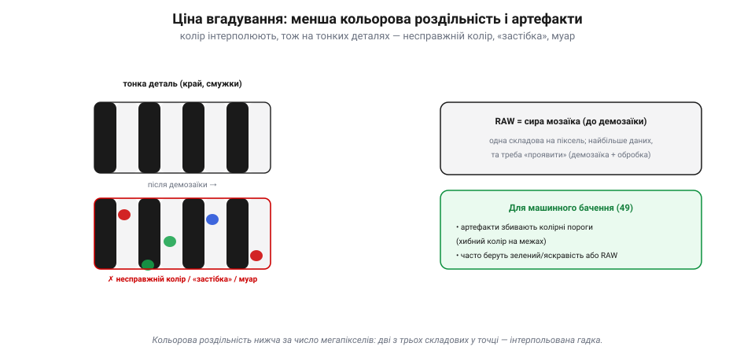

# Колір: баєрівський фільтр (демозаїка)

Сам [піксель сліпий до кольору](book:electronics/image-sensor): він лічить усі фотони підряд і знає тільки яскравість. Звідки ж тоді кольорове фото? Відповідь — хитрий компроміс, який стоїть майже в кожній цифровій камері: **баєрівський фільтр** і **демозаїка**. Розберімо, як із сітки сліпих до кольору відерець виходить барвистий кадр — і яку ціну за це платять.

### Дамо пікселю кольорове скельце

Раз піксель не розрізняє кольорів сам, навчимо його **бачити лише один**. Над кожним пікселем ставлять крихітне **кольорове скельце** — світлофільтр, що пропускає тільки свою смугу: червоний фільтр — лише червоне світло, зелений — зелене, синій — синє.

*Рис. Колір додає фільтр, не сам піксель. Без фільтра (ліворуч) піксель ловить усе світло й міряє лише яскравість — колір невідомий (сірий). Над пікселем ставлять кольорове скельце (праворуч), що пропускає лише свою смугу: червоний фільтр — лише червоне світло, зелений — зелене, синій — синє. Тепер кожен піксель міряє яскравість **свого** кольору.*

Тепер червоний піксель міряє, **скільки червоного** світла впало в цю цятку, зелений — скільки зеленого, синій — синього. Це геніально просте рішення: сам сенсор лишається тим самим сліпим лічильником фотонів, а колір додає **пасивне скельце** згори. Лишилося розкласти ці фільтри по матриці — і тут починається головна хитрість.

### Баєрівська мозаїка: шахівниця фільтрів

Як саме розкидати червоні, зелені й сині фільтри по мільйонах пікселів? Найвідоміша відповідь — **баєрівська мозаїка**: повторюваний квадрат 2×2 з фільтрів **R G / G B**, тобто червоний, два зелені й синій, тиражований по всій матриці шахівницею.

*Рис. Баєрівська мозаїка RGGB. Кольорові фільтри розкладені повторюваним квадратом 2×2: червоний, два зелені, синій — тиражованим по всій матриці. Зеленого **вдвічі** більше (50% проти 25% R і 25% B), бо око бере з нього найбільше деталей (яскравість/люмінанс), а до тонких відтінків кольору байдужіше. Кожен піксель дістає лише один фільтр — тож сира картина є мозаїкою одноколірних точок.*

Поглянь на пропорції: **50% зелених** фільтрів, по 25% червоних і синіх. Зеленого **вдвічі** більше — і це не примха. Людське око бере найбільше **деталей** (різкості) саме із зеленої частини спектра — звідти йде відчуття яскравості, *люмінансу*; а от до тонких відтінків кольору (*хромінансу*) воно куди байдужіше. Тому розумно густіше міряти те, що дає різкість (зелене), і рідше — те, що дає лише барву. Так баєрівська мозаїка віддає більше «роздільності» туди, де її помітить око.

> 📜 Цю мозаїку придумав **Брайс Баєр** (*Bryce Bayer*), науковець компанії **Kodak**, і запатентував 1976 року. У патенті він прямо назвав зелені пікселі «**чутливими до яскравості**», а червоні й сині — «чутливими до кольору», заклавши в саму сітку те, як бачить людське око: гостро до світла, м'яко до барви. Минуло півстоліття — а ця проста шахівниця RGGB досі стоїть майже в кожному цифровому сенсорі планети, від телескопа до камери твого дрона. Рідко чий винахід так тихо й так повсюдно служить.

### Демозаїка: вгадати дві відсутні складові

Тут криється каверза. У баєрівській матриці кожен піксель виміряв **лише один** колір — або червоний, або зелений, або синій. А для повноколірного кадру в **кожній** точці потрібні всі три: R, G **і** B. Звідки взяти два відсутні?

*Рис. Демозаїка вгадує відсутнє. У мозаїці червоний піксель виміряв лише R. Щоб дати йому повний колір, зелене й синє **інтерполюють** із сусідніх зелених і синіх пікселів (пунктирні стрілки). Так у кожній точці зрештою є R, G і B — повноколірний кадр; але дві з трьох складових у кожному пікселі не виміряні, а обчислені, тобто гадка.*

Їх **угадують** — інтерполюють із сусідів. Червоний піксель «питає» в найближчих зелених і синіх, скільки в них світла, і за цим **прикидає** свої власні зелене й синє. Той самий фокус роблять для кожного пікселя: одну складову він виміряв, дві домалював із оточення. Цей процес і зветься **демозаїка** (*demosaicing*) — складання повноколірної картини з одноколірної мозаїки. На виході — звичний кадр, де в кожному пікселі є R, G і B; от тільки **дві з трьох** складових у кожній точці — не виміряні, а **обчислена гадка**.

### Ціна вгадування: артефакти й знижена роздільність

За цю гадку доводиться платити. По-перше, **кольорова роздільність нижча**, ніж обіцяє число мегапікселів: камера «12 МП» насправді виміряла 6 млн зелених точок і по 3 млн червоних та синіх, а решту домалювала. По-друге, на **тонких деталях** інтерполяція помиляється — і з'являються **артефакти**: несправжні кольорові плями на чітких межах (*false color*), «застібка-блискавка» вздовж контурів (*zipper*), райдужний **муар** на дрібному візерунку.

*Рис. Артефакти демозаїки. На тонких деталях (смужки, чіткі межі) інтерполяція помиляється — і з'являються несправжні кольорові плями («застібка», муар). Праворуч: **RAW** — це сира мозаїка до демозаїки (одна складова на піксель, найбільше даних, але треба «проявити»). Для машинного бачення артефакти збивають колірні пороги, тож часто беруть RAW або яскравість.*

Звідси й поняття **RAW**: це **сира мозаїка** до демозаїки — одна складова на піксель, найбільше «чесних» даних, але її ще треба «проявити» (демозаїка плюс обробка), щоб дістати звичне фото. А JPEG із камери — це вже **після** демозаїки й обробки.

> 🔧 **Навіщо це.** Для [машинного бачення](book:algorithms/image-as-data) артефакти демозаїки — справжня халепа: несправжній колір на межах **збиває колірні пороги**, і алгоритм бачить барву, якої нема. Тому для надійного розпізнавання кольору часто беруть **RAW** (щоб самим контролювати інтерполяцію) або спираються на **зелений/яскравість**, де даних найбільше й гадки найменше. А ще пам'ятай: «мегапікселі» на наклейці — це лічильники відерець, а не чесна кольорова роздільність; дрібну кольорову деталь камера радше домалює, ніж побачить.

### Підсумок теми

Сенсор сліпий до кольору, тож колір йому додають **зовні**: над кожним пікселем ставлять кольоровий фільтр, що пропускає лише свою смугу. Розкладають ці фільтри **баєрівською мозаїкою** RGGB — із подвійною часткою зеленого, бо з нього око бере найбільше різкості (яскравість). Та кожен піксель тоді міряє лише **одну** складову, і дві відсутні доводиться **вгадувати** з сусідів — це **демозаїка**. Платою є знижена кольорова роздільність і артефакти (несправжній колір, муар) на тонких деталях, через що серйозні задачі беруть **RAW** або яскравісний канал. А скільки в кольоровому кадрі правди взагалі — окреме питання [шуму й динамічного діапазону](book:electronics/dynamic-range-noise) сенсора.

---
