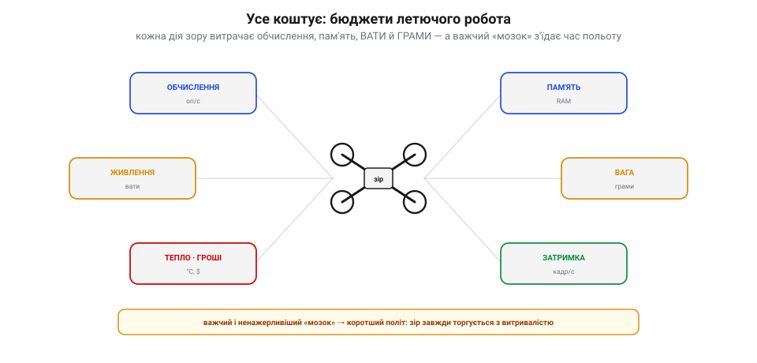
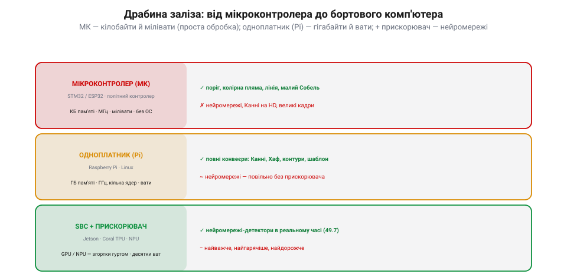
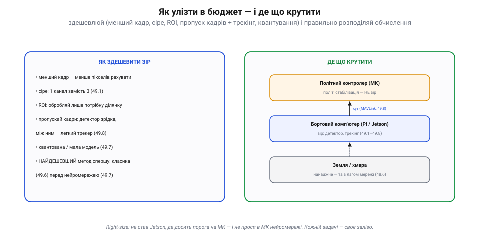

# Вартість обчислень: МК vs бортовий комп'ютер

Комп'ютерний зір зібрав цілий арсенал методів — від [читання пікселів](book:algorithms/image-as-data) до [нейромереж-детекторів](book:algorithms/nn-detectors) і [стеження за ціллю](book:algorithms/tracking). Та на летючому роботі діє жорстока арифметика: **усе коштує**, а бюджети — крихітні. Не кожен алгоритм улізе на борт, і головне інженерне рішення тут — **де** запускати зір: на простому мікроконтролері чи на повноцінному бортовому комп'ютері. Ця тема — про **ціну** обчислень і про те, як вкласти зір у те, що апарат справді підніме.

### Усе коштує: бюджети летючого робота

На відміну від комп'ютера на столі, апарат у польоті обмежений з усіх боків. Кожна дія зору витрачає кілька дефіцитних ресурсів **водночас**.

*Рис. Усе коштує. Зір на борту витрачає **обчислення** (операцій за секунду), **пам'ять** (RAM під кадр і модель), **живлення** (вати — а отже, час польоту), **вагу** (грами «мозку» — теж час польоту), **тепло** (треба відводити) і додає **затримку** (кадрів за секунду для керування). Усе це — спільний бюджет: важчий і ненажерливіший «мозок» **коротшає** політ. Зір завжди торгується з витривалістю.*

Найболючіше — **вати** й **грами**: потужніший комп'ютер більше важить і більше їсть, а отже, **скорочує** час польоту. Тобто зоровий «мозок» завжди забирає щось у витривалості апарата. Тому питання не «який алгоритм найкращий», а «що **влізе** в мій бюджет ват, грамів, пам'яті й затримки».

### Драбина заліза: від МК до бортового комп'ютера

Залізо для зору лягає в драбину — від крихітного й ощадливого до потужного й ненажерливого.

*Рис. Драбина заліза. **Мікроконтролер** (STM32/ESP32, сам політний контролер): кілобайти пам'яті, мегагерци, мілівати, без ОС — тягне поріг, колірну пляму, лінію, малий Собель; нейромережі чи Канні на HD — зась. **Одноплатник** (Raspberry Pi, Linux): гігабайти, гігагерци, вати — повні конвеєри (Канні, Хаф, контури, шаблон), а легкі нейромережі — повільно. **Одноплатник + прискорювач** (Jetson, Coral TPU, NPU): GPU/NPU роблять згортки гуртом — нейромережі-детектори в реальному часі, ціною десятків ват, тепла й грошей.*

На нижньому щаблі — **мікроконтролер** (МК): той самий чип, що часто й керує польотом. У нього кілобайти пам'яті й мегагерци — досить для **простої** обробки ([поріг](book:algorithms/threshold-morphology), [колірна пляма](book:algorithms/object-detection), стеження за лінією, [дрібний Собель](book:algorithms/edge-detection)), та аж ніяк не для нейромереж. Вище — **одноплатний комп'ютер** (Raspberry Pi й рідня): гігабайти, кілька гігагерцових ядер, Linux — тут уже крутяться **повні** конвеєри OpenCV (Канні, Хаф, контури, шаблони). А на верхньому щаблі — той самий одноплатник **із прискорювачем** (Jetson, Coral TPU, NPU чи GPU), що робить згортки гуртом і тягне [**нейромережі-детектори**](book:algorithms/nn-detectors) у реальному часі — ціною найбільших ват, тепла й ціни.

### Що скільки коштує: задача → мінімальне залізо

Звідси — практична мапа: кожній задачі зору відповідає **мінімальне** залізо, на якому вона поїде.

*Рис. Що скільки коштує. **Дешево** (тягне МК): поріг і морфологія, колірна пляма в HSV, стеження за лінією, малий Собель — для дронів це перший вибір. **Середньо** (одноплатник, CPU): Канні, перетворення Хафа, контури й форми, зіставлення з шаблоном, оптичний потік-трекінг. **Важко** (одноплатник + GPU/прискорювач): нейромережа-детектор та інференс, сегментація, багато класів — усе, де потрібна «навчена» загальність.*

Правило просте: спускайся драбиною вниз, доки задача ще їде. **Поріг, колірна пляма, лінія** — дешеві, тягне МК. **Канні, Хаф, контури, трекінг** — середні, треба одноплатник. **Нейромережа** — важка, треба прискорювач. Перш ніж тягти на борт Jetson, спитай: а може, цілі вистачить порога в HSV на тому чипі, що вже є?

### Як улізти в бюджет; де що крутити

Якщо задача все ж не влазить — її **здешевлюють**, а обчислення **розподіляють**.

*Рис. Як улізти й де крутити. **Здешевити зір**: менший кадр (менше пікселів), сіре (1 канал замість 3), ROI (лише потрібна ділянка), пропуск кадрів із трекінгом, квантована/мала модель, найдешевший метод спершу (класика перед нейромережею). **Розподілити**: політний контролер (МК) тримає політ — не зір; бортовий комп'ютер крутить зір і шле кут по MAVLink; найважче можна віддати на землю/в хмару (та з лагом мережі).*

Прийомів здешевлення кілька: **менший кадр** (менше пікселів), [**сіре**](book:algorithms/image-as-data) замість кольору (1 канал), **ROI** (обробляти лише ділянку, де ціль), **пропуск кадрів** із [трекінгом](book:algorithms/tracking) між ними, [**квантована**](book:algorithms/nn-detectors) чи мала модель — і завжди **найдешевший метод спершу**. А розподіл — це класична архітектура дрона: **політний контролер** (МК) займається лише польотом; **бортовий комп'ютер** (Pi/Jetson) крутить зір і віддає готовий [**кут** по MAVLink](book:algorithms/tracking); а найважче, як-от навчання, лишають **землі чи хмарі** (ціною [мережевої затримки](book:communications/video-transmission)). Кожній задачі — своє місце.

> 📜 **Менше за мікроконтролер — а сів на Місяць: комп'ютер Apollo (1969).** Коли здається, що бортовий чип «слабенький», згадай, на чому люди літали **на Місяць**. Бортовий комп'ютер «Аполлона» (Apollo Guidance Computer), що вів кораблі й садив місячний модуль, мав близько **2 тисяч** комірок оперативної пам'яті та **36 тисяч** постійної, а тактувався на **1 мегагерці** — менше, ніж найдешевший мікроконтролер на твоєму столі сьогодні. Та постійну пам'ять там не «прошивали», а **ткали руками**: дротик крізь магнітне кільце — одиниця, повз — нуль (так звана «канатна пам'ять»). Програму для цього дива писала команда під орудою **Маргарет Гамілтон** у Лабораторії приладобудування MIT — і писала так щільно й вивірено, що під час посадки Аполлона-11, коли комп'ютер **перевантажився** й заблимав тривогою «1202», її система не впала, а **відкинула** другорядні задачі й утримала головне — садіння. Урок для нашого зору подвійний: по-перше, **тісні рамки** змушують писати чисто (багу нема де сховатися); по-друге, розумна система під **перевантаженням** не падає, а **жертвує** найменш важливим — рівно те, що варто закладати й у бортовий зір. Якщо 2 кілослова посадили людину на Місяць, то твій Jetson здатен на чимало — за умови, що ти **поважаєш бюджет**.

> 🔧 **Навіщо це.** Підбирай залізо **під задачу**: не став Jetson, де досить порога на МК, і не проси в МК нейромережі. Лічи не лише обчислення, а й **вати та грами** — вони прямо коротшають політ. Якщо не влазить — **здешевлюй**: менший і сірий кадр, ROI, пропуск кадрів із трекінгом, квантована модель, найдешевший метод спершу. **Розподіляй**: контролер — політ, бортовий комп'ютер — зір (кут по MAVLink), земля — найважче. І, як Гамільтон, **плануй перевантаження**: хай під браком обчислень система кине другорядне, а не задачу польоту. Зрештою — заміряй **кадри за секунду** в реальному польоті: саме вони, а не паспортні цифри чипа, кажуть, чи встигає зір за керуванням.

### Підсумок

Зір на борту коштує **обчислень, пам'яті, ват, грамів, тепла й затримки**, тож залізо беруть **під задачу**: МК — для простого (поріг, пляма, лінія), одноплатник — для конвеєрів (Канні, Хаф, трекінг), одноплатник із прискорювачем — для нейромереж. Не влазить — здешевлюй (менший/сірий кадр, ROI, пропуск кадрів, квантування, найдешевший метод) і розподіляй (контролер — політ, комп'ютер — зір по MAVLink, земля — важке). А спадок Apollo нагадує: навіть крихітний комп'ютер здатен на велике, якщо поважати бюджет і гідно зносити перевантаження.

Зрештою цінник вирішує не менше, ніж сам алгоритм: апарат, що чесно вкладається в бюджет ват і грамів, літає й бачить, а перевантажений «мозок» лишається на землі. А оскільки найпотужніший зір спирається на [**навчені** моделі](book:algorithms/nn-detectors), за цією скринькою стоїть окрема велика тема — [**машинне навчання**](book:algorithms/what-is-ml), де ці моделі й народжуються.
