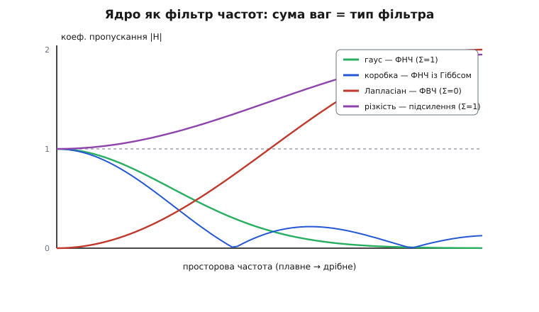
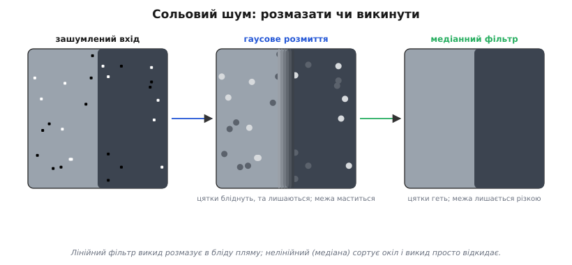
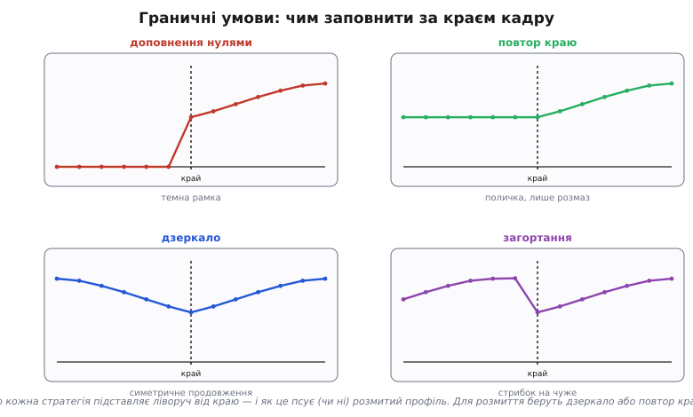

# Згортки й фільтри: повна механіка просторового фільтра

<preknowlist>
- [Зображення як дані](topic:algorithms/image-as-data) — кадр є сіткою чисел яскравості, по одному на піксель.
- [Ідея Фур'є](topic:math/fourier-idea) — розклад сигналу на суму частот; на ньому тримається частотний погляд на ядра.
</preknowlist>

Згортка — це двигун майже всієї просторової обробки зображень: розмиття, різкість, виявлення меж, перший шар згорткових нейромереж. Базова ідея проста — маленьке ядро ваг ковзає кадром, і зважена сума околу стає новим пікселем. Та за цією простотою ховається другий шар, без якого не написати фільтр, що реально працює на борту: чому одні ядра коштують утричі дешевше за інші, чому одне ядро «бачить» лише межі, а інше — лише плавне; що робити на краю кадру, де ядро звисає за межу; як перевести дробові ваги в цілу арифметику мікроконтролера, не втративши точності; і де лінійної згортки взагалі не досить — там, де її змінюють нелінійні фільтри. Розберемо все це від формул до робочого коду.

## Математичний фундамент: від формули до інтуїції

Почнімо з точного означення, бо саме з нього випливає все інше. Маємо зображення `x` — сітку чисел яскравості — і ядро `h` — маленьку сітку ваг. Двовимірна дискретна згортка визначає новий кадр `y`:

```
y[m,n] = Σ Σ  x[i,j] · h[m−i, n−j]
         i  j
```

Сума береться по всіх парах `i, j`, де ядро ненульове — тобто лише по пікселях під ядром. Серце формули — аргумент `h[m−i, n−j]` з мінусом. Розпишімо, що він означає для конкретного вихідного пікселя `(m,n)`. Коли вхідний індекс `i` дорівнює `m` (стоїмо на центрі), ядро адресується нулем — це центральна вага. Коли `i` менше за `m` (сусід зверху), `m−i` додатне — беремо вагу з **нижньої** половини ядра. Коли `i` більше за `m` (сусід знизу), `m−i` від'ємне — беремо вагу зверху. Отже, ядро лягає на зображення **перевернутим** в обох вимірах. Це не примха запису, а суть згортки, і нижче ми побачимо, звідки взявся мінус.

Зручніше індексувати ядро симетрично навколо центру. Для 3×3 зсуви `a, b` бігають від −1 до +1, центр — `h[0,0]`, і формула набуває вигляду, у якому видно механіку ковзання:

```
y[m,n] = Σ   Σ   x[m+a, n+b] · h[−a, −b]
        a=−1 b=−1
```

Щоб дістати один вихідний піксель, обходимо окіл навколо `(m,n)`, множимо кожен сусідній піксель на вагу ядра з **протилежним** знаком зсуву й додаємо. Інтуїція проста: ядро — це **рецепт зважування околу**. Рівні ваги усереднюють (виходить розмиття), протиставні ваги віднімають один бік від іншого (виходить перепад, тобто межа), велика центральна вага з малими від'ємними сусідами підкреслює, чим піксель різниться від околу (виходить різкість). Уся сила в одній думці: механізм ковзання той самий, ефект задають числа в ядрі.

### Кореляція проти згортки: один перевернутий крок

Поряд зі згорткою живе майже двійник — **взаємна кореляція** (англ. *cross-correlation*). Її формула відрізняється рівно знаком зсуву:

```
кореляція:  y[m,n] = Σ Σ x[m+a, n+b] · h[ a,  b]    ← ядро як написане
згортка:    y[m,n] = Σ Σ x[m+a, n+b] · h[−a, −b]    ← ядро перевернуте
```

Кореляція кладе ядро як є, без перевертання — це інтуїтивніше («приклали шаблон, поміряли збіг»), і саме тому в обробці зображень і в «згорткових» шарах нейромереж реально рахують переважно кореляцію, хоч і кажуть «згортка». Для **симетричного** ядра різниці немає взагалі: гаус, коробкове усереднення, Лапласіан симетричні відносно центру, тож `h[−a,−b] = h[a,b]` і перевертання нічого не змінює. Різниця прокидається на **несиметричних** ядрах — а такі є серед найважливіших, як-от Собель для градієнта. Для них згортка дає дзеркальний знак відгуку проти кореляції; результат не «неправильний», але полярність інша, і якщо далі по конвеєру код очікує певний напрямок градієнта — плутанина дасть дзеркало. Тому коли береш ядро з підручника (класична згортка) у бібліотеку (кореляція), для антисиметричних ядер знак варто перевірити на тестовому перепаді. Глибше це — у [математиці двовимірної згортки](topic:algorithms/convolution-filters/math-2d-convolution.md).

### Звідки мінус: спадок аналогової згортки

Перевертання — не примха цифрової обробки, а спадок від **неперервної** згортки, що описує відгук лінійної системи на сигнал:

```
(x * h)(t) = ∫ x(τ) · h(t − τ) dτ
```

Тут `h` — імпульсна характеристика системи, її відгук на миттєвий поштовх. Аргумент `t − τ` каже: відгук на поштовх у момент `τ` доживає до моменту `t` через проміжок `t − τ`, тож давніший поштовх ми бачимо далі по хвосту характеристики. Саме ця затримка дає перевернутий аргумент. Двовимірна дискретна згортка — пряма аналогія: пікселі замість миттєвостей, ядро замість імпульсної характеристики, сума замість інтеграла, той самий мінус. Тому згортка успадковує властивості лінійних систем — вона лінійна й **комутативна** (`x * h = h * x`, байдуже, що з чого ковзає), і на ній тримається строга теорія: теорема про згортку, частотний аналіз, каскади фільтрів. Кореляція повної комутативності не має; перевертання — це ціна за математичну охайність.

## Розділювані ядра: 2k замість k²

Тепер — практичний скарб, схований у формулі. Деякі ядра розкладаються на **зовнішній добуток** вектора-стовпця `c` і вектора-рядка `r`:

```
h[a,b] = c[a] · r[b]
```

Таке ядро звуть **розділюваним** (англ. *separable*, від лат. *separare* «відділяти»). Класика — гаусове розмиття. Гаус 3×3

```
1  2  1
2  4  2     ÷ 16
1  2  1
```

є добутком `[1 2 1]ᵀ · [1 2 1] ÷ 16`: кут 1·1=1, край 1·2=2, центр 2·2=4 — усе лягає на місце. Це не випадковість: двовимірний гаус `exp(−(x²+y²)/2σ²)` за властивістю показника **множиться** на `exp(−x²/2σ²) · exp(−y²/2σ²)` — добуток двох однакових одновимірних гаусів. Гаус розділюваний за своєю природою.

Чому це варте окремої назви — видно з арифметики. Розпишемо згортку розділюваним ядром і винесемо суму:

```
y[m,n] = Σ Σ x[m+a, n+b] · c[a] · r[b]
       = Σ c[a] · ( Σ x[m+a, n+b] · r[b] )
         a            b
```

Внутрішня сума по `b` — згортка **рядка** з одновимірним ядром `r`; зовнішня по `a` — згортка результату по **стовпцю** з ядром `c`. Тобто двовимірний прохід ядром `k×k` розпадається на два одновимірні: спершу розмиваємо кожен рядок, тоді стовпці того, що вийшло. Замість `k²` множень на піксель — `2k`. Для 5×5 це 10 проти 25, для 9×9 — 18 проти 81; виграш росте лінійно з `k`.

Доведемо це на коді — два прості одновимірні проходи через проміжний буфер:

**Розділюване гаусове розмиття 5×5, ваги (1,4,6,4,1), сума 16.**
:::tabs
```cpp
#include <stdint.h>
#define KR 2                                   /* радіус: 5 = 2*KR+1 */
static const int32_t W[5] = {1, 4, 6, 4, 1};   /* сума 16 = 2^4 */
static inline int clampi(int v, int lo, int hi){
    return v < lo ? lo : (v > hi ? hi : v);
}
/* горизонтальний прохід: кожен рядок згортаємо з W */
static void blur_h(const uint8_t *s, uint8_t *d, int w, int h){
    for (int y = 0; y < h; ++y)
        for (int x = 0; x < w; ++x){
            int32_t a = 0;
            for (int t = -KR; t <= KR; ++t)
                a += W[t+KR] * s[(size_t)y*w + clampi(x+t,0,w-1)];
            d[(size_t)y*w + x] = (uint8_t)((a + 8) >> 4);   /* /16 з округленням */
        }
}
/* вертикальний прохід: кожен стовпець згортаємо з тим самим W */
static void blur_v(const uint8_t *s, uint8_t *d, int w, int h){
    for (int y = 0; y < h; ++y)
        for (int x = 0; x < w; ++x){
            int32_t a = 0;
            for (int t = -KR; t <= KR; ++t)
                a += W[t+KR] * s[(size_t)clampi(y+t,0,h-1)*w + x];
            d[(size_t)y*w + x] = (uint8_t)((a + 8) >> 4);
        }
}
void gauss5(const uint8_t *src, uint8_t *dst, uint8_t *tmp, int w, int h){
    blur_h(src, tmp, w, h);   /* спершу рядки */
    blur_v(tmp, dst, w, h);   /* тоді стовпці */
}
```
```python
KR = 2                       # радіус: 5 = 2*KR+1
W = (1, 4, 6, 4, 1)          # сума 16 = 2^4

def clampi(v, lo, hi):
    return lo if v < lo else (hi if v > hi else v)

# горизонтальний прохід: кожен рядок згортаємо з W
def blur_h(s, d, w, h):
    for y in range(h):
        for x in range(w):
            a = 0
            for t in range(-KR, KR + 1):
                a += W[t + KR] * s[y*w + clampi(x + t, 0, w - 1)]
            d[y*w + x] = (a + 8) >> 4            # /16 з округленням

# вертикальний прохід: кожен стовпець згортаємо з тим самим W
def blur_v(s, d, w, h):
    for y in range(h):
        for x in range(w):
            a = 0
            for t in range(-KR, KR + 1):
                a += W[t + KR] * s[clampi(y + t, 0, h - 1)*w + x]
            d[y*w + x] = (a + 8) >> 4

def gauss5(src, dst, tmp, w, h):
    blur_h(src, tmp, w, h)   # спершу рядки
    blur_v(tmp, dst, w, h)   # тоді стовпці
```
:::

Числовий приклад на одному рядку. Хай п'ять сусідніх пікселів — `(10, 40, 80, 200, 210)`, центр — третій (значення 80). Згортка з вагами (1,4,6,4,1):

```
acc = 1·10 + 4·40 + 6·80 + 4·200 + 1·210
    = 10 + 160 + 480 + 800 + 210 = 1660
out = (1660 + 8) >> 4 = 1668 / 16 = 104   (округлено)
```

Центральні 80 «підтяглися» до 104 під впливом яскравих сусідів праворуч — рядок став плавнішим. Так само вчинить вертикальний прохід, і разом вони дадуть точнісінько повний 2D-гаус, але за 10 множень на піксель замість 25. Повна реалізація зі смуговим буфером і виміром тактів — у [розділюваному гаусовому розмитті](topic:algorithms/convolution-filters/proj-separable-blur.md).

Не всяке ядро розділюване. Строга перевірка: матриця ядра розділювана тоді й лише тоді, коли її **ранг дорівнює одиниці** — усі рядки пропорційні. Гаус, коробкове усереднення (всі ваги рівні — ранг 1), будь-який добуток рядка на стовпець — так. Ядро Лапласіана (0 1 0 / 1 −4 1 / 0 1 0) має ранг 2 і одним проходом-проходом не береться. Тема має власну статтю — [розділювані фільтри](topic:algorithms/convolution-filters).

## Частотний погляд на ядра

Є ще один спосіб подивитися на ядро — і він пояснює, **чому** ваги дають саме такий ефект. Зображення розкладається на просторові **частоти**: плавні переходи яскравості — низькі частоти, різкі межі й дрібна текстура — високі, шум — найвищі. Розклад робить двовимірне перетворення Фур'є, і спрацьовує **теорема про згортку**: згортка в просторі дорівнює поточковому множенню в частотах. Тому ядро діє на кожну частоту просто як множник — його частотна характеристика `H` каже, у скільки разів кожна частота пройде крізь фільтр.

Прикладімо це до знайомих ядер.

**Гаусове розмиття — фільтр низьких частот.** Перетворення гаусу — знову гаус: гладкий горб, що дорівнює 1 у нулі (сума ваг ядра — 1, тож стала яскравість проходить ціла) і плавно спадає до нуля на високих частотах. Плавне проходить, дрібне й шум гасяться. Ось чому розмиття «з'їдає» дрібне й глушить шум — воно множить високі частоти на майже-нуль.

**Коробкове усереднення — теж фільтр низьких частот, але «брудний».** Його характеристика — не гладкий горб, а функція `sin(x)/x` (ядро sinc), що спадає **з хвилями**: перетинає нуль, знову трохи піднімається (бічні пелюстки), знову падає. Через пелюстки коробка пропускає назад частину високих частот зі зміненим знаком — звідси легкі смуги-відлуння біля різких меж (ефект Ґіббса, на честь Джозайї Ґіббса, що описав ці коливання при обриві ряду Фур'є). Тому коробкове розмиття грубіше за гаусове.

**Лапласіан — фільтр високих частот.** Його ваги в сумі дають **нуль**, тож `H` у нулі дорівнює нулю: рівне поле дає на виході нуль. На високих частотах `H` росте за модулем — перепади підсилюються найсильніше. Тому Лапласіан «бачить» лише межі й текстуру.

Звідси правило, яке зчитується прямо з ваг, без жодного перетворення:

```
Σ ваг = 1   → фільтр низьких частот (розмиття): зберігає яскравість, гасить дрібне
Σ ваг = 0   → фільтр високих частот (межі): обнуляє рівне, підсилює перепади
Σ ваг > 1   → підсилення (різкість): сталу лишає, високі частоти задирає
```

Ядро різкості (0 −1 0 / −1 5 −1 / 0 −1 0) має суму ваг 1, але це особлива одиниця: воно дорівнює тотожному ядру **плюс** Лапласіан (центр 1+4=5, сусіди 0−1=−1). Тотожне пропускає все, Лапласіан додає підсилення високих частот — разом характеристика дорівнює 1 на низьких і **більша за 1** на високих. Тому різкість лишає загальну яскравість, але задирає перепади й дрібні деталі — і заразом шум, бо він теж високочастотний. Це не вада конкретного ядра, а наслідок того, що «підкреслити дрібне» і «підкреслити шум» у частотах — одне й те саме.


*Як кожне ядро пропускає просторові частоти. По горизонталі — частота (ліворуч нуль/плавне, праворуч найвищі/дрібне), по вертикалі — коефіцієнт пропускання. Гаус — гладкий спад до нуля; коробка — спад із хвилями (бічні пелюстки, ефект Ґіббса); Лапласіан — нуль у нулі й ріст угору (фільтр високих частот); різкість — одиниця на низьких і понад одиницю на високих. Сума ваг ядра одразу каже тип: 1 — низькі частоти, 0 — високі, понад 1 — підсилення.*

> 🔧 **Навіщо це.** Не треба рахувати перетворення Фур'є, щоб судити про ядро — досить **додати його ваги**. Сума 1 — розмиватиме (зберігає яскравість). Сума 0 — даватиме межі (рівне поле обнулить). Сума понад 1 — гостритиме (і шум разом). Це найшвидша перевірка чужого або власного ядра: якщо хотів розмиття, а ваги в сумі не одиниця — яскравість попливе; якщо хотів межі, а сума не нуль — на виході лишиться сірий серпанок від сталої складової.

## Нелінійні просторові фільтри

Уся згортка лінійна: вихід — зважена сума входу. Лінійність має межу. Розмиття глушить шум, усереднюючи його із сусідами, — але заразом мастить і справжні межі, бо усереднення не розрізняє «це межа» і «це шум»: воно тупо бере середнє. Проти певних видів спотворень потрібен фільтр, що **дивиться на окіл і вирішує**, а не просто множить-додає. Такі фільтри звуть **нелінійними**.

### Медіанний фільтр: проти сольового шуму

Класична біда камер — **сольовий шум** (англ. *salt-and-pepper noise*): поодинокі пікселі вистрілюють у чисто білий або чисто чорний (биті комірки матриці, збій передачі). Лінійне розмиття з таким безсиле: воно **розмазує** білу цятку по сусідах, перетворюючи різкий викид на бліду пляму, але не прибирає його. А медіанний фільтр прибирає начисто. Ідея: для кожного пікселя беремо його окіл, **сортуємо** значення й беремо **середнє за порядком** (медіану), а не середнє арифметичне. Білий викид (255) опиняється в кінці відсортованого ряду й просто **відкидається** — медіаною стає значення нормального сусіда. Один-два викиди на окіл медіана ігнорує повністю, тоді як усереднення розмазало б їх.

**Медіанний фільтр 3×3 (вікно з 9 значень).** Для дев'яти чисел медіана — п'яте за порядком; повне сортування не потрібне, досить часткового відбору.
:::tabs
```cpp
#include <stdint.h>
static inline void swap_u8(uint8_t *a, uint8_t *b){
    if (*a > *b){ uint8_t t = *a; *a = *b; *b = t; }
}
/* медіана дев'яти: відсортувати достатньо, щоб 5-й елемент став на місце */
static uint8_t median9(uint8_t v[9]){
    /* мережа сортування для 9 елементів дає median у v[4] */
    for (int i = 0; i < 5; ++i)            /* частковий вибірковий прохід */
        for (int j = i + 1; j < 9; ++j)
            swap_u8(&v[i], &v[j]);         /* після i=4 v[4] = 5-й за порядком */
    return v[4];
}
static inline int clampi(int x, int lo, int hi){
    return x < lo ? lo : (x > hi ? hi : x);
}
void median3(const uint8_t *src, uint8_t *dst, int w, int h){
    for (int y = 0; y < h; ++y)
        for (int x = 0; x < w; ++x){
            uint8_t v[9]; int k = 0;
            for (int dy = -1; dy <= 1; ++dy)          /* зібрати окіл 3x3 */
                for (int dx = -1; dx <= 1; ++dx){
                    int yi = clampi(y+dy, 0, h-1);
                    int xi = clampi(x+dx, 0, w-1);
                    v[k++] = src[(size_t)yi*w + xi];
                }
            dst[(size_t)y*w + x] = median9(v);
        }
}
```
```python
def clampi(x, lo, hi):
    return lo if x < lo else (hi if x > hi else x)

# медіана дев'яти: відсортувати достатньо, щоб 5-й елемент став на місце
def median9(v):
    # частковий вибірковий прохід: після i=4 v[4] = 5-й за порядком
    for i in range(5):
        for j in range(i + 1, 9):
            if v[i] > v[j]:
                v[i], v[j] = v[j], v[i]
    return v[4]

def median3(src, dst, w, h):
    for y in range(h):
        for x in range(w):
            v = []                                    # зібрати окіл 3x3
            for dy in range(-1, 2):
                for dx in range(-1, 2):
                    yi = clampi(y + dy, 0, h - 1)
                    xi = clampi(x + dx, 0, w - 1)
                    v.append(src[yi*w + xi])
            dst[y*w + x] = median9(v)
```
:::

Числовий приклад. Хай окіл — нормальні пікселі біля 100 з одним битим білим: `(98,102,100, 99,255,101, 97,100,103)`. Середнє арифметичне = (98+102+100+99+255+101+97+100+103)/9 ≈ **117** — викид 255 підтягнув середнє вгору, цятка лишилась видимою світлою плямою. Відсортуємо: `97,98,99,100,100,101,102,103,255` — медіана (п'яте) = **100**. Викид зник без сліду, межа поряд (якби була) не змастилась. Ось у чому сила сортування проти усереднення: одне грубе число псує середнє, але не зрушує середини ряду.

Платять за це швидкістю — сортування дорожче за множення-додавання, і вікно більше за 3×3 коштує помітно більше; та для сольового шуму це єдине, що працює чисто. І медіана **не розділювана** — її не розкласти на два проходи, бо сортування рядка, тоді стовпця не дає медіану квадрата (це інша, грубіша операція).

### Білатеральний фільтр: розмити, не змастивши межі

Гаусове розмиття зважує сусідів лише за **відстанню**: ближній сусід важить більше, дальній менше — байдуже, якої він яскравості. Тому воно мастить межі: піксель на світлому боці межі всереднюється з темними сусідами по той бік, і чіткий перепад розпливається. **Білатеральний фільтр** (англ. *bilateral*, від лат. *bi-* «дво-» + *latus* «бік» — «двобічний», бо важить по двох вимірах) додає другу вагу — за **різницею яскравості**. Сусід важить багато, лише якщо він і близький **у просторі**, і схожий **за яскравістю**. Тоді на межі сусіди з іншого, несхожого боку дістають майже нульову вагу — і в усереднення не входять. Результат: рівні ділянки згладжуються (там сусіди й близькі, й схожі), а межі лишаються різкими (через межу яскравість стрибає, тож протилежний бік відсікається).

**Білатеральний фільтр (вікно 2R+1, дві гаусові ваги).** Просторову гаусову вагу можна порахувати наперед у таблицю; яскравісну — на льоту за різницею.
:::tabs
```cpp
#include <stdint.h>
#include <math.h>
#define R 2                       /* радіус вікна: 5x5 */
/* білатеральний фільтр одного каналу uint8; ss — просторова сигма, sr — яскравісна */
void bilateral(const uint8_t *src, uint8_t *dst, int w, int h,
               float ss, float sr){
    float gs[2*R+1][2*R+1];                       /* просторові ваги наперед */
    for (int dy = -R; dy <= R; ++dy)
        for (int dx = -R; dx <= R; ++dx)
            gs[dy+R][dx+R] = expf(-(dx*dx + dy*dy) / (2.0f*ss*ss));
    for (int y = 0; y < h; ++y)
        for (int x = 0; x < w; ++x){
            float wsum = 0.0f, acc = 0.0f;
            int   c = src[(size_t)y*w + x];        /* яскравість центру */
            for (int dy = -R; dy <= R; ++dy)
                for (int dx = -R; dx <= R; ++dx){
                    int yi = y+dy, xi = x+dx;
                    if (yi < 0 || yi >= h || xi < 0 || xi >= w) continue;
                    int   p  = src[(size_t)yi*w + xi];
                    int   d  = p - c;                          /* різниця яскравості */
                    float gr = expf(-(float)(d*d) / (2.0f*sr*sr));  /* яскравісна вага */
                    float ww = gs[dy+R][dx+R] * gr;            /* добуток двох ваг */
                    acc  += ww * p;
                    wsum += ww;
                }
            dst[(size_t)y*w + x] = (uint8_t)(acc / wsum + 0.5f);
        }
}
```
```python
import math

R = 2                         # радіус вікна: 5x5

# білатеральний фільтр одного каналу uint8; ss — просторова сигма, sr — яскравісна
def bilateral(src, dst, w, h, ss, sr):
    gs = [[0.0] * (2*R+1) for _ in range(2*R+1)]   # просторові ваги наперед
    for dy in range(-R, R + 1):
        for dx in range(-R, R + 1):
            gs[dy+R][dx+R] = math.exp(-(dx*dx + dy*dy) / (2.0*ss*ss))
    for y in range(h):
        for x in range(w):
            wsum = 0.0
            acc = 0.0
            c = src[y*w + x]                       # яскравість центру
            for dy in range(-R, R + 1):
                for dx in range(-R, R + 1):
                    yi, xi = y + dy, x + dx
                    if yi < 0 or yi >= h or xi < 0 or xi >= w:
                        continue
                    p = src[yi*w + xi]
                    d = p - c                                 # різниця яскравості
                    gr = math.exp(-(d*d) / (2.0*sr*sr))       # яскравісна вага
                    ww = gs[dy+R][dx+R] * gr                  # добуток двох ваг
                    acc += ww * p
                    wsum += ww
            dst[y*w + x] = int(acc / wsum + 0.5)
```
:::

Дві гаусові ваги множаться: `gs` гасить дальніх сусідів, `gr` гасить несхожих. На рівній ділянці `gr ≈ 1` для всіх — фільтр поводиться як звичайний гаус. На межі `gr ≈ 0` для протилежного боку — той бік не входить у суму, і перепад лишається крутим. Платять за це дорого: яскравісну вагу не порахувати наперед (вона залежить від кожної пари пікселів), тож `exp` рахується в найглибшому циклі — на мікроконтролері це важко, і білатеральний фільтр зазвичай лишають потужнішому процесору. Та коли треба прибрати шум **і зберегти межі** — лінійне розмиття так не вміє.


*Однаковий зашумлений кадр (рівне поле з різкою межею посередині, поцятковане білими й чорними викидами) після гаусового розмиття й після медіанного фільтра. Гаус усереднює викид із сусідами — цятка блідне, але лишається, а заразом мастить межу. Медіана сортує окіл і відкидає викид як крайній елемент — цятки зникають повністю, межа лишається різкою. Лінійний фільтр викид розмазує; нелінійний — викидає.*

## Граничні умови детально

Біля краю кадру ядро звисає за межу — частина ваг лягає на неіснуючі пікселі. Що підставити замість них — не дрібниця: від цього залежить, які артефакти підуть по периметру. Чотири головні стратегії:

**Доповнення нулями (zero-padding).** За межею вважаємо піксель чорним (0). Просто, але на світлому краю дає **темну рамку**: усереднення з вигаданими нулями занижує яскравість крайніх пікселів. Для розмиття це видима пляма по периметру; для ядер із нульовою сумою (межі) — фальшивий перепад уздовж самого краю, бо різкий стрибок «яскраво → раптом нуль» ядро бачить як справжню межу.

**Повтор краю (edge-clamp).** Піксель за межею дорівнює найближчому крайньому. Формула: індекс обрізається до `[0, розмір−1]`. Темної рамки немає, фальшивого перепаду теж — лише сам край трохи «розмазується» вздовж себе. Для більшості фільтрів це найбезпечніший вибір за замовчуванням.

**Дзеркало (mirror).** За межею кадр відбивається, як у дзеркалі: піксель на позиції −1 дорівнює пікселю +1, −2 → +2. Найприродніший для гаусу: продовжує текстуру краю симетрично, без штучного стрибка, тож і артефактів найменше. Дорожчий за clamp лиш на обчислення відбитого індексу.

**Загортання (wrap).** Кадр вважається періодичним: за правим краєм іде лівий. Це математично «чесний» варіант для перетворення Фур'є (воно саме так трактує сигнал), але візуально найгірший: верх кадру «протікає» в низ, а ліво в право — на межі з'являються кольори з протилежного боку зображення, яким там не місце.

```
zero-padding : … 0  0 │ a b c d … w x y │ 0  0 …    (вигадані нулі → темна рамка)
edge-clamp   : … a  a │ a b c d … w x y │ y  y …    (повтор краю → лише розмаз)
mirror       : … c  b │ a b c d … w x y │ x  w …    (відбиття → найприродніше)
wrap         : … x  y │ a b c d … w x y │ a  b …    (період → чужий бік протікає)
```


*Що кожна стратегія підставляє за лівий край кадру (вертикальна риска) і як це позначається на розмитому профілі. Доповнення нулями тягне крайні пікселі донизу (темна рамка). Повтор краю продовжує крайнє значення пласкою поличкою — край лише трохи розмазується. Дзеркало симетрично відбиває сусідні пікселі — продовження найприродніше. Загортання підставляє значення з протилежного краю — на межі стрибок на чуже. Для розмиття беруть дзеркало або повтор краю; нулів і загортання уникають.*

> 🔧 **Навіщо це.** Граничні умови — типове джерело «звідки рамка по периметру?». Якщо після розмиття край кадру потемнів — це доповнення нулями, заміни на повтор краю чи дзеркало. Якщо виявлення меж малює фальшивий контур точно вздовж рамки — знову нулі, той самий фікс. Для гаусу бери дзеркало (найприродніше), для всього іншого — повтор краю (найдешевше й безпечно). Загортання — лише коли свідомо працюєш у частотній області через перетворення Фур'є.

## Фіксована точка й SIMD

Ваги ядер часто дробові (гаус ділиться на 16, на 256), а мікроконтролер на кшталт ARM Cortex-M4 рахує цілими швидко, а дробами — повільно або зовсім без апаратної підтримки. Вихід — **фіксована точка**: дробові коефіцієнти подаємо цілими, а масштаб тримаємо в голові. Запис **Q8** означає 8 дробових бітів: число множимо на 2⁸ = 256, рахуємо в цілих, наприкінці зсуваємо назад на 8. Так дробова вага 0.0625 (тобто 1/16) стає цілим `0.0625 × 256 = 16`, з нею множать цілий піксель, а суму ділять назад зсувом `>> 8`.

Перехід ваг у фіксовану точку — три кроки: **нормувати** (поділити ваги на їхню суму, щоб вони давали 1), **помножити** на масштаб і **округлити** до цілих, тоді наприкінці **зсунути назад**. Якщо ж сума ваг сама є степенем двійки (як 16 у гаусі), масштабувати не треба зовсім — ділення на 16 і є зсув `>> 4`, без жодного множення.

**Гаус 3×3 у цілій арифметиці (uint8), ваги 1 2 1 / 2 4 2 / 1 2 1, сума 16.**
:::tabs
```cpp
#include <stdint.h>
static inline int clampi(int v, int lo, int hi){
    return v < lo ? lo : (v > hi ? hi : v);
}
/* один піксель гаусу 3x3; сума ваг 16 → нормування = зсув на 4 з округленням */
static uint8_t gauss3_px(const uint8_t *s, int w, int h, int x, int y){
    static const int wk[3][3] = {{1,2,1},{2,4,2},{1,2,1}};
    int32_t acc = 0;
    for (int dy = -1; dy <= 1; ++dy)
        for (int dx = -1; dx <= 1; ++dx){
            int yi = clampi(y+dy, 0, h-1);
            int xi = clampi(x+dx, 0, w-1);
            acc += wk[dy+1][dx+1] * s[(size_t)yi*w + xi];
        }
    return (uint8_t)((acc + 8) >> 4);   /* +8 = пів-дільника → округлення до найближчого */
}
```
```python
def clampi(v, lo, hi):
    return lo if v < lo else (hi if v > hi else v)

# один піксель гаусу 3x3; сума ваг 16 → нормування = зсув на 4 з округленням
def gauss3_px(s, w, h, x, y):
    wk = ((1, 2, 1), (2, 4, 2), (1, 2, 1))
    acc = 0
    for dy in range(-1, 2):
        for dx in range(-1, 2):
            yi = clampi(y + dy, 0, h - 1)
            xi = clampi(x + dx, 0, w - 1)
            acc += wk[dy+1][dx+1] * s[yi*w + xi]
    return (acc + 8) >> 4                 # +8 = пів-дільника → округлення до найближчого
```
:::

Ключова деталь — `+ 8` перед зсувом. Без нього зсув `>> 4` відкидає дробову частину **вниз** (це підлога ділення), і кожен прохід трохи затемнює кадр; на каскаді фільтрів дрейф накопичується. Додавання половини дільника (8 для дільника 16) перетворює відкидання на чесне округлення до найближчого. Накопичувач `int32_t` гарантовано не переповниться: максимум 255 × 16 = 4080, далеко до межі.

Похибка заокруглення мала, але не нульова, і зростає з кількістю дробових бітів навпаки — чим їх менше, тим грубіше. Орієнтир:

```
формат   масштаб   макс. похибка ваги   придатність
Q4       16        ~3 % на коефіцієнт    грубо; помітно на градієнтах
Q8       256       ~0.2 %                стандарт для 8-біт зображень
Q16      65536     ~0.0015 %             із запасом; треба ширший акумулятор
```

Для 8-бітних зображень Q8 — золота середина: похибка коефіцієнта близько 0.2 %, що менше за крок самої яскравості (1 з 256). Q4 уже помітний на плавних градієнтах (смуги-сходинки), Q16 точніший за потрібне й вимагає ширшого акумулятора, щоб уникнути переповнення.

Коли й цілої арифметики замало за швидкістю, Cortex-M4 пропонує **SIMD** — одна інструкція над кількома числами заразом (англ. *single instruction, multiple data*). Інструкція `SMLAD` множить дві пари 16-бітних чисел і додає обидва добутки до акумулятора **за один такт** — тобто два множення-додавання згортки коштують один такт замість двох. Якщо запакувати ваги й пікселі по двоє в 32-бітне слово, згортка прискорюється вдвічі майже задарма. Це шліфування поверх головного виграшу — переходу від `k²` до `2k` розділюваністю; SIMD множить уже зменшене число, а не замінює алгоритмічну економію.

## Ціна на різних платформах

Зберемо ціну в одне місце — скільки мільйонів операцій множення-додавання (MOPS) на секунду треба, щоб прогнати згортку по кадру 320×240 на 30 кадрах/с, і чи витягне це типове ядро. Робота на кадр: `пікселі × множень_на_піксель`, помножити на частоту кадрів.

```
320×240 = 76 800 пікселів × 30 кадрів/с = 2.3 млн пікселів/с (базова норма)

ядро          множень/піксель   MOPS потрібно
3×3 повне           9              20.7
3×3 розділюване     6              13.8
5×5 повне          25              57.6
5×5 розділюване    10              23.0
```

Тепер платформи. Числа орієнтовні (залежать від компілятора, пам'яті, кешу) — це **порядок величини**, не паспорт:

```
платформа              такт      грубий бюджет        3×3 розд.   5×5 повне   5×5 розд.
Cortex-M4 @ 168 МГц    168 МГц   ~1 множ./такт         встигає     не встигає  ледь-ледь
Cortex-M7 @ 480 МГц    480 МГц   кеш + 2 конвеєри      легко       впритул     встигає
Cortex-A53 @ 1.4 ГГц   1.4 ГГц   SIMD NEON, кеш L1/L2  з запасом   з запасом   з запасом
```

Звідси практичне правило переходу. На **Cortex-M4** живе лише дрібне: 3×3 розділюване проходить, 5×5 повне — ні, 5×5 розділюване ледь влазить, лишаючи на решту конвеєра майже нічого. На **Cortex-M7** з кешем і подвійним конвеєром поміщається й 5×5. **Cortex-A53** із SIMD NEON прожовує будь-яку розумну згортку із запасом. А коли потрібні великі ядра (7×7, 9×9), кілька фільтрів поспіль або робота на повній роздільності — це сигнал передати обробку **GPU** чи апаратному **ISP** (процесору обробки зображень у складі камерного тракту), які роблять згортку паралельно над усім кадром. Загальне правило: малі розділювані ядра — мікроконтролеру; великі чи каскади — спеціалізованому залізу. Глибше про цей поріг — у [вартості обчислень](topic:algorithms/compute-cost).

> 🔧 **Навіщо це.** Перш ніж писати згортку на МК, прикинь MOPS: пікселі × множень × кадри/с. Вийшло більше, ніж дає такт процесора, — не пиши «в лоб», а зменшуй роботу: розділюване ядро (з `k²` у `2k`), менший кадр, нижча частота кадрів або менше ядро. Якщо й так не влазить — згортці тут не місце, віддавай GPU або ISP. Найгірше — написати красивий 5×5 цикл, виявити на стенді, що він з'їдає 67 мс при бюджеті 33, і переписувати все під дедлайн.

Розмиття й різкість — лише налаштування кадру; найважливіша робота починається там, де згортка з протиставними вагами стає повноцінним [виявленням меж](topic:algorithms/edge-detection).
