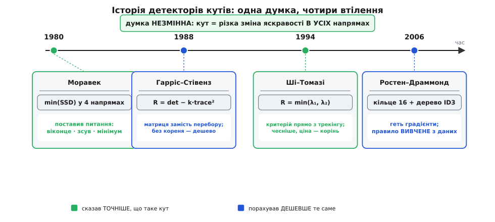

# 📜 Як майже тридцять років шукали, «що таке кут»

Тут майже нема формул, які не з'явилися б у самій темі. Ця розповідь про інше: як одна проста думка — «кут там, де картинка міняється, куди віконце не посунь» — визрівала майже тридцять років, переходячи з рук у руки. Цікаво не те, що врешті вийшло, а **чому** кожен наступний або сказав точніше, ніж попередник, **що таке кут**, або порахував те саме дешевше. Це історія людей із конкретними задачами: комусь треба було, щоб робот-візок сам об'їхав стільці; комусь — щоб військова система бачення встигала за відео; комусь — щоб трекер не губив точку між кадрами. Формула народжувалася не з любові до формул, а бо інакше залізо не встигало або точка тікала.

## Робот, який мусив сам об'їхати стільці

Почалося не з кутів, а з візка. На початку 1970-х у Стенфордській лабораторії штучного інтелекту стояв **Stanford Cart** — радіокерований возик із телекамерою, спершу задуманий ще як іграшка-модель місяцехода. У 1973 році ним заопікувався аспірант **Ганс Моравек** (Hans Moravec) — австрієць за народженням (нар. 30 листопада 1948 у селі Кауцен, Австрія), який дитиною переїхав із родиною до Канади, а докторат робив у Стенфорді. Задача була проста на словах і пекельна на ділі: візок мав **сам**, без людини за пультом, проїхати захаращену кімнату — об'їхати стільці й інші перешкоди, орієнтуючись лише за картинкою з єдиної камери.

> 🔧 **Навіщо це.** Тут народилася сама постановка, з якої живе весь трекінг: щоб зрозуміти, **куди я зсунувся**, треба на двох кадрах (чи двох знімках з різних позицій камери) знайти **ті самі** точки й побачити, як вони поїхали. А щоб точку знайти вдруге, вона мусить бути **впізнаваною**. Моравек уперше сформулював, що впізнаваних точок мало, і що їх треба вміти **відбирати** — не будь-який піксель годиться в мітки.

Возик працював ривками, майже комічно повільно: камера знімала кадр, комп'ютер (за мірками часу — слабенький) довго думав, возик проповзав метр, зупинявся й думав знову. Одну кімнату він долав годинами. Але Моравек побудував справжній конвеєр стерео-бачення: камеру на візку зсували вздовж рейки, робили кілька знімків із різних точок, і за зсувом однієї й тієї самої деталі на знімках рахували, **як далеко** та деталь. Уся ця арифметика розсипалася, якби «та сама деталь» на різних знімках не знаходилася надійно. Тож серцем системи став **оператор інтересу** (англ. *interest operator*) — те, що відбирало на кадрі жменьку точок, за якими взагалі варто стежити.

Ідею Моравек описав ще 1977 року в доповіді «Towards Automatic Visual Obstacle Avoidance» на конференції IJCAI, а повністю розгорнув у докторській дисертації «Obstacle Avoidance and Navigation in the Real World by a Seeing Robot Rover» (Стенфорд, 1980). Ось у чому вона полягала. Візьми навколо пікселя маленьке віконце. Посунь його на один крок у **чотирьох** напрямах — по горизонталі, по вертикалі й по двох діагоналях, тобто на вектори (1, 0), (0, 1), (1, 1) і (−1, 1) — і для кожного зсуву порахуй, **наскільки** змінився вміст віконця (суму квадратів різниць яскравості). Дістанеш чотири числа. А тепер — ключовий хід — візьми з них **найменше**:

```
сила(піксель) = min( E₁₀, E₀₁, E₁₁, E₋₁₁ )
```

Чому саме мінімум? Бо кут — це місце, де віконце міняється **в усіх** напрямах. Якщо хоч в одному напрямі зміна мала — це не кут: або гладке поле (мало скрізь), або край (уздовж себе край ковзає, і там зміна теж мала). Беручи найменше з чотирьох, Моравек питав: «а який твій **найлінивіший** напрям — і чи навіть він дає велику зміну?» Якщо навіть найлінивіший великий — це кут. Ту саму думку — «надійність визначає слабша вісь» — за сімнадцять років повторять Ші й Томазі, тільки вже точно, без грубого перебору чотирьох стрілок.

Це була справжня, робоча ідея з двома вадами, які й рухали всю подальшу історію. По-перше, **лише чотири напрями**: реальний кут може дивитися між стрілками, і його або пропустиш, або оціниш криво — оператор несиметричний, повернеш камеру на 30° і відгук попливе. По-друге, він реагував і на **поодинокий шум**: яскрава пилинка на матриці теж «міняється в усіх боки». Сам Моравек чесно писав, що ганяється не за кутами як такими, а просто за **вирізненими латками**, які можна впізнати вдруге, — слово «кут» до цього прикладе вже наступне покоління. Але головне він зробив: перетворив туманне «знайди цікаві точки» на **число, яке рахують у кожному пікселі**, а тоді лишають локальні піки. Далі вся історія — це боротьба з тими двома вадами: **зробити симетрично до повороту** і **порахувати чесніше, але не дорожче**.

## Британська лабораторія, військове бачення й матриця замість чотирьох стрілок

Наступний крок стався за океаном, у Британії, і з цілком приземленої потреби. Наприкінці 1980-х уряд Сполученого Королівства фінансував велику дослідницьку програму **Alvey** (1984–1990) — національну відповідь на японський проєкт «Комп'ютери п'ятого покоління»; ім'я програма дістала за прізвищем Джона Алві, що очолив комітет, який її й обґрунтував. Одним із напрямів було машинне бачення, і щороку відбувалася **Alvey Vision Conference**. На **четверту** таку конференцію — Манчестер, 31 серпня — 2 вересня 1988 року — двоє інженерів із лабораторії **Plessey Research at Roke Manor** (Plessey — британська електронна компанія, її дослідний осередок стояв у маєтку Roke Manor на півдні Англії й багато працював на оборонні системи) подали статтю на п'ять сторінок (сторінки 147–151 у матеріалах), якій судилося стати однією з найцитованіших у всьому комп'ютерному баченні. Звали їх **Кріс Гарріс** (Chris Harris) і **Майк Стівенз** (Mike Stephens), а стаття називалася «A Combined Corner and Edge Detector».

Їм потрібні були стабільні точки на відео, щоб відтворювати тривимірну структуру сцени з руху камери, — знову та сама задача Моравека, тільки на живому потоці й із вимогою працювати надійно. Грубий перебір чотирьох напрямів їх не влаштовував, і вони зробили красивий математичний хід. Якщо зсув віконця **малий**, то різницю яскравості не треба міряти зсувом насправді — її дає **градієнт**, тобто локальні похідні Iₓ і I_y, ті самі, що ловлять межі. А коли підставити градієнт у Моравекову суму квадратів різниць і згорнути алгебру, увесь відгук у **будь-якому** напрямі стискається в одну маленьку матрицю 2×2, складену з добутків градієнтів:

```
        ⎡ Σ Iₓ²    Σ IₓI_y ⎤
    M = ⎢                  ⎥
        ⎣ Σ IₓI_y  Σ I_y²  ⎦
```

Ось у чому перемога над Моравеком: не треба **перебирати** напрями поштучно — матриця M описує зміну одразу **в усіх** напрямах, симетрично, без дискретних стрілок. Її два власні числа кажуть різкість по двох головних осях; обидва великі — кут. Це вже точне формулювання того самого «міняється, куди не посунь». Але Гарріс і Стівенз не спинилися на власних числах, і саме тут — друга частина їхньої винахідливості, продиктована залізом: обчислити власні числа означає взяти **квадратний корінь** у кожному пікселі, а корінь на процесорах 1988 року був розкішшю, коли пікселів мільйони. Тож вони знайшли обхід — відгук, що каже «обидва власні числа великі», але рахується **без кореня**, лише з визначника й сліду матриці:

```
R = det(M) − k · trace(M)²
```

Стала k (у їхній статті — близько 0.04–0.06) карає випадок, коли одне власне число величезне, а друге мале, тобто край. R велике й додатне — кут; від'ємне — край; біля нуля — рівне. Жодного кореня, самі множення й додавання градієнтів, які й так рахуються для пошуку меж. Апаратно дешево — і саме тому метод розлетівся по всьому світу під іменем **детектор Гарріса**.

Тут варто чесно поставити коми в атрибуції, бо назва трохи несправедлива. По-перше, статтю підписали **двоє**: Гарріс **і** Стівенз, тож строго кажучи це детектор Гарріса–Стівенза. По-друге, дуже подібну ідею — використати матрицю других моментів градієнта для аналізу локальної структури — приблизно тоді ж (1987) висловлював **Вольфганг Ферстнер** (Wolfgang Förstner) у німецькій фотограмметрії; його оператор рахував трохи інакше, але з тієї самої матриці. Ідея, як завжди в науці, **визрівала в кількох головах одночасно**, а ім'я закріпилося за тією статтею, що виявилася найзручнішою й найцитованішою. Це не крадіжка й не міф про єдиного генія — це звичайний спосіб, у який народжуються інструменти: хтось формулює найчистіше, і воно прилипає. (Сам Кріс Гарріс згодом згадував, що метод вони робили радше мимохідь, під конкретну систему трекінгу, й гадки не мали, що на нього посилатимуться десятки тисяч разів.)

> 🔧 **Навіщо це.** Два уроки цього кроку живуть донині. Перший: **правильна математична форма економить перебір** — замість ганяти віконце по напрямах, знайди величину (матрицю M), що вже містить усі напрями. Другий, суто інженерний: **уникай дорогої операції, якщо мету можна виразити дешевою** — обидва власні числа великі рівно тоді, коли добуток великий, а одне не переважає інше; це видно з `det` і `trace` без кореня. Обидва уроки — не про кути, а про те, як узагалі перекладати «чого я хочу» на «що дешево порахувати».

## Повернення до чесного мінімуму — заради трекінгу

Через шість років маятник хитнувся назад, до самих власних чисел, — але вже з іншим питанням. У 1994 році на конференції CVPR з'явилася стаття «Good Features to Track» (сторінки 593–600; раніше, 1993-го, вона ходила як корнельський технічний звіт TR 93-1399). Автори — **Джанбо Ші** (Jianbo Shi) і **Карло Томазі** (Carlo Tomasi). Ші народився в Шанхаї, того-таки 1994-го здобув бакалавра в Корнелльському університеті (згодом докторат у Берклі, професура в Пенсильванії). Томазі — італієць, надалі багаторічний професор Дюкського університету. Обидва прийшли до кутів не з боку «як їх намалювати», а з боку **трекінгу**: як вибрати на кадрі точки, за якими трекер потім **не загубиться**.

Це принципово інший кут зору. Гарріс питав: «де тут кути взагалі?» Ші й Томазі питали вужче: «які точки **добре простежаться** моїм конкретним алгоритмом стеження?» А стежили вони методом у дусі **Лукаса–Канаде** (оптичний потік вирівнюванням віконця; Брюс Лукас і Такео Канаде, 1981), який Томазі перед тим розвивав разом із Канаде — так зване стеження точкових ознак (звідси й відома абревіатура KLT — Kanade–Lucas–Tomasi). А цей трекер, коли розписати його рівняння, спирається на **ту саму** матрицю M других моментів. І тоді відповідь на «чи добре простежиться точка» випадає з математики трекера сама собою: точка простежиться надійно рівно тоді, коли **менше** з двох власних чисел матриці досить велике. Звідси їхній критерій — найпряміший, який можна уявити:

```
R = min(λ₁, λ₂)
```

Логіка та сама, що й Моравекова тридцятьма роками раніше («дивись на найслабший напрям»), але тепер вона не грубий перебір чотирьох стрілок, а **точний наслідок** того, як працює трекер: слабша вісь мусить бути міцна, інакше вздовж неї точка попливе. Родзинка в тому, що критерій Ші–Томазі **не найкрасивіший і не найдешевший** — він знову вимагає кореня, тобто дорожчий за Гаррісів обхід. Але він **чесніший до задачі**: він оптимізує саме те, що потім робитимуть із точкою. Тому там, де точки треба **вести** від кадру до кадру — одометрія, стабілізація, оптичний потік, — беруть його; недарма стандартна функція `goodFeaturesToTrack` у бібліотеках комп'ютерного бачення реалізує саме min(λ). Гарріс дешевший — для «просто познач цікаві точки»; Ші–Томазі точніший під стеження — заплатив корінь, зате точки живучіші.

> 🔧 **Навіщо це.** Мораль кроку суперечить інженерному інстинкту «завжди рахуй якнайдешевше». Іноді дешевший **сурогат** (Гаррісів `det − k·trace²`) веде трохи не туди, бо оптимізує не зовсім те, що тобі треба. Ші й Томазі показали протилежну чесноту: **виведи критерій прямо з того, як його вживатимеш** — тоді навіть дорожча величина виграє, бо жоден вибір точок не пропаде намарно на етапі трекінгу. Це урок про те, що «оптимальне» без питання «оптимальне **для чого**» — беззмістовне.

## FAST: викинути градієнти геть

Три перші кроки — Моравек, Гарріс–Стівенз, Ші–Томазі — сперечалися, як **точніше** сказати «що таке кут», але всі трималися однієї основи: **градієнтів** та їхньої матриці. У 2006 році двоє з Кембриджа перевернули стіл і спитали: а що, коли градієнти взагалі **не рахувати**? На конференції ECCV у австрійському Граці **Едвард Ростен** (Edward Rosten) і **Том Драммонд** (Tom Drummond) подали статтю «Machine Learning for High-Speed Corner Detection» (LNCS, том 3951, сторінки 430–443). Народилася вона з болючої практичної потреби: Драммонд і Ростен займалися трекінгом **у реальному часі** на звичайному тодішньому процесорі, і Гарріс зі своїми похідними, множеннями та згладжуванням просто **не встигав** за відеопотоком. Наростити кадрову частоту можна було, лише радикально здешевивши перший крок — пошук кутів.

Їхня ідея — **FAST** (англ. *Features from Accelerated Segment Test*) — майже зухвало проста й до градієнтів не має жодного стосунку. Навколо пікселя-кандидата беремо кільце з **16** пікселів (коло Брезенгема радіусом 3) і питаємо лише про яскравості: чи є на кільці **суцільна дуга** з N пікселів підряд, які всі **яскравіші** за центр на поріг t або всі **темніші** на t? Якщо так — кандидат оголошується кутом. Жодних похідних, жодних множень — самі порівняння цілих чисел. А головна швидкість — у відсіві: щоб дуга з дев'яти взагалі могла існувати, серед чотирьох «хрестових» пікселів (1, 5, 9, 13, під 90° один до одного) **мусить** бути щонайменше три однобічних; якщо ні — кандидат летить у кошик за 3–4 порівняння, і повне кільце навіть не читається.

Але найцікавіша — і найповчальніша — частина статті ховається у другому слові назви: **Machine Learning**. Бо тут ідилія «просто дивись на кільце» ламається об реальність, і саме ця тріщина зробила метод по-справжньому добрим. Ростен виявив дві незручні речі. По-перше, рукотворний тест «1, 5, 9, 13» **не узагальнюється** на N менше за 12 і взагалі не факт, що ці чотири пікселі — найкращий вибір: чому саме хрест, а не якийсь інший розклад? По-друге, порядок, у якому питати про пікселі кільця, теж не мусить бути «за годинниковою стрілкою» — розумний порядок відкидає не-кути ще швидше. Замість вгадувати все це руками Ростен зробив те, що на кути ще ніхто не робив: **навчив** оптимальний тест на даних.

Механіка навчання елегантна. Проганяємо детектор по купі справжніх зображень і для кожного з 16 пікселів кільця відносно кандидата приписуємо один із **трьох** станів: `d` — темніший за центр (яскравість ≤ p − t), `b` — яскравіший (≥ p + t), `s` — «схожий» (усе між ними). Тепер маємо задачу класифікації: за станами 16 пікселів сказати «кут / не кут». І її розв'язують класичним алгоритмом **ID3** — будують **дерево рішень**, на кожному кроці обираючи той піксель, запит про який дає найбільше **інформації** (найдужче ділить приклади на кути й не-кути). Дерево, навчене на реальних кутах даної сцени, і є детектор: його просто **розгортають у гніздо `if`-ів на C**, яке компілятор зшиває в майже голу перевірку яскравостей без жодного циклу. Так «магічні» пікселі 1/5/9/13 перестали бути здогадом і стали **наслідком даних** — а заразом народилася ціла родина **FAST-9, FAST-10, …, FAST-12** (за довжиною потрібної дуги), де найкращим за досвідом виявився саме **FAST-9**.

Лишалася ще одна дірка, теж характерна. FAST не дає **сили** кута — лише «так/ні», — а без сили не зробиш **придушення немаксимумів**: справжній кут дає цілу плямку сусідніх «так», і треба лишити один. Ростен викрутився без градієнтів і тут: за силу взяли **найбільший поріг t**, за якого піксель ще лишається кутом (його швидко знаходять двійковим пошуком). Ця величина й грає роль відгуку при відсіві сусідів. За два роки, у журнальній статті «Faster and Better: A Machine Learning Approach to Corner Detection» (IEEE TPAMI, 2010, том 32, № 1, с. 105–119; співавтор Рід Портер), метод відшліфували остаточно — і показали, що він проганяє живе PAL-відео, з'їдаючи менш ніж 5% процесорного часу, тимчасом як Гарріс на тому самому потоці за кадрами не встигав.

Ціна швидкості чесна: FAST каже лише **де** кут, без напряму й із сирою силою; він не інваріантний до масштабу й помітно чутливіший до шуму (кілька пікселів на кільці збрехали — і дуга «зламалася»). Тому у великих системах FAST зазвичай ставлять як **швидкий шукач кандидатів**, а вже їх проціджують і **описують** важчими кроками. Саме так влаштований популярний конвеєр [зіставлення ключових точок](book:algorithms/feature-matching): FAST знаходить точки блискавично, а окремий крок будує їхній опис, щоб упізнати ту саму точку на іншому кадрі.

> 🔧 **Навіщо це.** Тут — найсвіжіший урок лінії, і він не про кути, а про метод. Три покоління до Ростена **вигадували** правило, «що таке кут», головою. Ростен першим сказав: не вгадуй правило — **вивчи** його з прикладів, а тоді **скомпілюй** вивчене у швидкий код. Це вже інша інженерна культура: не «розумний алгоритм від людини», а «дешевий алгоритм, форму якого підказали дані». Той самий поворот за наступні роки поглине півкомп'ютерного бачення — а FAST був одним із перших місць, де він зайшов у, здавалося б, суто геометричну задачу.

## Одна думка, чотири втілення

Відступімо на крок і подивімося на всю лінію разом. Тридцять років, чотири команди, чотири країни — а думка **одна** й від першого дня незмінна: **кут — це місце, де картинка різко міняється відразу в усіх напрямах**. Мінявся не задум, а дві речі довкола нього — **як точно** його висловлюють і **як дешево** рахують.


*Уся лінія на одній осі. Угорі — думка, що не мінялася жодного разу. Знизу кожна віха: хто, чим міряв кут і що саме додав — **зелене** «сформулював точніше, що таке кут», **синє** «порахував те саме дешевше». Читається як чергування: точніше → дешевше → точніше → дешевше.*

Прочитай віхи зліва направо як одну фразу. Моравек **поставив питання** й дав перше, чесне, але грубе число. Гарріс зі Стівензом знайшли **правильну форму** (матрицю), що прибрала перебір напрямів, і **правильний обхід** (без кореня), що зробив лік дешевим для заліза 1988 року. Ші й Томазі повернулися до найчеснішого критерію min(λ), бо для **трекінгу** саме він оптимальний, і свідомо заплатили за це корінь. А Ростен із Драммондом викинули з-під ніг усю градієнтну основу й показали, що правило можна не вигадувати, а **навчити** — і скомпілювати у майже голі порівняння.

Жоден із них не «переміг» попереднього. Вони й досі живуть поруч, бо відповідають на **різні** питання: «де взагалі кути?» (Гарріс, дешево), «за якими точками стежити?» (Ші–Томазі, точно під трекінг), «як знайти кути на слабкому залізі, і то вже?» (FAST). Це й є найтихіший урок усієї історії: у добрій інженерії стара ідея не викидається новою — вона **обростає** втіленнями під різні обмеження, і кожне з них правдиве у своєму куточку простору «точність ↔ швидкість». А проста думка з возика, що годинами повз стільцями Стенфорда, так і лишилася в самому осерді.

---

**Статус доказовості.** Дати, імена, назви конференцій та інституцій тут звірені за первинними й вторинними джерелами: дисертація Моравека (Стенфорд, 1980) та його доповідь IJCAI 1977; матеріали 4-ї Alvey Vision Conference (Манчестер, 31 серпня — 2 вересня 1988, с. 147–151, Plessey Research Roke Manor); «Good Features to Track» (CVPR 1994, с. 593–600; корнельський звіт 1993); «Machine Learning for High-Speed Corner Detection» (ECCV 2006, LNCS 3951, с. 430–443) і журнальна «Faster and Better» (IEEE TPAMI 32(1), 2010, с. 105–119). Паралель Ферстнера (1987) подано як **одночасне визрівання ідеї**, а не заперечення авторства Гарріса й Стівенза — це усталений у літературі факт, а не спірна першість. Спогади самого Гарріса про «мимохідь зроблений» метод — свідчення учасника, наведене як штрих, не як доказ дат.
