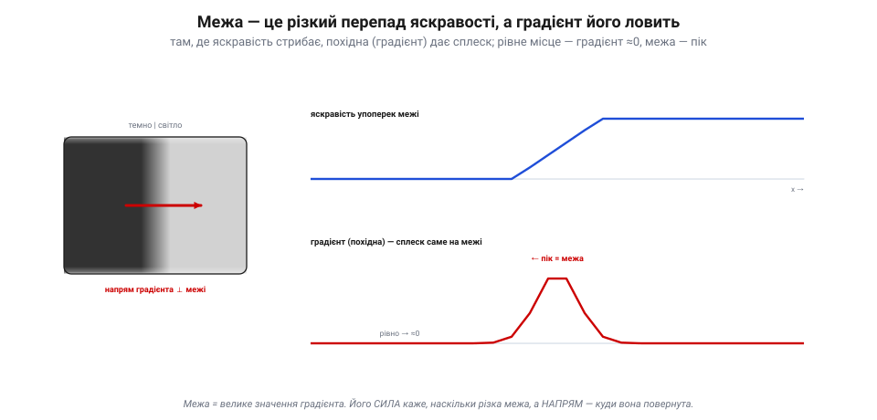
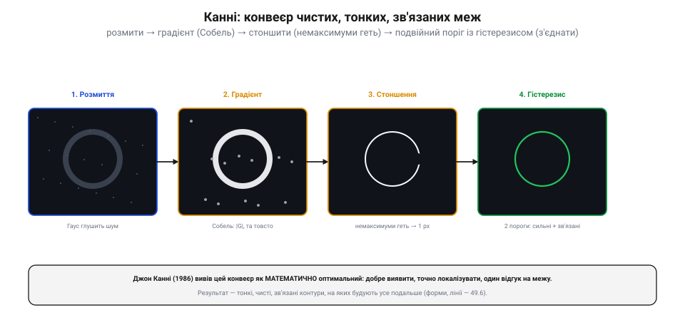
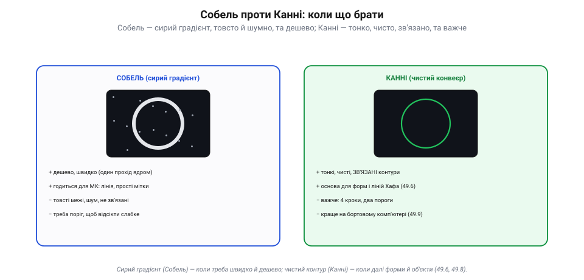

# Виділення меж: градієнт, Собель, Канні

Виділення меж — **серце** машинного бачення. Якщо в кадрі й є інформація, то вона — на **межах**: там, де закінчується один об'єкт і починається інший, де контур, силует, лінія. Рівні гладкі ділянки (небо, стіна) майже нічого не кажуть; усе важливе живе на **перепадах**. Тому виділення меж — фільтр, заради якого здебільшого й затівають фільтрацію кадру, і фундамент майже всього, що будують далі: [форми й лінії](book:algorithms/object-detection), об'єкти, [трекінг](book:algorithms/tracking).

### Межа — це великий градієнт

Що таке межа з погляду чисел? Це місце, де яскравість **різко змінюється**. А «швидкість зміни» має точну назву — **градієнт** (по суті, [**похідна**](book:math/derivative) яскравості). Там, де кадр гладкий, градієнт ≈ 0; там, де перепад, — градієнт дає **сплеск**. Знайти межі = знайти великі градієнти.

*Рис. Межа й градієнт. Яскравість упоперек межі — це **сходинка** (синій профіль). Її **похідна** (градієнт, червоний) — майже нуль на рівних ділянках і дає **сплеск** саме там, де перепад. Тож межа = велике значення градієнта. У градієнта є **сила** (наскільки різкий перепад) і **напрям** (куди він повернутий — перпендикулярно до межі).*

Важливо, що градієнт — **двовимірний**: яскравість може мінятися і по горизонталі, і по вертикалі. Тому в кожному пікселі рахують **дві** похідні: **Gx** (зміна вліво-вправо) і **Gy** (зміна вгору-вниз). З них дістають **силу** межі — `|G| = √(Gx² + Gy²)` (наскільки різко) — і **напрям** — `atan2(Gy, Gx)` (куди повернута). Сила каже, *чи* тут межа; напрям — *як* вона лежить (саме напрям дає змогу далі зібрати з меж [прямі лінії й форми](book:algorithms/object-detection)).

### Собель: згортка, що оцінює градієнт

Як порахувати ці похідні? [Згорткою](book:algorithms/convolution-filters) зі спеціальним **ядром-похідною**. Найвідоміше — **Собель**: пара ядер 3×3, одне для Gx, друге для Gy.

*Рис. Собель. Ядро **Gx** (−1 0 1 / −2 0 2 / −1 0 1) — це різниця «право − ліво», тож воно спалахує на **вертикальних** межах. Ядро **Gy** (−1 −2 −1 / 0 0 0 / 1 2 1) — різниця «низ − верх», ловить **горизонтальні**. Прогнавши квадрат через обидва, дістаємо бокові межі (Gx) і верх/низ (Gy); їх з'єднують у силу межі `|G| = √(Gx²+Gy²)` — повний контур. Собель — це просто **два ядра-похідні** як згортки.*

Ядро **Gx** (`−1 0 1 / −2 0 2 / −1 0 1`) рахує різницю «що праворуч мінус що ліворуч» — тому реагує на **вертикальні** межі. Ядро **Gy** (`−1 −2 −1 / 0 0 0 / 1 2 1`) — різницю «низ мінус верх» — ловить **горизонтальні**. (Середній рядок/стовпець із вагою 2 заразом трохи **згладжує** впоперек, тож Собель стійкіший до шуму, ніж гола похідна.) Прогнали кадр через обидва ядра, у кожному пікселі взяли `√(Gx²+Gy²)` — і маємо **мапу сили меж**: світлі лінії там, де контури. Дешево, один прохід — і вже видно скелет сцени.

### Канні: конвеєр чистих, тонких, зв'язаних меж

Собелева мапа корисна, та **груба**: межі товсті, рвані, поцятковані шумом. Коли треба **чисті** контури, беруть **Канні** — не одне ядро, а цілий **конвеєр** (Джон Канні, 1986).

*Рис. Конвеєр Канні. Чотири кроки: **1)** розмити (Гаус) — приглушити шум, щоб не плодити фальшивих меж; **2)** градієнт (Собель) — сила й напрям, та поки товсто; **3)** стоншення (придушення немаксимумів) — лишити тільки гребінь перепаду, тонкий у 1 піксель; **4)** гістерезис (два пороги) — сильні межі лишити, слабкі — лише якщо вони **тривають** від сильних. Результат — тонкі, чисті, зв'язані контури.*

Кроки такі. **Перший** — розмити [Гаусом](book:algorithms/convolution-filters), щоб шум не наплодив фальшивих меж. **Другий** — Собелем порахувати силу й напрям градієнта. **Третій** — **придушення немаксимумів**: лишити тільки самий **гребінь** перепаду (де градієнт максимальний упоперек межі), стоншивши товсту смугу до лінії в **1 піксель**. **Четвертий** — **гістерезис** із двома порогами: межі, сильніші за верхній поріг, лишаємо завжди; слабші за нижній — викидаємо; а проміжні зберігаємо **лише якщо** вони дотикаються до сильної (тобто є **продовженням** справжнього контуру). Так шум відсівається, а контури виходять **зв'язані**. Канні недарма звуть золотим стандартом: Джон Канні вивів його як **математично оптимальний** — добре виявляти, точно ставити на місце, давати один відгук на одну межу.

### Собель проти Канні: коли що брати

Обидва дають межі — але різної якості й ціни.

*Рис. Собель проти Канні. **Собель** — сирий градієнт: товсто, з шумом, не зв'язано, зате **дешево й швидко** (один прохід) — годиться для мікроконтролера, стеження за лінією, простих міток. **Канні** — тонкі, чисті, **зв'язані** контури, основа для пошуку форм і ліній, та важчий (4 кроки, два пороги) — краще для бортового комп'ютера. Сирий градієнт — коли швидко й дешево; чистий контур — коли далі будувати форми й об'єкти.*

**Собель** дешевий і швидкий (одна згортка), тож його легко тягне навіть мікроконтролер — добре для стеження за **лінією**, простих маркерів, грубого «де тут контраст». Та межі в нього товсті, шумні й не зв'язані. **Канні** дає тонкі, чисті, зв'язані контури — саме те, на чому будують [**пошук форм** і **ліній**](book:algorithms/object-detection) та [**трекінг**](book:algorithms/tracking), — але коштує чотирьох кроків і двох порогів, тож радше для бортового комп'ютера. Правило просте: треба **швидко й грубо** — Собель; треба **чисто, щоб будувати далі** — Канні.

> 📜 **Оператор, якого не друкували: Собель і Фельдман у Стенфорді (1968).** Ядро Собеля сьогодні є в кожній бібліотеці комп'ютерного зору, у кожному телефоні, у твоєму дроні — а от **наукової статті** про нього... ніколи не було. 1968 року в Стенфордській лабораторії штучного інтелекту (SAIL) аспірант **Ірвін Собель** разом із колегою **Гері Фельдманом** вигадали зручний спосіб рахувати градієнт зображення ядром 3×3. Вони лиш **розповіли** про нього в доповіді «A 3×3 Isotropic Gradient Operator for Image Processing» на семінарі — і не опублікували як належить. Оператор міг би й загубитися, та 1973-го його згадали **у виносці** до підручника Дуди й Гарта «Pattern Classification and Scene Analysis» — і саме звідти, з footnote, він розійшовся світом. Так одна з найуживаніших операцій в історії машинного зору здобула ім'я не через товсту статтю, а через усну доповідь і примітку дрібним шрифтом. Коли твій апарат шукає лінію горизонту чи край злітної смуги, він рахує рівно те, що двоє стенфордців накидали на семінарі понад півстоліття тому — й полінувалися надрукувати.

> 🔧 **Навіщо це.** Межі — **скелет** сцени, на якому тримається майже все подальше, тож навчися їх діставати. Треба **дешево й швидко** (стеження за лінією, груба орієнтація на МК) — бери **Собель**; треба **чисті контури** під форми чи [лінії Хафа](book:algorithms/object-detection) — бери **Канні**, але дай йому бортовий комп'ютер. **Завжди [розмивай](book:algorithms/convolution-filters) перед** пошуком меж: шум інакше наплодить фальшивих контурів. Підбирай **пороги** Канні під свою сцену (два числа — верхній і нижній) і пам'ятай про **напрям** градієнта: він знадобиться, щоб з меж зібрати прямі лінії й форми.

### Підсумок теми

Межа — це місце різкої зміни яскравості, тобто великий **градієнт** (похідна), що має **силу** (`√(Gx²+Gy²)`) і **напрям** (`atan2`). Порахувати градієнт можна згорткою з ядрами-похідними — це й є **Собель** (Gx для вертикальних меж, Gy для горизонтальних): дешево, та грубо. Для чистих контурів беруть **Канні** — конвеєр «розмити → градієнт → стоншити → гістерезис», що дає тонкі, зв'язані межі (золотий стандарт від Джона Канні, 1986). Собель — швидко й приблизно (МК); Канні — чисто й під дальшу роботу (борткомп'ютер). А саме ядро Собеля світ дістав 1968-го з усної доповіді й виноски в підручнику. Маючи мапу меж (поряд із сірими мапами), кадр уже можна різати на [**чисті області** — порогами й морфологією](book:algorithms/threshold-morphology).
