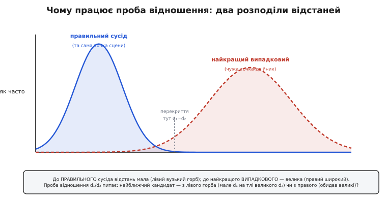

# 🧮 Математика відстаней між дескрипторами

Зіставлення точок урешті зводиться до одного питання, поставленого тисячі разів: **наскільки два описи околів схожі?** Дескриптор перетворив окіл кожної точки на короткий об'єкт — вектор чисел (SIFT) або рядок бітів (BRIEF, ORB), — і тепер уся робота зіставлювача в тому, щоб міряти між цими об'єктами **відстань**. Менша відстань — схожіші околи — імовірніше та сама фізична точка сцени. Звідси все й тримається: який саме прилад міряння взяти для чисел, який — для бітів, чому наївному «найближчому» вірити не можна й що робить проба відношення надійною. Розберімо ці відстані не як формули, які треба запам'ятати, а від першопричини — чому кожна саме така, і де вона починає брехати.

## Що таке відстань між описами

Спершу — що ми взагалі хочемо від «відстані». Це має бути одне число `d(a, b)`, тим менше, чим **схожіші** описи `a` й `b`. Щоб числу можна було довіряти в алгоритмі, воно мусить поводитися розумно — бути **метрикою**. Формально метрика — це функція, що задовольняє чотири умови:

```
d(a, b) ≥ 0                       відстань невід'ємна
d(a, b) = 0  ⇔  a = b            нуль лише для тотожних
d(a, b) = d(b, a)                симетрія: від A до B = від B до A
d(a, c) ≤ d(a, b) + d(b, c)      нерівність трикутника
```

Три перші умови очевидні — без них «відстань» була б безглуздям. А от **нерівність трикутника** — не формальна дрібниця, а те, на чому стоять усі прискорення зіставлення. Вона каже: гак через проміжну точку `b` ніколи не коротший за прямий шлях. Здавалося б, азбука геометрії — але саме вона дозволяє **не рахувати** більшість відстаней. Якщо ми вже знаємо, що `a` далеко від `b`, а `b` близько до `c`, то `a` не може бути близько до `c` — і цілу гілку кандидатів можна відкинути, жодного разу не звіривши. Без цієї властивості k-вимірні дерева й хеші, про які далі, не працювали б узагалі. Тому першою ж перевіркою будь-якого нового способу міряти схожість є питання: а це метрика? Обидві відстані цієї теми — евклідова й Гаммінгова — метрики, і саме тому на них можна будувати швидкий пошук.

> 🔧 **Навіщо це.** Коли на борту дрона треба зіставити тисячу точок поточного кадру з тисячею збережених, повний перебір — це мільйон обчислень відстані на кадр. Нерівність трикутника — це юридична підстава пропускати більшість із них: дерево пошуку відкидає цілі піддерева кандидатів, довівши через трикутник, що там нічого ближчого немає. Без метрики довелося б рахувати всі мільйон — і зіставлення не встигало б за камерою.

Тепер — конкретні прилади міряння. Їх два, бо описи бувають двох порід, і кожна порода вимагає свого.

## Евклідова відстань: міряти числові вектори

SIFT-дескриптор — це точка в просторі **128 вимірів**. Звучить страшно, та геометрія там та сама, що на аркуші паперу, лише вимірів більше. І відстань між двома такими точками — та сама, якою ми зроду міряємо відстань на площині: **евклідова** (на честь Евкліда, чия геометрія її й задає). Виведімо її з нуля, щоб побачити, звідки береться сума квадратів і чому саме квадратів.

### Від теореми Піфагора до 128 вимірів

На площині маємо дві точки, `a = (a₁, a₂)` і `b = (b₁, b₂)`. Відстань між ними? Малюємо прямокутний трикутник: один катет — різниця по горизонталі `(a₁ − b₁)`, другий — по вертикалі `(a₂ − b₂)`, а сама відстань — гіпотенуза. Теорема Піфагора дає:

```
d² = (a₁ − b₁)² + (a₂ − b₂)²
d  = √[ (a₁ − b₁)² + (a₂ − b₂)² ]
```

У трьох вимірах додається третій катет `(a₃ − b₃)`, і під коренем стає три доданки. Ключова думка: **нічого нового не з'являється з ростом вимірів**. Кожен вимір додає свій квадрат різниці під корінь — і в двох, і в трьох, і в ста двадцяти восьми. Загальна формула для векторів довжини `n`:

```
d(a, b) = √[ Σ (aᵢ − bᵢ)² ]        сума по всіх i від 1 до n
```

Це і є **L2-відстань** (позначення від «норми ℓ₂»). Для SIFT `n = 128`: береш різницю по кожній із 128 координат, підносиш до квадрата, усе складаєш, береш корінь. Одне число — і воно каже, наскільки далеко один 128-вимірний відбиток від іншого.

### Чому квадрат, а не просто модуль різниці

Природне заперечення: навіщо квадрати й корінь, коли можна просто скласти модулі різниць `Σ |aᵢ − bᵢ|`? Це теж чесна відстань (зветься **манхеттенською**, або L1 — як шлях містом по клітинках вулиць, без діагоналей). Різниця між ними — не примха, а вибір, **як карати розбіжність**.

Квадрат карає велике відхилення **непропорційно сильно**. Різниця в одну одиницю дає внесок 1; різниця в п'ять — уже 25, а не 5. Тому L2 каже: описи, що **сильно** розходяться хоч в одній координаті, — це рішуче різні описи, навіть якщо в усьому іншому вони близькі. Одна кричуща розбіжність важить більше, ніж багато дрібних. Для зіставлення це радше добре: якщо в одній комірці дескриптора градієнти дивляться геть у різні боки, це вагома підстава засумніватися, що це та сама точка, — і квадрат цю підставу підсилює. L1 ставилася б до всіх розбіжностей рівно, розмиваючи цей сигнал.

Є й глибша причина, суто геометрична. L2 — **єдина** з усіх таких відстаней, що не змінюється від повороту системи координат. Поверни осі 128-вимірного простору як завгодно — L2-відстань між двома точками лишиться та сама, бо вона вимірює справжню довжину відрізка, а не суму проєкцій на осі. Для дескриптора це чесно: сам вибір, яку комірку сітки вважати «першою координатою», а яку «другою», — умовність, і відстань не повинна від неї залежати. L1 від повороту осей змінюється, тож несе слід довільного вибору координат. Тому для геометричних об'єктів, якими є SIFT-вектори, природний прилад — саме L2.

### Чому L2 пасує гістограмам градієнтів

Тепер найцікавіше — чому саме **ця** відстань пасує саме **такому** дескриптору. Згадаймо, з чого зроблений SIFT-вектор. Окіл точки ділять на сітку 4×4 комірки; у кожній комірці рахують, **куди дивляться градієнти** яскравості, і складають з них маленьку гістограму на 8 напрямків. Шістнадцять комірок по вісім стовпчиків — ось звідки 128 чисел. Кожне число — це **скільки градієнтної «сили» в цій комірці припало на цей напрямок**.

Що означає різниця двох таких векторів по одній координаті? Це різниця в тому, скільки градієнта вилилося в конкретний напрямок у конкретній комірці. Якщо два околи справді ті самі, ці числа майже збігаються по всіх 128 позиціях — розбіжності дрібні, від шуму сенсора й крихітних неточностей вирівнювання. Сума квадратів дрібних розбіжностей — мала: L2 близька до нуля, збіг певний. А якщо околи різні — десь напрямок градієнта перекинувся, стовпчик гістограми поповз, різниця по цій координаті велика, її квадрат ще більший, L2 підскочила. **Евклідова відстань буквально сумує, наскільки дві картини розподілу градієнтів розходяться комірка за коміркою, напрямок за напрямком.** Це рівно те, що ми хочемо знати.

Є тонкість, і в ній ховається чому воно так добре працює. Числа гістограми **однорідні** — усі однієї природи (частки градієнтної сили), в одній шкалі, тож складати їхні квадрати між собою осмислено: ми не додаємо метри до кілограмів. Саме тому SIFT-вектор **нормують** до одиничної довжини перед зіставленням: масштаб градієнтів залежить від контрасту (яскравіше освітлення — сильніші градієнти — більші числа), а нормування прибирає цей множник, лишаючи саму **форму** розподілу. Після нормування L2-відстань між двома дескрипторами міряє чисту різницю форм, незалежну від того, наскільки контрастний був той чи той знімок. Ось де апарат сходиться з дескриптором намертво: L2 має сенс саме тому, що координати однорідні й нормовані, а вони однорідні й нормовані саме для того, щоб L2 мала сенс.

**Worked-приклад: L2 між двома крихітними дескрипторами.** Візьмімо іграшкові вектори з чотирьох чисел (справжній має 128, але механіка та сама):

```
a = (0.50, 0.20, 0.80, 0.30)
b = (0.55, 0.15, 0.60, 0.35)

різниці:      (−0.05, 0.05, 0.20, −0.05)
квадрати:     ( 0.0025, 0.0025, 0.0400, 0.0025)
сума:         0.0475
d = √0.0475 ≈ 0.2179
```

Зверни увагу: три координати розійшлися дрібно (по 0.05), і разом вони дали лише 0.0075 — майже нічого. А одна-єдина координата з розбіжністю 0.20 внесла 0.04 — **більше, ніж усі три інші разом**. Це квадрат у дії: він каже, що ці два околи схожі майже в усьому, крім однієї помітної розбіжності в третій комірці, і саме та розбіжність визначає відстань. Мале підсумкове `d ≈ 0.22` — околи все ж близькі; якби та одна координата розійшлася не на 0.20, а на 0.60, відстань підскочила б до `√0.365 ≈ 0.60`, і збіг став би сумнівним.

У коді L2 для порівняння часто беруть **без кореня** — у квадраті:

:::tabs
```cpp
// квадрат евклідової відстані двох дескрипторів довжини n.
// корінь не беремо: він монотонний, тож для ПОРІВНЯННЯ «хто ближчий» зайвий,
// а множення дешевше за sqrt — на борту це відчутно.
float l2_sq(const float *a, const float *b, int n) {
    float s = 0.0f;
    for (int i = 0; i < n; ++i) {
        float d = a[i] - b[i];
        s += d * d;               // квадрат різниці по кожній координаті
    }
    return s;                     // менше = ближче
}
```
```python
import numpy as np

# квадрат евклідової відстані двох дескрипторів.
# корінь не беремо: він монотонний, тож для ПОРІВНЯННЯ «хто ближчий» зайвий,
# а без sqrt дешевше — на борту це відчутно.
def l2_sq(a, b):
    d = a - b                     # різниця по кожній координаті
    return np.dot(d, d)           # сума квадратів; менше = ближче
```
:::

Чому можна викинути корінь? Бо `√` — **монотонна** функція: якщо `d²(a,b) < d²(a,c)`, то й `d(a,b) < d(a,c)`. А для зіставлення нам треба лише **порядок** — хто ближчий, — а не самі метри. Викинули корінь — зекономили одну `sqrt` на кожну пару, а пар мільйони. Корінь беруть, лише коли потрібне справжнє значення відстані (скажімо, для порога в абсолютних одиницях), — а для «хто найближчий» досить квадрата. (Обережно з однією пасткою: у пробі відношення порівнюють `d₁` з `d₂` через множник, тож там працюють або з обома в квадраті й порівнюють `d₁² < 0.64·d₂²`, або беруть корені — але **не мішають** квадрат з некоренем.)

## Відстань Гаммінга: міряти рядки бітів

SIFT потужний, та рахувати його 128 чисел і звіряти їх коренями з множеннями — дорого. Для бортового заліза, де кадри летять по тридцять на секунду, придумали радикально дешевшу породу дескрипторів — **двійкові**: окіл описують не числами, а **рядком бітів**. BRIEF бере кількасот заздалегідь визначених пар точок навколо ключової й для кожної пари ставить `1`, якщо перша точка яскравіша за другу, і `0`, якщо ні. Двісті п'ятдесят шість таких «яскравіше?» — і весь опис поміщається в 32 байти замість 512 у SIFT. ORB (англ. *Oriented FAST and Rotated BRIEF*) додає до BRIEF поворотну стійкість, лишаючись двійковим. Про історію переходу від числового SIFT до двійкових ORB — окремо в [історії від SIFT до ORB](topic:algorithms/feature-matching/hist-sift-to-orb.md).

Але L2 до бітів **не пасує**. Що таке «квадрат різниці» двох бітів? Біт — це не число на шкалі, це **так/ні**: чи перша точка яскравіша за другу. Різниця тут не має величини — біти або однакові, або ні. Тож потрібен зовсім інший прилад, скроєний саме під «так/ні».

### Скільки бітів різні — оце й уся відстань

Природна міра несхожості двох бітових рядків до образливого проста: **скільки позицій, у яких біти різні**. Два описи по 256 бітів; ідемо позиція за позицією й лічимо, де вони розходяться. Збіглися всі 256 — відстань 0, описи тотожні. Розійшлися всі — відстань 256, повна протилежність. Це й є **відстань Гаммінга** (англ. *Hamming distance*), названа на честь Річарда Гаммінга, який увів її в праці «Error Detecting and Error Correcting Codes» (Bell System Technical Journal, 1950) — не для картинок, а для захисту даних від помилок передачі: біт, що перекинувся на лінії, — це рівно одна одиниця Гаммінгової відстані між надісланим і прийнятим словом. Той самий лічильник розбіжних бітів, що колись ловив збої в релейних машинах Bell Labs, тепер міряє схожість описів околів.

Це справжня метрика — усі чотири умови виконуються, і нерівність трикутника теж (число перекинутих бітів на шляху A→B→C не менше, ніж напряму A→C). Тож на ній так само можна будувати швидкий пошук.

### popcount(a XOR b) — і чому це майже задарма

Тепер магія, заради якої двійкові дескриптори й існують. Як полічити розбіжні біти? Двома машинними операціями, кожна з яких — один такт процесора.

Перша — побітове **виключне «або»** (XOR, позначають ⊕). Його таблиця:

```
0 ⊕ 0 = 0        однакові → 0
1 ⊕ 1 = 0        однакові → 0
0 ⊕ 1 = 1        різні    → 1
1 ⊕ 0 = 1        різні    → 1
```

Бачиш суть? XOR дає `1` **рівно там, де біти різні**, і `0` там, де однакові. Тобто `a ⊕ b` — це бітова «карта розбіжностей»: одиниці стоять на кожній позиції, де два описи не збіглися. Уся інформація про відстань Гаммінга вже в цьому одному слові — лишилося порахувати в ньому одиниці.

Друга операція саме це й робить — **popcount** (population count, «лічба населення»): скільки одиниць у двійковому слові. Це не цикл — це **окрема інструкція процесора** (`POPCNT` на x86, `CNT`+звід на ARM), яка лічить усі біти слова за один-два такти. Компілятор дає її через `__builtin_popcount`. Разом:

```
відстань Гаммінга (a, b) = popcount(a ⊕ b)
```

Ось чому двійкові дескриптори такі швидкі. Там, де L2 для SIFT потребувала 128 віднімань, 128 множень і додавань та кореня, тут — на кожні 32 (або 64) біти **один XOR і один popcount**. Для 256-бітного ORB це вісім XOR і вісім popcount — жменя тактів проти сотень. Різниця в **два порядки** швидкості, і саме вона робить зіставлення в реальному часі на слабкому борту можливим.

> 🔧 **Навіщо це.** ORB із відстанню Гаммінга — це те, що дозволяє SLAM-у на дроні чи в окулярах доповненої реальності вести сотні точок з кадру в кадр на бюджетному процесорі без графічного прискорювача. Один XOR і один popcount на пару 32-бітних слів — це буквально копійки обчислень; помінявши їх на 128 множень SIFT, той самий процесор захлинувся б і кадри почали б випадати. Уся практична цінність двійкових описів тримається на тому, що їхня відстань рахується майже задарма.

**Worked-приклад: відстань Гаммінга двох 8-бітних шматків.** Візьмімо по одному слову з двох описів (справжнє слово 32-бітне, але механіка та сама):

```
a       = 1 0 1 1 0 0 1 0
b       = 1 0 0 1 0 1 1 0
a ⊕ b   = 0 0 1 0 0 1 0 0     ← 1 там, де біти різні
                ↑     ↑
popcount(0 0 1 0 0 1 0 0) = 2

внесок цього слова у відстань = 2 (біти розійшлися у двох позиціях)
```

Кожне наступне слово додає свою жменю розбіжних бітів; сума popcount по всіх словах — повна відстань Гаммінга двох описів. Для 256-бітного ORB мала відстань (скажімо, менш як 40 із 256) означає майже однакові околи; велика (за 100) — різні. У коді весь дескриптор кладуть як масив слів і біжать по ньому:

:::tabs
```cpp
#include <cstdint>
#include <bit>      // std::popcount (C++20)

// відстань Гаммінга двох 256-бітних ORB-дескрипторів (8 слів по 32 біти)
int hamming256(const uint32_t a[8], const uint32_t b[8]) {
    int dist = 0;
    for (int i = 0; i < 8; ++i)
        dist += std::popcount(a[i] ^ b[i]);   // XOR → лічба розбіжних бітів
    return dist;                              // 0 = однакові, 256 = усе навпаки
}
```
```python
# відстань Гаммінга двох 256-бітних ORB-дескрипторів (8 слів по 32 біти)
def hamming256(a, b):
    dist = 0
    for x, y in zip(a, b):
        dist += (x ^ y).bit_count()   # XOR → лічба розбіжних бітів
    return dist                       # 0 = однакові, 256 = усе навпаки
```
:::

Один цикл на вісім кроків, у кожному XOR і popcount — і повний опис околу звірено. Порівняй із коренем-із-суми-квадратів для SIFT: та сама задача «наскільки схожі», а ціна різниться в сотні разів. Готовий перебірний зіставлювач ORB на C — у [проєкті двійкового зіставлення](topic:algorithms/feature-matching/proj-orb-match-c.md).

### Чому Гаммінгова відстань природна саме для бітових описів

Варто на мить спинитися й побачити, чому це не просто «дешева заміна L2», а **правильний** прилад для цих описів. Кожен біт BRIEF/ORB — це відповідь на конкретне питання «чи точка p яскравіша за точку q в цьому околі». Дві точки сцени однакові ⇔ на більшість цих питань окіл відповідає **однаково**. Розбіжність в одному біті — це рівно одне питання, на яке два околи відповіли по-різному; таких розбіжностей рахувати треба **порівну** (кожне питання рівноцінне) і **без величини** (відповідь бінарна, «трохи яскравіша» не буває). Це слово в слово опис відстані Гаммінга: рівний внесок кожної позиції, жодних величин, лише лічба розбіжностей. L2 накинула б бітам неіснуючу шкалу; Гаммінгова відстань міряє рівно те, чим є двійковий опис — набір рівноправних так/ні. Форма приладу збігається з формою даних, тому й працює.

## Статистика проби відношення: чому найближчому не можна вірити

Тепер у нас є прилад міряти відстань — L2 для чисел, Гаммінгова для бітів. Наївний зіставлювач на цьому й зупинився б: для кожної точки ліворуч знайти праворуч точку з **найменшою** відстанню — і оголосити їх парою. І раз у раз це буде брехня. Щоб зрозуміти чому — і чому напрочуд простий засіб це лікує, — треба глянути на **статистику** відстаней: як розподілені відстані до правильного сусіда й до випадкового, і чому ці два розподіли — різні.

### Два різні розподіли відстаней

Уяви одну точку ліворуч і всі точки праворуч. Відстані від нашого дескриптора до кожного правого діляться на дві геть різні сукупності.

**До правильного сусіда** — тієї самої фізичної точки сцени, знятої з іншого ракурсу. Її окіл майже той самий, дескриптор майже той самий, тож відстань **мала**. Не нуль (шум сенсора, зміна ракурсу, неточність вирівнювання щось та зсунуть), але мала. Якби ми зміряли цю відстань на тисячі правильних пар, вони збилися б у **вузький горб біля малих значень**: правильні збіги стабільно близькі.

**До випадкового сусіда** — будь-якої **чужої** точки праворуч. Її окіл не має причини бути схожим на наш, тож відстань **велика**. Але випадкових точок багато — сотні, — і серед них знайдеться найближча просто випадково: у 128-вимірному просторі (чи 256-бітному кубі) навіть найближчий із сотні чужаків усе одно помітно далі за правильного сусіда, та все ж ближче за середнього чужака. Відстані до чужих точок збиваються у **широкий горб при великих значеннях**.

Оці два горби — уся суть. Ось вони:


*Відстань дескриптора до правильного сусіда розподілена низько й вузько (околи майже однакові), до найкращого випадкового сусіда — високо й широко (чужий окіл далекий). Проба відношення d₁/d₂ насправді питає, з якого горба взявся найближчий кандидат: якщо з лівого — d₁ мале на тлі великого d₂, збіг певний; якщо з правого — d₁ і d₂ обидва великі й близькі, і найближчий переміг випадково.*

Коли зіставлення надійне? Коли **правильний сусід є в кадрі** — тоді найближчий кандидат узятий з лівого горба (мале `d₁`), а другий-за-близькістю — з правого (велике `d₂`), і між ними прірва. Коли зіставлення бреше? Коли **правильного сусіда немає** (точка зайшла за край, змінилася до невпізнання) або коли **околів-двійників юрба** (цегляна стіна, ряд однакових вікон, паркан). Тоді **всі** кандидати — з правого горба, всі приблизно однаково далекі, і «найближчий» переможе на випадковий волосок. Абсолютна відстань `d₁` тут не рятує: вона може бути навіть невеликою (двійники ж схожі між собою), а збіг усе одно хибний.

### Ідея Лоу: дивитися не на відстань, а на відрив

Девід Лоу, автор SIFT, побачив вихід, який заднім числом здається очевидним, а до нього ним ніхто не користувався. Ключ не в **абсолютній** відстані до найближчого, а в тому, **наскільки він відірвався від другого**. Знайди два найближчі кандидати праворуч — з відстанями `d₁` (найближчий) і `d₂` (другий) — і поглянь на їхнє **відношення**:

```
приймаємо збіг  ⇔  d₁ / d₂  <  поріг        (Лоу: 0.8)
```

Чому відношення, а не різниця чи сама `d₁`? Бо відношення читає рівно те, що ми бачили на двох горбах. Розберімо два випадки.

**Правильний сусід у кадрі.** Найближчий — з лівого горба, `d₁` мале. Другий — уже з правого горба (усі інші точки чужі), `d₂` велике. Відношення `d₁/d₂` **мале** — скажімо, 0.4. Відрив величезний: найближчий явно з іншої, «правильної» сукупності. Приймаємо.

**Двійники або немає правильного.** Найближчий і другий — обидва з правого горба, обидва приблизно однаково далекі. `d₁ ≈ d₂`, відношення близьке до **одиниці** — 0.95. Відриву нема: найближчий нічим не кращий за другого, його першість — випадковість. Відкидаємо.

Ось у чому геніальність: відношення `d₁/d₂` **не залежить від абсолютного масштабу відстаней**. Контрастний знімок чи блідий, текстурований окіл чи гладенький — самі відстані плавають, а їхнє **відношення** лишається чесним індикатором «наскільки найближчий унікальний». Одне ділення відповідає на питання, на яке абсолютна відстань відповісти не могла: «цей найближчий — справді особливий, чи просто перший-ліпший серед юрби однаково далеких?»

### Звідки взявся 0.8 і що він насправді відсіює

Поріг `0.8` — не з голови. Лоу зміряв його **на реальних даних**. У праці «Distinctive Image Features from Scale-Invariant Keypoints» (IJCV, 2004) він побудував два розподіли — відношення `d₁/d₂` для правильних збігів і для хибних — на базі реальних зображень і показав, що вони майже не перекриваються: правильні збіги мають мале відношення, хибні — близьке до одиниці. Порізавши по `0.8`, він отримав те, що процитовано в кожному підручнику зору:

- поріг **0.8** відкидає близько **90%** хибних збігів;
- а правильних губить менш ніж **5%**.

*(Статус: усталений факт, первинне джерело — стаття Лоу 2004, розділ 7.1. Число 0.8 — його власний вимір на тестовій базі, не теоретична константа; для конкретної задачі оптимум трохи гуляє, але 0.7–0.8 — робочий діапазон досі.)*

Розберімо, чому баланс саме такий сприятливий. Хибні збіги майже всі живуть при `d₁/d₂` близько до одиниці (правий горб проти правого горба — відрив малий) — тож поріг 0.8 зрізає майже всю їхню масу, звідси 90%. А правильні збіги майже всі мають `d₁/d₂` добре нижче 0.8 (лівий горб проти правого — відрив великий) — тож під зріз потрапляє лише їхній тонкий хвіст, звідси менш ніж 5% втрат. Розплата мізерна проти виграшу: одне ділення на кожен збіг прибирає дев'ять десятих сміття, ще не дійшовши до геометрії. Саме тому проба відношення — не факультативна прикраса, а стандартний, майже обов'язковий крок будь-якого серйозного зіставлювача.

**Worked-приклад: проба відношення на трьох точках.** Один дескриптор ліворуч, для нього зміряно L2 до всіх правих; беремо два найменші:

```
Точка на прикметному куті (правильний сусід у кадрі):
  найближчий  d₁ = 0.22
  другий      d₂ = 0.61
  d₁/d₂ = 0.36  <  0.8   → ПРИЙНЯТИ (відрив великий, окіл унікальний)

Точка на цеглині серед сотні однакових цеглин:
  найближчий  d₁ = 0.19        ← навіть менше! абсолютна відстань не рятує
  другий      d₂ = 0.21
  d₁/d₂ = 0.90  >  0.8   → ВІДКИНУТИ (майже нічия, двійників юрба)
```

Придивись до другого випадку: там `d₁ = 0.19` — **менше**, ніж 0.22 у першому, чесному збігу. Наївний зіставлювач за абсолютною відстанню взяв би цю цеглину «найкращою» й помилився б. А проба відношення бачить, що другий кандидат майже так само близький (`0.21`), розуміє, що це юрба двійників, і пару відкидає. Одне число розрізнило впевнений збіг і випадковий там, де абсолютна відстань безсила. Візуально ту саму пробу на двох панелях показано в основній темі.

У коді проба відношення — це один рядок понад пошуком двох найближчих:

:::tabs
```cpp
// пошук найближчого й другого праворуч + проба відношення.
// повертає індекс прийнятого збігу або −1, якщо неоднозначно.
int match_ratio(const float *query, const float train[][128], int m, float ratio) {
    float best = 1e30f, second = 1e30f;
    int best_j = -1;
    for (int j = 0; j < m; ++j) {
        float d = l2_sq(query, train[j], 128);        // працюємо у квадраті
        if (d < best)      { second = best; best = d; best_j = j; }
        else if (d < second) { second = d; }
    }
    // порівнюємо у КВАДРАТІ: (d₁/d₂ < r) ⇔ (d₁² < r²·d₂²)
    if (second > 0.0f && best < ratio * ratio * second)
        return best_j;      // відрив достатній — прийняти
    return -1;              // майже нічия — відкинути
}
```
```python
# пошук найближчого й другого праворуч + проба відношення.
# повертає індекс прийнятого збігу або -1, якщо неоднозначно.
def match_ratio(query, train, ratio):
    best, second, best_j = 1e30, 1e30, -1
    for j, t in enumerate(train):
        d = l2_sq(query, t)                     # працюємо у квадраті
        if d < best:
            second, best, best_j = best, d, j
        elif d < second:
            second = d
    # порівнюємо у КВАДРАТІ: (d₁/d₂ < r) ⇔ (d₁² < r²·d₂²)
    if second > 0.0 and best < ratio * ratio * second:
        return best_j      # відрив достатній — прийняти
    return -1              # майже нічия — відкинути
```
:::

Одна тонкість, на якій легко спіткнутися. Ми працюємо у **квадраті** відстані (щоб не брати кореня), тож і поріг треба брати у квадраті: `d₁/d₂ < 0.8` рівносильне `d₁² < 0.64·d₂²`, тобто `ratio*ratio`. Змішати квадрат із некоренем тут — типова тиха помилка, що зсуває поріг і псує весь відсів. І та сама проба відношення дослівно так само працює для Гаммінгової відстані двійкових описів — там `d₁` і `d₂` уже цілі числа розбіжних бітів, кореня немає, тож порівнюють прямо `best < ratio * second`.

Часто додають ще й **перехресну перевірку** (cross-check): пара лишається, лише якщо точка A ліворуч обрала B праворуч **і** та сама B, звірена в зворотний бік, обрала саме A. Взаємний вибір відсіює однобокі випадкові збіги, які проба відношення могла пропустити. Два фільтри разом прибирають більшість сміття ще до геометричної перевірки.

## Наближені найближчі сусіди: коли перебір задорогий

Усе дотепер мовчки припускало **повний перебір**: для кожної точки ліворуч звірити відстань з **кожною** праворуч. Це `N × M` обчислень відстані — для кількох сотень точок дрібниця навіть слабкому процесору. Але задачі ростуть. Тисячі точок на кадр, база з десятків тисяч збережених дескрипторів (візуальна локалізація, пошук за зображенням) — і `N × M` стає мільйонами й мільярдами звірянь. Перебір задихається. Рятунок — **не шукати точно найближчого**, а знайти **майже** найближчого, звіривши лиш малу частку кандидатів. Це наближені найближчі сусіди (англ. *Approximate Nearest Neighbors*, ANN), і вони спираються рівно на ту метричність, з якої ми почали.

### k-вимірне дерево: різати простір навпіл

Перша ідея — впорядкувати точки так, щоб цілі гурти можна було відкидати не дивлячись. **k-вимірне дерево** (англ. *k-d tree*, дав Джон Бентлі в Communications of the ACM, 1975) робить це рекурсивним різанням простору. Береш усі точки, вибираєш один вимір (скажімо, першу координату), знаходиш медіану, і ділиш точки на «ліворуч від медіани» й «праворуч». Кожну половину знову ділиш — уже за іншим виміром, — і так, доки в листках не лишиться по жменьці точок. Виходить дерево, де кожен вузол — площина, що розтинає простір навпіл.

Пошук найближчого: спускаєшся деревом у той листок, куди впав би запит, і береш найближчу точку там — перше наближення. Тоді піднімаєшся, і **ось де працює нерівність трикутника**: на кожному вузлі-площині питаєш, чи може по той бік розтину знайтися щось ближче за вже знайдене. Відстань від запиту до площини вже відома; якщо вона **більша** за поточну найкращу — по той бік нічого ближчого немає (щоб туди дістатися, довелося б перетнути площину, а це вже далі), і **всю ту гілку відкидаєш**, не звіривши жодної точки в ній. Так одним порівнянням відсікаються цілі піддерева. У низьких вимірах це перетворює `O(N)` перебір на `O(log N)` — гігантський виграш.

Пастка — **прокляття розмірності**. У 128 вимірах SIFT «по той бік площини» опиняється так багато простору, що відсікати майже нічого не вдається: гілки доводиться обходити майже всі, і дерево вироджується назад у перебір. Тому чисте k-d дерево для повновимірного SIFT не рятує. Практичний вихід — **best-bin-first**: обходити гілки не всі, а лише кілька найперспективніших, і на цьому спинятися, свідомо ризикуючи іноді проґавити істинно найближчого. Саме цей наближений варіант Лоу й застосував до SIFT — точність падає на відсотки, а швидкість зростає на порядок.

### Хешування за схожістю: зіштовхувати близьке навмисно

Друга ідea геть інша й для високих вимірів природніша — **хешування, чутливе до схожості** (англ. *Locality-Sensitive Hashing*, LSH; дали Піотр Індик і Раджив Мотвані на симпозіумі STOC, 1998). Звичайний хеш навмисне **розкидає** схожі ключі якнайдалі, щоб рівно заповнити таблицю. LSH робить **протилежне**: будує хеш-функції так, щоб **близькі** точки з високою ймовірністю падали в **одну** комірку, а далекі — у різні. Тоді пошук найближчого стає майже безкоштовним: хешуєш запит, дивишся, хто ще впав у ту саму комірку, — і звіряєш лише цих небагатьох кандидатів, а не всю базу.

Для **двійкових** дескрипторів (ORB) LSH особливо доладний, бо він природно ліг на Гаммінгову відстань. Найпростіша чутлива до схожості функція — **взяти кілька випадкових бітових позицій** дескриптора й скласти з них короткий ключ. Два описи з малою відстанню Гаммінга розходяться лише в кількох бітах, тож майже напевно збігаються на випадково вибраних позиціях — і падають в одну комірку. Два далекі описи розходяться в багатьох бітах, тож на випадкових позиціях майже напевно розійдуться — і в різні. Побудувавши кілька таких таблиць із різними наборами позицій, ловлять справжніх сусідів із високою ймовірністю, звіривши лише жменьку кандидатів на запит замість усієї бази.

> 🔧 **Навіщо це.** Візуальна локалізація дрона — «де я, порівнявши поточний кадр із картою з десятків тисяч збережених точок» — повним перебором не вкладеться в бюджет кадру. LSH над ORB-дескрипторами ріже кандидатів на два-три порядки: замість звіряти запит із усіма 50 000 точок бази, хеш дає 50 правдоподібних, і лише їх звіряють Гаммінговою відстанню. Точність зіставлення падає ледь-ледь, а швидкість дозволяє тримати темп камери. Обидва прискорення — і дерево, і хеш — стоять на тому, що відстань є **метрикою**: без нерівності трикутника дерево не могло б відкидати гілки, а без осмисленої близькості хеш не мав би що зіштовхувати.

Обидва прийоми — одна угода: **проміняти дрібку точності на велику швидкість**. Іноді наближений пошук проґавить істинно найближчого й підсуне другого-за-близькістю. Та згадаймо, що по зіставленні все одно чекає геометрична перевірка (RANSAC), яка відсіє випадкові промахи, — тож дозволити ANN зрідка помилятися безпечно. Практичне зіставлення майже завжди наближене: точний перебір лишають хіба для малих задач, де він і так миттєвий.

## Що з усього цього тримає зіставлення

Зведімо нитку. Зіставлення точок урешті — це міряння відстаней між описами околів, і весь апарат виростає з **природи опису**.

**Числовий дескриптор** (SIFT) — точка в 128-вимірному просторі, координати якої — однорідні, нормовані частки градієнтної сили. Її природна відстань — **евклідова (L2)**, сума квадратів різниць по всіх координатах: квадрат карає велику розбіжність непропорційно (одна кричуща розбіжність важить більше за багато дрібних), а сама L2 не залежить від повороту осей, тож чесно міряє різницю форм двох розподілів градієнтів. Для порівняння «хто ближчий» корінь викидають — досить квадрата.

**Двійковий дескриптор** (BRIEF, ORB) — рядок бітів, кожен з яких бінарне «яскравіше?». Його природна відстань — **Гаммінгова**, число розбіжних бітів, і рахується вона майже задарма як `popcount(a ⊕ b)`: XOR будує карту розбіжностей, popcount лічить у ній одиниці. Форма приладу збігається з формою даних — рівний внесок кожної позиції, жодних вигаданих величин, — і саме тому двійкове зіставлення на два порядки швидше й придатне для реального часу на слабкому борту.

Наївному «найближчому» за будь-якою з цих відстаней вірити не можна: відстані до правильного й до випадкового сусіда живуть у **двох різних розподілах**, і коли правильного немає або двійників юрба, найближчий перемагає випадково. **Проба відношення** Лоу читає це одним діленням `d₁/d₂`: мале відношення — найближчий з «правильного» горба, відрив великий, збіг певний; близьке до одиниці — з юрби далеких, відриву нема, пару геть. Поріг 0.8, зміряний Лоу на реальних даних, відсіює 90% хиби ціною менш ніж 5% правильних — розплата мізерна.

А коли перебір задорогий, метричність відстані окуповується вдруге: **k-вимірні дерева** відкидають цілі гілки кандидатів через нерівність трикутника, **LSH** зіштовхує схожі описи в одну комірку хешу — обидва міняють дрібку точності на порядок швидкості, і обидва живуть рівно тому, що евклідова й Гаммінгова відстані — справжні метрики. Так математика відстаней прошиває всю тему: від того, які числа брати, до того, як звірити мільйон пар вчасно.
