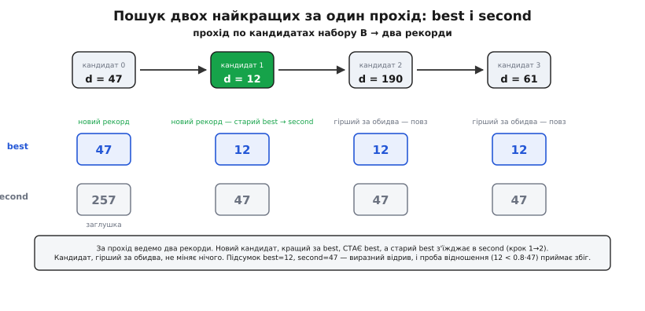

# ⚙️ Перебірний зіставлювач ORB-дескрипторів на C

**Задача.** З двох знімків детектор уже витягнув по кілька сотень ключових точок, а дескриптор ORB перетворив окіл кожної на **256-бітний двійковий відбиток**. На руках два набори: `A` з `n` дескрипторів (з лівого кадру) і `B` з `m` дескрипторів (з правого). Кожен дескриптор — це 256 бітів, тобто рівно 32 байти, або 8 машинних слів по 32 біти. Треба видати список **пар** «точка `i` ліворуч ↔ точка `j` праворуч», де пара означає «це те саме фізичне місце сцени». Без OpenCV, без FLANN — самим стандартним C, щоб код ліг і на бортовий комп'ютер дрона, і на досить ситий мікроконтролер. Усередині — три речі, які варто зробити чесно й правильно: швидка **відстань Гаммінга**, пошук **двох найближчих** кандидатів за один прохід і **проба відношення**, що відсіює неоднозначні збіги; наостанок — опційна **перехресна перевірка** взаємним вибором.

**Ідея.** Наївний зіставлювач звучить тривіально: для кожного дескриптора ліворуч перебрати всі праворуч, узяти найсхожіший. Але «найсхожіший сам по собі» систематично бреше на реальних сценах — цегляна стіна, ряд однакових вікон, листя дерева плодять юрбу майже однакових околів, і переможець серед них виграє на випадковий біт. Тому справжній зіставлювач шукає не одного, а **двох** найближчих і дивиться на **відрив** першого від другого: виразний відрив — окіл унікальний, збігові можна вірити; майже нічия — околів-двійників багато, пару геть. Уся хитрість реалізації в тім, щоб зробити це **швидко** (для двійкових дескрипторів відстань коштує один XOR і один `popcount` на слово) і **без тихих числових помилок** — а їх тут рівно дві, і обидві люблять проскочити повз тести. Розберемо структуру даних, тоді ядро — відстань, тоді пошук двох найкращих із пробою відношення, тоді перехресну перевірку, зберемо все докупи й пройдемося по пастках.

## Структура: набір двійкових дескрипторів

Двійковий дескриптор — це просто фіксований блок бітів. 256 бітів найзручніше тримати як масив із восьми `uint32_t`: тоді відстань Гаммінга рахується пословно, кожне слово — за одну машинну інструкцію. Можна було б узяти чотири `uint64_t` (те саме, ще трохи швидше на 64-бітному ядрі) — до цього повернемося; почнімо з `uint32_t`, бо він лягає всюди, зокрема на 32-бітний мікроконтролер.

:::tabs
```cpp
#include <stdint.h>
#include <stdbool.h>
#include <stddef.h>

#define ORB_WORDS 8                  // 256 бітів = 8 × 32

// один ORB-дескриптор: 256 бітів як 8 слів по 32 біти
typedef struct {
    uint32_t w[ORB_WORDS];
} orb_desc_t;

// набір дескрипторів одного кадру (просто масив + лічильник)
typedef struct {
    const orb_desc_t *d;             // масив дескрипторів
    int count;                       // скільки їх
} orb_set_t;

// результат зіставлення однієї точки
typedef struct {
    int query;                       // індекс у наборі A
    int train;                       // індекс у наборі B (-1 = немає пари)
    int dist;                        // відстань Гаммінга до пари (0..256)
} orb_match_t;
```
```python
from dataclasses import dataclass

# один ORB-дескриптор: 256 бітів як одне ціле python-число
# (набір — просто список таких цілих, довжина = кількість)

@dataclass
class OrbMatch:
    query: int          # індекс у наборі A
    train: int = -1     # індекс у наборі B (-1 = немає пари)
    dist: int = 257     # відстань Гаммінга до пари (0..256)
```
:::

Ніякого володіння пам'яттю набір не бере: `orb_set_t` лише вказує на вже готовий масив дескрипторів і каже, скільки їх. Це навмисне — на бортовому пристрої дескриптори зазвичай лежать у буфері, який заповнив детектор, і зайве копіювання 32 байтів на точку ні до чого. `orb_match_t` тримає обидва індекси й саму відстань: відстань згодиться і для сортування пар за якістю, і для остаточного порогу.

Одразу зауважмо межі задачі, бо від них залежить вибір типів. Точок — сотні, рідко тисячі; індекси спокійно влазять у `int`. Відстань Гаммінга лежить у `[0, 256]` — теж `int` із велетенським запасом. Ніяких дробів у самій відстані немає: різних бітів завжди ціле число. Дробове число з'явиться рівно в одному місці — у пробі відношення, — і саме там ховається перша пастка.

## Ядро: відстань Гаммінга через popcount

Відстань Гаммінга (англ. *Hamming distance*, на честь Річарда Гаммінга — він увів її 1950 року в праці про коди, що виявляють і виправляють помилки) між двома двійковими рядками — це кількість позицій, де їхні біти різняться. Для двох слів це рахується двома копійчаними операціями: побітове **виключне «або»** `a ^ b` ставить `1` рівно там, де біти відрізняються, а потім треба лише **порахувати одиниці** в результаті. Лічбу одиниць сучасний процесор уміє однією інструкцією (`POPCNT` на x86, `CNT` на ARM), і компілятор виставляє її під вбудовану функцію `__builtin_popcount`.

:::tabs
```cpp
// відстань Гаммінга двох 256-бітних ORB-дескрипторів
static int orb_hamming(const orb_desc_t *a, const orb_desc_t *b) {
    int dist = 0;
    for (int i = 0; i < ORB_WORDS; ++i)
        dist += __builtin_popcount(a->w[i] ^ b->w[i]);  // різні біти цього слова
    return dist;                                         // 0 = ідентичні, 256 = усе навпаки
}
```
```python
# відстань Гаммінга двох 256-бітних ORB-дескрипторів
def orb_hamming(a: int, b: int) -> int:
    return (a ^ b).bit_count()  # різні біти; 0 = ідентичні, 256 = усе навпаки
```
:::

Тут є одна тонкість типів, яку легко проґавити. `__builtin_popcount` приймає `unsigned int` — тобто рахує біти в **32-бітному** значенні. Наші слова `uint32_t`, `a->w[i] ^ b->w[i]` теж 32-бітне, тож усе збігається. А от якби хтось для швидкості перейшов на `uint64_t` і залишив `__builtin_popcount`, той порахував би одиниці лише в **молодших 32 бітах** кожного 64-бітного слова — і тихо повернув би вдвічі меншу відстань. Для 64-бітних слів потрібна інша функція — `__builtin_popcountll` (від *long long*). Це не причіпка: сплутати їх — класична помилка, і компілятор навіть не попередить, бо `uint64_t` мовчки звузиться до `unsigned int`.

> 🔧 **Навіщо це.** На дроні, що зшиває карту з кадрів камери, зіставлення крутиться в реальному часі: тридцять кадрів на секунду, по кілька сотень точок, тобто десятки тисяч порівнянь дескрипторів щокадру. Якби відстань рахувалася «в лоб» — по біту в циклі, — це були б мільйони ітерацій на секунду тільки на лічбу бітів. `popcount` згортає лічбу одного слова в **одну** інструкцію, і весь зіставлювач із задачі «не встигаємо» перетворюється на задачу «встигаємо з запасом». Саме дешевизна цієї операції й робить двійкові дескриптори придатними для бортового заліза, де числовий SIFT був би надто повільним.

Порахуймо один XOR-крок вручну для двох 8-бітних шматків, щоб побачити механіку без магії:

```
a = 1011 0010
b = 1001 0110
a ^ b = 0010 0100        біти різняться у двох позиціях
popcount(0010 0100) = 2  → внесок цього шматка у відстань = 2
```

Кожне слово додає свою жменьку різних бітів; сума по восьми словах — повна відстань. Мала відстань (скажімо, менш як 40 із 256) — околи майже однакові, імовірно та сама точка; велика (за 100) — точки різні.

## Пошук двох найкращих за один прохід

Тепер головне для однієї точки-запиту: пройти весь набір `B` і знайти **два** найближчі дескриптори — найкращий і другий-за-близькістю. Не найкращий і найгірший, а саме перший і другий: пробі відношення потрібен відрив переможця від найближчого суперника, а не від далекого аутсайдера.

Зробити це за один прохід — акуратна, але проста робота з двома «рекордами». Ведемо дві найменші відстані, `best` і `second` (`best ≤ second`), і індекс переможця. Для кожного нового кандидата можливі три випадки, і порядок перевірок важливий:

:::tabs
```cpp
// індекс найкращого дескриптора в B для заданого query;
// у *best_out / *second_out кладе дві найменші відстані Гаммінга.
static int orb_two_best(const orb_desc_t *query, const orb_set_t *B,
                        int *best_out, int *second_out) {
    int best = 257, second = 257, best_j = -1;   // 257 > будь-якої реальної відстані
    for (int j = 0; j < B->count; ++j) {
        int d = orb_hamming(query, &B->d[j]);
        if (d < best) {                          // новий рекорд: старий best з'їжджає в second
            second = best;
            best   = d;
            best_j = j;
        } else if (d < second) {                 // не рекорд, але кращий за другий
            second = d;
        }
    }
    if (best_out)   *best_out   = best;
    if (second_out) *second_out = second;
    return best_j;                               // -1, лише якщо B порожній
}
```
```python
# індекс найкращого дескриптора в B для заданого query;
# повертає (best_j, best, second) — дві найменші відстані Гаммінга.
def orb_two_best(query: int, B: list[int]) -> tuple[int, int, int]:
    best, second, best_j = 257, 257, -1          # 257 > будь-якої реальної відстані
    for j, desc in enumerate(B):
        d = orb_hamming(query, desc)
        if d < best:                             # новий рекорд: старий best з'їжджає в second
            second = best
            best = d
            best_j = j
        elif d < second:                         # не рекорд, але кращий за другий
            second = d
    return best_j, best, second                  # best_j = -1, лише якщо B порожній
```
:::

Чому `257`, а не `0` чи `INT_MAX`? Відстань не буває більшою за 256, тож `257` — це «гірше за будь-що реальне», і перший же кандидат неодмінно поб'є цей стартовий рекорд. `INT_MAX` теж спрацював би, але `257` наочно каже читачеві: «це недосяжна відстань-заглушка». А `0` був би катастрофою — жоден кандидат не є `< 0`, і рекорд не оновився б ніколи.

Порядок гілок — не косметика. Спершу перевіряємо `d < best`; якщо так, старий переможець **чесно з'їжджає** в `second` (`second = best`) перш ніж `best` оновиться — інакше ми загубили б колишнього лідера, і другий рекорд відстав би від дійсності. І лише **якщо** новий кандидат не побив `best`, дивимося, чи він принаймні кращий за `second`. Гілки `else if` тут критичні: якби замість `else if` стояло просто друге `if`, то щойно оновлений `best` одразу ж пройшов би й другу перевірку (`best < second`), затерши `second` значенням `best` — і два рекорди злилися б в один. Це рівно та помилка, через яку проба відношення почала б завжди приймати збіг (відношення `best/second` стало б одиницею… точніше, ділилося б на свіже `second`, і поводилося б непередбачувано). Тому: **або оновлюємо best (і зсуваємо second), або оновлюємо тільки second — ніколи обидва за один крок**.


*Сканування двох найкращих за один прохід. Кожен кандидат порівнюється спершу з найкращим рекордом: якщо б'є його — старий переможець з'їжджає в «другий», а сам стає першим; якщо не б'є першого, але кращий за другий — оновлює лише другий. Порядок гілок гарантує, що перший і другий рекорди ніколи не зіллються в одне значення, — а саме на їхньому відриві тримається проба відношення.*

## Проба відношення: де ховається цілочислова пастка

Тепер вирішальний фільтр. Девід Лоу, автор SIFT, запропонував напрочуд простий запобіжник проти неоднозначних збігів — **пробу відношення** (англ. *ratio test*): приймати пару, лише коли найкращий помітно ближчий за другого. Для звичайних числових дескрипторів це записують як `d₁ / d₂ < поріг` (типово ≈ 0.8). Для двійкових дескрипторів логіка та сама — відстані просто гаммінгові, а не евклідові.

І ось тут перша й найпідступніша пастка всієї реалізації. Здавалося б, `d₁` і `d₂` — цілі, то й порівняймо їх цілочислово: `d1 * 10 < 8 * d2` (тобто `d1/d2 < 0.8`, помножене на 10). Спокусливо: жодного float, усе в цілих, швидко. **Але це не те саме порівняння.** Проблема в тому, що ціла арифметика тут веде себе інакше на дрібних відстанях, а їх повно на добрих збігах. Візьмімо чудову пару: `d1 = 12`, `d2 = 15`. Справжнє відношення `12/15 = 0.80` — рівно на межі. Тепер `d1 * 10 = 120`, `8 * d2 = 120`; умова `120 < 120` **хибна**, пару відкидаємо. А варіант із float: `12.0 < 0.8 * 15.0 = 12.0`, теж хибна — тут вони збіглися. Але посуньмо трохи: `d1 = 12`, `d2 = 16`. Float: `12.0 < 0.8 * 16.0 = 12.8` — **істина**, приймаємо, і правильно (12/16 = 0.75). Ціле масштабоване: `120 < 128` — теж істина. Поки все сходиться. Пастка вилазить, коли хтось масштабує **не тим** множником або плутає напрям нерівності — а на цілих це зробити легко, бо `d1/d2 < 0.8` подумки перекидається в `10*d1 < 8*d2` неочевидно, і півкоманди пише `d1 < 0.8*d2` через `d1*5 < d2*4`, а половина — через `d1*8 < d2*10` (переплутавши, що на що множиться). Різні масштабування дають **різні** пороги через цілочислове округлення проміжних добутків, і збіги на межі починають то прийматися, то ні залежно від того, хто писав рядок.

Надійніше й читабельніше — порахувати відношення чесним float рівно в цьому одному місці. Один поділ на прийнятий збіг — мізерна ціна, а зате поведінка точно збігається з тим, що описав Лоу, і не залежить від того, як саме хтось розкрив дужки:

:::tabs
```cpp
// прийняти пару, лише якщо найкращий помітно ближчий за другий (проба відношення)
static bool orb_pass_ratio(int best, int second, float ratio) {
    if (second <= 0)                      // немає другого кандидата (див. нижче)
        return best <= 0;                 // приймаємо, лише якщо збіг ідеальний
    return (float)best < ratio * (float)second;
}
```
```python
# прийняти пару, лише якщо найкращий помітно ближчий за другий (проба відношення)
def orb_pass_ratio(best: int, second: int, ratio: float) -> bool:
    if second <= 0:                       # немає другого кандидата (див. нижче)
        return best <= 0                  # приймаємо, лише якщо збіг ідеальний
    return float(best) < ratio * float(second)
```
:::

Друга пастка ховається саме в перевірці `second`. Що як у наборі `B` **лише один** дескриптор? Тоді `second` так і лишиться `257` (заглушкою) — а `best < 0.8 * 257` майже завжди істина, тож пару приймемо без жодної підстави, бо порівнювати не було з чим. А що як обидва найближчі дескриптори **ідентичні** запиту, `best = second = 0`? Тоді `0 < 0.8 * 0 = 0` — хибно, пару відкинемо, хоча збіг ідеальний; але ідеальний дублікат у другому кандидаті сам по собі сигнал неоднозначності (два однакові околи), тож відкинути — радше правильно. Головне — **свідомо** обробити випадок `second ≤ 0`, а не дати відношенню тихо ділити на заглушку чи на нуль. У коді вище перевірка `second <= 0` ловить обидва виродження: і «другого немає», і «другий на нульовій відстані».

## Зіставлення всього набору

Складаємо ядро в повний прохід: для кожної точки з `A` шукаємо два найкращі в `B`, застосовуємо пробу відношення й записуємо пару (або `-1`, якщо збіг неоднозначний).

:::tabs
```cpp
// зіставити весь набір A з набором B пробою відношення.
// out[] має вмістити A->count елементів; повертає кількість прийнятих пар.
// (пари з train == -1 у out теж лишаються — щоб зберегти відповідність за query.)
int orb_match_all(const orb_set_t *A, const orb_set_t *B,
                  float ratio, orb_match_t *out) {
    int accepted = 0;
    for (int i = 0; i < A->count; ++i) {
        out[i].query = i;
        out[i].train = -1;
        out[i].dist  = 257;

        if (B->count == 0)                       // порожній набір — нема з чим в'язати
            continue;

        int best, second;
        int j = orb_two_best(&A->d[i], B, &best, &second);
        if (j >= 0 && orb_pass_ratio(best, second, ratio)) {
            out[i].train = j;
            out[i].dist  = best;
            ++accepted;
        }
    }
    return accepted;
}
```
```python
# зіставити весь набір A з набором B пробою відношення.
# повертає список OrbMatch довжини len(A) та кількість прийнятих пар.
# (пари з train == -1 у списку теж лишаються — щоб зберегти відповідність за query.)
def orb_match_all(A: list[int], B: list[int], ratio: float):
    out = [OrbMatch(query=i) for i in range(len(A))]
    accepted = 0
    for i, query in enumerate(A):
        if not B:                                # порожній набір — нема з чим в'язати
            continue

        j, best, second = orb_two_best(query, B)
        if j >= 0 and orb_pass_ratio(best, second, ratio):
            out[i].train = j
            out[i].dist = best
            accepted += 1
    return out, accepted
```
:::

Порожній набір `B` тут не аварія, а нормальний вхід: буває, детектор на порожньому небі не знайшов **жодної** точки на одному з кадрів. Наївний код, який одразу лізе в `B->d[0]`, на такому вході або читає чужу пам'ять, або ділить на нерозумне `second`; ми ж просто лишаємо всі пари `-1` й повертаємо нуль. Так само коректно відпрацює `A->count == 0` — цикл жодного разу не виконається. Обидва виродження — не екзотика, а те, що станеться першого ж туманного ранку в польоті, тож ловити їх треба одразу.

Зверни увагу: пари з `train == -1` лишаються в `out` на своєму місці. Це навмисне — так індекс у `out` завжди дорівнює індексу точки в `A`, і викликач може за потреби пройтися лише по прийнятих (`train >= 0`). Якби ми «ущільнювали» масив, викидаючи відмови, то втратили б прямий зв'язок «пара номер `k` — це точка `k` лівого кадру».

**Worked-приклад: як проходить одна точка.** Хай запит порівнюється з набором `B` із чотирьох дескрипторів, і відстані Гаммінга вийшли `[47, 12, 190, 61]`. Ідемо проходом. Кандидат 0 (`d=47`): `47 < 257`, рекорд — `best=47, second=257, best_j=0`. Кандидат 1 (`d=12`): `12 < 47`, новий рекорд — старий переможець з'їжджає, `second=47, best=12, best_j=1`. Кандидат 2 (`d=190`): не `< 12` і не `< 47`, обидві гілки повз, рекорди без змін. Кандидат 3 (`d=61`): не `< 12`, але `61 < 47`? Ні — теж повз. Підсумок: `best=12, second=47, best_j=1`. Проба відношення з порогом `0.8`: `12.0 < 0.8 * 47.0 = 37.6` — **істина**, пару приймаємо, `train=1, dist=12`. Відрив виразний (12 проти 47), окіл унікальний — саме той випадок, коли найближчому можна вірити. А якби відстані були `[12, 13, 190, 61]`, дістали б `best=12, second=13`, і `12.0 < 0.8*13.0 = 10.4` — **хибно**: два майже однакові околи (12 і 13), переможець виграв на волосок, пару відкидаємо. Одне число розрізнило впевнений збіг і випадковий.

## Перехресна перевірка: взаємний вибір

Проба відношення прибирає неоднозначні збіги, але лишається інший клас хиби — **однобокі** пари. Точка `A[i]` обрала своїм найкращим `B[j]`, і відрив був виразний, тож пара пройшла. Але це ще не означає, що `B[j]`, якби шукала свого найкращого назад у `A`, обрала б саме `A[i]` — цілком можливо, що для `B[j]` найкраща зовсім інша точка ліворуч, а `A[i]` для неї так, побічний варіант. Справді надійна пара **взаємна**: кожен обирає іншого своїм найкращим.

Це й є **перехресна перевірка** (англ. *cross-check*): пара `(i, j)` виживає, лише якщо найкращий для `A[i]` у наборі `B` — це `j`, **і** найкращий для `B[j]` у наборі `A` — це `i`. Механіка проста: зіставляємо `A → B`, зіставляємо `B → A`, лишаємо тільки ті пари, що збіглися в обох напрямках.

:::tabs
```cpp
// перехресна перевірка: лишити тільки взаємні пари.
// fwd[] — результат orb_match_all(A, B, ...); out[] вміщує A->count пар.
// Повертає кількість взаємних пар.
int orb_cross_check(const orb_set_t *A, const orb_set_t *B,
                    const orb_match_t *fwd, orb_match_t *out) {
    int kept = 0;
    for (int i = 0; i < A->count; ++i) {
        out[i].query = i;
        out[i].train = -1;
        out[i].dist  = 257;

        int j = fwd[i].train;                    // кого A[i] обрала вперед
        if (j < 0) continue;                     // вперед пари не було

        // кого B[j] обирає назад у A — тут БЕЗ проби відношення, лише найкращий
        int back_best, back_second;
        int back_i = orb_two_best(&B->d[j], A, &back_best, &back_second);

        if (back_i == i) {                       // взаємний вибір!
            out[i].train = j;
            out[i].dist  = fwd[i].dist;
            ++kept;
        }
    }
    return kept;
}
```
```python
# перехресна перевірка: лишити тільки взаємні пари.
# fwd — результат orb_match_all(A, B, ...); повертає список пар і кількість взаємних.
def orb_cross_check(A: list[int], B: list[int], fwd: list[OrbMatch]):
    out = [OrbMatch(query=i) for i in range(len(A))]
    kept = 0
    for i in range(len(A)):
        j = fwd[i].train                         # кого A[i] обрала вперед
        if j < 0:                                # вперед пари не було
            continue

        # кого B[j] обирає назад у A — тут БЕЗ проби відношення, лише найкращий
        back_i, _, _ = orb_two_best(B[j], A)

        if back_i == i:                          # взаємний вибір!
            out[i].train = j
            out[i].dist = fwd[i].dist
            kept += 1
    return out, kept
```
:::

Тонкий момент: у зворотному напрямку ми беремо **просто найкращого** (`orb_two_best` і дивимося на `back_i`), без проби відношення. Чому? Бо перехресна перевірка й проба відношення — це **два різні** фільтри проти двох різних видів хиби, і накладати відношення ще й назад означало б відкидати пари вдвічі суворіше без ясної підстави. Взаємність сама по собі — сильний сигнал; вимагати від зворотного вибору ще й виразного відриву — то вже перестрахування, що виїдає багато чесних пар. У бібліотеці OpenCV це навіть закладено в конструкцію: там `BFMatcher` з увімкненим `crossCheck=true` **забороняє** одночасний `knnMatch` із двома сусідами (потрібний для проби відношення) — саме тому, що ці два підходи мисляться як **альтернативні** способи відсіву, а не як пара, що завжди ходить разом. На практиці беруть або одне, або друге, або — як у нас — пробу відношення вперед плюс голу взаємність, свідомо не подвоюючи суворість.

Є ще один спосіб зробити перехресну перевірку — не перешукувати `B → A` наново, а один раз зіставити обидва напрямки повними масивами й звірити індекси. Це вдвічі більше пам'яті під два масиви результатів, зате зворотний прохід рахується один раз для всіх, а не окремо для кожної прийнятої вперед пари. Для сотень точок різниця мізерна; для тисяч — варта уваги. Наша версія економить пам'ять ціною повторного пошуку, і для типового бортового випадку (кількасот точок) це правильний компроміс.

## Складність і коли перебору стає замало

Порахуймо ціну чесно. Один прохід `orb_two_best` робить `m` обчислень відстані, кожне — 8 XOR-ів і 8 `popcount`-ів, тобто стала робота. Повне зіставлення `A → B` — це `n` таких проходів, разом `O(n · m)` обчислень відстані. Для `n = m = 500` це `250 000` порівнянь дескрипторів, по 16 копійчаних інструкцій кожне — близько чотирьох мільйонів інструкцій на кадр. Сучасне ядро проковтує це за частки мілісекунди; навіть скромний мікроконтролер на сотні мегагерц устигне кілька разів на секунду. **Ось чому повний перебір цілком прийнятний для сотень точок**: квадрат від кількох сотень — це кілька сотень тисяч, а не мільярди, і кожна операція мізерна. Додати перехресну перевірку — ще один прохід у зворотний бік, тобто загалом усе одно `O(n · m)`, просто з подвоєною сталою.

Перебір ламається не на «повільній операції», а на **зростанні квадрата**. Поки точок сотні, `n·m` — сотні тисяч. Коли точок десятки тисяч (велика панорама з багатьох кадрів, база орієнтирів для повторної локалізації робота), `n·m` стрибає в мільярди, і навіть копійчана відстань, помножена на мільярд, з'їдає секунди — реальний час помер. Отут і час переходити на **індекси**: структури, що дають наближено-найближчого, не звіряючи всі пари.

Але тут є пастка, специфічна саме для двійкових дескрипторів. Класичне k-вимірне дерево (k-d tree), що чудово ділить простір числових векторів, на 256-бітних рядках працює погано: у Гаммінговому просторі куля навіть невеликого радіуса охоплює астрономічно багато точок (число рядків у радіусі `r` росте як сума біноміальних коефіцієнтів — вибухає з `r`), тож дерево майже не відсікає кандидатів і вироджується в той самий перебір. Для двійкових дескрипторів правильний індекс інший — **хешування з урахуванням локальності** (англ. *locality-sensitive hashing*, LSH) або ієрархічні дерева кластерів у Гаммінговій метриці; саме їх Маріус Муя й Девід Лоу описали 2012 року в праці «Fast Matching of Binary Features» як практичний спосіб швидко шукати сусідів серед бінарних відбитків, і саме LSH стоїть за режимом FLANN для ORB у OpenCV. Тобто «переходити на індекси» для двійкових дескрипторів означає **не** брати k-d дерево наосліп, а взяти структуру, скроєну під лічбу різних бітів.

Практичне правило порогу таке. **Сотні точок на кадр, зіставлення кадр-до-кадру — повний перебір, без вагань**: він простий, не має параметрів для підбору, дає **точного** найближчого (а не наближеного) і чудово лягає на будь-яке залізо. **Десятки тисяч і більше, надто коли той самий великий набір `B` перепитують багато разів** (база орієнтирів, до якої звіряють кожен новий кадр) — будуй LSH-індекс один раз і перепитуй його; квадратична ціна перебору тут уже неприйнятна, а наближеність LSH з лишком окупається швидкістю. Проміжок — тисячі — вирішує заміром: якщо перебір укладається в бюджет кадру, лиши його заради простоти й точності.

## Пастки

- **`__builtin_popcount` проти `__builtin_popcountll`.** `__builtin_popcount` рахує біти в 32-бітному `unsigned int`. Перейшов на `uint64_t`-слова заради швидкості — мусиш узяти `__builtin_popcountll`, інакше порахуються біти лише в молодших 32 бітах кожного слова, і відстань тихо вийде заниженою. Компілятор не попередить: `uint64_t` мовчки звузиться. Тип слова і варіант popcount мусять збігатися.

- **Цілочислова проба відношення замість float.** Спокуса написати `d1 * 10 < 8 * d2` замість `(float)d1 < 0.8f * d2` веде до тонких розбіжностей на дрібних відстанях (а їх повно на добрих збігах) через округлення проміжних добутків, і різні способи «розкрити» відношення в цілих дають різні пороги. Порахуй одне ділення чесним float рівно в місці рішення — ціна мізерна, а поведінка точно та, що описав Лоу, і не залежить від того, хто писав рядок.

- **Порядок гілок у пошуку двох найкращих.** Спершу перевіряй `d < best` (і при спрацюванні **зсувай** старий `best` у `second`), і лише в `else if` — `d < second`. Заміниш `else if` на друге `if` — щойно оновлений `best` одразу пройде й другу перевірку, затре `second`, і два рекорди зіллються в одне значення; проба відношення після цього поводиться безглуздо. За один крок оновлюється **або** best (зі зсувом second), **або** тільки second — ніколи обидва.

- **Стартові значення рекордів.** Ініціалізуй `best` і `second` величиною, більшою за будь-яку реальну відстань (`257` для 256-бітних дескрипторів, бо максимум — 256). Поставиш `0` — жоден кандидат не буде `< 0`, рекорд не оновиться ніколи, і зіставлювач мовчки поверне сміття.

- **Порожні й крихітні набори.** `B->count == 0` (детектор нічого не знайшов на кадрі) — нормальний вхід, не аварія: не лізь у `B->d[0]`, просто верни «пари немає». Якщо в `B` лише один дескриптор, `second` лишиться заглушкою — не дай пробі відношення ділити на неї; свідомо обробляй `second <= 0` (і «другого немає», і «другий на нульовій відстані») окремою гілкою.

- **Подвоєна суворість у перехресній перевірці.** У зворотному напрямку `B → A` бери просто найкращого, без проби відношення. Перехресна перевірка й проба відношення — альтернативні фільтри проти різних видів хиби; накладати відношення ще й назад означає без підстави відкидати вдвічі більше чесних пар. OpenCV навіть забороняє вмикати `crossCheck` разом зі `knnMatch(k=2)` саме тому, що це мисляться як два **окремі** підходи.

- **k-d дерево на двійкових дескрипторах.** Коли точок стає десятки тисяч і перебір задихається, не хапай k-d дерево наосліп: у Гаммінговому просторі воно майже не відсікає кандидатів і вироджується в перебір. Для бінарних відбитків правильний індекс — LSH або ієрархічні кластерні дерева в Гаммінговій метриці. Індексуй лише тоді, коли квадрат від кількості точок справді вибив тебе з бюджету кадру; для сотень точок точний перебір і простіший, і кращий.

Це повний робочий кістяк перебірного зіставлювача двійкових дескрипторів без жодної бібліотеки: структура набору, відстань Гаммінга на `popcount`, пошук двох найкращих за прохід, проба відношення чесним float і опційна взаємна перехресна перевірка. Три речі варто винести з нього поза самим кодом. Перше: для двійкових дескрипторів «звірити» — це буквально XOR і popcount, тому перебір сотень точок дешевий і не потребує жодних хитрих структур. Друге: обидві числові пастки — не тим popcount і ціла проба відношення — тихі, вони не валять програму, а тихо псують якість пар, тож ловити їх треба думкою, а не тестом на аварію. Третє: наївне «найближчий» бреше на повторюваних візерунках, і рівно тому весь сенс зіставлювача — не в пошуку найкращого, а в перевірці його **відриву** від другого; викинь пробу відношення — і на цегляній стіні дістанеш кашу з хибних пар замість чесних відповідників.
