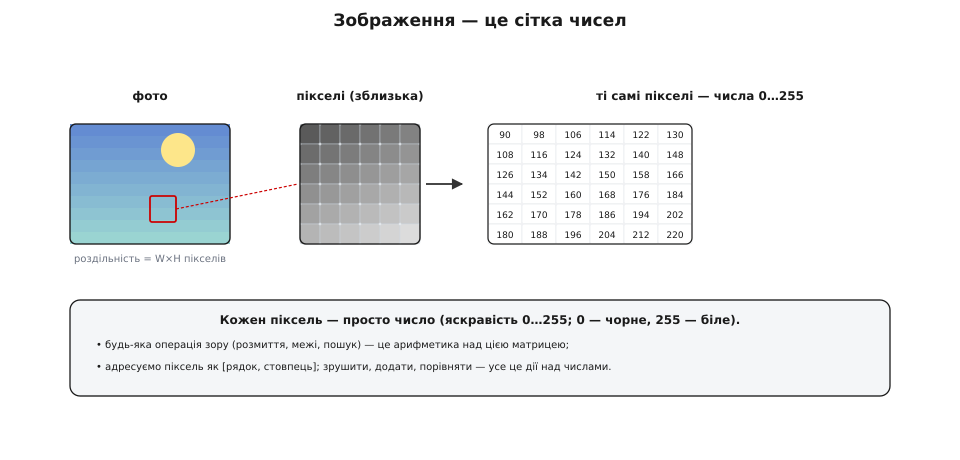
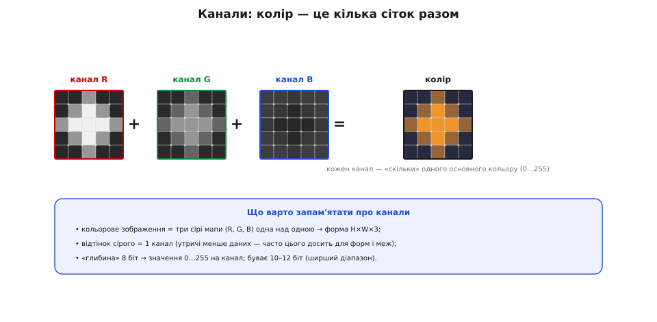
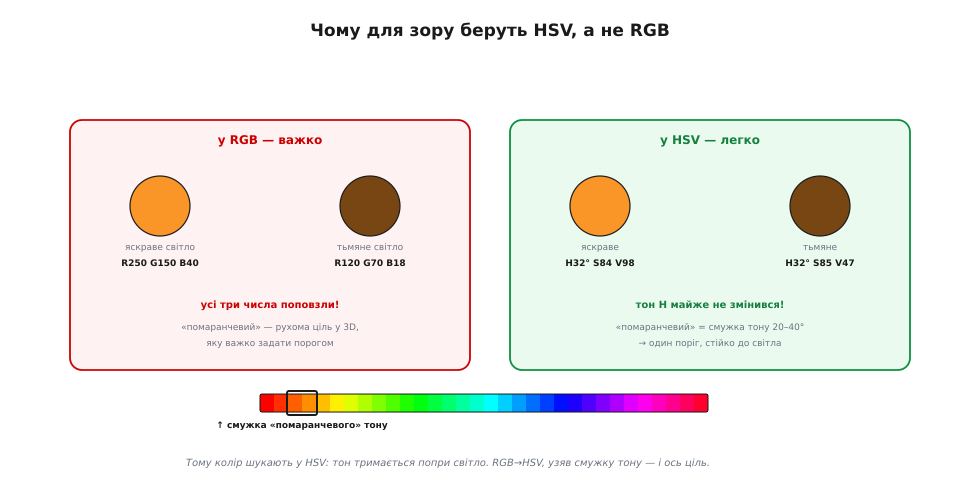

# Зображення як дані: піксель, канали, колірні простори

<preknowlist>
- [Біти й порядок байтів](topic:programming/bits-bytes-endianness) — число в пам'яті складається з байтів по 8 біт; 8 біт дають рівно 256 різних значень.
- [Пам'ять як масив](topic:programming/memory-as-array) — пам'ять плоска: усі числа лежать одним довгим рядком байтів, і до кожного дістаються за адресою-зсувом.
</preknowlist>

Машинне бачення колись здавалося справою одного літа: 1966 року в MIT його [замовили студентам як канікулярний проєкт](topic:algorithms/image-as-data/hist-summer-vision.md) — підключити камеру й за літо описати, що вона бачить. Проєкт розтягнувся на десятиліття, бо між камерою й розумінням лежить прірва. Та початок тієї прірви — найскромніший: перш ніж машина «побачить», треба зрозуміти, **чим** для неї є зображення. А воно для машини — не картинка, а **дані**: великий стіл чисел. Ця тема перетворює слово «зображення» на слово «матриця» — і саме звідси починається все машинне бачення.

### Піксель і сітка чисел

**Піксель** (від англ. *picture element* — «елемент зображення») — це атом картинки: одна точка з певним значенням. Усе зображення — **прямокутна сітка** таких точок, тобто **матриця** чисел. Скільки їх — каже **роздільність**: ширина × висота в пікселях (наприклад, 1920×1080).


*Зображення — це сітка чисел. Наблизься до фото — і воно розпадеться на **пікселі**, кожен з яких — просто **число** (тут — яскравість від 0 = чорне до 255 = біле). А отже, будь-яка дія зору — розмиття, пошук меж, виявлення цілі — це **арифметика** над цією матрицею. Піксель адресують як `[рядок, стовпець]`.*

Для відтінкового (сірого) зображення кожен піксель — **одне** число яскравості, зазвичай від 0 (чорне) до 255 (біле). Це і є вся «магія»: коли йдеться про [фільтри](topic:algorithms/convolution-filters), [межі](topic:algorithms/edge-detection) чи розпізнавання, насправді йдеться про **дії над числами** в цій сітці — додати, зрушити, помножити, порівняти. Машина не «дивиться» — вона **рахує**.

### Канали: колір — це кілька сіток разом

А як же **колір**? Кольоровий піксель — це вже не одне число, а **кілька**. Кожне з них живе у своєму **каналі** (від англ. *channel* — «русло», «доріжка»): окрема смуга, що несе одну складову кольору. Найпоширеніше кодування — **RGB**: три канали, скільки в пікселі **червоного** (R), **зеленого** (G) і **синього** (B), кожне 0…255. Тобто кольорове зображення — це **три сірі мапи** одна над одною, по одній на кожен основний колір.


*Кольорове зображення — це три накладені сірі мапи: канал **R** (скільки червоного), **G** (зеленого) і **B** (синього), кожна 0…255. Разом вони дають колір. Звідси форма масиву **H×W×3** (висота × ширина × канали). Відтінок сірого — це **1** канал: утричі менше даних, і часто його досить для форм і меж.*

Звідси й «форма» цифрового зображення: масив **H×W×C** — висота на ширину на число каналів (3 для RGB, 1 для сірого, інколи 4 з прозорістю). Скільки різних рівнів вміщає один канал, каже **бітова глибина** (англ. *bit depth* — «глибина в бітах», від *bit* — *binary digit*, «двійкова цифра»): 8 біт дають звичні 2⁸ = 256 рівнів, тобто 0…255 на канал; буває й 10–12 біт — тонші переходи й ширший [динамічний діапазон](topic:electronics/dynamic-range-noise) яскравостей. Практичний висновок звідси прямий: **сіре зображення втричі легше** за кольорове — тож коли задача про **форму** чи **межі**, а не про колір, беруть саме сіре, заощаджуючи пам'ять і обчислення.

### Як ці числа лежать у пам'яті: рядковий крок

«Матриця» — це для нас зручний образ, та пам'ять плоска: усі числа лежать **одним довгим рядком** байтів, рядок за рядком згори вниз. Щоб дістати конкретний піксель `(x, y)`, треба знати, **на скільки байтів** від початку він стоїть. Тут і з'являється **рядковий крок** (англ. *stride* — «крок», також *row stride* чи *pitch*): скільки байтів займає **один рядок** зображення. У найпростішому разі це просто `ширина × байтів_на_піксель`, але часто рядок **доповнюють** до круглого числа (кратного 4 чи 16 байтам) заради вирівнювання — і тоді крок **більший** за саму ширину, а «хвіст» рядка нічого не зберігає. Саме тому адресу рахують через крок, а не через ширину: інакше з вирівняним буфером зсунешся не на той піксель.

Адреса першого байта пікселя в плоскому буфері — це база масиву плюс зсув: повні рядки над ним, плюс позиція в його рядку.

:::tabs
```cpp
// bpp — байтів на піксель (1 для сірого 8-біт, 3 для RGB888)
// stride — байтів на рядок (>= width*bpp, з урахуванням вирівнювання)
uint8_t *pixel = base + y * stride + x * bpp;   // ← початок пікселя (x, y)
```
```python
# bpp — байтів на піксель (1 для сірого 8-біт, 3 для RGB888)
# stride — байтів на рядок (>= width*bpp, з урахуванням вирівнювання)
off = y * stride + x * bpp          # ← зсув початку пікселя (x, y)
pixel = buf[off:off + bpp]          # buf — плоский bytes/bytearray
```
:::

> 🔧 **Навіщо це.** Беручи кадр прямо з драйвера камери чи з буфера дисплея, ти майже завжди отримуєш сирий `uint8_t*` і `stride`, а не готовий двовимірний масив. Адресуєш через `y*stride + x*bpp` — код працює і на щільному, і на вирівняному буфері. Візьмеш `y*width*bpp`, забувши крок, — на вирівняному кадрі кожен наступний рядок почнеться на кілька байтів раніше, зсуви складуться, і картинка «поїде» навскіс характерними діагональними смугами. На бортовому залізі це найчастіша мовчазна пастка роботи із зображенням.

### Звести до сірого — типова перша дія

Раз сіре втричі легше, типова **перша дія** машинного бачення — звести кольоровий кадр до сірого. Але не будь-як: око чутливіше до зеленого й найменше до синього, тож «яскравість» — це не середнє трьох каналів, а їх **зважена** сума (коефіцієнти яскравості стандарту Rec. 601):

:::tabs
```cpp
// RGB888 -> 8-бітне сіре (зважене за чутливістю ока, цілочисельно)
// Y = 0.299*R + 0.587*G + 0.114*B  ≈  (77*R + 150*G + 29*B) >> 8
uint8_t gray = (uint8_t)((77 * R + 150 * G + 29 * B) >> 8);
```
```python
# RGB888 -> 8-бітне сіре (зважене за чутливістю ока, цілочисельно)
# Y = 0.299*R + 0.587*G + 0.114*B  ≈  (77*R + 150*G + 29*B) >> 8
gray = (77 * R + 150 * G + 29 * B) >> 8   # 0…255, як uint8
```
:::

Підставимо помаранчевий піксель R=240, G=140, B=20:

```text
77·240 + 150·140 + 29·20  =  18480 + 21000 + 580  =  40060
40060 >> 8  =  40060 / 256  =  156   → gray = 156
```

Помаранчевий стає світло-сірим (156 з 255): яскравість збереглася, колір зник. Множення на цілі ваги й зсув `>> 8` замість ділення взято не випадково — на мікроконтролері без апаратного ділення це **в рази** швидше, а похибка проти точних дробових коефіцієнтів мізерна.

### Колірні простори: різні записи того самого кольору

RGB — не єдиний спосіб записати колір. Той самий піксель можна закодувати **по-різному**, і кожне кодування зручне для свого. Ці способи звуть **колірними просторами**.


*Той самий піксель, три записи. **RGB** — адитивний, як у сенсора й екрана; зручний для показу, та яскравість «розмазана» по всіх трьох числах. **HSV** — окремо тон (H), насиченість (S) і яскравість (V); тон відділений від світла. **YUV/YCbCr** — яскравість (Y) окремо від колірності (U/V); так працюють відео й [JPEG](book:algorithms/jpeg-intra), і око бачить Y докладніше.*

Три головні для нас. **RGB** — як дає сенсор (після [демозаїки](topic:algorithms/bayer-demosaic)) і як світить екран; природний для показу, та незручний, щоб **шукати колір**, бо зміна освітлення зрушує всі три числа разом. **HSV** (тон, насиченість, яскравість) — розділяє **колір** (тон H) і **світло** (яскравість V); саме тому його люблять у машинному баченні. **YUV / YCbCr** — яскравість (Y) окремо від колірності; так зберігають відео й [JPEG](topic:algorithms/jpeg-intra), бо око до яскравості чутливіше, ніж до кольору.

### Чому для зору беруть HSV

Найпрактичніше тут — **HSV**, і ось чому. Уяви, що треба знайти в кадрі **помаранчевий м'яч**. У **RGB** це пекло: на сонці м'яч дає одні числа, у тіні — геть інші (бо світло змінює R, G і B водночас), тож «помаранчевий» стає **рухомою ціллю** в тривимірному просторі чисел.


*Той самий м'яч на яскравому й тьмяному світлі. У **RGB** усі три числа сильно поповзли (R250 G150 B40 → R120 G70 B18) — поріг задати важко. У **HSV** змінилася лише яскравість V, а **тон H тримається ≈32°** — тож «помаранчевий» — це стала **смужка тону** (≈20–40°). Один поріг по тону — і ціль знайдено, стійко до освітлення.*

У **HSV** усе простіше: міняється світло — повзе лише **яскравість** (V), а **тон** (H) тримається майже сталим. Тож «помаранчевий» стає **смужкою тону** (скажімо, 20–40°), яку легко відсікти **одним порогом** — і то стійко до зміни освітлення. Звідси типовий прийом машинного бачення: перевести кадр **RGB → HSV** і [шукати колір по тону](topic:algorithms/object-detection). Саме [перетворення виводиться покроково](topic:algorithms/image-as-data/math-color-spaces.md) (звідки формули й де тон не існує), а на бортовому MCU без плаваючої коми його роблять [цілочисельно, масштабом ×255](topic:algorithms/image-as-data/proj-rgb-hsv-convert.md).

Думка «колір = три канали» не нова: ще 1861 року Джеймс Клерк Максвелл [наочно показав це потрійною фотографією стрічки](topic:algorithms/image-as-data/hist-maxwell-rgb.md) — стрічку зняли тричі крізь червоний, зелений і синій фільтри, а тоді склали назад у колір. Рівно те, що сьогодні роблять сенсор і екран.

Отож два робочі правила осідають самі собою. Шукаєш **кольорову** ціль — переводь у HSV і лови по тону, бо тон майже не залежить від світла. Працюєш із **формою** чи **межами** — бери **сіре**: утричі дешевше й теж байдуже до кольору, бо все зводиться до [згортки](topic:algorithms/convolution-filters) і [пошуку меж](topic:algorithms/edge-detection). І пам'ятай про ціну: більша роздільність і глибша бітність — це більше пам'яті й [обчислень для бортового заліза](topic:algorithms/compute-cost), а кадр із відеопотоку майже напевно прийде вже у YUV і в одному з [пакетних форматів буферів камери](topic:algorithms/pixel-formats). Коли ж зображення зведене до чисел, постає й перше запитання про самі ці числа — як вони **розподілені** за яскравістю: контраст, темні й світлі ділянки, і як їх вирівняти. Це вже [гістограма](topic:algorithms/histogram).
