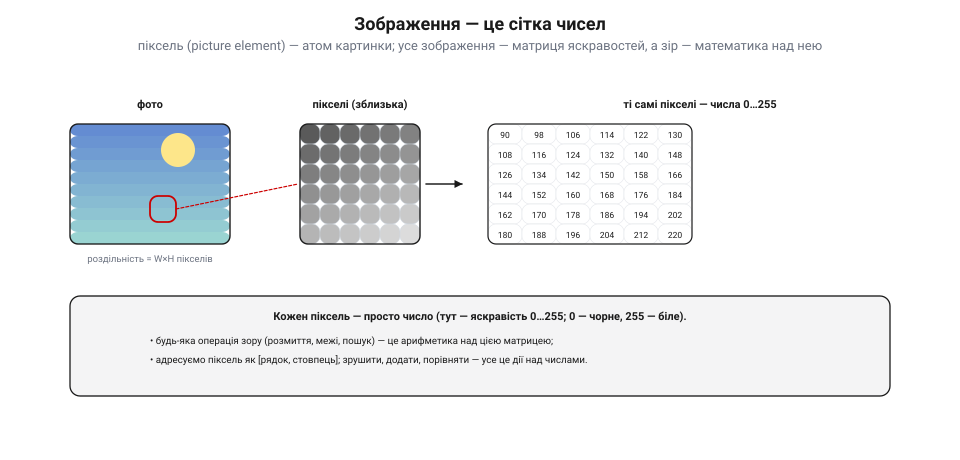
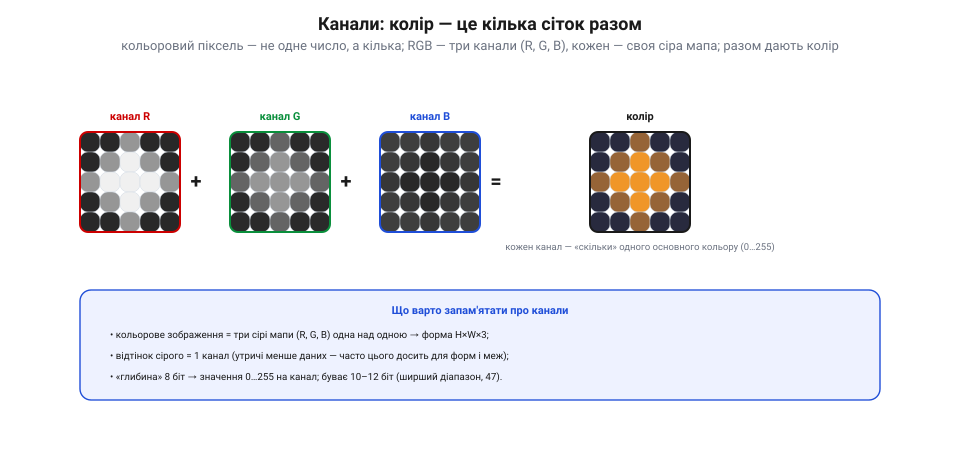
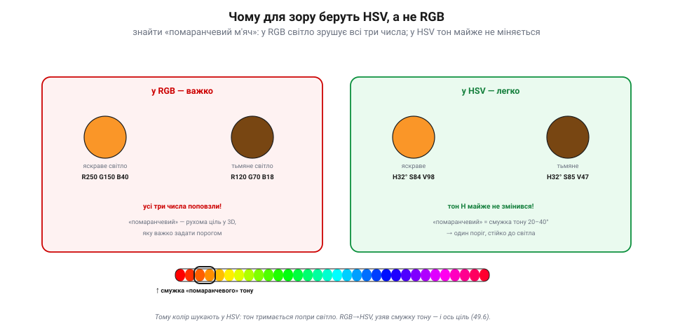

# Зображення як дані: піксель, канали, колірні простори

Щоб машина «бачила», спершу треба зрозуміти, **чим** для неї є зображення. А воно для машини — не картинка, а **дані**: великий стіл чисел. Ця тема перетворює слово «зображення» на слово «матриця» — і саме з цього починається все машинне бачення.

### Піксель і сітка чисел

**Піксель** (від англ. *picture element* — «елемент зображення») — це атом картинки: одна точка з певним значенням. Усе зображення — це **прямокутна сітка** таких точок, тобто **матриця** чисел. Скільки їх — каже **роздільність**: ширина × висота в пікселях (наприклад, 1920×1080).

*Рис. Зображення — це сітка чисел. Наблизься до фото — і воно розпадеться на **пікселі**, кожен з яких — просто **число** (тут — яскравість від 0 = чорне до 255 = біле). А отже, будь-яка дія зору — розмиття, пошук меж, виявлення цілі — це **арифметика** над цією матрицею. Піксель адресують як `[рядок, стовпець]`.*

Для відтінкового (сірого) зображення кожен піксель — **одне** число яскравості, зазвичай від 0 (чорне) до 255 (біле). Це і є вся «магія»: коли йдеться про [фільтри](book:algorithms/convolution-filters), [межі](book:algorithms/edge-detection) чи розпізнавання, насправді йдеться про **дії над числами** в цій сітці — додати, зрушити, помножити, порівняти. Машина не «дивиться» — вона **рахує**.

### Канали: колір — це кілька сіток разом

А як же **колір**? Кольоровий піксель — це вже не одне число, а **кілька**. Найпоширеніше — **RGB**: три числа, скільки в пікселі **червоного** (R), **зеленого** (G) і **синього** (B), кожне 0…255. Тобто кольорове зображення — це **три сірі мапи** одна над одною, по одній на кожен основний колір.

*Рис. Канали. Кольорове зображення — це три накладені сірі мапи: канал **R** (скільки червоного), **G** (зеленого) і **B** (синього), кожна 0…255. Разом вони дають колір. Звідси форма масиву **H×W×3** (висота × ширина × канали). Відтінок сірого — це **1** канал (утричі менше даних, і часто його досить для форм і меж).*

Звідси й «форма» цифрового зображення: масив **H×W×C** — висота на ширину на число каналів (3 для RGB, 1 для сірого, інколи 4 з прозорістю). «Глибина» 8 біт дає звичні 0…255 на канал; буває й 10–12 біт — ширший [динамічний діапазон](book:electronics/dynamic-range-noise) яскравостей. Важливий практичний висновок: **сіре зображення втричі легше** за кольорове, тож коли задача про **форму** чи **межі**, а не про колір, його часто й беруть — заощаджуючи пам'ять і обчислення.

### Колірні простори: різні способи записати той самий колір

RGB — не єдиний спосіб записати колір. Той самий піксель можна закодувати **по-різному**, і кожне кодування зручне для свого. Ці способи звуть **колірними просторами**.

*Рис. Колірні простори. Той самий піксель, три записи. **RGB** — адитивний, як у сенсора й екрана; зручний для показу, та яскравість «розмазана» по всіх трьох числах. **HSV** — окремо тон (H), насиченість (S) і яскравість (V); тон відділений від світла. **YUV/YCbCr** — яскравість (Y) окремо від колірності (U/V); так працюють відео й [JPEG](book:algorithms/jpeg-intra), і око бачить Y докладніше.*

Три головні для нас. **RGB** — як дає сенсор (після [демозаїки](book:algorithms/bayer-demosaic)) і як світить екран; природний для показу, та незручний, щоб **шукати колір**, бо зміна освітлення зрушує всі три числа разом. **HSV** (тон, насиченість, яскравість) — розділяє **колір** (тон H) і **світло** (яскравість V); саме тому його люблять у машинному баченні. **YUV / YCbCr** — яскравість (Y) окремо від колірності; так зберігають відео й [JPEG](book:algorithms/jpeg-intra), бо око до яскравості чутливіше, ніж до кольору.

### Чому для зору беруть HSV

Найпрактичніше тут — **HSV**, і ось чому. Уяви, що треба знайти в кадрі **помаранчевий м'яч**. У **RGB** це пекло: на сонці м'яч дає одні числа, у тіні — геть інші (бо світло змінює R, G і B водночас), тож «помаранчевий» стає **рухомою ціллю** в тривимірному просторі чисел.

*Рис. Чому HSV. Той самий м'яч на яскравому й тьмяному світлі. У **RGB** усі три числа сильно поповзли (R250 G150 B40 → R120 G70 B18) — поріг задати важко. У **HSV** змінилася лише яскравість V, а **тон H тримається ≈32°** — тож «помаранчевий» — це стала **смужка тону** (≈20–40°). Один поріг по тону — і ціль знайдено, стійко до освітлення.*

У **HSV** усе простіше: міняється світло — повзе лише **яскравість** (V), а **тон** (H) тримається майже сталим. Тож «помаранчевий» стає **смужкою тону** (скажімо, 20–40°), яку легко відсікти **одним порогом** — і то стійко до зміни освітлення. Звідси типовий прийом машинного бачення: перевести кадр **RGB → HSV** і [шукати колір по тону](book:algorithms/object-detection). А для **форми** й **меж** беруть **сіре** — дешевше й теж байдуже до кольору, бо все зводиться до [згортки](book:algorithms/convolution-filters) і [пошуку меж](book:algorithms/edge-detection).

> 📜 **Перша кольорова фотографія: стрічку зняли тричі — і склали колір.** Думка, що колір — це **три канали**, не нова: її вперше **показали** ще 1861 року. Шотландський фізик **Джеймс Клерк Максвелл** (той самий, чиї рівняння описують електромагнетизм) припустив, що будь-який колір можна відтворити, змішавши три — червоне, зелене й синє. Щоб довести це, на лекції в Королівському інституті він зробив дослід: фотограф **Томас Саттон** зняв барвисту шотландську **стрічку** (tartan) **тричі** — крізь червоний, зелений і синій світлофільтри, діставши три **чорно-білі** платівки. Тоді ці платівки спроєктували трьома ліхтарями крізь ті самі фільтри, наклавши зображення одне на одне, — і на екрані спалахнула **перша у світі кольорова фотографія**. Це і є рівно те, що сьогодні робить кожен сенсор і екран: колір — це **три накладені канали** (R, G, B). Максвелл показав принцип за століття до того, як ми навчили цьому машини; з того досліду й тягнеться нитка просто до того, як твій дрон зберігає кадр.

> 🔧 **Навіщо це.** Тверди собі: зображення — це **масив чисел**, і кожна операція зору — математика над ним. Не «дивись» на колір як на одне ціле — пам'ятай про **канали**. Шукаєш кольорову ціль (м'яч, стрічку, маркер) — переводь у **HSV** і лови по тону: стійко до світла. Працюєш із **формою** чи **межами** — бери **сіре**: утричі дешевше й байдуже до кольору. І зважай на **роздільність** та **глибину**: що більше пікселів і бітів — то більше пам'яті й [обчислень для бортового заліза](book:algorithms/compute-cost). А якщо береш кадр прямо з відеопотоку — він, найпевніше, уже у **YUV** (як у [JPEG](book:algorithms/jpeg-intra)), і це теж варто врахувати.

### Підсумок теми

Для машини зображення — це **дані**: матриця чисел, де піксель — атом, а число — його яскравість. Колір додає **канали**: RGB — три накладені сірі мапи (форма H×W×3), сіре — одна (втричі дешевше). Той самий колір можна записати в різних **колірних просторах** — RGB (сенсор/екран), HSV (тон окремо від світла), YUV (яскравість окремо, для кодеків), — і вибирають той, у якому задача **легша**: HSV, щоб шукати колір стійко до освітлення; сіре, щоб працювати з формою. А принцип «колір = три канали» нам ще 1861-го показав Максвелл своєю потрійною фотографією стрічки. Коли зображення — це числа, наступне природне питання — як ці числа **розподілені**: яскравість, контраст і [гістограма](book:algorithms/histogram).
